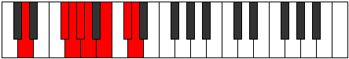
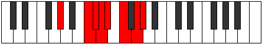

# Mode Zogian

## Links

- [Documentation](index.md)
- [Scales Index](Scales.md)
- [Modes Index](Modes.md)
- [Chords Index](Chords.md)

## Parent Scale

[Zogian](ScaleZogian.md)

## Number

[2801](https://ianring.com/musictheory/scales/2801)

## Perfection

- 5 Perfect notes
- 2 Perfect notes

## Perfection Profile

[true true true false false true true]

## Permutations

| Tonic | Notes | Signature | Illustration | Audio |
|-------|-------|-----------|--------------|-------|
| [C](ModeCNaturalZogian.md) | C, D##, E#, **F#**, **G**, A, B, C | C |  | [midi](ModeCNaturalZogian.mid) [ogg](ModeCNaturalZogian.ogg) |
| [C#](ModeCSharpZogian.md) | C#, D###, E##, **F##**, **G#**, A#, B#, C# | C |  | [midi](ModeCSharpZogian.mid) [ogg](ModeCSharpZogian.ogg) |
| [Db](ModeDFlatZogian.md) | Db, E#, F#, **G**, **Ab**, Bb, C, Db | C |  | [midi](ModeDFlatZogian.mid) [ogg](ModeDFlatZogian.ogg) |
| [D](ModeDNaturalZogian.md) | D, E##, F##, **G#**, **A**, B, C#, D | C |  | [midi](ModeDNaturalZogian.mid) [ogg](ModeDNaturalZogian.ogg) |
| [D#](ModeDSharpZogian.md) | D#, E###, F###, **G##**, **A#**, B#, C##, D# | C |  | [midi](ModeDSharpZogian.mid) [ogg](ModeDSharpZogian.ogg) |
| [Eb](ModeEFlatZogian.md) | Eb, F##, G#, **A**, **Bb**, C, D, Eb | C |  | [midi](ModeEFlatZogian.mid) [ogg](ModeEFlatZogian.ogg) |
| [E](ModeENaturalZogian.md) | E, F###, G##, **A#**, **B**, C#, D#, E | C |  | [midi](ModeENaturalZogian.mid) [ogg](ModeENaturalZogian.ogg) |
| [F](ModeFNaturalZogian.md) | F, G##, A#, **B**, **C**, D, E, F | C |  | [midi](ModeFNaturalZogian.mid) [ogg](ModeFNaturalZogian.ogg) |
| [F#](ModeFSharpZogian.md) | F#, G###, A##, **B#**, **C#**, D#, E#, F# | C |  | [midi](ModeFSharpZogian.mid) [ogg](ModeFSharpZogian.ogg) |
| [Gb](ModeGFlatZogian.md) | Gb, A#, B, **C**, **Db**, Eb, F, Gb | C |  | [midi](ModeGFlatZogian.mid) [ogg](ModeGFlatZogian.ogg) |
| [G](ModeGNaturalZogian.md) | G, A##, B#, **C#**, **D**, E, F#, G | C |  | [midi](ModeGNaturalZogian.mid) [ogg](ModeGNaturalZogian.ogg) |
| [G#](ModeGSharpZogian.md) | G#, A###, B##, **C##**, **D#**, E#, F##, G# | C |  | [midi](ModeGSharpZogian.mid) [ogg](ModeGSharpZogian.ogg) |
| [Ab](ModeAFlatZogian.md) | Ab, B#, C#, **D**, **Eb**, F, G, Ab | C |  | [midi](ModeAFlatZogian.mid) [ogg](ModeAFlatZogian.ogg) |
| [A](ModeANaturalZogian.md) | A, B##, C##, **D#**, **E**, F#, G#, A | C |  | [midi](ModeANaturalZogian.mid) [ogg](ModeANaturalZogian.ogg) |
| [A#](ModeASharpZogian.md) | A#, B###, C###, **D##**, **E#**, F##, G##, A# | C |  | [midi](ModeASharpZogian.mid) [ogg](ModeASharpZogian.ogg) |
| [Bb](ModeBFlatZogian.md) | Bb, C##, D#, **E**, **F**, G, A, Bb | C |  | [midi](ModeBFlatZogian.mid) [ogg](ModeBFlatZogian.ogg) |
| [B](ModeBNaturalZogian.md) | B, C###, D##, **E#**, **F#**, G#, A#, B | C |  | [midi](ModeBNaturalZogian.mid) [ogg](ModeBNaturalZogian.ogg) |
