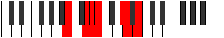

# Mode Zogimic

## Links

- [Documentation](index.md)
- [Scales Index](Scales.md)
- [Modes Index](Modes.md)
- [Chords Index](Chords.md)

## Parent Scale

[Epygimic](ScaleEpygimic.md)

## Number

[1593](https://ianring.com/musictheory/scales/1593)

## Interval Pattern

3, 1, 1, 4, 1, 2

## Chord Pattern

IV, v⁰, v

## Perfection

- 4 Perfect notes
- 2 Perfect notes

## Perfection Profile

[false true false true true true]

## Permutations

| Tonic | Notes | Signature | Illustration | Audio |
|-------|-------|-----------|--------------|-------|
| [C](ModeCNaturalZogimic.md) | **C**, D#, **E**, F, G##, A#, **C** | C |  | [midi](https://github.com/edipermadi/music/blob/main/docs/ModeCNaturalZogimic.mid?raw=true) |
| [C#](ModeCSharpZogimic.md) | **C#**, D##, **E#**, F#, G###, A##, **C#** | C |  | [midi](https://github.com/edipermadi/music/blob/main/docs/ModeCSharpZogimic.mid?raw=true) |
| [Db](ModeDFlatZogimic.md) | **Db**, E, **F**, Gb, A#, B, **Db** | C |  | [midi](https://github.com/edipermadi/music/blob/main/docs/ModeDFlatZogimic.mid?raw=true) |
| [D](ModeDNaturalZogimic.md) | **D**, E#, **F#**, G, A##, B#, **D** | C |  | [midi](https://github.com/edipermadi/music/blob/main/docs/ModeDNaturalZogimic.mid?raw=true) |
| [D#](ModeDSharpZogimic.md) | **D#**, E##, **F##**, G#, A###, B##, **D#** | C |  | [midi](https://github.com/edipermadi/music/blob/main/docs/ModeDSharpZogimic.mid?raw=true) |
| [Eb](ModeEFlatZogimic.md) | **Eb**, F#, **G**, Ab, B#, C#, **Eb** | C |  | [midi](https://github.com/edipermadi/music/blob/main/docs/ModeEFlatZogimic.mid?raw=true) |
| [E](ModeENaturalZogimic.md) | **E**, F##, **G#**, A, B##, C##, **E** | C |  | [midi](https://github.com/edipermadi/music/blob/main/docs/ModeENaturalZogimic.mid?raw=true) |
| [F](ModeFNaturalZogimic.md) | **F**, G#, **A**, Bb, C##, D#, **F** | C |  | [midi](https://github.com/edipermadi/music/blob/main/docs/ModeFNaturalZogimic.mid?raw=true) |
| [F#](ModeFSharpZogimic.md) | **F#**, G##, **A#**, B, C###, D##, **F#** | C |  | [midi](https://github.com/edipermadi/music/blob/main/docs/ModeFSharpZogimic.mid?raw=true) |
| [Gb](ModeGFlatZogimic.md) | **Gb**, A, **Bb**, Cb, D#, E, **Gb** | C |  | [midi](https://github.com/edipermadi/music/blob/main/docs/ModeGFlatZogimic.mid?raw=true) |
| [G](ModeGNaturalZogimic.md) | **G**, A#, **B**, C, D##, E#, **G** | C |  | [midi](https://github.com/edipermadi/music/blob/main/docs/ModeGNaturalZogimic.mid?raw=true) |
| [G#](ModeGSharpZogimic.md) | **G#**, A##, **B#**, C#, D###, E##, **G#** | C |  | [midi](https://github.com/edipermadi/music/blob/main/docs/ModeGSharpZogimic.mid?raw=true) |
| [Ab](ModeAFlatZogimic.md) | **Ab**, B, **C**, Db, E#, F#, **Ab** | C |  | [midi](https://github.com/edipermadi/music/blob/main/docs/ModeAFlatZogimic.mid?raw=true) |
| [A](ModeANaturalZogimic.md) | **A**, B#, **C#**, D, E##, F##, **A** | C |  | [midi](https://github.com/edipermadi/music/blob/main/docs/ModeANaturalZogimic.mid?raw=true) |
| [A#](ModeASharpZogimic.md) | **A#**, B##, **C##**, D#, E###, F###, **A#** | C |  | [midi](https://github.com/edipermadi/music/blob/main/docs/ModeASharpZogimic.mid?raw=true) |
| [Bb](ModeBFlatZogimic.md) | **Bb**, C#, **D**, Eb, F##, G#, **Bb** | C |  | [midi](https://github.com/edipermadi/music/blob/main/docs/ModeBFlatZogimic.mid?raw=true) |
| [B](ModeBNaturalZogimic.md) | **B**, C##, **D#**, E, F###, G##, **B** | C |  | [midi](https://github.com/edipermadi/music/blob/main/docs/ModeBNaturalZogimic.mid?raw=true) |
