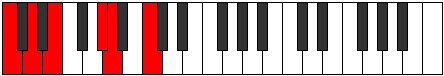

# Mode Zogitonic

## Links

- [Documentation](index.md)
- [Scales Index](Scales.md)
- [Modes Index](Modes.md)
- [Chords Index](Chords.md)

## Parent Scale

[Epygitonic](ScaleEpygitonic.md)

## Number

[789](https://ianring.com/musictheory/scales/789)

## Perfection

- 2 Perfect notes
- 3 Perfect notes

## Perfection Profile

[false true false false true]

## Permutations

| Tonic | Notes | Signature | Illustration | Audio |
|-------|-------|-----------|--------------|-------|
| [C](ModeCNaturalZogitonic.md) | **C**, D, **E**, **G#**, A, **C** | C |  | [midi](ModeCNaturalZogitonic.mid) [ogg](ModeCNaturalZogitonic.ogg) |
| [C#](ModeCSharpZogitonic.md) | **C#**, D#, **F**, **A**, A#, **C#** | C |  | [midi](ModeCSharpZogitonic.mid) [ogg](ModeCSharpZogitonic.ogg) |
| [Db](ModeDFlatZogitonic.md) | **Db**, Eb, **F**, **A**, Bb, **Db** | C |  | [midi](ModeDFlatZogitonic.mid) [ogg](ModeDFlatZogitonic.ogg) |
| [D](ModeDNaturalZogitonic.md) | **D**, E, **F#**, **A#**, B, **D** | C |  | [midi](ModeDNaturalZogitonic.mid) [ogg](ModeDNaturalZogitonic.ogg) |
| [D#](ModeDSharpZogitonic.md) | **D#**, F, **G**, **B**, C, **D#** | C |  | [midi](ModeDSharpZogitonic.mid) [ogg](ModeDSharpZogitonic.ogg) |
| [Eb](ModeEFlatZogitonic.md) | **Eb**, F, **G**, **B**, C, **Eb** | C |  | [midi](ModeEFlatZogitonic.mid) [ogg](ModeEFlatZogitonic.ogg) |
| [E](ModeENaturalZogitonic.md) | **E**, F#, **G#**, **C**, C#, **E** | C |  | [midi](ModeENaturalZogitonic.mid) [ogg](ModeENaturalZogitonic.ogg) |
| [F](ModeFNaturalZogitonic.md) | **F**, G, **A**, **C#**, D, **F** | C |  | [midi](ModeFNaturalZogitonic.mid) [ogg](ModeFNaturalZogitonic.ogg) |
| [F#](ModeFSharpZogitonic.md) | **F#**, G#, **A#**, **D**, D#, **F#** | C |  | [midi](ModeFSharpZogitonic.mid) [ogg](ModeFSharpZogitonic.ogg) |
| [Gb](ModeGFlatZogitonic.md) | **Gb**, Ab, **Bb**, **D**, Eb, **Gb** | C |  | [midi](ModeGFlatZogitonic.mid) [ogg](ModeGFlatZogitonic.ogg) |
| [G](ModeGNaturalZogitonic.md) | **G**, A, **B**, **D#**, E, **G** | C |  | [midi](ModeGNaturalZogitonic.mid) [ogg](ModeGNaturalZogitonic.ogg) |
| [G#](ModeGSharpZogitonic.md) | **G#**, A#, **C**, **E**, F, **G#** | C |  | [midi](ModeGSharpZogitonic.mid) [ogg](ModeGSharpZogitonic.ogg) |
| [Ab](ModeAFlatZogitonic.md) | **Ab**, Bb, **C**, **E**, F, **Ab** | C |  | [midi](ModeAFlatZogitonic.mid) [ogg](ModeAFlatZogitonic.ogg) |
| [A](ModeANaturalZogitonic.md) | **A**, B, **C#**, **F**, F#, **A** | C |  | [midi](ModeANaturalZogitonic.mid) [ogg](ModeANaturalZogitonic.ogg) |
| [A#](ModeASharpZogitonic.md) | **A#**, C, **D**, **F#**, G, **A#** | C |  | [midi](ModeASharpZogitonic.mid) [ogg](ModeASharpZogitonic.ogg) |
| [Bb](ModeBFlatZogitonic.md) | **Bb**, C, **D**, **Gb**, G, **Bb** | C |  | [midi](ModeBFlatZogitonic.mid) [ogg](ModeBFlatZogitonic.ogg) |
| [B](ModeBNaturalZogitonic.md) | **B**, C#, **D#**, **G**, G#, **B** | C |  | [midi](ModeBNaturalZogitonic.mid) [ogg](ModeBNaturalZogitonic.ogg) |
