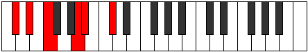
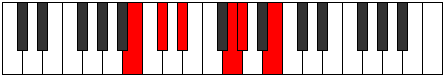

# Mode Zogitonic

## Links

- [Documentation](README.md)
- [Scales Index](Scales.md)
- [Modes Index](Modes.md)
- [Chords Index](Chords.md)

## Parent Scale

[Epygitonic](ScaleEpygitonic.md)

## Number

[789](https://ianring.com/musictheory/scales/789)

## Transposition

2, 2, 4, 1, 3

## Chord Pattern

IV⁺

## Perfection

- 2 Perfect notes
- 3 Perfect notes

## Perfection Profile

[false true false false true]

## Permutations

| Tonic | Notes | Signature | Illustration | Audio |
|-------|-------|-----------|--------------|-------|
| [C](ModeCNaturalZogitonic.md) | **C**, D, **E**, **G#**, A, **C** | C |  | [midi](https://github.com/edipermadi/music/blob/main/docs/ModeCNaturalZogitonic.mid?raw=true) |
| [C#](ModeCSharpZogitonic.md) | **C#**, D#, **F**, **A**, A#, **C#** | C |  | [midi](https://github.com/edipermadi/music/blob/main/docs/ModeCSharpZogitonic.mid?raw=true) |
| [Db](ModeDFlatZogitonic.md) | **Db**, Eb, **F**, **A**, Bb, **Db** | C |  | [midi](https://github.com/edipermadi/music/blob/main/docs/ModeDFlatZogitonic.mid?raw=true) |
| [D](ModeDNaturalZogitonic.md) | **D**, E, **F#**, **A#**, B, **D** | C |  | [midi](https://github.com/edipermadi/music/blob/main/docs/ModeDNaturalZogitonic.mid?raw=true) |
| [D#](ModeDSharpZogitonic.md) | **D#**, F, **G**, **B**, C, **D#** | C |  | [midi](https://github.com/edipermadi/music/blob/main/docs/ModeDSharpZogitonic.mid?raw=true) |
| [Eb](ModeEFlatZogitonic.md) | **Eb**, F, **G**, **B**, C, **Eb** | C |  | [midi](https://github.com/edipermadi/music/blob/main/docs/ModeEFlatZogitonic.mid?raw=true) |
| [E](ModeENaturalZogitonic.md) | **E**, F#, **G#**, **C**, C#, **E** | C |  | [midi](https://github.com/edipermadi/music/blob/main/docs/ModeENaturalZogitonic.mid?raw=true) |
| [F](ModeFNaturalZogitonic.md) | **F**, G, **A**, **C#**, D, **F** | C |  | [midi](https://github.com/edipermadi/music/blob/main/docs/ModeFNaturalZogitonic.mid?raw=true) |
| [F#](ModeFSharpZogitonic.md) | **F#**, G#, **A#**, **D**, D#, **F#** | C |  | [midi](https://github.com/edipermadi/music/blob/main/docs/ModeFSharpZogitonic.mid?raw=true) |
| [Gb](ModeGFlatZogitonic.md) | **Gb**, Ab, **Bb**, **D**, Eb, **Gb** | C |  | [midi](https://github.com/edipermadi/music/blob/main/docs/ModeGFlatZogitonic.mid?raw=true) |
| [G](ModeGNaturalZogitonic.md) | **G**, A, **B**, **D#**, E, **G** | C |  | [midi](https://github.com/edipermadi/music/blob/main/docs/ModeGNaturalZogitonic.mid?raw=true) |
| [G#](ModeGSharpZogitonic.md) | **G#**, A#, **C**, **E**, F, **G#** | C |  | [midi](https://github.com/edipermadi/music/blob/main/docs/ModeGSharpZogitonic.mid?raw=true) |
| [Ab](ModeAFlatZogitonic.md) | **Ab**, Bb, **C**, **E**, F, **Ab** | C |  | [midi](https://github.com/edipermadi/music/blob/main/docs/ModeAFlatZogitonic.mid?raw=true) |
| [A](ModeANaturalZogitonic.md) | **A**, B, **C#**, **F**, F#, **A** | C |  | [midi](https://github.com/edipermadi/music/blob/main/docs/ModeANaturalZogitonic.mid?raw=true) |
| [A#](ModeASharpZogitonic.md) | **A#**, C, **D**, **F#**, G, **A#** | C |  | [midi](https://github.com/edipermadi/music/blob/main/docs/ModeASharpZogitonic.mid?raw=true) |
| [Bb](ModeBFlatZogitonic.md) | **Bb**, C, **D**, **Gb**, G, **Bb** | C |  | [midi](https://github.com/edipermadi/music/blob/main/docs/ModeBFlatZogitonic.mid?raw=true) |
| [B](ModeBNaturalZogitonic.md) | **B**, C#, **D#**, **G**, G#, **B** | C |  | [midi](https://github.com/edipermadi/music/blob/main/docs/ModeBNaturalZogitonic.mid?raw=true) |
