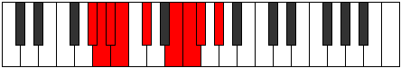

# Mode Zogyllic

## Links

- [Documentation](index.md)
- [Scales Index](Scales.md)
- [Modes Index](Modes.md)
- [Chords Index](Chords.md)

## Parent Scale

[Dagyllic](ScaleDagyllic.md)

## Number

[1839](https://ianring.com/musictheory/scales/1839)

## Perfection

- 6 Perfect notes
- 2 Perfect notes

## Perfection Profile

[false true true true true true false true]

## Permutations

| Tonic | Notes | Signature | Illustration | Audio |
|-------|-------|-----------|--------------|-------|
| [C](ModeCNaturalZogyllic.md) | **C**, C#, D, D#, F, G#, **A**, A#, **C** | C |  | [midi](ModeCNaturalZogyllic.mid) [ogg](ModeCNaturalZogyllic.ogg) |
| [C#](ModeCSharpZogyllic.md) | **C#**, D, D#, E, F#, A, **A#**, B, **C#** | C |  | [midi](ModeCSharpZogyllic.mid) [ogg](ModeCSharpZogyllic.ogg) |
| [Db](ModeDFlatZogyllic.md) | **Db**, D, Eb, E, Gb, A, **Bb**, B, **Db** | C |  | [midi](ModeDFlatZogyllic.mid) [ogg](ModeDFlatZogyllic.ogg) |
| [D](ModeDNaturalZogyllic.md) | **D**, D#, E, F, G, A#, **B**, C, **D** | C |  | [midi](ModeDNaturalZogyllic.mid) [ogg](ModeDNaturalZogyllic.ogg) |
| [D#](ModeDSharpZogyllic.md) | **D#**, E, F, F#, G#, B, **C**, C#, **D#** | C |  | [midi](ModeDSharpZogyllic.mid) [ogg](ModeDSharpZogyllic.ogg) |
| [Eb](ModeEFlatZogyllic.md) | **Eb**, E, F, Gb, Ab, B, **C**, Db, **Eb** | C |  | [midi](ModeEFlatZogyllic.mid) [ogg](ModeEFlatZogyllic.ogg) |
| [E](ModeENaturalZogyllic.md) | **E**, F, F#, G, A, C, **C#**, D, **E** | C |  | [midi](ModeENaturalZogyllic.mid) [ogg](ModeENaturalZogyllic.ogg) |
| [F](ModeFNaturalZogyllic.md) | **F**, F#, G, G#, A#, C#, **D**, D#, **F** | C |  | [midi](ModeFNaturalZogyllic.mid) [ogg](ModeFNaturalZogyllic.ogg) |
| [F#](ModeFSharpZogyllic.md) | **F#**, G, G#, A, B, D, **D#**, E, **F#** | C |  | [midi](ModeFSharpZogyllic.mid) [ogg](ModeFSharpZogyllic.ogg) |
| [Gb](ModeGFlatZogyllic.md) | **Gb**, G, Ab, A, B, D, **Eb**, E, **Gb** | C |  | [midi](ModeGFlatZogyllic.mid) [ogg](ModeGFlatZogyllic.ogg) |
| [G](ModeGNaturalZogyllic.md) | **G**, G#, A, A#, C, D#, **E**, F, **G** | C |  | [midi](ModeGNaturalZogyllic.mid) [ogg](ModeGNaturalZogyllic.ogg) |
| [G#](ModeGSharpZogyllic.md) | **G#**, A, A#, B, C#, E, **F**, F#, **G#** | C |  | [midi](ModeGSharpZogyllic.mid) [ogg](ModeGSharpZogyllic.ogg) |
| [Ab](ModeAFlatZogyllic.md) | **Ab**, A, Bb, B, Db, E, **F**, Gb, **Ab** | C |  | [midi](ModeAFlatZogyllic.mid) [ogg](ModeAFlatZogyllic.ogg) |
| [A](ModeANaturalZogyllic.md) | **A**, A#, B, C, D, F, **F#**, G, **A** | C |  | [midi](ModeANaturalZogyllic.mid) [ogg](ModeANaturalZogyllic.ogg) |
| [A#](ModeASharpZogyllic.md) | **A#**, B, C, C#, D#, F#, **G**, G#, **A#** | C |  | [midi](ModeASharpZogyllic.mid) [ogg](ModeASharpZogyllic.ogg) |
| [Bb](ModeBFlatZogyllic.md) | **Bb**, B, C, Db, Eb, Gb, **G**, Ab, **Bb** | C |  | [midi](ModeBFlatZogyllic.mid) [ogg](ModeBFlatZogyllic.ogg) |
| [B](ModeBNaturalZogyllic.md) | **B**, C, C#, D, E, G, **G#**, A, **B** | C |  | [midi](ModeBNaturalZogyllic.mid) [ogg](ModeBNaturalZogyllic.ogg) |
