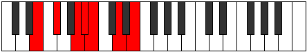

# Mode Zolimic

## Links

- [Documentation](index.md)
- [Scales Index](Scales.md)
- [Modes Index](Modes.md)
- [Chords Index](Chords.md)

## Parent Scale

[Dalimic](ScaleDalimic.md)

## Number

[1253](https://ianring.com/musictheory/scales/1253)

## Perfection

- 4 Perfect notes
- 2 Perfect notes

## Perfection Profile

[true false true false true true]

## Permutations

| Tonic | Notes | Signature | Illustration | Audio |
|-------|-------|-----------|--------------|-------|
| [C](ModeCNaturalZolimic.md) | C, **D**, E#, **F#**, G, A#, C | C |  | [midi](https://github.com/edipermadi/music/blob/main/docs/ModeCNaturalZolimic.mid?raw=true) |
| [C#](ModeCSharpZolimic.md) | C#, **D#**, E##, **F##**, G#, A##, C# | C |  | [midi](https://github.com/edipermadi/music/blob/main/docs/ModeCSharpZolimic.mid?raw=true) |
| [Db](ModeDFlatZolimic.md) | Db, **Eb**, F#, **G**, Ab, B, Db | C |  | [midi](https://github.com/edipermadi/music/blob/main/docs/ModeDFlatZolimic.mid?raw=true) |
| [D](ModeDNaturalZolimic.md) | D, **E**, F##, **G#**, A, B#, D | C |  | [midi](https://github.com/edipermadi/music/blob/main/docs/ModeDNaturalZolimic.mid?raw=true) |
| [D#](ModeDSharpZolimic.md) | D#, **E#**, F###, **G##**, A#, B##, D# | C |  | [midi](https://github.com/edipermadi/music/blob/main/docs/ModeDSharpZolimic.mid?raw=true) |
| [Eb](ModeEFlatZolimic.md) | Eb, **F**, G#, **A**, Bb, C#, Eb | C |  | [midi](https://github.com/edipermadi/music/blob/main/docs/ModeEFlatZolimic.mid?raw=true) |
| [E](ModeENaturalZolimic.md) | E, **F#**, G##, **A#**, B, C##, E | C |  | [midi](https://github.com/edipermadi/music/blob/main/docs/ModeENaturalZolimic.mid?raw=true) |
| [F](ModeFNaturalZolimic.md) | F, **G**, A#, **B**, C, D#, F | C |  | [midi](https://github.com/edipermadi/music/blob/main/docs/ModeFNaturalZolimic.mid?raw=true) |
| [F#](ModeFSharpZolimic.md) | F#, **G#**, A##, **B#**, C#, D##, F# | C |  | [midi](https://github.com/edipermadi/music/blob/main/docs/ModeFSharpZolimic.mid?raw=true) |
| [Gb](ModeGFlatZolimic.md) | Gb, **Ab**, B, **C**, Db, E, Gb | C |  | [midi](https://github.com/edipermadi/music/blob/main/docs/ModeGFlatZolimic.mid?raw=true) |
| [G](ModeGNaturalZolimic.md) | G, **A**, B#, **C#**, D, E#, G | C |  | [midi](https://github.com/edipermadi/music/blob/main/docs/ModeGNaturalZolimic.mid?raw=true) |
| [G#](ModeGSharpZolimic.md) | G#, **A#**, B##, **C##**, D#, E##, G# | C |  | [midi](https://github.com/edipermadi/music/blob/main/docs/ModeGSharpZolimic.mid?raw=true) |
| [Ab](ModeAFlatZolimic.md) | Ab, **Bb**, C#, **D**, Eb, F#, Ab | C |  | [midi](https://github.com/edipermadi/music/blob/main/docs/ModeAFlatZolimic.mid?raw=true) |
| [A](ModeANaturalZolimic.md) | A, **B**, C##, **D#**, E, F##, A | C |  | [midi](https://github.com/edipermadi/music/blob/main/docs/ModeANaturalZolimic.mid?raw=true) |
| [A#](ModeASharpZolimic.md) | A#, **B#**, C###, **D##**, E#, F###, A# | C |  | [midi](https://github.com/edipermadi/music/blob/main/docs/ModeASharpZolimic.mid?raw=true) |
| [Bb](ModeBFlatZolimic.md) | Bb, **C**, D#, **E**, F, G#, Bb | C |  | [midi](https://github.com/edipermadi/music/blob/main/docs/ModeBFlatZolimic.mid?raw=true) |
| [B](ModeBNaturalZolimic.md) | B, **C#**, D##, **E#**, F#, G##, B | C |  | [midi](https://github.com/edipermadi/music/blob/main/docs/ModeBNaturalZolimic.mid?raw=true) |
