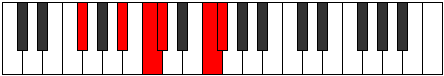

# Mode Zolitonic

## Links

- [Documentation](index.md)
- [Scales Index](Scales.md)
- [Modes Index](Modes.md)
- [Chords Index](Chords.md)

## Parent Scale

[Zolitonic](ScaleZolitonic.md)

## Number

[2257](https://ianring.com/musictheory/scales/2257)

## Interval Pattern

4, 2, 1, 4, 1

## Chord Pattern

I, ii

## Perfection

- 3 Perfect notes
- 2 Perfect notes

## Perfection Profile

[true true false false true]

## Permutations

| Tonic | Notes | Signature | Illustration | Audio |
|-------|-------|-----------|--------------|-------|
| [C](ModeCNaturalZolitonic.md) | C, E, **F#**, **G**, B, C | C |  | [midi](https://github.com/edipermadi/music/blob/main/docs/ModeCNaturalZolitonic.mid?raw=true) |
| [C#](ModeCSharpZolitonic.md) | C#, F, **G**, **G#**, C, C# | C |  | [midi](https://github.com/edipermadi/music/blob/main/docs/ModeCSharpZolitonic.mid?raw=true) |
| [Db](ModeDFlatZolitonic.md) | Db, F, **G**, **Ab**, C, Db | C |  | [midi](https://github.com/edipermadi/music/blob/main/docs/ModeDFlatZolitonic.mid?raw=true) |
| [D](ModeDNaturalZolitonic.md) | D, F#, **G#**, **A**, C#, D | C |  | [midi](https://github.com/edipermadi/music/blob/main/docs/ModeDNaturalZolitonic.mid?raw=true) |
| [D#](ModeDSharpZolitonic.md) | D#, G, **A**, **A#**, D, D# | C |  | [midi](https://github.com/edipermadi/music/blob/main/docs/ModeDSharpZolitonic.mid?raw=true) |
| [Eb](ModeEFlatZolitonic.md) | Eb, G, **A**, **Bb**, D, Eb | C |  | [midi](https://github.com/edipermadi/music/blob/main/docs/ModeEFlatZolitonic.mid?raw=true) |
| [E](ModeENaturalZolitonic.md) | E, G#, **A#**, **B**, D#, E | C |  | [midi](https://github.com/edipermadi/music/blob/main/docs/ModeENaturalZolitonic.mid?raw=true) |
| [F](ModeFNaturalZolitonic.md) | F, A, **B**, **C**, E, F | C |  | [midi](https://github.com/edipermadi/music/blob/main/docs/ModeFNaturalZolitonic.mid?raw=true) |
| [F#](ModeFSharpZolitonic.md) | F#, A#, **C**, **C#**, F, F# | C |  | [midi](https://github.com/edipermadi/music/blob/main/docs/ModeFSharpZolitonic.mid?raw=true) |
| [Gb](ModeGFlatZolitonic.md) | Gb, Bb, **C**, **Db**, F, Gb | C |  | [midi](https://github.com/edipermadi/music/blob/main/docs/ModeGFlatZolitonic.mid?raw=true) |
| [G](ModeGNaturalZolitonic.md) | G, B, **C#**, **D**, F#, G | C |  | [midi](https://github.com/edipermadi/music/blob/main/docs/ModeGNaturalZolitonic.mid?raw=true) |
| [G#](ModeGSharpZolitonic.md) | G#, C, **D**, **D#**, G, G# | C |  | [midi](https://github.com/edipermadi/music/blob/main/docs/ModeGSharpZolitonic.mid?raw=true) |
| [Ab](ModeAFlatZolitonic.md) | Ab, C, **D**, **Eb**, G, Ab | C |  | [midi](https://github.com/edipermadi/music/blob/main/docs/ModeAFlatZolitonic.mid?raw=true) |
| [A](ModeANaturalZolitonic.md) | A, C#, **D#**, **E**, G#, A | C |  | [midi](https://github.com/edipermadi/music/blob/main/docs/ModeANaturalZolitonic.mid?raw=true) |
| [A#](ModeASharpZolitonic.md) | A#, D, **E**, **F**, A, A# | C |  | [midi](https://github.com/edipermadi/music/blob/main/docs/ModeASharpZolitonic.mid?raw=true) |
| [Bb](ModeBFlatZolitonic.md) | Bb, D, **E**, **F**, A, Bb | C |  | [midi](https://github.com/edipermadi/music/blob/main/docs/ModeBFlatZolitonic.mid?raw=true) |
| [B](ModeBNaturalZolitonic.md) | B, D#, **F**, **F#**, A#, B | C |  | [midi](https://github.com/edipermadi/music/blob/main/docs/ModeBNaturalZolitonic.mid?raw=true) |
