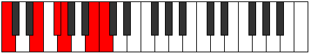
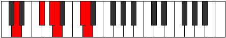

# Mode Zolitonic

## Links

- [Documentation](index.md)
- [Scales Index](Scales.md)
- [Modes Index](Modes.md)
- [Chords Index](Chords.md)

## Parent Scale

[Zolitonic](ScaleZolitonic.md)

## Number

[2257](https://ianring.com/musictheory/scales/2257)

## Perfection

- 3 Perfect notes
- 2 Perfect notes

## Perfection Profile

[true true false false true]

## Permutations

| Tonic | Notes | Signature | Illustration | Audio |
|-------|-------|-----------|--------------|-------|
| [C](ModeCNaturalZolitonic.md) | C, E, **F#**, **G**, B, C | C |  | [midi](ModeCNaturalZolitonic.mid) [ogg](ModeCNaturalZolitonic.ogg) |
| [C#](ModeCSharpZolitonic.md) | C#, F, **G**, **G#**, C, C# | C |  | [midi](ModeCSharpZolitonic.mid) [ogg](ModeCSharpZolitonic.ogg) |
| [Db](ModeDFlatZolitonic.md) | Db, F, **G**, **Ab**, C, Db | C |  | [midi](ModeDFlatZolitonic.mid) [ogg](ModeDFlatZolitonic.ogg) |
| [D](ModeDNaturalZolitonic.md) | D, F#, **G#**, **A**, C#, D | C |  | [midi](ModeDNaturalZolitonic.mid) [ogg](ModeDNaturalZolitonic.ogg) |
| [D#](ModeDSharpZolitonic.md) | D#, G, **A**, **A#**, D, D# | C |  | [midi](ModeDSharpZolitonic.mid) [ogg](ModeDSharpZolitonic.ogg) |
| [Eb](ModeEFlatZolitonic.md) | Eb, G, **A**, **Bb**, D, Eb | C |  | [midi](ModeEFlatZolitonic.mid) [ogg](ModeEFlatZolitonic.ogg) |
| [E](ModeENaturalZolitonic.md) | E, G#, **A#**, **B**, D#, E | C |  | [midi](ModeENaturalZolitonic.mid) [ogg](ModeENaturalZolitonic.ogg) |
| [F](ModeFNaturalZolitonic.md) | F, A, **B**, **C**, E, F | C |  | [midi](ModeFNaturalZolitonic.mid) [ogg](ModeFNaturalZolitonic.ogg) |
| [F#](ModeFSharpZolitonic.md) | F#, A#, **C**, **C#**, F, F# | C |  | [midi](ModeFSharpZolitonic.mid) [ogg](ModeFSharpZolitonic.ogg) |
| [Gb](ModeGFlatZolitonic.md) | Gb, Bb, **C**, **Db**, F, Gb | C |  | [midi](ModeGFlatZolitonic.mid) [ogg](ModeGFlatZolitonic.ogg) |
| [G](ModeGNaturalZolitonic.md) | G, B, **C#**, **D**, F#, G | C |  | [midi](ModeGNaturalZolitonic.mid) [ogg](ModeGNaturalZolitonic.ogg) |
| [G#](ModeGSharpZolitonic.md) | G#, C, **D**, **D#**, G, G# | C |  | [midi](ModeGSharpZolitonic.mid) [ogg](ModeGSharpZolitonic.ogg) |
| [Ab](ModeAFlatZolitonic.md) | Ab, C, **D**, **Eb**, G, Ab | C |  | [midi](ModeAFlatZolitonic.mid) [ogg](ModeAFlatZolitonic.ogg) |
| [A](ModeANaturalZolitonic.md) | A, C#, **D#**, **E**, G#, A | C |  | [midi](ModeANaturalZolitonic.mid) [ogg](ModeANaturalZolitonic.ogg) |
| [A#](ModeASharpZolitonic.md) | A#, D, **E**, **F**, A, A# | C |  | [midi](ModeASharpZolitonic.mid) [ogg](ModeASharpZolitonic.ogg) |
| [Bb](ModeBFlatZolitonic.md) | Bb, D, **E**, **F**, A, Bb | C |  | [midi](ModeBFlatZolitonic.mid) [ogg](ModeBFlatZolitonic.ogg) |
| [B](ModeBNaturalZolitonic.md) | B, D#, **F**, **F#**, A#, B | C |  | [midi](ModeBNaturalZolitonic.mid) [ogg](ModeBNaturalZolitonic.ogg) |
