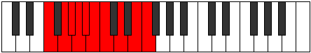

# Mode Zolygic

## Links

- [Documentation](index.md)
- [Scales Index](Scales.md)
- [Modes Index](Modes.md)
- [Chords Index](Chords.md)

## Parent Scale

[Bagygic](ScaleBagygic.md)

## Number

[2813](https://ianring.com/musictheory/scales/2813)

## Perfection

- 7 Perfect notes
- 2 Perfect notes

## Perfection Profile

[true true false true true false true true true]

## Permutations

| Tonic | Notes | Signature | Illustration | Audio |
|-------|-------|-----------|--------------|-------|
| [C](ModeCNaturalZolygic.md) | C, D, **D#**, E, F, **F#**, G, A, B, C | C |  | [midi](ModeCNaturalZolygic.mid) [ogg](ModeCNaturalZolygic.ogg) |
| [C#](ModeCSharpZolygic.md) | C#, D#, **E**, F, F#, **G**, G#, A#, C, C# | C |  | [midi](ModeCSharpZolygic.mid) [ogg](ModeCSharpZolygic.ogg) |
| [Db](ModeDFlatZolygic.md) | Db, Eb, **E**, F, Gb, **G**, Ab, Bb, C, Db | C |  | [midi](ModeDFlatZolygic.mid) [ogg](ModeDFlatZolygic.ogg) |
| [D](ModeDNaturalZolygic.md) | D, E, **F**, F#, G, **G#**, A, B, C#, D | C |  | [midi](ModeDNaturalZolygic.mid) [ogg](ModeDNaturalZolygic.ogg) |
| [D#](ModeDSharpZolygic.md) | D#, F, **F#**, G, G#, **A**, A#, C, D, D# | C |  | [midi](ModeDSharpZolygic.mid) [ogg](ModeDSharpZolygic.ogg) |
| [Eb](ModeEFlatZolygic.md) | Eb, F, **Gb**, G, Ab, **A**, Bb, C, D, Eb | C |  | [midi](ModeEFlatZolygic.mid) [ogg](ModeEFlatZolygic.ogg) |
| [E](ModeENaturalZolygic.md) | E, F#, **G**, G#, A, **A#**, B, C#, D#, E | C |  | [midi](ModeENaturalZolygic.mid) [ogg](ModeENaturalZolygic.ogg) |
| [F](ModeFNaturalZolygic.md) | F, G, **G#**, A, A#, **B**, C, D, E, F | C |  | [midi](ModeFNaturalZolygic.mid) [ogg](ModeFNaturalZolygic.ogg) |
| [F#](ModeFSharpZolygic.md) | F#, G#, **A**, A#, B, **C**, C#, D#, F, F# | C |  | [midi](ModeFSharpZolygic.mid) [ogg](ModeFSharpZolygic.ogg) |
| [Gb](ModeGFlatZolygic.md) | Gb, Ab, **A**, Bb, B, **C**, Db, Eb, F, Gb | C |  | [midi](ModeGFlatZolygic.mid) [ogg](ModeGFlatZolygic.ogg) |
| [G](ModeGNaturalZolygic.md) | G, A, **A#**, B, C, **C#**, D, E, F#, G | C |  | [midi](ModeGNaturalZolygic.mid) [ogg](ModeGNaturalZolygic.ogg) |
| [G#](ModeGSharpZolygic.md) | G#, A#, **B**, C, C#, **D**, D#, F, G, G# | C |  | [midi](ModeGSharpZolygic.mid) [ogg](ModeGSharpZolygic.ogg) |
| [Ab](ModeAFlatZolygic.md) | Ab, Bb, **B**, C, Db, **D**, Eb, F, G, Ab | C |  | [midi](ModeAFlatZolygic.mid) [ogg](ModeAFlatZolygic.ogg) |
| [A](ModeANaturalZolygic.md) | A, B, **C**, C#, D, **D#**, E, F#, G#, A | C |  | [midi](ModeANaturalZolygic.mid) [ogg](ModeANaturalZolygic.ogg) |
| [A#](ModeASharpZolygic.md) | A#, C, **C#**, D, D#, **E**, F, G, A, A# | C |  | [midi](ModeASharpZolygic.mid) [ogg](ModeASharpZolygic.ogg) |
| [Bb](ModeBFlatZolygic.md) | Bb, C, **Db**, D, Eb, **E**, F, G, A, Bb | C |  | [midi](ModeBFlatZolygic.mid) [ogg](ModeBFlatZolygic.ogg) |
| [B](ModeBNaturalZolygic.md) | B, C#, **D**, D#, E, **F**, F#, G#, A#, B | C |  | [midi](ModeBNaturalZolygic.mid) [ogg](ModeBNaturalZolygic.ogg) |
