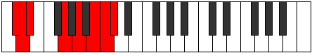
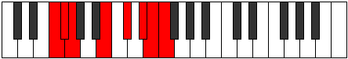
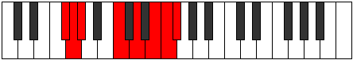
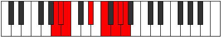
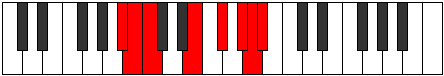

# Mode Zonian

## Links

- [Documentation](index.md)
- [Scales Index](Scales.md)
- [Modes Index](Modes.md)
- [Chords Index](Chords.md)

## Parent Scale

[Pythian](ScalePythian.md)

## Number

[3399](https://ianring.com/musictheory/scales/3399)

## Perfection

- 3 Perfect notes
- 4 Perfect notes

## Perfection Profile

[false true false true false false true]

## Permutations

| Tonic | Notes | Signature | Illustration | Audio |
|-------|-------|-----------|--------------|-------|
| [C](ModeCNaturalZonian.md) | **C**, Db, **Ebb**, F#, **G#**, **A#**, B, **C** | C |  | [midi](ModeCNaturalZonian.mid) [ogg](ModeCNaturalZonian.ogg) |
| [C#](ModeCSharpZonian.md) | **C#**, D, **Eb**, F##, **G##**, **A##**, B#, **C#** | C |  | [midi](ModeCSharpZonian.mid) [ogg](ModeCSharpZonian.ogg) |
| [Db](ModeDFlatZonian.md) | **Db**, Ebb, **Fbb**, G, **A**, **B**, C, **Db** | C |  | [midi](ModeDFlatZonian.mid) [ogg](ModeDFlatZonian.ogg) |
| [D](ModeDNaturalZonian.md) | **D**, Eb, **Fb**, G#, **A#**, **B#**, C#, **D** | C |  | [midi](ModeDNaturalZonian.mid) [ogg](ModeDNaturalZonian.ogg) |
| [D#](ModeDSharpZonian.md) | **D#**, E, **F**, G##, **A##**, **B##**, C##, **D#** | C |  | [midi](ModeDSharpZonian.mid) [ogg](ModeDSharpZonian.ogg) |
| [Eb](ModeEFlatZonian.md) | **Eb**, Fb, **Gbb**, A, **B**, **C#**, D, **Eb** | C |  | [midi](ModeEFlatZonian.mid) [ogg](ModeEFlatZonian.ogg) |
| [E](ModeENaturalZonian.md) | **E**, F, **Gb**, A#, **B#**, **C##**, D#, **E** | C |  | [midi](ModeENaturalZonian.mid) [ogg](ModeENaturalZonian.ogg) |
| [F](ModeFNaturalZonian.md) | **F**, Gb, **Abb**, B, **C#**, **D#**, E, **F** | C |  | [midi](ModeFNaturalZonian.mid) [ogg](ModeFNaturalZonian.ogg) |
| [F#](ModeFSharpZonian.md) | **F#**, G, **Ab**, B#, **C##**, **D##**, E#, **F#** | C |  | [midi](ModeFSharpZonian.mid) [ogg](ModeFSharpZonian.ogg) |
| [Gb](ModeGFlatZonian.md) | **Gb**, Abb, **Bbbb**, C, **D**, **E**, F, **Gb** | C |  | [midi](ModeGFlatZonian.mid) [ogg](ModeGFlatZonian.ogg) |
| [G](ModeGNaturalZonian.md) | **G**, Ab, **Bbb**, C#, **D#**, **E#**, F#, **G** | C |  | [midi](ModeGNaturalZonian.mid) [ogg](ModeGNaturalZonian.ogg) |
| [G#](ModeGSharpZonian.md) | **G#**, A, **Bb**, C##, **D##**, **E##**, F##, **G#** | C |  | [midi](ModeGSharpZonian.mid) [ogg](ModeGSharpZonian.ogg) |
| [Ab](ModeAFlatZonian.md) | **Ab**, Bbb, **Cbb**, D, **E**, **F#**, G, **Ab** | C |  | [midi](ModeAFlatZonian.mid) [ogg](ModeAFlatZonian.ogg) |
| [A](ModeANaturalZonian.md) | **A**, Bb, **Cb**, D#, **E#**, **F##**, G#, **A** | C |  | [midi](ModeANaturalZonian.mid) [ogg](ModeANaturalZonian.ogg) |
| [A#](ModeASharpZonian.md) | **A#**, B, **C**, D##, **E##**, **F###**, G##, **A#** | C |  | [midi](ModeASharpZonian.mid) [ogg](ModeASharpZonian.ogg) |
| [Bb](ModeBFlatZonian.md) | **Bb**, Cb, **Dbb**, E, **F#**, **G#**, A, **Bb** | C |  | [midi](ModeBFlatZonian.mid) [ogg](ModeBFlatZonian.ogg) |
| [B](ModeBNaturalZonian.md) | **B**, C, **Db**, E#, **F##**, **G##**, A#, **B** | C |  | [midi](ModeBNaturalZonian.mid) [ogg](ModeBNaturalZonian.ogg) |
