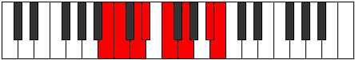

# Mode Zoptian

## Links

- [Documentation](index.md)
- [Scales Index](Scales.md)
- [Modes Index](Modes.md)
- [Chords Index](Chords.md)

## Parent Scale

[Aerathian](ScaleAerathian.md)

## Number

[2395](https://ianring.com/musictheory/scales/2395)

## Perfection

- 5 Perfect notes
- 2 Perfect notes

## Perfection Profile

[false true false true true true true]

## Permutations

| Tonic | Notes | Signature | Illustration | Audio |
|-------|-------|-----------|--------------|-------|
| [C](ModeCNaturalZoptian.md) | **C**, Db, **Eb**, Fb, Gb, Ab, B, **C** | C |  | [midi](ModeCNaturalZoptian.mid) [ogg](ModeCNaturalZoptian.ogg) |
| [C#](ModeCSharpZoptian.md) | **C#**, D, **E**, F, G, A, B#, **C#** | C |  | [midi](ModeCSharpZoptian.mid) [ogg](ModeCSharpZoptian.ogg) |
| [Db](ModeDFlatZoptian.md) | **Db**, Ebb, **Fb**, Gbb, Abb, Bbb, C, **Db** | C |  | [midi](ModeDFlatZoptian.mid) [ogg](ModeDFlatZoptian.ogg) |
| [D](ModeDNaturalZoptian.md) | **D**, Eb, **F**, Gb, Ab, Bb, C#, **D** | C |  | [midi](ModeDNaturalZoptian.mid) [ogg](ModeDNaturalZoptian.ogg) |
| [D#](ModeDSharpZoptian.md) | **D#**, E, **F#**, G, A, B, C##, **D#** | C |  | [midi](ModeDSharpZoptian.mid) [ogg](ModeDSharpZoptian.ogg) |
| [Eb](ModeEFlatZoptian.md) | **Eb**, Fb, **Gb**, Abb, Bbb, Cb, D, **Eb** | C |  | [midi](ModeEFlatZoptian.mid) [ogg](ModeEFlatZoptian.ogg) |
| [E](ModeENaturalZoptian.md) | **E**, F, **G**, Ab, Bb, C, D#, **E** | C |  | [midi](ModeENaturalZoptian.mid) [ogg](ModeENaturalZoptian.ogg) |
| [F](ModeFNaturalZoptian.md) | **F**, Gb, **Ab**, Bbb, Cb, Db, E, **F** | C |  | [midi](ModeFNaturalZoptian.mid) [ogg](ModeFNaturalZoptian.ogg) |
| [F#](ModeFSharpZoptian.md) | **F#**, G, **A**, Bb, C, D, E#, **F#** | C |  | [midi](ModeFSharpZoptian.mid) [ogg](ModeFSharpZoptian.ogg) |
| [Gb](ModeGFlatZoptian.md) | **Gb**, Abb, **Bbb**, Cbb, Dbb, Ebb, F, **Gb** | C |  | [midi](ModeGFlatZoptian.mid) [ogg](ModeGFlatZoptian.ogg) |
| [G](ModeGNaturalZoptian.md) | **G**, Ab, **Bb**, Cb, Db, Eb, F#, **G** | C |  | [midi](ModeGNaturalZoptian.mid) [ogg](ModeGNaturalZoptian.ogg) |
| [G#](ModeGSharpZoptian.md) | **G#**, A, **B**, C, D, E, F##, **G#** | C |  | [midi](ModeGSharpZoptian.mid) [ogg](ModeGSharpZoptian.ogg) |
| [Ab](ModeAFlatZoptian.md) | **Ab**, Bbb, **Cb**, Dbb, Ebb, Fb, G, **Ab** | C |  | [midi](ModeAFlatZoptian.mid) [ogg](ModeAFlatZoptian.ogg) |
| [A](ModeANaturalZoptian.md) | **A**, Bb, **C**, Db, Eb, F, G#, **A** | C |  | [midi](ModeANaturalZoptian.mid) [ogg](ModeANaturalZoptian.ogg) |
| [A#](ModeASharpZoptian.md) | **A#**, B, **C#**, D, E, F#, G##, **A#** | C |  | [midi](ModeASharpZoptian.mid) [ogg](ModeASharpZoptian.ogg) |
| [Bb](ModeBFlatZoptian.md) | **Bb**, Cb, **Db**, Ebb, Fb, Gb, A, **Bb** | C |  | [midi](ModeBFlatZoptian.mid) [ogg](ModeBFlatZoptian.ogg) |
| [B](ModeBNaturalZoptian.md) | **B**, C, **D**, Eb, F, G, A#, **B** | C |  | [midi](ModeBNaturalZoptian.mid) [ogg](ModeBNaturalZoptian.ogg) |
