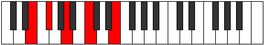
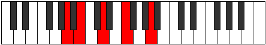
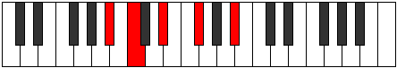

# Mode Zoptic

## Links

- [Documentation](README.md)
- [Scales Index](Scales.md)
- [Modes Index](Modes.md)
- [Chords Index](Chords.md)

## Parent Scale

[Saric](ScaleSaric.md)

## Number

[293](https://ianring.com/musictheory/scales/293)

## Transposition

2, 3, 3, 4

## Chord Pattern

## Perfection

- 1 Perfect notes
- 3 Perfect notes

## Perfection Profile

false, false, true, false

## Permutations

| Tonic | Notes | Signature | Illustration | Audio |
|-------|-------|-----------|--------------|-------|
| [C](ModeCNaturalZoptic.md) | **C**, **D**, F, **G#**, **C** | C |  | [midi](https://github.com/edipermadi/music/blob/main/docs/ModeCNaturalZoptic.mid?raw=true) |
| [C#](ModeCSharpZoptic.md) | **C#**, **D#**, F#, **A**, **C#** | C |  | [midi](https://github.com/edipermadi/music/blob/main/docs/ModeCSharpZoptic.mid?raw=true) |
| [Db](ModeDFlatZoptic.md) | **Db**, **Eb**, Gb, **A**, **Db** | C |  | [midi](https://github.com/edipermadi/music/blob/main/docs/ModeDFlatZoptic.mid?raw=true) |
| [D](ModeDNaturalZoptic.md) | **D**, **E**, G, **A#**, **D** | C |  | [midi](https://github.com/edipermadi/music/blob/main/docs/ModeDNaturalZoptic.mid?raw=true) |
| [D#](ModeDSharpZoptic.md) | **D#**, **F**, G#, **B**, **D#** | C |  | [midi](https://github.com/edipermadi/music/blob/main/docs/ModeDSharpZoptic.mid?raw=true) |
| [Eb](ModeEFlatZoptic.md) | **Eb**, **F**, Ab, **B**, **Eb** | C |  | [midi](https://github.com/edipermadi/music/blob/main/docs/ModeEFlatZoptic.mid?raw=true) |
| [E](ModeENaturalZoptic.md) | **E**, **F#**, A, **C**, **E** | C |  | [midi](https://github.com/edipermadi/music/blob/main/docs/ModeENaturalZoptic.mid?raw=true) |
| [F](ModeFNaturalZoptic.md) | **F**, **G**, A#, **C#**, **F** | C |  | [midi](https://github.com/edipermadi/music/blob/main/docs/ModeFNaturalZoptic.mid?raw=true) |
| [F#](ModeFSharpZoptic.md) | **F#**, **G#**, B, **D**, **F#** | C |  | [midi](https://github.com/edipermadi/music/blob/main/docs/ModeFSharpZoptic.mid?raw=true) |
| [Gb](ModeGFlatZoptic.md) | **Gb**, **Ab**, B, **D**, **Gb** | C |  | [midi](https://github.com/edipermadi/music/blob/main/docs/ModeGFlatZoptic.mid?raw=true) |
| [G](ModeGNaturalZoptic.md) | **G**, **A**, C, **D#**, **G** | C |  | [midi](https://github.com/edipermadi/music/blob/main/docs/ModeGNaturalZoptic.mid?raw=true) |
| [G#](ModeGSharpZoptic.md) | **G#**, **A#**, C#, **E**, **G#** | C |  | [midi](https://github.com/edipermadi/music/blob/main/docs/ModeGSharpZoptic.mid?raw=true) |
| [Ab](ModeAFlatZoptic.md) | **Ab**, **Bb**, Db, **E**, **Ab** | C |  | [midi](https://github.com/edipermadi/music/blob/main/docs/ModeAFlatZoptic.mid?raw=true) |
| [A](ModeANaturalZoptic.md) | **A**, **B**, D, **F**, **A** | C |  | [midi](https://github.com/edipermadi/music/blob/main/docs/ModeANaturalZoptic.mid?raw=true) |
| [A#](ModeASharpZoptic.md) | **A#**, **C**, D#, **F#**, **A#** | C |  | [midi](https://github.com/edipermadi/music/blob/main/docs/ModeASharpZoptic.mid?raw=true) |
| [Bb](ModeBFlatZoptic.md) | **Bb**, **C**, Eb, **Gb**, **Bb** | C |  | [midi](https://github.com/edipermadi/music/blob/main/docs/ModeBFlatZoptic.mid?raw=true) |
| [B](ModeBNaturalZoptic.md) | **B**, **C#**, E, **G**, **B** | C |  | [midi](https://github.com/edipermadi/music/blob/main/docs/ModeBNaturalZoptic.mid?raw=true) |
