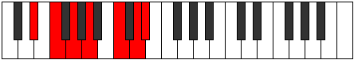
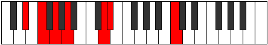

# Mode Zoptimic

## Links

- [Documentation](index.md)
- [Scales Index](Scales.md)
- [Modes Index](Modes.md)
- [Chords Index](Chords.md)

## Parent Scale

[Phracrimic](ScalePhracrimic.md)

## Number

[2645](https://ianring.com/musictheory/scales/2645)

## Perfection

- 4 Perfect notes
- 2 Perfect notes

## Perfection Profile

[false true true false true true]

## Permutations

| Tonic | Notes | Signature | Illustration | Audio |
|-------|-------|-----------|--------------|-------|
| [C](ModeCNaturalZoptimic.md) | **C**, D, E, **F#**, G##, A##, **C** | C |  | [midi](ModeCNaturalZoptimic.mid) [ogg](ModeCNaturalZoptimic.ogg) |
| [C#](ModeCSharpZoptimic.md) | **C#**, D#, E#, **F##**, G###, A###, **C#** | C |  | [midi](ModeCSharpZoptimic.mid) [ogg](ModeCSharpZoptimic.ogg) |
| [Db](ModeDFlatZoptimic.md) | **Db**, Eb, F, **G**, A#, B#, **Db** | C |  | [midi](ModeDFlatZoptimic.mid) [ogg](ModeDFlatZoptimic.ogg) |
| [D](ModeDNaturalZoptimic.md) | **D**, E, F#, **G#**, A##, B##, **D** | C |  | [midi](ModeDNaturalZoptimic.mid) [ogg](ModeDNaturalZoptimic.ogg) |
| [D#](ModeDSharpZoptimic.md) | **D#**, E#, F##, **G##**, A###, B###, **D#** | C |  | [midi](ModeDSharpZoptimic.mid) [ogg](ModeDSharpZoptimic.ogg) |
| [Eb](ModeEFlatZoptimic.md) | **Eb**, F, G, **A**, B#, C##, **Eb** | C |  | [midi](ModeEFlatZoptimic.mid) [ogg](ModeEFlatZoptimic.ogg) |
| [E](ModeENaturalZoptimic.md) | **E**, F#, G#, **A#**, B##, C###, **E** | C |  | [midi](ModeENaturalZoptimic.mid) [ogg](ModeENaturalZoptimic.ogg) |
| [F](ModeFNaturalZoptimic.md) | **F**, G, A, **B**, C##, D##, **F** | C |  | [midi](ModeFNaturalZoptimic.mid) [ogg](ModeFNaturalZoptimic.ogg) |
| [F#](ModeFSharpZoptimic.md) | **F#**, G#, A#, **B#**, C###, D###, **F#** | C |  | [midi](ModeFSharpZoptimic.mid) [ogg](ModeFSharpZoptimic.ogg) |
| [Gb](ModeGFlatZoptimic.md) | **Gb**, Ab, Bb, **C**, D#, E#, **Gb** | C |  | [midi](ModeGFlatZoptimic.mid) [ogg](ModeGFlatZoptimic.ogg) |
| [G](ModeGNaturalZoptimic.md) | **G**, A, B, **C#**, D##, E##, **G** | C |  | [midi](ModeGNaturalZoptimic.mid) [ogg](ModeGNaturalZoptimic.ogg) |
| [G#](ModeGSharpZoptimic.md) | **G#**, A#, B#, **C##**, D###, E###, **G#** | C |  | [midi](ModeGSharpZoptimic.mid) [ogg](ModeGSharpZoptimic.ogg) |
| [Ab](ModeAFlatZoptimic.md) | **Ab**, Bb, C, **D**, E#, F##, **Ab** | C |  | [midi](ModeAFlatZoptimic.mid) [ogg](ModeAFlatZoptimic.ogg) |
| [A](ModeANaturalZoptimic.md) | **A**, B, C#, **D#**, E##, F###, **A** | C |  | [midi](ModeANaturalZoptimic.mid) [ogg](ModeANaturalZoptimic.ogg) |
| [A#](ModeASharpZoptimic.md) | **A#**, B#, C##, **D##**, E###, Cbbb, **A#** | C |  | [midi](ModeASharpZoptimic.mid) [ogg](ModeASharpZoptimic.ogg) |
| [Bb](ModeBFlatZoptimic.md) | **Bb**, C, D, **E**, F##, G##, **Bb** | C |  | [midi](ModeBFlatZoptimic.mid) [ogg](ModeBFlatZoptimic.ogg) |
| [B](ModeBNaturalZoptimic.md) | **B**, C#, D#, **E#**, F###, G###, **B** | C |  | [midi](ModeBNaturalZoptimic.mid) [ogg](ModeBNaturalZoptimic.ogg) |
