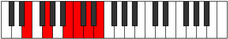

# Mode Zoptitonic

## Links

- [Documentation](index.md)
- [Scales Index](Scales.md)
- [Modes Index](Modes.md)
- [Chords Index](Chords.md)

## Parent Scale

[Lothitonic](ScaleLothitonic.md)

## Number

[1417](https://ianring.com/musictheory/scales/1417)

## Perfection

- 3 Perfect notes
- 2 Perfect notes

## Perfection Profile

[true true false true false]

## Permutations

| Tonic | Notes | Signature | Illustration | Audio |
|-------|-------|-----------|--------------|-------|
| [C](ModeCNaturalZoptitonic.md) | C, D#, **G**, G#, **A#**, C | C |  | [midi](https://github.com/edipermadi/music/blob/main/docs/ModeCNaturalZoptitonic.mid?raw=true) |
| [C#](ModeCSharpZoptitonic.md) | C#, E, **G#**, A, **B**, C# | C |  | [midi](https://github.com/edipermadi/music/blob/main/docs/ModeCSharpZoptitonic.mid?raw=true) |
| [Db](ModeDFlatZoptitonic.md) | Db, E, **Ab**, A, **B**, Db | C |  | [midi](https://github.com/edipermadi/music/blob/main/docs/ModeDFlatZoptitonic.mid?raw=true) |
| [D](ModeDNaturalZoptitonic.md) | D, F, **A**, A#, **C**, D | C |  | [midi](https://github.com/edipermadi/music/blob/main/docs/ModeDNaturalZoptitonic.mid?raw=true) |
| [D#](ModeDSharpZoptitonic.md) | D#, F#, **A#**, B, **C#**, D# | C |  | [midi](https://github.com/edipermadi/music/blob/main/docs/ModeDSharpZoptitonic.mid?raw=true) |
| [Eb](ModeEFlatZoptitonic.md) | Eb, Gb, **Bb**, B, **Db**, Eb | C |  | [midi](https://github.com/edipermadi/music/blob/main/docs/ModeEFlatZoptitonic.mid?raw=true) |
| [E](ModeENaturalZoptitonic.md) | E, G, **B**, C, **D**, E | C |  | [midi](https://github.com/edipermadi/music/blob/main/docs/ModeENaturalZoptitonic.mid?raw=true) |
| [F](ModeFNaturalZoptitonic.md) | F, G#, **C**, C#, **D#**, F | C |  | [midi](https://github.com/edipermadi/music/blob/main/docs/ModeFNaturalZoptitonic.mid?raw=true) |
| [F#](ModeFSharpZoptitonic.md) | F#, A, **C#**, D, **E**, F# | C |  | [midi](https://github.com/edipermadi/music/blob/main/docs/ModeFSharpZoptitonic.mid?raw=true) |
| [Gb](ModeGFlatZoptitonic.md) | Gb, A, **Db**, D, **E**, Gb | C |  | [midi](https://github.com/edipermadi/music/blob/main/docs/ModeGFlatZoptitonic.mid?raw=true) |
| [G](ModeGNaturalZoptitonic.md) | G, A#, **D**, D#, **F**, G | C |  | [midi](https://github.com/edipermadi/music/blob/main/docs/ModeGNaturalZoptitonic.mid?raw=true) |
| [G#](ModeGSharpZoptitonic.md) | G#, B, **D#**, E, **F#**, G# | C |  | [midi](https://github.com/edipermadi/music/blob/main/docs/ModeGSharpZoptitonic.mid?raw=true) |
| [Ab](ModeAFlatZoptitonic.md) | Ab, B, **Eb**, E, **Gb**, Ab | C |  | [midi](https://github.com/edipermadi/music/blob/main/docs/ModeAFlatZoptitonic.mid?raw=true) |
| [A](ModeANaturalZoptitonic.md) | A, C, **E**, F, **G**, A | C |  | [midi](https://github.com/edipermadi/music/blob/main/docs/ModeANaturalZoptitonic.mid?raw=true) |
| [A#](ModeASharpZoptitonic.md) | A#, C#, **F**, F#, **G#**, A# | C |  | [midi](https://github.com/edipermadi/music/blob/main/docs/ModeASharpZoptitonic.mid?raw=true) |
| [Bb](ModeBFlatZoptitonic.md) | Bb, Db, **F**, Gb, **Ab**, Bb | C |  | [midi](https://github.com/edipermadi/music/blob/main/docs/ModeBFlatZoptitonic.mid?raw=true) |
| [B](ModeBNaturalZoptitonic.md) | B, D, **F#**, G, **A**, B | C |  | [midi](https://github.com/edipermadi/music/blob/main/docs/ModeBNaturalZoptitonic.mid?raw=true) |
