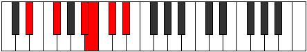
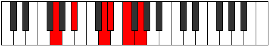

# Mode Zoptitonic

## Links

- [Documentation](index.md)
- [Scales Index](Scales.md)
- [Modes Index](Modes.md)
- [Chords Index](Chords.md)

## Parent Scale

[Lothitonic](ScaleLothitonic.md)

## Number

[1417](https://ianring.com/musictheory/scales/1417)

## Perfection

- 3 Perfect notes
- 2 Perfect notes

## Perfection Profile

[true true false true false]

## Permutations

| Tonic | Notes | Signature | Illustration | Audio |
|-------|-------|-----------|--------------|-------|
| [C](ModeCNaturalZoptitonic.md) | C, D#, **G**, G#, **A#**, C | C |  | [midi](ModeCNaturalZoptitonic.mid) [ogg](ModeCNaturalZoptitonic.ogg) |
| [C#](ModeCSharpZoptitonic.md) | C#, E, **G#**, A, **B**, C# | C |  | [midi](ModeCSharpZoptitonic.mid) [ogg](ModeCSharpZoptitonic.ogg) |
| [Db](ModeDFlatZoptitonic.md) | Db, E, **Ab**, A, **B**, Db | C |  | [midi](ModeDFlatZoptitonic.mid) [ogg](ModeDFlatZoptitonic.ogg) |
| [D](ModeDNaturalZoptitonic.md) | D, F, **A**, A#, **C**, D | C |  | [midi](ModeDNaturalZoptitonic.mid) [ogg](ModeDNaturalZoptitonic.ogg) |
| [D#](ModeDSharpZoptitonic.md) | D#, F#, **A#**, B, **C#**, D# | C |  | [midi](ModeDSharpZoptitonic.mid) [ogg](ModeDSharpZoptitonic.ogg) |
| [Eb](ModeEFlatZoptitonic.md) | Eb, Gb, **Bb**, B, **Db**, Eb | C |  | [midi](ModeEFlatZoptitonic.mid) [ogg](ModeEFlatZoptitonic.ogg) |
| [E](ModeENaturalZoptitonic.md) | E, G, **B**, C, **D**, E | C |  | [midi](ModeENaturalZoptitonic.mid) [ogg](ModeENaturalZoptitonic.ogg) |
| [F](ModeFNaturalZoptitonic.md) | F, G#, **C**, C#, **D#**, F | C |  | [midi](ModeFNaturalZoptitonic.mid) [ogg](ModeFNaturalZoptitonic.ogg) |
| [F#](ModeFSharpZoptitonic.md) | F#, A, **C#**, D, **E**, F# | C |  | [midi](ModeFSharpZoptitonic.mid) [ogg](ModeFSharpZoptitonic.ogg) |
| [Gb](ModeGFlatZoptitonic.md) | Gb, A, **Db**, D, **E**, Gb | C |  | [midi](ModeGFlatZoptitonic.mid) [ogg](ModeGFlatZoptitonic.ogg) |
| [G](ModeGNaturalZoptitonic.md) | G, A#, **D**, D#, **F**, G | C |  | [midi](ModeGNaturalZoptitonic.mid) [ogg](ModeGNaturalZoptitonic.ogg) |
| [G#](ModeGSharpZoptitonic.md) | G#, B, **D#**, E, **F#**, G# | C |  | [midi](ModeGSharpZoptitonic.mid) [ogg](ModeGSharpZoptitonic.ogg) |
| [Ab](ModeAFlatZoptitonic.md) | Ab, B, **Eb**, E, **Gb**, Ab | C |  | [midi](ModeAFlatZoptitonic.mid) [ogg](ModeAFlatZoptitonic.ogg) |
| [A](ModeANaturalZoptitonic.md) | A, C, **E**, F, **G**, A | C |  | [midi](ModeANaturalZoptitonic.mid) [ogg](ModeANaturalZoptitonic.ogg) |
| [A#](ModeASharpZoptitonic.md) | A#, C#, **F**, F#, **G#**, A# | C |  | [midi](ModeASharpZoptitonic.mid) [ogg](ModeASharpZoptitonic.ogg) |
| [Bb](ModeBFlatZoptitonic.md) | Bb, Db, **F**, Gb, **Ab**, Bb | C |  | [midi](ModeBFlatZoptitonic.mid) [ogg](ModeBFlatZoptitonic.ogg) |
| [B](ModeBNaturalZoptitonic.md) | B, D, **F#**, G, **A**, B | C |  | [midi](ModeBNaturalZoptitonic.mid) [ogg](ModeBNaturalZoptitonic.ogg) |
