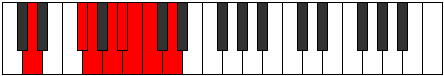

# Mode Zorian

## Links

- [Documentation](index.md)
- [Scales Index](Scales.md)
- [Modes Index](Modes.md)
- [Chords Index](Chords.md)

## Parent Scale

[Zorian](ScaleZorian.md)

## Number

[1969](https://ianring.com/musictheory/scales/1969)

## Perfection

- 4 Perfect notes
- 3 Perfect notes

## Perfection Profile

[true false true false false true true]

## Permutations

| Tonic | Notes | Signature | Illustration | Audio |
|-------|-------|-----------|--------------|-------|
| [C](ModeCNaturalZorian.md) | C, **D##**, E#, **F##**, **G#**, A, Bb, C | C |  | [midi](ModeCNaturalZorian.mid) [ogg](ModeCNaturalZorian.ogg) |
| [C#](ModeCSharpZorian.md) | C#, **D###**, E##, **F###**, **G##**, A#, B, C# | C |  | [midi](ModeCSharpZorian.mid) [ogg](ModeCSharpZorian.ogg) |
| [Db](ModeDFlatZorian.md) | Db, **E#**, F#, **G#**, **A**, Bb, Cb, Db | C |  | [midi](ModeDFlatZorian.mid) [ogg](ModeDFlatZorian.ogg) |
| [D](ModeDNaturalZorian.md) | D, **E##**, F##, **G##**, **A#**, B, C, D | C |  | [midi](ModeDNaturalZorian.mid) [ogg](ModeDNaturalZorian.ogg) |
| [D#](ModeDSharpZorian.md) | D#, **E###**, F###, **G###**, **A##**, B#, C#, D# | C |  | [midi](ModeDSharpZorian.mid) [ogg](ModeDSharpZorian.ogg) |
| [Eb](ModeEFlatZorian.md) | Eb, **F##**, G#, **A#**, **B**, C, Db, Eb | C |  | [midi](ModeEFlatZorian.mid) [ogg](ModeEFlatZorian.ogg) |
| [E](ModeENaturalZorian.md) | E, **F###**, G##, **A##**, **B#**, C#, D, E | C |  | [midi](ModeENaturalZorian.mid) [ogg](ModeENaturalZorian.ogg) |
| [F](ModeFNaturalZorian.md) | F, **G##**, A#, **B#**, **C#**, D, Eb, F | C |  | [midi](ModeFNaturalZorian.mid) [ogg](ModeFNaturalZorian.ogg) |
| [F#](ModeFSharpZorian.md) | F#, **G###**, A##, **B##**, **C##**, D#, E, F# | C |  | [midi](ModeFSharpZorian.mid) [ogg](ModeFSharpZorian.ogg) |
| [Gb](ModeGFlatZorian.md) | Gb, **A#**, B, **C#**, **D**, Eb, Fb, Gb | C |  | [midi](ModeGFlatZorian.mid) [ogg](ModeGFlatZorian.ogg) |
| [G](ModeGNaturalZorian.md) | G, **A##**, B#, **C##**, **D#**, E, F, G | C |  | [midi](ModeGNaturalZorian.mid) [ogg](ModeGNaturalZorian.ogg) |
| [G#](ModeGSharpZorian.md) | G#, **A###**, B##, **C###**, **D##**, E#, F#, G# | C |  | [midi](ModeGSharpZorian.mid) [ogg](ModeGSharpZorian.ogg) |
| [Ab](ModeAFlatZorian.md) | Ab, **B#**, C#, **D#**, **E**, F, Gb, Ab | C |  | [midi](ModeAFlatZorian.mid) [ogg](ModeAFlatZorian.ogg) |
| [A](ModeANaturalZorian.md) | A, **B##**, C##, **D##**, **E#**, F#, G, A | C |  | [midi](ModeANaturalZorian.mid) [ogg](ModeANaturalZorian.ogg) |
| [A#](ModeASharpZorian.md) | A#, **B###**, C###, **D###**, **E##**, F##, G#, A# | C |  | [midi](ModeASharpZorian.mid) [ogg](ModeASharpZorian.ogg) |
| [Bb](ModeBFlatZorian.md) | Bb, **C##**, D#, **E#**, **F#**, G, Ab, Bb | C |  | [midi](ModeBFlatZorian.mid) [ogg](ModeBFlatZorian.ogg) |
| [B](ModeBNaturalZorian.md) | B, **C###**, D##, **E##**, **F##**, G#, A, B | C |  | [midi](ModeBNaturalZorian.mid) [ogg](ModeBNaturalZorian.ogg) |
