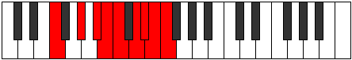
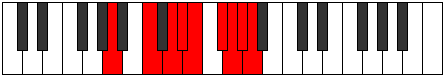

# Mode Zoryllic

## Links

- [Documentation](README.md)
- [Scales Index](Scales.md)
- [Modes Index](Modes.md)
- [Chords Index](Chords.md)

## Parent Scale

[Zoryllic](ScaleZoryllic.md)

## Number

[3817](https://ianring.com/musictheory/scales/3817)

## Transposition

3, 2, 1, 1, 2, 1, 1, 1

## Chord Pattern

ii⁰, vi⁰b3, VIII

## Perfection

- 5 Perfect notes
- 3 Perfect notes

## Perfection Profile

[true true true false false false true true]

## Permutations

| Tonic | Notes | Signature | Illustration | Audio |
|-------|-------|-----------|--------------|-------|
| [C](ModeCNaturalZoryllic.md) | C, D#, F, **F#**, **G**, **A**, A#, B, C | C |  | [midi](https://github.com/edipermadi/music/blob/main/docs/ModeCNaturalZoryllic.mid?raw=true) |
| [C#](ModeCSharpZoryllic.md) | C#, E, F#, **G**, **G#**, **A#**, B, C, C# | C |  | [midi](https://github.com/edipermadi/music/blob/main/docs/ModeCSharpZoryllic.mid?raw=true) |
| [Db](ModeDFlatZoryllic.md) | Db, E, Gb, **G**, **Ab**, **Bb**, B, C, Db | C |  | [midi](https://github.com/edipermadi/music/blob/main/docs/ModeDFlatZoryllic.mid?raw=true) |
| [D](ModeDNaturalZoryllic.md) | D, F, G, **G#**, **A**, **B**, C, C#, D | C |  | [midi](https://github.com/edipermadi/music/blob/main/docs/ModeDNaturalZoryllic.mid?raw=true) |
| [D#](ModeDSharpZoryllic.md) | D#, F#, G#, **A**, **A#**, **C**, C#, D, D# | C |  | [midi](https://github.com/edipermadi/music/blob/main/docs/ModeDSharpZoryllic.mid?raw=true) |
| [Eb](ModeEFlatZoryllic.md) | Eb, Gb, Ab, **A**, **Bb**, **C**, Db, D, Eb | C |  | [midi](https://github.com/edipermadi/music/blob/main/docs/ModeEFlatZoryllic.mid?raw=true) |
| [E](ModeENaturalZoryllic.md) | E, G, A, **A#**, **B**, **C#**, D, D#, E | C |  | [midi](https://github.com/edipermadi/music/blob/main/docs/ModeENaturalZoryllic.mid?raw=true) |
| [F](ModeFNaturalZoryllic.md) | F, G#, A#, **B**, **C**, **D**, D#, E, F | C |  | [midi](https://github.com/edipermadi/music/blob/main/docs/ModeFNaturalZoryllic.mid?raw=true) |
| [F#](ModeFSharpZoryllic.md) | F#, A, B, **C**, **C#**, **D#**, E, F, F# | C |  | [midi](https://github.com/edipermadi/music/blob/main/docs/ModeFSharpZoryllic.mid?raw=true) |
| [Gb](ModeGFlatZoryllic.md) | Gb, A, B, **C**, **Db**, **Eb**, E, F, Gb | C |  | [midi](https://github.com/edipermadi/music/blob/main/docs/ModeGFlatZoryllic.mid?raw=true) |
| [G](ModeGNaturalZoryllic.md) | G, A#, C, **C#**, **D**, **E**, F, F#, G | C |  | [midi](https://github.com/edipermadi/music/blob/main/docs/ModeGNaturalZoryllic.mid?raw=true) |
| [G#](ModeGSharpZoryllic.md) | G#, B, C#, **D**, **D#**, **F**, F#, G, G# | C |  | [midi](https://github.com/edipermadi/music/blob/main/docs/ModeGSharpZoryllic.mid?raw=true) |
| [Ab](ModeAFlatZoryllic.md) | Ab, B, Db, **D**, **Eb**, **F**, Gb, G, Ab | C |  | [midi](https://github.com/edipermadi/music/blob/main/docs/ModeAFlatZoryllic.mid?raw=true) |
| [A](ModeANaturalZoryllic.md) | A, C, D, **D#**, **E**, **F#**, G, G#, A | C |  | [midi](https://github.com/edipermadi/music/blob/main/docs/ModeANaturalZoryllic.mid?raw=true) |
| [A#](ModeASharpZoryllic.md) | A#, C#, D#, **E**, **F**, **G**, G#, A, A# | C |  | [midi](https://github.com/edipermadi/music/blob/main/docs/ModeASharpZoryllic.mid?raw=true) |
| [Bb](ModeBFlatZoryllic.md) | Bb, Db, Eb, **E**, **F**, **G**, Ab, A, Bb | C |  | [midi](https://github.com/edipermadi/music/blob/main/docs/ModeBFlatZoryllic.mid?raw=true) |
| [B](ModeBNaturalZoryllic.md) | B, D, E, **F**, **F#**, **G#**, A, A#, B | C |  | [midi](https://github.com/edipermadi/music/blob/main/docs/ModeBNaturalZoryllic.mid?raw=true) |
