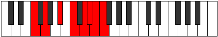
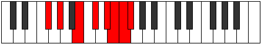

# Mode Zothian

## Links

- [Documentation](index.md)
- [Scales Index](Scales.md)
- [Modes Index](Modes.md)
- [Chords Index](Chords.md)

## Parent Scale

[Soptian](ScaleSoptian.md)

## Number

[3749](https://ianring.com/musictheory/scales/3749)

## Perfection

- 5 Perfect notes
- 2 Perfect notes

## Perfection Profile

[true true true true false true false]

## Permutations

| Tonic | Notes | Signature | Illustration | Audio |
|-------|-------|-----------|--------------|-------|
| [C](ModeCNaturalZothian.md) | C, D, E#, F##, **G##**, A#, **B**, C | C |  | [midi](ModeCNaturalZothian.mid) [ogg](ModeCNaturalZothian.ogg) |
| [C#](ModeCSharpZothian.md) | C#, D#, E##, F###, **G###**, A##, **B#**, C# | C |  | [midi](ModeCSharpZothian.mid) [ogg](ModeCSharpZothian.ogg) |
| [Db](ModeDFlatZothian.md) | Db, Eb, F#, G#, **A#**, B, **C**, Db | C |  | [midi](ModeDFlatZothian.mid) [ogg](ModeDFlatZothian.ogg) |
| [D](ModeDNaturalZothian.md) | D, E, F##, G##, **A##**, B#, **C#**, D | C |  | [midi](ModeDNaturalZothian.mid) [ogg](ModeDNaturalZothian.ogg) |
| [D#](ModeDSharpZothian.md) | D#, E#, F###, G###, **A###**, B##, **C##**, D# | C |  | [midi](ModeDSharpZothian.mid) [ogg](ModeDSharpZothian.ogg) |
| [Eb](ModeEFlatZothian.md) | Eb, F, G#, A#, **B#**, C#, **D**, Eb | C |  | [midi](ModeEFlatZothian.mid) [ogg](ModeEFlatZothian.ogg) |
| [E](ModeENaturalZothian.md) | E, F#, G##, A##, **B##**, C##, **D#**, E | C |  | [midi](ModeENaturalZothian.mid) [ogg](ModeENaturalZothian.ogg) |
| [F](ModeFNaturalZothian.md) | F, G, A#, B#, **C##**, D#, **E**, F | C |  | [midi](ModeFNaturalZothian.mid) [ogg](ModeFNaturalZothian.ogg) |
| [F#](ModeFSharpZothian.md) | F#, G#, A##, B##, **C###**, D##, **E#**, F# | C |  | [midi](ModeFSharpZothian.mid) [ogg](ModeFSharpZothian.ogg) |
| [Gb](ModeGFlatZothian.md) | Gb, Ab, B, C#, **D#**, E, **F**, Gb | C |  | [midi](ModeGFlatZothian.mid) [ogg](ModeGFlatZothian.ogg) |
| [G](ModeGNaturalZothian.md) | G, A, B#, C##, **D##**, E#, **F#**, G | C |  | [midi](ModeGNaturalZothian.mid) [ogg](ModeGNaturalZothian.ogg) |
| [G#](ModeGSharpZothian.md) | G#, A#, B##, C###, **D###**, E##, **F##**, G# | C |  | [midi](ModeGSharpZothian.mid) [ogg](ModeGSharpZothian.ogg) |
| [Ab](ModeAFlatZothian.md) | Ab, Bb, C#, D#, **E#**, F#, **G**, Ab | C |  | [midi](ModeAFlatZothian.mid) [ogg](ModeAFlatZothian.ogg) |
| [A](ModeANaturalZothian.md) | A, B, C##, D##, **E##**, F##, **G#**, A | C |  | [midi](ModeANaturalZothian.mid) [ogg](ModeANaturalZothian.ogg) |
| [A#](ModeASharpZothian.md) | A#, B#, C###, D###, **E###**, F###, **G##**, A# | C |  | [midi](ModeASharpZothian.mid) [ogg](ModeASharpZothian.ogg) |
| [Bb](ModeBFlatZothian.md) | Bb, C, D#, E#, **F##**, G#, **A**, Bb | C |  | [midi](ModeBFlatZothian.mid) [ogg](ModeBFlatZothian.ogg) |
| [B](ModeBNaturalZothian.md) | B, C#, D##, E##, **F###**, G##, **A#**, B | C |  | [midi](ModeBNaturalZothian.mid) [ogg](ModeBNaturalZothian.ogg) |
