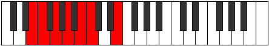

# Mode Zothimic

## Links

- [Documentation](README.md)
- [Scales Index](Scales.md)
- [Modes Index](Modes.md)
- [Chords Index](Chords.md)

## Parent Scale

[Bylimic](ScaleBylimic.md)

## Number

[427](https://ianring.com/musictheory/scales/427)

## Transposition

1, 2, 2, 2, 1, 4

## Chord Pattern

i, II

## Perfection

- 4 Perfect notes
- 2 Perfect notes

## Perfection Profile

[true true false true false true]

## Permutations

| Tonic | Notes | Signature | Illustration | Audio |
|-------|-------|-----------|--------------|-------|
| [C](ModeCNaturalZothimic.md) | C, Db, **Eb**, F, **G**, Ab, C | C |  | [midi](https://github.com/edipermadi/music/blob/main/docs/ModeCNaturalZothimic.mid?raw=true) |
| [C#](ModeCSharpZothimic.md) | C#, D, **E**, F#, **G#**, A, C# | C |  | [midi](https://github.com/edipermadi/music/blob/main/docs/ModeCSharpZothimic.mid?raw=true) |
| [Db](ModeDFlatZothimic.md) | Db, Ebb, **Fb**, Gb, **Ab**, Bbb, Db | C |  | [midi](https://github.com/edipermadi/music/blob/main/docs/ModeDFlatZothimic.mid?raw=true) |
| [D](ModeDNaturalZothimic.md) | D, Eb, **F**, G, **A**, Bb, D | C |  | [midi](https://github.com/edipermadi/music/blob/main/docs/ModeDNaturalZothimic.mid?raw=true) |
| [D#](ModeDSharpZothimic.md) | D#, E, **F#**, G#, **A#**, B, D# | C |  | [midi](https://github.com/edipermadi/music/blob/main/docs/ModeDSharpZothimic.mid?raw=true) |
| [Eb](ModeEFlatZothimic.md) | Eb, Fb, **Gb**, Ab, **Bb**, Cb, Eb | C |  | [midi](https://github.com/edipermadi/music/blob/main/docs/ModeEFlatZothimic.mid?raw=true) |
| [E](ModeENaturalZothimic.md) | E, F, **G**, A, **B**, C, E | C |  | [midi](https://github.com/edipermadi/music/blob/main/docs/ModeENaturalZothimic.mid?raw=true) |
| [F](ModeFNaturalZothimic.md) | F, Gb, **Ab**, Bb, **C**, Db, F | C |  | [midi](https://github.com/edipermadi/music/blob/main/docs/ModeFNaturalZothimic.mid?raw=true) |
| [F#](ModeFSharpZothimic.md) | F#, G, **A**, B, **C#**, D, F# | C |  | [midi](https://github.com/edipermadi/music/blob/main/docs/ModeFSharpZothimic.mid?raw=true) |
| [Gb](ModeGFlatZothimic.md) | Gb, Abb, **Bbb**, Cb, **Db**, Ebb, Gb | C |  | [midi](https://github.com/edipermadi/music/blob/main/docs/ModeGFlatZothimic.mid?raw=true) |
| [G](ModeGNaturalZothimic.md) | G, Ab, **Bb**, C, **D**, Eb, G | C |  | [midi](https://github.com/edipermadi/music/blob/main/docs/ModeGNaturalZothimic.mid?raw=true) |
| [G#](ModeGSharpZothimic.md) | G#, A, **B**, C#, **D#**, E, G# | C |  | [midi](https://github.com/edipermadi/music/blob/main/docs/ModeGSharpZothimic.mid?raw=true) |
| [Ab](ModeAFlatZothimic.md) | Ab, Bbb, **Cb**, Db, **Eb**, Fb, Ab | C |  | [midi](https://github.com/edipermadi/music/blob/main/docs/ModeAFlatZothimic.mid?raw=true) |
| [A](ModeANaturalZothimic.md) | A, Bb, **C**, D, **E**, F, A | C |  | [midi](https://github.com/edipermadi/music/blob/main/docs/ModeANaturalZothimic.mid?raw=true) |
| [A#](ModeASharpZothimic.md) | A#, B, **C#**, D#, **E#**, F#, A# | C |  | [midi](https://github.com/edipermadi/music/blob/main/docs/ModeASharpZothimic.mid?raw=true) |
| [Bb](ModeBFlatZothimic.md) | Bb, Cb, **Db**, Eb, **F**, Gb, Bb | C |  | [midi](https://github.com/edipermadi/music/blob/main/docs/ModeBFlatZothimic.mid?raw=true) |
| [B](ModeBNaturalZothimic.md) | B, C, **D**, E, **F#**, G, B | C |  | [midi](https://github.com/edipermadi/music/blob/main/docs/ModeBNaturalZothimic.mid?raw=true) |
