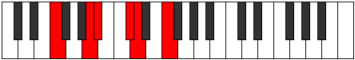

# Mode Zothitonic

## Links

- [Documentation](index.md)
- [Scales Index](Scales.md)
- [Modes Index](Modes.md)
- [Chords Index](Chords.md)

## Parent Scale

[Zothitonic](ScaleZothitonic.md)

## Number

[817](https://ianring.com/musictheory/scales/817)

## Interval Pattern

4, 1, 3, 1, 3

## Chord Pattern

II⁺

## Perfection

- 2 Perfect notes
- 3 Perfect notes

## Perfection Profile

[false false true false true]

## Permutations

| Tonic | Notes | Signature | Illustration | Audio |
|-------|-------|-----------|--------------|-------|
| [C](ModeCNaturalZothitonic.md) | **C**, **E**, F, **G#**, A, **C** | C |  | [midi](https://github.com/edipermadi/music/blob/main/docs/ModeCNaturalZothitonic.mid?raw=true) |
| [C#](ModeCSharpZothitonic.md) | **C#**, **F**, F#, **A**, A#, **C#** | C |  | [midi](https://github.com/edipermadi/music/blob/main/docs/ModeCSharpZothitonic.mid?raw=true) |
| [Db](ModeDFlatZothitonic.md) | **Db**, **F**, Gb, **A**, Bb, **Db** | C |  | [midi](https://github.com/edipermadi/music/blob/main/docs/ModeDFlatZothitonic.mid?raw=true) |
| [D](ModeDNaturalZothitonic.md) | **D**, **F#**, G, **A#**, B, **D** | C |  | [midi](https://github.com/edipermadi/music/blob/main/docs/ModeDNaturalZothitonic.mid?raw=true) |
| [D#](ModeDSharpZothitonic.md) | **D#**, **G**, G#, **B**, C, **D#** | C |  | [midi](https://github.com/edipermadi/music/blob/main/docs/ModeDSharpZothitonic.mid?raw=true) |
| [Eb](ModeEFlatZothitonic.md) | **Eb**, **G**, Ab, **B**, C, **Eb** | C |  | [midi](https://github.com/edipermadi/music/blob/main/docs/ModeEFlatZothitonic.mid?raw=true) |
| [E](ModeENaturalZothitonic.md) | **E**, **G#**, A, **C**, C#, **E** | C |  | [midi](https://github.com/edipermadi/music/blob/main/docs/ModeENaturalZothitonic.mid?raw=true) |
| [F](ModeFNaturalZothitonic.md) | **F**, **A**, A#, **C#**, D, **F** | C |  | [midi](https://github.com/edipermadi/music/blob/main/docs/ModeFNaturalZothitonic.mid?raw=true) |
| [F#](ModeFSharpZothitonic.md) | **F#**, **A#**, B, **D**, D#, **F#** | C |  | [midi](https://github.com/edipermadi/music/blob/main/docs/ModeFSharpZothitonic.mid?raw=true) |
| [Gb](ModeGFlatZothitonic.md) | **Gb**, **Bb**, B, **D**, Eb, **Gb** | C |  | [midi](https://github.com/edipermadi/music/blob/main/docs/ModeGFlatZothitonic.mid?raw=true) |
| [G](ModeGNaturalZothitonic.md) | **G**, **B**, C, **D#**, E, **G** | C |  | [midi](https://github.com/edipermadi/music/blob/main/docs/ModeGNaturalZothitonic.mid?raw=true) |
| [G#](ModeGSharpZothitonic.md) | **G#**, **C**, C#, **E**, F, **G#** | C |  | [midi](https://github.com/edipermadi/music/blob/main/docs/ModeGSharpZothitonic.mid?raw=true) |
| [Ab](ModeAFlatZothitonic.md) | **Ab**, **C**, Db, **E**, F, **Ab** | C |  | [midi](https://github.com/edipermadi/music/blob/main/docs/ModeAFlatZothitonic.mid?raw=true) |
| [A](ModeANaturalZothitonic.md) | **A**, **C#**, D, **F**, F#, **A** | C |  | [midi](https://github.com/edipermadi/music/blob/main/docs/ModeANaturalZothitonic.mid?raw=true) |
| [A#](ModeASharpZothitonic.md) | **A#**, **D**, D#, **F#**, G, **A#** | C |  | [midi](https://github.com/edipermadi/music/blob/main/docs/ModeASharpZothitonic.mid?raw=true) |
| [Bb](ModeBFlatZothitonic.md) | **Bb**, **D**, Eb, **Gb**, G, **Bb** | C |  | [midi](https://github.com/edipermadi/music/blob/main/docs/ModeBFlatZothitonic.mid?raw=true) |
| [B](ModeBNaturalZothitonic.md) | **B**, **D#**, E, **G**, G#, **B** | C |  | [midi](https://github.com/edipermadi/music/blob/main/docs/ModeBNaturalZothitonic.mid?raw=true) |
