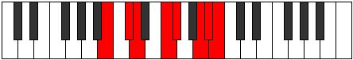

# Mode Zycrian

## Links

- [Documentation](index.md)
- [Scales Index](Scales.md)
- [Modes Index](Modes.md)
- [Chords Index](Chords.md)

## Parent Scale

[Tholian](ScaleTholian.md)

## Number

[3277](https://ianring.com/musictheory/scales/3277)

## Interval Pattern

2, 1, 3, 1, 3, 1, 1

## Chord Pattern

i⁰, i, II⁺, iii, III, III⁺, IV⁺, v, V, V⁺, VI⁺, vii, VII, VII⁺

## Perfection

- 4 Perfect notes
- 3 Perfect notes

## Perfection Profile

[true false true false true false true]

## Permutations

| Tonic | Notes | Signature | Illustration | Audio |
|-------|-------|-----------|--------------|-------|
| [C](ModeCNaturalZycrian.md) | C, **D**, Eb, **F#**, G, **A#**, B, C | C |  | [midi](https://github.com/edipermadi/music/blob/main/docs/ModeCNaturalZycrian.mid?raw=true) |
| [C#](ModeCSharpZycrian.md) | C#, **D#**, E, **F##**, G#, **A##**, B#, C# | C |  | [midi](https://github.com/edipermadi/music/blob/main/docs/ModeCSharpZycrian.mid?raw=true) |
| [Db](ModeDFlatZycrian.md) | Db, **Eb**, Fb, **G**, Ab, **B**, C, Db | C |  | [midi](https://github.com/edipermadi/music/blob/main/docs/ModeDFlatZycrian.mid?raw=true) |
| [D](ModeDNaturalZycrian.md) | D, **E**, F, **G#**, A, **B#**, C#, D | C |  | [midi](https://github.com/edipermadi/music/blob/main/docs/ModeDNaturalZycrian.mid?raw=true) |
| [D#](ModeDSharpZycrian.md) | D#, **E#**, F#, **G##**, A#, **B##**, C##, D# | C |  | [midi](https://github.com/edipermadi/music/blob/main/docs/ModeDSharpZycrian.mid?raw=true) |
| [Eb](ModeEFlatZycrian.md) | Eb, **F**, Gb, **A**, Bb, **C#**, D, Eb | C |  | [midi](https://github.com/edipermadi/music/blob/main/docs/ModeEFlatZycrian.mid?raw=true) |
| [E](ModeENaturalZycrian.md) | E, **F#**, G, **A#**, B, **C##**, D#, E | C |  | [midi](https://github.com/edipermadi/music/blob/main/docs/ModeENaturalZycrian.mid?raw=true) |
| [F](ModeFNaturalZycrian.md) | F, **G**, Ab, **B**, C, **D#**, E, F | C |  | [midi](https://github.com/edipermadi/music/blob/main/docs/ModeFNaturalZycrian.mid?raw=true) |
| [F#](ModeFSharpZycrian.md) | F#, **G#**, A, **B#**, C#, **D##**, E#, F# | C |  | [midi](https://github.com/edipermadi/music/blob/main/docs/ModeFSharpZycrian.mid?raw=true) |
| [Gb](ModeGFlatZycrian.md) | Gb, **Ab**, Bbb, **C**, Db, **E**, F, Gb | C |  | [midi](https://github.com/edipermadi/music/blob/main/docs/ModeGFlatZycrian.mid?raw=true) |
| [G](ModeGNaturalZycrian.md) | G, **A**, Bb, **C#**, D, **E#**, F#, G | C |  | [midi](https://github.com/edipermadi/music/blob/main/docs/ModeGNaturalZycrian.mid?raw=true) |
| [G#](ModeGSharpZycrian.md) | G#, **A#**, B, **C##**, D#, **E##**, F##, G# | C |  | [midi](https://github.com/edipermadi/music/blob/main/docs/ModeGSharpZycrian.mid?raw=true) |
| [Ab](ModeAFlatZycrian.md) | Ab, **Bb**, Cb, **D**, Eb, **F#**, G, Ab | C |  | [midi](https://github.com/edipermadi/music/blob/main/docs/ModeAFlatZycrian.mid?raw=true) |
| [A](ModeANaturalZycrian.md) | A, **B**, C, **D#**, E, **F##**, G#, A | C |  | [midi](https://github.com/edipermadi/music/blob/main/docs/ModeANaturalZycrian.mid?raw=true) |
| [A#](ModeASharpZycrian.md) | A#, **B#**, C#, **D##**, E#, **F###**, G##, A# | C |  | [midi](https://github.com/edipermadi/music/blob/main/docs/ModeASharpZycrian.mid?raw=true) |
| [Bb](ModeBFlatZycrian.md) | Bb, **C**, Db, **E**, F, **G#**, A, Bb | C |  | [midi](https://github.com/edipermadi/music/blob/main/docs/ModeBFlatZycrian.mid?raw=true) |
| [B](ModeBNaturalZycrian.md) | B, **C#**, D, **E#**, F#, **G##**, A#, B | C |  | [midi](https://github.com/edipermadi/music/blob/main/docs/ModeBNaturalZycrian.mid?raw=true) |
