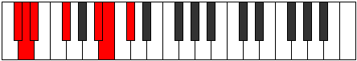

# Mode Zycrimic

## Links

- [Documentation](index.md)
- [Scales Index](Scales.md)
- [Modes Index](Modes.md)
- [Chords Index](Chords.md)

## Parent Scale

[Syrimic](ScaleSyrimic.md)

## Number

[1575](https://ianring.com/musictheory/scales/1575)

## Perfection

- 3 Perfect notes
- 3 Perfect notes

## Perfection Profile

[false false true true false true]

## Permutations

| Tonic | Notes | Signature | Illustration | Audio |
|-------|-------|-----------|--------------|-------|
| [C](ModeCNaturalZycrimic.md) | **C**, **Db**, Ebb, F, **G##**, A#, **C** | C |  | [midi](ModeCNaturalZycrimic.mid) [ogg](ModeCNaturalZycrimic.ogg) |
| [C#](ModeCSharpZycrimic.md) | **C#**, **D**, Eb, F#, **G###**, A##, **C#** | C |  | [midi](ModeCSharpZycrimic.mid) [ogg](ModeCSharpZycrimic.ogg) |
| [Db](ModeDFlatZycrimic.md) | **Db**, **Ebb**, Fbb, Gb, **A#**, B, **Db** | C |  | [midi](ModeDFlatZycrimic.mid) [ogg](ModeDFlatZycrimic.ogg) |
| [D](ModeDNaturalZycrimic.md) | **D**, **Eb**, Fb, G, **A##**, B#, **D** | C |  | [midi](ModeDNaturalZycrimic.mid) [ogg](ModeDNaturalZycrimic.ogg) |
| [D#](ModeDSharpZycrimic.md) | **D#**, **E**, F, G#, **A###**, B##, **D#** | C |  | [midi](ModeDSharpZycrimic.mid) [ogg](ModeDSharpZycrimic.ogg) |
| [Eb](ModeEFlatZycrimic.md) | **Eb**, **Fb**, Gbb, Ab, **B#**, C#, **Eb** | C |  | [midi](ModeEFlatZycrimic.mid) [ogg](ModeEFlatZycrimic.ogg) |
| [E](ModeENaturalZycrimic.md) | **E**, **F**, Gb, A, **B##**, C##, **E** | C |  | [midi](ModeENaturalZycrimic.mid) [ogg](ModeENaturalZycrimic.ogg) |
| [F](ModeFNaturalZycrimic.md) | **F**, **Gb**, Abb, Bb, **C##**, D#, **F** | C |  | [midi](ModeFNaturalZycrimic.mid) [ogg](ModeFNaturalZycrimic.ogg) |
| [F#](ModeFSharpZycrimic.md) | **F#**, **G**, Ab, B, **C###**, D##, **F#** | C |  | [midi](ModeFSharpZycrimic.mid) [ogg](ModeFSharpZycrimic.ogg) |
| [Gb](ModeGFlatZycrimic.md) | **Gb**, **Abb**, Bbbb, Cb, **D#**, E, **Gb** | C |  | [midi](ModeGFlatZycrimic.mid) [ogg](ModeGFlatZycrimic.ogg) |
| [G](ModeGNaturalZycrimic.md) | **G**, **Ab**, Bbb, C, **D##**, E#, **G** | C |  | [midi](ModeGNaturalZycrimic.mid) [ogg](ModeGNaturalZycrimic.ogg) |
| [G#](ModeGSharpZycrimic.md) | **G#**, **A**, Bb, C#, **D###**, E##, **G#** | C |  | [midi](ModeGSharpZycrimic.mid) [ogg](ModeGSharpZycrimic.ogg) |
| [Ab](ModeAFlatZycrimic.md) | **Ab**, **Bbb**, Cbb, Db, **E#**, F#, **Ab** | C |  | [midi](ModeAFlatZycrimic.mid) [ogg](ModeAFlatZycrimic.ogg) |
| [A](ModeANaturalZycrimic.md) | **A**, **Bb**, Cb, D, **E##**, F##, **A** | C |  | [midi](ModeANaturalZycrimic.mid) [ogg](ModeANaturalZycrimic.ogg) |
| [A#](ModeASharpZycrimic.md) | **A#**, **B**, C, D#, **E###**, F###, **A#** | C |  | [midi](ModeASharpZycrimic.mid) [ogg](ModeASharpZycrimic.ogg) |
| [Bb](ModeBFlatZycrimic.md) | **Bb**, **Cb**, Dbb, Eb, **F##**, G#, **Bb** | C |  | [midi](ModeBFlatZycrimic.mid) [ogg](ModeBFlatZycrimic.ogg) |
| [B](ModeBNaturalZycrimic.md) | **B**, **C**, Db, E, **F###**, G##, **B** | C |  | [midi](ModeBNaturalZycrimic.mid) [ogg](ModeBNaturalZycrimic.ogg) |
