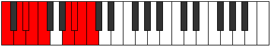

# Mode Zycryllic

## Links

- [Documentation](index.md)
- [Scales Index](Scales.md)
- [Modes Index](Modes.md)
- [Chords Index](Chords.md)

## Parent Scale

[Pynyllic](ScalePynyllic.md)

## Number

[3645](https://ianring.com/musictheory/scales/3645)

## Perfection

- 6 Perfect notes
- 2 Perfect notes

## Perfection Profile

[false true true true true true true false]

## Permutations

| Tonic | Notes | Signature | Illustration | Audio |
|-------|-------|-----------|--------------|-------|
| [C](ModeCNaturalZycryllic.md) | **C**, D, D#, E, F, A, A#, **B**, **C** | C |  | [midi](ModeCNaturalZycryllic.mid) [ogg](ModeCNaturalZycryllic.ogg) |
| [C#](ModeCSharpZycryllic.md) | **C#**, D#, E, F, F#, A#, B, **C**, **C#** | C |  | [midi](ModeCSharpZycryllic.mid) [ogg](ModeCSharpZycryllic.ogg) |
| [Db](ModeDFlatZycryllic.md) | **Db**, Eb, E, F, Gb, Bb, B, **C**, **Db** | C |  | [midi](ModeDFlatZycryllic.mid) [ogg](ModeDFlatZycryllic.ogg) |
| [D](ModeDNaturalZycryllic.md) | **D**, E, F, F#, G, B, C, **C#**, **D** | C |  | [midi](ModeDNaturalZycryllic.mid) [ogg](ModeDNaturalZycryllic.ogg) |
| [D#](ModeDSharpZycryllic.md) | **D#**, F, F#, G, G#, C, C#, **D**, **D#** | C |  | [midi](ModeDSharpZycryllic.mid) [ogg](ModeDSharpZycryllic.ogg) |
| [Eb](ModeEFlatZycryllic.md) | **Eb**, F, Gb, G, Ab, C, Db, **D**, **Eb** | C |  | [midi](ModeEFlatZycryllic.mid) [ogg](ModeEFlatZycryllic.ogg) |
| [E](ModeENaturalZycryllic.md) | **E**, F#, G, G#, A, C#, D, **D#**, **E** | C |  | [midi](ModeENaturalZycryllic.mid) [ogg](ModeENaturalZycryllic.ogg) |
| [F](ModeFNaturalZycryllic.md) | **F**, G, G#, A, A#, D, D#, **E**, **F** | C |  | [midi](ModeFNaturalZycryllic.mid) [ogg](ModeFNaturalZycryllic.ogg) |
| [F#](ModeFSharpZycryllic.md) | **F#**, G#, A, A#, B, D#, E, **F**, **F#** | C |  | [midi](ModeFSharpZycryllic.mid) [ogg](ModeFSharpZycryllic.ogg) |
| [Gb](ModeGFlatZycryllic.md) | **Gb**, Ab, A, Bb, B, Eb, E, **F**, **Gb** | C |  | [midi](ModeGFlatZycryllic.mid) [ogg](ModeGFlatZycryllic.ogg) |
| [G](ModeGNaturalZycryllic.md) | **G**, A, A#, B, C, E, F, **F#**, **G** | C |  | [midi](ModeGNaturalZycryllic.mid) [ogg](ModeGNaturalZycryllic.ogg) |
| [G#](ModeGSharpZycryllic.md) | **G#**, A#, B, C, C#, F, F#, **G**, **G#** | C |  | [midi](ModeGSharpZycryllic.mid) [ogg](ModeGSharpZycryllic.ogg) |
| [Ab](ModeAFlatZycryllic.md) | **Ab**, Bb, B, C, Db, F, Gb, **G**, **Ab** | C |  | [midi](ModeAFlatZycryllic.mid) [ogg](ModeAFlatZycryllic.ogg) |
| [A](ModeANaturalZycryllic.md) | **A**, B, C, C#, D, F#, G, **G#**, **A** | C |  | [midi](ModeANaturalZycryllic.mid) [ogg](ModeANaturalZycryllic.ogg) |
| [A#](ModeASharpZycryllic.md) | **A#**, C, C#, D, D#, G, G#, **A**, **A#** | C |  | [midi](ModeASharpZycryllic.mid) [ogg](ModeASharpZycryllic.ogg) |
| [Bb](ModeBFlatZycryllic.md) | **Bb**, C, Db, D, Eb, G, Ab, **A**, **Bb** | C |  | [midi](ModeBFlatZycryllic.mid) [ogg](ModeBFlatZycryllic.ogg) |
| [B](ModeBNaturalZycryllic.md) | **B**, C#, D, D#, E, G#, A, **A#**, **B** | C |  | [midi](ModeBNaturalZycryllic.mid) [ogg](ModeBNaturalZycryllic.ogg) |
