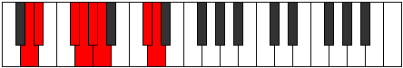
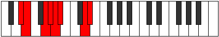
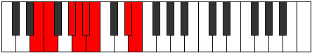
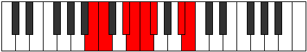

# Mode Zydian

## Links

- [Documentation](index.md)
- [Scales Index](Scales.md)
- [Modes Index](Modes.md)
- [Chords Index](Chords.md)

## Parent Scale

[Ionarian](ScaleIonarian.md)

## Number

[2291](https://ianring.com/musictheory/scales/2291)

## Perfection

- 5 Perfect notes
- 2 Perfect notes

## Perfection Profile

[true false true true true false true]

## Permutations

| Tonic | Notes | Signature | Illustration | Audio |
|-------|-------|-----------|--------------|-------|
| [C](ModeCNaturalZydian.md) | C, **Db**, E, F, Gb, **Abb**, B, C | C |  | [midi](ModeCNaturalZydian.mid) [ogg](ModeCNaturalZydian.ogg) |
| [C#](ModeCSharpZydian.md) | C#, **D**, E#, F#, G, **Ab**, B#, C# | C |  | [midi](ModeCSharpZydian.mid) [ogg](ModeCSharpZydian.ogg) |
| [Db](ModeDFlatZydian.md) | Db, **Ebb**, F, Gb, Abb, **Bbbb**, C, Db | C |  | [midi](ModeDFlatZydian.mid) [ogg](ModeDFlatZydian.ogg) |
| [D](ModeDNaturalZydian.md) | D, **Eb**, F#, G, Ab, **Bbb**, C#, D | C |  | [midi](ModeDNaturalZydian.mid) [ogg](ModeDNaturalZydian.ogg) |
| [D#](ModeDSharpZydian.md) | D#, **E**, F##, G#, A, **Bb**, C##, D# | C |  | [midi](ModeDSharpZydian.mid) [ogg](ModeDSharpZydian.ogg) |
| [Eb](ModeEFlatZydian.md) | Eb, **Fb**, G, Ab, Bbb, **Cbb**, D, Eb | C |  | [midi](ModeEFlatZydian.mid) [ogg](ModeEFlatZydian.ogg) |
| [E](ModeENaturalZydian.md) | E, **F**, G#, A, Bb, **Cb**, D#, E | C |  | [midi](ModeENaturalZydian.mid) [ogg](ModeENaturalZydian.ogg) |
| [F](ModeFNaturalZydian.md) | F, **Gb**, A, Bb, Cb, **Dbb**, E, F | C |  | [midi](ModeFNaturalZydian.mid) [ogg](ModeFNaturalZydian.ogg) |
| [F#](ModeFSharpZydian.md) | F#, **G**, A#, B, C, **Db**, E#, F# | C |  | [midi](ModeFSharpZydian.mid) [ogg](ModeFSharpZydian.ogg) |
| [Gb](ModeGFlatZydian.md) | Gb, **Abb**, Bb, Cb, Dbb, **Ebbb**, F, Gb | C |  | [midi](ModeGFlatZydian.mid) [ogg](ModeGFlatZydian.ogg) |
| [G](ModeGNaturalZydian.md) | G, **Ab**, B, C, Db, **Ebb**, F#, G | C |  | [midi](ModeGNaturalZydian.mid) [ogg](ModeGNaturalZydian.ogg) |
| [G#](ModeGSharpZydian.md) | G#, **A**, B#, C#, D, **Eb**, F##, G# | C |  | [midi](ModeGSharpZydian.mid) [ogg](ModeGSharpZydian.ogg) |
| [Ab](ModeAFlatZydian.md) | Ab, **Bbb**, C, Db, Ebb, **Fbb**, G, Ab | C |  | [midi](ModeAFlatZydian.mid) [ogg](ModeAFlatZydian.ogg) |
| [A](ModeANaturalZydian.md) | A, **Bb**, C#, D, Eb, **Fb**, G#, A | C |  | [midi](ModeANaturalZydian.mid) [ogg](ModeANaturalZydian.ogg) |
| [A#](ModeASharpZydian.md) | A#, **B**, C##, D#, E, **F**, G##, A# | C |  | [midi](ModeASharpZydian.mid) [ogg](ModeASharpZydian.ogg) |
| [Bb](ModeBFlatZydian.md) | Bb, **Cb**, D, Eb, Fb, **Gbb**, A, Bb | C |  | [midi](ModeBFlatZydian.mid) [ogg](ModeBFlatZydian.ogg) |
| [B](ModeBNaturalZydian.md) | B, **C**, D#, E, F, **Gb**, A#, B | C |  | [midi](ModeBNaturalZydian.mid) [ogg](ModeBNaturalZydian.ogg) |
