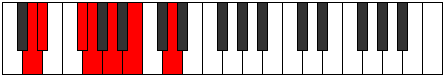

# Mode Zydimic

## Links

- [Documentation](index.md)
- [Scales Index](Scales.md)
- [Modes Index](Modes.md)
- [Chords Index](Chords.md)

## Parent Scale

[Dynimic](ScaleDynimic.md)

## Number

[691](https://ianring.com/musictheory/scales/691)

## Interval Pattern

1, 3, 1, 2, 2, 3

## Chord Pattern

I, ii⁰, II⁺, IV, IV⁺, vi, VI, VI⁺

## Perfection

- 3 Perfect notes
- 3 Perfect notes

## Perfection Profile

[true false false true false true]

## Permutations

| Tonic | Notes | Signature | Illustration | Audio |
|-------|-------|-----------|--------------|-------|
| [C](ModeCNaturalZydimic.md) | C, **Db**, **E**, F, **G**, A, C | C |  | [midi](https://github.com/edipermadi/music/blob/main/docs/ModeCNaturalZydimic.mid?raw=true) |
| [C#](ModeCSharpZydimic.md) | C#, **D**, **E#**, F#, **G#**, A#, C# | C |  | [midi](https://github.com/edipermadi/music/blob/main/docs/ModeCSharpZydimic.mid?raw=true) |
| [Db](ModeDFlatZydimic.md) | Db, **Ebb**, **F**, Gb, **Ab**, Bb, Db | C |  | [midi](https://github.com/edipermadi/music/blob/main/docs/ModeDFlatZydimic.mid?raw=true) |
| [D](ModeDNaturalZydimic.md) | D, **Eb**, **F#**, G, **A**, B, D | C |  | [midi](https://github.com/edipermadi/music/blob/main/docs/ModeDNaturalZydimic.mid?raw=true) |
| [D#](ModeDSharpZydimic.md) | D#, **E**, **F##**, G#, **A#**, B#, D# | C |  | [midi](https://github.com/edipermadi/music/blob/main/docs/ModeDSharpZydimic.mid?raw=true) |
| [Eb](ModeEFlatZydimic.md) | Eb, **Fb**, **G**, Ab, **Bb**, C, Eb | C |  | [midi](https://github.com/edipermadi/music/blob/main/docs/ModeEFlatZydimic.mid?raw=true) |
| [E](ModeENaturalZydimic.md) | E, **F**, **G#**, A, **B**, C#, E | C |  | [midi](https://github.com/edipermadi/music/blob/main/docs/ModeENaturalZydimic.mid?raw=true) |
| [F](ModeFNaturalZydimic.md) | F, **Gb**, **A**, Bb, **C**, D, F | C |  | [midi](https://github.com/edipermadi/music/blob/main/docs/ModeFNaturalZydimic.mid?raw=true) |
| [F#](ModeFSharpZydimic.md) | F#, **G**, **A#**, B, **C#**, D#, F# | C |  | [midi](https://github.com/edipermadi/music/blob/main/docs/ModeFSharpZydimic.mid?raw=true) |
| [Gb](ModeGFlatZydimic.md) | Gb, **Abb**, **Bb**, Cb, **Db**, Eb, Gb | C |  | [midi](https://github.com/edipermadi/music/blob/main/docs/ModeGFlatZydimic.mid?raw=true) |
| [G](ModeGNaturalZydimic.md) | G, **Ab**, **B**, C, **D**, E, G | C |  | [midi](https://github.com/edipermadi/music/blob/main/docs/ModeGNaturalZydimic.mid?raw=true) |
| [G#](ModeGSharpZydimic.md) | G#, **A**, **B#**, C#, **D#**, E#, G# | C |  | [midi](https://github.com/edipermadi/music/blob/main/docs/ModeGSharpZydimic.mid?raw=true) |
| [Ab](ModeAFlatZydimic.md) | Ab, **Bbb**, **C**, Db, **Eb**, F, Ab | C |  | [midi](https://github.com/edipermadi/music/blob/main/docs/ModeAFlatZydimic.mid?raw=true) |
| [A](ModeANaturalZydimic.md) | A, **Bb**, **C#**, D, **E**, F#, A | C |  | [midi](https://github.com/edipermadi/music/blob/main/docs/ModeANaturalZydimic.mid?raw=true) |
| [A#](ModeASharpZydimic.md) | A#, **B**, **C##**, D#, **E#**, F##, A# | C |  | [midi](https://github.com/edipermadi/music/blob/main/docs/ModeASharpZydimic.mid?raw=true) |
| [Bb](ModeBFlatZydimic.md) | Bb, **Cb**, **D**, Eb, **F**, G, Bb | C |  | [midi](https://github.com/edipermadi/music/blob/main/docs/ModeBFlatZydimic.mid?raw=true) |
| [B](ModeBNaturalZydimic.md) | B, **C**, **D#**, E, **F#**, G#, B | C |  | [midi](https://github.com/edipermadi/music/blob/main/docs/ModeBNaturalZydimic.mid?raw=true) |
