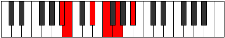

# Mode Zyditonic

## Links

- [Documentation](README.md)
- [Scales Index](Scales.md)
- [Modes Index](Modes.md)
- [Chords Index](Chords.md)

## Parent Scale

[Aeolanitonic](ScaleAeolanitonic.md)

## Number

[675](https://ianring.com/musictheory/scales/675)

## Luminosity

4

## Transposition

1, 4, 2, 2, 3

## Chord Pattern

III⁺

## Perfection

- 2 Perfect notes
- 3 Perfect notes

## Perfection Profile

true, false, true, false, false

## Permutations

| Tonic | Notes | Signature | Illustration | Audio |
|-------|-------|-----------|--------------|-------|
| [C](ModeCNaturalZyditonic.md) | C, **C#**, F, **G**, **A**, C | C |  | [midi](https://github.com/edipermadi/music/blob/main/docs/ModeCNaturalZyditonic.mid?raw=true) |
| [C#](ModeCSharpZyditonic.md) | C#, **D**, F#, **G#**, **A#**, C# | C |  | [midi](https://github.com/edipermadi/music/blob/main/docs/ModeCSharpZyditonic.mid?raw=true) |
| [Db](ModeDFlatZyditonic.md) | Db, **D**, Gb, **Ab**, **Bb**, Db | C |  | [midi](https://github.com/edipermadi/music/blob/main/docs/ModeDFlatZyditonic.mid?raw=true) |
| [D](ModeDNaturalZyditonic.md) | D, **D#**, G, **A**, **B**, D | C |  | [midi](https://github.com/edipermadi/music/blob/main/docs/ModeDNaturalZyditonic.mid?raw=true) |
| [D#](ModeDSharpZyditonic.md) | D#, **E**, G#, **A#**, **C**, D# | C |  | [midi](https://github.com/edipermadi/music/blob/main/docs/ModeDSharpZyditonic.mid?raw=true) |
| [Eb](ModeEFlatZyditonic.md) | Eb, **E**, Ab, **Bb**, **C**, Eb | C |  | [midi](https://github.com/edipermadi/music/blob/main/docs/ModeEFlatZyditonic.mid?raw=true) |
| [E](ModeENaturalZyditonic.md) | E, **F**, A, **B**, **C#**, E | C |  | [midi](https://github.com/edipermadi/music/blob/main/docs/ModeENaturalZyditonic.mid?raw=true) |
| [F](ModeFNaturalZyditonic.md) | F, **F#**, A#, **C**, **D**, F | C |  | [midi](https://github.com/edipermadi/music/blob/main/docs/ModeFNaturalZyditonic.mid?raw=true) |
| [F#](ModeFSharpZyditonic.md) | F#, **G**, B, **C#**, **D#**, F# | C |  | [midi](https://github.com/edipermadi/music/blob/main/docs/ModeFSharpZyditonic.mid?raw=true) |
| [Gb](ModeGFlatZyditonic.md) | Gb, **G**, B, **Db**, **Eb**, Gb | C |  | [midi](https://github.com/edipermadi/music/blob/main/docs/ModeGFlatZyditonic.mid?raw=true) |
| [G](ModeGNaturalZyditonic.md) | G, **G#**, C, **D**, **E**, G | C |  | [midi](https://github.com/edipermadi/music/blob/main/docs/ModeGNaturalZyditonic.mid?raw=true) |
| [G#](ModeGSharpZyditonic.md) | G#, **A**, C#, **D#**, **F**, G# | C |  | [midi](https://github.com/edipermadi/music/blob/main/docs/ModeGSharpZyditonic.mid?raw=true) |
| [Ab](ModeAFlatZyditonic.md) | Ab, **A**, Db, **Eb**, **F**, Ab | C |  | [midi](https://github.com/edipermadi/music/blob/main/docs/ModeAFlatZyditonic.mid?raw=true) |
| [A](ModeANaturalZyditonic.md) | A, **A#**, D, **E**, **F#**, A | C |  | [midi](https://github.com/edipermadi/music/blob/main/docs/ModeANaturalZyditonic.mid?raw=true) |
| [A#](ModeASharpZyditonic.md) | A#, **B**, D#, **F**, **G**, A# | C |  | [midi](https://github.com/edipermadi/music/blob/main/docs/ModeASharpZyditonic.mid?raw=true) |
| [Bb](ModeBFlatZyditonic.md) | Bb, **B**, Eb, **F**, **G**, Bb | C |  | [midi](https://github.com/edipermadi/music/blob/main/docs/ModeBFlatZyditonic.mid?raw=true) |
| [B](ModeBNaturalZyditonic.md) | B, **C**, E, **F#**, **G#**, B | C |  | [midi](https://github.com/edipermadi/music/blob/main/docs/ModeBNaturalZyditonic.mid?raw=true) |
