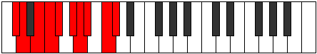

# Mode Zydygic

## Links

- [Documentation](index.md)
- [Scales Index](Scales.md)
- [Modes Index](Modes.md)
- [Chords Index](Chords.md)

## Parent Scale

[Phronygic](ScalePhronygic.md)

## Number

[3003](https://ianring.com/musictheory/scales/3003)

## Perfection

- 6 Perfect notes
- 3 Perfect notes

## Perfection Profile

[true true false true true false true true false]

## Permutations

| Tonic | Notes | Signature | Illustration | Audio |
|-------|-------|-----------|--------------|-------|
| [C](ModeCNaturalZydygic.md) | C, C#, **D#**, E, F, **G**, G#, A, **B**, C | C |  | [midi](ModeCNaturalZydygic.mid) [ogg](ModeCNaturalZydygic.ogg) |
| [C#](ModeCSharpZydygic.md) | C#, D, **E**, F, F#, **G#**, A, A#, **C**, C# | C |  | [midi](ModeCSharpZydygic.mid) [ogg](ModeCSharpZydygic.ogg) |
| [Db](ModeDFlatZydygic.md) | Db, D, **E**, F, Gb, **Ab**, A, Bb, **C**, Db | C |  | [midi](ModeDFlatZydygic.mid) [ogg](ModeDFlatZydygic.ogg) |
| [D](ModeDNaturalZydygic.md) | D, D#, **F**, F#, G, **A**, A#, B, **C#**, D | C |  | [midi](ModeDNaturalZydygic.mid) [ogg](ModeDNaturalZydygic.ogg) |
| [D#](ModeDSharpZydygic.md) | D#, E, **F#**, G, G#, **A#**, B, C, **D**, D# | C |  | [midi](ModeDSharpZydygic.mid) [ogg](ModeDSharpZydygic.ogg) |
| [Eb](ModeEFlatZydygic.md) | Eb, E, **Gb**, G, Ab, **Bb**, B, C, **D**, Eb | C |  | [midi](ModeEFlatZydygic.mid) [ogg](ModeEFlatZydygic.ogg) |
| [E](ModeENaturalZydygic.md) | E, F, **G**, G#, A, **B**, C, C#, **D#**, E | C |  | [midi](ModeENaturalZydygic.mid) [ogg](ModeENaturalZydygic.ogg) |
| [F](ModeFNaturalZydygic.md) | F, F#, **G#**, A, A#, **C**, C#, D, **E**, F | C |  | [midi](ModeFNaturalZydygic.mid) [ogg](ModeFNaturalZydygic.ogg) |
| [F#](ModeFSharpZydygic.md) | F#, G, **A**, A#, B, **C#**, D, D#, **F**, F# | C |  | [midi](ModeFSharpZydygic.mid) [ogg](ModeFSharpZydygic.ogg) |
| [Gb](ModeGFlatZydygic.md) | Gb, G, **A**, Bb, B, **Db**, D, Eb, **F**, Gb | C |  | [midi](ModeGFlatZydygic.mid) [ogg](ModeGFlatZydygic.ogg) |
| [G](ModeGNaturalZydygic.md) | G, G#, **A#**, B, C, **D**, D#, E, **F#**, G | C |  | [midi](ModeGNaturalZydygic.mid) [ogg](ModeGNaturalZydygic.ogg) |
| [G#](ModeGSharpZydygic.md) | G#, A, **B**, C, C#, **D#**, E, F, **G**, G# | C |  | [midi](ModeGSharpZydygic.mid) [ogg](ModeGSharpZydygic.ogg) |
| [Ab](ModeAFlatZydygic.md) | Ab, A, **B**, C, Db, **Eb**, E, F, **G**, Ab | C |  | [midi](ModeAFlatZydygic.mid) [ogg](ModeAFlatZydygic.ogg) |
| [A](ModeANaturalZydygic.md) | A, A#, **C**, C#, D, **E**, F, F#, **G#**, A | C |  | [midi](ModeANaturalZydygic.mid) [ogg](ModeANaturalZydygic.ogg) |
| [A#](ModeASharpZydygic.md) | A#, B, **C#**, D, D#, **F**, F#, G, **A**, A# | C |  | [midi](ModeASharpZydygic.mid) [ogg](ModeASharpZydygic.ogg) |
| [Bb](ModeBFlatZydygic.md) | Bb, B, **Db**, D, Eb, **F**, Gb, G, **A**, Bb | C |  | [midi](ModeBFlatZydygic.mid) [ogg](ModeBFlatZydygic.ogg) |
| [B](ModeBNaturalZydygic.md) | B, C, **D**, D#, E, **F#**, G, G#, **A#**, B | C |  | [midi](ModeBNaturalZydygic.mid) [ogg](ModeBNaturalZydygic.ogg) |
