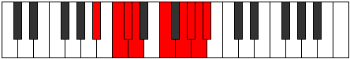

# Mode Zydyllic

## Links

- [Documentation](index.md)
- [Scales Index](Scales.md)
- [Modes Index](Modes.md)
- [Chords Index](Chords.md)

## Parent Scale

[Pothyllic](ScalePothyllic.md)

## Number

[3741](https://ianring.com/musictheory/scales/3741)

## Perfection

- 6 Perfect notes
- 2 Perfect notes

## Perfection Profile

[true true true true true true false false]

## Permutations

| Tonic | Notes | Signature | Illustration | Audio |
|-------|-------|-----------|--------------|-------|
| [C](ModeCNaturalZydyllic.md) | C, D, D#, E, G, A, **A#**, **B**, C | C |  | [midi](ModeCNaturalZydyllic.mid) [ogg](ModeCNaturalZydyllic.ogg) |
| [C#](ModeCSharpZydyllic.md) | C#, D#, E, F, G#, A#, **B**, **C**, C# | C |  | [midi](ModeCSharpZydyllic.mid) [ogg](ModeCSharpZydyllic.ogg) |
| [Db](ModeDFlatZydyllic.md) | Db, Eb, E, F, Ab, Bb, **B**, **C**, Db | C |  | [midi](ModeDFlatZydyllic.mid) [ogg](ModeDFlatZydyllic.ogg) |
| [D](ModeDNaturalZydyllic.md) | D, E, F, F#, A, B, **C**, **C#**, D | C |  | [midi](ModeDNaturalZydyllic.mid) [ogg](ModeDNaturalZydyllic.ogg) |
| [D#](ModeDSharpZydyllic.md) | D#, F, F#, G, A#, C, **C#**, **D**, D# | C |  | [midi](ModeDSharpZydyllic.mid) [ogg](ModeDSharpZydyllic.ogg) |
| [Eb](ModeEFlatZydyllic.md) | Eb, F, Gb, G, Bb, C, **Db**, **D**, Eb | C |  | [midi](ModeEFlatZydyllic.mid) [ogg](ModeEFlatZydyllic.ogg) |
| [E](ModeENaturalZydyllic.md) | E, F#, G, G#, B, C#, **D**, **D#**, E | C |  | [midi](ModeENaturalZydyllic.mid) [ogg](ModeENaturalZydyllic.ogg) |
| [F](ModeFNaturalZydyllic.md) | F, G, G#, A, C, D, **D#**, **E**, F | C |  | [midi](ModeFNaturalZydyllic.mid) [ogg](ModeFNaturalZydyllic.ogg) |
| [F#](ModeFSharpZydyllic.md) | F#, G#, A, A#, C#, D#, **E**, **F**, F# | C |  | [midi](ModeFSharpZydyllic.mid) [ogg](ModeFSharpZydyllic.ogg) |
| [Gb](ModeGFlatZydyllic.md) | Gb, Ab, A, Bb, Db, Eb, **E**, **F**, Gb | C |  | [midi](ModeGFlatZydyllic.mid) [ogg](ModeGFlatZydyllic.ogg) |
| [G](ModeGNaturalZydyllic.md) | G, A, A#, B, D, E, **F**, **F#**, G | C |  | [midi](ModeGNaturalZydyllic.mid) [ogg](ModeGNaturalZydyllic.ogg) |
| [G#](ModeGSharpZydyllic.md) | G#, A#, B, C, D#, F, **F#**, **G**, G# | C |  | [midi](ModeGSharpZydyllic.mid) [ogg](ModeGSharpZydyllic.ogg) |
| [Ab](ModeAFlatZydyllic.md) | Ab, Bb, B, C, Eb, F, **Gb**, **G**, Ab | C |  | [midi](ModeAFlatZydyllic.mid) [ogg](ModeAFlatZydyllic.ogg) |
| [A](ModeANaturalZydyllic.md) | A, B, C, C#, E, F#, **G**, **G#**, A | C |  | [midi](ModeANaturalZydyllic.mid) [ogg](ModeANaturalZydyllic.ogg) |
| [A#](ModeASharpZydyllic.md) | A#, C, C#, D, F, G, **G#**, **A**, A# | C |  | [midi](ModeASharpZydyllic.mid) [ogg](ModeASharpZydyllic.ogg) |
| [Bb](ModeBFlatZydyllic.md) | Bb, C, Db, D, F, G, **Ab**, **A**, Bb | C |  | [midi](ModeBFlatZydyllic.mid) [ogg](ModeBFlatZydyllic.ogg) |
| [B](ModeBNaturalZydyllic.md) | B, C#, D, D#, F#, G#, **A**, **A#**, B | C |  | [midi](ModeBNaturalZydyllic.mid) [ogg](ModeBNaturalZydyllic.ogg) |
