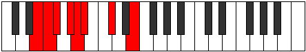
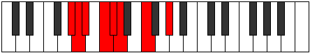

# Mode Zygian

## Links

- [Documentation](index.md)
- [Scales Index](Scales.md)
- [Modes Index](Modes.md)
- [Chords Index](Chords.md)

## Parent Scale

[Stalian](ScaleStalian.md)

## Number

[631](https://ianring.com/musictheory/scales/631)

## Perfection

- 4 Perfect notes
- 3 Perfect notes

## Perfection Profile

[false false true false true true true]

## Permutations

| Tonic | Notes | Signature | Illustration | Audio |
|-------|-------|-----------|--------------|-------|
| [C](ModeCNaturalZygian.md) | **C**, **Db**, Ebb, **Fb**, Gbb, Abbb, Bbb, **C** | C |  | [midi](ModeCNaturalZygian.mid) [ogg](ModeCNaturalZygian.ogg) |
| [C#](ModeCSharpZygian.md) | **C#**, **D**, Eb, **F**, Gb, Abb, Bb, **C#** | C |  | [midi](ModeCSharpZygian.mid) [ogg](ModeCSharpZygian.ogg) |
| [Db](ModeDFlatZygian.md) | **Db**, **Ebb**, Fbb, **Gbb**, Abbb, E###, Cbb, **Db** | C |  | [midi](ModeDFlatZygian.mid) [ogg](ModeDFlatZygian.ogg) |
| [D](ModeDNaturalZygian.md) | **D**, **Eb**, Fb, **Gb**, Abb, Bbbb, Cb, **D** | C |  | [midi](ModeDNaturalZygian.mid) [ogg](ModeDNaturalZygian.ogg) |
| [D#](ModeDSharpZygian.md) | **D#**, **E**, F, **G**, Ab, Bbb, C, **D#** | C |  | [midi](ModeDSharpZygian.mid) [ogg](ModeDSharpZygian.ogg) |
| [Eb](ModeEFlatZygian.md) | **Eb**, **Fb**, Gbb, **Abb**, Bbbb, Cbbb, Dbb, **Eb** | C |  | [midi](ModeEFlatZygian.mid) [ogg](ModeEFlatZygian.ogg) |
| [E](ModeENaturalZygian.md) | **E**, **F**, Gb, **Ab**, Bbb, Cbb, Db, **E** | C |  | [midi](ModeENaturalZygian.mid) [ogg](ModeENaturalZygian.ogg) |
| [F](ModeFNaturalZygian.md) | **F**, **Gb**, Abb, **Bbb**, Cbb, Dbbb, Ebb, **F** | C |  | [midi](ModeFNaturalZygian.mid) [ogg](ModeFNaturalZygian.ogg) |
| [F#](ModeFSharpZygian.md) | **F#**, **G**, Ab, **Bb**, Cb, Dbb, Eb, **F#** | C |  | [midi](ModeFSharpZygian.mid) [ogg](ModeFSharpZygian.ogg) |
| [Gb](ModeGFlatZygian.md) | **Gb**, **Abb**, Bbbb, **Cbb**, Dbbb, Dbb, Eb, **Gb** | C |  | [midi](ModeGFlatZygian.mid) [ogg](ModeGFlatZygian.ogg) |
| [G](ModeGNaturalZygian.md) | **G**, **Ab**, Bbb, **Cb**, Dbb, Ebbb, Fb, **G** | C |  | [midi](ModeGNaturalZygian.mid) [ogg](ModeGNaturalZygian.ogg) |
| [G#](ModeGSharpZygian.md) | **G#**, **A**, Bb, **C**, Db, Ebb, F, **G#** | C |  | [midi](ModeGSharpZygian.mid) [ogg](ModeGSharpZygian.ogg) |
| [Ab](ModeAFlatZygian.md) | **Ab**, **Bbb**, Cbb, **Dbb**, Ebbb, Fbbb, Gbb, **Ab** | C |  | [midi](ModeAFlatZygian.mid) [ogg](ModeAFlatZygian.ogg) |
| [A](ModeANaturalZygian.md) | **A**, **Bb**, Cb, **Db**, Ebb, Fbb, Gb, **A** | C |  | [midi](ModeANaturalZygian.mid) [ogg](ModeANaturalZygian.ogg) |
| [A#](ModeASharpZygian.md) | **A#**, **B**, C, **D**, Eb, Fb, G, **A#** | C |  | [midi](ModeASharpZygian.mid) [ogg](ModeASharpZygian.ogg) |
| [Bb](ModeBFlatZygian.md) | **Bb**, **Cb**, Dbb, **Ebb**, Fbb, Gbbb, Abb, **Bb** | C |  | [midi](ModeBFlatZygian.mid) [ogg](ModeBFlatZygian.ogg) |
| [B](ModeBNaturalZygian.md) | **B**, **C**, Db, **Eb**, Fb, Gbb, Ab, **B** | C |  | [midi](ModeBNaturalZygian.mid) [ogg](ModeBNaturalZygian.ogg) |
