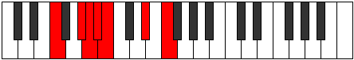

# Mode Zygimic

## Links

- [Documentation](index.md)
- [Scales Index](Scales.md)
- [Modes Index](Modes.md)
- [Chords Index](Chords.md)

## Parent Scale

[Stalimic](ScaleStalimic.md)

## Number

[1145](https://ianring.com/musictheory/scales/1145)

## Perfection

- 3 Perfect notes
- 3 Perfect notes

## Perfection Profile

[false true false true false true]

## Permutations

| Tonic | Notes | Signature | Illustration | Audio |
|-------|-------|-----------|--------------|-------|
| [C](ModeCNaturalZygimic.md) | **C**, D#, **E**, F, **Gb**, A#, **C** | C |  | [midi](ModeCNaturalZygimic.mid) [ogg](ModeCNaturalZygimic.ogg) |
| [C#](ModeCSharpZygimic.md) | **C#**, D##, **E#**, F#, **G**, A##, **C#** | C |  | [midi](ModeCSharpZygimic.mid) [ogg](ModeCSharpZygimic.ogg) |
| [Db](ModeDFlatZygimic.md) | **Db**, E, **F**, Gb, **Abb**, B, **Db** | C |  | [midi](ModeDFlatZygimic.mid) [ogg](ModeDFlatZygimic.ogg) |
| [D](ModeDNaturalZygimic.md) | **D**, E#, **F#**, G, **Ab**, B#, **D** | C |  | [midi](ModeDNaturalZygimic.mid) [ogg](ModeDNaturalZygimic.ogg) |
| [D#](ModeDSharpZygimic.md) | **D#**, E##, **F##**, G#, **A**, B##, **D#** | C |  | [midi](ModeDSharpZygimic.mid) [ogg](ModeDSharpZygimic.ogg) |
| [Eb](ModeEFlatZygimic.md) | **Eb**, F#, **G**, Ab, **Bbb**, C#, **Eb** | C |  | [midi](ModeEFlatZygimic.mid) [ogg](ModeEFlatZygimic.ogg) |
| [E](ModeENaturalZygimic.md) | **E**, F##, **G#**, A, **Bb**, C##, **E** | C |  | [midi](ModeENaturalZygimic.mid) [ogg](ModeENaturalZygimic.ogg) |
| [F](ModeFNaturalZygimic.md) | **F**, G#, **A**, Bb, **Cb**, D#, **F** | C |  | [midi](ModeFNaturalZygimic.mid) [ogg](ModeFNaturalZygimic.ogg) |
| [F#](ModeFSharpZygimic.md) | **F#**, G##, **A#**, B, **C**, D##, **F#** | C |  | [midi](ModeFSharpZygimic.mid) [ogg](ModeFSharpZygimic.ogg) |
| [Gb](ModeGFlatZygimic.md) | **Gb**, A, **Bb**, Cb, **Dbb**, E, **Gb** | C |  | [midi](ModeGFlatZygimic.mid) [ogg](ModeGFlatZygimic.ogg) |
| [G](ModeGNaturalZygimic.md) | **G**, A#, **B**, C, **Db**, E#, **G** | C |  | [midi](ModeGNaturalZygimic.mid) [ogg](ModeGNaturalZygimic.ogg) |
| [G#](ModeGSharpZygimic.md) | **G#**, A##, **B#**, C#, **D**, E##, **G#** | C |  | [midi](ModeGSharpZygimic.mid) [ogg](ModeGSharpZygimic.ogg) |
| [Ab](ModeAFlatZygimic.md) | **Ab**, B, **C**, Db, **Ebb**, F#, **Ab** | C |  | [midi](ModeAFlatZygimic.mid) [ogg](ModeAFlatZygimic.ogg) |
| [A](ModeANaturalZygimic.md) | **A**, B#, **C#**, D, **Eb**, F##, **A** | C |  | [midi](ModeANaturalZygimic.mid) [ogg](ModeANaturalZygimic.ogg) |
| [A#](ModeASharpZygimic.md) | **A#**, B##, **C##**, D#, **E**, F###, **A#** | C |  | [midi](ModeASharpZygimic.mid) [ogg](ModeASharpZygimic.ogg) |
| [Bb](ModeBFlatZygimic.md) | **Bb**, C#, **D**, Eb, **Fb**, G#, **Bb** | C |  | [midi](ModeBFlatZygimic.mid) [ogg](ModeBFlatZygimic.ogg) |
| [B](ModeBNaturalZygimic.md) | **B**, C##, **D#**, E, **F**, G##, **B** | C |  | [midi](ModeBNaturalZygimic.mid) [ogg](ModeBNaturalZygimic.ogg) |
