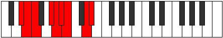

# Mode Zygyllic

## Links

- [Documentation](index.md)
- [Scales Index](Scales.md)
- [Modes Index](Modes.md)
- [Chords Index](Chords.md)

## Parent Scale

[Sydyllic](ScaleSydyllic.md)

## Number

[2535](https://ianring.com/musictheory/scales/2535)

## Interval Pattern

1, 1, 3, 1, 1, 1, 3, 1

## Chord Pattern

II, iii⁰, iv, iv⁰, VI, vii⁰, viii⁰, viii

## Perfection

- 6 Perfect notes
- 2 Perfect notes

## Perfection Profile

[true true false true true true false true]

## Permutations

| Tonic | Notes | Signature | Illustration | Audio |
|-------|-------|-----------|--------------|-------|
| [C](ModeCNaturalZygyllic.md) | C, C#, **D**, F, F#, G, **G#**, B, C | C |  | [midi](https://github.com/edipermadi/music/blob/main/docs/ModeCNaturalZygyllic.mid?raw=true) |
| [C#](ModeCSharpZygyllic.md) | C#, D, **D#**, F#, G, G#, **A**, C, C# | C |  | [midi](https://github.com/edipermadi/music/blob/main/docs/ModeCSharpZygyllic.mid?raw=true) |
| [Db](ModeDFlatZygyllic.md) | Db, D, **Eb**, Gb, G, Ab, **A**, C, Db | C |  | [midi](https://github.com/edipermadi/music/blob/main/docs/ModeDFlatZygyllic.mid?raw=true) |
| [D](ModeDNaturalZygyllic.md) | D, D#, **E**, G, G#, A, **A#**, C#, D | C |  | [midi](https://github.com/edipermadi/music/blob/main/docs/ModeDNaturalZygyllic.mid?raw=true) |
| [D#](ModeDSharpZygyllic.md) | D#, E, **F**, G#, A, A#, **B**, D, D# | C |  | [midi](https://github.com/edipermadi/music/blob/main/docs/ModeDSharpZygyllic.mid?raw=true) |
| [Eb](ModeEFlatZygyllic.md) | Eb, E, **F**, Ab, A, Bb, **B**, D, Eb | C |  | [midi](https://github.com/edipermadi/music/blob/main/docs/ModeEFlatZygyllic.mid?raw=true) |
| [E](ModeENaturalZygyllic.md) | E, F, **F#**, A, A#, B, **C**, D#, E | C |  | [midi](https://github.com/edipermadi/music/blob/main/docs/ModeENaturalZygyllic.mid?raw=true) |
| [F](ModeFNaturalZygyllic.md) | F, F#, **G**, A#, B, C, **C#**, E, F | C |  | [midi](https://github.com/edipermadi/music/blob/main/docs/ModeFNaturalZygyllic.mid?raw=true) |
| [F#](ModeFSharpZygyllic.md) | F#, G, **G#**, B, C, C#, **D**, F, F# | C |  | [midi](https://github.com/edipermadi/music/blob/main/docs/ModeFSharpZygyllic.mid?raw=true) |
| [Gb](ModeGFlatZygyllic.md) | Gb, G, **Ab**, B, C, Db, **D**, F, Gb | C |  | [midi](https://github.com/edipermadi/music/blob/main/docs/ModeGFlatZygyllic.mid?raw=true) |
| [G](ModeGNaturalZygyllic.md) | G, G#, **A**, C, C#, D, **D#**, F#, G | C |  | [midi](https://github.com/edipermadi/music/blob/main/docs/ModeGNaturalZygyllic.mid?raw=true) |
| [G#](ModeGSharpZygyllic.md) | G#, A, **A#**, C#, D, D#, **E**, G, G# | C |  | [midi](https://github.com/edipermadi/music/blob/main/docs/ModeGSharpZygyllic.mid?raw=true) |
| [Ab](ModeAFlatZygyllic.md) | Ab, A, **Bb**, Db, D, Eb, **E**, G, Ab | C |  | [midi](https://github.com/edipermadi/music/blob/main/docs/ModeAFlatZygyllic.mid?raw=true) |
| [A](ModeANaturalZygyllic.md) | A, A#, **B**, D, D#, E, **F**, G#, A | C |  | [midi](https://github.com/edipermadi/music/blob/main/docs/ModeANaturalZygyllic.mid?raw=true) |
| [A#](ModeASharpZygyllic.md) | A#, B, **C**, D#, E, F, **F#**, A, A# | C |  | [midi](https://github.com/edipermadi/music/blob/main/docs/ModeASharpZygyllic.mid?raw=true) |
| [Bb](ModeBFlatZygyllic.md) | Bb, B, **C**, Eb, E, F, **Gb**, A, Bb | C |  | [midi](https://github.com/edipermadi/music/blob/main/docs/ModeBFlatZygyllic.mid?raw=true) |
| [B](ModeBNaturalZygyllic.md) | B, C, **C#**, E, F, F#, **G**, A#, B | C |  | [midi](https://github.com/edipermadi/music/blob/main/docs/ModeBNaturalZygyllic.mid?raw=true) |
