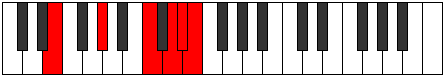
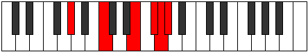

# Mode Zylitonic

## Links

- [Documentation](index.md)
- [Scales Index](Scales.md)
- [Modes Index](Modes.md)
- [Chords Index](Chords.md)

## Parent Scale

[Zylitonic](ScaleZylitonic.md)

## Number

[3345](https://ianring.com/musictheory/scales/3345)

## Perfection

- 1 Perfect notes
- 4 Perfect notes

## Perfection Profile

[false true false false false]

## Permutations

| Tonic | Notes | Signature | Illustration | Audio |
|-------|-------|-----------|--------------|-------|
| [C](ModeCNaturalZylitonic.md) | **C**, E, **G#**, **A#**, **B**, **C** | C |  | [midi](ModeCNaturalZylitonic.mid) [ogg](ModeCNaturalZylitonic.ogg) |
| [C#](ModeCSharpZylitonic.md) | **C#**, F, **A**, **B**, **C**, **C#** | C |  | [midi](ModeCSharpZylitonic.mid) [ogg](ModeCSharpZylitonic.ogg) |
| [Db](ModeDFlatZylitonic.md) | **Db**, F, **A**, **B**, **C**, **Db** | C |  | [midi](ModeDFlatZylitonic.mid) [ogg](ModeDFlatZylitonic.ogg) |
| [D](ModeDNaturalZylitonic.md) | **D**, F#, **A#**, **C**, **C#**, **D** | C |  | [midi](ModeDNaturalZylitonic.mid) [ogg](ModeDNaturalZylitonic.ogg) |
| [D#](ModeDSharpZylitonic.md) | **D#**, G, **B**, **C#**, **D**, **D#** | C |  | [midi](ModeDSharpZylitonic.mid) [ogg](ModeDSharpZylitonic.ogg) |
| [Eb](ModeEFlatZylitonic.md) | **Eb**, G, **B**, **Db**, **D**, **Eb** | C |  | [midi](ModeEFlatZylitonic.mid) [ogg](ModeEFlatZylitonic.ogg) |
| [E](ModeENaturalZylitonic.md) | **E**, G#, **C**, **D**, **D#**, **E** | C |  | [midi](ModeENaturalZylitonic.mid) [ogg](ModeENaturalZylitonic.ogg) |
| [F](ModeFNaturalZylitonic.md) | **F**, A, **C#**, **D#**, **E**, **F** | C |  | [midi](ModeFNaturalZylitonic.mid) [ogg](ModeFNaturalZylitonic.ogg) |
| [F#](ModeFSharpZylitonic.md) | **F#**, A#, **D**, **E**, **F**, **F#** | C |  | [midi](ModeFSharpZylitonic.mid) [ogg](ModeFSharpZylitonic.ogg) |
| [Gb](ModeGFlatZylitonic.md) | **Gb**, Bb, **D**, **E**, **F**, **Gb** | C |  | [midi](ModeGFlatZylitonic.mid) [ogg](ModeGFlatZylitonic.ogg) |
| [G](ModeGNaturalZylitonic.md) | **G**, B, **D#**, **F**, **F#**, **G** | C |  | [midi](ModeGNaturalZylitonic.mid) [ogg](ModeGNaturalZylitonic.ogg) |
| [G#](ModeGSharpZylitonic.md) | **G#**, C, **E**, **F#**, **G**, **G#** | C |  | [midi](ModeGSharpZylitonic.mid) [ogg](ModeGSharpZylitonic.ogg) |
| [Ab](ModeAFlatZylitonic.md) | **Ab**, C, **E**, **Gb**, **G**, **Ab** | C |  | [midi](ModeAFlatZylitonic.mid) [ogg](ModeAFlatZylitonic.ogg) |
| [A](ModeANaturalZylitonic.md) | **A**, C#, **F**, **G**, **G#**, **A** | C |  | [midi](ModeANaturalZylitonic.mid) [ogg](ModeANaturalZylitonic.ogg) |
| [A#](ModeASharpZylitonic.md) | **A#**, D, **F#**, **G#**, **A**, **A#** | C |  | [midi](ModeASharpZylitonic.mid) [ogg](ModeASharpZylitonic.ogg) |
| [Bb](ModeBFlatZylitonic.md) | **Bb**, D, **Gb**, **Ab**, **A**, **Bb** | C |  | [midi](ModeBFlatZylitonic.mid) [ogg](ModeBFlatZylitonic.ogg) |
| [B](ModeBNaturalZylitonic.md) | **B**, D#, **G**, **A**, **A#**, **B** | C |  | [midi](ModeBNaturalZylitonic.mid) [ogg](ModeBNaturalZylitonic.ogg) |
