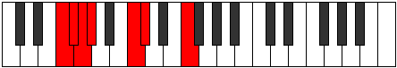

# Mode Zynimic

## Links

- [Documentation](README.md)
- [Scales Index](Scales.md)
- [Modes Index](Modes.md)
- [Chords Index](Chords.md)

## Parent Scale

[Daptimic](ScaleDaptimic.md)

## Number

[399](https://ianring.com/musictheory/scales/399)

## Transposition

1, 1, 1, 4, 1, 4

## Chord Pattern

## Perfection

- 4 Perfect notes
- 2 Perfect notes

## Perfection Profile

[true true false false true true]

## Permutations

| Tonic | Notes | Signature | Illustration | Audio |
|-------|-------|-----------|--------------|-------|
| [C](ModeCNaturalZynimic.md) | C, Db, **Ebb**, **Fbb**, G, Ab, C | C |  | [midi](https://github.com/edipermadi/music/blob/main/docs/ModeCNaturalZynimic.mid?raw=true) |
| [C#](ModeCSharpZynimic.md) | C#, D, **Eb**, **Fb**, G#, A, C# | C |  | [midi](https://github.com/edipermadi/music/blob/main/docs/ModeCSharpZynimic.mid?raw=true) |
| [Db](ModeDFlatZynimic.md) | Db, Ebb, **Fbb**, **Gbbb**, Ab, Bbb, Db | C |  | [midi](https://github.com/edipermadi/music/blob/main/docs/ModeDFlatZynimic.mid?raw=true) |
| [D](ModeDNaturalZynimic.md) | D, Eb, **Fb**, **Gbb**, A, Bb, D | C |  | [midi](https://github.com/edipermadi/music/blob/main/docs/ModeDNaturalZynimic.mid?raw=true) |
| [D#](ModeDSharpZynimic.md) | D#, E, **F**, **Gb**, A#, B, D# | C |  | [midi](https://github.com/edipermadi/music/blob/main/docs/ModeDSharpZynimic.mid?raw=true) |
| [Eb](ModeEFlatZynimic.md) | Eb, Fb, **Gbb**, **Abbb**, Bb, Cb, Eb | C |  | [midi](https://github.com/edipermadi/music/blob/main/docs/ModeEFlatZynimic.mid?raw=true) |
| [E](ModeENaturalZynimic.md) | E, F, **Gb**, **Abb**, B, C, E | C |  | [midi](https://github.com/edipermadi/music/blob/main/docs/ModeENaturalZynimic.mid?raw=true) |
| [F](ModeFNaturalZynimic.md) | F, Gb, **Abb**, **Bbbb**, C, Db, F | C |  | [midi](https://github.com/edipermadi/music/blob/main/docs/ModeFNaturalZynimic.mid?raw=true) |
| [F#](ModeFSharpZynimic.md) | F#, G, **Ab**, **Bbb**, C#, D, F# | C |  | [midi](https://github.com/edipermadi/music/blob/main/docs/ModeFSharpZynimic.mid?raw=true) |
| [Gb](ModeGFlatZynimic.md) | Gb, Abb, **Bbbb**, **Cbbb**, Db, Ebb, Gb | C |  | [midi](https://github.com/edipermadi/music/blob/main/docs/ModeGFlatZynimic.mid?raw=true) |
| [G](ModeGNaturalZynimic.md) | G, Ab, **Bbb**, **Cbb**, D, Eb, G | C |  | [midi](https://github.com/edipermadi/music/blob/main/docs/ModeGNaturalZynimic.mid?raw=true) |
| [G#](ModeGSharpZynimic.md) | G#, A, **Bb**, **Cb**, D#, E, G# | C |  | [midi](https://github.com/edipermadi/music/blob/main/docs/ModeGSharpZynimic.mid?raw=true) |
| [Ab](ModeAFlatZynimic.md) | Ab, Bbb, **Cbb**, **Dbbb**, Eb, Fb, Ab | C |  | [midi](https://github.com/edipermadi/music/blob/main/docs/ModeAFlatZynimic.mid?raw=true) |
| [A](ModeANaturalZynimic.md) | A, Bb, **Cb**, **Dbb**, E, F, A | C |  | [midi](https://github.com/edipermadi/music/blob/main/docs/ModeANaturalZynimic.mid?raw=true) |
| [A#](ModeASharpZynimic.md) | A#, B, **C**, **Db**, E#, F#, A# | C |  | [midi](https://github.com/edipermadi/music/blob/main/docs/ModeASharpZynimic.mid?raw=true) |
| [Bb](ModeBFlatZynimic.md) | Bb, Cb, **Dbb**, **Ebbb**, F, Gb, Bb | C |  | [midi](https://github.com/edipermadi/music/blob/main/docs/ModeBFlatZynimic.mid?raw=true) |
| [B](ModeBNaturalZynimic.md) | B, C, **Db**, **Ebb**, F#, G, B | C |  | [midi](https://github.com/edipermadi/music/blob/main/docs/ModeBNaturalZynimic.mid?raw=true) |
