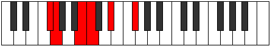
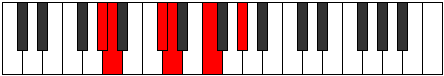
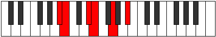

# Mode Zynitonic

## Links

- [Documentation](index.md)
- [Scales Index](Scales.md)
- [Modes Index](Modes.md)
- [Chords Index](Chords.md)

## Parent Scale

[Lycritonic](ScaleLycritonic.md)

## Number

[611](https://ianring.com/musictheory/scales/611)

## Perfection

- 2 Perfect notes
- 3 Perfect notes

## Perfection Profile

[false false true true false]

## Permutations

| Tonic | Notes | Signature | Illustration | Audio |
|-------|-------|-----------|--------------|-------|
| [C](ModeCNaturalZynitonic.md) | **C**, **C#**, F, F#, **A**, **C** | C |  | [midi](https://github.com/edipermadi/music/blob/main/docs/ModeCNaturalZynitonic.mid?raw=true) |
| [C#](ModeCSharpZynitonic.md) | **C#**, **D**, F#, G, **A#**, **C#** | C |  | [midi](https://github.com/edipermadi/music/blob/main/docs/ModeCSharpZynitonic.mid?raw=true) |
| [Db](ModeDFlatZynitonic.md) | **Db**, **D**, Gb, G, **Bb**, **Db** | C |  | [midi](https://github.com/edipermadi/music/blob/main/docs/ModeDFlatZynitonic.mid?raw=true) |
| [D](ModeDNaturalZynitonic.md) | **D**, **D#**, G, G#, **B**, **D** | C |  | [midi](https://github.com/edipermadi/music/blob/main/docs/ModeDNaturalZynitonic.mid?raw=true) |
| [D#](ModeDSharpZynitonic.md) | **D#**, **E**, G#, A, **C**, **D#** | C |  | [midi](https://github.com/edipermadi/music/blob/main/docs/ModeDSharpZynitonic.mid?raw=true) |
| [Eb](ModeEFlatZynitonic.md) | **Eb**, **E**, Ab, A, **C**, **Eb** | C |  | [midi](https://github.com/edipermadi/music/blob/main/docs/ModeEFlatZynitonic.mid?raw=true) |
| [E](ModeENaturalZynitonic.md) | **E**, **F**, A, A#, **C#**, **E** | C |  | [midi](https://github.com/edipermadi/music/blob/main/docs/ModeENaturalZynitonic.mid?raw=true) |
| [F](ModeFNaturalZynitonic.md) | **F**, **F#**, A#, B, **D**, **F** | C |  | [midi](https://github.com/edipermadi/music/blob/main/docs/ModeFNaturalZynitonic.mid?raw=true) |
| [F#](ModeFSharpZynitonic.md) | **F#**, **G**, B, C, **D#**, **F#** | C |  | [midi](https://github.com/edipermadi/music/blob/main/docs/ModeFSharpZynitonic.mid?raw=true) |
| [Gb](ModeGFlatZynitonic.md) | **Gb**, **G**, B, C, **Eb**, **Gb** | C |  | [midi](https://github.com/edipermadi/music/blob/main/docs/ModeGFlatZynitonic.mid?raw=true) |
| [G](ModeGNaturalZynitonic.md) | **G**, **G#**, C, C#, **E**, **G** | C |  | [midi](https://github.com/edipermadi/music/blob/main/docs/ModeGNaturalZynitonic.mid?raw=true) |
| [G#](ModeGSharpZynitonic.md) | **G#**, **A**, C#, D, **F**, **G#** | C |  | [midi](https://github.com/edipermadi/music/blob/main/docs/ModeGSharpZynitonic.mid?raw=true) |
| [Ab](ModeAFlatZynitonic.md) | **Ab**, **A**, Db, D, **F**, **Ab** | C |  | [midi](https://github.com/edipermadi/music/blob/main/docs/ModeAFlatZynitonic.mid?raw=true) |
| [A](ModeANaturalZynitonic.md) | **A**, **A#**, D, D#, **F#**, **A** | C |  | [midi](https://github.com/edipermadi/music/blob/main/docs/ModeANaturalZynitonic.mid?raw=true) |
| [A#](ModeASharpZynitonic.md) | **A#**, **B**, D#, E, **G**, **A#** | C |  | [midi](https://github.com/edipermadi/music/blob/main/docs/ModeASharpZynitonic.mid?raw=true) |
| [Bb](ModeBFlatZynitonic.md) | **Bb**, **B**, Eb, E, **G**, **Bb** | C |  | [midi](https://github.com/edipermadi/music/blob/main/docs/ModeBFlatZynitonic.mid?raw=true) |
| [B](ModeBNaturalZynitonic.md) | **B**, **C**, E, F, **G#**, **B** | C |  | [midi](https://github.com/edipermadi/music/blob/main/docs/ModeBNaturalZynitonic.mid?raw=true) |
