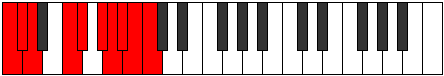
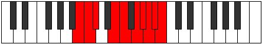

# Mode Zynygic

## Links

- [Documentation](index.md)
- [Scales Index](Scales.md)
- [Modes Index](Modes.md)
- [Chords Index](Chords.md)

## Parent Scale

[Phrygic](ScalePhrygic.md)

## Number

[3943](https://ianring.com/musictheory/scales/3943)

## Perfection

- 6 Perfect notes
- 3 Perfect notes

## Perfection Profile

[false true true true true false false true true]

## Permutations

| Tonic | Notes | Signature | Illustration | Audio |
|-------|-------|-----------|--------------|-------|
| [C](ModeCNaturalZynygic.md) | **C**, C#, D, F, F#, **G#**, **A**, A#, B, **C** | C |  | [midi](ModeCNaturalZynygic.mid) [ogg](ModeCNaturalZynygic.ogg) |
| [C#](ModeCSharpZynygic.md) | **C#**, D, D#, F#, G, **A**, **A#**, B, C, **C#** | C |  | [midi](ModeCSharpZynygic.mid) [ogg](ModeCSharpZynygic.ogg) |
| [Db](ModeDFlatZynygic.md) | **Db**, D, Eb, Gb, G, **A**, **Bb**, B, C, **Db** | C |  | [midi](ModeDFlatZynygic.mid) [ogg](ModeDFlatZynygic.ogg) |
| [D](ModeDNaturalZynygic.md) | **D**, D#, E, G, G#, **A#**, **B**, C, C#, **D** | C |  | [midi](ModeDNaturalZynygic.mid) [ogg](ModeDNaturalZynygic.ogg) |
| [D#](ModeDSharpZynygic.md) | **D#**, E, F, G#, A, **B**, **C**, C#, D, **D#** | C |  | [midi](ModeDSharpZynygic.mid) [ogg](ModeDSharpZynygic.ogg) |
| [Eb](ModeEFlatZynygic.md) | **Eb**, E, F, Ab, A, **B**, **C**, Db, D, **Eb** | C |  | [midi](ModeEFlatZynygic.mid) [ogg](ModeEFlatZynygic.ogg) |
| [E](ModeENaturalZynygic.md) | **E**, F, F#, A, A#, **C**, **C#**, D, D#, **E** | C |  | [midi](ModeENaturalZynygic.mid) [ogg](ModeENaturalZynygic.ogg) |
| [F](ModeFNaturalZynygic.md) | **F**, F#, G, A#, B, **C#**, **D**, D#, E, **F** | C |  | [midi](ModeFNaturalZynygic.mid) [ogg](ModeFNaturalZynygic.ogg) |
| [F#](ModeFSharpZynygic.md) | **F#**, G, G#, B, C, **D**, **D#**, E, F, **F#** | C |  | [midi](ModeFSharpZynygic.mid) [ogg](ModeFSharpZynygic.ogg) |
| [Gb](ModeGFlatZynygic.md) | **Gb**, G, Ab, B, C, **D**, **Eb**, E, F, **Gb** | C |  | [midi](ModeGFlatZynygic.mid) [ogg](ModeGFlatZynygic.ogg) |
| [G](ModeGNaturalZynygic.md) | **G**, G#, A, C, C#, **D#**, **E**, F, F#, **G** | C |  | [midi](ModeGNaturalZynygic.mid) [ogg](ModeGNaturalZynygic.ogg) |
| [G#](ModeGSharpZynygic.md) | **G#**, A, A#, C#, D, **E**, **F**, F#, G, **G#** | C |  | [midi](ModeGSharpZynygic.mid) [ogg](ModeGSharpZynygic.ogg) |
| [Ab](ModeAFlatZynygic.md) | **Ab**, A, Bb, Db, D, **E**, **F**, Gb, G, **Ab** | C |  | [midi](ModeAFlatZynygic.mid) [ogg](ModeAFlatZynygic.ogg) |
| [A](ModeANaturalZynygic.md) | **A**, A#, B, D, D#, **F**, **F#**, G, G#, **A** | C |  | [midi](ModeANaturalZynygic.mid) [ogg](ModeANaturalZynygic.ogg) |
| [A#](ModeASharpZynygic.md) | **A#**, B, C, D#, E, **F#**, **G**, G#, A, **A#** | C |  | [midi](ModeASharpZynygic.mid) [ogg](ModeASharpZynygic.ogg) |
| [Bb](ModeBFlatZynygic.md) | **Bb**, B, C, Eb, E, **Gb**, **G**, Ab, A, **Bb** | C |  | [midi](ModeBFlatZynygic.mid) [ogg](ModeBFlatZynygic.ogg) |
| [B](ModeBNaturalZynygic.md) | **B**, C, C#, E, F, **G**, **G#**, A, A#, **B** | C |  | [midi](ModeBNaturalZynygic.mid) [ogg](ModeBNaturalZynygic.ogg) |
