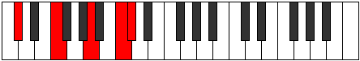
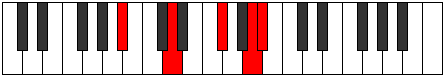

# Mode Zyphic

## Links

- [Documentation](README.md)
- [Scales Index](Scales.md)
- [Modes Index](Modes.md)
- [Chords Index](Chords.md)

## Parent Scale

[Zyphic](ScaleZyphic.md)

## Number

[2321](https://ianring.com/musictheory/scales/2321)

## Interval Pattern

4, 4, 3, 1

## Chord Pattern

## Perfection

- 1 Perfect notes
- 3 Perfect notes

## Perfection Profile

[false true false false]

## Permutations

| Tonic | Notes | Signature | Illustration | Audio |
|-------|-------|-----------|--------------|-------|
| [C](ModeCNaturalZyphic.md) | **C**, E, **G#**, **B**, **C** | C |  | [midi](https://github.com/edipermadi/music/blob/main/docs/ModeCNaturalZyphic.mid?raw=true) |
| [C#](ModeCSharpZyphic.md) | **C#**, F, **A**, **C**, **C#** | C |  | [midi](https://github.com/edipermadi/music/blob/main/docs/ModeCSharpZyphic.mid?raw=true) |
| [Db](ModeDFlatZyphic.md) | **Db**, F, **A**, **C**, **Db** | C |  | [midi](https://github.com/edipermadi/music/blob/main/docs/ModeDFlatZyphic.mid?raw=true) |
| [D](ModeDNaturalZyphic.md) | **D**, F#, **A#**, **C#**, **D** | C |  | [midi](https://github.com/edipermadi/music/blob/main/docs/ModeDNaturalZyphic.mid?raw=true) |
| [D#](ModeDSharpZyphic.md) | **D#**, G, **B**, **D**, **D#** | C |  | [midi](https://github.com/edipermadi/music/blob/main/docs/ModeDSharpZyphic.mid?raw=true) |
| [Eb](ModeEFlatZyphic.md) | **Eb**, G, **B**, **D**, **Eb** | C |  | [midi](https://github.com/edipermadi/music/blob/main/docs/ModeEFlatZyphic.mid?raw=true) |
| [E](ModeENaturalZyphic.md) | **E**, G#, **C**, **D#**, **E** | C |  | [midi](https://github.com/edipermadi/music/blob/main/docs/ModeENaturalZyphic.mid?raw=true) |
| [F](ModeFNaturalZyphic.md) | **F**, A, **C#**, **E**, **F** | C |  | [midi](https://github.com/edipermadi/music/blob/main/docs/ModeFNaturalZyphic.mid?raw=true) |
| [F#](ModeFSharpZyphic.md) | **F#**, A#, **D**, **F**, **F#** | C |  | [midi](https://github.com/edipermadi/music/blob/main/docs/ModeFSharpZyphic.mid?raw=true) |
| [Gb](ModeGFlatZyphic.md) | **Gb**, Bb, **D**, **F**, **Gb** | C |  | [midi](https://github.com/edipermadi/music/blob/main/docs/ModeGFlatZyphic.mid?raw=true) |
| [G](ModeGNaturalZyphic.md) | **G**, B, **D#**, **F#**, **G** | C |  | [midi](https://github.com/edipermadi/music/blob/main/docs/ModeGNaturalZyphic.mid?raw=true) |
| [G#](ModeGSharpZyphic.md) | **G#**, C, **E**, **G**, **G#** | C |  | [midi](https://github.com/edipermadi/music/blob/main/docs/ModeGSharpZyphic.mid?raw=true) |
| [Ab](ModeAFlatZyphic.md) | **Ab**, C, **E**, **G**, **Ab** | C |  | [midi](https://github.com/edipermadi/music/blob/main/docs/ModeAFlatZyphic.mid?raw=true) |
| [A](ModeANaturalZyphic.md) | **A**, C#, **F**, **G#**, **A** | C |  | [midi](https://github.com/edipermadi/music/blob/main/docs/ModeANaturalZyphic.mid?raw=true) |
| [A#](ModeASharpZyphic.md) | **A#**, D, **F#**, **A**, **A#** | C |  | [midi](https://github.com/edipermadi/music/blob/main/docs/ModeASharpZyphic.mid?raw=true) |
| [Bb](ModeBFlatZyphic.md) | **Bb**, D, **Gb**, **A**, **Bb** | C |  | [midi](https://github.com/edipermadi/music/blob/main/docs/ModeBFlatZyphic.mid?raw=true) |
| [B](ModeBNaturalZyphic.md) | **B**, D#, **G**, **A#**, **B** | C |  | [midi](https://github.com/edipermadi/music/blob/main/docs/ModeBNaturalZyphic.mid?raw=true) |
