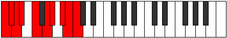
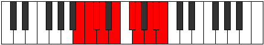

# Mode Zyphygic

## Links

- [Documentation](README.md)
- [Scales Index](Scales.md)
- [Modes Index](Modes.md)
- [Chords Index](Chords.md)

## Parent Scale

[Bagygic](ScaleBagygic.md)

## Number

[3503](https://ianring.com/musictheory/scales/3503)

## Transposition

1, 1, 1, 2, 2, 1, 2, 1, 1

## Chord Pattern

ii⁰b3, iii⁰, IV, v⁰

## Perfection

- 7 Perfect notes
- 2 Perfect notes

## Perfection Profile

true, true, false, true, true, true, true, true, false

## Permutations

| Tonic | Notes | Signature | Illustration | Audio |
|-------|-------|-----------|--------------|-------|
| [C](ModeCNaturalZyphygic.md) | C, C#, **D**, D#, F, G, G#, A#, **B**, C | C |  | [midi](https://github.com/edipermadi/music/blob/main/docs/ModeCNaturalZyphygic.mid?raw=true) |
| [C#](ModeCSharpZyphygic.md) | C#, D, **D#**, E, F#, G#, A, B, **C**, C# | C |  | [midi](https://github.com/edipermadi/music/blob/main/docs/ModeCSharpZyphygic.mid?raw=true) |
| [Db](ModeDFlatZyphygic.md) | Db, D, **Eb**, E, Gb, Ab, A, B, **C**, Db | C |  | [midi](https://github.com/edipermadi/music/blob/main/docs/ModeDFlatZyphygic.mid?raw=true) |
| [D](ModeDNaturalZyphygic.md) | D, D#, **E**, F, G, A, A#, C, **C#**, D | C |  | [midi](https://github.com/edipermadi/music/blob/main/docs/ModeDNaturalZyphygic.mid?raw=true) |
| [D#](ModeDSharpZyphygic.md) | D#, E, **F**, F#, G#, A#, B, C#, **D**, D# | C |  | [midi](https://github.com/edipermadi/music/blob/main/docs/ModeDSharpZyphygic.mid?raw=true) |
| [Eb](ModeEFlatZyphygic.md) | Eb, E, **F**, Gb, Ab, Bb, B, Db, **D**, Eb | C |  | [midi](https://github.com/edipermadi/music/blob/main/docs/ModeEFlatZyphygic.mid?raw=true) |
| [E](ModeENaturalZyphygic.md) | E, F, **F#**, G, A, B, C, D, **D#**, E | C |  | [midi](https://github.com/edipermadi/music/blob/main/docs/ModeENaturalZyphygic.mid?raw=true) |
| [F](ModeFNaturalZyphygic.md) | F, F#, **G**, G#, A#, C, C#, D#, **E**, F | C |  | [midi](https://github.com/edipermadi/music/blob/main/docs/ModeFNaturalZyphygic.mid?raw=true) |
| [F#](ModeFSharpZyphygic.md) | F#, G, **G#**, A, B, C#, D, E, **F**, F# | C |  | [midi](https://github.com/edipermadi/music/blob/main/docs/ModeFSharpZyphygic.mid?raw=true) |
| [Gb](ModeGFlatZyphygic.md) | Gb, G, **Ab**, A, B, Db, D, E, **F**, Gb | C |  | [midi](https://github.com/edipermadi/music/blob/main/docs/ModeGFlatZyphygic.mid?raw=true) |
| [G](ModeGNaturalZyphygic.md) | G, G#, **A**, A#, C, D, D#, F, **F#**, G | C |  | [midi](https://github.com/edipermadi/music/blob/main/docs/ModeGNaturalZyphygic.mid?raw=true) |
| [G#](ModeGSharpZyphygic.md) | G#, A, **A#**, B, C#, D#, E, F#, **G**, G# | C |  | [midi](https://github.com/edipermadi/music/blob/main/docs/ModeGSharpZyphygic.mid?raw=true) |
| [Ab](ModeAFlatZyphygic.md) | Ab, A, **Bb**, B, Db, Eb, E, Gb, **G**, Ab | C |  | [midi](https://github.com/edipermadi/music/blob/main/docs/ModeAFlatZyphygic.mid?raw=true) |
| [A](ModeANaturalZyphygic.md) | A, A#, **B**, C, D, E, F, G, **G#**, A | C |  | [midi](https://github.com/edipermadi/music/blob/main/docs/ModeANaturalZyphygic.mid?raw=true) |
| [A#](ModeASharpZyphygic.md) | A#, B, **C**, C#, D#, F, F#, G#, **A**, A# | C |  | [midi](https://github.com/edipermadi/music/blob/main/docs/ModeASharpZyphygic.mid?raw=true) |
| [Bb](ModeBFlatZyphygic.md) | Bb, B, **C**, Db, Eb, F, Gb, Ab, **A**, Bb | C |  | [midi](https://github.com/edipermadi/music/blob/main/docs/ModeBFlatZyphygic.mid?raw=true) |
| [B](ModeBNaturalZyphygic.md) | B, C, **C#**, D, E, F#, G, A, **A#**, B | C |  | [midi](https://github.com/edipermadi/music/blob/main/docs/ModeBNaturalZyphygic.mid?raw=true) |
