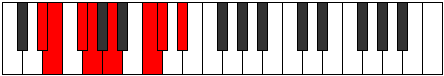

# Mode Zyptian

## Links

- [Documentation](index.md)
- [Scales Index](Scales.md)
- [Modes Index](Modes.md)
- [Chords Index](Chords.md)

## Parent Scale

[Mycrian](ScaleMycrian.md)

## Number

[1627](https://ianring.com/musictheory/scales/1627)

## Perfection

- 3 Perfect notes
- 4 Perfect notes

## Perfection Profile

[false false true false true true false]

## Permutations

| Tonic | Notes | Signature | Illustration | Audio |
|-------|-------|-----------|--------------|-------|
| [C](ModeCNaturalZyptian.md) | **C**, **Db**, Eb, **Fb**, Gb, A, **Bb**, **C** | C |  | [midi](ModeCNaturalZyptian.mid) [ogg](ModeCNaturalZyptian.ogg) |
| [C#](ModeCSharpZyptian.md) | **C#**, **D**, E, **F**, G, A#, **B**, **C#** | C |  | [midi](ModeCSharpZyptian.mid) [ogg](ModeCSharpZyptian.ogg) |
| [Db](ModeDFlatZyptian.md) | **Db**, **Ebb**, Fb, **Gbb**, Abb, Bb, **Cb**, **Db** | C |  | [midi](ModeDFlatZyptian.mid) [ogg](ModeDFlatZyptian.ogg) |
| [D](ModeDNaturalZyptian.md) | **D**, **Eb**, F, **Gb**, Ab, B, **C**, **D** | C |  | [midi](ModeDNaturalZyptian.mid) [ogg](ModeDNaturalZyptian.ogg) |
| [D#](ModeDSharpZyptian.md) | **D#**, **E**, F#, **G**, A, B#, **C#**, **D#** | C |  | [midi](ModeDSharpZyptian.mid) [ogg](ModeDSharpZyptian.ogg) |
| [Eb](ModeEFlatZyptian.md) | **Eb**, **Fb**, Gb, **Abb**, Bbb, C, **Db**, **Eb** | C |  | [midi](ModeEFlatZyptian.mid) [ogg](ModeEFlatZyptian.ogg) |
| [E](ModeENaturalZyptian.md) | **E**, **F**, G, **Ab**, Bb, C#, **D**, **E** | C |  | [midi](ModeENaturalZyptian.mid) [ogg](ModeENaturalZyptian.ogg) |
| [F](ModeFNaturalZyptian.md) | **F**, **Gb**, Ab, **Bbb**, Cb, D, **Eb**, **F** | C |  | [midi](ModeFNaturalZyptian.mid) [ogg](ModeFNaturalZyptian.ogg) |
| [F#](ModeFSharpZyptian.md) | **F#**, **G**, A, **Bb**, C, D#, **E**, **F#** | C |  | [midi](ModeFSharpZyptian.mid) [ogg](ModeFSharpZyptian.ogg) |
| [Gb](ModeGFlatZyptian.md) | **Gb**, **Abb**, Bbb, **Cbb**, Dbb, Eb, **Fb**, **Gb** | C |  | [midi](ModeGFlatZyptian.mid) [ogg](ModeGFlatZyptian.ogg) |
| [G](ModeGNaturalZyptian.md) | **G**, **Ab**, Bb, **Cb**, Db, E, **F**, **G** | C |  | [midi](ModeGNaturalZyptian.mid) [ogg](ModeGNaturalZyptian.ogg) |
| [G#](ModeGSharpZyptian.md) | **G#**, **A**, B, **C**, D, E#, **F#**, **G#** | C |  | [midi](ModeGSharpZyptian.mid) [ogg](ModeGSharpZyptian.ogg) |
| [Ab](ModeAFlatZyptian.md) | **Ab**, **Bbb**, Cb, **Dbb**, Ebb, F, **Gb**, **Ab** | C |  | [midi](ModeAFlatZyptian.mid) [ogg](ModeAFlatZyptian.ogg) |
| [A](ModeANaturalZyptian.md) | **A**, **Bb**, C, **Db**, Eb, F#, **G**, **A** | C |  | [midi](ModeANaturalZyptian.mid) [ogg](ModeANaturalZyptian.ogg) |
| [A#](ModeASharpZyptian.md) | **A#**, **B**, C#, **D**, E, F##, **G#**, **A#** | C |  | [midi](ModeASharpZyptian.mid) [ogg](ModeASharpZyptian.ogg) |
| [Bb](ModeBFlatZyptian.md) | **Bb**, **Cb**, Db, **Ebb**, Fb, G, **Ab**, **Bb** | C |  | [midi](ModeBFlatZyptian.mid) [ogg](ModeBFlatZyptian.ogg) |
| [B](ModeBNaturalZyptian.md) | **B**, **C**, D, **Eb**, F, G#, **A**, **B** | C |  | [midi](ModeBNaturalZyptian.mid) [ogg](ModeBNaturalZyptian.ogg) |
