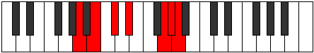

# Mode Zyptimic

## Links

- [Documentation](index.md)
- [Scales Index](Scales.md)
- [Modes Index](Modes.md)
- [Chords Index](Chords.md)

## Parent Scale

[Mycrimic](ScaleMycrimic.md)

## Number

[3157](https://ianring.com/musictheory/scales/3157)

## Perfection

- 2 Perfect notes
- 4 Perfect notes

## Perfection Profile

[false false true false false true]

## Permutations

| Tonic | Notes | Signature | Illustration | Audio |
|-------|-------|-----------|--------------|-------|
| [C](ModeCNaturalZyptimic.md) | **C**, **D**, E, **F#**, **G###**, A##, **C** | C |  | [midi](ModeCNaturalZyptimic.mid) [ogg](ModeCNaturalZyptimic.ogg) |
| [C#](ModeCSharpZyptimic.md) | **C#**, **D#**, E#, **F##**, **Cb**, Dbb, **C#** | C |  | [midi](ModeCSharpZyptimic.mid) [ogg](ModeCSharpZyptimic.ogg) |
| [Db](ModeDFlatZyptimic.md) | **Db**, **Eb**, F, **G**, **A##**, B#, **Db** | C |  | [midi](ModeDFlatZyptimic.mid) [ogg](ModeDFlatZyptimic.ogg) |
| [D](ModeDNaturalZyptimic.md) | **D**, **E**, F#, **G#**, **A###**, B##, **D** | C |  | [midi](ModeDNaturalZyptimic.mid) [ogg](ModeDNaturalZyptimic.ogg) |
| [D#](ModeDSharpZyptimic.md) | **D#**, **E#**, F##, **G##**, **Db**, Ebb, **D#** | C |  | [midi](ModeDSharpZyptimic.mid) [ogg](ModeDSharpZyptimic.ogg) |
| [Eb](ModeEFlatZyptimic.md) | **Eb**, **F**, G, **A**, **B##**, C##, **Eb** | C |  | [midi](ModeEFlatZyptimic.mid) [ogg](ModeEFlatZyptimic.ogg) |
| [E](ModeENaturalZyptimic.md) | **E**, **F#**, G#, **A#**, **B###**, C###, **E** | C |  | [midi](ModeENaturalZyptimic.mid) [ogg](ModeENaturalZyptimic.ogg) |
| [F](ModeFNaturalZyptimic.md) | **F**, **G**, A, **B**, **C###**, D##, **F** | C |  | [midi](ModeFNaturalZyptimic.mid) [ogg](ModeFNaturalZyptimic.ogg) |
| [F#](ModeFSharpZyptimic.md) | **F#**, **G#**, A#, **B#**, **D##**, E#, **F#** | C |  | [midi](ModeFSharpZyptimic.mid) [ogg](ModeFSharpZyptimic.ogg) |
| [Gb](ModeGFlatZyptimic.md) | **Gb**, **Ab**, Bb, **C**, **D##**, E#, **Gb** | C |  | [midi](ModeGFlatZyptimic.mid) [ogg](ModeGFlatZyptimic.ogg) |
| [G](ModeGNaturalZyptimic.md) | **G**, **A**, B, **C#**, **D###**, E##, **G** | C |  | [midi](ModeGNaturalZyptimic.mid) [ogg](ModeGNaturalZyptimic.ogg) |
| [G#](ModeGSharpZyptimic.md) | **G#**, **A#**, B#, **C##**, **E##**, F##, **G#** | C |  | [midi](ModeGSharpZyptimic.mid) [ogg](ModeGSharpZyptimic.ogg) |
| [Ab](ModeAFlatZyptimic.md) | **Ab**, **Bb**, C, **D**, **E##**, F##, **Ab** | C |  | [midi](ModeAFlatZyptimic.mid) [ogg](ModeAFlatZyptimic.ogg) |
| [A](ModeANaturalZyptimic.md) | **A**, **B**, C#, **D#**, **E###**, F###, **A** | C |  | [midi](ModeANaturalZyptimic.mid) [ogg](ModeANaturalZyptimic.ogg) |
| [A#](ModeASharpZyptimic.md) | **A#**, **B#**, C##, **D##**, **F###**, G##, **A#** | C |  | [midi](ModeASharpZyptimic.mid) [ogg](ModeASharpZyptimic.ogg) |
| [Bb](ModeBFlatZyptimic.md) | **Bb**, **C**, D, **E**, **F###**, G##, **Bb** | C |  | [midi](ModeBFlatZyptimic.mid) [ogg](ModeBFlatZyptimic.ogg) |
| [B](ModeBNaturalZyptimic.md) | **B**, **C#**, D#, **E#**, **Cbbb**, Cbb, **B** | C |  | [midi](ModeBNaturalZyptimic.mid) [ogg](ModeBNaturalZyptimic.ogg) |
