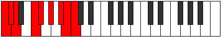

# Mode Zyptyllic

## Links

- [Documentation](index.md)
- [Scales Index](Scales.md)
- [Modes Index](Modes.md)
- [Chords Index](Chords.md)

## Parent Scale

[Aeolothyllic](ScaleAeolothyllic.md)

## Number

[3431](https://ianring.com/musictheory/scales/3431)

## Perfection

- 5 Perfect notes
- 3 Perfect notes

## Perfection Profile

[false true false true true false true true]

## Permutations

| Tonic | Notes | Signature | Illustration | Audio |
|-------|-------|-----------|--------------|-------|
| [C](ModeCNaturalZyptyllic.md) | **C**, C#, **D**, F, F#, **G#**, A#, B, **C** | C |  | [midi](ModeCNaturalZyptyllic.mid) [ogg](ModeCNaturalZyptyllic.ogg) |
| [C#](ModeCSharpZyptyllic.md) | **C#**, D, **D#**, F#, G, **A**, B, C, **C#** | C |  | [midi](ModeCSharpZyptyllic.mid) [ogg](ModeCSharpZyptyllic.ogg) |
| [Db](ModeDFlatZyptyllic.md) | **Db**, D, **Eb**, Gb, G, **A**, B, C, **Db** | C |  | [midi](ModeDFlatZyptyllic.mid) [ogg](ModeDFlatZyptyllic.ogg) |
| [D](ModeDNaturalZyptyllic.md) | **D**, D#, **E**, G, G#, **A#**, C, C#, **D** | C |  | [midi](ModeDNaturalZyptyllic.mid) [ogg](ModeDNaturalZyptyllic.ogg) |
| [D#](ModeDSharpZyptyllic.md) | **D#**, E, **F**, G#, A, **B**, C#, D, **D#** | C |  | [midi](ModeDSharpZyptyllic.mid) [ogg](ModeDSharpZyptyllic.ogg) |
| [Eb](ModeEFlatZyptyllic.md) | **Eb**, E, **F**, Ab, A, **B**, Db, D, **Eb** | C |  | [midi](ModeEFlatZyptyllic.mid) [ogg](ModeEFlatZyptyllic.ogg) |
| [E](ModeENaturalZyptyllic.md) | **E**, F, **F#**, A, A#, **C**, D, D#, **E** | C |  | [midi](ModeENaturalZyptyllic.mid) [ogg](ModeENaturalZyptyllic.ogg) |
| [F](ModeFNaturalZyptyllic.md) | **F**, F#, **G**, A#, B, **C#**, D#, E, **F** | C |  | [midi](ModeFNaturalZyptyllic.mid) [ogg](ModeFNaturalZyptyllic.ogg) |
| [F#](ModeFSharpZyptyllic.md) | **F#**, G, **G#**, B, C, **D**, E, F, **F#** | C |  | [midi](ModeFSharpZyptyllic.mid) [ogg](ModeFSharpZyptyllic.ogg) |
| [Gb](ModeGFlatZyptyllic.md) | **Gb**, G, **Ab**, B, C, **D**, E, F, **Gb** | C |  | [midi](ModeGFlatZyptyllic.mid) [ogg](ModeGFlatZyptyllic.ogg) |
| [G](ModeGNaturalZyptyllic.md) | **G**, G#, **A**, C, C#, **D#**, F, F#, **G** | C |  | [midi](ModeGNaturalZyptyllic.mid) [ogg](ModeGNaturalZyptyllic.ogg) |
| [G#](ModeGSharpZyptyllic.md) | **G#**, A, **A#**, C#, D, **E**, F#, G, **G#** | C |  | [midi](ModeGSharpZyptyllic.mid) [ogg](ModeGSharpZyptyllic.ogg) |
| [Ab](ModeAFlatZyptyllic.md) | **Ab**, A, **Bb**, Db, D, **E**, Gb, G, **Ab** | C |  | [midi](ModeAFlatZyptyllic.mid) [ogg](ModeAFlatZyptyllic.ogg) |
| [A](ModeANaturalZyptyllic.md) | **A**, A#, **B**, D, D#, **F**, G, G#, **A** | C |  | [midi](ModeANaturalZyptyllic.mid) [ogg](ModeANaturalZyptyllic.ogg) |
| [A#](ModeASharpZyptyllic.md) | **A#**, B, **C**, D#, E, **F#**, G#, A, **A#** | C |  | [midi](ModeASharpZyptyllic.mid) [ogg](ModeASharpZyptyllic.ogg) |
| [Bb](ModeBFlatZyptyllic.md) | **Bb**, B, **C**, Eb, E, **Gb**, Ab, A, **Bb** | C |  | [midi](ModeBFlatZyptyllic.mid) [ogg](ModeBFlatZyptyllic.ogg) |
| [B](ModeBNaturalZyptyllic.md) | **B**, C, **C#**, E, F, **G**, A, A#, **B** | C |  | [midi](ModeBNaturalZyptyllic.mid) [ogg](ModeBNaturalZyptyllic.ogg) |
