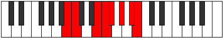

# Mode Zyrian

## Links

- [Documentation](index.md)
- [Scales Index](Scales.md)
- [Modes Index](Modes.md)
- [Chords Index](Chords.md)

## Parent Scale

[Thacrian](ScaleThacrian.md)

## Number

[2787](https://ianring.com/musictheory/scales/2787)

## Perfection

- 4 Perfect notes
- 3 Perfect notes

## Perfection Profile

[true false true true false false true]

## Permutations

| Tonic | Notes | Signature | Illustration | Audio |
|-------|-------|-----------|--------------|-------|
| [C](ModeCNaturalZyrian.md) | C, **Db**, E#, F#, **G**, **A**, B, C | C |  | [midi](ModeCNaturalZyrian.mid) [ogg](ModeCNaturalZyrian.ogg) |
| [C#](ModeCSharpZyrian.md) | C#, **D**, E##, F##, **G#**, **A#**, B#, C# | C |  | [midi](ModeCSharpZyrian.mid) [ogg](ModeCSharpZyrian.ogg) |
| [Db](ModeDFlatZyrian.md) | Db, **Ebb**, F#, G, **Ab**, **Bb**, C, Db | C |  | [midi](ModeDFlatZyrian.mid) [ogg](ModeDFlatZyrian.ogg) |
| [D](ModeDNaturalZyrian.md) | D, **Eb**, F##, G#, **A**, **B**, C#, D | C |  | [midi](ModeDNaturalZyrian.mid) [ogg](ModeDNaturalZyrian.ogg) |
| [D#](ModeDSharpZyrian.md) | D#, **E**, F###, G##, **A#**, **B#**, C##, D# | C |  | [midi](ModeDSharpZyrian.mid) [ogg](ModeDSharpZyrian.ogg) |
| [Eb](ModeEFlatZyrian.md) | Eb, **Fb**, G#, A, **Bb**, **C**, D, Eb | C |  | [midi](ModeEFlatZyrian.mid) [ogg](ModeEFlatZyrian.ogg) |
| [E](ModeENaturalZyrian.md) | E, **F**, G##, A#, **B**, **C#**, D#, E | C |  | [midi](ModeENaturalZyrian.mid) [ogg](ModeENaturalZyrian.ogg) |
| [F](ModeFNaturalZyrian.md) | F, **Gb**, A#, B, **C**, **D**, E, F | C |  | [midi](ModeFNaturalZyrian.mid) [ogg](ModeFNaturalZyrian.ogg) |
| [F#](ModeFSharpZyrian.md) | F#, **G**, A##, B#, **C#**, **D#**, E#, F# | C |  | [midi](ModeFSharpZyrian.mid) [ogg](ModeFSharpZyrian.ogg) |
| [Gb](ModeGFlatZyrian.md) | Gb, **Abb**, B, C, **Db**, **Eb**, F, Gb | C |  | [midi](ModeGFlatZyrian.mid) [ogg](ModeGFlatZyrian.ogg) |
| [G](ModeGNaturalZyrian.md) | G, **Ab**, B#, C#, **D**, **E**, F#, G | C |  | [midi](ModeGNaturalZyrian.mid) [ogg](ModeGNaturalZyrian.ogg) |
| [G#](ModeGSharpZyrian.md) | G#, **A**, B##, C##, **D#**, **E#**, F##, G# | C |  | [midi](ModeGSharpZyrian.mid) [ogg](ModeGSharpZyrian.ogg) |
| [Ab](ModeAFlatZyrian.md) | Ab, **Bbb**, C#, D, **Eb**, **F**, G, Ab | C |  | [midi](ModeAFlatZyrian.mid) [ogg](ModeAFlatZyrian.ogg) |
| [A](ModeANaturalZyrian.md) | A, **Bb**, C##, D#, **E**, **F#**, G#, A | C |  | [midi](ModeANaturalZyrian.mid) [ogg](ModeANaturalZyrian.ogg) |
| [A#](ModeASharpZyrian.md) | A#, **B**, C###, D##, **E#**, **F##**, G##, A# | C |  | [midi](ModeASharpZyrian.mid) [ogg](ModeASharpZyrian.ogg) |
| [Bb](ModeBFlatZyrian.md) | Bb, **Cb**, D#, E, **F**, **G**, A, Bb | C |  | [midi](ModeBFlatZyrian.mid) [ogg](ModeBFlatZyrian.ogg) |
| [B](ModeBNaturalZyrian.md) | B, **C**, D##, E#, **F#**, **G#**, A#, B | C |  | [midi](ModeBNaturalZyrian.mid) [ogg](ModeBNaturalZyrian.ogg) |
