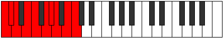

# Mode Zyrygic

## Links

- [Documentation](README.md)
- [Scales Index](Scales.md)
- [Modes Index](Modes.md)
- [Chords Index](Chords.md)

## Parent Scale

[Epyrygic](ScaleEpyrygic.md)

## Number

[2999](https://ianring.com/musictheory/scales/2999)

## Luminosity

-1

## Transposition

1, 1, 2, 1, 2, 1, 1, 2, 1

## Chord Pattern

ii⁰, iii⁰, v⁰

## Perfection

- 7 Perfect notes
- 2 Perfect notes

## Perfection Profile

true, true, true, true, true, true, false, true, false

## Permutations

| Tonic | Notes | Signature | Illustration | Audio |
|-------|-------|-----------|--------------|-------|
| [C](ModeCNaturalZyrygic.md) | C, C#, D, E, F, G, **G#**, A, **B**, C | C |  | [midi](https://github.com/edipermadi/music/blob/main/docs/ModeCNaturalZyrygic.mid?raw=true) |
| [C#](ModeCSharpZyrygic.md) | C#, D, D#, F, F#, G#, **A**, A#, **C**, C# | C |  | [midi](https://github.com/edipermadi/music/blob/main/docs/ModeCSharpZyrygic.mid?raw=true) |
| [Db](ModeDFlatZyrygic.md) | Db, D, Eb, F, Gb, Ab, **A**, Bb, **C**, Db | C |  | [midi](https://github.com/edipermadi/music/blob/main/docs/ModeDFlatZyrygic.mid?raw=true) |
| [D](ModeDNaturalZyrygic.md) | D, D#, E, F#, G, A, **A#**, B, **C#**, D | C |  | [midi](https://github.com/edipermadi/music/blob/main/docs/ModeDNaturalZyrygic.mid?raw=true) |
| [D#](ModeDSharpZyrygic.md) | D#, E, F, G, G#, A#, **B**, C, **D**, D# | C |  | [midi](https://github.com/edipermadi/music/blob/main/docs/ModeDSharpZyrygic.mid?raw=true) |
| [Eb](ModeEFlatZyrygic.md) | Eb, E, F, G, Ab, Bb, **B**, C, **D**, Eb | C |  | [midi](https://github.com/edipermadi/music/blob/main/docs/ModeEFlatZyrygic.mid?raw=true) |
| [E](ModeENaturalZyrygic.md) | E, F, F#, G#, A, B, **C**, C#, **D#**, E | C |  | [midi](https://github.com/edipermadi/music/blob/main/docs/ModeENaturalZyrygic.mid?raw=true) |
| [F](ModeFNaturalZyrygic.md) | F, F#, G, A, A#, C, **C#**, D, **E**, F | C |  | [midi](https://github.com/edipermadi/music/blob/main/docs/ModeFNaturalZyrygic.mid?raw=true) |
| [F#](ModeFSharpZyrygic.md) | F#, G, G#, A#, B, C#, **D**, D#, **F**, F# | C |  | [midi](https://github.com/edipermadi/music/blob/main/docs/ModeFSharpZyrygic.mid?raw=true) |
| [Gb](ModeGFlatZyrygic.md) | Gb, G, Ab, Bb, B, Db, **D**, Eb, **F**, Gb | C |  | [midi](https://github.com/edipermadi/music/blob/main/docs/ModeGFlatZyrygic.mid?raw=true) |
| [G](ModeGNaturalZyrygic.md) | G, G#, A, B, C, D, **D#**, E, **F#**, G | C |  | [midi](https://github.com/edipermadi/music/blob/main/docs/ModeGNaturalZyrygic.mid?raw=true) |
| [G#](ModeGSharpZyrygic.md) | G#, A, A#, C, C#, D#, **E**, F, **G**, G# | C |  | [midi](https://github.com/edipermadi/music/blob/main/docs/ModeGSharpZyrygic.mid?raw=true) |
| [Ab](ModeAFlatZyrygic.md) | Ab, A, Bb, C, Db, Eb, **E**, F, **G**, Ab | C |  | [midi](https://github.com/edipermadi/music/blob/main/docs/ModeAFlatZyrygic.mid?raw=true) |
| [A](ModeANaturalZyrygic.md) | A, A#, B, C#, D, E, **F**, F#, **G#**, A | C |  | [midi](https://github.com/edipermadi/music/blob/main/docs/ModeANaturalZyrygic.mid?raw=true) |
| [A#](ModeASharpZyrygic.md) | A#, B, C, D, D#, F, **F#**, G, **A**, A# | C |  | [midi](https://github.com/edipermadi/music/blob/main/docs/ModeASharpZyrygic.mid?raw=true) |
| [Bb](ModeBFlatZyrygic.md) | Bb, B, C, D, Eb, F, **Gb**, G, **A**, Bb | C |  | [midi](https://github.com/edipermadi/music/blob/main/docs/ModeBFlatZyrygic.mid?raw=true) |
| [B](ModeBNaturalZyrygic.md) | B, C, C#, D#, E, F#, **G**, G#, **A#**, B | C |  | [midi](https://github.com/edipermadi/music/blob/main/docs/ModeBNaturalZyrygic.mid?raw=true) |
