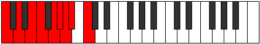
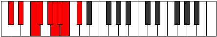
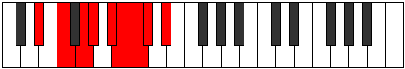
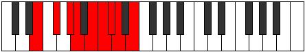
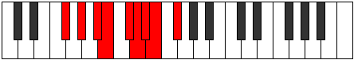
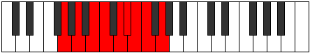
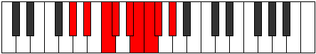
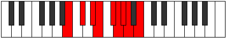

# Mode Zyryllic

## Links

- [Documentation](index.md)
- [Scales Index](Scales.md)
- [Modes Index](Modes.md)
- [Chords Index](Chords.md)

## Parent Scale

[Rocryllic](ScaleRocryllic.md)

## Number

[1973](https://ianring.com/musictheory/scales/1973)

## Perfection

- 6 Perfect notes
- 2 Perfect notes

## Perfection Profile

[true true false true true false true true]

## Permutations

| Tonic | Notes | Signature | Illustration | Audio |
|-------|-------|-----------|--------------|-------|
| [C](ModeCNaturalZyryllic.md) | C, D, **E**, F, G, **G#**, A, A#, C | C |  | [midi](ModeCNaturalZyryllic.mid) [ogg](ModeCNaturalZyryllic.ogg) |
| [C#](ModeCSharpZyryllic.md) | C#, D#, **F**, F#, G#, **A**, A#, B, C# | C |  | [midi](ModeCSharpZyryllic.mid) [ogg](ModeCSharpZyryllic.ogg) |
| [Db](ModeDFlatZyryllic.md) | Db, Eb, **F**, Gb, Ab, **A**, Bb, B, Db | C |  | [midi](ModeDFlatZyryllic.mid) [ogg](ModeDFlatZyryllic.ogg) |
| [D](ModeDNaturalZyryllic.md) | D, E, **F#**, G, A, **A#**, B, C, D | C |  | [midi](ModeDNaturalZyryllic.mid) [ogg](ModeDNaturalZyryllic.ogg) |
| [D#](ModeDSharpZyryllic.md) | D#, F, **G**, G#, A#, **B**, C, C#, D# | C |  | [midi](ModeDSharpZyryllic.mid) [ogg](ModeDSharpZyryllic.ogg) |
| [Eb](ModeEFlatZyryllic.md) | Eb, F, **G**, Ab, Bb, **B**, C, Db, Eb | C |  | [midi](ModeEFlatZyryllic.mid) [ogg](ModeEFlatZyryllic.ogg) |
| [E](ModeENaturalZyryllic.md) | E, F#, **G#**, A, B, **C**, C#, D, E | C |  | [midi](ModeENaturalZyryllic.mid) [ogg](ModeENaturalZyryllic.ogg) |
| [F](ModeFNaturalZyryllic.md) | F, G, **A**, A#, C, **C#**, D, D#, F | C |  | [midi](ModeFNaturalZyryllic.mid) [ogg](ModeFNaturalZyryllic.ogg) |
| [F#](ModeFSharpZyryllic.md) | F#, G#, **A#**, B, C#, **D**, D#, E, F# | C |  | [midi](ModeFSharpZyryllic.mid) [ogg](ModeFSharpZyryllic.ogg) |
| [Gb](ModeGFlatZyryllic.md) | Gb, Ab, **Bb**, B, Db, **D**, Eb, E, Gb | C |  | [midi](ModeGFlatZyryllic.mid) [ogg](ModeGFlatZyryllic.ogg) |
| [G](ModeGNaturalZyryllic.md) | G, A, **B**, C, D, **D#**, E, F, G | C |  | [midi](ModeGNaturalZyryllic.mid) [ogg](ModeGNaturalZyryllic.ogg) |
| [G#](ModeGSharpZyryllic.md) | G#, A#, **C**, C#, D#, **E**, F, F#, G# | C |  | [midi](ModeGSharpZyryllic.mid) [ogg](ModeGSharpZyryllic.ogg) |
| [Ab](ModeAFlatZyryllic.md) | Ab, Bb, **C**, Db, Eb, **E**, F, Gb, Ab | C |  | [midi](ModeAFlatZyryllic.mid) [ogg](ModeAFlatZyryllic.ogg) |
| [A](ModeANaturalZyryllic.md) | A, B, **C#**, D, E, **F**, F#, G, A | C |  | [midi](ModeANaturalZyryllic.mid) [ogg](ModeANaturalZyryllic.ogg) |
| [A#](ModeASharpZyryllic.md) | A#, C, **D**, D#, F, **F#**, G, G#, A# | C |  | [midi](ModeASharpZyryllic.mid) [ogg](ModeASharpZyryllic.ogg) |
| [Bb](ModeBFlatZyryllic.md) | Bb, C, **D**, Eb, F, **Gb**, G, Ab, Bb | C |  | [midi](ModeBFlatZyryllic.mid) [ogg](ModeBFlatZyryllic.ogg) |
| [B](ModeBNaturalZyryllic.md) | B, C#, **D#**, E, F#, **G**, G#, A, B | C |  | [midi](ModeBNaturalZyryllic.mid) [ogg](ModeBNaturalZyryllic.ogg) |
