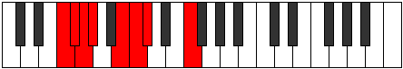

# Mode Zythian

## Links

- [Documentation](index.md)
- [Scales Index](Scales.md)
- [Modes Index](Modes.md)
- [Chords Index](Chords.md)

## Parent Scale

[Aeolacrian](ScaleAeolacrian.md)

## Number

[463](https://ianring.com/musictheory/scales/463)

## Perfection

- 5 Perfect notes
- 2 Perfect notes

## Perfection Profile

[true true false false true true true]

## Permutations

| Tonic | Notes | Signature | Illustration | Audio |
|-------|-------|-----------|--------------|-------|
| [C](ModeCNaturalZythian.md) | C, Db, **Ebb**, **Fbb**, Gb, Abb, Bbbb, C | C |  | [midi](ModeCNaturalZythian.mid) [ogg](ModeCNaturalZythian.ogg) |
| [C#](ModeCSharpZythian.md) | C#, D, **Eb**, **Fb**, G, Ab, Bbb, C# | C |  | [midi](ModeCSharpZythian.mid) [ogg](ModeCSharpZythian.ogg) |
| [Db](ModeDFlatZythian.md) | Db, Ebb, **Fbb**, **Gbbb**, Abb, Bbbb, Cbbb, Db | C |  | [midi](ModeDFlatZythian.mid) [ogg](ModeDFlatZythian.ogg) |
| [D](ModeDNaturalZythian.md) | D, Eb, **Fb**, **Gbb**, Ab, Bbb, Cbb, D | C |  | [midi](ModeDNaturalZythian.mid) [ogg](ModeDNaturalZythian.ogg) |
| [D#](ModeDSharpZythian.md) | D#, E, **F**, **Gb**, A, Bb, Cb, D# | C |  | [midi](ModeDSharpZythian.mid) [ogg](ModeDSharpZythian.ogg) |
| [Eb](ModeEFlatZythian.md) | Eb, Fb, **Gbb**, **Abbb**, Bbb, Cbb, Dbbb, Eb | C |  | [midi](ModeEFlatZythian.mid) [ogg](ModeEFlatZythian.ogg) |
| [E](ModeENaturalZythian.md) | E, F, **Gb**, **Abb**, Bb, Cb, Dbb, E | C |  | [midi](ModeENaturalZythian.mid) [ogg](ModeENaturalZythian.ogg) |
| [F](ModeFNaturalZythian.md) | F, Gb, **Abb**, **Bbbb**, Cb, Dbb, Ebbb, F | C |  | [midi](ModeFNaturalZythian.mid) [ogg](ModeFNaturalZythian.ogg) |
| [F#](ModeFSharpZythian.md) | F#, G, **Ab**, **Bbb**, C, Db, Ebb, F# | C |  | [midi](ModeFSharpZythian.mid) [ogg](ModeFSharpZythian.ogg) |
| [Gb](ModeGFlatZythian.md) | Gb, Abb, **Bbbb**, **Cbbb**, Dbb, Ebbb, Fbbb, Gb | C |  | [midi](ModeGFlatZythian.mid) [ogg](ModeGFlatZythian.ogg) |
| [G](ModeGNaturalZythian.md) | G, Ab, **Bbb**, **Cbb**, Db, Ebb, Fbb, G | C |  | [midi](ModeGNaturalZythian.mid) [ogg](ModeGNaturalZythian.ogg) |
| [G#](ModeGSharpZythian.md) | G#, A, **Bb**, **Cb**, D, Eb, Fb, G# | C |  | [midi](ModeGSharpZythian.mid) [ogg](ModeGSharpZythian.ogg) |
| [Ab](ModeAFlatZythian.md) | Ab, Bbb, **Cbb**, **Dbbb**, Ebb, Fbb, Gbbb, Ab | C |  | [midi](ModeAFlatZythian.mid) [ogg](ModeAFlatZythian.ogg) |
| [A](ModeANaturalZythian.md) | A, Bb, **Cb**, **Dbb**, Eb, Fb, Gbb, A | C |  | [midi](ModeANaturalZythian.mid) [ogg](ModeANaturalZythian.ogg) |
| [A#](ModeASharpZythian.md) | A#, B, **C**, **Db**, E, F, Gb, A# | C |  | [midi](ModeASharpZythian.mid) [ogg](ModeASharpZythian.ogg) |
| [Bb](ModeBFlatZythian.md) | Bb, Cb, **Dbb**, **Ebbb**, Fb, Gbb, Abbb, Bb | C |  | [midi](ModeBFlatZythian.mid) [ogg](ModeBFlatZythian.ogg) |
| [B](ModeBNaturalZythian.md) | B, C, **Db**, **Ebb**, F, Gb, Abb, B | C |  | [midi](ModeBNaturalZythian.mid) [ogg](ModeBNaturalZythian.ogg) |
