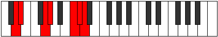

# Mode Zythimic

## Links

- [Documentation](index.md)
- [Scales Index](Scales.md)
- [Modes Index](Modes.md)
- [Chords Index](Chords.md)

## Parent Scale

[Daptimic](ScaleDaptimic.md)

## Number

[3171](https://ianring.com/musictheory/scales/3171)

## Perfection

- 4 Perfect notes
- 2 Perfect notes

## Perfection Profile

[false false true true true true]

## Permutations

| Tonic | Notes | Signature | Illustration | Audio |
|-------|-------|-----------|--------------|-------|
| [C](ModeCNaturalZythimic.md) | **C**, **Db**, E#, F#, G###, A##, **C** | C |  | [midi](ModeCNaturalZythimic.mid) [ogg](ModeCNaturalZythimic.ogg) |
| [C#](ModeCSharpZythimic.md) | **C#**, **D**, E##, F##, Cb, Dbb, **C#** | C |  | [midi](ModeCSharpZythimic.mid) [ogg](ModeCSharpZythimic.ogg) |
| [Db](ModeDFlatZythimic.md) | **Db**, **Ebb**, F#, G, A##, B#, **Db** | C |  | [midi](ModeDFlatZythimic.mid) [ogg](ModeDFlatZythimic.ogg) |
| [D](ModeDNaturalZythimic.md) | **D**, **Eb**, F##, G#, A###, B##, **D** | C |  | [midi](ModeDNaturalZythimic.mid) [ogg](ModeDNaturalZythimic.ogg) |
| [D#](ModeDSharpZythimic.md) | **D#**, **E**, F###, G##, Db, Ebb, **D#** | C |  | [midi](ModeDSharpZythimic.mid) [ogg](ModeDSharpZythimic.ogg) |
| [Eb](ModeEFlatZythimic.md) | **Eb**, **Fb**, G#, A, B##, C##, **Eb** | C |  | [midi](ModeEFlatZythimic.mid) [ogg](ModeEFlatZythimic.ogg) |
| [E](ModeENaturalZythimic.md) | **E**, **F**, G##, A#, B###, C###, **E** | C |  | [midi](ModeENaturalZythimic.mid) [ogg](ModeENaturalZythimic.ogg) |
| [F](ModeFNaturalZythimic.md) | **F**, **Gb**, A#, B, C###, D##, **F** | C |  | [midi](ModeFNaturalZythimic.mid) [ogg](ModeFNaturalZythimic.ogg) |
| [F#](ModeFSharpZythimic.md) | **F#**, **G**, A##, B#, D##, E#, **F#** | C |  | [midi](ModeFSharpZythimic.mid) [ogg](ModeFSharpZythimic.ogg) |
| [Gb](ModeGFlatZythimic.md) | **Gb**, **Abb**, B, C, D##, E#, **Gb** | C |  | [midi](ModeGFlatZythimic.mid) [ogg](ModeGFlatZythimic.ogg) |
| [G](ModeGNaturalZythimic.md) | **G**, **Ab**, B#, C#, D###, E##, **G** | C |  | [midi](ModeGNaturalZythimic.mid) [ogg](ModeGNaturalZythimic.ogg) |
| [G#](ModeGSharpZythimic.md) | **G#**, **A**, B##, C##, E##, F##, **G#** | C |  | [midi](ModeGSharpZythimic.mid) [ogg](ModeGSharpZythimic.ogg) |
| [Ab](ModeAFlatZythimic.md) | **Ab**, **Bbb**, C#, D, E##, F##, **Ab** | C |  | [midi](ModeAFlatZythimic.mid) [ogg](ModeAFlatZythimic.ogg) |
| [A](ModeANaturalZythimic.md) | **A**, **Bb**, C##, D#, E###, F###, **A** | C |  | [midi](ModeANaturalZythimic.mid) [ogg](ModeANaturalZythimic.ogg) |
| [A#](ModeASharpZythimic.md) | **A#**, **B**, C###, D##, F###, G##, **A#** | C |  | [midi](ModeASharpZythimic.mid) [ogg](ModeASharpZythimic.ogg) |
| [Bb](ModeBFlatZythimic.md) | **Bb**, **Cb**, D#, E, F###, G##, **Bb** | C |  | [midi](ModeBFlatZythimic.mid) [ogg](ModeBFlatZythimic.ogg) |
| [B](ModeBNaturalZythimic.md) | **B**, **C**, D##, E#, Cbbb, Cbb, **B** | C |  | [midi](ModeBNaturalZythimic.mid) [ogg](ModeBNaturalZythimic.ogg) |
