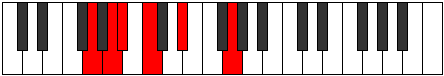

# Mode Zythitonic

## Links

- [Documentation](index.md)
- [Scales Index](Scales.md)
- [Modes Index](Modes.md)
- [Chords Index](Chords.md)

## Parent Scale

[Aeolacritonic](ScaleAeolacritonic.md)

## Number

[301](https://ianring.com/musictheory/scales/301)

## Perfection

- 2 Perfect notes
- 3 Perfect notes

## Interval Pattern

2, 1, 2, 3, 4

## Perfection Profile

[false false false true true]

## Permutations

| Tonic | Notes | Signature | Illustration | Audio |
|-------|-------|-----------|--------------|-------|
| [C](ModeCNaturalZythitonic.md) | **C**, **D**, **D#**, F, G#, **C** | C |  | [midi](https://github.com/edipermadi/music/blob/main/docs/ModeCNaturalZythitonic.mid?raw=true) |
| [C#](ModeCSharpZythitonic.md) | **C#**, **D#**, **E**, F#, A, **C#** | C |  | [midi](https://github.com/edipermadi/music/blob/main/docs/ModeCSharpZythitonic.mid?raw=true) |
| [Db](ModeDFlatZythitonic.md) | **Db**, **Eb**, **E**, Gb, A, **Db** | C |  | [midi](https://github.com/edipermadi/music/blob/main/docs/ModeDFlatZythitonic.mid?raw=true) |
| [D](ModeDNaturalZythitonic.md) | **D**, **E**, **F**, G, A#, **D** | C |  | [midi](https://github.com/edipermadi/music/blob/main/docs/ModeDNaturalZythitonic.mid?raw=true) |
| [D#](ModeDSharpZythitonic.md) | **D#**, **F**, **F#**, G#, B, **D#** | C |  | [midi](https://github.com/edipermadi/music/blob/main/docs/ModeDSharpZythitonic.mid?raw=true) |
| [Eb](ModeEFlatZythitonic.md) | **Eb**, **F**, **Gb**, Ab, B, **Eb** | C |  | [midi](https://github.com/edipermadi/music/blob/main/docs/ModeEFlatZythitonic.mid?raw=true) |
| [E](ModeENaturalZythitonic.md) | **E**, **F#**, **G**, A, C, **E** | C |  | [midi](https://github.com/edipermadi/music/blob/main/docs/ModeENaturalZythitonic.mid?raw=true) |
| [F](ModeFNaturalZythitonic.md) | **F**, **G**, **G#**, A#, C#, **F** | C |  | [midi](https://github.com/edipermadi/music/blob/main/docs/ModeFNaturalZythitonic.mid?raw=true) |
| [F#](ModeFSharpZythitonic.md) | **F#**, **G#**, **A**, B, D, **F#** | C |  | [midi](https://github.com/edipermadi/music/blob/main/docs/ModeFSharpZythitonic.mid?raw=true) |
| [Gb](ModeGFlatZythitonic.md) | **Gb**, **Ab**, **A**, B, D, **Gb** | C |  | [midi](https://github.com/edipermadi/music/blob/main/docs/ModeGFlatZythitonic.mid?raw=true) |
| [G](ModeGNaturalZythitonic.md) | **G**, **A**, **A#**, C, D#, **G** | C |  | [midi](https://github.com/edipermadi/music/blob/main/docs/ModeGNaturalZythitonic.mid?raw=true) |
| [G#](ModeGSharpZythitonic.md) | **G#**, **A#**, **B**, C#, E, **G#** | C |  | [midi](https://github.com/edipermadi/music/blob/main/docs/ModeGSharpZythitonic.mid?raw=true) |
| [Ab](ModeAFlatZythitonic.md) | **Ab**, **Bb**, **B**, Db, E, **Ab** | C |  | [midi](https://github.com/edipermadi/music/blob/main/docs/ModeAFlatZythitonic.mid?raw=true) |
| [A](ModeANaturalZythitonic.md) | **A**, **B**, **C**, D, F, **A** | C |  | [midi](https://github.com/edipermadi/music/blob/main/docs/ModeANaturalZythitonic.mid?raw=true) |
| [A#](ModeASharpZythitonic.md) | **A#**, **C**, **C#**, D#, F#, **A#** | C |  | [midi](https://github.com/edipermadi/music/blob/main/docs/ModeASharpZythitonic.mid?raw=true) |
| [Bb](ModeBFlatZythitonic.md) | **Bb**, **C**, **Db**, Eb, Gb, **Bb** | C |  | [midi](https://github.com/edipermadi/music/blob/main/docs/ModeBFlatZythitonic.mid?raw=true) |
| [B](ModeBNaturalZythitonic.md) | **B**, **C#**, **D**, E, G, **B** | C |  | [midi](https://github.com/edipermadi/music/blob/main/docs/ModeBNaturalZythitonic.mid?raw=true) |
