# Modes

## Links

- [Documentation](index.md)
- [Scales Index](Scales.md)
- [Modes Index](Modes.md)
- [Chords Index](Chords.md)

## Index

| Number | Scale | Mode | Notes | Illustration | Audio |
|--------|-------|------|-------|--------------|-------|
| [273](https://ianring.com/musictheory/scales/273) | [Minoric](ScaleMinoric.md) | [Minoric](ModeMinoric.md) | **C**, **E**, **G#**, **C** |  | [midi](https://github.com/edipermadi/music/blob/main/docs/ModeCNaturalMinoric.mid?raw=true) |
| [275](https://ianring.com/musictheory/scales/275) | [Aeoloric](ScaleAeoloric.md) | [Dalic](ModeDalic.md) | **C**, C#, **E**, **G#**, **C** |  | [midi](https://github.com/edipermadi/music/blob/main/docs/ModeCNaturalDalic.mid?raw=true) |
| [277](https://ianring.com/musictheory/scales/277) | [Aeolic](ScaleAeolic.md) | [Mixolyric](ModeMixolyric.md) | **C**, **D**, **E**, **G#**, **C** |  | [midi](https://github.com/edipermadi/music/blob/main/docs/ModeCNaturalMixolyric.mid?raw=true) |
| [279](https://ianring.com/musictheory/scales/279) | [Ranitonic](ScaleRanitonic.md) | [Poditonic](ModePoditonic.md) | **C**, C#, **D**, **E**, **G#**, **C** |  | [midi](https://github.com/edipermadi/music/blob/main/docs/ModeCNaturalPoditonic.mid?raw=true) |
| [281](https://ianring.com/musictheory/scales/281) | [Zyphic](ScaleZyphic.md) | [Lanic](ModeLanic.md) | **C**, **D#**, **E**, G#, **C** |  | [midi](https://github.com/edipermadi/music/blob/main/docs/ModeCNaturalLanic.mid?raw=true) |
| [283](https://ianring.com/musictheory/scales/283) | [Dolitonic](ScaleDolitonic.md) | [Aerylitonic](ModeAerylitonic.md) | **C**, C#, **D#**, **E**, G#, **C** |  | [midi](https://github.com/edipermadi/music/blob/main/docs/ModeCNaturalAerylitonic.mid?raw=true) |
| [285](https://ianring.com/musictheory/scales/285) | [Zylitonic](ScaleZylitonic.md) | [Zaritonic](ModeZaritonic.md) | **C**, **D**, **D#**, **E**, G#, **C** |  | [midi](https://github.com/edipermadi/music/blob/main/docs/ModeCNaturalZaritonic.mid?raw=true) |
| [287](https://ianring.com/musictheory/scales/287) | [Ponimic](ScalePonimic.md) | [Gynimic](ModeGynimic.md) | **C**, Db, **Ebb**, **Fbb**, **Gbbb**, Ab, **C** |  | [midi](https://github.com/edipermadi/music/blob/main/docs/ModeCNaturalGynimic.mid?raw=true) |
| [291](https://ianring.com/musictheory/scales/291) | [Thaptic](ScaleThaptic.md) | [Aerathic](ModeAerathic.md) | **C**, C#, F, **G#**, **C** |  | [midi](https://github.com/edipermadi/music/blob/main/docs/ModeCNaturalAerathic.mid?raw=true) |
| [293](https://ianring.com/musictheory/scales/293) | [Saric](ScaleSaric.md) | [Zoptic](ModeZoptic.md) | **C**, **D**, F, **G#**, **C** |  | [midi](https://github.com/edipermadi/music/blob/main/docs/ModeCNaturalZoptic.mid?raw=true) |
| [295](https://ianring.com/musictheory/scales/295) | [Ionyptitonic](ScaleIonyptitonic.md) | [Gyritonic](ModeGyritonic.md) | **C**, C#, **D**, F, **G#**, **C** |  | [midi](https://github.com/edipermadi/music/blob/main/docs/ModeCNaturalGyritonic.mid?raw=true) |
| [297](https://ianring.com/musictheory/scales/297) | [Epathic](ScaleEpathic.md) | [Mynic](ModeMynic.md) | **C**, **D#**, F, G#, **C** |  | [midi](https://github.com/edipermadi/music/blob/main/docs/ModeCNaturalMynic.mid?raw=true) |
| [299](https://ianring.com/musictheory/scales/299) | [Lothitonic](ScaleLothitonic.md) | [Phratonic](ModePhratonic.md) | **C**, C#, **D#**, F, G#, **C** | 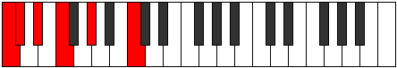 | [midi](https://github.com/edipermadi/music/blob/main/docs/ModeCNaturalPhratonic.mid?raw=true) |
| [301](https://ianring.com/musictheory/scales/301) | [Aeolacritonic](ScaleAeolacritonic.md) | [Zythitonic](ModeZythitonic.md) | **C**, **D**, **D#**, F, G#, **C** |  | [midi](https://github.com/edipermadi/music/blob/main/docs/ModeCNaturalZythitonic.mid?raw=true) |
| [303](https://ianring.com/musictheory/scales/303) | [Kytrimic](ScaleKytrimic.md) | [Golimic](ModeGolimic.md) | **C**, Db, **Ebb**, **Fbb**, Gbb, Ab, **C** |  | [midi](https://github.com/edipermadi/music/blob/main/docs/ModeCNaturalGolimic.mid?raw=true) |
| [305](https://ianring.com/musictheory/scales/305) | [Aeoloric](ScaleAeoloric.md) | [Gonic](ModeGonic.md) | **C**, **E**, F, **G#**, **C** |  | [midi](https://github.com/edipermadi/music/blob/main/docs/ModeCNaturalGonic.mid?raw=true) |
| [307](https://ianring.com/musictheory/scales/307) | [Zothitonic](ScaleZothitonic.md) | [Phrolitonic](ModePhrolitonic.md) | **C**, C#, **E**, F, **G#**, **C** |  | [midi](https://github.com/edipermadi/music/blob/main/docs/ModeCNaturalPhrolitonic.mid?raw=true) |
| [309](https://ianring.com/musictheory/scales/309) | [Aerynitonic](ScaleAerynitonic.md) | [Palitonic](ModePalitonic.md) | **C**, **D**, **E**, F, **G#**, **C** |  | [midi](https://github.com/edipermadi/music/blob/main/docs/ModeCNaturalPalitonic.mid?raw=true) |
| [311](https://ianring.com/musictheory/scales/311) | [Aerothimic](ScaleAerothimic.md) | [Stagimic](ModeStagimic.md) | **C**, Db, **Ebb**, **Fb**, Gbb, **Ab**, **C** |  | [midi](https://github.com/edipermadi/music/blob/main/docs/ModeCNaturalStagimic.mid?raw=true) |
| [313](https://ianring.com/musictheory/scales/313) | [Aeolyritonic](ScaleAeolyritonic.md) | [Goritonic](ModeGoritonic.md) | **C**, **D#**, **E**, F, G#, **C** |  | [midi](https://github.com/edipermadi/music/blob/main/docs/ModeCNaturalGoritonic.mid?raw=true) |
| [315](https://ianring.com/musictheory/scales/315) | [Syrimic](ScaleSyrimic.md) | [Stodimic](ModeStodimic.md) | **C**, Db, **Eb**, **Fb**, Gbb, Ab, **C** |  | [midi](https://github.com/edipermadi/music/blob/main/docs/ModeCNaturalStodimic.mid?raw=true) |
| [317](https://ianring.com/musictheory/scales/317) | [Kocrimic](ScaleKocrimic.md) | [Korimic](ModeKorimic.md) | **C**, **D**, **Eb**, **Fb**, Gbb, Ab, **C** |  | [midi](https://github.com/edipermadi/music/blob/main/docs/ModeCNaturalKorimic.mid?raw=true) |
| [319](https://ianring.com/musictheory/scales/319) | [Katyptian](ScaleKatyptian.md) | [Epodian](ModeEpodian.md) | **C**, Db, **Ebb**, **Fbb**, **Gbbb**, D###, F###, **C** |  | [midi](https://github.com/edipermadi/music/blob/main/docs/ModeCNaturalEpodian.mid?raw=true) |
| [325](https://ianring.com/musictheory/scales/325) | [Stathic](ScaleStathic.md) | [Dadic](ModeDadic.md) | **C**, **D**, **F#**, **G#**, **C** | 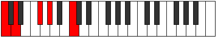 | [midi](https://github.com/edipermadi/music/blob/main/docs/ModeCNaturalDadic.mid?raw=true) |
| [327](https://ianring.com/musictheory/scales/327) | [Zathitonic](ScaleZathitonic.md) | [Syptitonic](ModeSyptitonic.md) | **C**, C#, **D**, F#, **G#**, **C** |  | [midi](https://github.com/edipermadi/music/blob/main/docs/ModeCNaturalSyptitonic.mid?raw=true) |
| [329](https://ianring.com/musictheory/scales/329) | [Daric](ScaleDaric.md) | [Lonic](ModeLonic.md) | **C**, **D#**, **F#**, G#, **C** |  | [midi](https://github.com/edipermadi/music/blob/main/docs/ModeCNaturalLonic.mid?raw=true) |
| [331](https://ianring.com/musictheory/scales/331) | [Aeracritonic](ScaleAeracritonic.md) | [Byptitonic](ModeByptitonic.md) | **C**, C#, **D#**, F#, G#, **C** |  | [midi](https://github.com/edipermadi/music/blob/main/docs/ModeCNaturalByptitonic.mid?raw=true) |
| [333](https://ianring.com/musictheory/scales/333) | [Ionoditonic](ScaleIonoditonic.md) | [Bogitonic](ModeBogitonic.md) | **C**, **D**, **D#**, **F#**, G#, **C** |  | [midi](https://github.com/edipermadi/music/blob/main/docs/ModeCNaturalBogitonic.mid?raw=true) |
| [335](https://ianring.com/musictheory/scales/335) | [Pynimic](ScalePynimic.md) | [Zanimic](ModeZanimic.md) | **C**, Db, **Ebb**, **Fbb**, Gb, Ab, **C** |  | [midi](https://github.com/edipermadi/music/blob/main/docs/ModeCNaturalZanimic.mid?raw=true) |
| [337](https://ianring.com/musictheory/scales/337) | [Aeolic](ScaleAeolic.md) | [Koptic](ModeKoptic.md) | **C**, **E**, **F#**, **G#**, **C** |  | [midi](https://github.com/edipermadi/music/blob/main/docs/ModeCNaturalKoptic.mid?raw=true) |
| [339](https://ianring.com/musictheory/scales/339) | [Epygitonic](ScaleEpygitonic.md) | [Zaptitonic](ModeZaptitonic.md) | **C**, C#, **E**, F#, **G#**, **C** | 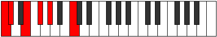 | [midi](https://github.com/edipermadi/music/blob/main/docs/ModeCNaturalZaptitonic.mid?raw=true) |
| [341](https://ianring.com/musictheory/scales/341) | [Bolitonic](ScaleBolitonic.md) | [Bothitonic](ModeBothitonic.md) | **C**, **D**, **E**, **F#**, **G#**, **C** |  | [midi](https://github.com/edipermadi/music/blob/main/docs/ModeCNaturalBothitonic.mid?raw=true) |
| [343](https://ianring.com/musictheory/scales/343) | [Mycrimic](ScaleMycrimic.md) | [Ionorimic](ModeIonorimic.md) | **C**, Db, **Ebb**, **Fb**, Gb, **Ab**, **C** |  | [midi](https://github.com/edipermadi/music/blob/main/docs/ModeCNaturalIonorimic.mid?raw=true) |
| [345](https://ianring.com/musictheory/scales/345) | [Ryphitonic](ScaleRyphitonic.md) | [Gylitonic](ModeGylitonic.md) | **C**, **D#**, **E**, **F#**, G#, **C** | 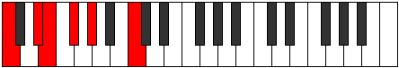 | [midi](https://github.com/edipermadi/music/blob/main/docs/ModeCNaturalGylitonic.mid?raw=true) |
| [347](https://ianring.com/musictheory/scales/347) | [Modimic](ScaleModimic.md) | [Barimic](ModeBarimic.md) | **C**, Db, **Eb**, **Fb**, Gb, Ab, **C** |  | [midi](https://github.com/edipermadi/music/blob/main/docs/ModeCNaturalBarimic.mid?raw=true) |
| [349](https://ianring.com/musictheory/scales/349) | [Gacrimic](ScaleGacrimic.md) | [Borimic](ModeBorimic.md) | **C**, **D**, **Eb**, **Fb**, **Gb**, Ab, **C** |  | [midi](https://github.com/edipermadi/music/blob/main/docs/ModeCNaturalBorimic.mid?raw=true) |
| [351](https://ianring.com/musictheory/scales/351) | [Stanian](ScaleStanian.md) | [Epanian](ModeEpanian.md) | **C**, Db, **Ebb**, **Fbb**, **Gbbb**, Abbb, Bbbb, **C** |  | [midi](https://github.com/edipermadi/music/blob/main/docs/ModeCNaturalEpanian.mid?raw=true) |
| [355](https://ianring.com/musictheory/scales/355) | [Phraditonic](ScalePhraditonic.md) | [Aeoloritonic](ModeAeoloritonic.md) | **C**, C#, F, F#, **G#**, **C** |  | [midi](https://github.com/edipermadi/music/blob/main/docs/ModeCNaturalAeoloritonic.mid?raw=true) |
| [357](https://ianring.com/musictheory/scales/357) | [Phronitonic](ScalePhronitonic.md) | [Banitonic](ModeBanitonic.md) | **C**, **D**, F, **F#**, **G#**, **C** |  | [midi](https://github.com/edipermadi/music/blob/main/docs/ModeCNaturalBanitonic.mid?raw=true) |
| [359](https://ianring.com/musictheory/scales/359) | [Bolimic](ScaleBolimic.md) | [Bothimic](ModeBothimic.md) | **C**, Db, **Ebb**, F, Gb, **Ab**, **C** |  | [midi](https://github.com/edipermadi/music/blob/main/docs/ModeCNaturalBothimic.mid?raw=true) |
| [361](https://ianring.com/musictheory/scales/361) | [Ionaditonic](ScaleIonaditonic.md) | [Bocritonic](ModeBocritonic.md) | **C**, **D#**, F, **F#**, G#, **C** |  | [midi](https://github.com/edipermadi/music/blob/main/docs/ModeCNaturalBocritonic.mid?raw=true) |
| [363](https://ianring.com/musictheory/scales/363) | [Garimic](ScaleGarimic.md) | [Soptimic](ModeSoptimic.md) | **C**, Db, **Eb**, F, Gb, Ab, **C** | 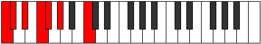 | [midi](https://github.com/edipermadi/music/blob/main/docs/ModeCNaturalSoptimic.mid?raw=true) |
| [365](https://ianring.com/musictheory/scales/365) | [Manimic](ScaleManimic.md) | [Marimic](ModeMarimic.md) | **C**, **D**, **Eb**, F, **Gb**, Ab, **C** |  | [midi](https://github.com/edipermadi/music/blob/main/docs/ModeCNaturalMarimic.mid?raw=true) |
| [367](https://ianring.com/musictheory/scales/367) | [Saptian](ScaleSaptian.md) | [Aerodian](ModeAerodian.md) | **C**, Db, **Ebb**, **Fbb**, Gbb, Abbb, Bbbb, **C** |  | [midi](https://github.com/edipermadi/music/blob/main/docs/ModeCNaturalAerodian.mid?raw=true) |
| [369](https://ianring.com/musictheory/scales/369) | [Ranitonic](ScaleRanitonic.md) | [Laditonic](ModeLaditonic.md) | **C**, **E**, F, **F#**, **G#**, **C** |  | [midi](https://github.com/edipermadi/music/blob/main/docs/ModeCNaturalLaditonic.mid?raw=true) |
| [371](https://ianring.com/musictheory/scales/371) | [Thogimic](ScaleThogimic.md) | [Rythimic](ModeRythimic.md) | **C**, Db, **E**, F, Gb, **Ab**, **C** |  | [midi](https://github.com/edipermadi/music/blob/main/docs/ModeCNaturalRythimic.mid?raw=true) |
| [373](https://ianring.com/musictheory/scales/373) | [Dathimic](ScaleDathimic.md) | [Epagimic](ModeEpagimic.md) | **C**, **D**, **E**, F, **Gb**, **Ab**, **C** |  | [midi](https://github.com/edipermadi/music/blob/main/docs/ModeCNaturalEpagimic.mid?raw=true) |
| [375](https://ianring.com/musictheory/scales/375) | [Katacrian](ScaleKatacrian.md) | [Sodian](ModeSodian.md) | **C**, Db, **Ebb**, **Fb**, Gbb, Abbb, **Bbbb**, **C** |  | [midi](https://github.com/edipermadi/music/blob/main/docs/ModeCNaturalSodian.mid?raw=true) |
| [377](https://ianring.com/musictheory/scales/377) | [Galimic](ScaleGalimic.md) | [Kathimic](ModeKathimic.md) | **C**, **D#**, **E**, F, **Gb**, Ab, **C** |  | [midi](https://github.com/edipermadi/music/blob/main/docs/ModeCNaturalKathimic.mid?raw=true) |
| [379](https://ianring.com/musictheory/scales/379) | [Zorian](ScaleZorian.md) | [Aeragian](ModeAeragian.md) | **C**, Db, **Eb**, **Fb**, Gbb, Abbb, Bbbb, **C** |  | [midi](https://github.com/edipermadi/music/blob/main/docs/ModeCNaturalAeragian.mid?raw=true) |
| [381](https://ianring.com/musictheory/scales/381) | [Gydian](ScaleGydian.md) | [Kogian](ModeKogian.md) | **C**, **D**, **Eb**, **Fb**, Gbb, **Abbb**, Bbbb, **C** |  | [midi](https://github.com/edipermadi/music/blob/main/docs/ModeCNaturalKogian.mid?raw=true) |
| [383](https://ianring.com/musictheory/scales/383) | [Stolyllic](ScaleStolyllic.md) | [Logyllic](ModeLogyllic.md) | **C**, C#, **D**, **D#**, **E**, F, F#, G#, **C** |  | [midi](https://github.com/edipermadi/music/blob/main/docs/ModeCNaturalLogyllic.mid?raw=true) |
| [393](https://ianring.com/musictheory/scales/393) | [Thaptic](ScaleThaptic.md) | [Lothic](ModeLothic.md) | C, **D#**, **G**, G#, C |  | [midi](https://github.com/edipermadi/music/blob/main/docs/ModeCNaturalLothic.mid?raw=true) |
| [395](https://ianring.com/musictheory/scales/395) | [Phraditonic](ScalePhraditonic.md) | [Dalitonic](ModeDalitonic.md) | C, C#, **D#**, **G**, G#, C |  | [midi](https://github.com/edipermadi/music/blob/main/docs/ModeCNaturalDalitonic.mid?raw=true) |
| [397](https://ianring.com/musictheory/scales/397) | [Zolitonic](ScaleZolitonic.md) | [Epogitonic](ModeEpogitonic.md) | C, **D**, **D#**, G, G#, C |  | [midi](https://github.com/edipermadi/music/blob/main/docs/ModeCNaturalEpogitonic.mid?raw=true) |
| [399](https://ianring.com/musictheory/scales/399) | [Daptimic](ScaleDaptimic.md) | [Zynimic](ModeZynimic.md) | C, Db, **Ebb**, **Fbb**, G, Ab, C |  | [midi](https://github.com/edipermadi/music/blob/main/docs/ModeCNaturalZynimic.mid?raw=true) |
| [401](https://ianring.com/musictheory/scales/401) | [Zyphic](ScaleZyphic.md) | [Epogic](ModeEpogic.md) | C, **E**, **G**, **G#**, C |  | [midi](https://github.com/edipermadi/music/blob/main/docs/ModeCNaturalEpogic.mid?raw=true) |
| [403](https://ianring.com/musictheory/scales/403) | [Lycritonic](ScaleLycritonic.md) | [Daptitonic](ModeDaptitonic.md) | C, C#, **E**, **G**, **G#**, C |  | [midi](https://github.com/edipermadi/music/blob/main/docs/ModeCNaturalDaptitonic.mid?raw=true) |
| [405](https://ianring.com/musictheory/scales/405) | [Aeolanitonic](ScaleAeolanitonic.md) | [Danitonic](ModeDanitonic.md) | C, **D**, **E**, G, **G#**, C |  | [midi](https://github.com/edipermadi/music/blob/main/docs/ModeCNaturalDanitonic.mid?raw=true) |
| [407](https://ianring.com/musictheory/scales/407) | [Kanimic](ScaleKanimic.md) | [Zylimic](ModeZylimic.md) | C, Db, **Ebb**, **Fb**, G, **Ab**, C | 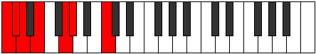 | [midi](https://github.com/edipermadi/music/blob/main/docs/ModeCNaturalZylimic.mid?raw=true) |
| [409](https://ianring.com/musictheory/scales/409) | [Zacritonic](ScaleZacritonic.md) | [Laritonic](ModeLaritonic.md) | C, **D#**, **E**, **G**, G#, C |  | [midi](https://github.com/edipermadi/music/blob/main/docs/ModeCNaturalLaritonic.mid?raw=true) |
| [411](https://ianring.com/musictheory/scales/411) | [Laptimic](ScaleLaptimic.md) | [Lygimic](ModeLygimic.md) | C, Db, **Eb**, **Fb**, **G**, Ab, C |  | [midi](https://github.com/edipermadi/music/blob/main/docs/ModeCNaturalLygimic.mid?raw=true) |
| [413](https://ianring.com/musictheory/scales/413) | [Aerycrimic](ScaleAerycrimic.md) | [Ganimic](ModeGanimic.md) | C, **D**, **Eb**, **Fb**, G, Ab, C |  | [midi](https://github.com/edipermadi/music/blob/main/docs/ModeCNaturalGanimic.mid?raw=true) |
| [415](https://ianring.com/musictheory/scales/415) | [Thycrian](ScaleThycrian.md) | [Aeoladian](ModeAeoladian.md) | C, Db, **Ebb**, **Fbb**, **Gbbb**, Abb, Bbbb, C |  | [midi](https://github.com/edipermadi/music/blob/main/docs/ModeCNaturalAeoladian.mid?raw=true) |
| [419](https://ianring.com/musictheory/scales/419) | [Zolitonic](ScaleZolitonic.md) | [Ionacritonic](ModeIonacritonic.md) | C, C#, F, **G**, **G#**, C | 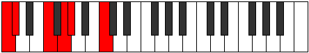 | [midi](https://github.com/edipermadi/music/blob/main/docs/ModeCNaturalIonacritonic.mid?raw=true) |
| [421](https://ianring.com/musictheory/scales/421) | [Gathitonic](ScaleGathitonic.md) | [Ionitonic](ModeIonitonic.md) | C, **D**, F, G, **G#**, C |  | [midi](https://github.com/edipermadi/music/blob/main/docs/ModeCNaturalIonitonic.mid?raw=true) |
| [423](https://ianring.com/musictheory/scales/423) | [Mythimic](ScaleMythimic.md) | [Sogimic](ModeSogimic.md) | C, Db, **Ebb**, F, G, **Ab**, C |  | [midi](https://github.com/edipermadi/music/blob/main/docs/ModeCNaturalSogimic.mid?raw=true) |
| [425](https://ianring.com/musictheory/scales/425) | [Magitonic](ScaleMagitonic.md) | [Daditonic](ModeDaditonic.md) | C, **D#**, F, **G**, G#, C |  | [midi](https://github.com/edipermadi/music/blob/main/docs/ModeCNaturalDaditonic.mid?raw=true) |
| [427](https://ianring.com/musictheory/scales/427) | [Bylimic](ScaleBylimic.md) | [Zothimic](ModeZothimic.md) | C, Db, **Eb**, F, **G**, Ab, C |  | [midi](https://github.com/edipermadi/music/blob/main/docs/ModeCNaturalZothimic.mid?raw=true) |
| [429](https://ianring.com/musictheory/scales/429) | [Dyrimic](ScaleDyrimic.md) | [Koptimic](ModeKoptimic.md) | C, **D**, **Eb**, F, G, Ab, C |  | [midi](https://github.com/edipermadi/music/blob/main/docs/ModeCNaturalKoptimic.mid?raw=true) |
| [431](https://ianring.com/musictheory/scales/431) | [Zogian](ScaleZogian.md) | [Epyrian](ModeEpyrian.md) | C, Db, **Ebb**, **Fbb**, Gbb, Abb, Bbbb, C |  | [midi](https://github.com/edipermadi/music/blob/main/docs/ModeCNaturalEpyrian.mid?raw=true) |
| [433](https://ianring.com/musictheory/scales/433) | [Dolitonic](ScaleDolitonic.md) | [Poritonic](ModePoritonic.md) | C, **E**, F, **G**, **G#**, C |  | [midi](https://github.com/edipermadi/music/blob/main/docs/ModeCNaturalPoritonic.mid?raw=true) |
| [435](https://ianring.com/musictheory/scales/435) | [Solimic](ScaleSolimic.md) | [Ionolimic](ModeIonolimic.md) | C, Db, **E**, F, **G**, **Ab**, C |  | [midi](https://github.com/edipermadi/music/blob/main/docs/ModeCNaturalIonolimic.mid?raw=true) |
| [437](https://ianring.com/musictheory/scales/437) | [Rycrimic](ScaleRycrimic.md) | [Ronimic](ModeRonimic.md) | C, **D**, **E**, F, G, **Ab**, C |  | [midi](https://github.com/edipermadi/music/blob/main/docs/ModeCNaturalRonimic.mid?raw=true) |
| [439](https://ianring.com/musictheory/scales/439) | [Aeolathian](ScaleAeolathian.md) | [Bythian](ModeBythian.md) | C, Db, **Ebb**, **Fb**, Gbb, Abb, **Bbbb**, C |  | [midi](https://github.com/edipermadi/music/blob/main/docs/ModeCNaturalBythian.mid?raw=true) |
| [441](https://ianring.com/musictheory/scales/441) | [Bygimic](ScaleBygimic.md) | [Thycrimic](ModeThycrimic.md) | C, **D#**, **E**, F, **G**, Ab, C |  | [midi](https://github.com/edipermadi/music/blob/main/docs/ModeCNaturalThycrimic.mid?raw=true) |
| [443](https://ianring.com/musictheory/scales/443) | [Stythian](ScaleStythian.md) | [Kothian](ModeKothian.md) | C, Db, **Eb**, **Fb**, Gbb, **Abb**, Bbbb, C |  | [midi](https://github.com/edipermadi/music/blob/main/docs/ModeCNaturalKothian.mid?raw=true) |
| [445](https://ianring.com/musictheory/scales/445) | [Epycrian](ScaleEpycrian.md) | [Gocrian](ModeGocrian.md) | C, **D**, **Eb**, **Fb**, Gbb, Abb, Bbbb, C |  | [midi](https://github.com/edipermadi/music/blob/main/docs/ModeCNaturalGocrian.mid?raw=true) |
| [447](https://ianring.com/musictheory/scales/447) | [Phroryllic](ScalePhroryllic.md) | [Thyphyllic](ModeThyphyllic.md) | C, C#, **D**, **D#**, **E**, F, G, G#, C |  | [midi](https://github.com/edipermadi/music/blob/main/docs/ModeCNaturalThyphyllic.mid?raw=true) |
| [453](https://ianring.com/musictheory/scales/453) | [Zathitonic](ScaleZathitonic.md) | [Raditonic](ModeRaditonic.md) | C, **D**, **F#**, G, **G#**, C |  | [midi](https://github.com/edipermadi/music/blob/main/docs/ModeCNaturalRaditonic.mid?raw=true) |
| [455](https://ianring.com/musictheory/scales/455) | [Thonimic](ScaleThonimic.md) | [Stadimic](ModeStadimic.md) | C, Db, **Ebb**, F#, G, **Ab**, C |  | [midi](https://github.com/edipermadi/music/blob/main/docs/ModeCNaturalStadimic.mid?raw=true) |
| [457](https://ianring.com/musictheory/scales/457) | [Molitonic](ScaleMolitonic.md) | [Staptitonic](ModeStaptitonic.md) | C, **D#**, **F#**, **G**, G#, C |  | [midi](https://github.com/edipermadi/music/blob/main/docs/ModeCNaturalStaptitonic.mid?raw=true) |
| [459](https://ianring.com/musictheory/scales/459) | [Epygimic](ScaleEpygimic.md) | [Zaptimic](ModeZaptimic.md) | C, Db, **Eb**, F#, **G**, Ab, C |  | [midi](https://github.com/edipermadi/music/blob/main/docs/ModeCNaturalZaptimic.mid?raw=true) |
| [461](https://ianring.com/musictheory/scales/461) | [Katythimic](ScaleKatythimic.md) | [Madimic](ModeMadimic.md) | C, **D**, **Eb**, **F#**, G, Ab, C |  | [midi](https://github.com/edipermadi/music/blob/main/docs/ModeCNaturalMadimic.mid?raw=true) |
| [463](https://ianring.com/musictheory/scales/463) | [Aeolacrian](ScaleAeolacrian.md) | [Zythian](ModeZythian.md) | C, Db, **Ebb**, **Fbb**, Gb, Abb, Bbbb, C |  | [midi](https://github.com/edipermadi/music/blob/main/docs/ModeCNaturalZythian.mid?raw=true) |
| [465](https://ianring.com/musictheory/scales/465) | [Zylitonic](ScaleZylitonic.md) | [Zoditonic](ModeZoditonic.md) | C, **E**, **F#**, **G**, **G#**, C |  | [midi](https://github.com/edipermadi/music/blob/main/docs/ModeCNaturalZoditonic.mid?raw=true) |
| [467](https://ianring.com/musictheory/scales/467) | [Phralimic](ScalePhralimic.md) | [Phrogimic](ModePhrogimic.md) | C, Db, **E**, F#, **G**, **Ab**, C |  | [midi](https://github.com/edipermadi/music/blob/main/docs/ModeCNaturalPhrogimic.mid?raw=true) |
| [469](https://ianring.com/musictheory/scales/469) | [Katanimic](ScaleKatanimic.md) | [Katyrimic](ModeKatyrimic.md) | C, **D**, **E**, **F#**, G, **Ab**, C | 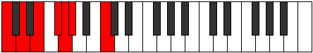 | [midi](https://github.com/edipermadi/music/blob/main/docs/ModeCNaturalKatyrimic.mid?raw=true) |
| [471](https://ianring.com/musictheory/scales/471) | [Thacrian](ScaleThacrian.md) | [Dodian](ModeDodian.md) | C, Db, **Ebb**, **Fb**, Gb, Abb, **Bbbb**, C |  | [midi](https://github.com/edipermadi/music/blob/main/docs/ModeCNaturalDodian.mid?raw=true) |
| [473](https://ianring.com/musictheory/scales/473) | [Lathimic](ScaleLathimic.md) | [Aeralimic](ModeAeralimic.md) | C, **D#**, **E**, **F#**, **G**, Ab, C |  | [midi](https://github.com/edipermadi/music/blob/main/docs/ModeCNaturalAeralimic.mid?raw=true) |
| [475](https://ianring.com/musictheory/scales/475) | [Stygian](ScaleStygian.md) | [Aeolygian](ModeAeolygian.md) | C, Db, **Eb**, **Fb**, Gb, **Abb**, Bbbb, C |  | [midi](https://github.com/edipermadi/music/blob/main/docs/ModeCNaturalAeolygian.mid?raw=true) |
| [477](https://ianring.com/musictheory/scales/477) | [Katogian](ScaleKatogian.md) | [Stacrian](ModeStacrian.md) | C, **D**, **Eb**, **Fb**, **Gb**, Abb, Bbbb, C |  | [midi](https://github.com/edipermadi/music/blob/main/docs/ModeCNaturalStacrian.mid?raw=true) |
| [479](https://ianring.com/musictheory/scales/479) | [Aeoladyllic](ScaleAeoladyllic.md) | [Kocryllic](ModeKocryllic.md) | C, C#, **D**, **D#**, **E**, F#, G, G#, C |  | [midi](https://github.com/edipermadi/music/blob/main/docs/ModeCNaturalKocryllic.mid?raw=true) |
| [483](https://ianring.com/musictheory/scales/483) | [Daptimic](ScaleDaptimic.md) | [Kygimic](ModeKygimic.md) | C, Db, E#, F#, **G**, **Ab**, C |  | [midi](https://github.com/edipermadi/music/blob/main/docs/ModeCNaturalKygimic.mid?raw=true) |
| [485](https://ianring.com/musictheory/scales/485) | [Stalimic](ScaleStalimic.md) | [Stoptimic](ModeStoptimic.md) | C, **D**, E#, **F#**, G, **Ab**, C |  | [midi](https://github.com/edipermadi/music/blob/main/docs/ModeCNaturalStoptimic.mid?raw=true) |
| [487](https://ianring.com/musictheory/scales/487) | [Ionarian](ScaleIonarian.md) | [Dynian](ModeDynian.md) | C, Db, **Ebb**, F, Gb, Abb, **Bbbb**, C |  | [midi](https://github.com/edipermadi/music/blob/main/docs/ModeCNaturalDynian.mid?raw=true) |
| [489](https://ianring.com/musictheory/scales/489) | [Starimic](ScaleStarimic.md) | [Phrathimic](ModePhrathimic.md) | C, **D#**, E#, **F#**, **G**, Ab, C |  | [midi](https://github.com/edipermadi/music/blob/main/docs/ModeCNaturalPhrathimic.mid?raw=true) |
| [491](https://ianring.com/musictheory/scales/491) | [Ionythian](ScaleIonythian.md) | [Aeolyrian](ModeAeolyrian.md) | C, Db, **Eb**, F, Gb, **Abb**, Bbbb, C |  | [midi](https://github.com/edipermadi/music/blob/main/docs/ModeCNaturalAeolyrian.mid?raw=true) |
| [493](https://ianring.com/musictheory/scales/493) | [Aeopian](ScaleAeopian.md) | [Rygian](ModeRygian.md) | C, **D**, **Eb**, F, **Gb**, Abb, Bbbb, C |  | [midi](https://github.com/edipermadi/music/blob/main/docs/ModeCNaturalRygian.mid?raw=true) |
| [495](https://ianring.com/musictheory/scales/495) | [Pynyllic](ScalePynyllic.md) | [Bocryllic](ModeBocryllic.md) | C, C#, **D**, **D#**, F, F#, G, G#, C |  | [midi](https://github.com/edipermadi/music/blob/main/docs/ModeCNaturalBocryllic.mid?raw=true) |
| [497](https://ianring.com/musictheory/scales/497) | [Ponimic](ScalePonimic.md) | [Kadimic](ModeKadimic.md) | C, **D##**, E#, **F#**, **G**, **Ab**, C |  | [midi](https://github.com/edipermadi/music/blob/main/docs/ModeCNaturalKadimic.mid?raw=true) |
| [499](https://ianring.com/musictheory/scales/499) | [Parian](ScaleParian.md) | [Ionaptian](ModeIonaptian.md) | C, Db, **E**, F, Gb, **Abb**, **Bbbb**, C |  | [midi](https://github.com/edipermadi/music/blob/main/docs/ModeCNaturalIonaptian.mid?raw=true) |
| [501](https://ianring.com/musictheory/scales/501) | [Pythian](ScalePythian.md) | [Katylian](ModeKatylian.md) | C, **D**, **E**, F, **Gb**, Abb, **Bbbb**, C |  | [midi](https://github.com/edipermadi/music/blob/main/docs/ModeCNaturalKatylian.mid?raw=true) |
| [503](https://ianring.com/musictheory/scales/503) | [Thagyllic](ScaleThagyllic.md) | [Thoptyllic](ModeThoptyllic.md) | C, C#, **D**, **E**, F, F#, G, **G#**, C |  | [midi](https://github.com/edipermadi/music/blob/main/docs/ModeCNaturalThoptyllic.mid?raw=true) |
| [505](https://ianring.com/musictheory/scales/505) | [Thadian](ScaleThadian.md) | [Sanian](ModeSanian.md) | C, **D#**, **E**, F, **Gb**, **Abb**, Bbbb, C |  | [midi](https://github.com/edipermadi/music/blob/main/docs/ModeCNaturalSanian.mid?raw=true) |
| [507](https://ianring.com/musictheory/scales/507) | [Dolyllic](ScaleDolyllic.md) | [Moryllic](ModeMoryllic.md) | C, C#, **D#**, **E**, F, F#, **G**, G#, C |  | [midi](https://github.com/edipermadi/music/blob/main/docs/ModeCNaturalMoryllic.mid?raw=true) |
| [509](https://ianring.com/musictheory/scales/509) | [Stycryllic](ScaleStycryllic.md) | [Ionothyllic](ModeIonothyllic.md) | C, **D**, **D#**, **E**, F, **F#**, G, G#, C |  | [midi](https://github.com/edipermadi/music/blob/main/docs/ModeCNaturalIonothyllic.mid?raw=true) |
| [511](https://ianring.com/musictheory/scales/511) | [Manygic](ScaleManygic.md) | [Polygic](ModePolygic.md) | C, C#, **D**, **D#**, **E**, F, F#, G, G#, C |  | [midi](https://github.com/edipermadi/music/blob/main/docs/ModeCNaturalPolygic.mid?raw=true) |
| [547](https://ianring.com/musictheory/scales/547) | [Zyphic](ScaleZyphic.md) | [Pyrric](ModePyrric.md) | **C**, **C#**, F, **A**, **C** |  | [midi](https://github.com/edipermadi/music/blob/main/docs/ModeCNaturalPyrric.mid?raw=true) |
| [549](https://ianring.com/musictheory/scales/549) | [Epathic](ScaleEpathic.md) | [Rothic](ModeRothic.md) | **C**, D, F, **A**, **C** |  | [midi](https://github.com/edipermadi/music/blob/main/docs/ModeCNaturalRothic.mid?raw=true) |
| [551](https://ianring.com/musictheory/scales/551) | [Aeolyritonic](ScaleAeolyritonic.md) | [Aeoloditonic](ModeAeoloditonic.md) | **C**, **C#**, D, F, **A**, **C** |  | [midi](https://github.com/edipermadi/music/blob/main/docs/ModeCNaturalAeoloditonic.mid?raw=true) |
| [553](https://ianring.com/musictheory/scales/553) | [Daric](ScaleDaric.md) | [Phradic](ModePhradic.md) | **C**, **D#**, F, **A**, **C** |  | [midi](https://github.com/edipermadi/music/blob/main/docs/ModeCNaturalPhradic.mid?raw=true) |
| [555](https://ianring.com/musictheory/scales/555) | [Ryphitonic](ScaleRyphitonic.md) | [Aeolycritonic](ModeAeolycritonic.md) | **C**, **C#**, **D#**, F, **A**, **C** |  | [midi](https://github.com/edipermadi/music/blob/main/docs/ModeCNaturalAeolycritonic.mid?raw=true) |
| [557](https://ianring.com/musictheory/scales/557) | [Ionaditonic](ScaleIonaditonic.md) | [Gythitonic](ModeGythitonic.md) | **C**, D, **D#**, F, **A**, **C** |  | [midi](https://github.com/edipermadi/music/blob/main/docs/ModeCNaturalGythitonic.mid?raw=true) |
| [559](https://ianring.com/musictheory/scales/559) | [Galimic](ScaleGalimic.md) | [Lylimic](ModeLylimic.md) | **C**, **Db**, Ebb, **Fbb**, Gbb, **A**, **C** |  | [midi](https://github.com/edipermadi/music/blob/main/docs/ModeCNaturalLylimic.mid?raw=true) |
| [561](https://ianring.com/musictheory/scales/561) | [Thaptic](ScaleThaptic.md) | [Phratic](ModePhratic.md) | **C**, **E**, F, A, **C** |  | [midi](https://github.com/edipermadi/music/blob/main/docs/ModeCNaturalPhratic.mid?raw=true) |
| [563](https://ianring.com/musictheory/scales/563) | [Zacritonic](ScaleZacritonic.md) | [Thacritonic](ModeThacritonic.md) | **C**, **C#**, **E**, F, A, **C** |  | [midi](https://github.com/edipermadi/music/blob/main/docs/ModeCNaturalThacritonic.mid?raw=true) |
| [565](https://ianring.com/musictheory/scales/565) | [Magitonic](ScaleMagitonic.md) | [Aeolyphritonic](ModeAeolyphritonic.md) | **C**, D, **E**, F, A, **C** |  | [midi](https://github.com/edipermadi/music/blob/main/docs/ModeCNaturalAeolyphritonic.mid?raw=true) |
| [567](https://ianring.com/musictheory/scales/567) | [Bygimic](ScaleBygimic.md) | [Aeoladimic](ModeAeoladimic.md) | **C**, **Db**, Ebb, **Fb**, Gbb, A, **C** |  | [midi](https://github.com/edipermadi/music/blob/main/docs/ModeCNaturalAeoladimic.mid?raw=true) |
| [569](https://ianring.com/musictheory/scales/569) | [Molitonic](ScaleMolitonic.md) | [Mothitonic](ModeMothitonic.md) | **C**, **D#**, **E**, F, A, **C** |  | [midi](https://github.com/edipermadi/music/blob/main/docs/ModeCNaturalMothitonic.mid?raw=true) |
| [571](https://ianring.com/musictheory/scales/571) | [Lathimic](ScaleLathimic.md) | [Kynimic](ModeKynimic.md) | **C**, **Db**, **Eb**, **Fb**, Gbb, A, **C** |  | [midi](https://github.com/edipermadi/music/blob/main/docs/ModeCNaturalKynimic.mid?raw=true) |
| [573](https://ianring.com/musictheory/scales/573) | [Starimic](ScaleStarimic.md) | [Saptimic](ModeSaptimic.md) | **C**, D, **Eb**, **Fb**, Gbb, A, **C** |  | [midi](https://github.com/edipermadi/music/blob/main/docs/ModeCNaturalSaptimic.mid?raw=true) |
| [575](https://ianring.com/musictheory/scales/575) | [Thadian](ScaleThadian.md) | [Ionydian](ModeIonydian.md) | **C**, **Db**, Ebb, **Fbb**, **Gbbb**, D###, Cbbb, **C** |  | [midi](https://github.com/edipermadi/music/blob/main/docs/ModeCNaturalIonydian.mid?raw=true) |
| [581](https://ianring.com/musictheory/scales/581) | [Daric](ScaleDaric.md) | [Bolic](ModeBolic.md) | **C**, D, **F#**, **A**, **C** |  | [midi](https://github.com/edipermadi/music/blob/main/docs/ModeCNaturalBolic.mid?raw=true) |
| [583](https://ianring.com/musictheory/scales/583) | [Molitonic](ScaleMolitonic.md) | [Aeritonic](ModeAeritonic.md) | **C**, **C#**, D, F#, **A**, **C** |  | [midi](https://github.com/edipermadi/music/blob/main/docs/ModeCNaturalAeritonic.mid?raw=true) |
| [585](https://ianring.com/musictheory/scales/585) | [Phrynic](ScalePhrynic.md) | [Phrynic](ModePhrynic.md) | **C**, **D#**, **F#**, **A**, **C** |  | [midi](https://github.com/edipermadi/music/blob/main/docs/ModeCNaturalPhrynic.mid?raw=true) |
| [587](https://ianring.com/musictheory/scales/587) | [Thyritonic](ScaleThyritonic.md) | [Pathitonic](ModePathitonic.md) | **C**, **C#**, **D#**, F#, **A**, **C** |  | [midi](https://github.com/edipermadi/music/blob/main/docs/ModeCNaturalPathitonic.mid?raw=true) |
| [589](https://ianring.com/musictheory/scales/589) | [Mixitonic](ScaleMixitonic.md) | [Ionalitonic](ModeIonalitonic.md) | **C**, D, **D#**, **F#**, **A**, **C** |  | [midi](https://github.com/edipermadi/music/blob/main/docs/ModeCNaturalIonalitonic.mid?raw=true) |
| [591](https://ianring.com/musictheory/scales/591) | [Epynimic](ScaleEpynimic.md) | [Gaptimic](ModeGaptimic.md) | **C**, **Db**, Ebb, **Fbb**, Gb, **A**, **C** |  | [midi](https://github.com/edipermadi/music/blob/main/docs/ModeCNaturalGaptimic.mid?raw=true) |
| [593](https://ianring.com/musictheory/scales/593) | [Saric](ScaleSaric.md) | [Saric](ModeSaric.md) | **C**, **E**, **F#**, A, **C** |  | [midi](https://github.com/edipermadi/music/blob/main/docs/ModeCNaturalSaric.mid?raw=true) |
| [595](https://ianring.com/musictheory/scales/595) | [Lyditonic](ScaleLyditonic.md) | [Sogitonic](ModeSogitonic.md) | **C**, **C#**, **E**, F#, A, **C** |  | [midi](https://github.com/edipermadi/music/blob/main/docs/ModeCNaturalSogitonic.mid?raw=true) |
| [597](https://ianring.com/musictheory/scales/597) | [Kataritonic](ScaleKataritonic.md) | [Thonitonic](ModeThonitonic.md) | **C**, D, **E**, **F#**, A, **C** |  | [midi](https://github.com/edipermadi/music/blob/main/docs/ModeCNaturalThonitonic.mid?raw=true) |
| [599](https://ianring.com/musictheory/scales/599) | [Zagimic](ScaleZagimic.md) | [Thyrimic](ModeThyrimic.md) | **C**, **Db**, Ebb, **Fb**, Gb, A, **C** |  | [midi](https://github.com/edipermadi/music/blob/main/docs/ModeCNaturalThyrimic.mid?raw=true) |
| [601](https://ianring.com/musictheory/scales/601) | [Thyritonic](ScaleThyritonic.md) | [Bycritonic](ModeBycritonic.md) | **C**, **D#**, **E**, **F#**, A, **C** |  | [midi](https://github.com/edipermadi/music/blob/main/docs/ModeCNaturalBycritonic.mid?raw=true) |
| [603](https://ianring.com/musictheory/scales/603) | [Thalimic](ScaleThalimic.md) | [Aeolygimic](ModeAeolygimic.md) | **C**, **Db**, **Eb**, **Fb**, Gb, A, **C** |  | [midi](https://github.com/edipermadi/music/blob/main/docs/ModeCNaturalAeolygimic.mid?raw=true) |
| [605](https://ianring.com/musictheory/scales/605) | [Thagimic](ScaleThagimic.md) | [Dycrimic](ModeDycrimic.md) | **C**, D, **Eb**, **Fb**, **Gb**, A, **C** |  | [midi](https://github.com/edipermadi/music/blob/main/docs/ModeCNaturalDycrimic.mid?raw=true) |
| [607](https://ianring.com/musictheory/scales/607) | [Katoptian](ScaleKatoptian.md) | [Kadian](ModeKadian.md) | **C**, **Db**, Ebb, **Fbb**, **Gbbb**, Abbb, Bbb, **C** |  | [midi](https://github.com/edipermadi/music/blob/main/docs/ModeCNaturalKadian.mid?raw=true) |
| [611](https://ianring.com/musictheory/scales/611) | [Lycritonic](ScaleLycritonic.md) | [Zynitonic](ModeZynitonic.md) | **C**, **C#**, F, F#, **A**, **C** |  | [midi](https://github.com/edipermadi/music/blob/main/docs/ModeCNaturalZynitonic.mid?raw=true) |
| [613](https://ianring.com/musictheory/scales/613) | [Thoditonic](ScaleThoditonic.md) | [Phralitonic](ModePhralitonic.md) | **C**, D, F, **F#**, **A**, **C** |  | [midi](https://github.com/edipermadi/music/blob/main/docs/ModeCNaturalPhralitonic.mid?raw=true) |
| [615](https://ianring.com/musictheory/scales/615) | [Mydimic](ScaleMydimic.md) | [Phrothimic](ModePhrothimic.md) | **C**, **Db**, Ebb, F, Gb, **A**, **C** |  | [midi](https://github.com/edipermadi/music/blob/main/docs/ModeCNaturalPhrothimic.mid?raw=true) |
| [617](https://ianring.com/musictheory/scales/617) | [Mixitonic](ScaleMixitonic.md) | [Katycritonic](ModeKatycritonic.md) | **C**, **D#**, F, **F#**, **A**, **C** |  | [midi](https://github.com/edipermadi/music/blob/main/docs/ModeCNaturalKatycritonic.mid?raw=true) |
| [619](https://ianring.com/musictheory/scales/619) | [Dagimic](ScaleDagimic.md) | [Parimic](ModeParimic.md) | **C**, **Db**, **Eb**, F, Gb, **A**, **C** |  | [midi](https://github.com/edipermadi/music/blob/main/docs/ModeCNaturalParimic.mid?raw=true) |
| [621](https://ianring.com/musictheory/scales/621) | [Thoptimic](ScaleThoptimic.md) | [Kyrimic](ModeKyrimic.md) | **C**, D, **Eb**, F, **Gb**, **A**, **C** |  | [midi](https://github.com/edipermadi/music/blob/main/docs/ModeCNaturalKyrimic.mid?raw=true) |
| [623](https://ianring.com/musictheory/scales/623) | [Gacrian](ScaleGacrian.md) | [Sycrian](ModeSycrian.md) | **C**, **Db**, Ebb, **Fbb**, Gbb, Abbb, **Bbb**, **C** |  | [midi](https://github.com/edipermadi/music/blob/main/docs/ModeCNaturalSycrian.mid?raw=true) |
| [625](https://ianring.com/musictheory/scales/625) | [Ionyptitonic](ScaleIonyptitonic.md) | [Ionyptitonic](ModeIonyptitonic.md) | **C**, **E**, F, **F#**, A, **C** |  | [midi](https://github.com/edipermadi/music/blob/main/docs/ModeCNaturalIonyptitonic.mid?raw=true) |
| [627](https://ianring.com/musictheory/scales/627) | [Ionodimic](ScaleIonodimic.md) | [Mogimic](ModeMogimic.md) | **C**, **Db**, **E**, F, Gb, A, **C** | 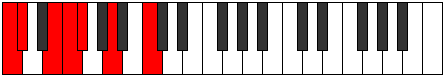 | [midi](https://github.com/edipermadi/music/blob/main/docs/ModeCNaturalMogimic.mid?raw=true) |
| [629](https://ianring.com/musictheory/scales/629) | [Palimic](ScalePalimic.md) | [Aeronimic](ModeAeronimic.md) | **C**, D, **E**, F, **Gb**, A, **C** |  | [midi](https://github.com/edipermadi/music/blob/main/docs/ModeCNaturalAeronimic.mid?raw=true) |
| [631](https://ianring.com/musictheory/scales/631) | [Stalian](ScaleStalian.md) | [Zygian](ModeZygian.md) | **C**, **Db**, Ebb, **Fb**, Gbb, Abbb, Bbb, **C** |  | [midi](https://github.com/edipermadi/music/blob/main/docs/ModeCNaturalZygian.mid?raw=true) |
| [633](https://ianring.com/musictheory/scales/633) | [Epynimic](ScaleEpynimic.md) | [Kydimic](ModeKydimic.md) | **C**, **D#**, **E**, F, **Gb**, A, **C** |  | [midi](https://github.com/edipermadi/music/blob/main/docs/ModeCNaturalKydimic.mid?raw=true) |
| [635](https://ianring.com/musictheory/scales/635) | [Epagian](ScaleEpagian.md) | [Epolian](ModeEpolian.md) | **C**, **Db**, **Eb**, **Fb**, Gbb, Abbb, Bbb, **C** |  | [midi](https://github.com/edipermadi/music/blob/main/docs/ModeCNaturalEpolian.mid?raw=true) |
| [637](https://ianring.com/musictheory/scales/637) | [Bonian](ScaleBonian.md) | [Katodian](ModeKatodian.md) | **C**, D, **Eb**, **Fb**, Gbb, **Abbb**, Bbb, **C** |  | [midi](https://github.com/edipermadi/music/blob/main/docs/ModeCNaturalKatodian.mid?raw=true) |
| [639](https://ianring.com/musictheory/scales/639) | [Zaryllic](ScaleZaryllic.md) | [Ionaryllic](ModeIonaryllic.md) | **C**, **C#**, D, **D#**, **E**, F, F#, A, **C** |  | [midi](https://github.com/edipermadi/music/blob/main/docs/ModeCNaturalIonaryllic.mid?raw=true) |
| [649](https://ianring.com/musictheory/scales/649) | [Saric](ScaleSaric.md) | [Byptic](ModeByptic.md) | C, **D#**, **G**, **A**, C |  | [midi](https://github.com/edipermadi/music/blob/main/docs/ModeCNaturalByptic.mid?raw=true) |
| [651](https://ianring.com/musictheory/scales/651) | [Phronitonic](ScalePhronitonic.md) | [Golitonic](ModeGolitonic.md) | C, **C#**, **D#**, **G**, **A**, C |  | [midi](https://github.com/edipermadi/music/blob/main/docs/ModeCNaturalGolitonic.mid?raw=true) |
| [653](https://ianring.com/musictheory/scales/653) | [Gathitonic](ScaleGathitonic.md) | [Stathitonic](ModeStathitonic.md) | C, D, **D#**, G, **A**, C |  | [midi](https://github.com/edipermadi/music/blob/main/docs/ModeCNaturalStathitonic.mid?raw=true) |
| [655](https://ianring.com/musictheory/scales/655) | [Stalimic](ScaleStalimic.md) | [Kataptimic](ModeKataptimic.md) | C, **Db**, Ebb, **Fbb**, G, **A**, C |  | [midi](https://github.com/edipermadi/music/blob/main/docs/ModeCNaturalKataptimic.mid?raw=true) |
| [657](https://ianring.com/musictheory/scales/657) | [Epathic](ScaleEpathic.md) | [Epathic](ModeEpathic.md) | C, **E**, **G**, A, C |  | [midi](https://github.com/edipermadi/music/blob/main/docs/ModeCNaturalEpathic.mid?raw=true) |
| [659](https://ianring.com/musictheory/scales/659) | [Thoditonic](ScaleThoditonic.md) | [Soptitonic](ModeSoptitonic.md) | C, **C#**, **E**, **G**, A, C |  | [midi](https://github.com/edipermadi/music/blob/main/docs/ModeCNaturalSoptitonic.mid?raw=true) |
| [661](https://ianring.com/musictheory/scales/661) | [Epathitonic](ScaleEpathitonic.md) | [Pentatonic](ModePentatonic.md) | C, D, **E**, G, A, C |  | [midi](https://github.com/edipermadi/music/blob/main/docs/ModeCNaturalPentatonic.mid?raw=true) |
| [663](https://ianring.com/musictheory/scales/663) | [Ionacrimic](ScaleIonacrimic.md) | [Phrynimic](ModePhrynimic.md) | C, **Db**, Ebb, **Fb**, G, A, C |  | [midi](https://github.com/edipermadi/music/blob/main/docs/ModeCNaturalPhrynimic.mid?raw=true) |
| [665](https://ianring.com/musictheory/scales/665) | [Lyditonic](ScaleLyditonic.md) | [Mythitonic](ModeMythitonic.md) | C, **D#**, **E**, **G**, A, C |  | [midi](https://github.com/edipermadi/music/blob/main/docs/ModeCNaturalMythitonic.mid?raw=true) |
| [667](https://ianring.com/musictheory/scales/667) | [Stythimic](ScaleStythimic.md) | [Rodimic](ModeRodimic.md) | C, **Db**, **Eb**, **Fb**, **G**, A, C |  | [midi](https://github.com/edipermadi/music/blob/main/docs/ModeCNaturalRodimic.mid?raw=true) |
| [669](https://ianring.com/musictheory/scales/669) | [Mixolimic](ScaleMixolimic.md) | [Gycrimic](ModeGycrimic.md) | C, D, **Eb**, **Fb**, G, A, C |  | [midi](https://github.com/edipermadi/music/blob/main/docs/ModeCNaturalGycrimic.mid?raw=true) |
| [671](https://ianring.com/musictheory/scales/671) | [Morian](ScaleMorian.md) | [Stycrian](ModeStycrian.md) | C, **Db**, Ebb, **Fbb**, **Gbbb**, Abb, Bbb, C |  | [midi](https://github.com/edipermadi/music/blob/main/docs/ModeCNaturalStycrian.mid?raw=true) |
| [675](https://ianring.com/musictheory/scales/675) | [Aeolanitonic](ScaleAeolanitonic.md) | [Zyditonic](ModeZyditonic.md) | C, **C#**, F, **G**, **A**, C |  | [midi](https://github.com/edipermadi/music/blob/main/docs/ModeCNaturalZyditonic.mid?raw=true) |
| [677](https://ianring.com/musictheory/scales/677) | [Epathitonic](ScaleEpathitonic.md) | [Mynitonic](ModeMynitonic.md) | C, D, F, G, **A**, C |  | [midi](https://github.com/edipermadi/music/blob/main/docs/ModeCNaturalMynitonic.mid?raw=true) |
| [679](https://ianring.com/musictheory/scales/679) | [Dalimic](ScaleDalimic.md) | [Lanimic](ModeLanimic.md) | C, **Db**, Ebb, F, G, **A**, C |  | [midi](https://github.com/edipermadi/music/blob/main/docs/ModeCNaturalLanimic.mid?raw=true) |
| [681](https://ianring.com/musictheory/scales/681) | [Kataritonic](ScaleKataritonic.md) | [Sylitonic](ModeSylitonic.md) | C, **D#**, F, **G**, **A**, C |  | [midi](https://github.com/edipermadi/music/blob/main/docs/ModeCNaturalSylitonic.mid?raw=true) |
| [683](https://ianring.com/musictheory/scales/683) | [Boptimic](ScaleBoptimic.md) | [Stogimic](ModeStogimic.md) | C, **Db**, **Eb**, F, **G**, **A**, C |  | [midi](https://github.com/edipermadi/music/blob/main/docs/ModeCNaturalStogimic.mid?raw=true) |
| [685](https://ianring.com/musictheory/scales/685) | [Phracrimic](ScalePhracrimic.md) | [Aerathimic](ModeAerathimic.md) | C, D, **Eb**, F, G, **A**, C |  | [midi](https://github.com/edipermadi/music/blob/main/docs/ModeCNaturalAerathimic.mid?raw=true) |
| [687](https://ianring.com/musictheory/scales/687) | [Pagian](ScalePagian.md) | [Aeolythian](ModeAeolythian.md) | C, **Db**, Ebb, **Fbb**, Gbb, Abb, **Bbb**, C |  | [midi](https://github.com/edipermadi/music/blob/main/docs/ModeCNaturalAeolythian.mid?raw=true) |
| [689](https://ianring.com/musictheory/scales/689) | [Lothitonic](ScaleLothitonic.md) | [Lothitonic](ModeLothitonic.md) | C, **E**, F, **G**, A, C |  | [midi](https://github.com/edipermadi/music/blob/main/docs/ModeCNaturalLothitonic.mid?raw=true) |
| [691](https://ianring.com/musictheory/scales/691) | [Dynimic](ScaleDynimic.md) | [Zydimic](ModeZydimic.md) | C, **Db**, **E**, F, **G**, A, C |  | [midi](https://github.com/edipermadi/music/blob/main/docs/ModeCNaturalZydimic.mid?raw=true) |
| [693](https://ianring.com/musictheory/scales/693) | [Epathimic](ScaleEpathimic.md) | [Mynimic](ModeMynimic.md) | C, D, **E**, F, G, A, C |  | [midi](https://github.com/edipermadi/music/blob/main/docs/ModeCNaturalMynimic.mid?raw=true) |
| [695](https://ianring.com/musictheory/scales/695) | [Aerathian](ScaleAerathian.md) | [Sarian](ModeSarian.md) | C, **Db**, Ebb, **Fb**, Gbb, Abb, Bbb, C |  | [midi](https://github.com/edipermadi/music/blob/main/docs/ModeCNaturalSarian.mid?raw=true) |
| [697](https://ianring.com/musictheory/scales/697) | [Zagimic](ScaleZagimic.md) | [Lagimic](ModeLagimic.md) | C, **D#**, **E**, F, **G**, A, C | 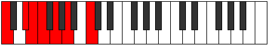 | [midi](https://github.com/edipermadi/music/blob/main/docs/ModeCNaturalLagimic.mid?raw=true) |
| [699](https://ianring.com/musictheory/scales/699) | [Ionanian](ScaleIonanian.md) | [Aerothian](ModeAerothian.md) | C, **Db**, **Eb**, **Fb**, Gbb, **Abb**, Bbb, C |  | [midi](https://github.com/edipermadi/music/blob/main/docs/ModeCNaturalAerothian.mid?raw=true) |
| [701](https://ianring.com/musictheory/scales/701) | [Stathian](ScaleStathian.md) | [Mixonyphian](ModeMixonyphian.md) | C, D, **Eb**, **Fb**, Gbb, Abb, Bbb, C |  | [midi](https://github.com/edipermadi/music/blob/main/docs/ModeCNaturalMixonyphian.mid?raw=true) |
| [703](https://ianring.com/musictheory/scales/703) | [Kataryllic](ScaleKataryllic.md) | [Aerocryllic](ModeAerocryllic.md) | C, **C#**, D, **D#**, **E**, F, G, A, C |  | [midi](https://github.com/edipermadi/music/blob/main/docs/ModeCNaturalAerocryllic.mid?raw=true) |
| [709](https://ianring.com/musictheory/scales/709) | [Aeracritonic](ScaleAeracritonic.md) | [Ionycritonic](ModeIonycritonic.md) | C, D, **F#**, G, **A**, C | 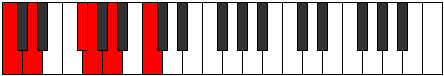 | [midi](https://github.com/edipermadi/music/blob/main/docs/ModeCNaturalIonycritonic.mid?raw=true) |
| [711](https://ianring.com/musictheory/scales/711) | [Epygimic](ScaleEpygimic.md) | [Epyrimic](ModeEpyrimic.md) | C, **Db**, Ebb, F#, G, **A**, C |  | [midi](https://github.com/edipermadi/music/blob/main/docs/ModeCNaturalEpyrimic.mid?raw=true) |
| [713](https://ianring.com/musictheory/scales/713) | [Thyritonic](ScaleThyritonic.md) | [Thoptitonic](ModeThoptitonic.md) | C, **D#**, **F#**, **G**, **A**, C |  | [midi](https://github.com/edipermadi/music/blob/main/docs/ModeCNaturalThoptitonic.mid?raw=true) |
| [715](https://ianring.com/musictheory/scales/715) | [Lythimic](ScaleLythimic.md) | [Dodimic](ModeDodimic.md) | C, **Db**, **Eb**, F#, **G**, **A**, C |  | [midi](https://github.com/edipermadi/music/blob/main/docs/ModeCNaturalDodimic.mid?raw=true) |
| [717](https://ianring.com/musictheory/scales/717) | [Bocrimic](ScaleBocrimic.md) | [Gythimic](ModeGythimic.md) | C, D, **Eb**, **F#**, G, **A**, C |  | [midi](https://github.com/edipermadi/music/blob/main/docs/ModeCNaturalGythimic.mid?raw=true) |
| [719](https://ianring.com/musictheory/scales/719) | [Ranian](ScaleRanian.md) | [Kanian](ModeKanian.md) | C, **Db**, Ebb, **Fbb**, Gb, Abb, **Bbb**, C |  | [midi](https://github.com/edipermadi/music/blob/main/docs/ModeCNaturalKanian.mid?raw=true) |
| [721](https://ianring.com/musictheory/scales/721) | [Aeolacritonic](ScaleAeolacritonic.md) | [Aeolacritonic](ModeAeolacritonic.md) | C, **E**, **F#**, **G**, A, C |  | [midi](https://github.com/edipermadi/music/blob/main/docs/ModeCNaturalAeolacritonic.mid?raw=true) |
| [723](https://ianring.com/musictheory/scales/723) | [Zacrimic](ScaleZacrimic.md) | [Ionadimic](ModeIonadimic.md) | C, **Db**, **E**, F#, **G**, A, C |  | [midi](https://github.com/edipermadi/music/blob/main/docs/ModeCNaturalIonadimic.mid?raw=true) |
| [725](https://ianring.com/musictheory/scales/725) | [Darmic](ScaleDarmic.md) | [Lonimic](ModeLonimic.md) | C, D, **E**, **F#**, G, A, C |  | [midi](https://github.com/edipermadi/music/blob/main/docs/ModeCNaturalLonimic.mid?raw=true) |
| [727](https://ianring.com/musictheory/scales/727) | [Ionycrian](ScaleIonycrian.md) | [Phradian](ModePhradian.md) | C, **Db**, Ebb, **Fb**, Gb, Abb, Bbb, C |  | [midi](https://github.com/edipermadi/music/blob/main/docs/ModeCNaturalPhradian.mid?raw=true) |
| [729](https://ianring.com/musictheory/scales/729) | [Thalimic](ScaleThalimic.md) | [Stygimic](ModeStygimic.md) | C, **D#**, **E**, **F#**, **G**, A, C |  | [midi](https://github.com/edipermadi/music/blob/main/docs/ModeCNaturalStygimic.mid?raw=true) |
| [731](https://ianring.com/musictheory/scales/731) | [Mycrian](ScaleMycrian.md) | [Ionorian](ModeIonorian.md) | C, **Db**, **Eb**, **Fb**, Gb, **Abb**, Bbb, C |  | [midi](https://github.com/edipermadi/music/blob/main/docs/ModeCNaturalIonorian.mid?raw=true) |
| [733](https://ianring.com/musictheory/scales/733) | [Rythian](ScaleRythian.md) | [Donian](ModeDonian.md) | C, D, **Eb**, **Fb**, **Gb**, Abb, Bbb, C |  | [midi](https://github.com/edipermadi/music/blob/main/docs/ModeCNaturalDonian.mid?raw=true) |
| [735](https://ianring.com/musictheory/scales/735) | [Tharyllic](ScaleTharyllic.md) | [Sylyllic](ModeSylyllic.md) | C, **C#**, D, **D#**, **E**, F#, G, A, C |  | [midi](https://github.com/edipermadi/music/blob/main/docs/ModeCNaturalSylyllic.mid?raw=true) |
| [739](https://ianring.com/musictheory/scales/739) | [Kanimic](ScaleKanimic.md) | [Rorimic](ModeRorimic.md) | C, **Db**, E#, F#, **G**, **A**, C |  | [midi](https://github.com/edipermadi/music/blob/main/docs/ModeCNaturalRorimic.mid?raw=true) |
| [741](https://ianring.com/musictheory/scales/741) | [Ionacrimic](ScaleIonacrimic.md) | [Gathimic](ModeGathimic.md) | C, D, E#, **F#**, G, **A**, C |  | [midi](https://github.com/edipermadi/music/blob/main/docs/ModeCNaturalGathimic.mid?raw=true) |
| [743](https://ianring.com/musictheory/scales/743) | [Epogian](ScaleEpogian.md) | [Lanian](ModeLanian.md) | C, **Db**, Ebb, F, Gb, Abb, **Bbb**, C |  | [midi](https://github.com/edipermadi/music/blob/main/docs/ModeCNaturalLanian.mid?raw=true) |
| [745](https://ianring.com/musictheory/scales/745) | [Thagimic](ScaleThagimic.md) | [Kolimic](ModeKolimic.md) | C, **D#**, E#, **F#**, **G**, **A**, C |  | [midi](https://github.com/edipermadi/music/blob/main/docs/ModeCNaturalKolimic.mid?raw=true) |
| [747](https://ianring.com/musictheory/scales/747) | [Korian](ScaleKorian.md) | [Lynian](ModeLynian.md) | C, **Db**, **Eb**, F, Gb, **Abb**, **Bbb**, C |  | [midi](https://github.com/edipermadi/music/blob/main/docs/ModeCNaturalLynian.mid?raw=true) |
| [749](https://ianring.com/musictheory/scales/749) | [Ionopian](ScaleIonopian.md) | [Aeologian](ModeAeologian.md) | C, D, **Eb**, F, **Gb**, Abb, **Bbb**, C |  | [midi](https://github.com/edipermadi/music/blob/main/docs/ModeCNaturalAeologian.mid?raw=true) |
| [751](https://ianring.com/musictheory/scales/751) | [Zagyllic](ScaleZagyllic.md) | [Epacryllic](ModeEpacryllic.md) | C, **C#**, D, **D#**, F, F#, G, **A**, C |  | [midi](https://github.com/edipermadi/music/blob/main/docs/ModeCNaturalEpacryllic.mid?raw=true) |
| [753](https://ianring.com/musictheory/scales/753) | [Kytrimic](ScaleKytrimic.md) | [Kytrimic](ModeKytrimic.md) | C, **D##**, E#, **F#**, **G**, A, C | 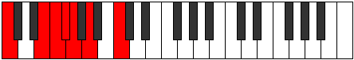 | [midi](https://github.com/edipermadi/music/blob/main/docs/ModeCNaturalKytrimic.mid?raw=true) |
| [755](https://ianring.com/musictheory/scales/755) | [Zarian](ScaleZarian.md) | [Phrythian](ModePhrythian.md) | C, **Db**, **E**, F, Gb, **Abb**, Bbb, C |  | [midi](https://github.com/edipermadi/music/blob/main/docs/ModeCNaturalPhrythian.mid?raw=true) |
| [757](https://ianring.com/musictheory/scales/757) | [Soptian](ScaleSoptian.md) | [Ionyptian](ModeIonyptian.md) | C, D, **E**, F, **Gb**, Abb, Bbb, C |  | [midi](https://github.com/edipermadi/music/blob/main/docs/ModeCNaturalIonyptian.mid?raw=true) |
| [759](https://ianring.com/musictheory/scales/759) | [Dagyllic](ScaleDagyllic.md) | [Katalyllic](ModeKatalyllic.md) | C, **C#**, D, **E**, F, F#, G, A, C |  | [midi](https://github.com/edipermadi/music/blob/main/docs/ModeCNaturalKatalyllic.mid?raw=true) |
| [761](https://ianring.com/musictheory/scales/761) | [Katoptian](ScaleKatoptian.md) | [Ponian](ModePonian.md) | C, **D#**, **E**, F, **Gb**, **Abb**, Bbb, C |  | [midi](https://github.com/edipermadi/music/blob/main/docs/ModeCNaturalPonian.mid?raw=true) |
| [763](https://ianring.com/musictheory/scales/763) | [Stacryllic](ScaleStacryllic.md) | [Doryllic](ModeDoryllic.md) | C, **C#**, **D#**, **E**, F, F#, **G**, A, C | 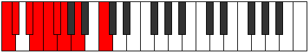 | [midi](https://github.com/edipermadi/music/blob/main/docs/ModeCNaturalDoryllic.mid?raw=true) |
| [765](https://ianring.com/musictheory/scales/765) | [Mixolydyllic](ScaleMixolydyllic.md) | [Mixonyphyllic](ModeMixonyphyllic.md) | C, D, **D#**, **E**, F, **F#**, G, A, C |  | [midi](https://github.com/edipermadi/music/blob/main/docs/ModeCNaturalMixonyphyllic.mid?raw=true) |
| [767](https://ianring.com/musictheory/scales/767) | [Aeolacrygic](ScaleAeolacrygic.md) | [Raptygic](ModeRaptygic.md) | C, **C#**, D, **D#**, **E**, F, F#, G, A, C |  | [midi](https://github.com/edipermadi/music/blob/main/docs/ModeCNaturalRaptygic.mid?raw=true) |
| [785](https://ianring.com/musictheory/scales/785) | [Aeoloric](ScaleAeoloric.md) | [Aeoloric](ModeAeoloric.md) | **C**, **E**, **G#**, A, **C** |  | [midi](https://github.com/edipermadi/music/blob/main/docs/ModeCNaturalAeoloric.mid?raw=true) |
| [787](https://ianring.com/musictheory/scales/787) | [Zothitonic](ScaleZothitonic.md) | [Aeolapritonic](ModeAeolapritonic.md) | **C**, C#, **E**, **G#**, A, **C** |  | [midi](https://github.com/edipermadi/music/blob/main/docs/ModeCNaturalAeolapritonic.mid?raw=true) |
| [789](https://ianring.com/musictheory/scales/789) | [Epygitonic](ScaleEpygitonic.md) | [Zogitonic](ModeZogitonic.md) | **C**, D, **E**, **G#**, A, **C** |  | [midi](https://github.com/edipermadi/music/blob/main/docs/ModeCNaturalZogitonic.mid?raw=true) |
| [791](https://ianring.com/musictheory/scales/791) | [Thogimic](ScaleThogimic.md) | [Aeoloptimic](ModeAeoloptimic.md) | **C**, Db, Ebb, **Fb**, **G#**, A, **C** |  | [midi](https://github.com/edipermadi/music/blob/main/docs/ModeCNaturalAeoloptimic.mid?raw=true) |
| [793](https://ianring.com/musictheory/scales/793) | [Lycritonic](ScaleLycritonic.md) | [Mocritonic](ModeMocritonic.md) | **C**, **D#**, **E**, G#, A, **C** |  | [midi](https://github.com/edipermadi/music/blob/main/docs/ModeCNaturalMocritonic.mid?raw=true) |
| [795](https://ianring.com/musictheory/scales/795) | [Solimic](ScaleSolimic.md) | [Aeologimic](ModeAeologimic.md) | **C**, Db, **Eb**, **Fb**, G#, A, **C** |  | [midi](https://github.com/edipermadi/music/blob/main/docs/ModeCNaturalAeologimic.mid?raw=true) |
| [797](https://ianring.com/musictheory/scales/797) | [Phralimic](ScalePhralimic.md) | [Katocrimic](ModeKatocrimic.md) | **C**, D, **Eb**, **Fb**, G#, A, **C** |  | [midi](https://github.com/edipermadi/music/blob/main/docs/ModeCNaturalKatocrimic.mid?raw=true) |
| [799](https://ianring.com/musictheory/scales/799) | [Parian](ScaleParian.md) | [Lolian](ModeLolian.md) | **C**, Db, Ebb, **Fbb**, **Gbbb**, Ab, Bbb, **C** |  | [midi](https://github.com/edipermadi/music/blob/main/docs/ModeCNaturalLolian.mid?raw=true) |
| [803](https://ianring.com/musictheory/scales/803) | [Zacritonic](ScaleZacritonic.md) | [Loritonic](ModeLoritonic.md) | **C**, C#, F, **G#**, **A**, **C** |  | [midi](https://github.com/edipermadi/music/blob/main/docs/ModeCNaturalLoritonic.mid?raw=true) |
| [805](https://ianring.com/musictheory/scales/805) | [Lyditonic](ScaleLyditonic.md) | [Rothitonic](ModeRothitonic.md) | **C**, D, F, **G#**, **A**, **C** |  | [midi](https://github.com/edipermadi/music/blob/main/docs/ModeCNaturalRothitonic.mid?raw=true) |
| [807](https://ianring.com/musictheory/scales/807) | [Ionodimic](ScaleIonodimic.md) | [Epadimic](ModeEpadimic.md) | **C**, Db, Ebb, F, **G#**, **A**, **C** |  | [midi](https://github.com/edipermadi/music/blob/main/docs/ModeCNaturalEpadimic.mid?raw=true) |
| [809](https://ianring.com/musictheory/scales/809) | [Thoditonic](ScaleThoditonic.md) | [Dogitonic](ModeDogitonic.md) | **C**, **D#**, F, G#, **A**, **C** |  | [midi](https://github.com/edipermadi/music/blob/main/docs/ModeCNaturalDogitonic.mid?raw=true) |
| [811](https://ianring.com/musictheory/scales/811) | [Dynimic](ScaleDynimic.md) | [Radimic](ModeRadimic.md) | **C**, Db, **Eb**, F, G#, **A**, **C** |  | [midi](https://github.com/edipermadi/music/blob/main/docs/ModeCNaturalRadimic.mid?raw=true) |
| [813](https://ianring.com/musictheory/scales/813) | [Zacrimic](ScaleZacrimic.md) | [Larimic](ModeLarimic.md) | **C**, D, **Eb**, F, G#, **A**, **C** |  | [midi](https://github.com/edipermadi/music/blob/main/docs/ModeCNaturalLarimic.mid?raw=true) |
| [815](https://ianring.com/musictheory/scales/815) | [Zarian](ScaleZarian.md) | [Bolian](ModeBolian.md) | **C**, Db, Ebb, **Fbb**, Gbb, Ab, **Bbb**, **C** |  | [midi](https://github.com/edipermadi/music/blob/main/docs/ModeCNaturalBolian.mid?raw=true) |
| [817](https://ianring.com/musictheory/scales/817) | [Zothitonic](ScaleZothitonic.md) | [Zothitonic](ModeZothitonic.md) | **C**, **E**, F, **G#**, A, **C** |  | [midi](https://github.com/edipermadi/music/blob/main/docs/ModeCNaturalZothitonic.mid?raw=true) |
| [819](https://ianring.com/musictheory/scales/819) | [Ionythimic](ScaleIonythimic.md) | [Aerythimic](ModeAerythimic.md) | **C**, Db, **E**, F, **G#**, A, **C** |  | [midi](https://github.com/edipermadi/music/blob/main/docs/ModeCNaturalAerythimic.mid?raw=true) |
| [821](https://ianring.com/musictheory/scales/821) | [Mothimic](ScaleMothimic.md) | [Aeranimic](ModeAeranimic.md) | **C**, D, **E**, F, **G#**, A, **C** |  | [midi](https://github.com/edipermadi/music/blob/main/docs/ModeCNaturalAeranimic.mid?raw=true) |
| [823](https://ianring.com/musictheory/scales/823) | [Tholian](ScaleTholian.md) | [Stodian](ModeStodian.md) | **C**, Db, Ebb, **Fb**, Gbb, **Ab**, Bbb, **C** |  | [midi](https://github.com/edipermadi/music/blob/main/docs/ModeCNaturalStodian.mid?raw=true) |
| [825](https://ianring.com/musictheory/scales/825) | [Mydimic](ScaleMydimic.md) | [Thyptimic](ModeThyptimic.md) | **C**, **D#**, **E**, F, G#, A, **C** |  | [midi](https://github.com/edipermadi/music/blob/main/docs/ModeCNaturalThyptimic.mid?raw=true) |
| [827](https://ianring.com/musictheory/scales/827) | [Katathian](ScaleKatathian.md) | [Mixolocrian](ModeMixolocrian.md) | **C**, Db, **Eb**, **Fb**, Gbb, Ab, Bbb, **C** |  | [midi](https://github.com/edipermadi/music/blob/main/docs/ModeCNaturalMixolocrian.mid?raw=true) |
| [829](https://ianring.com/musictheory/scales/829) | [Laptian](ScaleLaptian.md) | [Lygian](ModeLygian.md) | **C**, D, **Eb**, **Fb**, Gbb, Ab, Bbb, **C** |  | [midi](https://github.com/edipermadi/music/blob/main/docs/ModeCNaturalLygian.mid?raw=true) |
| [831](https://ianring.com/musictheory/scales/831) | [Ioniptyllic](ScaleIoniptyllic.md) | [Rodyllic](ModeRodyllic.md) | **C**, C#, D, **D#**, **E**, F, G#, A, **C** | 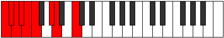 | [midi](https://github.com/edipermadi/music/blob/main/docs/ModeCNaturalRodyllic.mid?raw=true) |
| [837](https://ianring.com/musictheory/scales/837) | [Ionoditonic](ScaleIonoditonic.md) | [Epaditonic](ModeEpaditonic.md) | **C**, D, **F#**, **G#**, **A**, **C** |  | [midi](https://github.com/edipermadi/music/blob/main/docs/ModeCNaturalEpaditonic.mid?raw=true) |
| [839](https://ianring.com/musictheory/scales/839) | [Katythimic](ScaleKatythimic.md) | [Ionathimic](ModeIonathimic.md) | **C**, Db, Ebb, F#, **G#**, **A**, **C** |  | [midi](https://github.com/edipermadi/music/blob/main/docs/ModeCNaturalIonathimic.mid?raw=true) |
| [841](https://ianring.com/musictheory/scales/841) | [Mixitonic](ScaleMixitonic.md) | [Phrothitonic](ModePhrothitonic.md) | **C**, **D#**, **F#**, G#, **A**, **C** | 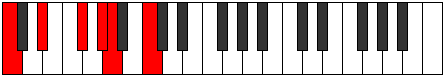 | [midi](https://github.com/edipermadi/music/blob/main/docs/ModeCNaturalPhrothitonic.mid?raw=true) |
| [843](https://ianring.com/musictheory/scales/843) | [Bocrimic](ScaleBocrimic.md) | [Molimic](ModeMolimic.md) | **C**, Db, **Eb**, F#, G#, **A**, **C** |  | [midi](https://github.com/edipermadi/music/blob/main/docs/ModeCNaturalMolimic.mid?raw=true) |
| [845](https://ianring.com/musictheory/scales/845) | [Aeradimic](ScaleAeradimic.md) | [Zyrimic](ModeZyrimic.md) | **C**, D, **Eb**, **F#**, G#, **A**, **C** |  | [midi](https://github.com/edipermadi/music/blob/main/docs/ModeCNaturalZyrimic.mid?raw=true) |
| [847](https://ianring.com/musictheory/scales/847) | [Katocrian](ScaleKatocrian.md) | [Ganian](ModeGanian.md) | **C**, Db, Ebb, **Fbb**, Gb, Ab, **Bbb**, **C** |  | [midi](https://github.com/edipermadi/music/blob/main/docs/ModeCNaturalGanian.mid?raw=true) |
| [849](https://ianring.com/musictheory/scales/849) | [Aerynitonic](ScaleAerynitonic.md) | [Aerynitonic](ModeAerynitonic.md) | **C**, **E**, **F#**, **G#**, A, **C** |  | [midi](https://github.com/edipermadi/music/blob/main/docs/ModeCNaturalAerynitonic.mid?raw=true) |
| [851](https://ianring.com/musictheory/scales/851) | [Mothimic](ScaleMothimic.md) | [Aerylimic](ModeAerylimic.md) | **C**, Db, **E**, F#, **G#**, A, **C** |  | [midi](https://github.com/edipermadi/music/blob/main/docs/ModeCNaturalAerylimic.mid?raw=true) |
| [853](https://ianring.com/musictheory/scales/853) | [Aeragimic](ScaleAeragimic.md) | [Epothimic](ModeEpothimic.md) | **C**, D, **E**, **F#**, **G#**, A, **C** |  | [midi](https://github.com/edipermadi/music/blob/main/docs/ModeCNaturalEpothimic.mid?raw=true) |
| [855](https://ianring.com/musictheory/scales/855) | [Dolian](ScaleDolian.md) | [Porian](ModePorian.md) | **C**, Db, Ebb, **Fb**, Gb, **Ab**, Bbb, **C** |  | [midi](https://github.com/edipermadi/music/blob/main/docs/ModeCNaturalPorian.mid?raw=true) |
| [857](https://ianring.com/musictheory/scales/857) | [Dagimic](ScaleDagimic.md) | [Aeolydimic](ModeAeolydimic.md) | **C**, **D#**, **E**, **F#**, G#, A, **C** |  | [midi](https://github.com/edipermadi/music/blob/main/docs/ModeCNaturalAeolydimic.mid?raw=true) |
| [859](https://ianring.com/musictheory/scales/859) | [Bycrian](ScaleBycrian.md) | [Pathian](ModePathian.md) | **C**, Db, **Eb**, **Fb**, Gb, Ab, Bbb, **C** |  | [midi](https://github.com/edipermadi/music/blob/main/docs/ModeCNaturalPathian.mid?raw=true) |
| [861](https://ianring.com/musictheory/scales/861) | [Eporian](ScaleEporian.md) | [Rylian](ModeRylian.md) | **C**, D, **Eb**, **Fb**, **Gb**, Ab, Bbb, **C** |  | [midi](https://github.com/edipermadi/music/blob/main/docs/ModeCNaturalRylian.mid?raw=true) |
| [863](https://ianring.com/musictheory/scales/863) | [Gythyllic](ScaleGythyllic.md) | [Pyryllic](ModePyryllic.md) | **C**, C#, D, **D#**, **E**, F#, G#, A, **C** |  | [midi](https://github.com/edipermadi/music/blob/main/docs/ModeCNaturalPyryllic.mid?raw=true) |
| [867](https://ianring.com/musictheory/scales/867) | [Laptimic](ScaleLaptimic.md) | [Phrocrimic](ModePhrocrimic.md) | **C**, Db, E#, F#, **G#**, **A**, **C** |  | [midi](https://github.com/edipermadi/music/blob/main/docs/ModeCNaturalPhrocrimic.mid?raw=true) |
| [869](https://ianring.com/musictheory/scales/869) | [Stythimic](ScaleStythimic.md) | [Kothimic](ModeKothimic.md) | **C**, D, E#, **F#**, **G#**, **A**, **C** |  | [midi](https://github.com/edipermadi/music/blob/main/docs/ModeCNaturalKothimic.mid?raw=true) |
| [871](https://ianring.com/musictheory/scales/871) | [Loptian](ScaleLoptian.md) | [Epadian](ModeEpadian.md) | **C**, Db, Ebb, F, Gb, **Ab**, **Bbb**, **C** |  | [midi](https://github.com/edipermadi/music/blob/main/docs/ModeCNaturalEpadian.mid?raw=true) |
| [873](https://ianring.com/musictheory/scales/873) | [Thoptimic](ScaleThoptimic.md) | [Bagimic](ModeBagimic.md) | **C**, **D#**, E#, **F#**, G#, **A**, **C** |  | [midi](https://github.com/edipermadi/music/blob/main/docs/ModeCNaturalBagimic.mid?raw=true) |
| [875](https://ianring.com/musictheory/scales/875) | [Palian](ScalePalian.md) | [Stothian](ModeStothian.md) | **C**, Db, **Eb**, F, Gb, Ab, **Bbb**, **C** |  | [midi](https://github.com/edipermadi/music/blob/main/docs/ModeCNaturalStothian.mid?raw=true) |
| [877](https://ianring.com/musictheory/scales/877) | [Pogian](ScalePogian.md) | [Aeraptian](ModeAeraptian.md) | **C**, D, **Eb**, F, **Gb**, Ab, **Bbb**, **C** |  | [midi](https://github.com/edipermadi/music/blob/main/docs/ModeCNaturalAeraptian.mid?raw=true) |
| [879](https://ianring.com/musictheory/scales/879) | [Aeolathyllic](ScaleAeolathyllic.md) | [Aeolocryllic](ModeAeolocryllic.md) | **C**, C#, D, **D#**, F, F#, G#, **A**, **C** |  | [midi](https://github.com/edipermadi/music/blob/main/docs/ModeCNaturalAeolocryllic.mid?raw=true) |
| [881](https://ianring.com/musictheory/scales/881) | [Aerothimic](ScaleAerothimic.md) | [Aerothimic](ModeAerothimic.md) | **C**, **D##**, E#, **F#**, **G#**, A, **C** |  | [midi](https://github.com/edipermadi/music/blob/main/docs/ModeCNaturalAerothimic.mid?raw=true) |
| [883](https://ianring.com/musictheory/scales/883) | [Tholian](ScaleTholian.md) | [Ralian](ModeRalian.md) | **C**, Db, **E**, F, Gb, **Ab**, Bbb, **C** |  | [midi](https://github.com/edipermadi/music/blob/main/docs/ModeCNaturalRalian.mid?raw=true) |
| [885](https://ianring.com/musictheory/scales/885) | [Epacrian](ScaleEpacrian.md) | [Sathian](ModeSathian.md) | **C**, D, **E**, F, **Gb**, **Ab**, Bbb, **C** |  | [midi](https://github.com/edipermadi/music/blob/main/docs/ModeCNaturalSathian.mid?raw=true) |
| [887](https://ianring.com/musictheory/scales/887) | [Lonyllic](ScaleLonyllic.md) | [Sathyllic](ModeSathyllic.md) | **C**, C#, D, **E**, F, F#, **G#**, A, **C** |  | [midi](https://github.com/edipermadi/music/blob/main/docs/ModeCNaturalSathyllic.mid?raw=true) |
| [889](https://ianring.com/musictheory/scales/889) | [Gacrian](ScaleGacrian.md) | [Borian](ModeBorian.md) | **C**, **D#**, **E**, F, **Gb**, Ab, Bbb, **C** |  | [midi](https://github.com/edipermadi/music/blob/main/docs/ModeCNaturalBorian.mid?raw=true) |
| [891](https://ianring.com/musictheory/scales/891) | [Doptyllic](ScaleDoptyllic.md) | [Ionilyllic](ModeIonilyllic.md) | **C**, C#, **D#**, **E**, F, F#, G#, A, **C** |  | [midi](https://github.com/edipermadi/music/blob/main/docs/ModeCNaturalIonilyllic.mid?raw=true) |
| [893](https://ianring.com/musictheory/scales/893) | [Aeronyllic](ScaleAeronyllic.md) | [Pycryllic](ModePycryllic.md) | **C**, D, **D#**, **E**, F, **F#**, G#, A, **C** |  | [midi](https://github.com/edipermadi/music/blob/main/docs/ModeCNaturalPycryllic.mid?raw=true) |
| [895](https://ianring.com/musictheory/scales/895) | [Zothygic](ScaleZothygic.md) | [Aeolathygic](ModeAeolathygic.md) | **C**, C#, D, **D#**, **E**, F, F#, G#, A, **C** |  | [midi](https://github.com/edipermadi/music/blob/main/docs/ModeCNaturalAeolathygic.mid?raw=true) |
| [905](https://ianring.com/musictheory/scales/905) | [Ionyptitonic](ScaleIonyptitonic.md) | [Bylitonic](ModeBylitonic.md) | C, **D#**, **G**, G#, **A**, C |  | [midi](https://github.com/edipermadi/music/blob/main/docs/ModeCNaturalBylitonic.mid?raw=true) |
| [907](https://ianring.com/musictheory/scales/907) | [Bolimic](ScaleBolimic.md) | [Tholimic](ModeTholimic.md) | C, Db, **Eb**, **F##**, G#, **A**, C |  | [midi](https://github.com/edipermadi/music/blob/main/docs/ModeCNaturalTholimic.mid?raw=true) |
| [909](https://ianring.com/musictheory/scales/909) | [Mythimic](ScaleMythimic.md) | [Katarimic](ModeKatarimic.md) | C, D, **Eb**, F##, G#, **A**, C |  | [midi](https://github.com/edipermadi/music/blob/main/docs/ModeCNaturalKatarimic.mid?raw=true) |
| [911](https://ianring.com/musictheory/scales/911) | [Ionarian](ScaleIonarian.md) | [Radian](ModeRadian.md) | C, Db, Ebb, **Fbb**, G, Ab, **Bbb**, C |  | [midi](https://github.com/edipermadi/music/blob/main/docs/ModeCNaturalRadian.mid?raw=true) |
| [913](https://ianring.com/musictheory/scales/913) | [Aeolyritonic](ScaleAeolyritonic.md) | [Aeolyritonic](ModeAeolyritonic.md) | C, **E**, **G**, **G#**, A, C |  | [midi](https://github.com/edipermadi/music/blob/main/docs/ModeCNaturalAeolyritonic.mid?raw=true) |
| [915](https://ianring.com/musictheory/scales/915) | [Mydimic](ScaleMydimic.md) | [Loptimic](ModeLoptimic.md) | C, Db, **E**, **F##**, **G#**, A, C |  | [midi](https://github.com/edipermadi/music/blob/main/docs/ModeCNaturalLoptimic.mid?raw=true) |
| [917](https://ianring.com/musictheory/scales/917) | [Dalimic](ScaleDalimic.md) | [Dygimic](ModeDygimic.md) | C, D, **E**, F##, **G#**, A, C |  | [midi](https://github.com/edipermadi/music/blob/main/docs/ModeCNaturalDygimic.mid?raw=true) |
| [919](https://ianring.com/musictheory/scales/919) | [Epogian](ScaleEpogian.md) | [Gathian](ModeGathian.md) | C, Db, Ebb, **Fb**, G, **Ab**, Bbb, C |  | [midi](https://github.com/edipermadi/music/blob/main/docs/ModeCNaturalGathian.mid?raw=true) |
| [921](https://ianring.com/musictheory/scales/921) | [Ionodimic](ScaleIonodimic.md) | [Bogimic](ModeBogimic.md) | C, **D#**, **E**, **F##**, G#, A, C |  | [midi](https://github.com/edipermadi/music/blob/main/docs/ModeCNaturalBogimic.mid?raw=true) |
| [923](https://ianring.com/musictheory/scales/923) | [Loptian](ScaleLoptian.md) | [Ionodian](ModeIonodian.md) | C, Db, **Eb**, **Fb**, **G**, Ab, Bbb, C |  | [midi](https://github.com/edipermadi/music/blob/main/docs/ModeCNaturalIonodian.mid?raw=true) |
| [925](https://ianring.com/musictheory/scales/925) | [Epathian](ScaleEpathian.md) | [Mythian](ModeMythian.md) | C, D, **Eb**, **Fb**, G, Ab, Bbb, C |  | [midi](https://github.com/edipermadi/music/blob/main/docs/ModeCNaturalMythian.mid?raw=true) |
| [927](https://ianring.com/musictheory/scales/927) | [Locryllic](ScaleLocryllic.md) | [Koptyllic](ModeKoptyllic.md) | C, C#, D, **D#**, **E**, G, G#, A, C |  | [midi](https://github.com/edipermadi/music/blob/main/docs/ModeCNaturalKoptyllic.mid?raw=true) |
| [931](https://ianring.com/musictheory/scales/931) | [Aerycrimic](ScaleAerycrimic.md) | [Bacrimic](ModeBacrimic.md) | C, Db, E#, **F##**, **G#**, **A**, C |  | [midi](https://github.com/edipermadi/music/blob/main/docs/ModeCNaturalBacrimic.mid?raw=true) |
| [933](https://ianring.com/musictheory/scales/933) | [Mixolimic](ScaleMixolimic.md) | [Dadimic](ModeDadimic.md) | C, D, E#, F##, **G#**, **A**, C |  | [midi](https://github.com/edipermadi/music/blob/main/docs/ModeCNaturalDadimic.mid?raw=true) |
| [935](https://ianring.com/musictheory/scales/935) | [Epathian](ScaleEpathian.md) | [Katarian](ModeKatarian.md) | C, Db, Ebb, F, G, **Ab**, **Bbb**, C |  | [midi](https://github.com/edipermadi/music/blob/main/docs/ModeCNaturalKatarian.mid?raw=true) |
| [937](https://ianring.com/musictheory/scales/937) | [Palimic](ScalePalimic.md) | [Stothimic](ModeStothimic.md) | C, **D#**, E#, **F##**, G#, **A**, C |  | [midi](https://github.com/edipermadi/music/blob/main/docs/ModeCNaturalStothimic.mid?raw=true) |
| [939](https://ianring.com/musictheory/scales/939) | [Golian](ScaleGolian.md) | [Dyptian](ModeDyptian.md) | C, Db, **Eb**, F, **G**, Ab, **Bbb**, C |  | [midi](https://github.com/edipermadi/music/blob/main/docs/ModeCNaturalDyptian.mid?raw=true) |
| [941](https://ianring.com/musictheory/scales/941) | [Thonian](ScaleThonian.md) | [Phrorian](ModePhrorian.md) | C, D, **Eb**, F, G, Ab, **Bbb**, C |  | [midi](https://github.com/edipermadi/music/blob/main/docs/ModeCNaturalPhrorian.mid?raw=true) |
| [943](https://ianring.com/musictheory/scales/943) | [Bacryllic](ScaleBacryllic.md) | [Aerygyllic](ModeAerygyllic.md) | C, C#, D, **D#**, F, G, G#, **A**, C |  | [midi](https://github.com/edipermadi/music/blob/main/docs/ModeCNaturalAerygyllic.mid?raw=true) |
| [945](https://ianring.com/musictheory/scales/945) | [Syrimic](ScaleSyrimic.md) | [Syrimic](ModeSyrimic.md) | C, **D##**, E#, **F##**, **G#**, A, C | 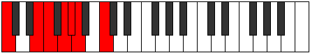 | [midi](https://github.com/edipermadi/music/blob/main/docs/ModeCNaturalSyrimic.mid?raw=true) |
| [947](https://ianring.com/musictheory/scales/947) | [Katathian](ScaleKatathian.md) | [Modian](ModeModian.md) | C, Db, **E**, F, **G**, **Ab**, Bbb, C |  | [midi](https://github.com/edipermadi/music/blob/main/docs/ModeCNaturalModian.mid?raw=true) |
| [949](https://ianring.com/musictheory/scales/949) | [Phrolian](ScalePhrolian.md) | [Ionagian](ModeIonagian.md) | C, D, **E**, F, G, **Ab**, Bbb, C |  | [midi](https://github.com/edipermadi/music/blob/main/docs/ModeCNaturalIonagian.mid?raw=true) |
| [951](https://ianring.com/musictheory/scales/951) | [Dydyllic](ScaleDydyllic.md) | [Thogyllic](ModeThogyllic.md) | C, C#, D, **E**, F, G, **G#**, A, C |  | [midi](https://github.com/edipermadi/music/blob/main/docs/ModeCNaturalThogyllic.mid?raw=true) |
| [953](https://ianring.com/musictheory/scales/953) | [Stalian](ScaleStalian.md) | [Stoptian](ModeStoptian.md) | C, **D#**, **E**, F, **G**, Ab, Bbb, C | 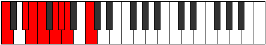 | [midi](https://github.com/edipermadi/music/blob/main/docs/ModeCNaturalStoptian.mid?raw=true) |
| [955](https://ianring.com/musictheory/scales/955) | [Thyptyllic](ScaleThyptyllic.md) | [Ionogyllic](ModeIonogyllic.md) | C, C#, **D#**, **E**, F, **G**, G#, A, C |  | [midi](https://github.com/edipermadi/music/blob/main/docs/ModeCNaturalIonogyllic.mid?raw=true) |
| [957](https://ianring.com/musictheory/scales/957) | [Pothyllic](ScalePothyllic.md) | [Phronyllic](ModePhronyllic.md) | C, D, **D#**, **E**, F, G, G#, A, C |  | [midi](https://github.com/edipermadi/music/blob/main/docs/ModeCNaturalPhronyllic.mid?raw=true) |
| [959](https://ianring.com/musictheory/scales/959) | [Loptygic](ScaleLoptygic.md) | [Katylygic](ModeKatylygic.md) | C, C#, D, **D#**, **E**, F, G, G#, A, C |  | [midi](https://github.com/edipermadi/music/blob/main/docs/ModeCNaturalKatylygic.mid?raw=true) |
| [965](https://ianring.com/musictheory/scales/965) | [Pynimic](ScalePynimic.md) | [Ionothimic](ModeIonothimic.md) | C, D, **E##**, F##, **G#**, **A**, C |  | [midi](https://github.com/edipermadi/music/blob/main/docs/ModeCNaturalIonothimic.mid?raw=true) |
| [967](https://ianring.com/musictheory/scales/967) | [Aeolacrian](ScaleAeolacrian.md) | [Aeolanian](ModeAeolanian.md) | C, Db, Ebb, F#, G, **Ab**, **Bbb**, C |  | [midi](https://github.com/edipermadi/music/blob/main/docs/ModeCNaturalAeolanian.mid?raw=true) |
| [969](https://ianring.com/musictheory/scales/969) | [Epynimic](ScaleEpynimic.md) | [Ionogimic](ModeIonogimic.md) | C, **D#**, **E##**, **F##**, G#, **A**, C |  | [midi](https://github.com/edipermadi/music/blob/main/docs/ModeCNaturalIonogimic.mid?raw=true) |
| [971](https://ianring.com/musictheory/scales/971) | [Ranian](ScaleRanian.md) | [Ladian](ModeLadian.md) | C, Db, **Eb**, F#, **G**, Ab, **Bbb**, C |  | [midi](https://github.com/edipermadi/music/blob/main/docs/ModeCNaturalLadian.mid?raw=true) |
| [973](https://ianring.com/musictheory/scales/973) | [Katocrian](ScaleKatocrian.md) | [Phryptian](ModePhryptian.md) | C, D, **Eb**, **F#**, G, Ab, **Bbb**, C |  | [midi](https://github.com/edipermadi/music/blob/main/docs/ModeCNaturalPhryptian.mid?raw=true) |
| [975](https://ianring.com/musictheory/scales/975) | [Sydyllic](ScaleSydyllic.md) | [Katogyllic](ModeKatogyllic.md) | C, C#, D, **D#**, F#, G, G#, **A**, C |  | [midi](https://github.com/edipermadi/music/blob/main/docs/ModeCNaturalKatogyllic.mid?raw=true) |
| [977](https://ianring.com/musictheory/scales/977) | [Kocrimic](ScaleKocrimic.md) | [Kocrimic](ModeKocrimic.md) | C, **D##**, **E##**, **F##**, **G#**, A, C |  | [midi](https://github.com/edipermadi/music/blob/main/docs/ModeCNaturalKocrimic.mid?raw=true) |
| [979](https://ianring.com/musictheory/scales/979) | [Laptian](ScaleLaptian.md) | [Thogian](ModeThogian.md) | C, Db, **E**, F#, **G**, **Ab**, Bbb, C |  | [midi](https://github.com/edipermadi/music/blob/main/docs/ModeCNaturalThogian.mid?raw=true) |
| [981](https://ianring.com/musictheory/scales/981) | [Phraptian](ScalePhraptian.md) | [Bacrian](ModeBacrian.md) | C, D, **E**, **F#**, G, **Ab**, Bbb, C |  | [midi](https://github.com/edipermadi/music/blob/main/docs/ModeCNaturalBacrian.mid?raw=true) |
| [983](https://ianring.com/musictheory/scales/983) | [Aeracryllic](ScaleAeracryllic.md) | [Epygyllic](ModeEpygyllic.md) | C, C#, D, **E**, F#, G, **G#**, A, C |  | [midi](https://github.com/edipermadi/music/blob/main/docs/ModeCNaturalEpygyllic.mid?raw=true) |
| [985](https://ianring.com/musictheory/scales/985) | [Epagian](ScaleEpagian.md) | [Raptian](ModeRaptian.md) | C, **D#**, **E**, **F#**, **G**, Ab, Bbb, C |  | [midi](https://github.com/edipermadi/music/blob/main/docs/ModeCNaturalRaptian.mid?raw=true) |
| [987](https://ianring.com/musictheory/scales/987) | [Maptyllic](ScaleMaptyllic.md) | [Aeraptyllic](ModeAeraptyllic.md) | C, C#, **D#**, **E**, F#, **G**, G#, A, C |  | [midi](https://github.com/edipermadi/music/blob/main/docs/ModeCNaturalAeraptyllic.mid?raw=true) |
| [989](https://ianring.com/musictheory/scales/989) | [Zoryllic](ScaleZoryllic.md) | [Phrolyllic](ModePhrolyllic.md) | C, D, **D#**, **E**, **F#**, G, G#, A, C |  | [midi](https://github.com/edipermadi/music/blob/main/docs/ModeCNaturalPhrolyllic.mid?raw=true) |
| [991](https://ianring.com/musictheory/scales/991) | [Dycrygic](ScaleDycrygic.md) | [Aeolygic](ModeAeolygic.md) | C, C#, D, **D#**, **E**, F#, G, G#, A, C |  | [midi](https://github.com/edipermadi/music/blob/main/docs/ModeCNaturalAeolygic.mid?raw=true) |
| [995](https://ianring.com/musictheory/scales/995) | [Thycrian](ScaleThycrian.md) | [Phrathian](ModePhrathian.md) | C, Db, E#, F#, **G**, **Ab**, **Bbb**, C |  | [midi](https://github.com/edipermadi/music/blob/main/docs/ModeCNaturalPhrathian.mid?raw=true) |
| [997](https://ianring.com/musictheory/scales/997) | [Morian](ScaleMorian.md) | [Rycrian](ModeRycrian.md) | C, D, E#, **F#**, G, **Ab**, **Bbb**, C |  | [midi](https://github.com/edipermadi/music/blob/main/docs/ModeCNaturalRycrian.mid?raw=true) |
| [999](https://ianring.com/musictheory/scales/999) | [Locryllic](ScaleLocryllic.md) | [Bylyllic](ModeBylyllic.md) | C, C#, D, F, F#, G, **G#**, **A**, C |  | [midi](https://github.com/edipermadi/music/blob/main/docs/ModeCNaturalBylyllic.mid?raw=true) |
| [1001](https://ianring.com/musictheory/scales/1001) | [Bonian](ScaleBonian.md) | [Badian](ModeBadian.md) | C, **D#**, E#, **F#**, **G**, Ab, **Bbb**, C |  | [midi](https://github.com/edipermadi/music/blob/main/docs/ModeCNaturalBadian.mid?raw=true) |
| [1003](https://ianring.com/musictheory/scales/1003) | [Aeolothyllic](ScaleAeolothyllic.md) | [Ionyryllic](ModeIonyryllic.md) | C, C#, **D#**, F, F#, **G**, G#, **A**, C |  | [midi](https://github.com/edipermadi/music/blob/main/docs/ModeCNaturalIonyryllic.mid?raw=true) |
| [1005](https://ianring.com/musictheory/scales/1005) | [Lydyllic](ScaleLydyllic.md) | [Radyllic](ModeRadyllic.md) | C, D, **D#**, F, **F#**, G, G#, **A**, C |  | [midi](https://github.com/edipermadi/music/blob/main/docs/ModeCNaturalRadyllic.mid?raw=true) |
| [1007](https://ianring.com/musictheory/scales/1007) | [Mixolydygic](ScaleMixolydygic.md) | [Ionycrygic](ModeIonycrygic.md) | C, C#, D, **D#**, F, F#, G, G#, **A**, C |  | [midi](https://github.com/edipermadi/music/blob/main/docs/ModeCNaturalIonycrygic.mid?raw=true) |
| [1009](https://ianring.com/musictheory/scales/1009) | [Katyptian](ScaleKatyptian.md) | [Katyptian](ModeKatyptian.md) | C, **D##**, E#, **F#**, **G**, **Ab**, Bbb, C | 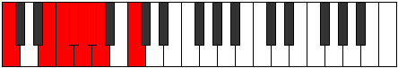 | [midi](https://github.com/edipermadi/music/blob/main/docs/ModeCNaturalKatyptian.mid?raw=true) |
| [1011](https://ianring.com/musictheory/scales/1011) | [Ioniptyllic](ScaleIoniptyllic.md) | [Kycryllic](ModeKycryllic.md) | C, C#, **E**, F, F#, **G**, **G#**, A, C |  | [midi](https://github.com/edipermadi/music/blob/main/docs/ModeCNaturalKycryllic.mid?raw=true) |
| [1013](https://ianring.com/musictheory/scales/1013) | [Phranyllic](ScalePhranyllic.md) | [Stydyllic](ModeStydyllic.md) | C, D, **E**, F, **F#**, G, **G#**, A, C |  | [midi](https://github.com/edipermadi/music/blob/main/docs/ModeCNaturalStydyllic.mid?raw=true) |
| [1015](https://ianring.com/musictheory/scales/1015) | [Kalygic](ScaleKalygic.md) | [Ionodygic](ModeIonodygic.md) | C, C#, D, **E**, F, F#, G, **G#**, A, C |  | [midi](https://github.com/edipermadi/music/blob/main/docs/ModeCNaturalIonodygic.mid?raw=true) |
| [1017](https://ianring.com/musictheory/scales/1017) | [Zaryllic](ScaleZaryllic.md) | [Dythyllic](ModeDythyllic.md) | C, **D#**, **E**, F, **F#**, **G**, G#, A, C |  | [midi](https://github.com/edipermadi/music/blob/main/docs/ModeCNaturalDythyllic.mid?raw=true) |
| [1019](https://ianring.com/musictheory/scales/1019) | [Phrygic](ScalePhrygic.md) | [Aeranygic](ModeAeranygic.md) | C, C#, **D#**, **E**, F, F#, **G**, G#, A, C |  | [midi](https://github.com/edipermadi/music/blob/main/docs/ModeCNaturalAeranygic.mid?raw=true) |
| [1021](https://ianring.com/musictheory/scales/1021) | [Sathygic](ScaleSathygic.md) | [Ladygic](ModeLadygic.md) | C, D, **D#**, **E**, F, **F#**, G, G#, A, C |  | [midi](https://github.com/edipermadi/music/blob/main/docs/ModeCNaturalLadygic.mid?raw=true) |
| [1023](https://ianring.com/musictheory/scales/1023) | [Katoryllian](ScaleKatoryllian.md) | [Dodyllian](ModeDodyllian.md) | C, C#, D, **D#**, **E**, F, F#, G, G#, A, C |  | [midi](https://github.com/edipermadi/music/blob/main/docs/ModeCNaturalDodyllian.mid?raw=true) |
| [1093](https://ianring.com/musictheory/scales/1093) | [Aeolic](ScaleAeolic.md) | [Lydic](ModeLydic.md) | **C**, **D**, **F#**, **A#**, **C** |  | [midi](https://github.com/edipermadi/music/blob/main/docs/ModeCNaturalLydic.mid?raw=true) |
| [1095](https://ianring.com/musictheory/scales/1095) | [Zylitonic](ScaleZylitonic.md) | [Phrythitonic](ModePhrythitonic.md) | **C**, **C#**, **D**, F#, **A#**, **C** |  | [midi](https://github.com/edipermadi/music/blob/main/docs/ModeCNaturalPhrythitonic.mid?raw=true) |
| [1097](https://ianring.com/musictheory/scales/1097) | [Saric](ScaleSaric.md) | [Aeraphic](ModeAeraphic.md) | **C**, D#, **F#**, **A#**, **C** |  | [midi](https://github.com/edipermadi/music/blob/main/docs/ModeCNaturalAeraphic.mid?raw=true) |
| [1099](https://ianring.com/musictheory/scales/1099) | [Aeolacritonic](ScaleAeolacritonic.md) | [Dyritonic](ModeDyritonic.md) | **C**, **C#**, D#, F#, **A#**, **C** | 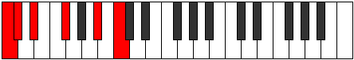 | [midi](https://github.com/edipermadi/music/blob/main/docs/ModeCNaturalDyritonic.mid?raw=true) |
| [1101](https://ianring.com/musictheory/scales/1101) | [Aerynitonic](ScaleAerynitonic.md) | [Stothitonic](ModeStothitonic.md) | **C**, **D**, D#, **F#**, **A#**, **C** |  | [midi](https://github.com/edipermadi/music/blob/main/docs/ModeCNaturalStothitonic.mid?raw=true) |
| [1103](https://ianring.com/musictheory/scales/1103) | [Kocrimic](ScaleKocrimic.md) | [Lynimic](ModeLynimic.md) | **C**, **Db**, **Ebb**, Fbb, Gb, **A#**, **C** |  | [midi](https://github.com/edipermadi/music/blob/main/docs/ModeCNaturalLynimic.mid?raw=true) |
| [1105](https://ianring.com/musictheory/scales/1105) | [Stathic](ScaleStathic.md) | [Stathic](ModeStathic.md) | **C**, **E**, **F#**, **A#**, **C** |  | [midi](https://github.com/edipermadi/music/blob/main/docs/ModeCNaturalStathic.mid?raw=true) |
| [1107](https://ianring.com/musictheory/scales/1107) | [Ionoditonic](ScaleIonoditonic.md) | [Mogitonic](ModeMogitonic.md) | **C**, **C#**, **E**, F#, **A#**, **C** |  | [midi](https://github.com/edipermadi/music/blob/main/docs/ModeCNaturalMogitonic.mid?raw=true) |
| [1109](https://ianring.com/musictheory/scales/1109) | [Bolitonic](ScaleBolitonic.md) | [Kataditonic](ModeKataditonic.md) | **C**, **D**, **E**, **F#**, **A#**, **C** |  | [midi](https://github.com/edipermadi/music/blob/main/docs/ModeCNaturalKataditonic.mid?raw=true) |
| [1111](https://ianring.com/musictheory/scales/1111) | [Gacrimic](ScaleGacrimic.md) | [Sycrimic](ModeSycrimic.md) | **C**, **Db**, **Ebb**, **Fb**, Gb, **A#**, **C** |  | [midi](https://github.com/edipermadi/music/blob/main/docs/ModeCNaturalSycrimic.mid?raw=true) |
| [1113](https://ianring.com/musictheory/scales/1113) | [Phronitonic](ScalePhronitonic.md) | [Aeronitonic](ModeAeronitonic.md) | **C**, D#, **E**, **F#**, **A#**, **C** |  | [midi](https://github.com/edipermadi/music/blob/main/docs/ModeCNaturalAeronitonic.mid?raw=true) |
| [1115](https://ianring.com/musictheory/scales/1115) | [Manimic](ScaleManimic.md) | [Locrimic](ModeLocrimic.md) | **C**, **Db**, Eb, **Fb**, Gb, **A#**, **C** |  | [midi](https://github.com/edipermadi/music/blob/main/docs/ModeCNaturalLocrimic.mid?raw=true) |
| [1117](https://ianring.com/musictheory/scales/1117) | [Dathimic](ScaleDathimic.md) | [Raptimic](ModeRaptimic.md) | **C**, **D**, Eb, **Fb**, **Gb**, **A#**, **C** |  | [midi](https://github.com/edipermadi/music/blob/main/docs/ModeCNaturalRaptimic.mid?raw=true) |
| [1119](https://ianring.com/musictheory/scales/1119) | [Gydian](ScaleGydian.md) | [Rarian](ModeRarian.md) | **C**, **Db**, **Ebb**, Fbb, **Gbbb**, Abbb, **Bb**, **C** |  | [midi](https://github.com/edipermadi/music/blob/main/docs/ModeCNaturalRarian.mid?raw=true) |
| [1123](https://ianring.com/musictheory/scales/1123) | [Zolitonic](ScaleZolitonic.md) | [Lanitonic](ModeLanitonic.md) | **C**, **C#**, F, F#, A#, **C** |  | [midi](https://github.com/edipermadi/music/blob/main/docs/ModeCNaturalLanitonic.mid?raw=true) |
| [1125](https://ianring.com/musictheory/scales/1125) | [Aeolanitonic](ScaleAeolanitonic.md) | [Ionaritonic](ModeIonaritonic.md) | **C**, **D**, F, **F#**, A#, **C** |  | [midi](https://github.com/edipermadi/music/blob/main/docs/ModeCNaturalIonaritonic.mid?raw=true) |
| [1127](https://ianring.com/musictheory/scales/1127) | [Aerycrimic](ScaleAerycrimic.md) | [Eparimic](ModeEparimic.md) | **C**, **Db**, **Ebb**, F, Gb, A#, **C** |  | [midi](https://github.com/edipermadi/music/blob/main/docs/ModeCNaturalEparimic.mid?raw=true) |
| [1129](https://ianring.com/musictheory/scales/1129) | [Gathitonic](ScaleGathitonic.md) | [Phrynitonic](ModePhrynitonic.md) | **C**, D#, F, **F#**, A#, **C** |  | [midi](https://github.com/edipermadi/music/blob/main/docs/ModeCNaturalPhrynitonic.mid?raw=true) |
| [1131](https://ianring.com/musictheory/scales/1131) | [Dyrimic](ScaleDyrimic.md) | [Thocrimic](ModeThocrimic.md) | **C**, **Db**, Eb, F, Gb, A#, **C** |  | [midi](https://github.com/edipermadi/music/blob/main/docs/ModeCNaturalThocrimic.mid?raw=true) |
| [1133](https://ianring.com/musictheory/scales/1133) | [Rycrimic](ScaleRycrimic.md) | [Stycrimic](ModeStycrimic.md) | **C**, **D**, Eb, F, **Gb**, A#, **C** |  | [midi](https://github.com/edipermadi/music/blob/main/docs/ModeCNaturalStycrimic.mid?raw=true) |
| [1135](https://ianring.com/musictheory/scales/1135) | [Epycrian](ScaleEpycrian.md) | [Katolian](ModeKatolian.md) | **C**, **Db**, **Ebb**, Fbb, Gbb, Abbb, Bb, **C** |  | [midi](https://github.com/edipermadi/music/blob/main/docs/ModeCNaturalKatolian.mid?raw=true) |
| [1137](https://ianring.com/musictheory/scales/1137) | [Zathitonic](ScaleZathitonic.md) | [Stonitonic](ModeStonitonic.md) | **C**, **E**, F, **F#**, A#, **C** |  | [midi](https://github.com/edipermadi/music/blob/main/docs/ModeCNaturalStonitonic.mid?raw=true) |
| [1139](https://ianring.com/musictheory/scales/1139) | [Katythimic](ScaleKatythimic.md) | [Aerygimic](ModeAerygimic.md) | **C**, **Db**, **E**, F, Gb, A#, **C** |  | [midi](https://github.com/edipermadi/music/blob/main/docs/ModeCNaturalAerygimic.mid?raw=true) |
| [1141](https://ianring.com/musictheory/scales/1141) | [Katanimic](ScaleKatanimic.md) | [Rynimic](ModeRynimic.md) | **C**, **D**, **E**, F, **Gb**, A#, **C** |  | [midi](https://github.com/edipermadi/music/blob/main/docs/ModeCNaturalRynimic.mid?raw=true) |
| [1143](https://ianring.com/musictheory/scales/1143) | [Katogian](ScaleKatogian.md) | [Styrian](ModeStyrian.md) | **C**, **Db**, **Ebb**, **Fb**, Gbb, Abbb, Bb, **C** |  | [midi](https://github.com/edipermadi/music/blob/main/docs/ModeCNaturalStyrian.mid?raw=true) |
| [1145](https://ianring.com/musictheory/scales/1145) | [Stalimic](ScaleStalimic.md) | [Zygimic](ModeZygimic.md) | **C**, D#, **E**, F, **Gb**, A#, **C** |  | [midi](https://github.com/edipermadi/music/blob/main/docs/ModeCNaturalZygimic.mid?raw=true) |
| [1147](https://ianring.com/musictheory/scales/1147) | [Aeopian](ScaleAeopian.md) | [Epynian](ModeEpynian.md) | **C**, **Db**, Eb, **Fb**, Gbb, Abbb, Bb, **C** | 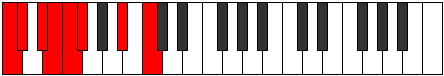 | [midi](https://github.com/edipermadi/music/blob/main/docs/ModeCNaturalEpynian.mid?raw=true) |
| [1149](https://ianring.com/musictheory/scales/1149) | [Pythian](ScalePythian.md) | [Bydian](ModeBydian.md) | **C**, **D**, Eb, **Fb**, Gbb, **Abbb**, Bb, **C** |  | [midi](https://github.com/edipermadi/music/blob/main/docs/ModeCNaturalBydian.mid?raw=true) |
| [1151](https://ianring.com/musictheory/scales/1151) | [Stycryllic](ScaleStycryllic.md) | [Mythyllic](ModeMythyllic.md) | **C**, **C#**, **D**, D#, **E**, F, F#, A#, **C** |  | [midi](https://github.com/edipermadi/music/blob/main/docs/ModeCNaturalMythyllic.mid?raw=true) |
| [1161](https://ianring.com/musictheory/scales/1161) | [Epathic](ScaleEpathic.md) | [Eporic](ModeEporic.md) | C, D#, **G**, **A#**, C |  | [midi](https://github.com/edipermadi/music/blob/main/docs/ModeCNaturalEporic.mid?raw=true) |
| [1163](https://ianring.com/musictheory/scales/1163) | [Ionaditonic](ScaleIonaditonic.md) | [Pagitonic](ModePagitonic.md) | C, **C#**, D#, **G**, **A#**, C |  | [midi](https://github.com/edipermadi/music/blob/main/docs/ModeCNaturalPagitonic.mid?raw=true) |
| [1165](https://ianring.com/musictheory/scales/1165) | [Magitonic](ScaleMagitonic.md) | [Gycritonic](ModeGycritonic.md) | C, **D**, D#, G, **A#**, C |  | [midi](https://github.com/edipermadi/music/blob/main/docs/ModeCNaturalGycritonic.mid?raw=true) |
| [1167](https://ianring.com/musictheory/scales/1167) | [Starimic](ScaleStarimic.md) | [Aerodimic](ModeAerodimic.md) | C, **Db**, **Ebb**, Fbb, G, **A#**, C |  | [midi](https://github.com/edipermadi/music/blob/main/docs/ModeCNaturalAerodimic.mid?raw=true) |
| [1169](https://ianring.com/musictheory/scales/1169) | [Daric](ScaleDaric.md) | [Daric](ModeDaric.md) | C, **E**, **G**, **A#**, C |  | [midi](https://github.com/edipermadi/music/blob/main/docs/ModeCNaturalDaric.mid?raw=true) |
| [1171](https://ianring.com/musictheory/scales/1171) | [Mixitonic](ScaleMixitonic.md) | [Loptitonic](ModeLoptitonic.md) | C, **C#**, **E**, **G**, **A#**, C |  | [midi](https://github.com/edipermadi/music/blob/main/docs/ModeCNaturalLoptitonic.mid?raw=true) |
| [1173](https://ianring.com/musictheory/scales/1173) | [Kataritonic](ScaleKataritonic.md) | [Phropitonic](ModePhropitonic.md) | C, **D**, **E**, G, **A#**, C |  | [midi](https://github.com/edipermadi/music/blob/main/docs/ModeCNaturalPhropitonic.mid?raw=true) |
| [1175](https://ianring.com/musictheory/scales/1175) | [Thagimic](ScaleThagimic.md) | [Epycrimic](ModeEpycrimic.md) | C, **Db**, **Ebb**, **Fb**, G, **A#**, C |  | [midi](https://github.com/edipermadi/music/blob/main/docs/ModeCNaturalEpycrimic.mid?raw=true) |
| [1177](https://ianring.com/musictheory/scales/1177) | [Thoditonic](ScaleThoditonic.md) | [Garitonic](ModeGaritonic.md) | C, D#, **E**, **G**, **A#**, C |  | [midi](https://github.com/edipermadi/music/blob/main/docs/ModeCNaturalGaritonic.mid?raw=true) |
| [1179](https://ianring.com/musictheory/scales/1179) | [Thoptimic](ScaleThoptimic.md) | [Sonimic](ModeSonimic.md) | C, **Db**, Eb, **Fb**, **G**, **A#**, C |  | [midi](https://github.com/edipermadi/music/blob/main/docs/ModeCNaturalSonimic.mid?raw=true) |
| [1181](https://ianring.com/musictheory/scales/1181) | [Palimic](ScalePalimic.md) | [Katagimic](ModeKatagimic.md) | C, **D**, Eb, **Fb**, G, **A#**, C |  | [midi](https://github.com/edipermadi/music/blob/main/docs/ModeCNaturalKatagimic.mid?raw=true) |
| [1183](https://ianring.com/musictheory/scales/1183) | [Bonian](ScaleBonian.md) | [Sadian](ModeSadian.md) | C, **Db**, **Ebb**, Fbb, **Gbbb**, Abb, **Bb**, C |  | [midi](https://github.com/edipermadi/music/blob/main/docs/ModeCNaturalSadian.mid?raw=true) |
| [1187](https://ianring.com/musictheory/scales/1187) | [Gathitonic](ScaleGathitonic.md) | [Thalitonic](ModeThalitonic.md) | C, **C#**, F, **G**, A#, C |  | [midi](https://github.com/edipermadi/music/blob/main/docs/ModeCNaturalThalitonic.mid?raw=true) |
| [1189](https://ianring.com/musictheory/scales/1189) | [Epathitonic](ScaleEpathitonic.md) | [Thaptitonic](ModeThaptitonic.md) | C, **D**, F, G, A#, C |  | [midi](https://github.com/edipermadi/music/blob/main/docs/ModeCNaturalThaptitonic.mid?raw=true) |
| [1191](https://ianring.com/musictheory/scales/1191) | [Mixolimic](ScaleMixolimic.md) | [Pyrimic](ModePyrimic.md) | C, **Db**, **Ebb**, F, G, A#, C |  | [midi](https://github.com/edipermadi/music/blob/main/docs/ModeCNaturalPyrimic.mid?raw=true) |
| [1193](https://ianring.com/musictheory/scales/1193) | [Epathitonic](ScaleEpathitonic.md) | [Rocritonic](ModeRocritonic.md) | C, D#, F, **G**, A#, C |  | [midi](https://github.com/edipermadi/music/blob/main/docs/ModeCNaturalRocritonic.mid?raw=true) |
| [1195](https://ianring.com/musictheory/scales/1195) | [Phracrimic](ScalePhracrimic.md) | [Sarimic](ModeSarimic.md) | C, **Db**, Eb, F, **G**, A#, C | 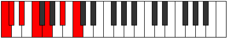 | [midi](https://github.com/edipermadi/music/blob/main/docs/ModeCNaturalSarimic.mid?raw=true) |
| [1197](https://ianring.com/musictheory/scales/1197) | [Epathimic](ScaleEpathimic.md) | [Rocrimic](ModeRocrimic.md) | C, **D**, Eb, F, G, A#, C |  | [midi](https://github.com/edipermadi/music/blob/main/docs/ModeCNaturalRocrimic.mid?raw=true) |
| [1199](https://ianring.com/musictheory/scales/1199) | [Stathian](ScaleStathian.md) | [Magian](ModeMagian.md) | C, **Db**, **Ebb**, Fbb, Gbb, Abb, Bb, C |  | [midi](https://github.com/edipermadi/music/blob/main/docs/ModeCNaturalMagian.mid?raw=true) |
| [1201](https://ianring.com/musictheory/scales/1201) | [Aeracritonic](ScaleAeracritonic.md) | [Aeracritonic](ModeAeracritonic.md) | C, **E**, F, **G**, A#, C |  | [midi](https://github.com/edipermadi/music/blob/main/docs/ModeCNaturalAeracritonic.mid?raw=true) |
| [1203](https://ianring.com/musictheory/scales/1203) | [Bocrimic](ScaleBocrimic.md) | [Pagimic](ModePagimic.md) | C, **Db**, **E**, F, **G**, A#, C |  | [midi](https://github.com/edipermadi/music/blob/main/docs/ModeCNaturalPagimic.mid?raw=true) |
| [1205](https://ianring.com/musictheory/scales/1205) | [Darmic](ScaleDarmic.md) | [Ionycrimic](ModeIonycrimic.md) | C, **D**, **E**, F, G, A#, C |  | [midi](https://github.com/edipermadi/music/blob/main/docs/ModeCNaturalIonycrimic.mid?raw=true) |
| [1207](https://ianring.com/musictheory/scales/1207) | [Rythian](ScaleRythian.md) | [Aeoloptian](ModeAeoloptian.md) | C, **Db**, **Ebb**, **Fb**, Gbb, Abb, Bb, C |  | [midi](https://github.com/edipermadi/music/blob/main/docs/ModeCNaturalAeoloptian.mid?raw=true) |
| [1209](https://ianring.com/musictheory/scales/1209) | [Ionacrimic](ScaleIonacrimic.md) | [Ionynimic](ModeIonynimic.md) | C, D#, **E**, F, **G**, A#, C |  | [midi](https://github.com/edipermadi/music/blob/main/docs/ModeCNaturalIonynimic.mid?raw=true) |
| [1211](https://ianring.com/musictheory/scales/1211) | [Ionopian](ScaleIonopian.md) | [Zadian](ModeZadian.md) | C, **Db**, Eb, **Fb**, Gbb, **Abb**, Bb, C |  | [midi](https://github.com/edipermadi/music/blob/main/docs/ModeCNaturalZadian.mid?raw=true) |
| [1213](https://ianring.com/musictheory/scales/1213) | [Soptian](ScaleSoptian.md) | [Gyrian](ModeGyrian.md) | C, **D**, Eb, **Fb**, Gbb, Abb, Bb, C |  | [midi](https://github.com/edipermadi/music/blob/main/docs/ModeCNaturalGyrian.mid?raw=true) |
| [1215](https://ianring.com/musictheory/scales/1215) | [Mixolydyllic](ScaleMixolydyllic.md) | [Aeolanyllic](ModeAeolanyllic.md) | C, **C#**, **D**, D#, **E**, F, G, A#, C |  | [midi](https://github.com/edipermadi/music/blob/main/docs/ModeCNaturalAeolanyllic.mid?raw=true) |
| [1221](https://ianring.com/musictheory/scales/1221) | [Epygitonic](ScaleEpygitonic.md) | [Epyritonic](ModeEpyritonic.md) | C, **D**, **F#**, G, **A#**, C |  | [midi](https://github.com/edipermadi/music/blob/main/docs/ModeCNaturalEpyritonic.mid?raw=true) |
| [1223](https://ianring.com/musictheory/scales/1223) | [Phralimic](ScalePhralimic.md) | [Phryptimic](ModePhryptimic.md) | C, **Db**, **Ebb**, F#, G, **A#**, C |  | [midi](https://github.com/edipermadi/music/blob/main/docs/ModeCNaturalPhryptimic.mid?raw=true) |
| [1225](https://ianring.com/musictheory/scales/1225) | [Lyditonic](ScaleLyditonic.md) | [Lyditonic](ModeLyditonic.md) | C, D#, **F#**, **G**, **A#**, C |  | [midi](https://github.com/edipermadi/music/blob/main/docs/ModeCNaturalLyditonic.mid?raw=true) |
| [1227](https://ianring.com/musictheory/scales/1227) | [Zacrimic](ScaleZacrimic.md) | [Thacrimic](ModeThacrimic.md) | C, **Db**, Eb, F#, **G**, **A#**, C |  | [midi](https://github.com/edipermadi/music/blob/main/docs/ModeCNaturalThacrimic.mid?raw=true) |
| [1229](https://ianring.com/musictheory/scales/1229) | [Mothimic](ScaleMothimic.md) | [Ragimic](ModeRagimic.md) | C, **D**, Eb, **F#**, G, **A#**, C |  | [midi](https://github.com/edipermadi/music/blob/main/docs/ModeCNaturalRagimic.mid?raw=true) |
| [1231](https://ianring.com/musictheory/scales/1231) | [Laptian](ScaleLaptian.md) | [Logian](ModeLogian.md) | C, **Db**, **Ebb**, Fbb, Gb, Abb, **Bb**, C |  | [midi](https://github.com/edipermadi/music/blob/main/docs/ModeCNaturalLogian.mid?raw=true) |
| [1233](https://ianring.com/musictheory/scales/1233) | [Ionoditonic](ScaleIonoditonic.md) | [Ionoditonic](ModeIonoditonic.md) | C, **E**, **F#**, **G**, **A#**, C |  | [midi](https://github.com/edipermadi/music/blob/main/docs/ModeCNaturalIonoditonic.mid?raw=true) |
| [1235](https://ianring.com/musictheory/scales/1235) | [Aeradimic](ScaleAeradimic.md) | [Stylimic](ModeStylimic.md) | C, **Db**, **E**, F#, **G**, **A#**, C |  | [midi](https://github.com/edipermadi/music/blob/main/docs/ModeCNaturalStylimic.mid?raw=true) |
| [1237](https://ianring.com/musictheory/scales/1237) | [Aeragimic](ScaleAeragimic.md) | [Salimic](ModeSalimic.md) | C, **D**, **E**, **F#**, G, **A#**, C |  | [midi](https://github.com/edipermadi/music/blob/main/docs/ModeCNaturalSalimic.mid?raw=true) |
| [1239](https://ianring.com/musictheory/scales/1239) | [Eporian](ScaleEporian.md) | [Epaptian](ModeEpaptian.md) | C, **Db**, **Ebb**, **Fb**, Gb, Abb, **Bb**, C |  | [midi](https://github.com/edipermadi/music/blob/main/docs/ModeCNaturalEpaptian.mid?raw=true) |
| [1241](https://ianring.com/musictheory/scales/1241) | [Stythimic](ScaleStythimic.md) | [Pygimic](ModePygimic.md) | C, D#, **E**, **F#**, **G**, **A#**, C |  | [midi](https://github.com/edipermadi/music/blob/main/docs/ModeCNaturalPygimic.mid?raw=true) |
| [1243](https://ianring.com/musictheory/scales/1243) | [Pogian](ScalePogian.md) | [Epylian](ModeEpylian.md) | C, **Db**, Eb, **Fb**, Gb, **Abb**, **Bb**, C |  | [midi](https://github.com/edipermadi/music/blob/main/docs/ModeCNaturalEpylian.mid?raw=true) |
| [1245](https://ianring.com/musictheory/scales/1245) | [Epacrian](ScaleEpacrian.md) | [Lathian](ModeLathian.md) | C, **D**, Eb, **Fb**, **Gb**, Abb, **Bb**, C |  | [midi](https://github.com/edipermadi/music/blob/main/docs/ModeCNaturalLathian.mid?raw=true) |
| [1247](https://ianring.com/musictheory/scales/1247) | [Aeronyllic](ScaleAeronyllic.md) | [Mygyllic](ModeMygyllic.md) | C, **C#**, **D**, D#, **E**, F#, G, **A#**, C |  | [midi](https://github.com/edipermadi/music/blob/main/docs/ModeCNaturalMygyllic.mid?raw=true) |
| [1251](https://ianring.com/musictheory/scales/1251) | [Mythimic](ScaleMythimic.md) | [Sylimic](ModeSylimic.md) | C, **Db**, E#, F#, **G**, A#, C |  | [midi](https://github.com/edipermadi/music/blob/main/docs/ModeCNaturalSylimic.mid?raw=true) |
| [1253](https://ianring.com/musictheory/scales/1253) | [Dalimic](ScaleDalimic.md) | [Zolimic](ModeZolimic.md) | C, **D**, E#, **F#**, G, A#, C |  | [midi](https://github.com/edipermadi/music/blob/main/docs/ModeCNaturalZolimic.mid?raw=true) |
| [1255](https://ianring.com/musictheory/scales/1255) | [Epathian](ScaleEpathian.md) | [Sogian](ModeSogian.md) | C, **Db**, **Ebb**, F, Gb, Abb, Bb, C |  | [midi](https://github.com/edipermadi/music/blob/main/docs/ModeCNaturalSogian.mid?raw=true) |
| [1257](https://ianring.com/musictheory/scales/1257) | [Mixolimic](ScaleMixolimic.md) | [Aeolyphimic](ModeAeolyphimic.md) | C, D#, E#, **F#**, **G**, A#, C |  | [midi](https://github.com/edipermadi/music/blob/main/docs/ModeCNaturalAeolyphimic.mid?raw=true) |
| [1259](https://ianring.com/musictheory/scales/1259) | [Thonian](ScaleThonian.md) | [Stadian](ModeStadian.md) | C, **Db**, Eb, F, Gb, **Abb**, Bb, C |  | [midi](https://github.com/edipermadi/music/blob/main/docs/ModeCNaturalStadian.mid?raw=true) |
| [1261](https://ianring.com/musictheory/scales/1261) | [Phrolian](ScalePhrolian.md) | [Aeodian](ModeAeodian.md) | C, **D**, Eb, F, **Gb**, Abb, Bb, C |  | [midi](https://github.com/edipermadi/music/blob/main/docs/ModeCNaturalAeodian.mid?raw=true) |
| [1263](https://ianring.com/musictheory/scales/1263) | [Pothyllic](ScalePothyllic.md) | [Stynyllic](ModeStynyllic.md) | C, **C#**, **D**, D#, F, F#, G, A#, C |  | [midi](https://github.com/edipermadi/music/blob/main/docs/ModeCNaturalStynyllic.mid?raw=true) |
| [1265](https://ianring.com/musictheory/scales/1265) | [Pynimic](ScalePynimic.md) | [Pynimic](ModePynimic.md) | C, **D##**, E#, **F#**, **G**, A#, C |  | [midi](https://github.com/edipermadi/music/blob/main/docs/ModeCNaturalPynimic.mid?raw=true) |
| [1267](https://ianring.com/musictheory/scales/1267) | [Katocrian](ScaleKatocrian.md) | [Katynian](ModeKatynian.md) | C, **Db**, **E**, F, Gb, **Abb**, Bb, C |  | [midi](https://github.com/edipermadi/music/blob/main/docs/ModeCNaturalKatynian.mid?raw=true) |
| [1269](https://ianring.com/musictheory/scales/1269) | [Phraptian](ScalePhraptian.md) | [Katythian](ModeKatythian.md) | C, **D**, **E**, F, **Gb**, Abb, Bb, C |  | [midi](https://github.com/edipermadi/music/blob/main/docs/ModeCNaturalKatythian.mid?raw=true) |
| [1271](https://ianring.com/musictheory/scales/1271) | [Zoryllic](ScaleZoryllic.md) | [Kolyllic](ModeKolyllic.md) | C, **C#**, **D**, **E**, F, F#, G, A#, C |  | [midi](https://github.com/edipermadi/music/blob/main/docs/ModeCNaturalKolyllic.mid?raw=true) |
| [1273](https://ianring.com/musictheory/scales/1273) | [Morian](ScaleMorian.md) | [Ronian](ModeRonian.md) | C, D#, **E**, F, **Gb**, **Abb**, Bb, C |  | [midi](https://github.com/edipermadi/music/blob/main/docs/ModeCNaturalRonian.mid?raw=true) |
| [1275](https://ianring.com/musictheory/scales/1275) | [Lydyllic](ScaleLydyllic.md) | [Stagyllic](ModeStagyllic.md) | C, **C#**, D#, **E**, F, F#, **G**, A#, C |  | [midi](https://github.com/edipermadi/music/blob/main/docs/ModeCNaturalStagyllic.mid?raw=true) |
| [1277](https://ianring.com/musictheory/scales/1277) | [Phranyllic](ScalePhranyllic.md) | [Zadyllic](ModeZadyllic.md) | C, **D**, D#, **E**, F, **F#**, G, A#, C |  | [midi](https://github.com/edipermadi/music/blob/main/docs/ModeCNaturalZadyllic.mid?raw=true) |
| [1279](https://ianring.com/musictheory/scales/1279) | [Sathygic](ScaleSathygic.md) | [Sarygic](ModeSarygic.md) | C, **C#**, **D**, D#, **E**, F, F#, G, A#, C |  | [midi](https://github.com/edipermadi/music/blob/main/docs/ModeCNaturalSarygic.mid?raw=true) |
| [1297](https://ianring.com/musictheory/scales/1297) | [Aeolic](ScaleAeolic.md) | [Aeolic](ModeAeolic.md) | **C**, **E**, **G#**, **A#**, **C** |  | [midi](https://github.com/edipermadi/music/blob/main/docs/ModeCNaturalAeolic.mid?raw=true) |
| [1299](https://ianring.com/musictheory/scales/1299) | [Aerynitonic](ScaleAerynitonic.md) | [Aerophitonic](ModeAerophitonic.md) | **C**, C#, **E**, **G#**, **A#**, **C** |  | [midi](https://github.com/edipermadi/music/blob/main/docs/ModeCNaturalAerophitonic.mid?raw=true) |
| [1301](https://ianring.com/musictheory/scales/1301) | [Bolitonic](ScaleBolitonic.md) | [Koditonic](ModeKoditonic.md) | **C**, **D**, **E**, **G#**, **A#**, **C** |  | [midi](https://github.com/edipermadi/music/blob/main/docs/ModeCNaturalKoditonic.mid?raw=true) |
| [1303](https://ianring.com/musictheory/scales/1303) | [Dathimic](ScaleDathimic.md) | [Epolimic](ModeEpolimic.md) | **C**, Db, **Ebb**, **Fb**, **G#**, **A#**, **C** |  | [midi](https://github.com/edipermadi/music/blob/main/docs/ModeCNaturalEpolimic.mid?raw=true) |
| [1305](https://ianring.com/musictheory/scales/1305) | [Aeolanitonic](ScaleAeolanitonic.md) | [Dynitonic](ModeDynitonic.md) | **C**, D#, **E**, G#, **A#**, **C** |  | [midi](https://github.com/edipermadi/music/blob/main/docs/ModeCNaturalDynitonic.mid?raw=true) |
| [1307](https://ianring.com/musictheory/scales/1307) | [Rycrimic](ScaleRycrimic.md) | [Katorimic](ModeKatorimic.md) | **C**, Db, Eb, **Fb**, G#, **A#**, **C** |  | [midi](https://github.com/edipermadi/music/blob/main/docs/ModeCNaturalKatorimic.mid?raw=true) |
| [1309](https://ianring.com/musictheory/scales/1309) | [Katanimic](ScaleKatanimic.md) | [Pogimic](ModePogimic.md) | **C**, **D**, Eb, **Fb**, G#, **A#**, **C** |  | [midi](https://github.com/edipermadi/music/blob/main/docs/ModeCNaturalPogimic.mid?raw=true) |
| [1311](https://ianring.com/musictheory/scales/1311) | [Pythian](ScalePythian.md) | [Bynian](ModeBynian.md) | **C**, Db, **Ebb**, Fbb, **Gbbb**, Ab, **Bb**, **C** |  | [midi](https://github.com/edipermadi/music/blob/main/docs/ModeCNaturalBynian.mid?raw=true) |
| [1315](https://ianring.com/musictheory/scales/1315) | [Magitonic](ScaleMagitonic.md) | [Pyritonic](ModePyritonic.md) | **C**, C#, F, **G#**, A#, **C** |  | [midi](https://github.com/edipermadi/music/blob/main/docs/ModeCNaturalPyritonic.mid?raw=true) |
| [1317](https://ianring.com/musictheory/scales/1317) | [Kataritonic](ScaleKataritonic.md) | [Staditonic](ModeStaditonic.md) | **C**, **D**, F, **G#**, A#, **C** |  | [midi](https://github.com/edipermadi/music/blob/main/docs/ModeCNaturalStaditonic.mid?raw=true) |
| [1319](https://ianring.com/musictheory/scales/1319) | [Palimic](ScalePalimic.md) | [Phronimic](ModePhronimic.md) | **C**, Db, **Ebb**, F, **G#**, A#, **C** |  | [midi](https://github.com/edipermadi/music/blob/main/docs/ModeCNaturalPhronimic.mid?raw=true) |
| [1321](https://ianring.com/musictheory/scales/1321) | [Epathitonic](ScaleEpathitonic.md) | [Epathitonic](ModeEpathitonic.md) | **C**, D#, F, G#, A#, **C** |  | [midi](https://github.com/edipermadi/music/blob/main/docs/ModeCNaturalEpathitonic.mid?raw=true) |
| [1323](https://ianring.com/musictheory/scales/1323) | [Epathimic](ScaleEpathimic.md) | [Eporimic](ModeEporimic.md) | **C**, Db, Eb, F, G#, A#, **C** |  | [midi](https://github.com/edipermadi/music/blob/main/docs/ModeCNaturalEporimic.mid?raw=true) |
| [1325](https://ianring.com/musictheory/scales/1325) | [Darmic](ScaleDarmic.md) | [Phradimic](ModePhradimic.md) | **C**, **D**, Eb, F, G#, A#, **C** |  | [midi](https://github.com/edipermadi/music/blob/main/docs/ModeCNaturalPhradimic.mid?raw=true) |
| [1327](https://ianring.com/musictheory/scales/1327) | [Soptian](ScaleSoptian.md) | [Zalian](ModeZalian.md) | **C**, Db, **Ebb**, Fbb, Gbb, Ab, Bb, **C** |  | [midi](https://github.com/edipermadi/music/blob/main/docs/ModeCNaturalZalian.mid?raw=true) |
| [1329](https://ianring.com/musictheory/scales/1329) | [Epygitonic](ScaleEpygitonic.md) | [Epygitonic](ModeEpygitonic.md) | **C**, **E**, F, **G#**, A#, **C** |  | [midi](https://github.com/edipermadi/music/blob/main/docs/ModeCNaturalEpygitonic.mid?raw=true) |
| [1331](https://ianring.com/musictheory/scales/1331) | [Mothimic](ScaleMothimic.md) | [Dolimic](ModeDolimic.md) | **C**, Db, **E**, F, **G#**, A#, **C** |  | [midi](https://github.com/edipermadi/music/blob/main/docs/ModeCNaturalDolimic.mid?raw=true) |
| [1333](https://ianring.com/musictheory/scales/1333) | [Aeragimic](ScaleAeragimic.md) | [Lyptimic](ModeLyptimic.md) | **C**, **D**, **E**, F, **G#**, A#, **C** |  | [midi](https://github.com/edipermadi/music/blob/main/docs/ModeCNaturalLyptimic.mid?raw=true) |
| [1335](https://ianring.com/musictheory/scales/1335) | [Epacrian](ScaleEpacrian.md) | [Aeralian](ModeAeralian.md) | **C**, Db, **Ebb**, **Fb**, Gbb, **Ab**, Bb, **C** | 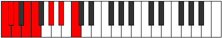 | [midi](https://github.com/edipermadi/music/blob/main/docs/ModeCNaturalAeralian.mid?raw=true) |
| [1337](https://ianring.com/musictheory/scales/1337) | [Dalimic](ScaleDalimic.md) | [Epogimic](ModeEpogimic.md) | **C**, D#, **E**, F, G#, A#, **C** | 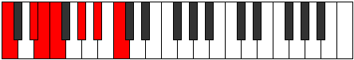 | [midi](https://github.com/edipermadi/music/blob/main/docs/ModeCNaturalEpogimic.mid?raw=true) |
| [1339](https://ianring.com/musictheory/scales/1339) | [Phrolian](ScalePhrolian.md) | [Kycrian](ModeKycrian.md) | **C**, Db, Eb, **Fb**, Gbb, Ab, Bb, **C** |  | [midi](https://github.com/edipermadi/music/blob/main/docs/ModeCNaturalKycrian.mid?raw=true) |
| [1341](https://ianring.com/musictheory/scales/1341) | [Phraptian](ScalePhraptian.md) | [Madian](ModeMadian.md) | **C**, **D**, Eb, **Fb**, Gbb, Ab, Bb, **C** |  | [midi](https://github.com/edipermadi/music/blob/main/docs/ModeCNaturalMadian.mid?raw=true) |
| [1343](https://ianring.com/musictheory/scales/1343) | [Phranyllic](ScalePhranyllic.md) | [Zalyllic](ModeZalyllic.md) | **C**, C#, **D**, D#, **E**, F, G#, A#, **C** |  | [midi](https://github.com/edipermadi/music/blob/main/docs/ModeCNaturalZalyllic.mid?raw=true) |
| [1349](https://ianring.com/musictheory/scales/1349) | [Bolitonic](ScaleBolitonic.md) | [Tholitonic](ModeTholitonic.md) | **C**, **D**, **F#**, **G#**, **A#**, **C** |  | [midi](https://github.com/edipermadi/music/blob/main/docs/ModeCNaturalTholitonic.mid?raw=true) |
| [1351](https://ianring.com/musictheory/scales/1351) | [Katanimic](ScaleKatanimic.md) | [Aeraptimic](ModeAeraptimic.md) | **C**, Db, **Ebb**, F#, **G#**, **A#**, **C** |  | [midi](https://github.com/edipermadi/music/blob/main/docs/ModeCNaturalAeraptimic.mid?raw=true) |
| [1353](https://ianring.com/musictheory/scales/1353) | [Kataritonic](ScaleKataritonic.md) | [Kataritonic](ModeKataritonic.md) | **C**, D#, **F#**, G#, **A#**, **C** |  | [midi](https://github.com/edipermadi/music/blob/main/docs/ModeCNaturalKataritonic.mid?raw=true) |
| [1355](https://ianring.com/musictheory/scales/1355) | [Darmic](ScaleDarmic.md) | [Aeolorimic](ModeAeolorimic.md) | **C**, Db, Eb, F#, G#, **A#**, **C** |  | [midi](https://github.com/edipermadi/music/blob/main/docs/ModeCNaturalAeolorimic.mid?raw=true) |
| [1357](https://ianring.com/musictheory/scales/1357) | [Aeragimic](ScaleAeragimic.md) | [Katonimic](ModeKatonimic.md) | **C**, **D**, Eb, **F#**, G#, **A#**, **C** |  | [midi](https://github.com/edipermadi/music/blob/main/docs/ModeCNaturalKatonimic.mid?raw=true) |
| [1359](https://ianring.com/musictheory/scales/1359) | [Phraptian](ScalePhraptian.md) | [Aerygian](ModeAerygian.md) | **C**, Db, **Ebb**, Fbb, Gb, Ab, **Bb**, **C** |  | [midi](https://github.com/edipermadi/music/blob/main/docs/ModeCNaturalAerygian.mid?raw=true) |
| [1361](https://ianring.com/musictheory/scales/1361) | [Bolitonic](ScaleBolitonic.md) | [Bolitonic](ModeBolitonic.md) | **C**, **E**, **F#**, **G#**, **A#**, **C** |  | [midi](https://github.com/edipermadi/music/blob/main/docs/ModeCNaturalBolitonic.mid?raw=true) |
| [1363](https://ianring.com/musictheory/scales/1363) | [Aeragimic](ScaleAeragimic.md) | [Gygimic](ModeGygimic.md) | **C**, Db, **E**, F#, **G#**, **A#**, **C** |  | [midi](https://github.com/edipermadi/music/blob/main/docs/ModeCNaturalGygimic.mid?raw=true) |
| [1365](https://ianring.com/musictheory/scales/1365) | [WholeTone](ScaleWholeTone.md) | [WholeTone](ModeWholeTone.md) | **C**, **D**, **E**, **F#**, **G#**, **A#**, **C** |  | [midi](https://github.com/edipermadi/music/blob/main/docs/ModeCNaturalWholeTone.mid?raw=true) |
| [1367](https://ianring.com/musictheory/scales/1367) | [Aeolynian](ScaleAeolynian.md) | [Pyptian](ModePyptian.md) | **C**, Db, **Ebb**, **Fb**, Gb, **Ab**, **Bb**, **C** |  | [midi](https://github.com/edipermadi/music/blob/main/docs/ModeCNaturalPyptian.mid?raw=true) |
| [1369](https://ianring.com/musictheory/scales/1369) | [Boptimic](ScaleBoptimic.md) | [Boptimic](ModeBoptimic.md) | **C**, D#, **E**, **F#**, G#, **A#**, **C** |  | [midi](https://github.com/edipermadi/music/blob/main/docs/ModeCNaturalBoptimic.mid?raw=true) |
| [1371](https://ianring.com/musictheory/scales/1371) | [Larian](ScaleLarian.md) | [Ionadian](ModeIonadian.md) | **C**, Db, Eb, **Fb**, Gb, Ab, **Bb**, **C** |  | [midi](https://github.com/edipermadi/music/blob/main/docs/ModeCNaturalIonadian.mid?raw=true) |
| [1373](https://ianring.com/musictheory/scales/1373) | [Aeolynian](ScaleAeolynian.md) | [Storian](ModeStorian.md) | **C**, **D**, Eb, **Fb**, **Gb**, Ab, **Bb**, **C** |  | [midi](https://github.com/edipermadi/music/blob/main/docs/ModeCNaturalStorian.mid?raw=true) |
| [1375](https://ianring.com/musictheory/scales/1375) | [Thyryllic](ScaleThyryllic.md) | [Bothyllic](ModeBothyllic.md) | **C**, C#, **D**, D#, **E**, F#, G#, **A#**, **C** |  | [midi](https://github.com/edipermadi/music/blob/main/docs/ModeCNaturalBothyllic.mid?raw=true) |
| [1379](https://ianring.com/musictheory/scales/1379) | [Bylimic](ScaleBylimic.md) | [Kycrimic](ModeKycrimic.md) | **C**, Db, E#, F#, **G#**, A#, **C** |  | [midi](https://github.com/edipermadi/music/blob/main/docs/ModeCNaturalKycrimic.mid?raw=true) |
| [1381](https://ianring.com/musictheory/scales/1381) | [Boptimic](ScaleBoptimic.md) | [Padimic](ModePadimic.md) | **C**, **D**, E#, **F#**, **G#**, A#, **C** |  | [midi](https://github.com/edipermadi/music/blob/main/docs/ModeCNaturalPadimic.mid?raw=true) |
| [1383](https://ianring.com/musictheory/scales/1383) | [Golian](ScaleGolian.md) | [Pynian](ModePynian.md) | **C**, Db, **Ebb**, F, Gb, **Ab**, Bb, **C** |  | [midi](https://github.com/edipermadi/music/blob/main/docs/ModeCNaturalPynian.mid?raw=true) |
| [1385](https://ianring.com/musictheory/scales/1385) | [Phracrimic](ScalePhracrimic.md) | [Phracrimic](ModePhracrimic.md) | **C**, D#, E#, **F#**, G#, A#, **C** |  | [midi](https://github.com/edipermadi/music/blob/main/docs/ModeCNaturalPhracrimic.mid?raw=true) |
| [1387](https://ianring.com/musictheory/scales/1387) | [Lydian](ScaleLydian.md) | [Locrian](ModeLocrian.md) | **C**, Db, Eb, F, Gb, Ab, Bb, **C** |  | [midi](https://github.com/edipermadi/music/blob/main/docs/ModeCNaturalLocrian.mid?raw=true) |
| [1389](https://ianring.com/musictheory/scales/1389) | [Larian](ScaleLarian.md) | [Lorian](ModeLorian.md) | **C**, **D**, Eb, F, **Gb**, Ab, Bb, **C** | 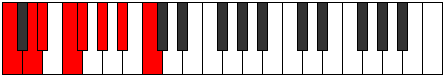 | [midi](https://github.com/edipermadi/music/blob/main/docs/ModeCNaturalLorian.mid?raw=true) |
| [1391](https://ianring.com/musictheory/scales/1391) | [Ionocryllic](ScaleIonocryllic.md) | [Aeradyllic](ModeAeradyllic.md) | **C**, C#, **D**, D#, F, F#, G#, A#, **C** |  | [midi](https://github.com/edipermadi/music/blob/main/docs/ModeCNaturalAeradyllic.mid?raw=true) |
| [1393](https://ianring.com/musictheory/scales/1393) | [Mycrimic](ScaleMycrimic.md) | [Mycrimic](ModeMycrimic.md) | **C**, **D##**, E#, **F#**, **G#**, A#, **C** |  | [midi](https://github.com/edipermadi/music/blob/main/docs/ModeCNaturalMycrimic.mid?raw=true) |
| [1395](https://ianring.com/musictheory/scales/1395) | [Dolian](ScaleDolian.md) | [Mixonorian](ModeMixonorian.md) | **C**, Db, **E**, F, Gb, **Ab**, Bb, **C** |  | [midi](https://github.com/edipermadi/music/blob/main/docs/ModeCNaturalMixonorian.mid?raw=true) |
| [1397](https://ianring.com/musictheory/scales/1397) | [Aeolynian](ScaleAeolynian.md) | [Gothian](ModeGothian.md) | **C**, **D**, **E**, F, **Gb**, **Ab**, Bb, **C** |  | [midi](https://github.com/edipermadi/music/blob/main/docs/ModeCNaturalGothian.mid?raw=true) |
| [1399](https://ianring.com/musictheory/scales/1399) | [Racryllic](ScaleRacryllic.md) | [Syryllic](ModeSyryllic.md) | **C**, C#, **D**, **E**, F, F#, **G#**, A#, **C** |  | [midi](https://github.com/edipermadi/music/blob/main/docs/ModeCNaturalSyryllic.mid?raw=true) |
| [1401](https://ianring.com/musictheory/scales/1401) | [Pagian](ScalePagian.md) | [Pagian](ModePagian.md) | **C**, D#, **E**, F, **Gb**, Ab, Bb, **C** |  | [midi](https://github.com/edipermadi/music/blob/main/docs/ModeCNaturalPagian.mid?raw=true) |
| [1403](https://ianring.com/musictheory/scales/1403) | [Rocryllic](ScaleRocryllic.md) | [Epinyllic](ModeEpinyllic.md) | **C**, C#, D#, **E**, F, F#, G#, A#, **C** |  | [midi](https://github.com/edipermadi/music/blob/main/docs/ModeCNaturalEpinyllic.mid?raw=true) |
| [1405](https://ianring.com/musictheory/scales/1405) | [Thyryllic](ScaleThyryllic.md) | [Goryllic](ModeGoryllic.md) | **C**, **D**, D#, **E**, F, **F#**, G#, A#, **C** |  | [midi](https://github.com/edipermadi/music/blob/main/docs/ModeCNaturalGoryllic.mid?raw=true) |
| [1407](https://ianring.com/musictheory/scales/1407) | [Kyrygic](ScaleKyrygic.md) | [Tharygic](ModeTharygic.md) | **C**, C#, **D**, D#, **E**, F, F#, G#, A#, **C** |  | [midi](https://github.com/edipermadi/music/blob/main/docs/ModeCNaturalTharygic.mid?raw=true) |
| [1417](https://ianring.com/musictheory/scales/1417) | [Lothitonic](ScaleLothitonic.md) | [Zoptitonic](ModeZoptitonic.md) | C, D#, **G**, G#, **A#**, C |  | [midi](https://github.com/edipermadi/music/blob/main/docs/ModeCNaturalZoptitonic.mid?raw=true) |
| [1419](https://ianring.com/musictheory/scales/1419) | [Garimic](ScaleGarimic.md) | [Zalimic](ModeZalimic.md) | C, Db, Eb, **F##**, G#, **A#**, C |  | [midi](https://github.com/edipermadi/music/blob/main/docs/ModeCNaturalZalimic.mid?raw=true) |
| [1421](https://ianring.com/musictheory/scales/1421) | [Bylimic](ScaleBylimic.md) | [Aeolaphimic](ModeAeolaphimic.md) | C, **D**, Eb, F##, G#, **A#**, C |  | [midi](https://github.com/edipermadi/music/blob/main/docs/ModeCNaturalAeolaphimic.mid?raw=true) |
| [1423](https://ianring.com/musictheory/scales/1423) | [Ionythian](ScaleIonythian.md) | [Doptian](ModeDoptian.md) | C, Db, **Ebb**, Fbb, G, Ab, **Bb**, C |  | [midi](https://github.com/edipermadi/music/blob/main/docs/ModeCNaturalDoptian.mid?raw=true) |
| [1425](https://ianring.com/musictheory/scales/1425) | [Ryphitonic](ScaleRyphitonic.md) | [Ryphitonic](ModeRyphitonic.md) | C, **E**, **G**, **G#**, **A#**, C |  | [midi](https://github.com/edipermadi/music/blob/main/docs/ModeCNaturalRyphitonic.mid?raw=true) |
| [1427](https://ianring.com/musictheory/scales/1427) | [Dagimic](ScaleDagimic.md) | [Lolimic](ModeLolimic.md) | C, Db, **E**, **F##**, **G#**, **A#**, C |  | [midi](https://github.com/edipermadi/music/blob/main/docs/ModeCNaturalLolimic.mid?raw=true) |
| [1429](https://ianring.com/musictheory/scales/1429) | [Boptimic](ScaleBoptimic.md) | [Bythimic](ModeBythimic.md) | C, **D**, **E**, F##, **G#**, **A#**, C |  | [midi](https://github.com/edipermadi/music/blob/main/docs/ModeCNaturalBythimic.mid?raw=true) |
| [1431](https://ianring.com/musictheory/scales/1431) | [Korian](ScaleKorian.md) | [Phragian](ModePhragian.md) | C, Db, **Ebb**, **Fb**, G, **Ab**, **Bb**, C |  | [midi](https://github.com/edipermadi/music/blob/main/docs/ModeCNaturalPhragian.mid?raw=true) |
| [1433](https://ianring.com/musictheory/scales/1433) | [Dynimic](ScaleDynimic.md) | [Dynimic](ModeDynimic.md) | C, D#, **E**, **F##**, G#, **A#**, C |  | [midi](https://github.com/edipermadi/music/blob/main/docs/ModeCNaturalDynimic.mid?raw=true) |
| [1435](https://ianring.com/musictheory/scales/1435) | [Palian](ScalePalian.md) | [Phronian](ModePhronian.md) | C, Db, Eb, **Fb**, **G**, Ab, **Bb**, C |  | [midi](https://github.com/edipermadi/music/blob/main/docs/ModeCNaturalPhronian.mid?raw=true) |
| [1437](https://ianring.com/musictheory/scales/1437) | [Golian](ScaleGolian.md) | [Aeolycrian](ModeAeolycrian.md) | C, **D**, Eb, **Fb**, G, Ab, **Bb**, C |  | [midi](https://github.com/edipermadi/music/blob/main/docs/ModeCNaturalAeolycrian.mid?raw=true) |
| [1439](https://ianring.com/musictheory/scales/1439) | [Aeolothyllic](ScaleAeolothyllic.md) | [Rolyllic](ModeRolyllic.md) | C, C#, **D**, D#, **E**, G, G#, **A#**, C |  | [midi](https://github.com/edipermadi/music/blob/main/docs/ModeCNaturalRolyllic.mid?raw=true) |
| [1443](https://ianring.com/musictheory/scales/1443) | [Dyrimic](ScaleDyrimic.md) | [Ionarimic](ModeIonarimic.md) | C, Db, E#, **F##**, **G#**, A#, C |  | [midi](https://github.com/edipermadi/music/blob/main/docs/ModeCNaturalIonarimic.mid?raw=true) |
| [1445](https://ianring.com/musictheory/scales/1445) | [Phracrimic](ScalePhracrimic.md) | [Byptimic](ModeByptimic.md) | C, **D**, E#, F##, **G#**, A#, C |  | [midi](https://github.com/edipermadi/music/blob/main/docs/ModeCNaturalByptimic.mid?raw=true) |
| [1447](https://ianring.com/musictheory/scales/1447) | [Thonian](ScaleThonian.md) | [Mixopyrian](ModeMixopyrian.md) | C, Db, **Ebb**, F, G, **Ab**, Bb, C |  | [midi](https://github.com/edipermadi/music/blob/main/docs/ModeCNaturalMixopyrian.mid?raw=true) |
| [1449](https://ianring.com/musictheory/scales/1449) | [Epathimic](ScaleEpathimic.md) | [Epathimic](ModeEpathimic.md) | C, D#, E#, **F##**, G#, A#, C |  | [midi](https://github.com/edipermadi/music/blob/main/docs/ModeCNaturalEpathimic.mid?raw=true) |
| [1451](https://ianring.com/musictheory/scales/1451) | [Lydian](ScaleLydian.md) | [Phrygian](ModePhrygian.md) | C, Db, Eb, F, **G**, Ab, Bb, C |  | [midi](https://github.com/edipermadi/music/blob/main/docs/ModeCNaturalPhrygian.mid?raw=true) |
| [1453](https://ianring.com/musictheory/scales/1453) | [Lydian](ScaleLydian.md) | [Aeolian](ModeAeolian.md) | C, **D**, Eb, F, G, Ab, Bb, C |  | [midi](https://github.com/edipermadi/music/blob/main/docs/ModeCNaturalAeolian.mid?raw=true) |
| [1455](https://ianring.com/musictheory/scales/1455) | [Aerycryllic](ScaleAerycryllic.md) | [Soryllic](ModeSoryllic.md) | C, C#, **D**, D#, F, G, G#, A#, C |  | [midi](https://github.com/edipermadi/music/blob/main/docs/ModeCNaturalSoryllic.mid?raw=true) |
| [1457](https://ianring.com/musictheory/scales/1457) | [Modimic](ScaleModimic.md) | [Modimic](ModeModimic.md) | C, **D##**, E#, **F##**, **G#**, A#, C |  | [midi](https://github.com/edipermadi/music/blob/main/docs/ModeCNaturalModimic.mid?raw=true) |
| [1459](https://ianring.com/musictheory/scales/1459) | [Bycrian](ScaleBycrian.md) | [Ionalian](ModeIonalian.md) | C, Db, **E**, F, **G**, **Ab**, Bb, C |  | [midi](https://github.com/edipermadi/music/blob/main/docs/ModeCNaturalIonalian.mid?raw=true) |
| [1461](https://ianring.com/musictheory/scales/1461) | [Larian](ScaleLarian.md) | [Stydian](ModeStydian.md) | C, **D**, **E**, F, G, **Ab**, Bb, C |  | [midi](https://github.com/edipermadi/music/blob/main/docs/ModeCNaturalStydian.mid?raw=true) |
| [1463](https://ianring.com/musictheory/scales/1463) | [Dalyllic](ScaleDalyllic.md) | [Zaptyllic](ModeZaptyllic.md) | C, C#, **D**, **E**, F, G, **G#**, A#, C |  | [midi](https://github.com/edipermadi/music/blob/main/docs/ModeCNaturalZaptyllic.mid?raw=true) |
| [1465](https://ianring.com/musictheory/scales/1465) | [Aerathian](ScaleAerathian.md) | [Aerathian](ModeAerathian.md) | C, D#, **E**, F, **G**, Ab, Bb, C |  | [midi](https://github.com/edipermadi/music/blob/main/docs/ModeCNaturalAerathian.mid?raw=true) |
| [1467](https://ianring.com/musictheory/scales/1467) | [Ionoptyllic](ScaleIonoptyllic.md) | [Thydyllic](ModeThydyllic.md) | C, C#, D#, **E**, F, **G**, G#, A#, C |  | [midi](https://github.com/edipermadi/music/blob/main/docs/ModeCNaturalThydyllic.mid?raw=true) |
| [1469](https://ianring.com/musictheory/scales/1469) | [Ionocryllic](ScaleIonocryllic.md) | [Epiryllic](ModeEpiryllic.md) | C, **D**, D#, **E**, F, G, G#, A#, C |  | [midi](https://github.com/edipermadi/music/blob/main/docs/ModeCNaturalEpiryllic.mid?raw=true) |
| [1471](https://ianring.com/musictheory/scales/1471) | [Apinygic](ScaleApinygic.md) | [Radygic](ModeRadygic.md) | C, C#, **D**, D#, **E**, F, G, G#, A#, C |  | [midi](https://github.com/edipermadi/music/blob/main/docs/ModeCNaturalRadygic.mid?raw=true) |
| [1477](https://ianring.com/musictheory/scales/1477) | [Mycrimic](ScaleMycrimic.md) | [Phrylimic](ModePhrylimic.md) | C, **D**, **E##**, F##, **G#**, **A#**, C |  | [midi](https://github.com/edipermadi/music/blob/main/docs/ModeCNaturalPhrylimic.mid?raw=true) |
| [1479](https://ianring.com/musictheory/scales/1479) | [Thacrian](ScaleThacrian.md) | [Aeolagian](ModeAeolagian.md) | C, Db, **Ebb**, F#, G, **Ab**, **Bb**, C |  | [midi](https://github.com/edipermadi/music/blob/main/docs/ModeCNaturalAeolagian.mid?raw=true) |
| [1481](https://ianring.com/musictheory/scales/1481) | [Zagimic](ScaleZagimic.md) | [Zagimic](ModeZagimic.md) | C, D#, **E##**, **F##**, G#, **A#**, C |  | [midi](https://github.com/edipermadi/music/blob/main/docs/ModeCNaturalZagimic.mid?raw=true) |
| [1483](https://ianring.com/musictheory/scales/1483) | [Ionycrian](ScaleIonycrian.md) | [Dygian](ModeDygian.md) | C, Db, Eb, F#, **G**, Ab, **Bb**, C |  | [midi](https://github.com/edipermadi/music/blob/main/docs/ModeCNaturalDygian.mid?raw=true) |
| [1485](https://ianring.com/musictheory/scales/1485) | [Dolian](ScaleDolian.md) | [Tyrian](ModeTyrian.md) | C, **D**, Eb, **F#**, G, Ab, **Bb**, C |  | [midi](https://github.com/edipermadi/music/blob/main/docs/ModeCNaturalTyrian.mid?raw=true) |
| [1487](https://ianring.com/musictheory/scales/1487) | [Aeracryllic](ScaleAeracryllic.md) | [Lycryllic](ModeLycryllic.md) | C, C#, **D**, D#, F#, G, G#, **A#**, C |  | [midi](https://github.com/edipermadi/music/blob/main/docs/ModeCNaturalLycryllic.mid?raw=true) |
| [1489](https://ianring.com/musictheory/scales/1489) | [Gacrimic](ScaleGacrimic.md) | [Gacrimic](ModeGacrimic.md) | C, **D##**, **E##**, **F##**, **G#**, **A#**, C |  | [midi](https://github.com/edipermadi/music/blob/main/docs/ModeCNaturalGacrimic.mid?raw=true) |
| [1491](https://ianring.com/musictheory/scales/1491) | [Eporian](ScaleEporian.md) | [Rynian](ModeRynian.md) | C, Db, **E**, F#, **G**, **Ab**, **Bb**, C |  | [midi](https://github.com/edipermadi/music/blob/main/docs/ModeCNaturalRynian.mid?raw=true) |
| [1493](https://ianring.com/musictheory/scales/1493) | [Aeolynian](ScaleAeolynian.md) | [Phryrian](ModePhryrian.md) | C, **D**, **E**, **F#**, G, **Ab**, **Bb**, C |  | [midi](https://github.com/edipermadi/music/blob/main/docs/ModeCNaturalPhryrian.mid?raw=true) |
| [1495](https://ianring.com/musictheory/scales/1495) | [Epotyllic](ScaleEpotyllic.md) | [Kaptyllic](ModeKaptyllic.md) | C, C#, **D**, **E**, F#, G, **G#**, **A#**, C |  | [midi](https://github.com/edipermadi/music/blob/main/docs/ModeCNaturalKaptyllic.mid?raw=true) |
| [1497](https://ianring.com/musictheory/scales/1497) | [Ionanian](ScaleIonanian.md) | [Ionanian](ModeIonanian.md) | C, D#, **E**, **F#**, **G**, Ab, **Bb**, C |  | [midi](https://github.com/edipermadi/music/blob/main/docs/ModeCNaturalIonanian.mid?raw=true) |
| [1499](https://ianring.com/musictheory/scales/1499) | [Stogyllic](ScaleStogyllic.md) | [Stonyllic](ModeStonyllic.md) | C, C#, D#, **E**, F#, **G**, G#, **A#**, C |  | [midi](https://github.com/edipermadi/music/blob/main/docs/ModeCNaturalStonyllic.mid?raw=true) |
| [1501](https://ianring.com/musictheory/scales/1501) | [Racryllic](ScaleRacryllic.md) | [Stygyllic](ModeStygyllic.md) | C, **D**, D#, **E**, **F#**, G, G#, **A#**, C |  | [midi](https://github.com/edipermadi/music/blob/main/docs/ModeCNaturalStygyllic.mid?raw=true) |
| [1503](https://ianring.com/musictheory/scales/1503) | [Kaptygic](ScaleKaptygic.md) | [Padygic](ModePadygic.md) | C, C#, **D**, D#, **E**, F#, G, G#, **A#**, C |  | [midi](https://github.com/edipermadi/music/blob/main/docs/ModeCNaturalPadygic.mid?raw=true) |
| [1507](https://ianring.com/musictheory/scales/1507) | [Zogian](ScaleZogian.md) | [Zynian](ModeZynian.md) | C, Db, E#, F#, **G**, **Ab**, Bb, C |  | [midi](https://github.com/edipermadi/music/blob/main/docs/ModeCNaturalZynian.mid?raw=true) |
| [1509](https://ianring.com/musictheory/scales/1509) | [Pagian](ScalePagian.md) | [Ragian](ModeRagian.md) | C, **D**, E#, **F#**, G, **Ab**, Bb, C |  | [midi](https://github.com/edipermadi/music/blob/main/docs/ModeCNaturalRagian.mid?raw=true) |
| [1511](https://ianring.com/musictheory/scales/1511) | [Bacryllic](ScaleBacryllic.md) | [Styptyllic](ModeStyptyllic.md) | C, C#, **D**, F, F#, G, **G#**, A#, C |  | [midi](https://github.com/edipermadi/music/blob/main/docs/ModeCNaturalStyptyllic.mid?raw=true) |
| [1513](https://ianring.com/musictheory/scales/1513) | [Stathian](ScaleStathian.md) | [Stathian](ModeStathian.md) | C, D#, E#, **F#**, **G**, Ab, Bb, C |  | [midi](https://github.com/edipermadi/music/blob/main/docs/ModeCNaturalStathian.mid?raw=true) |
| [1515](https://ianring.com/musictheory/scales/1515) | [Aerycryllic](ScaleAerycryllic.md) | [Solyllic](ModeSolyllic.md) | C, C#, D#, F, F#, **G**, G#, A#, C |  | [midi](https://github.com/edipermadi/music/blob/main/docs/ModeCNaturalSolyllic.mid?raw=true) |
| [1517](https://ianring.com/musictheory/scales/1517) | [Rocryllic](ScaleRocryllic.md) | [Sagyllic](ModeSagyllic.md) | C, **D**, D#, F, **F#**, G, G#, A#, C |  | [midi](https://github.com/edipermadi/music/blob/main/docs/ModeCNaturalSagyllic.mid?raw=true) |
| [1519](https://ianring.com/musictheory/scales/1519) | [Aerycrygic](ScaleAerycrygic.md) | [Solygic](ModeSolygic.md) | C, C#, **D**, D#, F, F#, G, G#, A#, C |  | [midi](https://github.com/edipermadi/music/blob/main/docs/ModeCNaturalSolygic.mid?raw=true) |
| [1521](https://ianring.com/musictheory/scales/1521) | [Stanian](ScaleStanian.md) | [Stanian](ModeStanian.md) | C, **D##**, E#, **F#**, **G**, **Ab**, Bb, C |  | [midi](https://github.com/edipermadi/music/blob/main/docs/ModeCNaturalStanian.mid?raw=true) |
| [1523](https://ianring.com/musictheory/scales/1523) | [Gythyllic](ScaleGythyllic.md) | [Zothyllic](ModeZothyllic.md) | C, C#, **E**, F, F#, **G**, **G#**, A#, C |  | [midi](https://github.com/edipermadi/music/blob/main/docs/ModeCNaturalZothyllic.mid?raw=true) |
| [1525](https://ianring.com/musictheory/scales/1525) | [Thyryllic](ScaleThyryllic.md) | [Sodyllic](ModeSodyllic.md) | C, **D**, **E**, F, **F#**, G, **G#**, A#, C |  | [midi](https://github.com/edipermadi/music/blob/main/docs/ModeCNaturalSodyllic.mid?raw=true) |
| [1527](https://ianring.com/musictheory/scales/1527) | [Porygic](ScalePorygic.md) | [Aeolyrygic](ModeAeolyrygic.md) | C, C#, **D**, **E**, F, F#, G, **G#**, A#, C |  | [midi](https://github.com/edipermadi/music/blob/main/docs/ModeCNaturalAeolyrygic.mid?raw=true) |
| [1529](https://ianring.com/musictheory/scales/1529) | [Kataryllic](ScaleKataryllic.md) | [Kataryllic](ModeKataryllic.md) | C, D#, **E**, F, **F#**, **G**, G#, A#, C |  | [midi](https://github.com/edipermadi/music/blob/main/docs/ModeCNaturalKataryllic.mid?raw=true) |
| [1531](https://ianring.com/musictheory/scales/1531) | [Bagygic](ScaleBagygic.md) | [Styptygic](ModeStyptygic.md) | C, C#, D#, **E**, F, F#, **G**, G#, A#, C |  | [midi](https://github.com/edipermadi/music/blob/main/docs/ModeCNaturalStyptygic.mid?raw=true) |
| [1533](https://ianring.com/musictheory/scales/1533) | [Kyrygic](ScaleKyrygic.md) | [Katycrygic](ModeKatycrygic.md) | C, **D**, D#, **E**, F, **F#**, G, G#, A#, C |  | [midi](https://github.com/edipermadi/music/blob/main/docs/ModeCNaturalKatycrygic.mid?raw=true) |
| [1535](https://ianring.com/musictheory/scales/1535) | [Sydyllian](ScaleSydyllian.md) | [Mixodyllian](ModeMixodyllian.md) | C, C#, **D**, D#, **E**, F, F#, G, G#, A#, C |  | [midi](https://github.com/edipermadi/music/blob/main/docs/ModeCNaturalMixodyllian.mid?raw=true) |
| [1571](https://ianring.com/musictheory/scales/1571) | [Dolitonic](ScaleDolitonic.md) | [Lagitonic](ModeLagitonic.md) | **C**, **C#**, F, **A**, A#, **C** |  | [midi](https://github.com/edipermadi/music/blob/main/docs/ModeCNaturalLagitonic.mid?raw=true) |
| [1573](https://ianring.com/musictheory/scales/1573) | [Lothitonic](ScaleLothitonic.md) | [Saritonic](ModeSaritonic.md) | **C**, D, F, **A**, A#, **C** |  | [midi](https://github.com/edipermadi/music/blob/main/docs/ModeCNaturalSaritonic.mid?raw=true) |
| [1575](https://ianring.com/musictheory/scales/1575) | [Syrimic](ScaleSyrimic.md) | [Zycrimic](ModeZycrimic.md) | **C**, **Db**, Ebb, F, **G##**, A#, **C** |  | [midi](https://github.com/edipermadi/music/blob/main/docs/ModeCNaturalZycrimic.mid?raw=true) |
| [1577](https://ianring.com/musictheory/scales/1577) | [Aeracritonic](ScaleAeracritonic.md) | [Lonitonic](ModeLonitonic.md) | **C**, D#, F, **A**, A#, **C** |  | [midi](https://github.com/edipermadi/music/blob/main/docs/ModeCNaturalLonitonic.mid?raw=true) |
| [1579](https://ianring.com/musictheory/scales/1579) | [Modimic](ScaleModimic.md) | [Sagimic](ModeSagimic.md) | **C**, **Db**, Eb, F, **G##**, A#, **C** |  | [midi](https://github.com/edipermadi/music/blob/main/docs/ModeCNaturalSagimic.mid?raw=true) |
| [1581](https://ianring.com/musictheory/scales/1581) | [Garimic](ScaleGarimic.md) | [Gyrimic](ModeGyrimic.md) | **C**, D, Eb, F, **G##**, A#, **C** |  | [midi](https://github.com/edipermadi/music/blob/main/docs/ModeCNaturalGyrimic.mid?raw=true) |
| [1583](https://ianring.com/musictheory/scales/1583) | [Zorian](ScaleZorian.md) | [Salian](ModeSalian.md) | **C**, **Db**, Ebb, Fbb, Gbb, **A**, Bb, **C** |  | [midi](https://github.com/edipermadi/music/blob/main/docs/ModeCNaturalSalian.mid?raw=true) |
| [1585](https://ianring.com/musictheory/scales/1585) | [Phraditonic](ScalePhraditonic.md) | [Phraditonic](ModePhraditonic.md) | **C**, **E**, F, A, A#, **C** |  | [midi](https://github.com/edipermadi/music/blob/main/docs/ModeCNaturalPhraditonic.mid?raw=true) |
| [1587](https://ianring.com/musictheory/scales/1587) | [Laptimic](ScaleLaptimic.md) | [Lalimic](ModeLalimic.md) | **C**, **Db**, **E**, F, G##, A#, **C** |  | [midi](https://github.com/edipermadi/music/blob/main/docs/ModeCNaturalLalimic.mid?raw=true) |
| [1589](https://ianring.com/musictheory/scales/1589) | [Bylimic](ScaleBylimic.md) | [Ionagimic](ModeIonagimic.md) | **C**, D, **E**, F, G##, A#, **C** |  | [midi](https://github.com/edipermadi/music/blob/main/docs/ModeCNaturalIonagimic.mid?raw=true) |
| [1591](https://ianring.com/musictheory/scales/1591) | [Stythian](ScaleStythian.md) | [Rodian](ModeRodian.md) | **C**, **Db**, Ebb, **Fb**, Gbb, A, Bb, **C** |  | [midi](https://github.com/edipermadi/music/blob/main/docs/ModeCNaturalRodian.mid?raw=true) |
| [1593](https://ianring.com/musictheory/scales/1593) | [Epygimic](ScaleEpygimic.md) | [Zogimic](ModeZogimic.md) | **C**, D#, **E**, F, G##, A#, **C** |  | [midi](https://github.com/edipermadi/music/blob/main/docs/ModeCNaturalZogimic.mid?raw=true) |
| [1595](https://ianring.com/musictheory/scales/1595) | [Stygian](ScaleStygian.md) | [Dacrian](ModeDacrian.md) | **C**, **Db**, Eb, **Fb**, Gbb, A, Bb, **C** | 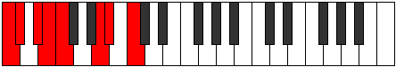 | [midi](https://github.com/edipermadi/music/blob/main/docs/ModeCNaturalDacrian.mid?raw=true) |
| [1597](https://ianring.com/musictheory/scales/1597) | [Ionythian](ScaleIonythian.md) | [Aeolodian](ModeAeolodian.md) | **C**, D, Eb, **Fb**, Gbb, A, Bb, **C** |  | [midi](https://github.com/edipermadi/music/blob/main/docs/ModeCNaturalAeolodian.mid?raw=true) |
| [1599](https://ianring.com/musictheory/scales/1599) | [Dolyllic](ScaleDolyllic.md) | [Pocryllic](ModePocryllic.md) | **C**, **C#**, D, D#, **E**, F, A, A#, **C** |  | [midi](https://github.com/edipermadi/music/blob/main/docs/ModeCNaturalPocryllic.mid?raw=true) |
| [1605](https://ianring.com/musictheory/scales/1605) | [Ryphitonic](ScaleRyphitonic.md) | [Zanitonic](ModeZanitonic.md) | **C**, D, **F#**, **A**, **A#**, **C** |  | [midi](https://github.com/edipermadi/music/blob/main/docs/ModeCNaturalZanitonic.mid?raw=true) |
| [1607](https://ianring.com/musictheory/scales/1607) | [Lathimic](ScaleLathimic.md) | [Epytimic](ModeEpytimic.md) | **C**, **Db**, Ebb, F#, **G##**, **A#**, **C** |  | [midi](https://github.com/edipermadi/music/blob/main/docs/ModeCNaturalEpytimic.mid?raw=true) |
| [1609](https://ianring.com/musictheory/scales/1609) | [Thyritonic](ScaleThyritonic.md) | [Thyritonic](ModeThyritonic.md) | **C**, D#, **F#**, **A**, **A#**, **C** |  | [midi](https://github.com/edipermadi/music/blob/main/docs/ModeCNaturalThyritonic.mid?raw=true) |
| [1611](https://ianring.com/musictheory/scales/1611) | [Thalimic](ScaleThalimic.md) | [Dacrimic](ModeDacrimic.md) | **C**, **Db**, Eb, F#, **G##**, **A#**, **C** |  | [midi](https://github.com/edipermadi/music/blob/main/docs/ModeCNaturalDacrimic.mid?raw=true) |
| [1613](https://ianring.com/musictheory/scales/1613) | [Dagimic](ScaleDagimic.md) | [Thylimic](ModeThylimic.md) | **C**, D, Eb, **F#**, **G##**, **A#**, **C** |  | [midi](https://github.com/edipermadi/music/blob/main/docs/ModeCNaturalThylimic.mid?raw=true) |
| [1615](https://ianring.com/musictheory/scales/1615) | [Epagian](ScaleEpagian.md) | [Sydian](ModeSydian.md) | **C**, **Db**, Ebb, Fbb, Gb, **A**, **Bb**, **C** |  | [midi](https://github.com/edipermadi/music/blob/main/docs/ModeCNaturalSydian.mid?raw=true) |
| [1617](https://ianring.com/musictheory/scales/1617) | [Phronitonic](ScalePhronitonic.md) | [Phronitonic](ModePhronitonic.md) | **C**, **E**, **F#**, A, **A#**, **C** |  | [midi](https://github.com/edipermadi/music/blob/main/docs/ModeCNaturalPhronitonic.mid?raw=true) |
| [1619](https://ianring.com/musictheory/scales/1619) | [Stythimic](ScaleStythimic.md) | [Monimic](ModeMonimic.md) | **C**, **Db**, **E**, F#, G##, **A#**, **C** |  | [midi](https://github.com/edipermadi/music/blob/main/docs/ModeCNaturalMonimic.mid?raw=true) |
| [1621](https://ianring.com/musictheory/scales/1621) | [Boptimic](ScaleBoptimic.md) | [Aeolathimic](ModeAeolathimic.md) | **C**, D, **E**, **F#**, G##, **A#**, **C** |  | [midi](https://github.com/edipermadi/music/blob/main/docs/ModeCNaturalAeolathimic.mid?raw=true) |
| [1623](https://ianring.com/musictheory/scales/1623) | [Ionanian](ScaleIonanian.md) | [Lothian](ModeLothian.md) | **C**, **Db**, Ebb, **Fb**, Gb, A, **Bb**, **C** |  | [midi](https://github.com/edipermadi/music/blob/main/docs/ModeCNaturalLothian.mid?raw=true) |
| [1625](https://ianring.com/musictheory/scales/1625) | [Lythimic](ScaleLythimic.md) | [Lythimic](ModeLythimic.md) | **C**, D#, **E**, **F#**, G##, **A#**, **C** |  | [midi](https://github.com/edipermadi/music/blob/main/docs/ModeCNaturalLythimic.mid?raw=true) |
| [1627](https://ianring.com/musictheory/scales/1627) | [Mycrian](ScaleMycrian.md) | [Zyptian](ModeZyptian.md) | **C**, **Db**, Eb, **Fb**, Gb, A, **Bb**, **C** |  | [midi](https://github.com/edipermadi/music/blob/main/docs/ModeCNaturalZyptian.mid?raw=true) |
| [1629](https://ianring.com/musictheory/scales/1629) | [Korian](ScaleKorian.md) | [Synian](ModeSynian.md) | **C**, D, Eb, **Fb**, **Gb**, A, **Bb**, **C** |  | [midi](https://github.com/edipermadi/music/blob/main/docs/ModeCNaturalSynian.mid?raw=true) |
| [1631](https://ianring.com/musictheory/scales/1631) | [Stacryllic](ScaleStacryllic.md) | [Rynyllic](ModeRynyllic.md) | **C**, **C#**, D, D#, **E**, F#, A, **A#**, **C** |  | [midi](https://github.com/edipermadi/music/blob/main/docs/ModeCNaturalRynyllic.mid?raw=true) |
| [1635](https://ianring.com/musictheory/scales/1635) | [Solimic](ScaleSolimic.md) | [Sygimic](ModeSygimic.md) | **C**, **Db**, E#, F#, **G##**, A#, **C** |  | [midi](https://github.com/edipermadi/music/blob/main/docs/ModeCNaturalSygimic.mid?raw=true) |
| [1637](https://ianring.com/musictheory/scales/1637) | [Dynimic](ScaleDynimic.md) | [Syptimic](ModeSyptimic.md) | **C**, D, E#, **F#**, **G##**, A#, **C** |  | [midi](https://github.com/edipermadi/music/blob/main/docs/ModeCNaturalSyptimic.mid?raw=true) |
| [1639](https://ianring.com/musictheory/scales/1639) | [Katathian](ScaleKatathian.md) | [Aeolothian](ModeAeolothian.md) | **C**, **Db**, Ebb, F, Gb, **A**, Bb, **C** |  | [midi](https://github.com/edipermadi/music/blob/main/docs/ModeCNaturalAeolothian.mid?raw=true) |
| [1641](https://ianring.com/musictheory/scales/1641) | [Bocrimic](ScaleBocrimic.md) | [Bocrimic](ModeBocrimic.md) | **C**, D#, E#, **F#**, **G##**, A#, **C** |  | [midi](https://github.com/edipermadi/music/blob/main/docs/ModeCNaturalBocrimic.mid?raw=true) |
| [1643](https://ianring.com/musictheory/scales/1643) | [Bycrian](ScaleBycrian.md) | [Thyptian](ModeThyptian.md) | **C**, **Db**, Eb, F, Gb, **A**, Bb, **C** |  | [midi](https://github.com/edipermadi/music/blob/main/docs/ModeCNaturalThyptian.mid?raw=true) |
| [1645](https://ianring.com/musictheory/scales/1645) | [Palian](ScalePalian.md) | [Katagian](ModeKatagian.md) | **C**, D, Eb, F, **Gb**, **A**, Bb, **C** |  | [midi](https://github.com/edipermadi/music/blob/main/docs/ModeCNaturalKatagian.mid?raw=true) |
| [1647](https://ianring.com/musictheory/scales/1647) | [Doptyllic](ScaleDoptyllic.md) | [Polyllic](ModePolyllic.md) | **C**, **C#**, D, D#, F, F#, **A**, A#, **C** |  | [midi](https://github.com/edipermadi/music/blob/main/docs/ModeCNaturalPolyllic.mid?raw=true) |
| [1649](https://ianring.com/musictheory/scales/1649) | [Bolimic](ScaleBolimic.md) | [Bolimic](ModeBolimic.md) | **C**, **D##**, E#, **F#**, G##, A#, **C** |  | [midi](https://github.com/edipermadi/music/blob/main/docs/ModeCNaturalBolimic.mid?raw=true) |
| [1651](https://ianring.com/musictheory/scales/1651) | [Loptian](ScaleLoptian.md) | [Mogian](ModeMogian.md) | **C**, **Db**, **E**, F, Gb, A, Bb, **C** |  | [midi](https://github.com/edipermadi/music/blob/main/docs/ModeCNaturalMogian.mid?raw=true) |
| [1653](https://ianring.com/musictheory/scales/1653) | [Golian](ScaleGolian.md) | [Gylian](ModeGylian.md) | **C**, D, **E**, F, **Gb**, A, Bb, **C** |  | [midi](https://github.com/edipermadi/music/blob/main/docs/ModeCNaturalGylian.mid?raw=true) |
| [1655](https://ianring.com/musictheory/scales/1655) | [Thyptyllic](ScaleThyptyllic.md) | [Katygyllic](ModeKatygyllic.md) | **C**, **C#**, D, **E**, F, F#, A, A#, **C** |  | [midi](https://github.com/edipermadi/music/blob/main/docs/ModeCNaturalKatygyllic.mid?raw=true) |
| [1657](https://ianring.com/musictheory/scales/1657) | [Ranian](ScaleRanian.md) | [Ionothian](ModeIonothian.md) | **C**, D#, **E**, F, **Gb**, A, Bb, **C** |  | [midi](https://github.com/edipermadi/music/blob/main/docs/ModeCNaturalIonothian.mid?raw=true) |
| [1659](https://ianring.com/musictheory/scales/1659) | [Maptyllic](ScaleMaptyllic.md) | [Magyllic](ModeMagyllic.md) | **C**, **C#**, D#, **E**, F, F#, A, A#, **C** |  | [midi](https://github.com/edipermadi/music/blob/main/docs/ModeCNaturalMagyllic.mid?raw=true) |
| [1661](https://ianring.com/musictheory/scales/1661) | [Aeolothyllic](ScaleAeolothyllic.md) | [Gonyllic](ModeGonyllic.md) | **C**, D, D#, **E**, F, **F#**, A, A#, **C** |  | [midi](https://github.com/edipermadi/music/blob/main/docs/ModeCNaturalGonyllic.mid?raw=true) |
| [1663](https://ianring.com/musictheory/scales/1663) | [Phrygic](ScalePhrygic.md) | [Lydygic](ModeLydygic.md) | **C**, **C#**, D, D#, **E**, F, F#, A, A#, **C** |  | [midi](https://github.com/edipermadi/music/blob/main/docs/ModeCNaturalLydygic.mid?raw=true) |
| [1673](https://ianring.com/musictheory/scales/1673) | [Aeolacritonic](ScaleAeolacritonic.md) | [Thocritonic](ModeThocritonic.md) | C, D#, **G**, **A**, **A#**, C |  | [midi](https://github.com/edipermadi/music/blob/main/docs/ModeCNaturalThocritonic.mid?raw=true) |
| [1675](https://ianring.com/musictheory/scales/1675) | [Manimic](ScaleManimic.md) | [Epatimic](ModeEpatimic.md) | C, **Db**, Eb, **F##**, **G##**, **A#**, C | 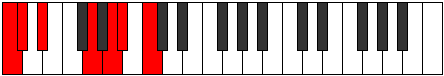 | [midi](https://github.com/edipermadi/music/blob/main/docs/ModeCNaturalEpatimic.mid?raw=true) |
| [1677](https://ianring.com/musictheory/scales/1677) | [Dyrimic](ScaleDyrimic.md) | [Danimic](ModeDanimic.md) | C, D, Eb, F##, **G##**, **A#**, C |  | [midi](https://github.com/edipermadi/music/blob/main/docs/ModeCNaturalDanimic.mid?raw=true) |
| [1679](https://ianring.com/musictheory/scales/1679) | [Aeopian](ScaleAeopian.md) | [Kydian](ModeKydian.md) | C, **Db**, Ebb, Fbb, G, **A**, **Bb**, C |  | [midi](https://github.com/edipermadi/music/blob/main/docs/ModeCNaturalKydian.mid?raw=true) |
| [1681](https://ianring.com/musictheory/scales/1681) | [Ionaditonic](ScaleIonaditonic.md) | [Ionaditonic](ModeIonaditonic.md) | C, **E**, **G**, A, **A#**, C |  | [midi](https://github.com/edipermadi/music/blob/main/docs/ModeCNaturalIonaditonic.mid?raw=true) |
| [1683](https://ianring.com/musictheory/scales/1683) | [Thoptimic](ScaleThoptimic.md) | [Rygimic](ModeRygimic.md) | C, **Db**, **E**, **F##**, G##, **A#**, C |  | [midi](https://github.com/edipermadi/music/blob/main/docs/ModeCNaturalRygimic.mid?raw=true) |
| [1685](https://ianring.com/musictheory/scales/1685) | [Phracrimic](ScalePhracrimic.md) | [Zeracrimic](ModeZeracrimic.md) | C, D, **E**, F##, G##, **A#**, C |  | [midi](https://github.com/edipermadi/music/blob/main/docs/ModeCNaturalZeracrimic.mid?raw=true) |
| [1687](https://ianring.com/musictheory/scales/1687) | [Ionopian](ScaleIonopian.md) | [Phralian](ModePhralian.md) | C, **Db**, Ebb, **Fb**, G, A, **Bb**, C |  | [midi](https://github.com/edipermadi/music/blob/main/docs/ModeCNaturalPhralian.mid?raw=true) |
| [1689](https://ianring.com/musictheory/scales/1689) | [Zacrimic](ScaleZacrimic.md) | [Lorimic](ModeLorimic.md) | C, D#, **E**, **F##**, G##, **A#**, C |  | [midi](https://github.com/edipermadi/music/blob/main/docs/ModeCNaturalLorimic.mid?raw=true) |
| [1691](https://ianring.com/musictheory/scales/1691) | [Pogian](ScalePogian.md) | [Kathian](ModeKathian.md) | C, **Db**, Eb, **Fb**, **G**, A, **Bb**, C |  | [midi](https://github.com/edipermadi/music/blob/main/docs/ModeCNaturalKathian.mid?raw=true) |
| [1693](https://ianring.com/musictheory/scales/1693) | [Thonian](ScaleThonian.md) | [Dogian](ModeDogian.md) | C, D, Eb, **Fb**, G, A, **Bb**, C |  | [midi](https://github.com/edipermadi/music/blob/main/docs/ModeCNaturalDogian.mid?raw=true) |
| [1695](https://ianring.com/musictheory/scales/1695) | [Lydyllic](ScaleLydyllic.md) | [Phrodyllic](ModePhrodyllic.md) | C, **C#**, D, D#, **E**, G, A, **A#**, C |  | [midi](https://github.com/edipermadi/music/blob/main/docs/ModeCNaturalPhrodyllic.mid?raw=true) |
| [1699](https://ianring.com/musictheory/scales/1699) | [Rycrimic](ScaleRycrimic.md) | [Kaptimic](ModeKaptimic.md) | C, **Db**, E#, **F##**, **G##**, A#, C |  | [midi](https://github.com/edipermadi/music/blob/main/docs/ModeCNaturalKaptimic.mid?raw=true) |
| [1701](https://ianring.com/musictheory/scales/1701) | [Epathimic](ScaleEpathimic.md) | [Lothimic](ModeLothimic.md) | C, D, E#, F##, **G##**, A#, C |  | [midi](https://github.com/edipermadi/music/blob/main/docs/ModeCNaturalLothimic.mid?raw=true) |
| [1703](https://ianring.com/musictheory/scales/1703) | [Phrolian](ScalePhrolian.md) | [Zaptian](ModeZaptian.md) | C, **Db**, Ebb, F, G, **A**, Bb, C |  | [midi](https://github.com/edipermadi/music/blob/main/docs/ModeCNaturalZaptian.mid?raw=true) |
| [1705](https://ianring.com/musictheory/scales/1705) | [Darmic](ScaleDarmic.md) | [Darmic](ModeDarmic.md) | C, D#, E#, **F##**, **G##**, A#, C |  | [midi](https://github.com/edipermadi/music/blob/main/docs/ModeCNaturalDarmic.mid?raw=true) |
| [1707](https://ianring.com/musictheory/scales/1707) | [Larian](ScaleLarian.md) | [Mixolythian](ModeMixolythian.md) | C, **Db**, Eb, F, **G**, **A**, Bb, C |  | [midi](https://github.com/edipermadi/music/blob/main/docs/ModeCNaturalMixolythian.mid?raw=true) |
| [1709](https://ianring.com/musictheory/scales/1709) | [Lydian](ScaleLydian.md) | [Dorian](ModeDorian.md) | C, D, Eb, F, G, **A**, Bb, C |  | [midi](https://github.com/edipermadi/music/blob/main/docs/ModeCNaturalDorian.mid?raw=true) |
| [1711](https://ianring.com/musictheory/scales/1711) | [Rocryllic](ScaleRocryllic.md) | [Ragyllic](ModeRagyllic.md) | C, **C#**, D, D#, F, G, **A**, A#, C |  | [midi](https://github.com/edipermadi/music/blob/main/docs/ModeCNaturalRagyllic.mid?raw=true) |
| [1713](https://ianring.com/musictheory/scales/1713) | [Garimic](ScaleGarimic.md) | [Garimic](ModeGarimic.md) | C, **D##**, E#, **F##**, G##, A#, C |  | [midi](https://github.com/edipermadi/music/blob/main/docs/ModeCNaturalGarimic.mid?raw=true) |
| [1715](https://ianring.com/musictheory/scales/1715) | [Palian](ScalePalian.md) | [Aeronian](ModeAeronian.md) | C, **Db**, **E**, F, **G**, A, Bb, C |  | [midi](https://github.com/edipermadi/music/blob/main/docs/ModeCNaturalAeronian.mid?raw=true) |
| [1717](https://ianring.com/musictheory/scales/1717) | [Lydian](ScaleLydian.md) | [Mixolydian](ModeMixolydian.md) | C, D, **E**, F, G, A, Bb, C |  | [midi](https://github.com/edipermadi/music/blob/main/docs/ModeCNaturalMixolydian.mid?raw=true) |
| [1719](https://ianring.com/musictheory/scales/1719) | [Ionoptyllic](ScaleIonoptyllic.md) | [Lyryllic](ModeLyryllic.md) | C, **C#**, D, **E**, F, G, A, A#, C |  | [midi](https://github.com/edipermadi/music/blob/main/docs/ModeCNaturalLyryllic.mid?raw=true) |
| [1721](https://ianring.com/musictheory/scales/1721) | [Ionycrian](ScaleIonycrian.md) | [Ionycrian](ModeIonycrian.md) | C, D#, **E**, F, **G**, A, Bb, C |  | [midi](https://github.com/edipermadi/music/blob/main/docs/ModeCNaturalIonycrian.mid?raw=true) |
| [1723](https://ianring.com/musictheory/scales/1723) | [Stogyllic](ScaleStogyllic.md) | [Poryllic](ModePoryllic.md) | C, **C#**, D#, **E**, F, **G**, A, A#, C |  | [midi](https://github.com/edipermadi/music/blob/main/docs/ModeCNaturalPoryllic.mid?raw=true) |
| [1725](https://ianring.com/musictheory/scales/1725) | [Aerycryllic](ScaleAerycryllic.md) | [Mixodyllic](ModeMixodyllic.md) | C, D, D#, **E**, F, G, A, A#, C |  | [midi](https://github.com/edipermadi/music/blob/main/docs/ModeCNaturalMixodyllic.mid?raw=true) |
| [1727](https://ianring.com/musictheory/scales/1727) | [Bagygic](ScaleBagygic.md) | [Sydygic](ModeSydygic.md) | C, **C#**, D, D#, **E**, F, G, A, A#, C |  | [midi](https://github.com/edipermadi/music/blob/main/docs/ModeCNaturalSydygic.mid?raw=true) |
| [1733](https://ianring.com/musictheory/scales/1733) | [Modimic](ScaleModimic.md) | [Socrimic](ModeSocrimic.md) | C, D, **E##**, F##, **G##**, **A#**, C |  | [midi](https://github.com/edipermadi/music/blob/main/docs/ModeCNaturalSocrimic.mid?raw=true) |
| [1735](https://ianring.com/musictheory/scales/1735) | [Stygian](ScaleStygian.md) | [Dagian](ModeDagian.md) | C, **Db**, Ebb, F#, G, **A**, **Bb**, C |  | [midi](https://github.com/edipermadi/music/blob/main/docs/ModeCNaturalDagian.mid?raw=true) |
| [1737](https://ianring.com/musictheory/scales/1737) | [Thalimic](ScaleThalimic.md) | [Thalimic](ModeThalimic.md) | C, D#, **E##**, **F##**, **G##**, **A#**, C |  | [midi](https://github.com/edipermadi/music/blob/main/docs/ModeCNaturalThalimic.mid?raw=true) |
| [1739](https://ianring.com/musictheory/scales/1739) | [Mycrian](ScaleMycrian.md) | [Phrylian](ModePhrylian.md) | C, **Db**, Eb, F#, **G**, **A**, **Bb**, C |  | [midi](https://github.com/edipermadi/music/blob/main/docs/ModeCNaturalPhrylian.mid?raw=true) |
| [1741](https://ianring.com/musictheory/scales/1741) | [Bycrian](ScaleBycrian.md) | [Katycrian](ModeKatycrian.md) | C, D, Eb, **F#**, G, **A**, **Bb**, C |  | [midi](https://github.com/edipermadi/music/blob/main/docs/ModeCNaturalKatycrian.mid?raw=true) |
| [1743](https://ianring.com/musictheory/scales/1743) | [Maptyllic](ScaleMaptyllic.md) | [Epigyllic](ModeEpigyllic.md) | C, **C#**, D, D#, F#, G, **A**, **A#**, C |  | [midi](https://github.com/edipermadi/music/blob/main/docs/ModeCNaturalEpigyllic.mid?raw=true) |
| [1745](https://ianring.com/musictheory/scales/1745) | [Manimic](ScaleManimic.md) | [Manimic](ModeManimic.md) | C, **D##**, **E##**, **F##**, G##, **A#**, C |  | [midi](https://github.com/edipermadi/music/blob/main/docs/ModeCNaturalManimic.mid?raw=true) |
| [1747](https://ianring.com/musictheory/scales/1747) | [Pogian](ScalePogian.md) | [Epalian](ModeEpalian.md) | C, **Db**, **E**, F#, **G**, A, **Bb**, C |  | [midi](https://github.com/edipermadi/music/blob/main/docs/ModeCNaturalEpalian.mid?raw=true) |
| [1749](https://ianring.com/musictheory/scales/1749) | [Larian](ScaleLarian.md) | [Lythian](ModeLythian.md) | C, D, **E**, **F#**, G, A, **Bb**, C |  | [midi](https://github.com/edipermadi/music/blob/main/docs/ModeCNaturalLythian.mid?raw=true) |
| [1751](https://ianring.com/musictheory/scales/1751) | [Stogyllic](ScaleStogyllic.md) | [Aeolyryllic](ModeAeolyryllic.md) | C, **C#**, D, **E**, F#, G, A, **A#**, C | 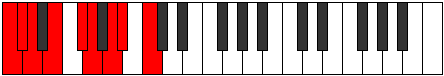 | [midi](https://github.com/edipermadi/music/blob/main/docs/ModeCNaturalAeolyryllic.mid?raw=true) |
| [1753](https://ianring.com/musictheory/scales/1753) | [Mycrian](ScaleMycrian.md) | [Mycrian](ModeMycrian.md) | C, D#, **E**, **F#**, **G**, A, **Bb**, C |  | [midi](https://github.com/edipermadi/music/blob/main/docs/ModeCNaturalMycrian.mid?raw=true) |
| [1755](https://ianring.com/musictheory/scales/1755) | [MajorDiminished](ScaleMajorDiminished.md) | [MinorDiminished](ModeMinorDiminished.md) | C, **C#**, D#, **E**, F#, **G**, A, **A#**, C |  | [midi](https://github.com/edipermadi/music/blob/main/docs/ModeCNaturalMinorDiminished.mid?raw=true) |
| [1757](https://ianring.com/musictheory/scales/1757) | [Dalyllic](ScaleDalyllic.md) | [Ionyphyllic](ModeIonyphyllic.md) | C, D, D#, **E**, **F#**, G, A, **A#**, C |  | [midi](https://github.com/edipermadi/music/blob/main/docs/ModeCNaturalIonyphyllic.mid?raw=true) |
| [1759](https://ianring.com/musictheory/scales/1759) | [Koptygic](ScaleKoptygic.md) | [Pylygic](ModePylygic.md) | C, **C#**, D, D#, **E**, F#, G, A, **A#**, C |  | [midi](https://github.com/edipermadi/music/blob/main/docs/ModeCNaturalPylygic.mid?raw=true) |
| [1763](https://ianring.com/musictheory/scales/1763) | [Aeolathian](ScaleAeolathian.md) | [Katalian](ModeKatalian.md) | C, **Db**, E#, F#, **G**, **A**, Bb, C |  | [midi](https://github.com/edipermadi/music/blob/main/docs/ModeCNaturalKatalian.mid?raw=true) |
| [1765](https://ianring.com/musictheory/scales/1765) | [Aerathian](ScaleAerathian.md) | [Lonian](ModeLonian.md) | C, D, E#, **F#**, G, **A**, Bb, C |  | [midi](https://github.com/edipermadi/music/blob/main/docs/ModeCNaturalLonian.mid?raw=true) |
| [1767](https://ianring.com/musictheory/scales/1767) | [Dydyllic](ScaleDydyllic.md) | [Dyryllic](ModeDyryllic.md) | C, **C#**, D, F, F#, G, **A**, A#, C |  | [midi](https://github.com/edipermadi/music/blob/main/docs/ModeCNaturalDyryllic.mid?raw=true) |
| [1769](https://ianring.com/musictheory/scales/1769) | [Rythian](ScaleRythian.md) | [Rythian](ModeRythian.md) | C, D#, E#, **F#**, **G**, **A**, Bb, C |  | [midi](https://github.com/edipermadi/music/blob/main/docs/ModeCNaturalRythian.mid?raw=true) |
| [1771](https://ianring.com/musictheory/scales/1771) | [Dalyllic](ScaleDalyllic.md) | [Stylyllic](ModeStylyllic.md) | C, **C#**, D#, F, F#, **G**, **A**, A#, C | 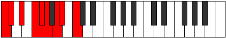 | [midi](https://github.com/edipermadi/music/blob/main/docs/ModeCNaturalStylyllic.mid?raw=true) |
| [1773](https://ianring.com/musictheory/scales/1773) | [Ionoptyllic](ScaleIonoptyllic.md) | [Aeoloryllic](ModeAeoloryllic.md) | C, D, D#, F, **F#**, G, **A**, A#, C |  | [midi](https://github.com/edipermadi/music/blob/main/docs/ModeCNaturalAeoloryllic.mid?raw=true) |
| [1775](https://ianring.com/musictheory/scales/1775) | [Aeolorygic](ScaleAeolorygic.md) | [Lyrygic](ModeLyrygic.md) | C, **C#**, D, D#, F, F#, G, **A**, A#, C |  | [midi](https://github.com/edipermadi/music/blob/main/docs/ModeCNaturalLyrygic.mid?raw=true) |
| [1777](https://ianring.com/musictheory/scales/1777) | [Saptian](ScaleSaptian.md) | [Saptian](ModeSaptian.md) | C, **D##**, E#, **F#**, **G**, A, Bb, C |  | [midi](https://github.com/edipermadi/music/blob/main/docs/ModeCNaturalSaptian.mid?raw=true) |
| [1779](https://ianring.com/musictheory/scales/1779) | [Aeolathyllic](ScaleAeolathyllic.md) | [Aerythyllic](ModeAerythyllic.md) | C, **C#**, **E**, F, F#, **G**, A, A#, C |  | [midi](https://github.com/edipermadi/music/blob/main/docs/ModeCNaturalAerythyllic.mid?raw=true) |
| [1781](https://ianring.com/musictheory/scales/1781) | [Ionocryllic](ScaleIonocryllic.md) | [Gocryllic](ModeGocryllic.md) | C, D, **E**, F, **F#**, G, A, A#, C |  | [midi](https://github.com/edipermadi/music/blob/main/docs/ModeCNaturalGocryllic.mid?raw=true) |
| [1783](https://ianring.com/musictheory/scales/1783) | [Epyrygic](ScaleEpyrygic.md) | [Danygic](ModeDanygic.md) | C, **C#**, D, **E**, F, F#, G, A, A#, C |  | [midi](https://github.com/edipermadi/music/blob/main/docs/ModeCNaturalDanygic.mid?raw=true) |
| [1785](https://ianring.com/musictheory/scales/1785) | [Tharyllic](ScaleTharyllic.md) | [Tharyllic](ModeTharyllic.md) | C, D#, **E**, F, **F#**, **G**, A, A#, C |  | [midi](https://github.com/edipermadi/music/blob/main/docs/ModeCNaturalTharyllic.mid?raw=true) |
| [1787](https://ianring.com/musictheory/scales/1787) | [Koptygic](ScaleKoptygic.md) | [Mycrygic](ModeMycrygic.md) | C, **C#**, D#, **E**, F, F#, **G**, A, A#, C |  | [midi](https://github.com/edipermadi/music/blob/main/docs/ModeCNaturalMycrygic.mid?raw=true) |
| [1789](https://ianring.com/musictheory/scales/1789) | [Apinygic](ScaleApinygic.md) | [Katagygic](ModeKatagygic.md) | C, D, D#, **E**, F, **F#**, G, A, A#, C |  | [midi](https://github.com/edipermadi/music/blob/main/docs/ModeCNaturalKatagygic.mid?raw=true) |
| [1791](https://ianring.com/musictheory/scales/1791) | [Gothyllian](ScaleGothyllian.md) | [Aerygyllian](ModeAerygyllian.md) | C, **C#**, D, D#, **E**, F, F#, G, A, A#, C |  | [midi](https://github.com/edipermadi/music/blob/main/docs/ModeCNaturalAerygyllian.mid?raw=true) |
| [1809](https://ianring.com/musictheory/scales/1809) | [Ranitonic](ScaleRanitonic.md) | [Ranitonic](ModeRanitonic.md) | **C**, **E**, **G#**, A, **A#**, **C** |  | [midi](https://github.com/edipermadi/music/blob/main/docs/ModeCNaturalRanitonic.mid?raw=true) |
| [1811](https://ianring.com/musictheory/scales/1811) | [Aerothimic](ScaleAerothimic.md) | [Kyptimic](ModeKyptimic.md) | **C**, Db, **E**, **F###**, G##, **A#**, **C** |  | [midi](https://github.com/edipermadi/music/blob/main/docs/ModeCNaturalKyptimic.mid?raw=true) |
| [1813](https://ianring.com/musictheory/scales/1813) | [Mycrimic](ScaleMycrimic.md) | [Katothimic](ModeKatothimic.md) | **C**, D, **E**, **F###**, G##, **A#**, **C** |  | [midi](https://github.com/edipermadi/music/blob/main/docs/ModeCNaturalKatothimic.mid?raw=true) |
| [1815](https://ianring.com/musictheory/scales/1815) | [Katacrian](ScaleKatacrian.md) | [Godian](ModeGodian.md) | **C**, Db, Ebb, **Fb**, **G#**, A, **Bb**, **C** |  | [midi](https://github.com/edipermadi/music/blob/main/docs/ModeCNaturalGodian.mid?raw=true) |
| [1817](https://ianring.com/musictheory/scales/1817) | [Kanimic](ScaleKanimic.md) | [Phrythimic](ModePhrythimic.md) | **C**, D#, **E**, F###, G##, **A#**, **C** |  | [midi](https://github.com/edipermadi/music/blob/main/docs/ModeCNaturalPhrythimic.mid?raw=true) |
| [1819](https://ianring.com/musictheory/scales/1819) | [Aeolathian](ScaleAeolathian.md) | [Pydian](ModePydian.md) | **C**, Db, Eb, **Fb**, G#, A, **Bb**, **C** |  | [midi](https://github.com/edipermadi/music/blob/main/docs/ModeCNaturalPydian.mid?raw=true) |
| [1821](https://ianring.com/musictheory/scales/1821) | [Thacrian](ScaleThacrian.md) | [Aeradian](ModeAeradian.md) | **C**, D, Eb, **Fb**, G#, A, **Bb**, **C** |  | [midi](https://github.com/edipermadi/music/blob/main/docs/ModeCNaturalAeradian.mid?raw=true) |
| [1823](https://ianring.com/musictheory/scales/1823) | [Thagyllic](ScaleThagyllic.md) | [Phralyllic](ModePhralyllic.md) | **C**, C#, D, D#, **E**, G#, A, **A#**, **C** |  | [midi](https://github.com/edipermadi/music/blob/main/docs/ModeCNaturalPhralyllic.mid?raw=true) |
| [1827](https://ianring.com/musictheory/scales/1827) | [Bygimic](ScaleBygimic.md) | [Katygimic](ModeKatygimic.md) | **C**, Db, E#, **F###**, **G##**, A#, **C** |  | [midi](https://github.com/edipermadi/music/blob/main/docs/ModeCNaturalKatygimic.mid?raw=true) |
| [1829](https://ianring.com/musictheory/scales/1829) | [Zagimic](ScaleZagimic.md) | [Pathimic](ModePathimic.md) | **C**, D, E#, **F###**, **G##**, A#, **C** |  | [midi](https://github.com/edipermadi/music/blob/main/docs/ModeCNaturalPathimic.mid?raw=true) |
| [1831](https://ianring.com/musictheory/scales/1831) | [Stalian](ScaleStalian.md) | [Pothian](ModePothian.md) | **C**, Db, Ebb, F, **G#**, **A**, Bb, **C** |  | [midi](https://github.com/edipermadi/music/blob/main/docs/ModeCNaturalPothian.mid?raw=true) |
| [1833](https://ianring.com/musictheory/scales/1833) | [Ionacrimic](ScaleIonacrimic.md) | [Ionacrimic](ModeIonacrimic.md) | **C**, D#, E#, F###, **G##**, A#, **C** |  | [midi](https://github.com/edipermadi/music/blob/main/docs/ModeCNaturalIonacrimic.mid?raw=true) |
| [1835](https://ianring.com/musictheory/scales/1835) | [Aerathian](ScaleAerathian.md) | [Byptian](ModeByptian.md) | **C**, Db, Eb, F, G#, **A**, Bb, **C** |  | [midi](https://github.com/edipermadi/music/blob/main/docs/ModeCNaturalByptian.mid?raw=true) |
| [1837](https://ianring.com/musictheory/scales/1837) | [Ionycrian](ScaleIonycrian.md) | [Dalian](ModeDalian.md) | **C**, D, Eb, F, G#, **A**, Bb, **C** |  | [midi](https://github.com/edipermadi/music/blob/main/docs/ModeCNaturalDalian.mid?raw=true) |
| [1839](https://ianring.com/musictheory/scales/1839) | [Dagyllic](ScaleDagyllic.md) | [Zogyllic](ModeZogyllic.md) | **C**, C#, D, D#, F, G#, **A**, A#, **C** |  | [midi](https://github.com/edipermadi/music/blob/main/docs/ModeCNaturalZogyllic.mid?raw=true) |
| [1841](https://ianring.com/musictheory/scales/1841) | [Thogimic](ScaleThogimic.md) | [Thogimic](ModeThogimic.md) | **C**, **D##**, E#, **F###**, G##, A#, **C** |  | [midi](https://github.com/edipermadi/music/blob/main/docs/ModeCNaturalThogimic.mid?raw=true) |
| [1843](https://ianring.com/musictheory/scales/1843) | [Tholian](ScaleTholian.md) | [Ionygian](ModeIonygian.md) | **C**, Db, **E**, F, **G#**, A, Bb, **C** |  | [midi](https://github.com/edipermadi/music/blob/main/docs/ModeCNaturalIonygian.mid?raw=true) |
| [1845](https://ianring.com/musictheory/scales/1845) | [Dolian](ScaleDolian.md) | [Lagian](ModeLagian.md) | **C**, D, **E**, F, **G#**, A, Bb, **C** |  | [midi](https://github.com/edipermadi/music/blob/main/docs/ModeCNaturalLagian.mid?raw=true) |
| [1847](https://ianring.com/musictheory/scales/1847) | [Lonyllic](ScaleLonyllic.md) | [Thacryllic](ModeThacryllic.md) | **C**, C#, D, **E**, F, **G#**, A, A#, **C** |  | [midi](https://github.com/edipermadi/music/blob/main/docs/ModeCNaturalThacryllic.mid?raw=true) |
| [1849](https://ianring.com/musictheory/scales/1849) | [Epogian](ScaleEpogian.md) | [Epogian](ModeEpogian.md) | **C**, D#, **E**, F, G#, A, Bb, **C** |  | [midi](https://github.com/edipermadi/music/blob/main/docs/ModeCNaturalEpogian.mid?raw=true) |
| [1851](https://ianring.com/musictheory/scales/1851) | [Dydyllic](ScaleDydyllic.md) | [Zacryllic](ModeZacryllic.md) | **C**, C#, D#, **E**, F, G#, A, A#, **C** |  | [midi](https://github.com/edipermadi/music/blob/main/docs/ModeCNaturalZacryllic.mid?raw=true) |
| [1853](https://ianring.com/musictheory/scales/1853) | [Aeracryllic](ScaleAeracryllic.md) | [Phrynyllic](ModePhrynyllic.md) | **C**, D, D#, **E**, F, G#, A, A#, **C** |  | [midi](https://github.com/edipermadi/music/blob/main/docs/ModeCNaturalPhrynyllic.mid?raw=true) |
| [1855](https://ianring.com/musictheory/scales/1855) | [Kalygic](ScaleKalygic.md) | [Marygic](ModeMarygic.md) | **C**, C#, D, D#, **E**, F, G#, A, A#, **C** |  | [midi](https://github.com/edipermadi/music/blob/main/docs/ModeCNaturalMarygic.mid?raw=true) |
| [1861](https://ianring.com/musictheory/scales/1861) | [Gacrimic](ScaleGacrimic.md) | [Phrygimic](ModePhrygimic.md) | **C**, D, **E##**, **F###**, **G##**, **A#**, **C** |  | [midi](https://github.com/edipermadi/music/blob/main/docs/ModeCNaturalPhrygimic.mid?raw=true) |
| [1863](https://ianring.com/musictheory/scales/1863) | [Katogian](ScaleKatogian.md) | [Pycrian](ModePycrian.md) | **C**, Db, Ebb, F#, **G#**, **A**, **Bb**, **C** |  | [midi](https://github.com/edipermadi/music/blob/main/docs/ModeCNaturalPycrian.mid?raw=true) |
| [1865](https://ianring.com/musictheory/scales/1865) | [Thagimic](ScaleThagimic.md) | [Thagimic](ModeThagimic.md) | **C**, D#, **E##**, F###, **G##**, **A#**, **C** |  | [midi](https://github.com/edipermadi/music/blob/main/docs/ModeCNaturalThagimic.mid?raw=true) |
| [1867](https://ianring.com/musictheory/scales/1867) | [Rythian](ScaleRythian.md) | [Solian](ModeSolian.md) | **C**, Db, Eb, F#, G#, **A**, **Bb**, **C** |  | [midi](https://github.com/edipermadi/music/blob/main/docs/ModeCNaturalSolian.mid?raw=true) |
| [1869](https://ianring.com/musictheory/scales/1869) | [Eporian](ScaleEporian.md) | [Katyrian](ModeKatyrian.md) | **C**, D, Eb, **F#**, G#, **A**, **Bb**, **C** |  | [midi](https://github.com/edipermadi/music/blob/main/docs/ModeCNaturalKatyrian.mid?raw=true) |
| [1871](https://ianring.com/musictheory/scales/1871) | [Zoryllic](ScaleZoryllic.md) | [Aeolyllic](ModeAeolyllic.md) | **C**, C#, D, D#, F#, G#, **A**, **A#**, **C** |  | [midi](https://github.com/edipermadi/music/blob/main/docs/ModeCNaturalAeolyllic.mid?raw=true) |
| [1873](https://ianring.com/musictheory/scales/1873) | [Dathimic](ScaleDathimic.md) | [Dathimic](ModeDathimic.md) | **C**, **D##**, **E##**, **F###**, G##, **A#**, **C** |  | [midi](https://github.com/edipermadi/music/blob/main/docs/ModeCNaturalDathimic.mid?raw=true) |
| [1875](https://ianring.com/musictheory/scales/1875) | [Epacrian](ScaleEpacrian.md) | [Epyphian](ModeEpyphian.md) | **C**, Db, **E**, F#, **G#**, A, **Bb**, **C** |  | [midi](https://github.com/edipermadi/music/blob/main/docs/ModeCNaturalEpyphian.mid?raw=true) |
| [1877](https://ianring.com/musictheory/scales/1877) | [Aeolynian](ScaleAeolynian.md) | [Aeroptian](ModeAeroptian.md) | **C**, D, **E**, **F#**, **G#**, A, **Bb**, **C** |  | [midi](https://github.com/edipermadi/music/blob/main/docs/ModeCNaturalAeroptian.mid?raw=true) |
| [1879](https://ianring.com/musictheory/scales/1879) | [Racryllic](ScaleRacryllic.md) | [Mixoryllic](ModeMixoryllic.md) | **C**, C#, D, **E**, F#, **G#**, A, **A#**, **C** |  | [midi](https://github.com/edipermadi/music/blob/main/docs/ModeCNaturalMixoryllic.mid?raw=true) |
| [1881](https://ianring.com/musictheory/scales/1881) | [Korian](ScaleKorian.md) | [Korian](ModeKorian.md) | **C**, D#, **E**, **F#**, G#, A, **Bb**, **C** |  | [midi](https://github.com/edipermadi/music/blob/main/docs/ModeCNaturalKorian.mid?raw=true) |
| [1883](https://ianring.com/musictheory/scales/1883) | [Dalyllic](ScaleDalyllic.md) | [Mixopyryllic](ModeMixopyryllic.md) | **C**, C#, D#, **E**, F#, G#, A, **A#**, **C** |  | [midi](https://github.com/edipermadi/music/blob/main/docs/ModeCNaturalMixopyryllic.mid?raw=true) |
| [1885](https://ianring.com/musictheory/scales/1885) | [Epotyllic](ScaleEpotyllic.md) | [Epidyllic](ModeEpidyllic.md) | **C**, D, D#, **E**, **F#**, G#, A, **A#**, **C** |  | [midi](https://github.com/edipermadi/music/blob/main/docs/ModeCNaturalEpidyllic.mid?raw=true) |
| [1887](https://ianring.com/musictheory/scales/1887) | [Porygic](ScalePorygic.md) | [Aerocrygic](ModeAerocrygic.md) | **C**, C#, D, D#, **E**, F#, G#, A, **A#**, **C** |  | [midi](https://github.com/edipermadi/music/blob/main/docs/ModeCNaturalAerocrygic.mid?raw=true) |
| [1891](https://ianring.com/musictheory/scales/1891) | [Stythian](ScaleStythian.md) | [Thalian](ModeThalian.md) | **C**, Db, E#, F#, **G#**, **A**, Bb, **C** |  | [midi](https://github.com/edipermadi/music/blob/main/docs/ModeCNaturalThalian.mid?raw=true) |
| [1893](https://ianring.com/musictheory/scales/1893) | [Ionanian](ScaleIonanian.md) | [Ionylian](ModeIonylian.md) | **C**, D, E#, **F#**, **G#**, **A**, Bb, **C** |  | [midi](https://github.com/edipermadi/music/blob/main/docs/ModeCNaturalIonylian.mid?raw=true) |
| [1895](https://ianring.com/musictheory/scales/1895) | [Thyptyllic](ScaleThyptyllic.md) | [Salyllic](ModeSalyllic.md) | **C**, C#, D, F, F#, **G#**, **A**, A#, **C** |  | [midi](https://github.com/edipermadi/music/blob/main/docs/ModeCNaturalSalyllic.mid?raw=true) |
| [1897](https://ianring.com/musictheory/scales/1897) | [Ionopian](ScaleIonopian.md) | [Ionopian](ModeIonopian.md) | **C**, D#, E#, **F#**, G#, **A**, Bb, **C** |  | [midi](https://github.com/edipermadi/music/blob/main/docs/ModeCNaturalIonopian.mid?raw=true) |
| [1899](https://ianring.com/musictheory/scales/1899) | [Ionoptyllic](ScaleIonoptyllic.md) | [Moptyllic](ModeMoptyllic.md) | **C**, C#, D#, F, F#, G#, **A**, A#, **C** |  | [midi](https://github.com/edipermadi/music/blob/main/docs/ModeCNaturalMoptyllic.mid?raw=true) |
| [1901](https://ianring.com/musictheory/scales/1901) | [Stogyllic](ScaleStogyllic.md) | [Ionidyllic](ModeIonidyllic.md) | **C**, D, D#, F, **F#**, G#, **A**, A#, **C** |  | [midi](https://github.com/edipermadi/music/blob/main/docs/ModeCNaturalIonidyllic.mid?raw=true) |
| [1903](https://ianring.com/musictheory/scales/1903) | [Epyrygic](ScaleEpyrygic.md) | [Rocrygic](ModeRocrygic.md) | **C**, C#, D, D#, F, F#, G#, **A**, A#, **C** |  | [midi](https://github.com/edipermadi/music/blob/main/docs/ModeCNaturalRocrygic.mid?raw=true) |
| [1905](https://ianring.com/musictheory/scales/1905) | [Katacrian](ScaleKatacrian.md) | [Katacrian](ModeKatacrian.md) | **C**, **D##**, E#, **F#**, **G#**, A, Bb, **C** |  | [midi](https://github.com/edipermadi/music/blob/main/docs/ModeCNaturalKatacrian.mid?raw=true) |
| [1907](https://ianring.com/musictheory/scales/1907) | [Lonyllic](ScaleLonyllic.md) | [Lynyllic](ModeLynyllic.md) | **C**, C#, **E**, F, F#, **G#**, A, A#, **C** |  | [midi](https://github.com/edipermadi/music/blob/main/docs/ModeCNaturalLynyllic.mid?raw=true) |
| [1909](https://ianring.com/musictheory/scales/1909) | [Racryllic](ScaleRacryllic.md) | [Epicryllic](ModeEpicryllic.md) | **C**, D, **E**, F, **F#**, **G#**, A, A#, **C** |  | [midi](https://github.com/edipermadi/music/blob/main/docs/ModeCNaturalEpicryllic.mid?raw=true) |
| [1911](https://ianring.com/musictheory/scales/1911) | [Phronygic](ScalePhronygic.md) | [Stynygic](ModeStynygic.md) | **C**, C#, D, **E**, F, F#, **G#**, A, A#, **C** |  | [midi](https://github.com/edipermadi/music/blob/main/docs/ModeCNaturalStynygic.mid?raw=true) |
| [1913](https://ianring.com/musictheory/scales/1913) | [Zagyllic](ScaleZagyllic.md) | [Zagyllic](ModeZagyllic.md) | **C**, D#, **E**, F, **F#**, G#, A, A#, **C** |  | [midi](https://github.com/edipermadi/music/blob/main/docs/ModeCNaturalZagyllic.mid?raw=true) |
| [1915](https://ianring.com/musictheory/scales/1915) | [Aeolorygic](ScaleAeolorygic.md) | [Thydygic](ModeThydygic.md) | **C**, C#, D#, **E**, F, F#, G#, A, A#, **C** |  | [midi](https://github.com/edipermadi/music/blob/main/docs/ModeCNaturalThydygic.mid?raw=true) |
| [1917](https://ianring.com/musictheory/scales/1917) | [Kaptygic](ScaleKaptygic.md) | [Sacrygic](ModeSacrygic.md) | **C**, D, D#, **E**, F, **F#**, G#, A, A#, **C** |  | [midi](https://github.com/edipermadi/music/blob/main/docs/ModeCNaturalSacrygic.mid?raw=true) |
| [1919](https://ianring.com/musictheory/scales/1919) | [Staptyllian](ScaleStaptyllian.md) | [Rocryllian](ModeRocryllian.md) | **C**, C#, D, D#, **E**, F, F#, G#, A, A#, **C** |  | [midi](https://github.com/edipermadi/music/blob/main/docs/ModeCNaturalRocryllian.mid?raw=true) |
| [1929](https://ianring.com/musictheory/scales/1929) | [Kytrimic](ScaleKytrimic.md) | [Aeolycrimic](ModeAeolycrimic.md) | C, D#, **E###**, F###, **G##**, **A#**, C |  | [midi](https://github.com/edipermadi/music/blob/main/docs/ModeCNaturalAeolycrimic.mid?raw=true) |
| [1931](https://ianring.com/musictheory/scales/1931) | [Saptian](ScaleSaptian.md) | [Stogian](ModeStogian.md) | C, Db, Eb, **F##**, G#, **A**, **Bb**, C |  | [midi](https://github.com/edipermadi/music/blob/main/docs/ModeCNaturalStogian.mid?raw=true) |
| [1933](https://ianring.com/musictheory/scales/1933) | [Zogian](ScaleZogian.md) | [Mocrian](ModeMocrian.md) | C, D, Eb, F##, G#, **A**, **Bb**, C |  | [midi](https://github.com/edipermadi/music/blob/main/docs/ModeCNaturalMocrian.mid?raw=true) |
| [1935](https://ianring.com/musictheory/scales/1935) | [Pynyllic](ScalePynyllic.md) | [Mycryllic](ModeMycryllic.md) | C, C#, D, D#, G, G#, **A**, **A#**, C |  | [midi](https://github.com/edipermadi/music/blob/main/docs/ModeCNaturalMycryllic.mid?raw=true) |
| [1937](https://ianring.com/musictheory/scales/1937) | [Galimic](ScaleGalimic.md) | [Galimic](ModeGalimic.md) | C, **D##**, **E###**, **F###**, G##, **A#**, C |  | [midi](https://github.com/edipermadi/music/blob/main/docs/ModeCNaturalGalimic.mid?raw=true) |
| [1939](https://ianring.com/musictheory/scales/1939) | [Gacrian](ScaleGacrian.md) | [Dathian](ModeDathian.md) | C, Db, **E**, **F##**, **G#**, A, **Bb**, C |  | [midi](https://github.com/edipermadi/music/blob/main/docs/ModeCNaturalDathian.mid?raw=true) |
| [1941](https://ianring.com/musictheory/scales/1941) | [Pagian](ScalePagian.md) | [Aeranian](ModeAeranian.md) | C, D, **E**, F##, **G#**, A, **Bb**, C |  | [midi](https://github.com/edipermadi/music/blob/main/docs/ModeCNaturalAeranian.mid?raw=true) |
| [1943](https://ianring.com/musictheory/scales/1943) | [Zagyllic](ScaleZagyllic.md) | [Malyllic](ModeMalyllic.md) | C, C#, D, **E**, G, **G#**, A, **A#**, C |  | [midi](https://github.com/edipermadi/music/blob/main/docs/ModeCNaturalMalyllic.mid?raw=true) |
| [1945](https://ianring.com/musictheory/scales/1945) | [Zarian](ScaleZarian.md) | [Zarian](ModeZarian.md) | C, D#, **E**, **F##**, G#, A, **Bb**, C |  | [midi](https://github.com/edipermadi/music/blob/main/docs/ModeCNaturalZarian.mid?raw=true) |
| [1947](https://ianring.com/musictheory/scales/1947) | [Aeolathyllic](ScaleAeolathyllic.md) | [Ionoyllic](ModeIonoyllic.md) | C, C#, D#, **E**, **G**, G#, A, **A#**, C |  | [midi](https://github.com/edipermadi/music/blob/main/docs/ModeCNaturalIonoyllic.mid?raw=true) |
| [1949](https://ianring.com/musictheory/scales/1949) | [Bacryllic](ScaleBacryllic.md) | [Mathyllic](ModeMathyllic.md) | C, D, D#, **E**, G, G#, A, **A#**, C |  | [midi](https://github.com/edipermadi/music/blob/main/docs/ModeCNaturalMathyllic.mid?raw=true) |
| [1951](https://ianring.com/musictheory/scales/1951) | [Mixolydygic](ScaleMixolydygic.md) | [Gonygic](ModeGonygic.md) | C, C#, D, D#, **E**, G, G#, A, **A#**, C |  | [midi](https://github.com/edipermadi/music/blob/main/docs/ModeCNaturalGonygic.mid?raw=true) |
| [1955](https://ianring.com/musictheory/scales/1955) | [Epycrian](ScaleEpycrian.md) | [Sonian](ModeSonian.md) | C, Db, E#, **F##**, **G#**, **A**, Bb, C |  | [midi](https://github.com/edipermadi/music/blob/main/docs/ModeCNaturalSonian.mid?raw=true) |
| [1957](https://ianring.com/musictheory/scales/1957) | [Stathian](ScaleStathian.md) | [Pyrian](ModePyrian.md) | C, D, E#, F##, **G#**, **A**, Bb, C |  | [midi](https://github.com/edipermadi/music/blob/main/docs/ModeCNaturalPyrian.mid?raw=true) |
| [1959](https://ianring.com/musictheory/scales/1959) | [Pothyllic](ScalePothyllic.md) | [Katolyllic](ModeKatolyllic.md) | C, C#, D, F, G, **G#**, **A**, A#, C |  | [midi](https://github.com/edipermadi/music/blob/main/docs/ModeCNaturalKatolyllic.mid?raw=true) |
| [1961](https://ianring.com/musictheory/scales/1961) | [Soptian](ScaleSoptian.md) | [Soptian](ModeSoptian.md) | C, D#, E#, **F##**, G#, **A**, Bb, C | 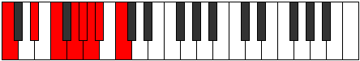 | [midi](https://github.com/edipermadi/music/blob/main/docs/ModeCNaturalSoptian.mid?raw=true) |
| [1963](https://ianring.com/musictheory/scales/1963) | [Ionocryllic](ScaleIonocryllic.md) | [Epocryllic](ModeEpocryllic.md) | C, C#, D#, F, **G**, G#, **A**, A#, C |  | [midi](https://github.com/edipermadi/music/blob/main/docs/ModeCNaturalEpocryllic.mid?raw=true) |
| [1965](https://ianring.com/musictheory/scales/1965) | [Aerycryllic](ScaleAerycryllic.md) | [Gadyllic](ModeGadyllic.md) | C, D, D#, F, G, G#, **A**, A#, C |  | [midi](https://github.com/edipermadi/music/blob/main/docs/ModeCNaturalGadyllic.mid?raw=true) |
| [1967](https://ianring.com/musictheory/scales/1967) | [Aerycrygic](ScaleAerycrygic.md) | [Godygic](ModeGodygic.md) | C, C#, D, D#, F, G, G#, **A**, A#, C |  | [midi](https://github.com/edipermadi/music/blob/main/docs/ModeCNaturalGodygic.mid?raw=true) |
| [1969](https://ianring.com/musictheory/scales/1969) | [Zorian](ScaleZorian.md) | [Zorian](ModeZorian.md) | C, **D##**, E#, **F##**, **G#**, A, Bb, C | 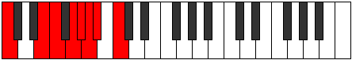 | [midi](https://github.com/edipermadi/music/blob/main/docs/ModeCNaturalZorian.mid?raw=true) |
| [1971](https://ianring.com/musictheory/scales/1971) | [Doptyllic](ScaleDoptyllic.md) | [Aerynyllic](ModeAerynyllic.md) | C, C#, **E**, F, **G**, **G#**, A, A#, C |  | [midi](https://github.com/edipermadi/music/blob/main/docs/ModeCNaturalAerynyllic.mid?raw=true) |
| [1973](https://ianring.com/musictheory/scales/1973) | [Rocryllic](ScaleRocryllic.md) | [Zyryllic](ModeZyryllic.md) | C, D, **E**, F, G, **G#**, A, A#, C |  | [midi](https://github.com/edipermadi/music/blob/main/docs/ModeCNaturalZyryllic.mid?raw=true) |
| [1975](https://ianring.com/musictheory/scales/1975) | [Aeolorygic](ScaleAeolorygic.md) | [Ionocrygic](ModeIonocrygic.md) | C, C#, D, **E**, F, G, **G#**, A, A#, C |  | [midi](https://github.com/edipermadi/music/blob/main/docs/ModeCNaturalIonocrygic.mid?raw=true) |
| [1977](https://ianring.com/musictheory/scales/1977) | [Dagyllic](ScaleDagyllic.md) | [Dagyllic](ModeDagyllic.md) | C, D#, **E**, F, **G**, G#, A, A#, C |  | [midi](https://github.com/edipermadi/music/blob/main/docs/ModeCNaturalDagyllic.mid?raw=true) |
| [1979](https://ianring.com/musictheory/scales/1979) | [Epyrygic](ScaleEpyrygic.md) | [Aeradygic](ModeAeradygic.md) | C, C#, D#, **E**, F, **G**, G#, A, A#, C |  | [midi](https://github.com/edipermadi/music/blob/main/docs/ModeCNaturalAeradygic.mid?raw=true) |
| [1981](https://ianring.com/musictheory/scales/1981) | [Aerycrygic](ScaleAerycrygic.md) | [Gadygic](ModeGadygic.md) | C, D, D#, **E**, F, G, G#, A, A#, C |  | [midi](https://github.com/edipermadi/music/blob/main/docs/ModeCNaturalGadygic.mid?raw=true) |
| [1983](https://ianring.com/musictheory/scales/1983) | [Aerycryllian](ScaleAerycryllian.md) | [Soryllian](ModeSoryllian.md) | C, C#, D, D#, **E**, F, G, G#, A, A#, C |  | [midi](https://github.com/edipermadi/music/blob/main/docs/ModeCNaturalSoryllian.mid?raw=true) |
| [1989](https://ianring.com/musictheory/scales/1989) | [Stanian](ScaleStanian.md) | [Dydian](ModeDydian.md) | C, D, **E##**, F##, **G#**, **A**, **Bb**, C |  | [midi](https://github.com/edipermadi/music/blob/main/docs/ModeCNaturalDydian.mid?raw=true) |
| [1991](https://ianring.com/musictheory/scales/1991) | [Aeoladyllic](ScaleAeoladyllic.md) | [Phryptyllic](ModePhryptyllic.md) | C, C#, D, F#, G, **G#**, **A**, **A#**, C |  | [midi](https://github.com/edipermadi/music/blob/main/docs/ModeCNaturalPhryptyllic.mid?raw=true) |
| [1993](https://ianring.com/musictheory/scales/1993) | [Katoptian](ScaleKatoptian.md) | [Katoptian](ModeKatoptian.md) | C, D#, **E##**, **F##**, G#, **A**, **Bb**, C |  | [midi](https://github.com/edipermadi/music/blob/main/docs/ModeCNaturalKatoptian.mid?raw=true) |
| [1995](https://ianring.com/musictheory/scales/1995) | [Tharyllic](ScaleTharyllic.md) | [Aeolacryllic](ModeAeolacryllic.md) | C, C#, D#, F#, **G**, G#, **A**, **A#**, C |  | [midi](https://github.com/edipermadi/music/blob/main/docs/ModeCNaturalAeolacryllic.mid?raw=true) |
| [1997](https://ianring.com/musictheory/scales/1997) | [Gythyllic](ScaleGythyllic.md) | [Staryllic](ModeStaryllic.md) | C, D, D#, **F#**, G, G#, **A**, **A#**, C |  | [midi](https://github.com/edipermadi/music/blob/main/docs/ModeCNaturalStaryllic.mid?raw=true) |
| [1999](https://ianring.com/musictheory/scales/1999) | [Dycrygic](ScaleDycrygic.md) | [Zacrygic](ModeZacrygic.md) | C, C#, D, D#, F#, G, G#, **A**, **A#**, C |  | [midi](https://github.com/edipermadi/music/blob/main/docs/ModeCNaturalZacrygic.mid?raw=true) |
| [2001](https://ianring.com/musictheory/scales/2001) | [Gydian](ScaleGydian.md) | [Gydian](ModeGydian.md) | C, **D##**, **E##**, **F##**, **G#**, A, **Bb**, C |  | [midi](https://github.com/edipermadi/music/blob/main/docs/ModeCNaturalGydian.mid?raw=true) |
| [2003](https://ianring.com/musictheory/scales/2003) | [Aeronyllic](ScaleAeronyllic.md) | [Lolyllic](ModeLolyllic.md) | C, C#, **E**, F#, **G**, **G#**, A, **A#**, C |  | [midi](https://github.com/edipermadi/music/blob/main/docs/ModeCNaturalLolyllic.mid?raw=true) |
| [2005](https://ianring.com/musictheory/scales/2005) | [Thyryllic](ScaleThyryllic.md) | [Gygyllic](ModeGygyllic.md) | C, D, **E**, **F#**, G, **G#**, A, **A#**, C |  | [midi](https://github.com/edipermadi/music/blob/main/docs/ModeCNaturalGygyllic.mid?raw=true) |
| [2007](https://ianring.com/musictheory/scales/2007) | [Kaptygic](ScaleKaptygic.md) | [Stonygic](ModeStonygic.md) | C, C#, D, **E**, F#, G, **G#**, A, **A#**, C |  | [midi](https://github.com/edipermadi/music/blob/main/docs/ModeCNaturalStonygic.mid?raw=true) |
| [2009](https://ianring.com/musictheory/scales/2009) | [Stacryllic](ScaleStacryllic.md) | [Stacryllic](ModeStacryllic.md) | C, D#, **E**, **F#**, **G**, G#, A, **A#**, C |  | [midi](https://github.com/edipermadi/music/blob/main/docs/ModeCNaturalStacryllic.mid?raw=true) |
| [2011](https://ianring.com/musictheory/scales/2011) | [Koptygic](ScaleKoptygic.md) | [Raphygic](ModeRaphygic.md) | C, C#, D#, **E**, F#, **G**, G#, A, **A#**, C |  | [midi](https://github.com/edipermadi/music/blob/main/docs/ModeCNaturalRaphygic.mid?raw=true) |
| [2013](https://ianring.com/musictheory/scales/2013) | [Porygic](ScalePorygic.md) | [Mocrygic](ModeMocrygic.md) | C, D, D#, **E**, **F#**, G, G#, A, **A#**, C |  | [midi](https://github.com/edipermadi/music/blob/main/docs/ModeCNaturalMocrygic.mid?raw=true) |
| [2015](https://ianring.com/musictheory/scales/2015) | [Thydyllian](ScaleThydyllian.md) | [Epiryllian](ModeEpiryllian.md) | C, C#, D, D#, **E**, F#, G, G#, A, **A#**, C |  | [midi](https://github.com/edipermadi/music/blob/main/docs/ModeCNaturalEpiryllian.mid?raw=true) |
| [2019](https://ianring.com/musictheory/scales/2019) | [Phroryllic](ScalePhroryllic.md) | [Palyllic](ModePalyllic.md) | C, C#, F, F#, **G**, **G#**, **A**, A#, C |  | [midi](https://github.com/edipermadi/music/blob/main/docs/ModeCNaturalPalyllic.mid?raw=true) |
| [2021](https://ianring.com/musictheory/scales/2021) | [Kataryllic](ScaleKataryllic.md) | [Katycryllic](ModeKatycryllic.md) | C, D, F, **F#**, G, **G#**, **A**, A#, C | 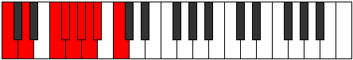 | [midi](https://github.com/edipermadi/music/blob/main/docs/ModeCNaturalKatycryllic.mid?raw=true) |
| [2023](https://ianring.com/musictheory/scales/2023) | [Loptygic](ScaleLoptygic.md) | [Zodygic](ModeZodygic.md) | C, C#, D, F, F#, G, **G#**, **A**, A#, C |  | [midi](https://github.com/edipermadi/music/blob/main/docs/ModeCNaturalZodygic.mid?raw=true) |
| [2025](https://ianring.com/musictheory/scales/2025) | [Mixolydyllic](ScaleMixolydyllic.md) | [Mixolydyllic](ModeMixolydyllic.md) | C, D#, F, **F#**, **G**, G#, **A**, A#, C |  | [midi](https://github.com/edipermadi/music/blob/main/docs/ModeCNaturalMixolydyllic.mid?raw=true) |
| [2027](https://ianring.com/musictheory/scales/2027) | [Apinygic](ScaleApinygic.md) | [Boptygic](ModeBoptygic.md) | C, C#, D#, F, F#, **G**, G#, **A**, A#, C | 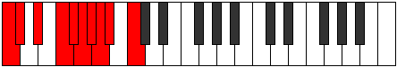 | [midi](https://github.com/edipermadi/music/blob/main/docs/ModeCNaturalBoptygic.mid?raw=true) |
| [2029](https://ianring.com/musictheory/scales/2029) | [Bagygic](ScaleBagygic.md) | [Mathygic](ModeMathygic.md) | C, D, D#, F, **F#**, G, G#, **A**, A#, C |  | [midi](https://github.com/edipermadi/music/blob/main/docs/ModeCNaturalMathygic.mid?raw=true) |
| [2031](https://ianring.com/musictheory/scales/2031) | [Aerycryllian](ScaleAerycryllian.md) | [Gadyllian](ModeGadyllian.md) | C, C#, D, D#, F, F#, G, G#, **A**, A#, C |  | [midi](https://github.com/edipermadi/music/blob/main/docs/ModeCNaturalGadyllian.mid?raw=true) |
| [2033](https://ianring.com/musictheory/scales/2033) | [Stolyllic](ScaleStolyllic.md) | [Stolyllic](ModeStolyllic.md) | C, **E**, F, **F#**, **G**, **G#**, A, A#, C |  | [midi](https://github.com/edipermadi/music/blob/main/docs/ModeCNaturalStolyllic.mid?raw=true) |
| [2035](https://ianring.com/musictheory/scales/2035) | [Zothygic](ScaleZothygic.md) | [Aerythygic](ModeAerythygic.md) | C, C#, **E**, F, F#, **G**, **G#**, A, A#, C |  | [midi](https://github.com/edipermadi/music/blob/main/docs/ModeCNaturalAerythygic.mid?raw=true) |
| [2037](https://ianring.com/musictheory/scales/2037) | [Kyrygic](ScaleKyrygic.md) | [Sythygic](ModeSythygic.md) | C, D, **E**, F, **F#**, G, **G#**, A, A#, C |  | [midi](https://github.com/edipermadi/music/blob/main/docs/ModeCNaturalSythygic.mid?raw=true) |
| [2039](https://ianring.com/musictheory/scales/2039) | [Staptyllian](ScaleStaptyllian.md) | [Danyllian](ModeDanyllian.md) | C, C#, D, **E**, F, F#, G, **G#**, A, A#, C |  | [midi](https://github.com/edipermadi/music/blob/main/docs/ModeCNaturalDanyllian.mid?raw=true) |
| [2041](https://ianring.com/musictheory/scales/2041) | [Aeolacrygic](ScaleAeolacrygic.md) | [Aeolacrygic](ModeAeolacrygic.md) | C, D#, **E**, F, **F#**, **G**, G#, A, A#, C |  | [midi](https://github.com/edipermadi/music/blob/main/docs/ModeCNaturalAeolacrygic.mid?raw=true) |
| [2043](https://ianring.com/musictheory/scales/2043) | [Gothyllian](ScaleGothyllian.md) | [Lythyllian](ModeLythyllian.md) | C, C#, D#, **E**, F, F#, **G**, G#, A, A#, C |  | [midi](https://github.com/edipermadi/music/blob/main/docs/ModeCNaturalLythyllian.mid?raw=true) |
| [2045](https://ianring.com/musictheory/scales/2045) | [Sydyllian](ScaleSydyllian.md) | [Katogyllian](ModeKatogyllian.md) | C, D, D#, **E**, F, **F#**, G, G#, A, A#, C |  | [midi](https://github.com/edipermadi/music/blob/main/docs/ModeCNaturalKatogyllian.mid?raw=true) |
| [2047](https://ianring.com/musictheory/scales/2047) | [Aerycratic](ScaleAerycratic.md) | [Monatic](ModeMonatic.md) | C, C#, D, D#, **E**, F, F#, G, G#, A, A#, C |  | [midi](https://github.com/edipermadi/music/blob/main/docs/ModeCNaturalMonatic.mid?raw=true) |
| [2185](https://ianring.com/musictheory/scales/2185) | [Aeoloric](ScaleAeoloric.md) | [Dygic](ModeDygic.md) | C, **D#**, **G**, **B**, C |  | [midi](https://github.com/edipermadi/music/blob/main/docs/ModeCNaturalDygic.mid?raw=true) |
| [2187](https://ianring.com/musictheory/scales/2187) | [Ranitonic](ScaleRanitonic.md) | [Ionothitonic](ModeIonothitonic.md) | C, **C#**, **D#**, **G**, **B**, C |  | [midi](https://github.com/edipermadi/music/blob/main/docs/ModeCNaturalIonothitonic.mid?raw=true) |
| [2189](https://ianring.com/musictheory/scales/2189) | [Dolitonic](ScaleDolitonic.md) | [Zagitonic](ModeZagitonic.md) | C, **D**, **D#**, G, **B**, C |  | [midi](https://github.com/edipermadi/music/blob/main/docs/ModeCNaturalZagitonic.mid?raw=true) |
| [2191](https://ianring.com/musictheory/scales/2191) | [Ponimic](ScalePonimic.md) | [Thydimic](ModeThydimic.md) | C, **Db**, **Ebb**, **Fbb**, G, **A##**, C |  | [midi](https://github.com/edipermadi/music/blob/main/docs/ModeCNaturalThydimic.mid?raw=true) |
| [2193](https://ianring.com/musictheory/scales/2193) | [Thaptic](ScaleThaptic.md) | [Thaptic](ModeThaptic.md) | C, E, **G**, **B**, C |  | [midi](https://github.com/edipermadi/music/blob/main/docs/ModeCNaturalThaptic.mid?raw=true) |
| [2195](https://ianring.com/musictheory/scales/2195) | [Ionyptitonic](ScaleIonyptitonic.md) | [Zalitonic](ModeZalitonic.md) | C, **C#**, E, **G**, **B**, C |  | [midi](https://github.com/edipermadi/music/blob/main/docs/ModeCNaturalZalitonic.mid?raw=true) |
| [2197](https://ianring.com/musictheory/scales/2197) | [Lothitonic](ScaleLothitonic.md) | [Aerathitonic](ModeAerathitonic.md) | C, **D**, E, G, **B**, C |  | [midi](https://github.com/edipermadi/music/blob/main/docs/ModeCNaturalAerathitonic.mid?raw=true) |
| [2199](https://ianring.com/musictheory/scales/2199) | [Kytrimic](ScaleKytrimic.md) | [Dyptimic](ModeDyptimic.md) | C, **Db**, **Ebb**, Fb, G, **A##**, C |  | [midi](https://github.com/edipermadi/music/blob/main/docs/ModeCNaturalDyptimic.mid?raw=true) |
| [2201](https://ianring.com/musictheory/scales/2201) | [Zothitonic](ScaleZothitonic.md) | [Ionagitonic](ModeIonagitonic.md) | C, **D#**, E, **G**, **B**, C |  | [midi](https://github.com/edipermadi/music/blob/main/docs/ModeCNaturalIonagitonic.mid?raw=true) |
| [2203](https://ianring.com/musictheory/scales/2203) | [Aerothimic](ScaleAerothimic.md) | [Dorimic](ModeDorimic.md) | C, **Db**, **Eb**, Fb, **G**, **A##**, C |  | [midi](https://github.com/edipermadi/music/blob/main/docs/ModeCNaturalDorimic.mid?raw=true) |
| [2205](https://ianring.com/musictheory/scales/2205) | [Syrimic](ScaleSyrimic.md) | [Ionocrimic](ModeIonocrimic.md) | C, **D**, **Eb**, Fb, G, **A##**, C |  | [midi](https://github.com/edipermadi/music/blob/main/docs/ModeCNaturalIonocrimic.mid?raw=true) |
| [2207](https://ianring.com/musictheory/scales/2207) | [Katyptian](ScaleKatyptian.md) | [Mygian](ModeMygian.md) | C, **Db**, **Ebb**, **Fbb**, Gbbb, Abb, **B**, C |  | [midi](https://github.com/edipermadi/music/blob/main/docs/ModeCNaturalMygian.mid?raw=true) |
| [2211](https://ianring.com/musictheory/scales/2211) | [Zathitonic](ScaleZathitonic.md) | [Ionythitonic](ModeIonythitonic.md) | C, **C#**, F, **G**, **B**, C |  | [midi](https://github.com/edipermadi/music/blob/main/docs/ModeCNaturalIonythitonic.mid?raw=true) |
| [2213](https://ianring.com/musictheory/scales/2213) | [Aeracritonic](ScaleAeracritonic.md) | [Daritonic](ModeDaritonic.md) | C, **D**, F, G, **B**, C |  | [midi](https://github.com/edipermadi/music/blob/main/docs/ModeCNaturalDaritonic.mid?raw=true) |
| [2215](https://ianring.com/musictheory/scales/2215) | [Pynimic](ScalePynimic.md) | [Ranimic](ModeRanimic.md) | C, **Db**, **Ebb**, F, G, **A##**, C |  | [midi](https://github.com/edipermadi/music/blob/main/docs/ModeCNaturalRanimic.mid?raw=true) |
| [2217](https://ianring.com/musictheory/scales/2217) | [Epygitonic](ScaleEpygitonic.md) | [Kagitonic](ModeKagitonic.md) | C, **D#**, F, **G**, **B**, C |  | [midi](https://github.com/edipermadi/music/blob/main/docs/ModeCNaturalKagitonic.mid?raw=true) |
| [2219](https://ianring.com/musictheory/scales/2219) | [Mycrimic](ScaleMycrimic.md) | [Phrydimic](ModePhrydimic.md) | C, **Db**, **Eb**, F, **G**, **A##**, C |  | [midi](https://github.com/edipermadi/music/blob/main/docs/ModeCNaturalPhrydimic.mid?raw=true) |
| [2221](https://ianring.com/musictheory/scales/2221) | [Modimic](ScaleModimic.md) | [Poptimic](ModePoptimic.md) | C, **D**, **Eb**, F, G, **A##**, C |  | [midi](https://github.com/edipermadi/music/blob/main/docs/ModeCNaturalPoptimic.mid?raw=true) |
| [2223](https://ianring.com/musictheory/scales/2223) | [Stanian](ScaleStanian.md) | [Konian](ModeKonian.md) | C, **Db**, **Ebb**, **Fbb**, Gbb, Abb, **B**, C |  | [midi](https://github.com/edipermadi/music/blob/main/docs/ModeCNaturalKonian.mid?raw=true) |
| [2225](https://ianring.com/musictheory/scales/2225) | [Phraditonic](ScalePhraditonic.md) | [Gonitonic](ModeGonitonic.md) | C, E, F, **G**, **B**, C |  | [midi](https://github.com/edipermadi/music/blob/main/docs/ModeCNaturalGonitonic.mid?raw=true) |
| [2227](https://ianring.com/musictheory/scales/2227) | [Bolimic](ScaleBolimic.md) | [Katadimic](ModeKatadimic.md) | C, **Db**, E, F, **G**, **A##**, C |  | [midi](https://github.com/edipermadi/music/blob/main/docs/ModeCNaturalKatadimic.mid?raw=true) |
| [2229](https://ianring.com/musictheory/scales/2229) | [Garimic](ScaleGarimic.md) | [Ionyptimic](ModeIonyptimic.md) | C, **D**, E, F, G, **A##**, C |  | [midi](https://github.com/edipermadi/music/blob/main/docs/ModeCNaturalIonyptimic.mid?raw=true) |
| [2231](https://ianring.com/musictheory/scales/2231) | [Saptian](ScaleSaptian.md) | [Macrian](ModeMacrian.md) | C, **Db**, **Ebb**, Fb, Gbb, Abb, **B**, C |  | [midi](https://github.com/edipermadi/music/blob/main/docs/ModeCNaturalMacrian.mid?raw=true) |
| [2233](https://ianring.com/musictheory/scales/2233) | [Thogimic](ScaleThogimic.md) | [Donimic](ModeDonimic.md) | C, **D#**, E, F, **G**, **A##**, C |  | [midi](https://github.com/edipermadi/music/blob/main/docs/ModeCNaturalDonimic.mid?raw=true) |
| [2235](https://ianring.com/musictheory/scales/2235) | [Katacrian](ScaleKatacrian.md) | [Bathian](ModeBathian.md) | C, **Db**, **Eb**, Fb, Gbb, **Abb**, **B**, C |  | [midi](https://github.com/edipermadi/music/blob/main/docs/ModeCNaturalBathian.mid?raw=true) |
| [2237](https://ianring.com/musictheory/scales/2237) | [Zorian](ScaleZorian.md) | [Epothian](ModeEpothian.md) | C, **D**, **Eb**, Fb, Gbb, Abb, **B**, C |  | [midi](https://github.com/edipermadi/music/blob/main/docs/ModeCNaturalEpothian.mid?raw=true) |
| [2239](https://ianring.com/musictheory/scales/2239) | [Stolyllic](ScaleStolyllic.md) | [Dacryllic](ModeDacryllic.md) | C, **C#**, **D**, **D#**, E, F, G, **B**, C |  | [midi](https://github.com/edipermadi/music/blob/main/docs/ModeCNaturalDacryllic.mid?raw=true) |
| [2245](https://ianring.com/musictheory/scales/2245) | [Phraditonic](ScalePhraditonic.md) | [Dygitonic](ModeDygitonic.md) | C, **D**, **F#**, G, B, C |  | [midi](https://github.com/edipermadi/music/blob/main/docs/ModeCNaturalDygitonic.mid?raw=true) |
| [2247](https://ianring.com/musictheory/scales/2247) | [Daptimic](ScaleDaptimic.md) | [Aeolimic](ModeAeolimic.md) | C, **Db**, **Ebb**, F#, G, A##, C |  | [midi](https://github.com/edipermadi/music/blob/main/docs/ModeCNaturalAeolimic.mid?raw=true) |
| [2249](https://ianring.com/musictheory/scales/2249) | [Lycritonic](ScaleLycritonic.md) | [Kygitonic](ModeKygitonic.md) | C, **D#**, **F#**, **G**, B, C |  | [midi](https://github.com/edipermadi/music/blob/main/docs/ModeCNaturalKygitonic.mid?raw=true) |
| [2251](https://ianring.com/musictheory/scales/2251) | [Kanimic](ScaleKanimic.md) | [Zodimic](ModeZodimic.md) | C, **Db**, **Eb**, F#, **G**, A##, C |  | [midi](https://github.com/edipermadi/music/blob/main/docs/ModeCNaturalZodimic.mid?raw=true) |
| [2253](https://ianring.com/musictheory/scales/2253) | [Laptimic](ScaleLaptimic.md) | [Logimic](ModeLogimic.md) | C, **D**, **Eb**, **F#**, G, A##, C |  | [midi](https://github.com/edipermadi/music/blob/main/docs/ModeCNaturalLogimic.mid?raw=true) |
| [2255](https://ianring.com/musictheory/scales/2255) | [Thycrian](ScaleThycrian.md) | [Dylian](ModeDylian.md) | C, **Db**, **Ebb**, **Fbb**, Gb, Abb, B, C |  | [midi](https://github.com/edipermadi/music/blob/main/docs/ModeCNaturalDylian.mid?raw=true) |
| [2257](https://ianring.com/musictheory/scales/2257) | [Zolitonic](ScaleZolitonic.md) | [Zolitonic](ModeZolitonic.md) | C, E, **F#**, **G**, B, C |  | [midi](https://github.com/edipermadi/music/blob/main/docs/ModeCNaturalZolitonic.mid?raw=true) |
| [2259](https://ianring.com/musictheory/scales/2259) | [Mythimic](ScaleMythimic.md) | [Gogimic](ModeGogimic.md) | C, **Db**, E, F#, **G**, A##, C |  | [midi](https://github.com/edipermadi/music/blob/main/docs/ModeCNaturalGogimic.mid?raw=true) |
| [2261](https://ianring.com/musictheory/scales/2261) | [Bylimic](ScaleBylimic.md) | [Phrolimic](ModePhrolimic.md) | C, **D**, E, **F#**, G, A##, C |  | [midi](https://github.com/edipermadi/music/blob/main/docs/ModeCNaturalPhrolimic.mid?raw=true) |
| [2263](https://ianring.com/musictheory/scales/2263) | [Zogian](ScaleZogian.md) | [Lycrian](ModeLycrian.md) | C, **Db**, **Ebb**, Fb, Gb, Abb, B, C |  | [midi](https://github.com/edipermadi/music/blob/main/docs/ModeCNaturalLycrian.mid?raw=true) |
| [2265](https://ianring.com/musictheory/scales/2265) | [Solimic](ScaleSolimic.md) | [Ionophimic](ModeIonophimic.md) | C, **D#**, E, **F#**, **G**, A##, C |  | [midi](https://github.com/edipermadi/music/blob/main/docs/ModeCNaturalIonophimic.mid?raw=true) |
| [2267](https://ianring.com/musictheory/scales/2267) | [Aeolathian](ScaleAeolathian.md) | [Padian](ModePadian.md) | C, **Db**, **Eb**, Fb, Gb, **Abb**, B, C |  | [midi](https://github.com/edipermadi/music/blob/main/docs/ModeCNaturalPadian.mid?raw=true) |
| [2269](https://ianring.com/musictheory/scales/2269) | [Stythian](ScaleStythian.md) | [Pygian](ModePygian.md) | C, **D**, **Eb**, Fb, **Gb**, Abb, B, C |  | [midi](https://github.com/edipermadi/music/blob/main/docs/ModeCNaturalPygian.mid?raw=true) |
| [2271](https://ianring.com/musictheory/scales/2271) | [Phroryllic](ScalePhroryllic.md) | [Poptyllic](ModePoptyllic.md) | C, **C#**, **D**, **D#**, E, F#, G, B, C |  | [midi](https://github.com/edipermadi/music/blob/main/docs/ModeCNaturalPoptyllic.mid?raw=true) |
| [2275](https://ianring.com/musictheory/scales/2275) | [Thonimic](ScaleThonimic.md) | [Thodimic](ModeThodimic.md) | C, **Db**, E#, F#, **G**, A##, C |  | [midi](https://github.com/edipermadi/music/blob/main/docs/ModeCNaturalThodimic.mid?raw=true) |
| [2277](https://ianring.com/musictheory/scales/2277) | [Epygimic](ScaleEpygimic.md) | [Kagimic](ModeKagimic.md) | C, **D**, E#, **F#**, G, A##, C |  | [midi](https://github.com/edipermadi/music/blob/main/docs/ModeCNaturalKagimic.mid?raw=true) |
| [2279](https://ianring.com/musictheory/scales/2279) | [Aeolacrian](ScaleAeolacrian.md) | [Dyrian](ModeDyrian.md) | C, **Db**, **Ebb**, F, Gb, Abb, B, C |  | [midi](https://github.com/edipermadi/music/blob/main/docs/ModeCNaturalDyrian.mid?raw=true) |
| [2281](https://ianring.com/musictheory/scales/2281) | [Phralimic](ScalePhralimic.md) | [Rathimic](ModeRathimic.md) | C, **D#**, E#, **F#**, **G**, A##, C |  | [midi](https://github.com/edipermadi/music/blob/main/docs/ModeCNaturalRathimic.mid?raw=true) |
| [2283](https://ianring.com/musictheory/scales/2283) | [Thacrian](ScaleThacrian.md) | [Aeolyptian](ModeAeolyptian.md) | C, **Db**, **Eb**, F, Gb, **Abb**, B, C |  | [midi](https://github.com/edipermadi/music/blob/main/docs/ModeCNaturalAeolyptian.mid?raw=true) |
| [2285](https://ianring.com/musictheory/scales/2285) | [Stygian](ScaleStygian.md) | [Aerogian](ModeAerogian.md) | C, **D**, **Eb**, F, **Gb**, Abb, B, C |  | [midi](https://github.com/edipermadi/music/blob/main/docs/ModeCNaturalAerogian.mid?raw=true) |
| [2287](https://ianring.com/musictheory/scales/2287) | [Aeoladyllic](ScaleAeoladyllic.md) | [Lodyllic](ModeLodyllic.md) | C, **C#**, **D**, **D#**, F, F#, G, B, C |  | [midi](https://github.com/edipermadi/music/blob/main/docs/ModeCNaturalLodyllic.mid?raw=true) |
| [2289](https://ianring.com/musictheory/scales/2289) | [Daptimic](ScaleDaptimic.md) | [Mocrimic](ModeMocrimic.md) | C, D##, E#, **F#**, **G**, A##, C |  | [midi](https://github.com/edipermadi/music/blob/main/docs/ModeCNaturalMocrimic.mid?raw=true) |
| [2291](https://ianring.com/musictheory/scales/2291) | [Ionarian](ScaleIonarian.md) | [Zydian](ModeZydian.md) | C, **Db**, E, F, Gb, **Abb**, B, C |  | [midi](https://github.com/edipermadi/music/blob/main/docs/ModeCNaturalZydian.mid?raw=true) |
| [2293](https://ianring.com/musictheory/scales/2293) | [Ionythian](ScaleIonythian.md) | [Gorian](ModeGorian.md) | C, **D**, E, F, **Gb**, Abb, B, C |  | [midi](https://github.com/edipermadi/music/blob/main/docs/ModeCNaturalGorian.mid?raw=true) |
| [2295](https://ianring.com/musictheory/scales/2295) | [Pynyllic](ScalePynyllic.md) | [Kogyllic](ModeKogyllic.md) | C, **C#**, **D**, E, F, F#, G, B, C |  | [midi](https://github.com/edipermadi/music/blob/main/docs/ModeCNaturalKogyllic.mid?raw=true) |
| [2297](https://ianring.com/musictheory/scales/2297) | [Parian](ScaleParian.md) | [Thylian](ModeThylian.md) | C, **D#**, E, F, **Gb**, **Abb**, B, C |  | [midi](https://github.com/edipermadi/music/blob/main/docs/ModeCNaturalThylian.mid?raw=true) |
| [2299](https://ianring.com/musictheory/scales/2299) | [Thagyllic](ScaleThagyllic.md) | [Phraptyllic](ModePhraptyllic.md) | C, **C#**, **D#**, E, F, F#, **G**, B, C |  | [midi](https://github.com/edipermadi/music/blob/main/docs/ModeCNaturalPhraptyllic.mid?raw=true) |
| [2301](https://ianring.com/musictheory/scales/2301) | [Dolyllic](ScaleDolyllic.md) | [Bydyllic](ModeBydyllic.md) | C, **D**, **D#**, E, F, **F#**, G, B, C |  | [midi](https://github.com/edipermadi/music/blob/main/docs/ModeCNaturalBydyllic.mid?raw=true) |
| [2303](https://ianring.com/musictheory/scales/2303) | [Manygic](ScaleManygic.md) | [Stanygic](ModeStanygic.md) | C, **C#**, **D**, **D#**, E, F, F#, G, B, C |  | [midi](https://github.com/edipermadi/music/blob/main/docs/ModeCNaturalStanygic.mid?raw=true) |
| [2321](https://ianring.com/musictheory/scales/2321) | [Zyphic](ScaleZyphic.md) | [Zyphic](ModeZyphic.md) | **C**, E, **G#**, **B**, **C** |  | [midi](https://github.com/edipermadi/music/blob/main/docs/ModeCNaturalZyphic.mid?raw=true) |
| [2323](https://ianring.com/musictheory/scales/2323) | [Aeolyritonic](ScaleAeolyritonic.md) | [Doptitonic](ModeDoptitonic.md) | **C**, C#, E, **G#**, **B**, **C** |  | [midi](https://github.com/edipermadi/music/blob/main/docs/ModeCNaturalDoptitonic.mid?raw=true) |
| [2325](https://ianring.com/musictheory/scales/2325) | [Ryphitonic](ScaleRyphitonic.md) | [Pynitonic](ModePynitonic.md) | **C**, **D**, E, **G#**, **B**, **C** |  | [midi](https://github.com/edipermadi/music/blob/main/docs/ModeCNaturalPynitonic.mid?raw=true) |
| [2327](https://ianring.com/musictheory/scales/2327) | [Galimic](ScaleGalimic.md) | [Epalimic](ModeEpalimic.md) | **C**, Db, **Ebb**, Fb, **G#**, **A##**, **C** |  | [midi](https://github.com/edipermadi/music/blob/main/docs/ModeCNaturalEpalimic.mid?raw=true) |
| [2329](https://ianring.com/musictheory/scales/2329) | [Zacritonic](ScaleZacritonic.md) | [Styditonic](ModeStyditonic.md) | **C**, **D#**, E, G#, **B**, **C** |  | [midi](https://github.com/edipermadi/music/blob/main/docs/ModeCNaturalStyditonic.mid?raw=true) |
| [2331](https://ianring.com/musictheory/scales/2331) | [Bygimic](ScaleBygimic.md) | [Dylimic](ModeDylimic.md) | **C**, Db, **Eb**, Fb, G#, **A##**, **C** |  | [midi](https://github.com/edipermadi/music/blob/main/docs/ModeCNaturalDylimic.mid?raw=true) |
| [2333](https://ianring.com/musictheory/scales/2333) | [Lathimic](ScaleLathimic.md) | [Stynimic](ModeStynimic.md) | **C**, **D**, **Eb**, Fb, G#, **A##**, **C** |  | [midi](https://github.com/edipermadi/music/blob/main/docs/ModeCNaturalStynimic.mid?raw=true) |
| [2335](https://ianring.com/musictheory/scales/2335) | [Thadian](ScaleThadian.md) | [Epydian](ModeEpydian.md) | **C**, Db, **Ebb**, **Fbb**, Gbbb, Ab, **B**, **C** |  | [midi](https://github.com/edipermadi/music/blob/main/docs/ModeCNaturalEpydian.mid?raw=true) |
| [2339](https://ianring.com/musictheory/scales/2339) | [Molitonic](ScaleMolitonic.md) | [Ragitonic](ModeRagitonic.md) | **C**, C#, F, **G#**, **B**, **C** |  | [midi](https://github.com/edipermadi/music/blob/main/docs/ModeCNaturalRagitonic.mid?raw=true) |
| [2341](https://ianring.com/musictheory/scales/2341) | [Thyritonic](ScaleThyritonic.md) | [Myditonic](ModeMyditonic.md) | **C**, **D**, F, **G#**, **B**, **C** |  | [midi](https://github.com/edipermadi/music/blob/main/docs/ModeCNaturalMyditonic.mid?raw=true) |
| [2343](https://ianring.com/musictheory/scales/2343) | [Epynimic](ScaleEpynimic.md) | [Tharimic](ModeTharimic.md) | **C**, Db, **Ebb**, F, **G#**, **A##**, **C** |  | [midi](https://github.com/edipermadi/music/blob/main/docs/ModeCNaturalTharimic.mid?raw=true) |
| [2345](https://ianring.com/musictheory/scales/2345) | [Lyditonic](ScaleLyditonic.md) | [Gothitonic](ModeGothitonic.md) | **C**, **D#**, F, G#, **B**, **C** |  | [midi](https://github.com/edipermadi/music/blob/main/docs/ModeCNaturalGothitonic.mid?raw=true) |
| [2347](https://ianring.com/musictheory/scales/2347) | [Zagimic](ScaleZagimic.md) | [Thothimic](ModeThothimic.md) | **C**, Db, **Eb**, F, G#, **A##**, **C** |  | [midi](https://github.com/edipermadi/music/blob/main/docs/ModeCNaturalThothimic.mid?raw=true) |
| [2349](https://ianring.com/musictheory/scales/2349) | [Thalimic](ScaleThalimic.md) | [Aerogimic](ModeAerogimic.md) | **C**, **D**, **Eb**, F, G#, **A##**, **C** | 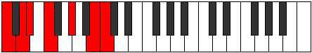 | [midi](https://github.com/edipermadi/music/blob/main/docs/ModeCNaturalAerogimic.mid?raw=true) |
| [2351](https://ianring.com/musictheory/scales/2351) | [Katoptian](ScaleKatoptian.md) | [Gynian](ModeGynian.md) | **C**, Db, **Ebb**, **Fbb**, Gbb, Ab, **B**, **C** |  | [midi](https://github.com/edipermadi/music/blob/main/docs/ModeCNaturalGynian.mid?raw=true) |
| [2353](https://ianring.com/musictheory/scales/2353) | [Lycritonic](ScaleLycritonic.md) | [Lycritonic](ModeLycritonic.md) | **C**, E, F, **G#**, **B**, **C** | 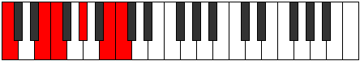 | [midi](https://github.com/edipermadi/music/blob/main/docs/ModeCNaturalLycritonic.mid?raw=true) |
| [2355](https://ianring.com/musictheory/scales/2355) | [Mydimic](ScaleMydimic.md) | [Katycrimic](ModeKatycrimic.md) | **C**, Db, E, F, **G#**, **A##**, **C** |  | [midi](https://github.com/edipermadi/music/blob/main/docs/ModeCNaturalKatycrimic.mid?raw=true) |
| [2357](https://ianring.com/musictheory/scales/2357) | [Dagimic](ScaleDagimic.md) | [Ionaptimic](ModeIonaptimic.md) | **C**, **D**, E, F, **G#**, **A##**, **C** |  | [midi](https://github.com/edipermadi/music/blob/main/docs/ModeCNaturalIonaptimic.mid?raw=true) |
| [2359](https://ianring.com/musictheory/scales/2359) | [Gacrian](ScaleGacrian.md) | [Gadian](ModeGadian.md) | **C**, Db, **Ebb**, Fb, Gbb, **Ab**, **B**, **C** |  | [midi](https://github.com/edipermadi/music/blob/main/docs/ModeCNaturalGadian.mid?raw=true) |
| [2361](https://ianring.com/musictheory/scales/2361) | [Ionodimic](ScaleIonodimic.md) | [Docrimic](ModeDocrimic.md) | **C**, **D#**, E, F, G#, **A##**, **C** |  | [midi](https://github.com/edipermadi/music/blob/main/docs/ModeCNaturalDocrimic.mid?raw=true) |
| [2363](https://ianring.com/musictheory/scales/2363) | [Stalian](ScaleStalian.md) | [Kataptian](ModeKataptian.md) | **C**, Db, **Eb**, Fb, Gbb, Ab, **B**, **C** |  | [midi](https://github.com/edipermadi/music/blob/main/docs/ModeCNaturalKataptian.mid?raw=true) |
| [2365](https://ianring.com/musictheory/scales/2365) | [Epagian](ScaleEpagian.md) | [Sythian](ModeSythian.md) | **C**, **D**, **Eb**, Fb, Gbb, Ab, **B**, **C** | 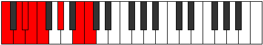 | [midi](https://github.com/edipermadi/music/blob/main/docs/ModeCNaturalSythian.mid?raw=true) |
| [2367](https://ianring.com/musictheory/scales/2367) | [Zaryllic](ScaleZaryllic.md) | [Laryllic](ModeLaryllic.md) | **C**, C#, **D**, **D#**, E, F, G#, **B**, **C** |  | [midi](https://github.com/edipermadi/music/blob/main/docs/ModeCNaturalLaryllic.mid?raw=true) |
| [2373](https://ianring.com/musictheory/scales/2373) | [Phronitonic](ScalePhronitonic.md) | [Dyptitonic](ModeDyptitonic.md) | **C**, **D**, **F#**, **G#**, B, **C** |  | [midi](https://github.com/edipermadi/music/blob/main/docs/ModeCNaturalDyptitonic.mid?raw=true) |
| [2375](https://ianring.com/musictheory/scales/2375) | [Stalimic](ScaleStalimic.md) | [Aeolaptimic](ModeAeolaptimic.md) | **C**, Db, **Ebb**, F#, **G#**, A##, **C** |  | [midi](https://github.com/edipermadi/music/blob/main/docs/ModeCNaturalAeolaptimic.mid?raw=true) |
| [2377](https://ianring.com/musictheory/scales/2377) | [Thoditonic](ScaleThoditonic.md) | [Thoditonic](ModeThoditonic.md) | **C**, **D#**, **F#**, G#, B, **C** | 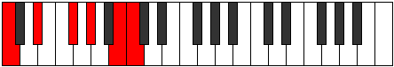 | [midi](https://github.com/edipermadi/music/blob/main/docs/ModeCNaturalThoditonic.mid?raw=true) |
| [2379](https://ianring.com/musictheory/scales/2379) | [Ionacrimic](ScaleIonacrimic.md) | [Stathimic](ModeStathimic.md) | **C**, Db, **Eb**, F#, G#, A##, **C** |  | [midi](https://github.com/edipermadi/music/blob/main/docs/ModeCNaturalStathimic.mid?raw=true) |
| [2381](https://ianring.com/musictheory/scales/2381) | [Stythimic](ScaleStythimic.md) | [Sorimic](ModeSorimic.md) | **C**, **D**, **Eb**, **F#**, G#, A##, **C** |  | [midi](https://github.com/edipermadi/music/blob/main/docs/ModeCNaturalSorimic.mid?raw=true) |
| [2383](https://ianring.com/musictheory/scales/2383) | [Morian](ScaleMorian.md) | [Katorian](ModeKatorian.md) | **C**, Db, **Ebb**, **Fbb**, Gb, Ab, B, **C** |  | [midi](https://github.com/edipermadi/music/blob/main/docs/ModeCNaturalKatorian.mid?raw=true) |
| [2385](https://ianring.com/musictheory/scales/2385) | [Aeolanitonic](ScaleAeolanitonic.md) | [Aeolanitonic](ModeAeolanitonic.md) | **C**, E, **F#**, **G#**, B, **C** |  | [midi](https://github.com/edipermadi/music/blob/main/docs/ModeCNaturalAeolanitonic.mid?raw=true) |
| [2387](https://ianring.com/musictheory/scales/2387) | [Dalimic](ScaleDalimic.md) | [Paptimic](ModePaptimic.md) | **C**, Db, E, F#, **G#**, A##, **C** | 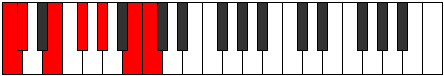 | [midi](https://github.com/edipermadi/music/blob/main/docs/ModeCNaturalPaptimic.mid?raw=true) |
| [2389](https://ianring.com/musictheory/scales/2389) | [Boptimic](ScaleBoptimic.md) | [Thynimic](ModeThynimic.md) | **C**, **D**, E, **F#**, **G#**, A##, **C** |  | [midi](https://github.com/edipermadi/music/blob/main/docs/ModeCNaturalThynimic.mid?raw=true) |
| [2391](https://ianring.com/musictheory/scales/2391) | [Pagian](ScalePagian.md) | [Molian](ModeMolian.md) | **C**, Db, **Ebb**, Fb, Gb, **Ab**, B, **C** |  | [midi](https://github.com/edipermadi/music/blob/main/docs/ModeCNaturalMolian.mid?raw=true) |
| [2393](https://ianring.com/musictheory/scales/2393) | [Dynimic](ScaleDynimic.md) | [Zathimic](ModeZathimic.md) | **C**, **D#**, E, **F#**, G#, A##, **C** |  | [midi](https://github.com/edipermadi/music/blob/main/docs/ModeCNaturalZathimic.mid?raw=true) |
| [2395](https://ianring.com/musictheory/scales/2395) | [Aerathian](ScaleAerathian.md) | [Zoptian](ModeZoptian.md) | **C**, Db, **Eb**, Fb, Gb, Ab, B, **C** |  | [midi](https://github.com/edipermadi/music/blob/main/docs/ModeCNaturalZoptian.mid?raw=true) |
| [2397](https://ianring.com/musictheory/scales/2397) | [Ionanian](ScaleIonanian.md) | [Stagian](ModeStagian.md) | **C**, **D**, **Eb**, Fb, **Gb**, Ab, B, **C** |  | [midi](https://github.com/edipermadi/music/blob/main/docs/ModeCNaturalStagian.mid?raw=true) |
| [2399](https://ianring.com/musictheory/scales/2399) | [Kataryllic](ScaleKataryllic.md) | [Zanyllic](ModeZanyllic.md) | **C**, C#, **D**, **D#**, E, F#, G#, B, **C** |  | [midi](https://github.com/edipermadi/music/blob/main/docs/ModeCNaturalZanyllic.mid?raw=true) |
| [2403](https://ianring.com/musictheory/scales/2403) | [Epygimic](ScaleEpygimic.md) | [Lycrimic](ModeLycrimic.md) | **C**, Db, E#, F#, **G#**, A##, **C** |  | [midi](https://github.com/edipermadi/music/blob/main/docs/ModeCNaturalLycrimic.mid?raw=true) |
| [2405](https://ianring.com/musictheory/scales/2405) | [Lythimic](ScaleLythimic.md) | [Katalimic](ModeKatalimic.md) | **C**, **D**, E#, **F#**, **G#**, A##, **C** |  | [midi](https://github.com/edipermadi/music/blob/main/docs/ModeCNaturalKatalimic.mid?raw=true) |
| [2407](https://ianring.com/musictheory/scales/2407) | [Ranian](ScaleRanian.md) | [Zylian](ModeZylian.md) | **C**, Db, **Ebb**, F, Gb, **Ab**, B, **C** |  | [midi](https://github.com/edipermadi/music/blob/main/docs/ModeCNaturalZylian.mid?raw=true) |
| [2409](https://ianring.com/musictheory/scales/2409) | [Zacrimic](ScaleZacrimic.md) | [Zacrimic](ModeZacrimic.md) | **C**, **D#**, E#, **F#**, G#, A##, **C** |  | [midi](https://github.com/edipermadi/music/blob/main/docs/ModeCNaturalZacrimic.mid?raw=true) |
| [2411](https://ianring.com/musictheory/scales/2411) | [Ionycrian](ScaleIonycrian.md) | [Aeolorian](ModeAeolorian.md) | **C**, Db, **Eb**, F, Gb, Ab, B, **C** |  | [midi](https://github.com/edipermadi/music/blob/main/docs/ModeCNaturalAeolorian.mid?raw=true) |
| [2413](https://ianring.com/musictheory/scales/2413) | [Mycrian](ScaleMycrian.md) | [Phrydian](ModePhrydian.md) | **C**, **D**, **Eb**, F, **Gb**, Ab, B, **C** |  | [midi](https://github.com/edipermadi/music/blob/main/docs/ModeCNaturalPhrydian.mid?raw=true) |
| [2415](https://ianring.com/musictheory/scales/2415) | [Tharyllic](ScaleTharyllic.md) | [Lothyllic](ModeLothyllic.md) | **C**, C#, **D**, **D#**, F, F#, G#, B, **C** |  | [midi](https://github.com/edipermadi/music/blob/main/docs/ModeCNaturalLothyllic.mid?raw=true) |
| [2417](https://ianring.com/musictheory/scales/2417) | [Kanimic](ScaleKanimic.md) | [Kanimic](ModeKanimic.md) | **C**, D##, E#, **F#**, **G#**, A##, **C** |  | [midi](https://github.com/edipermadi/music/blob/main/docs/ModeCNaturalKanimic.mid?raw=true) |
| [2419](https://ianring.com/musictheory/scales/2419) | [Epogian](ScaleEpogian.md) | [Paptian](ModePaptian.md) | **C**, Db, E, F, Gb, **Ab**, B, **C** |  | [midi](https://github.com/edipermadi/music/blob/main/docs/ModeCNaturalPaptian.mid?raw=true) |
| [2421](https://ianring.com/musictheory/scales/2421) | [Korian](ScaleKorian.md) | [Malian](ModeMalian.md) | **C**, **D**, E, F, **Gb**, **Ab**, B, **C** |  | [midi](https://github.com/edipermadi/music/blob/main/docs/ModeCNaturalMalian.mid?raw=true) |
| [2423](https://ianring.com/musictheory/scales/2423) | [Zagyllic](ScaleZagyllic.md) | [Thorcryllic](ModeThorcryllic.md) | **C**, C#, **D**, E, F, F#, **G#**, B, **C** |  | [midi](https://github.com/edipermadi/music/blob/main/docs/ModeCNaturalThorcryllic.mid?raw=true) |
| [2425](https://ianring.com/musictheory/scales/2425) | [Zarian](ScaleZarian.md) | [Rorian](ModeRorian.md) | **C**, **D#**, E, F, **Gb**, Ab, B, **C** |  | [midi](https://github.com/edipermadi/music/blob/main/docs/ModeCNaturalRorian.mid?raw=true) |
| [2427](https://ianring.com/musictheory/scales/2427) | [Dagyllic](ScaleDagyllic.md) | [Katoryllic](ModeKatoryllic.md) | **C**, C#, **D#**, E, F, F#, G#, B, **C** |  | [midi](https://github.com/edipermadi/music/blob/main/docs/ModeCNaturalKatoryllic.mid?raw=true) |
| [2429](https://ianring.com/musictheory/scales/2429) | [Stacryllic](ScaleStacryllic.md) | [Kadyllic](ModeKadyllic.md) | **C**, **D**, **D#**, E, F, **F#**, G#, B, **C** |  | [midi](https://github.com/edipermadi/music/blob/main/docs/ModeCNaturalKadyllic.mid?raw=true) |
| [2431](https://ianring.com/musictheory/scales/2431) | [Aeolacrygic](ScaleAeolacrygic.md) | [Gythygic](ModeGythygic.md) | **C**, C#, **D**, **D#**, E, F, F#, G#, B, **C** |  | [midi](https://github.com/edipermadi/music/blob/main/docs/ModeCNaturalGythygic.mid?raw=true) |
| [2441](https://ianring.com/musictheory/scales/2441) | [Zothitonic](ScaleZothitonic.md) | [Kyritonic](ModeKyritonic.md) | C, **D#**, **G**, G#, **B**, C | 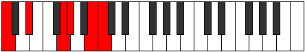 | [midi](https://github.com/edipermadi/music/blob/main/docs/ModeCNaturalKyritonic.mid?raw=true) |
| [2443](https://ianring.com/musictheory/scales/2443) | [Thogimic](ScaleThogimic.md) | [Panimic](ModePanimic.md) | C, Db, **Eb**, **F##**, G#, **A##**, C |  | [midi](https://github.com/edipermadi/music/blob/main/docs/ModeCNaturalPanimic.mid?raw=true) |
| [2445](https://ianring.com/musictheory/scales/2445) | [Solimic](ScaleSolimic.md) | [Zadimic](ModeZadimic.md) | C, **D**, **Eb**, F##, G#, **A##**, C |  | [midi](https://github.com/edipermadi/music/blob/main/docs/ModeCNaturalZadimic.mid?raw=true) |
| [2447](https://ianring.com/musictheory/scales/2447) | [Parian](ScaleParian.md) | [Thagian](ModeThagian.md) | C, Db, **Ebb**, **Fbb**, G, Ab, **B**, C |  | [midi](https://github.com/edipermadi/music/blob/main/docs/ModeCNaturalThagian.mid?raw=true) |
| [2449](https://ianring.com/musictheory/scales/2449) | [Zacritonic](ScaleZacritonic.md) | [Zacritonic](ModeZacritonic.md) | C, E, **G**, **G#**, **B**, C |  | [midi](https://github.com/edipermadi/music/blob/main/docs/ModeCNaturalZacritonic.mid?raw=true) |
| [2451](https://ianring.com/musictheory/scales/2451) | [Ionodimic](ScaleIonodimic.md) | [Aerynimic](ModeAerynimic.md) | C, Db, E, **F##**, **G#**, **A##**, C |  | [midi](https://github.com/edipermadi/music/blob/main/docs/ModeCNaturalAerynimic.mid?raw=true) |
| [2453](https://ianring.com/musictheory/scales/2453) | [Dynimic](ScaleDynimic.md) | [Stonimic](ModeStonimic.md) | C, **D**, E, F##, **G#**, **A##**, C |  | [midi](https://github.com/edipermadi/music/blob/main/docs/ModeCNaturalStonimic.mid?raw=true) |
| [2455](https://ianring.com/musictheory/scales/2455) | [Zarian](ScaleZarian.md) | [Bothian](ModeBothian.md) | C, Db, **Ebb**, Fb, G, **Ab**, **B**, C |  | [midi](https://github.com/edipermadi/music/blob/main/docs/ModeCNaturalBothian.mid?raw=true) |
| [2457](https://ianring.com/musictheory/scales/2457) | [Ionythimic](ScaleIonythimic.md) | [Ionythimic](ModeIonythimic.md) | C, **D#**, E, **F##**, G#, **A##**, C |  | [midi](https://github.com/edipermadi/music/blob/main/docs/ModeCNaturalIonythimic.mid?raw=true) |
| [2459](https://ianring.com/musictheory/scales/2459) | [Tholian](ScaleTholian.md) | [Ionocrian](ModeIonocrian.md) | C, Db, **Eb**, Fb, **G**, Ab, **B**, C |  | [midi](https://github.com/edipermadi/music/blob/main/docs/ModeCNaturalIonocrian.mid?raw=true) |
| [2461](https://ianring.com/musictheory/scales/2461) | [Katathian](ScaleKatathian.md) | [Sagian](ModeSagian.md) | C, **D**, **Eb**, Fb, G, Ab, **B**, C |  | [midi](https://github.com/edipermadi/music/blob/main/docs/ModeCNaturalSagian.mid?raw=true) |
| [2463](https://ianring.com/musictheory/scales/2463) | [Ioniptyllic](ScaleIoniptyllic.md) | [Ionathyllic](ModeIonathyllic.md) | C, C#, **D**, **D#**, E, G, G#, **B**, C |  | [midi](https://github.com/edipermadi/music/blob/main/docs/ModeCNaturalIonathyllic.mid?raw=true) |
| [2467](https://ianring.com/musictheory/scales/2467) | [Katythimic](ScaleKatythimic.md) | [Morimic](ModeMorimic.md) | C, Db, E#, **F##**, **G#**, **A##**, C |  | [midi](https://github.com/edipermadi/music/blob/main/docs/ModeCNaturalMorimic.mid?raw=true) |
| [2469](https://ianring.com/musictheory/scales/2469) | [Bocrimic](ScaleBocrimic.md) | [Staptimic](ModeStaptimic.md) | C, **D**, E#, F##, **G#**, **A##**, C |  | [midi](https://github.com/edipermadi/music/blob/main/docs/ModeCNaturalStaptimic.mid?raw=true) |
| [2471](https://ianring.com/musictheory/scales/2471) | [Katocrian](ScaleKatocrian.md) | [Eparian](ModeEparian.md) | C, Db, **Ebb**, F, G, **Ab**, **B**, C |  | [midi](https://github.com/edipermadi/music/blob/main/docs/ModeCNaturalEparian.mid?raw=true) |
| [2473](https://ianring.com/musictheory/scales/2473) | [Mothimic](ScaleMothimic.md) | [Mothimic](ModeMothimic.md) | C, **D#**, E#, **F##**, G#, **A##**, C |  | [midi](https://github.com/edipermadi/music/blob/main/docs/ModeCNaturalMothimic.mid?raw=true) |
| [2475](https://ianring.com/musictheory/scales/2475) | [Dolian](ScaleDolian.md) | [Aerylian](ModeAerylian.md) | C, Db, **Eb**, F, **G**, Ab, **B**, C |  | [midi](https://github.com/edipermadi/music/blob/main/docs/ModeCNaturalAerylian.mid?raw=true) |
| [2477](https://ianring.com/musictheory/scales/2477) | [Bycrian](ScaleBycrian.md) | [Mydian](ModeMydian.md) | C, **D**, **Eb**, F, G, Ab, **B**, C |  | [midi](https://github.com/edipermadi/music/blob/main/docs/ModeCNaturalMydian.mid?raw=true) |
| [2479](https://ianring.com/musictheory/scales/2479) | [Gythyllic](ScaleGythyllic.md) | [Rycryllic](ModeRycryllic.md) | C, C#, **D**, **D#**, F, G, G#, **B**, C |  | [midi](https://github.com/edipermadi/music/blob/main/docs/ModeCNaturalRycryllic.mid?raw=true) |
| [2481](https://ianring.com/musictheory/scales/2481) | [Laptimic](ScaleLaptimic.md) | [Laptimic](ModeLaptimic.md) | C, D##, E#, **F##**, **G#**, **A##**, C |  | [midi](https://github.com/edipermadi/music/blob/main/docs/ModeCNaturalLaptimic.mid?raw=true) |
| [2483](https://ianring.com/musictheory/scales/2483) | [Loptian](ScaleLoptian.md) | [Aerynian](ModeAerynian.md) | C, Db, E, F, **G**, **Ab**, **B**, C |  | [midi](https://github.com/edipermadi/music/blob/main/docs/ModeCNaturalAerynian.mid?raw=true) |
| [2485](https://ianring.com/musictheory/scales/2485) | [Palian](ScalePalian.md) | [Aerorian](ModeAerorian.md) | C, **D**, E, F, G, **Ab**, **B**, C |  | [midi](https://github.com/edipermadi/music/blob/main/docs/ModeCNaturalAerorian.mid?raw=true) |
| [2487](https://ianring.com/musictheory/scales/2487) | [Aeolathyllic](ScaleAeolathyllic.md) | [Phroptyllic](ModePhroptyllic.md) | C, C#, **D**, E, F, G, **G#**, **B**, C |  | [midi](https://github.com/edipermadi/music/blob/main/docs/ModeCNaturalPhroptyllic.mid?raw=true) |
| [2489](https://ianring.com/musictheory/scales/2489) | [Tholian](ScaleTholian.md) | [Syrian](ModeSyrian.md) | C, **D#**, E, F, **G**, Ab, **B**, C |  | [midi](https://github.com/edipermadi/music/blob/main/docs/ModeCNaturalSyrian.mid?raw=true) |
| [2491](https://ianring.com/musictheory/scales/2491) | [Lonyllic](ScaleLonyllic.md) | [Layllic](ModeLayllic.md) | C, C#, **D#**, E, F, **G**, G#, **B**, C |  | [midi](https://github.com/edipermadi/music/blob/main/docs/ModeCNaturalLayllic.mid?raw=true) |
| [2493](https://ianring.com/musictheory/scales/2493) | [Doptyllic](ScaleDoptyllic.md) | [Manyllic](ModeManyllic.md) | C, **D**, **D#**, E, F, G, G#, **B**, C |  | [midi](https://github.com/edipermadi/music/blob/main/docs/ModeCNaturalManyllic.mid?raw=true) |
| [2495](https://ianring.com/musictheory/scales/2495) | [Zothygic](ScaleZothygic.md) | [Aeolocrygic](ModeAeolocrygic.md) | C, C#, **D**, **D#**, E, F, G, G#, **B**, C |  | [midi](https://github.com/edipermadi/music/blob/main/docs/ModeCNaturalAeolocrygic.mid?raw=true) |
| [2501](https://ianring.com/musictheory/scales/2501) | [Bolimic](ScaleBolimic.md) | [Ralimic](ModeRalimic.md) | C, **D**, **E##**, F##, **G#**, A##, C |  | [midi](https://github.com/edipermadi/music/blob/main/docs/ModeCNaturalRalimic.mid?raw=true) |
| [2503](https://ianring.com/musictheory/scales/2503) | [Ionarian](ScaleIonarian.md) | [Stonian](ModeStonian.md) | C, Db, **Ebb**, F#, G, **Ab**, B, C |  | [midi](https://github.com/edipermadi/music/blob/main/docs/ModeCNaturalStonian.mid?raw=true) |
| [2505](https://ianring.com/musictheory/scales/2505) | [Mydimic](ScaleMydimic.md) | [Mydimic](ModeMydimic.md) | C, **D#**, **E##**, **F##**, G#, A##, C |  | [midi](https://github.com/edipermadi/music/blob/main/docs/ModeCNaturalMydimic.mid?raw=true) |
| [2507](https://ianring.com/musictheory/scales/2507) | [Epogian](ScaleEpogian.md) | [Ionyphian](ModeIonyphian.md) | C, Db, **Eb**, F#, **G**, Ab, B, C |  | [midi](https://github.com/edipermadi/music/blob/main/docs/ModeCNaturalIonyphian.mid?raw=true) |
| [2509](https://ianring.com/musictheory/scales/2509) | [Loptian](ScaleLoptian.md) | [Bogian](ModeBogian.md) | C, **D**, **Eb**, **F#**, G, Ab, B, C |  | [midi](https://github.com/edipermadi/music/blob/main/docs/ModeCNaturalBogian.mid?raw=true) |
| [2511](https://ianring.com/musictheory/scales/2511) | [Locryllic](ScaleLocryllic.md) | [Epyryllic](ModeEpyryllic.md) | C, C#, **D**, **D#**, F#, G, G#, B, C |  | [midi](https://github.com/edipermadi/music/blob/main/docs/ModeCNaturalEpyryllic.mid?raw=true) |
| [2513](https://ianring.com/musictheory/scales/2513) | [Aerycrimic](ScaleAerycrimic.md) | [Aerycrimic](ModeAerycrimic.md) | C, D##, **E##**, **F##**, **G#**, A##, C |  | [midi](https://github.com/edipermadi/music/blob/main/docs/ModeCNaturalAerycrimic.mid?raw=true) |
| [2515](https://ianring.com/musictheory/scales/2515) | [Epathian](ScaleEpathian.md) | [Stylian](ModeStylian.md) | C, Db, E, F#, **G**, **Ab**, B, C |  | [midi](https://github.com/edipermadi/music/blob/main/docs/ModeCNaturalStylian.mid?raw=true) |
| [2517](https://ianring.com/musictheory/scales/2517) | [Golian](ScaleGolian.md) | [Ryphian](ModeRyphian.md) | C, **D**, E, **F#**, G, **Ab**, B, C |  | [midi](https://github.com/edipermadi/music/blob/main/docs/ModeCNaturalRyphian.mid?raw=true) |
| [2519](https://ianring.com/musictheory/scales/2519) | [Bacryllic](ScaleBacryllic.md) | [Dathyllic](ModeDathyllic.md) | C, C#, **D**, E, F#, G, **G#**, B, C |  | [midi](https://github.com/edipermadi/music/blob/main/docs/ModeCNaturalDathyllic.mid?raw=true) |
| [2521](https://ianring.com/musictheory/scales/2521) | [Katathian](ScaleKatathian.md) | [Barian](ModeBarian.md) | C, **D#**, E, **F#**, **G**, Ab, B, C |  | [midi](https://github.com/edipermadi/music/blob/main/docs/ModeCNaturalBarian.mid?raw=true) |
| [2523](https://ianring.com/musictheory/scales/2523) | [Dydyllic](ScaleDydyllic.md) | [Rygyllic](ModeRygyllic.md) | C, C#, **D#**, E, F#, **G**, G#, B, C |  | [midi](https://github.com/edipermadi/music/blob/main/docs/ModeCNaturalRygyllic.mid?raw=true) |
| [2525](https://ianring.com/musictheory/scales/2525) | [Thyptyllic](ScaleThyptyllic.md) | [Aeolaryllic](ModeAeolaryllic.md) | C, **D**, **D#**, E, **F#**, G, G#, B, C |  | [midi](https://github.com/edipermadi/music/blob/main/docs/ModeCNaturalAeolaryllic.mid?raw=true) |
| [2527](https://ianring.com/musictheory/scales/2527) | [Loptygic](ScaleLoptygic.md) | [Phradygic](ModePhradygic.md) | C, C#, **D**, **D#**, E, F#, G, G#, B, C |  | [midi](https://github.com/edipermadi/music/blob/main/docs/ModeCNaturalPhradygic.mid?raw=true) |
| [2531](https://ianring.com/musictheory/scales/2531) | [Aeolacrian](ScaleAeolacrian.md) | [Danian](ModeDanian.md) | C, Db, E#, F#, **G**, **Ab**, B, C |  | [midi](https://github.com/edipermadi/music/blob/main/docs/ModeCNaturalDanian.mid?raw=true) |
| [2533](https://ianring.com/musictheory/scales/2533) | [Ranian](ScaleRanian.md) | [Podian](ModePodian.md) | C, **D**, E#, **F#**, G, **Ab**, B, C |  | [midi](https://github.com/edipermadi/music/blob/main/docs/ModeCNaturalPodian.mid?raw=true) |
| [2535](https://ianring.com/musictheory/scales/2535) | [Sydyllic](ScaleSydyllic.md) | [Zygyllic](ModeZygyllic.md) | C, C#, **D**, F, F#, G, **G#**, B, C |  | [midi](https://github.com/edipermadi/music/blob/main/docs/ModeCNaturalZygyllic.mid?raw=true) |
| [2537](https://ianring.com/musictheory/scales/2537) | [Laptian](ScaleLaptian.md) | [Laptian](ModeLaptian.md) | C, **D#**, E#, **F#**, **G**, Ab, B, C |  | [midi](https://github.com/edipermadi/music/blob/main/docs/ModeCNaturalLaptian.mid?raw=true) |
| [2539](https://ianring.com/musictheory/scales/2539) | [Aeracryllic](ScaleAeracryllic.md) | [Thonyllic](ModeThonyllic.md) | C, C#, **D#**, F, F#, **G**, G#, B, C |  | [midi](https://github.com/edipermadi/music/blob/main/docs/ModeCNaturalThonyllic.mid?raw=true) |
| [2541](https://ianring.com/musictheory/scales/2541) | [Maptyllic](ScaleMaptyllic.md) | [Katadyllic](ModeKatadyllic.md) | C, **D**, **D#**, F, **F#**, G, G#, B, C |  | [midi](https://github.com/edipermadi/music/blob/main/docs/ModeCNaturalKatadyllic.mid?raw=true) |
| [2543](https://ianring.com/musictheory/scales/2543) | [Dycrygic](ScaleDycrygic.md) | [Dydygic](ModeDydygic.md) | C, C#, **D**, **D#**, F, F#, G, G#, B, C |  | [midi](https://github.com/edipermadi/music/blob/main/docs/ModeCNaturalDydygic.mid?raw=true) |
| [2545](https://ianring.com/musictheory/scales/2545) | [Thycrian](ScaleThycrian.md) | [Thycrian](ModeThycrian.md) | C, D##, E#, **F#**, **G**, **Ab**, B, C |  | [midi](https://github.com/edipermadi/music/blob/main/docs/ModeCNaturalThycrian.mid?raw=true) |
| [2547](https://ianring.com/musictheory/scales/2547) | [Locryllic](ScaleLocryllic.md) | [Sogyllic](ModeSogyllic.md) | C, C#, E, F, F#, **G**, **G#**, B, C |  | [midi](https://github.com/edipermadi/music/blob/main/docs/ModeCNaturalSogyllic.mid?raw=true) |
| [2549](https://ianring.com/musictheory/scales/2549) | [Aeolothyllic](ScaleAeolothyllic.md) | [Rydyllic](ModeRydyllic.md) | C, **D**, E, F, **F#**, G, **G#**, B, C |  | [midi](https://github.com/edipermadi/music/blob/main/docs/ModeCNaturalRydyllic.mid?raw=true) |
| [2551](https://ianring.com/musictheory/scales/2551) | [Mixolydygic](ScaleMixolydygic.md) | [Zoptygic](ModeZoptygic.md) | C, C#, **D**, E, F, F#, G, **G#**, B, C |  | [midi](https://github.com/edipermadi/music/blob/main/docs/ModeCNaturalZoptygic.mid?raw=true) |
| [2553](https://ianring.com/musictheory/scales/2553) | [Ioniptyllic](ScaleIoniptyllic.md) | [Aeolaptyllic](ModeAeolaptyllic.md) | C, **D#**, E, F, **F#**, **G**, G#, B, C |  | [midi](https://github.com/edipermadi/music/blob/main/docs/ModeCNaturalAeolaptyllic.mid?raw=true) |
| [2555](https://ianring.com/musictheory/scales/2555) | [Kalygic](ScaleKalygic.md) | [Bythygic](ModeBythygic.md) | C, C#, **D#**, E, F, F#, **G**, G#, B, C |  | [midi](https://github.com/edipermadi/music/blob/main/docs/ModeCNaturalBythygic.mid?raw=true) |
| [2557](https://ianring.com/musictheory/scales/2557) | [Phrygic](ScalePhrygic.md) | [Dothygic](ModeDothygic.md) | C, **D**, **D#**, E, F, **F#**, G, G#, B, C |  | [midi](https://github.com/edipermadi/music/blob/main/docs/ModeCNaturalDothygic.mid?raw=true) |
| [2559](https://ianring.com/musictheory/scales/2559) | [Katoryllian](ScaleKatoryllian.md) | [Zogyllian](ModeZogyllian.md) | C, C#, **D**, **D#**, E, F, F#, G, G#, B, C |  | [midi](https://github.com/edipermadi/music/blob/main/docs/ModeCNaturalZogyllian.mid?raw=true) |
| [2595](https://ianring.com/musictheory/scales/2595) | [Zylitonic](ScaleZylitonic.md) | [Rolitonic](ModeRolitonic.md) | **C**, **C#**, F, **A**, **B**, **C** |  | [midi](https://github.com/edipermadi/music/blob/main/docs/ModeCNaturalRolitonic.mid?raw=true) |
| [2597](https://ianring.com/musictheory/scales/2597) | [Aeolacritonic](ScaleAeolacritonic.md) | [Koptitonic](ModeKoptitonic.md) | **C**, D, F, **A**, **B**, **C** |  | [midi](https://github.com/edipermadi/music/blob/main/docs/ModeCNaturalKoptitonic.mid?raw=true) |
| [2599](https://ianring.com/musictheory/scales/2599) | [Kocrimic](ScaleKocrimic.md) | [Malimic](ModeMalimic.md) | **C**, **Db**, Ebb, F, **G##**, **A##**, **C** |  | [midi](https://github.com/edipermadi/music/blob/main/docs/ModeCNaturalMalimic.mid?raw=true) |
| [2601](https://ianring.com/musictheory/scales/2601) | [Ionoditonic](ScaleIonoditonic.md) | [Docritonic](ModeDocritonic.md) | **C**, **D#**, F, **A**, **B**, **C** |  | [midi](https://github.com/edipermadi/music/blob/main/docs/ModeCNaturalDocritonic.mid?raw=true) |
| [2603](https://ianring.com/musictheory/scales/2603) | [Gacrimic](ScaleGacrimic.md) | [Gadimic](ModeGadimic.md) | **C**, **Db**, **Eb**, F, **G##**, **A##**, **C** |  | [midi](https://github.com/edipermadi/music/blob/main/docs/ModeCNaturalGadimic.mid?raw=true) |
| [2605](https://ianring.com/musictheory/scales/2605) | [Manimic](ScaleManimic.md) | [Rylimic](ModeRylimic.md) | **C**, D, **Eb**, F, **G##**, **A##**, **C** |  | [midi](https://github.com/edipermadi/music/blob/main/docs/ModeCNaturalRylimic.mid?raw=true) |
| [2607](https://ianring.com/musictheory/scales/2607) | [Gydian](ScaleGydian.md) | [Aerolian](ModeAerolian.md) | **C**, **Db**, Ebb, **Fbb**, Gbb, **A**, **B**, **C** |  | [midi](https://github.com/edipermadi/music/blob/main/docs/ModeCNaturalAerolian.mid?raw=true) |
| [2609](https://ianring.com/musictheory/scales/2609) | [Zolitonic](ScaleZolitonic.md) | [Paptitonic](ModePaptitonic.md) | **C**, E, F, A, **B**, **C** |  | [midi](https://github.com/edipermadi/music/blob/main/docs/ModeCNaturalPaptitonic.mid?raw=true) |
| [2611](https://ianring.com/musictheory/scales/2611) | [Aerycrimic](ScaleAerycrimic.md) | [Lyrimic](ModeLyrimic.md) | **C**, **Db**, E, F, G##, **A##**, **C** |  | [midi](https://github.com/edipermadi/music/blob/main/docs/ModeCNaturalLyrimic.mid?raw=true) |
| [2613](https://ianring.com/musictheory/scales/2613) | [Dyrimic](ScaleDyrimic.md) | [Aeolanimic](ModeAeolanimic.md) | **C**, D, E, F, G##, **A##**, **C** | 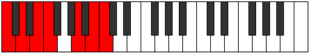 | [midi](https://github.com/edipermadi/music/blob/main/docs/ModeCNaturalAeolanimic.mid?raw=true) |
| [2615](https://ianring.com/musictheory/scales/2615) | [Epycrian](ScaleEpycrian.md) | [Thoptian](ModeThoptian.md) | **C**, **Db**, Ebb, Fb, Gbb, A, **B**, **C** |  | [midi](https://github.com/edipermadi/music/blob/main/docs/ModeCNaturalThoptian.mid?raw=true) |
| [2617](https://ianring.com/musictheory/scales/2617) | [Katythimic](ScaleKatythimic.md) | [Pylimic](ModePylimic.md) | **C**, **D#**, E, F, G##, **A##**, **C** |  | [midi](https://github.com/edipermadi/music/blob/main/docs/ModeCNaturalPylimic.mid?raw=true) |
| [2619](https://ianring.com/musictheory/scales/2619) | [Katogian](ScaleKatogian.md) | [Ionyrian](ModeIonyrian.md) | **C**, **Db**, **Eb**, Fb, Gbb, A, **B**, **C** |  | [midi](https://github.com/edipermadi/music/blob/main/docs/ModeCNaturalIonyrian.mid?raw=true) |
| [2621](https://ianring.com/musictheory/scales/2621) | [Aeopian](ScaleAeopian.md) | [Ionogian](ModeIonogian.md) | **C**, D, **Eb**, Fb, Gbb, A, **B**, **C** |  | [midi](https://github.com/edipermadi/music/blob/main/docs/ModeCNaturalIonogian.mid?raw=true) |
| [2623](https://ianring.com/musictheory/scales/2623) | [Stycryllic](ScaleStycryllic.md) | [Aerylyllic](ModeAerylyllic.md) | **C**, **C#**, D, **D#**, E, F, A, **B**, **C** |  | [midi](https://github.com/edipermadi/music/blob/main/docs/ModeCNaturalAerylyllic.mid?raw=true) |
| [2629](https://ianring.com/musictheory/scales/2629) | [Ionaditonic](ScaleIonaditonic.md) | [Aeolythitonic](ModeAeolythitonic.md) | **C**, D, **F#**, **A**, B, **C** |  | [midi](https://github.com/edipermadi/music/blob/main/docs/ModeCNaturalAeolythitonic.mid?raw=true) |
| [2631](https://ianring.com/musictheory/scales/2631) | [Starimic](ScaleStarimic.md) | [Macrimic](ModeMacrimic.md) | **C**, **Db**, Ebb, F#, **G##**, A##, **C** | 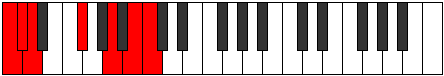 | [midi](https://github.com/edipermadi/music/blob/main/docs/ModeCNaturalMacrimic.mid?raw=true) |
| [2633](https://ianring.com/musictheory/scales/2633) | [Mixitonic](ScaleMixitonic.md) | [Mixitonic](ModeMixitonic.md) | **C**, **D#**, **F#**, **A**, B, **C** |  | [midi](https://github.com/edipermadi/music/blob/main/docs/ModeCNaturalMixitonic.mid?raw=true) |
| [2635](https://ianring.com/musictheory/scales/2635) | [Thagimic](ScaleThagimic.md) | [Gocrimic](ModeGocrimic.md) | **C**, **Db**, **Eb**, F#, **G##**, A##, **C** |  | [midi](https://github.com/edipermadi/music/blob/main/docs/ModeCNaturalGocrimic.mid?raw=true) |
| [2637](https://ianring.com/musictheory/scales/2637) | [Thoptimic](ScaleThoptimic.md) | [Aeolonimic](ModeAeolonimic.md) | **C**, D, **Eb**, **F#**, **G##**, A##, **C** |  | [midi](https://github.com/edipermadi/music/blob/main/docs/ModeCNaturalAeolonimic.mid?raw=true) |
| [2639](https://ianring.com/musictheory/scales/2639) | [Bonian](ScaleBonian.md) | [Dothian](ModeDothian.md) | **C**, **Db**, Ebb, **Fbb**, Gb, **A**, B, **C** |  | [midi](https://github.com/edipermadi/music/blob/main/docs/ModeCNaturalDothian.mid?raw=true) |
| [2641](https://ianring.com/musictheory/scales/2641) | [Gathitonic](ScaleGathitonic.md) | [Gathitonic](ModeGathitonic.md) | **C**, E, **F#**, A, B, **C** |  | [midi](https://github.com/edipermadi/music/blob/main/docs/ModeCNaturalGathitonic.mid?raw=true) |
| [2643](https://ianring.com/musictheory/scales/2643) | [Mixolimic](ScaleMixolimic.md) | [Lydimic](ModeLydimic.md) | **C**, **Db**, E, F#, G##, A##, **C** |  | [midi](https://github.com/edipermadi/music/blob/main/docs/ModeCNaturalLydimic.mid?raw=true) |
| [2645](https://ianring.com/musictheory/scales/2645) | [Phracrimic](ScalePhracrimic.md) | [Zoptimic](ModeZoptimic.md) | **C**, D, E, **F#**, G##, A##, **C** |  | [midi](https://github.com/edipermadi/music/blob/main/docs/ModeCNaturalZoptimic.mid?raw=true) |
| [2647](https://ianring.com/musictheory/scales/2647) | [Stathian](ScaleStathian.md) | [Dadian](ModeDadian.md) | **C**, **Db**, Ebb, Fb, Gb, A, B, **C** |  | [midi](https://github.com/edipermadi/music/blob/main/docs/ModeCNaturalDadian.mid?raw=true) |
| [2649](https://ianring.com/musictheory/scales/2649) | [Bocrimic](ScaleBocrimic.md) | [Aeolythimic](ModeAeolythimic.md) | **C**, **D#**, E, **F#**, G##, A##, **C** |  | [midi](https://github.com/edipermadi/music/blob/main/docs/ModeCNaturalAeolythimic.mid?raw=true) |
| [2651](https://ianring.com/musictheory/scales/2651) | [Rythian](ScaleRythian.md) | [Panian](ModePanian.md) | **C**, **Db**, **Eb**, Fb, Gb, A, B, **C** |  | [midi](https://github.com/edipermadi/music/blob/main/docs/ModeCNaturalPanian.mid?raw=true) |
| [2653](https://ianring.com/musictheory/scales/2653) | [Ionopian](ScaleIonopian.md) | [Sygian](ModeSygian.md) | **C**, D, **Eb**, Fb, **Gb**, A, B, **C** |  | [midi](https://github.com/edipermadi/music/blob/main/docs/ModeCNaturalSygian.mid?raw=true) |
| [2655](https://ianring.com/musictheory/scales/2655) | [Mixolydyllic](ScaleMixolydyllic.md) | [Thocryllic](ModeThocryllic.md) | **C**, **C#**, D, **D#**, E, F#, A, B, **C** |  | [midi](https://github.com/edipermadi/music/blob/main/docs/ModeCNaturalThocryllic.mid?raw=true) |
| [2659](https://ianring.com/musictheory/scales/2659) | [Phralimic](ScalePhralimic.md) | [Katynimic](ModeKatynimic.md) | **C**, **Db**, E#, F#, **G##**, A##, **C** |  | [midi](https://github.com/edipermadi/music/blob/main/docs/ModeCNaturalKatynimic.mid?raw=true) |
| [2661](https://ianring.com/musictheory/scales/2661) | [Zacrimic](ScaleZacrimic.md) | [Stydimic](ModeStydimic.md) | **C**, D, E#, **F#**, **G##**, A##, **C** |  | [midi](https://github.com/edipermadi/music/blob/main/docs/ModeCNaturalStydimic.mid?raw=true) |
| [2663](https://ianring.com/musictheory/scales/2663) | [Laptian](ScaleLaptian.md) | [Lalian](ModeLalian.md) | **C**, **Db**, Ebb, F, Gb, **A**, B, **C** |  | [midi](https://github.com/edipermadi/music/blob/main/docs/ModeCNaturalLalian.mid?raw=true) |
| [2665](https://ianring.com/musictheory/scales/2665) | [Aeradimic](ScaleAeradimic.md) | [Aeradimic](ModeAeradimic.md) | **C**, **D#**, E#, **F#**, **G##**, A##, **C** |  | [midi](https://github.com/edipermadi/music/blob/main/docs/ModeCNaturalAeradimic.mid?raw=true) |
| [2667](https://ianring.com/musictheory/scales/2667) | [Eporian](ScaleEporian.md) | [Byrian](ModeByrian.md) | **C**, **Db**, **Eb**, F, Gb, **A**, B, **C** |  | [midi](https://github.com/edipermadi/music/blob/main/docs/ModeCNaturalByrian.mid?raw=true) |
| [2669](https://ianring.com/musictheory/scales/2669) | [Pogian](ScalePogian.md) | [Gamian](ModeGamian.md) | **C**, D, **Eb**, F, **Gb**, **A**, B, **C** |  | [midi](https://github.com/edipermadi/music/blob/main/docs/ModeCNaturalGamian.mid?raw=true) |
| [2671](https://ianring.com/musictheory/scales/2671) | [Aeronyllic](ScaleAeronyllic.md) | [Lylyllic](ModeLylyllic.md) | **C**, **C#**, D, **D#**, F, F#, **A**, B, **C** |  | [midi](https://github.com/edipermadi/music/blob/main/docs/ModeCNaturalLylyllic.mid?raw=true) |
| [2673](https://ianring.com/musictheory/scales/2673) | [Mythimic](ScaleMythimic.md) | [Mythimic](ModeMythimic.md) | **C**, D##, E#, **F#**, G##, A##, **C** |  | [midi](https://github.com/edipermadi/music/blob/main/docs/ModeCNaturalMythimic.mid?raw=true) |
| [2675](https://ianring.com/musictheory/scales/2675) | [Epathian](ScaleEpathian.md) | [Gogian](ModeGogian.md) | **C**, **Db**, E, F, Gb, A, B, **C** |  | [midi](https://github.com/edipermadi/music/blob/main/docs/ModeCNaturalGogian.mid?raw=true) |
| [2677](https://ianring.com/musictheory/scales/2677) | [Thonian](ScaleThonian.md) | [Thodian](ModeThodian.md) | **C**, D, E, F, **Gb**, A, B, **C** |  | [midi](https://github.com/edipermadi/music/blob/main/docs/ModeCNaturalThodian.mid?raw=true) |
| [2679](https://ianring.com/musictheory/scales/2679) | [Pothyllic](ScalePothyllic.md) | [Rathyllic](ModeRathyllic.md) | **C**, **C#**, D, E, F, F#, A, B, **C** |  | [midi](https://github.com/edipermadi/music/blob/main/docs/ModeCNaturalRathyllic.mid?raw=true) |
| [2681](https://ianring.com/musictheory/scales/2681) | [Katocrian](ScaleKatocrian.md) | [Aerycrian](ModeAerycrian.md) | **C**, **D#**, E, F, **Gb**, A, B, **C** |  | [midi](https://github.com/edipermadi/music/blob/main/docs/ModeCNaturalAerycrian.mid?raw=true) |
| [2683](https://ianring.com/musictheory/scales/2683) | [Zoryllic](ScaleZoryllic.md) | [Thodyllic](ModeThodyllic.md) | **C**, **C#**, **D#**, E, F, F#, A, B, **C** |  | [midi](https://github.com/edipermadi/music/blob/main/docs/ModeCNaturalThodyllic.mid?raw=true) |
| [2685](https://ianring.com/musictheory/scales/2685) | [Lydyllic](ScaleLydyllic.md) | [Ionoryllic](ModeIonoryllic.md) | **C**, D, **D#**, E, F, **F#**, A, B, **C** |  | [midi](https://github.com/edipermadi/music/blob/main/docs/ModeCNaturalIonoryllic.mid?raw=true) |
| [2687](https://ianring.com/musictheory/scales/2687) | [Sathygic](ScaleSathygic.md) | [Thacrygic](ModeThacrygic.md) | **C**, **C#**, D, **D#**, E, F, F#, A, B, **C** |  | [midi](https://github.com/edipermadi/music/blob/main/docs/ModeCNaturalThacrygic.mid?raw=true) |
| [2697](https://ianring.com/musictheory/scales/2697) | [Aerynitonic](ScaleAerynitonic.md) | [Katagitonic](ModeKatagitonic.md) | C, **D#**, **G**, **A**, **B**, C |  | [midi](https://github.com/edipermadi/music/blob/main/docs/ModeCNaturalKatagitonic.mid?raw=true) |
| [2699](https://ianring.com/musictheory/scales/2699) | [Dathimic](ScaleDathimic.md) | [Sythimic](ModeSythimic.md) | C, **Db**, **Eb**, **F##**, **G##**, **A##**, C |  | [midi](https://github.com/edipermadi/music/blob/main/docs/ModeCNaturalSythimic.mid?raw=true) |
| [2701](https://ianring.com/musictheory/scales/2701) | [Rycrimic](ScaleRycrimic.md) | [Epythimic](ModeEpythimic.md) | C, D, **Eb**, F##, **G##**, **A##**, C |  | [midi](https://github.com/edipermadi/music/blob/main/docs/ModeCNaturalEpythimic.mid?raw=true) |
| [2703](https://ianring.com/musictheory/scales/2703) | [Pythian](ScalePythian.md) | [Galian](ModeGalian.md) | C, **Db**, Ebb, **Fbb**, G, **A**, **B**, C |  | [midi](https://github.com/edipermadi/music/blob/main/docs/ModeCNaturalGalian.mid?raw=true) |
| [2705](https://ianring.com/musictheory/scales/2705) | [Magitonic](ScaleMagitonic.md) | [Magitonic](ModeMagitonic.md) | C, E, **G**, A, **B**, C |  | [midi](https://github.com/edipermadi/music/blob/main/docs/ModeCNaturalMagitonic.mid?raw=true) |
| [2707](https://ianring.com/musictheory/scales/2707) | [Palimic](ScalePalimic.md) | [Banimic](ModeBanimic.md) | C, **Db**, E, **F##**, G##, **A##**, C |  | [midi](https://github.com/edipermadi/music/blob/main/docs/ModeCNaturalBanimic.mid?raw=true) |
| [2709](https://ianring.com/musictheory/scales/2709) | [Epathimic](ScaleEpathimic.md) | [Thaptimic](ModeThaptimic.md) | C, D, E, F##, G##, **A##**, C |  | [midi](https://github.com/edipermadi/music/blob/main/docs/ModeCNaturalThaptimic.mid?raw=true) |
| [2711](https://ianring.com/musictheory/scales/2711) | [Soptian](ScaleSoptian.md) | [Stolian](ModeStolian.md) | C, **Db**, Ebb, Fb, G, A, **B**, C |  | [midi](https://github.com/edipermadi/music/blob/main/docs/ModeCNaturalStolian.mid?raw=true) |
| [2713](https://ianring.com/musictheory/scales/2713) | [Mothimic](ScaleMothimic.md) | [Porimic](ModePorimic.md) | C, **D#**, E, **F##**, G##, **A##**, C |  | [midi](https://github.com/edipermadi/music/blob/main/docs/ModeCNaturalPorimic.mid?raw=true) |
| [2715](https://ianring.com/musictheory/scales/2715) | [Epacrian](ScaleEpacrian.md) | [Kynian](ModeKynian.md) | C, **Db**, **Eb**, Fb, **G**, A, **B**, C |  | [midi](https://github.com/edipermadi/music/blob/main/docs/ModeCNaturalKynian.mid?raw=true) |
| [2717](https://ianring.com/musictheory/scales/2717) | [Phrolian](ScalePhrolian.md) | [Epygian](ModeEpygian.md) | C, D, **Eb**, Fb, G, A, **B**, C |  | [midi](https://github.com/edipermadi/music/blob/main/docs/ModeCNaturalEpygian.mid?raw=true) |
| [2719](https://ianring.com/musictheory/scales/2719) | [Phranyllic](ScalePhranyllic.md) | [Zocryllic](ModeZocryllic.md) | C, **C#**, D, **D#**, E, G, A, **B**, C |  | [midi](https://github.com/edipermadi/music/blob/main/docs/ModeCNaturalZocryllic.mid?raw=true) |
| [2723](https://ianring.com/musictheory/scales/2723) | [Katanimic](ScaleKatanimic.md) | [Epylimic](ModeEpylimic.md) | C, **Db**, E#, **F##**, **G##**, **A##**, C |  | [midi](https://github.com/edipermadi/music/blob/main/docs/ModeCNaturalEpylimic.mid?raw=true) |
| [2725](https://ianring.com/musictheory/scales/2725) | [Darmic](ScaleDarmic.md) | [Gonimic](ModeGonimic.md) | C, D, E#, F##, **G##**, **A##**, C |  | [midi](https://github.com/edipermadi/music/blob/main/docs/ModeCNaturalGonimic.mid?raw=true) |
| [2727](https://ianring.com/musictheory/scales/2727) | [Phraptian](ScalePhraptian.md) | [Pylian](ModePylian.md) | C, **Db**, Ebb, F, G, **A**, **B**, C |  | [midi](https://github.com/edipermadi/music/blob/main/docs/ModeCNaturalPylian.mid?raw=true) |
| [2729](https://ianring.com/musictheory/scales/2729) | [Aeragimic](ScaleAeragimic.md) | [Aeragimic](ModeAeragimic.md) | C, **D#**, E#, **F##**, **G##**, **A##**, C |  | [midi](https://github.com/edipermadi/music/blob/main/docs/ModeCNaturalAeragimic.mid?raw=true) |
| [2731](https://ianring.com/musictheory/scales/2731) | [Aeolynian](ScaleAeolynian.md) | [Thydian](ModeThydian.md) | C, **Db**, **Eb**, F, **G**, **A**, **B**, C |  | [midi](https://github.com/edipermadi/music/blob/main/docs/ModeCNaturalThydian.mid?raw=true) |
| [2733](https://ianring.com/musictheory/scales/2733) | [Larian](ScaleLarian.md) | [Bocrian](ModeBocrian.md) | C, D, **Eb**, F, G, **A**, **B**, C |  | [midi](https://github.com/edipermadi/music/blob/main/docs/ModeCNaturalBocrian.mid?raw=true) |
| [2735](https://ianring.com/musictheory/scales/2735) | [Thyryllic](ScaleThyryllic.md) | [Gynyllic](ModeGynyllic.md) | C, **C#**, D, **D#**, F, G, **A**, **B**, C |  | [midi](https://github.com/edipermadi/music/blob/main/docs/ModeCNaturalGynyllic.mid?raw=true) |
| [2737](https://ianring.com/musictheory/scales/2737) | [Bylimic](ScaleBylimic.md) | [Bylimic](ModeBylimic.md) | C, D##, E#, **F##**, G##, **A##**, C |  | [midi](https://github.com/edipermadi/music/blob/main/docs/ModeCNaturalBylimic.mid?raw=true) |
| [2739](https://ianring.com/musictheory/scales/2739) | [Golian](ScaleGolian.md) | [Zanian](ModeZanian.md) | C, **Db**, E, F, **G**, A, **B**, C |  | [midi](https://github.com/edipermadi/music/blob/main/docs/ModeCNaturalZanian.mid?raw=true) |
| [2741](https://ianring.com/musictheory/scales/2741) | [Lydian](ScaleLydian.md) | [Ionian](ModeIonian.md) | C, D, E, F, G, A, **B**, C | 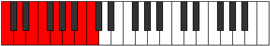 | [midi](https://github.com/edipermadi/music/blob/main/docs/ModeCNaturalIonian.mid?raw=true) |
| [2743](https://ianring.com/musictheory/scales/2743) | [Ionocryllic](ScaleIonocryllic.md) | [Staptyllic](ModeStaptyllic.md) | C, **C#**, D, E, F, G, A, **B**, C |  | [midi](https://github.com/edipermadi/music/blob/main/docs/ModeCNaturalStaptyllic.mid?raw=true) |
| [2745](https://ianring.com/musictheory/scales/2745) | [Dolian](ScaleDolian.md) | [Dolian](ModeDolian.md) | C, **D#**, E, F, **G**, A, **B**, C |  | [midi](https://github.com/edipermadi/music/blob/main/docs/ModeCNaturalDolian.mid?raw=true) |
| [2747](https://ianring.com/musictheory/scales/2747) | [Racryllic](ScaleRacryllic.md) | [Stythyllic](ModeStythyllic.md) | C, **C#**, **D#**, E, F, **G**, A, **B**, C |  | [midi](https://github.com/edipermadi/music/blob/main/docs/ModeCNaturalStythyllic.mid?raw=true) |
| [2749](https://ianring.com/musictheory/scales/2749) | [Rocryllic](ScaleRocryllic.md) | [Katagyllic](ModeKatagyllic.md) | C, D, **D#**, E, F, G, A, **B**, C |  | [midi](https://github.com/edipermadi/music/blob/main/docs/ModeCNaturalKatagyllic.mid?raw=true) |
| [2751](https://ianring.com/musictheory/scales/2751) | [Kyrygic](ScaleKyrygic.md) | [Sylygic](ModeSylygic.md) | C, **C#**, D, **D#**, E, F, G, A, **B**, C |  | [midi](https://github.com/edipermadi/music/blob/main/docs/ModeCNaturalSylygic.mid?raw=true) |
| [2757](https://ianring.com/musictheory/scales/2757) | [Garimic](ScaleGarimic.md) | [Stolimic](ModeStolimic.md) | C, D, **E##**, F##, **G##**, A##, C |  | [midi](https://github.com/edipermadi/music/blob/main/docs/ModeCNaturalStolimic.mid?raw=true) |
| [2759](https://ianring.com/musictheory/scales/2759) | [Ionythian](ScaleIonythian.md) | [Aeraphian](ModeAeraphian.md) | C, **Db**, Ebb, F#, G, **A**, B, C |  | [midi](https://github.com/edipermadi/music/blob/main/docs/ModeCNaturalAeraphian.mid?raw=true) |
| [2761](https://ianring.com/musictheory/scales/2761) | [Dagimic](ScaleDagimic.md) | [Dagimic](ModeDagimic.md) | C, **D#**, **E##**, **F##**, **G##**, A##, C |  | [midi](https://github.com/edipermadi/music/blob/main/docs/ModeCNaturalDagimic.mid?raw=true) |
| [2763](https://ianring.com/musictheory/scales/2763) | [Korian](ScaleKorian.md) | [Manian](ModeManian.md) | C, **Db**, **Eb**, F#, **G**, **A**, B, C | 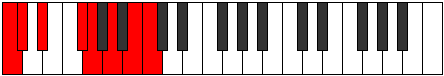 | [midi](https://github.com/edipermadi/music/blob/main/docs/ModeCNaturalManian.mid?raw=true) |
| [2765](https://ianring.com/musictheory/scales/2765) | [Palian](ScalePalian.md) | [Banian](ModeBanian.md) | C, D, **Eb**, **F#**, G, **A**, B, C |  | [midi](https://github.com/edipermadi/music/blob/main/docs/ModeCNaturalBanian.mid?raw=true) |
| [2767](https://ianring.com/musictheory/scales/2767) | [Aeolothyllic](ScaleAeolothyllic.md) | [Katydyllic](ModeKatydyllic.md) | C, **C#**, D, **D#**, F#, G, **A**, B, C |  | [midi](https://github.com/edipermadi/music/blob/main/docs/ModeCNaturalKatydyllic.mid?raw=true) |
| [2769](https://ianring.com/musictheory/scales/2769) | [Dyrimic](ScaleDyrimic.md) | [Dyrimic](ModeDyrimic.md) | C, D##, **E##**, **F##**, G##, A##, C |  | [midi](https://github.com/edipermadi/music/blob/main/docs/ModeCNaturalDyrimic.mid?raw=true) |
| [2771](https://ianring.com/musictheory/scales/2771) | [Thonian](ScaleThonian.md) | [Garian](ModeGarian.md) | C, **Db**, E, F#, **G**, A, B, C |  | [midi](https://github.com/edipermadi/music/blob/main/docs/ModeCNaturalGarian.mid?raw=true) |
| [2773](https://ianring.com/musictheory/scales/2773) | [Lydian](ScaleLydian.md) | [Lydian](ModeLydian.md) | C, D, E, **F#**, G, A, B, C |  | [midi](https://github.com/edipermadi/music/blob/main/docs/ModeCNaturalLydian.mid?raw=true) |
| [2775](https://ianring.com/musictheory/scales/2775) | [Aerycryllic](ScaleAerycryllic.md) | [Godyllic](ModeGodyllic.md) | C, **C#**, D, E, F#, G, A, B, C |  | [midi](https://github.com/edipermadi/music/blob/main/docs/ModeCNaturalGodyllic.mid?raw=true) |
| [2777](https://ianring.com/musictheory/scales/2777) | [Bycrian](ScaleBycrian.md) | [Bycrian](ModeBycrian.md) | C, **D#**, E, **F#**, **G**, A, B, C |  | [midi](https://github.com/edipermadi/music/blob/main/docs/ModeCNaturalBycrian.mid?raw=true) |
| [2779](https://ianring.com/musictheory/scales/2779) | [Dalyllic](ScaleDalyllic.md) | [Garyllic](ModeGaryllic.md) | C, **C#**, **D#**, E, F#, **G**, A, B, C |  | [midi](https://github.com/edipermadi/music/blob/main/docs/ModeCNaturalGaryllic.mid?raw=true) |
| [2781](https://ianring.com/musictheory/scales/2781) | [Ionoptyllic](ScaleIonoptyllic.md) | [Gycryllic](ModeGycryllic.md) | C, D, **D#**, E, **F#**, G, A, B, C |  | [midi](https://github.com/edipermadi/music/blob/main/docs/ModeCNaturalGycryllic.mid?raw=true) |
| [2783](https://ianring.com/musictheory/scales/2783) | [Apinygic](ScaleApinygic.md) | [Gothygic](ModeGothygic.md) | C, **C#**, D, **D#**, E, F#, G, A, B, C |  | [midi](https://github.com/edipermadi/music/blob/main/docs/ModeCNaturalGothygic.mid?raw=true) |
| [2787](https://ianring.com/musictheory/scales/2787) | [Thacrian](ScaleThacrian.md) | [Zyrian](ModeZyrian.md) | C, **Db**, E#, F#, **G**, **A**, B, C |  | [midi](https://github.com/edipermadi/music/blob/main/docs/ModeCNaturalZyrian.mid?raw=true) |
| [2789](https://ianring.com/musictheory/scales/2789) | [Ionycrian](ScaleIonycrian.md) | [Zolian](ModeZolian.md) | C, D, E#, **F#**, G, **A**, B, C |  | [midi](https://github.com/edipermadi/music/blob/main/docs/ModeCNaturalZolian.mid?raw=true) |
| [2791](https://ianring.com/musictheory/scales/2791) | [Aeracryllic](ScaleAeracryllic.md) | [Ionyptyllic](ModeIonyptyllic.md) | C, **C#**, D, F, F#, G, **A**, B, C |  | [midi](https://github.com/edipermadi/music/blob/main/docs/ModeCNaturalIonyptyllic.mid?raw=true) |
| [2793](https://ianring.com/musictheory/scales/2793) | [Eporian](ScaleEporian.md) | [Eporian](ModeEporian.md) | C, **D#**, E#, **F#**, **G**, **A**, B, C |  | [midi](https://github.com/edipermadi/music/blob/main/docs/ModeCNaturalEporian.mid?raw=true) |
| [2797](https://ianring.com/musictheory/scales/2797) | [Stogyllic](ScaleStogyllic.md) | [Stalyllic](ModeStalyllic.md) | C, D, **D#**, F, **F#**, G, **A**, B, C |  | [midi](https://github.com/edipermadi/music/blob/main/docs/ModeCNaturalStalyllic.mid?raw=true) |
| [2799](https://ianring.com/musictheory/scales/2799) | [Kaptygic](ScaleKaptygic.md) | [Epilygic](ModeEpilygic.md) | C, **C#**, D, **D#**, F, F#, G, **A**, B, C |  | [midi](https://github.com/edipermadi/music/blob/main/docs/ModeCNaturalEpilygic.mid?raw=true) |
| [2801](https://ianring.com/musictheory/scales/2801) | [Zogian](ScaleZogian.md) | [Zogian](ModeZogian.md) | C, D##, E#, **F#**, **G**, A, B, C |  | [midi](https://github.com/edipermadi/music/blob/main/docs/ModeCNaturalZogian.mid?raw=true) |
| [2803](https://ianring.com/musictheory/scales/2803) | [Bacryllic](ScaleBacryllic.md) | [Zolyllic](ModeZolyllic.md) | C, **C#**, E, F, F#, **G**, A, B, C |  | [midi](https://github.com/edipermadi/music/blob/main/docs/ModeCNaturalZolyllic.mid?raw=true) |
| [2805](https://ianring.com/musictheory/scales/2805) | [Aerycryllic](ScaleAerycryllic.md) | [Zylyllic](ModeZylyllic.md) | C, D, E, F, **F#**, G, A, B, C |  | [midi](https://github.com/edipermadi/music/blob/main/docs/ModeCNaturalZylyllic.mid?raw=true) |
| [2807](https://ianring.com/musictheory/scales/2807) | [Aerycrygic](ScaleAerycrygic.md) | [Zylygic](ModeZylygic.md) | C, **C#**, D, E, F, F#, G, A, B, C |  | [midi](https://github.com/edipermadi/music/blob/main/docs/ModeCNaturalZylygic.mid?raw=true) |
| [2809](https://ianring.com/musictheory/scales/2809) | [Gythyllic](ScaleGythyllic.md) | [Gythyllic](ModeGythyllic.md) | C, **D#**, E, F, **F#**, **G**, A, B, C |  | [midi](https://github.com/edipermadi/music/blob/main/docs/ModeCNaturalGythyllic.mid?raw=true) |
| [2811](https://ianring.com/musictheory/scales/2811) | [Porygic](ScalePorygic.md) | [Barygic](ModeBarygic.md) | C, **C#**, **D#**, E, F, F#, **G**, A, B, C |  | [midi](https://github.com/edipermadi/music/blob/main/docs/ModeCNaturalBarygic.mid?raw=true) |
| [2813](https://ianring.com/musictheory/scales/2813) | [Bagygic](ScaleBagygic.md) | [Zolygic](ModeZolygic.md) | C, D, **D#**, E, F, **F#**, G, A, B, C |  | [midi](https://github.com/edipermadi/music/blob/main/docs/ModeCNaturalZolygic.mid?raw=true) |
| [2815](https://ianring.com/musictheory/scales/2815) | [Sydyllian](ScaleSydyllian.md) | [Aeradyllian](ModeAeradyllian.md) | C, **C#**, D, **D#**, E, F, F#, G, A, B, C |  | [midi](https://github.com/edipermadi/music/blob/main/docs/ModeCNaturalAeradyllian.mid?raw=true) |
| [2833](https://ianring.com/musictheory/scales/2833) | [Dolitonic](ScaleDolitonic.md) | [Dolitonic](ModeDolitonic.md) | **C**, E, **G#**, A, **B**, **C** |  | [midi](https://github.com/edipermadi/music/blob/main/docs/ModeCNaturalDolitonic.mid?raw=true) |
| [2835](https://ianring.com/musictheory/scales/2835) | [Syrimic](ScaleSyrimic.md) | [Ionygimic](ModeIonygimic.md) | **C**, Db, E, **F###**, G##, **A##**, **C** |  | [midi](https://github.com/edipermadi/music/blob/main/docs/ModeCNaturalIonygimic.mid?raw=true) |
| [2837](https://ianring.com/musictheory/scales/2837) | [Modimic](ScaleModimic.md) | [Aelothimic](ModeAelothimic.md) | **C**, D, E, **F###**, G##, **A##**, **C** |  | [midi](https://github.com/edipermadi/music/blob/main/docs/ModeCNaturalAelothimic.mid?raw=true) |
| [2839](https://ianring.com/musictheory/scales/2839) | [Zorian](ScaleZorian.md) | [Lyptian](ModeLyptian.md) | **C**, Db, Ebb, Fb, **G#**, A, **B**, **C** |  | [midi](https://github.com/edipermadi/music/blob/main/docs/ModeCNaturalLyptian.mid?raw=true) |
| [2841](https://ianring.com/musictheory/scales/2841) | [Laptimic](ScaleLaptimic.md) | [Sothimic](ModeSothimic.md) | **C**, **D#**, E, F###, G##, **A##**, **C** |  | [midi](https://github.com/edipermadi/music/blob/main/docs/ModeCNaturalSothimic.mid?raw=true) |
| [2843](https://ianring.com/musictheory/scales/2843) | [Stythian](ScaleStythian.md) | [Sorian](ModeSorian.md) | **C**, Db, **Eb**, Fb, G#, A, **B**, **C** |  | [midi](https://github.com/edipermadi/music/blob/main/docs/ModeCNaturalSorian.mid?raw=true) |
| [2845](https://ianring.com/musictheory/scales/2845) | [Stygian](ScaleStygian.md) | [Baptian](ModeBaptian.md) | **C**, D, **Eb**, Fb, G#, A, **B**, **C** |  | [midi](https://github.com/edipermadi/music/blob/main/docs/ModeCNaturalBaptian.mid?raw=true) |
| [2847](https://ianring.com/musictheory/scales/2847) | [Dolyllic](ScaleDolyllic.md) | [Phracryllic](ModePhracryllic.md) | **C**, C#, D, **D#**, E, G#, A, **B**, **C** |  | [midi](https://github.com/edipermadi/music/blob/main/docs/ModeCNaturalPhracryllic.mid?raw=true) |
| [2851](https://ianring.com/musictheory/scales/2851) | [Lathimic](ScaleLathimic.md) | [Katoptimic](ModeKatoptimic.md) | **C**, Db, E#, **F###**, **G##**, **A##**, **C** |  | [midi](https://github.com/edipermadi/music/blob/main/docs/ModeCNaturalKatoptimic.mid?raw=true) |
| [2853](https://ianring.com/musictheory/scales/2853) | [Thalimic](ScaleThalimic.md) | [Baptimic](ModeBaptimic.md) | **C**, D, E#, **F###**, **G##**, **A##**, **C** |  | [midi](https://github.com/edipermadi/music/blob/main/docs/ModeCNaturalBaptimic.mid?raw=true) |
| [2855](https://ianring.com/musictheory/scales/2855) | [Epagian](ScaleEpagian.md) | [Epocrian](ModeEpocrian.md) | **C**, Db, Ebb, F, **G#**, **A**, **B**, **C** |  | [midi](https://github.com/edipermadi/music/blob/main/docs/ModeCNaturalEpocrian.mid?raw=true) |
| [2857](https://ianring.com/musictheory/scales/2857) | [Stythimic](ScaleStythimic.md) | [Stythimic](ModeStythimic.md) | **C**, **D#**, E#, F###, **G##**, **A##**, **C** |  | [midi](https://github.com/edipermadi/music/blob/main/docs/ModeCNaturalStythimic.mid?raw=true) |
| [2859](https://ianring.com/musictheory/scales/2859) | [Ionanian](ScaleIonanian.md) | [Phrycrian](ModePhrycrian.md) | **C**, Db, **Eb**, F, G#, **A**, **B**, **C** |  | [midi](https://github.com/edipermadi/music/blob/main/docs/ModeCNaturalPhrycrian.mid?raw=true) |
| [2861](https://ianring.com/musictheory/scales/2861) | [Mycrian](ScaleMycrian.md) | [Katothian](ModeKatothian.md) | **C**, D, **Eb**, F, G#, **A**, **B**, **C** |  | [midi](https://github.com/edipermadi/music/blob/main/docs/ModeCNaturalKatothian.mid?raw=true) |
| [2863](https://ianring.com/musictheory/scales/2863) | [Stacryllic](ScaleStacryllic.md) | [Aerogyllic](ModeAerogyllic.md) | **C**, C#, D, **D#**, F, G#, **A**, **B**, **C** |  | [midi](https://github.com/edipermadi/music/blob/main/docs/ModeCNaturalAerogyllic.mid?raw=true) |
| [2865](https://ianring.com/musictheory/scales/2865) | [Solimic](ScaleSolimic.md) | [Solimic](ModeSolimic.md) | **C**, D##, E#, **F###**, G##, **A##**, **C** |  | [midi](https://github.com/edipermadi/music/blob/main/docs/ModeCNaturalSolimic.mid?raw=true) |
| [2867](https://ianring.com/musictheory/scales/2867) | [Katathian](ScaleKatathian.md) | [Socrian](ModeSocrian.md) | **C**, Db, E, F, **G#**, A, **B**, **C** |  | [midi](https://github.com/edipermadi/music/blob/main/docs/ModeCNaturalSocrian.mid?raw=true) |
| [2869](https://ianring.com/musictheory/scales/2869) | [Bycrian](ScaleBycrian.md) | [Phrothian](ModePhrothian.md) | **C**, D, E, F, **G#**, A, **B**, **C** |  | [midi](https://github.com/edipermadi/music/blob/main/docs/ModeCNaturalPhrothian.mid?raw=true) |
| [2871](https://ianring.com/musictheory/scales/2871) | [Doptyllic](ScaleDoptyllic.md) | [Stanyllic](ModeStanyllic.md) | **C**, C#, D, E, F, **G#**, A, **B**, **C** |  | [midi](https://github.com/edipermadi/music/blob/main/docs/ModeCNaturalStanyllic.mid?raw=true) |
| [2873](https://ianring.com/musictheory/scales/2873) | [Loptian](ScaleLoptian.md) | [Docrian](ModeDocrian.md) | **C**, **D#**, E, F, G#, A, **B**, **C** |  | [midi](https://github.com/edipermadi/music/blob/main/docs/ModeCNaturalDocrian.mid?raw=true) |
| [2875](https://ianring.com/musictheory/scales/2875) | [Thyptyllic](ScaleThyptyllic.md) | [Ganyllic](ModeGanyllic.md) | **C**, C#, **D#**, E, F, G#, A, **B**, **C** |  | [midi](https://github.com/edipermadi/music/blob/main/docs/ModeCNaturalGanyllic.mid?raw=true) |
| [2877](https://ianring.com/musictheory/scales/2877) | [Maptyllic](ScaleMaptyllic.md) | [Phrylyllic](ModePhrylyllic.md) | **C**, D, **D#**, E, F, G#, A, **B**, **C** |  | [midi](https://github.com/edipermadi/music/blob/main/docs/ModeCNaturalPhrylyllic.mid?raw=true) |
| [2879](https://ianring.com/musictheory/scales/2879) | [Phrygic](ScalePhrygic.md) | [Stadygic](ModeStadygic.md) | **C**, C#, D, **D#**, E, F, G#, A, **B**, **C** |  | [midi](https://github.com/edipermadi/music/blob/main/docs/ModeCNaturalStadygic.mid?raw=true) |
| [2885](https://ianring.com/musictheory/scales/2885) | [Manimic](ScaleManimic.md) | [Byrimic](ModeByrimic.md) | **C**, D, **E##**, **F###**, **G##**, A##, **C** |  | [midi](https://github.com/edipermadi/music/blob/main/docs/ModeCNaturalByrimic.mid?raw=true) |
| [2887](https://ianring.com/musictheory/scales/2887) | [Aeopian](ScaleAeopian.md) | [Gaptian](ModeGaptian.md) | **C**, Db, Ebb, F#, **G#**, **A**, B, **C** |  | [midi](https://github.com/edipermadi/music/blob/main/docs/ModeCNaturalGaptian.mid?raw=true) |
| [2889](https://ianring.com/musictheory/scales/2889) | [Thoptimic](ScaleThoptimic.md) | [Thoptimic](ModeThoptimic.md) | **C**, **D#**, **E##**, F###, **G##**, A##, **C** |  | [midi](https://github.com/edipermadi/music/blob/main/docs/ModeCNaturalThoptimic.mid?raw=true) |
| [2891](https://ianring.com/musictheory/scales/2891) | [Ionopian](ScaleIonopian.md) | [Phrogian](ModePhrogian.md) | **C**, Db, **Eb**, F#, G#, **A**, B, **C** |  | [midi](https://github.com/edipermadi/music/blob/main/docs/ModeCNaturalPhrogian.mid?raw=true) |
| [2893](https://ianring.com/musictheory/scales/2893) | [Pogian](ScalePogian.md) | [Lylian](ModeLylian.md) | **C**, D, **Eb**, **F#**, G#, **A**, B, **C** |  | [midi](https://github.com/edipermadi/music/blob/main/docs/ModeCNaturalLylian.mid?raw=true) |
| [2895](https://ianring.com/musictheory/scales/2895) | [Lydyllic](ScaleLydyllic.md) | [Aeragyllic](ModeAeragyllic.md) | **C**, C#, D, **D#**, F#, G#, **A**, B, **C** |  | [midi](https://github.com/edipermadi/music/blob/main/docs/ModeCNaturalAeragyllic.mid?raw=true) |
| [2897](https://ianring.com/musictheory/scales/2897) | [Rycrimic](ScaleRycrimic.md) | [Rycrimic](ModeRycrimic.md) | **C**, D##, **E##**, **F###**, G##, A##, **C** |  | [midi](https://github.com/edipermadi/music/blob/main/docs/ModeCNaturalRycrimic.mid?raw=true) |
| [2899](https://ianring.com/musictheory/scales/2899) | [Phrolian](ScalePhrolian.md) | [Kagian](ModeKagian.md) | **C**, Db, E, F#, **G#**, A, B, **C** |  | [midi](https://github.com/edipermadi/music/blob/main/docs/ModeCNaturalKagian.mid?raw=true) |
| [2901](https://ianring.com/musictheory/scales/2901) | [Larian](ScaleLarian.md) | [Larian](ModeLarian.md) | **C**, D, E, **F#**, **G#**, A, B, **C** |  | [midi](https://github.com/edipermadi/music/blob/main/docs/ModeCNaturalLarian.mid?raw=true) |
| [2903](https://ianring.com/musictheory/scales/2903) | [Rocryllic](ScaleRocryllic.md) | [Gothyllic](ModeGothyllic.md) | **C**, C#, D, E, F#, **G#**, A, B, **C** |  | [midi](https://github.com/edipermadi/music/blob/main/docs/ModeCNaturalGothyllic.mid?raw=true) |
| [2905](https://ianring.com/musictheory/scales/2905) | [Palian](ScalePalian.md) | [Palian](ModePalian.md) | **C**, **D#**, E, **F#**, G#, A, B, **C** |  | [midi](https://github.com/edipermadi/music/blob/main/docs/ModeCNaturalPalian.mid?raw=true) |
| [2907](https://ianring.com/musictheory/scales/2907) | [Ionoptyllic](ScaleIonoptyllic.md) | [Mogyllic](ModeMogyllic.md) | **C**, C#, **D#**, E, F#, G#, A, B, **C** |  | [midi](https://github.com/edipermadi/music/blob/main/docs/ModeCNaturalMogyllic.mid?raw=true) |
| [2909](https://ianring.com/musictheory/scales/2909) | [Stogyllic](ScaleStogyllic.md) | [Mocryllic](ModeMocryllic.md) | **C**, D, **D#**, E, **F#**, G#, A, B, **C** |  | [midi](https://github.com/edipermadi/music/blob/main/docs/ModeCNaturalMocryllic.mid?raw=true) |
| [2911](https://ianring.com/musictheory/scales/2911) | [Bagygic](ScaleBagygic.md) | [Katygic](ModeKatygic.md) | **C**, C#, D, **D#**, E, F#, G#, A, B, **C** |  | [midi](https://github.com/edipermadi/music/blob/main/docs/ModeCNaturalKatygic.mid?raw=true) |
| [2915](https://ianring.com/musictheory/scales/2915) | [Stygian](ScaleStygian.md) | [Aeolydian](ModeAeolydian.md) | **C**, Db, E#, F#, **G#**, **A**, B, **C** |  | [midi](https://github.com/edipermadi/music/blob/main/docs/ModeCNaturalAeolydian.mid?raw=true) |
| [2917](https://ianring.com/musictheory/scales/2917) | [Mycrian](ScaleMycrian.md) | [Kocrian](ModeKocrian.md) | **C**, D, E#, **F#**, **G#**, **A**, B, **C** |  | [midi](https://github.com/edipermadi/music/blob/main/docs/ModeCNaturalKocrian.mid?raw=true) |
| [2919](https://ianring.com/musictheory/scales/2919) | [Maptyllic](ScaleMaptyllic.md) | [Molyllic](ModeMolyllic.md) | **C**, C#, D, F, F#, **G#**, **A**, B, **C** |  | [midi](https://github.com/edipermadi/music/blob/main/docs/ModeCNaturalMolyllic.mid?raw=true) |
| [2921](https://ianring.com/musictheory/scales/2921) | [Pogian](ScalePogian.md) | [Pogian](ModePogian.md) | **C**, **D#**, E#, **F#**, G#, **A**, B, **C** |  | [midi](https://github.com/edipermadi/music/blob/main/docs/ModeCNaturalPogian.mid?raw=true) |
| [2923](https://ianring.com/musictheory/scales/2923) | [Stogyllic](ScaleStogyllic.md) | [Baryllic](ModeBaryllic.md) | **C**, C#, **D#**, F, F#, G#, **A**, B, **C** |  | [midi](https://github.com/edipermadi/music/blob/main/docs/ModeCNaturalBaryllic.mid?raw=true) |
| [2925](https://ianring.com/musictheory/scales/2925) | [MajorDiminished](ScaleMajorDiminished.md) | [MajorDiminished](ModeMajorDiminished.md) | **C**, D, **D#**, F, **F#**, G#, **A**, B, **C** |  | [midi](https://github.com/edipermadi/music/blob/main/docs/ModeCNaturalMajorDiminished.mid?raw=true) |
| [2927](https://ianring.com/musictheory/scales/2927) | [Koptygic](ScaleKoptygic.md) | [Rodygic](ModeRodygic.md) | **C**, C#, D, **D#**, F, F#, G#, **A**, B, **C** |  | [midi](https://github.com/edipermadi/music/blob/main/docs/ModeCNaturalRodygic.mid?raw=true) |
| [2929](https://ianring.com/musictheory/scales/2929) | [Aeolathian](ScaleAeolathian.md) | [Aeolathian](ModeAeolathian.md) | **C**, D##, E#, **F#**, **G#**, A, B, **C** |  | [midi](https://github.com/edipermadi/music/blob/main/docs/ModeCNaturalAeolathian.mid?raw=true) |
| [2931](https://ianring.com/musictheory/scales/2931) | [Dydyllic](ScaleDydyllic.md) | [Zathyllic](ModeZathyllic.md) | **C**, C#, E, F, F#, **G#**, A, B, **C** |  | [midi](https://github.com/edipermadi/music/blob/main/docs/ModeCNaturalZathyllic.mid?raw=true) |
| [2933](https://ianring.com/musictheory/scales/2933) | [Dalyllic](ScaleDalyllic.md) | [Dalyllic](ModeDalyllic.md) | **C**, D, E, F, **F#**, **G#**, A, B, **C** |  | [midi](https://github.com/edipermadi/music/blob/main/docs/ModeCNaturalDalyllic.mid?raw=true) |
| [2935](https://ianring.com/musictheory/scales/2935) | [Aeolorygic](ScaleAeolorygic.md) | [Modygic](ModeModygic.md) | **C**, C#, D, E, F, F#, **G#**, A, B, **C** |  | [midi](https://github.com/edipermadi/music/blob/main/docs/ModeCNaturalModygic.mid?raw=true) |
| [2937](https://ianring.com/musictheory/scales/2937) | [Aeolathyllic](ScaleAeolathyllic.md) | [Aeolathyllic](ModeAeolathyllic.md) | **C**, **D#**, E, F, **F#**, G#, A, B, **C** |  | [midi](https://github.com/edipermadi/music/blob/main/docs/ModeCNaturalAeolathyllic.mid?raw=true) |
| [2939](https://ianring.com/musictheory/scales/2939) | [Epyrygic](ScaleEpyrygic.md) | [Goptygic](ModeGoptygic.md) | **C**, C#, **D#**, E, F, F#, G#, A, B, **C** |  | [midi](https://github.com/edipermadi/music/blob/main/docs/ModeCNaturalGoptygic.mid?raw=true) |
| [2941](https://ianring.com/musictheory/scales/2941) | [Koptygic](ScaleKoptygic.md) | [Laptygic](ModeLaptygic.md) | **C**, D, **D#**, E, F, **F#**, G#, A, B, **C** |  | [midi](https://github.com/edipermadi/music/blob/main/docs/ModeCNaturalLaptygic.mid?raw=true) |
| [2943](https://ianring.com/musictheory/scales/2943) | [Gothyllian](ScaleGothyllian.md) | [Dathyllian](ModeDathyllian.md) | **C**, C#, D, **D#**, E, F, F#, G#, A, B, **C** |  | [midi](https://github.com/edipermadi/music/blob/main/docs/ModeCNaturalDathyllian.mid?raw=true) |
| [2953](https://ianring.com/musictheory/scales/2953) | [Aerothimic](ScaleAerothimic.md) | [Ionylimic](ModeIonylimic.md) | C, **D#**, **E###**, F###, **G##**, **A##**, C |  | [midi](https://github.com/edipermadi/music/blob/main/docs/ModeCNaturalIonylimic.mid?raw=true) |
| [2955](https://ianring.com/musictheory/scales/2955) | [Katacrian](ScaleKatacrian.md) | [Thorian](ModeThorian.md) | C, Db, **Eb**, **F##**, G#, **A**, **B**, C |  | [midi](https://github.com/edipermadi/music/blob/main/docs/ModeCNaturalThorian.mid?raw=true) |
| [2957](https://ianring.com/musictheory/scales/2957) | [Aeolathian](ScaleAeolathian.md) | [Thygian](ModeThygian.md) | C, D, **Eb**, F##, G#, **A**, **B**, C |  | [midi](https://github.com/edipermadi/music/blob/main/docs/ModeCNaturalThygian.mid?raw=true) |
| [2959](https://ianring.com/musictheory/scales/2959) | [Thagyllic](ScaleThagyllic.md) | [Dygyllic](ModeDygyllic.md) | C, C#, D, **D#**, G, G#, **A**, **B**, C |  | [midi](https://github.com/edipermadi/music/blob/main/docs/ModeCNaturalDygyllic.mid?raw=true) |
| [2961](https://ianring.com/musictheory/scales/2961) | [Bygimic](ScaleBygimic.md) | [Bygimic](ModeBygimic.md) | C, D##, **E###**, **F###**, G##, **A##**, C |  | [midi](https://github.com/edipermadi/music/blob/main/docs/ModeCNaturalBygimic.mid?raw=true) |
| [2963](https://ianring.com/musictheory/scales/2963) | [Stalian](ScaleStalian.md) | [Bygian](ModeBygian.md) | C, Db, E, **F##**, **G#**, A, **B**, C |  | [midi](https://github.com/edipermadi/music/blob/main/docs/ModeCNaturalBygian.mid?raw=true) |
| [2965](https://ianring.com/musictheory/scales/2965) | [Aerathian](ScaleAerathian.md) | [Darian](ModeDarian.md) | C, D, E, F##, **G#**, A, **B**, C |  | [midi](https://github.com/edipermadi/music/blob/main/docs/ModeCNaturalDarian.mid?raw=true) |
| [2967](https://ianring.com/musictheory/scales/2967) | [Dagyllic](ScaleDagyllic.md) | [Madyllic](ModeMadyllic.md) | C, C#, D, E, G, **G#**, A, **B**, C |  | [midi](https://github.com/edipermadi/music/blob/main/docs/ModeCNaturalMadyllic.mid?raw=true) |
| [2969](https://ianring.com/musictheory/scales/2969) | [Tholian](ScaleTholian.md) | [Tholian](ModeTholian.md) | C, **D#**, E, **F##**, G#, A, **B**, C |  | [midi](https://github.com/edipermadi/music/blob/main/docs/ModeCNaturalTholian.mid?raw=true) |
| [2971](https://ianring.com/musictheory/scales/2971) | [Lonyllic](ScaleLonyllic.md) | [Aeolynyllic](ModeAeolynyllic.md) | C, C#, **D#**, E, **G**, G#, A, **B**, C |  | [midi](https://github.com/edipermadi/music/blob/main/docs/ModeCNaturalAeolynyllic.mid?raw=true) |
| [2973](https://ianring.com/musictheory/scales/2973) | [Dydyllic](ScaleDydyllic.md) | [Panyllic](ModePanyllic.md) | C, D, **D#**, E, G, G#, A, **B**, C |  | [midi](https://github.com/edipermadi/music/blob/main/docs/ModeCNaturalPanyllic.mid?raw=true) |
| [2975](https://ianring.com/musictheory/scales/2975) | [Kalygic](ScaleKalygic.md) | [Gaptygic](ModeGaptygic.md) | C, C#, D, **D#**, E, G, G#, A, **B**, C |  | [midi](https://github.com/edipermadi/music/blob/main/docs/ModeCNaturalGaptygic.mid?raw=true) |
| [2979](https://ianring.com/musictheory/scales/2979) | [Katogian](ScaleKatogian.md) | [Gyptian](ModeGyptian.md) | C, Db, E#, **F##**, **G#**, **A**, **B**, C |  | [midi](https://github.com/edipermadi/music/blob/main/docs/ModeCNaturalGyptian.mid?raw=true) |
| [2981](https://ianring.com/musictheory/scales/2981) | [Rythian](ScaleRythian.md) | [Ionolian](ModeIonolian.md) | C, D, E#, F##, **G#**, **A**, **B**, C |  | [midi](https://github.com/edipermadi/music/blob/main/docs/ModeCNaturalIonolian.mid?raw=true) |
| [2983](https://ianring.com/musictheory/scales/2983) | [Zoryllic](ScaleZoryllic.md) | [Zythyllic](ModeZythyllic.md) | C, C#, D, F, G, **G#**, **A**, **B**, C |  | [midi](https://github.com/edipermadi/music/blob/main/docs/ModeCNaturalZythyllic.mid?raw=true) |
| [2985](https://ianring.com/musictheory/scales/2985) | [Epacrian](ScaleEpacrian.md) | [Epacrian](ModeEpacrian.md) | C, **D#**, E#, **F##**, G#, **A**, **B**, C | 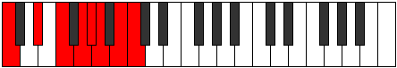 | [midi](https://github.com/edipermadi/music/blob/main/docs/ModeCNaturalEpacrian.mid?raw=true) |
| [2987](https://ianring.com/musictheory/scales/2987) | [Racryllic](ScaleRacryllic.md) | [Thanyllic](ModeThanyllic.md) | C, C#, **D#**, F, **G**, G#, **A**, **B**, C |  | [midi](https://github.com/edipermadi/music/blob/main/docs/ModeCNaturalThanyllic.mid?raw=true) |
| [2989](https://ianring.com/musictheory/scales/2989) | [Dalyllic](ScaleDalyllic.md) | [Ionacryllic](ModeIonacryllic.md) | C, D, **D#**, F, G, G#, **A**, **B**, C |  | [midi](https://github.com/edipermadi/music/blob/main/docs/ModeCNaturalIonacryllic.mid?raw=true) |
| [2991](https://ianring.com/musictheory/scales/2991) | [Porygic](ScalePorygic.md) | [Zanygic](ModeZanygic.md) | C, C#, D, **D#**, F, G, G#, **A**, **B**, C |  | [midi](https://github.com/edipermadi/music/blob/main/docs/ModeCNaturalZanygic.mid?raw=true) |
| [2993](https://ianring.com/musictheory/scales/2993) | [Stythian](ScaleStythian.md) | [Stythian](ModeStythian.md) | C, D##, E#, **F##**, **G#**, A, **B**, C |  | [midi](https://github.com/edipermadi/music/blob/main/docs/ModeCNaturalStythian.mid?raw=true) |
| [2995](https://ianring.com/musictheory/scales/2995) | [Thyptyllic](ScaleThyptyllic.md) | [Sanyllic](ModeSanyllic.md) | C, C#, E, F, **G**, **G#**, A, **B**, C |  | [midi](https://github.com/edipermadi/music/blob/main/docs/ModeCNaturalSanyllic.mid?raw=true) |
| [2997](https://ianring.com/musictheory/scales/2997) | [Ionoptyllic](ScaleIonoptyllic.md) | [Ionoptyllic](ModeIonoptyllic.md) | C, D, E, F, G, **G#**, A, **B**, C |  | [midi](https://github.com/edipermadi/music/blob/main/docs/ModeCNaturalIonoptyllic.mid?raw=true) |
| [2999](https://ianring.com/musictheory/scales/2999) | [Epyrygic](ScaleEpyrygic.md) | [Zyrygic](ModeZyrygic.md) | C, C#, D, E, F, G, **G#**, A, **B**, C |  | [midi](https://github.com/edipermadi/music/blob/main/docs/ModeCNaturalZyrygic.mid?raw=true) |
| [3001](https://ianring.com/musictheory/scales/3001) | [Lonyllic](ScaleLonyllic.md) | [Lonyllic](ModeLonyllic.md) | C, **D#**, E, F, **G**, G#, A, **B**, C |  | [midi](https://github.com/edipermadi/music/blob/main/docs/ModeCNaturalLonyllic.mid?raw=true) |
| [3003](https://ianring.com/musictheory/scales/3003) | [Phronygic](ScalePhronygic.md) | [Zydygic](ModeZydygic.md) | C, C#, **D#**, E, F, **G**, G#, A, **B**, C |  | [midi](https://github.com/edipermadi/music/blob/main/docs/ModeCNaturalZydygic.mid?raw=true) |
| [3005](https://ianring.com/musictheory/scales/3005) | [Aeolorygic](ScaleAeolorygic.md) | [Gycrygic](ModeGycrygic.md) | C, D, **D#**, E, F, G, G#, A, **B**, C |  | [midi](https://github.com/edipermadi/music/blob/main/docs/ModeCNaturalGycrygic.mid?raw=true) |
| [3007](https://ianring.com/musictheory/scales/3007) | [Staptyllian](ScaleStaptyllian.md) | [Zyryllian](ModeZyryllian.md) | C, C#, D, **D#**, E, F, G, G#, A, **B**, C |  | [midi](https://github.com/edipermadi/music/blob/main/docs/ModeCNaturalZyryllian.mid?raw=true) |
| [3013](https://ianring.com/musictheory/scales/3013) | [Saptian](ScaleSaptian.md) | [Thynian](ModeThynian.md) | C, D, **E##**, F##, **G#**, **A**, B, C |  | [midi](https://github.com/edipermadi/music/blob/main/docs/ModeCNaturalThynian.mid?raw=true) |
| [3015](https://ianring.com/musictheory/scales/3015) | [Pynyllic](ScalePynyllic.md) | [Laptyllic](ModeLaptyllic.md) | C, C#, D, F#, G, **G#**, **A**, B, C |  | [midi](https://github.com/edipermadi/music/blob/main/docs/ModeCNaturalLaptyllic.mid?raw=true) |
| [3017](https://ianring.com/musictheory/scales/3017) | [Gacrian](ScaleGacrian.md) | [Gacrian](ModeGacrian.md) | C, **D#**, **E##**, **F##**, G#, **A**, B, C |  | [midi](https://github.com/edipermadi/music/blob/main/docs/ModeCNaturalGacrian.mid?raw=true) |
| [3019](https://ianring.com/musictheory/scales/3019) | [Zagyllic](ScaleZagyllic.md) | [Mydyllic](ModeMydyllic.md) | C, C#, **D#**, F#, **G**, G#, **A**, B, C |  | [midi](https://github.com/edipermadi/music/blob/main/docs/ModeCNaturalMydyllic.mid?raw=true) |
| [3021](https://ianring.com/musictheory/scales/3021) | [Aeolathyllic](ScaleAeolathyllic.md) | [Gyptyllic](ModeGyptyllic.md) | C, D, **D#**, **F#**, G, G#, **A**, B, C |  | [midi](https://github.com/edipermadi/music/blob/main/docs/ModeCNaturalGyptyllic.mid?raw=true) |
| [3023](https://ianring.com/musictheory/scales/3023) | [Mixolydygic](ScaleMixolydygic.md) | [Aeracrygic](ModeAeracrygic.md) | C, C#, D, **D#**, F#, G, G#, **A**, B, C |  | [midi](https://github.com/edipermadi/music/blob/main/docs/ModeCNaturalAeracrygic.mid?raw=true) |
| [3025](https://ianring.com/musictheory/scales/3025) | [Epycrian](ScaleEpycrian.md) | [Epycrian](ModeEpycrian.md) | C, D##, **E##**, **F##**, **G#**, A, B, C |  | [midi](https://github.com/edipermadi/music/blob/main/docs/ModeCNaturalEpycrian.mid?raw=true) |
| [3027](https://ianring.com/musictheory/scales/3027) | [Pothyllic](ScalePothyllic.md) | [Rythyllic](ModeRythyllic.md) | C, C#, E, F#, **G**, **G#**, A, B, C |  | [midi](https://github.com/edipermadi/music/blob/main/docs/ModeCNaturalRythyllic.mid?raw=true) |
| [3029](https://ianring.com/musictheory/scales/3029) | [Ionocryllic](ScaleIonocryllic.md) | [Ionocryllic](ModeIonocryllic.md) | C, D, E, **F#**, G, **G#**, A, B, C |  | [midi](https://github.com/edipermadi/music/blob/main/docs/ModeCNaturalIonocryllic.mid?raw=true) |
| [3031](https://ianring.com/musictheory/scales/3031) | [Aerycrygic](ScaleAerycrygic.md) | [Epithygic](ModeEpithygic.md) | C, C#, D, E, F#, G, **G#**, A, B, C |  | [midi](https://github.com/edipermadi/music/blob/main/docs/ModeCNaturalEpithygic.mid?raw=true) |
| [3033](https://ianring.com/musictheory/scales/3033) | [Doptyllic](ScaleDoptyllic.md) | [Doptyllic](ModeDoptyllic.md) | C, **D#**, E, **F#**, **G**, G#, A, B, C |  | [midi](https://github.com/edipermadi/music/blob/main/docs/ModeCNaturalDoptyllic.mid?raw=true) |
| [3035](https://ianring.com/musictheory/scales/3035) | [Aeolorygic](ScaleAeolorygic.md) | [Gocrygic](ModeGocrygic.md) | C, C#, **D#**, E, F#, **G**, G#, A, B, C |  | [midi](https://github.com/edipermadi/music/blob/main/docs/ModeCNaturalGocrygic.mid?raw=true) |
| [3037](https://ianring.com/musictheory/scales/3037) | [Epyrygic](ScaleEpyrygic.md) | [Staptygic](ModeStaptygic.md) | C, D, **D#**, E, **F#**, G, G#, A, B, C |  | [midi](https://github.com/edipermadi/music/blob/main/docs/ModeCNaturalStaptygic.mid?raw=true) |
| [3039](https://ianring.com/musictheory/scales/3039) | [Aerycryllian](ScaleAerycryllian.md) | [Godyllian](ModeGodyllian.md) | C, C#, D, **D#**, E, F#, G, G#, A, B, C |  | [midi](https://github.com/edipermadi/music/blob/main/docs/ModeCNaturalGodyllian.mid?raw=true) |
| [3043](https://ianring.com/musictheory/scales/3043) | [Aeoladyllic](ScaleAeoladyllic.md) | [Ionayllic](ModeIonayllic.md) | C, C#, F, F#, **G**, **G#**, **A**, B, C |  | [midi](https://github.com/edipermadi/music/blob/main/docs/ModeCNaturalIonayllic.mid?raw=true) |
| [3045](https://ianring.com/musictheory/scales/3045) | [Tharyllic](ScaleTharyllic.md) | [Raptyllic](ModeRaptyllic.md) | C, D, F, **F#**, G, **G#**, **A**, B, C |  | [midi](https://github.com/edipermadi/music/blob/main/docs/ModeCNaturalRaptyllic.mid?raw=true) |
| [3047](https://ianring.com/musictheory/scales/3047) | [Dycrygic](ScaleDycrygic.md) | [Panygic](ModePanygic.md) | C, C#, D, F, F#, G, **G#**, **A**, B, C |  | [midi](https://github.com/edipermadi/music/blob/main/docs/ModeCNaturalPanygic.mid?raw=true) |
| [3049](https://ianring.com/musictheory/scales/3049) | [Aeronyllic](ScaleAeronyllic.md) | [Aeronyllic](ModeAeronyllic.md) | C, **D#**, F, **F#**, **G**, G#, **A**, B, C |  | [midi](https://github.com/edipermadi/music/blob/main/docs/ModeCNaturalAeronyllic.mid?raw=true) |
| [3051](https://ianring.com/musictheory/scales/3051) | [Kaptygic](ScaleKaptygic.md) | [Stalygic](ModeStalygic.md) | C, C#, **D#**, F, F#, **G**, G#, **A**, B, C |  | [midi](https://github.com/edipermadi/music/blob/main/docs/ModeCNaturalStalygic.mid?raw=true) |
| [3053](https://ianring.com/musictheory/scales/3053) | [Koptygic](ScaleKoptygic.md) | [Zycrygic](ModeZycrygic.md) | C, D, **D#**, F, **F#**, G, G#, **A**, B, C |  | [midi](https://github.com/edipermadi/music/blob/main/docs/ModeCNaturalZycrygic.mid?raw=true) |
| [3055](https://ianring.com/musictheory/scales/3055) | [Thydyllian](ScaleThydyllian.md) | [Lyryllian](ModeLyryllian.md) | C, C#, D, **D#**, F, F#, G, G#, **A**, B, C |  | [midi](https://github.com/edipermadi/music/blob/main/docs/ModeCNaturalLyryllian.mid?raw=true) |
| [3057](https://ianring.com/musictheory/scales/3057) | [Phroryllic](ScalePhroryllic.md) | [Phroryllic](ModePhroryllic.md) | C, E, F, **F#**, **G**, **G#**, A, B, C |  | [midi](https://github.com/edipermadi/music/blob/main/docs/ModeCNaturalPhroryllic.mid?raw=true) |
| [3059](https://ianring.com/musictheory/scales/3059) | [Loptygic](ScaleLoptygic.md) | [Madygic](ModeMadygic.md) | C, C#, E, F, F#, **G**, **G#**, A, B, C |  | [midi](https://github.com/edipermadi/music/blob/main/docs/ModeCNaturalMadygic.mid?raw=true) |
| [3061](https://ianring.com/musictheory/scales/3061) | [Apinygic](ScaleApinygic.md) | [Apinygic](ModeApinygic.md) | C, D, E, F, **F#**, G, **G#**, A, B, C |  | [midi](https://github.com/edipermadi/music/blob/main/docs/ModeCNaturalApinygic.mid?raw=true) |
| [3063](https://ianring.com/musictheory/scales/3063) | [Aerycryllian](ScaleAerycryllian.md) | [Solyllian](ModeSolyllian.md) | C, C#, D, E, F, F#, G, **G#**, A, B, C |  | [midi](https://github.com/edipermadi/music/blob/main/docs/ModeCNaturalSolyllian.mid?raw=true) |
| [3065](https://ianring.com/musictheory/scales/3065) | [Zothygic](ScaleZothygic.md) | [Zothygic](ModeZothygic.md) | C, **D#**, E, F, **F#**, **G**, G#, A, B, C |  | [midi](https://github.com/edipermadi/music/blob/main/docs/ModeCNaturalZothygic.mid?raw=true) |
| [3067](https://ianring.com/musictheory/scales/3067) | [Staptyllian](ScaleStaptyllian.md) | [Goptyllian](ModeGoptyllian.md) | C, C#, **D#**, E, F, F#, **G**, G#, A, B, C |  | [midi](https://github.com/edipermadi/music/blob/main/docs/ModeCNaturalGoptyllian.mid?raw=true) |
| [3069](https://ianring.com/musictheory/scales/3069) | [Gothyllian](ScaleGothyllian.md) | [Bacryllian](ModeBacryllian.md) | C, D, **D#**, E, F, **F#**, G, G#, A, B, C |  | [midi](https://github.com/edipermadi/music/blob/main/docs/ModeCNaturalBacryllian.mid?raw=true) |
| [3071](https://ianring.com/musictheory/scales/3071) | [Aerycratic](ScaleAerycratic.md) | [Solatic](ModeSolatic.md) | C, C#, D, **D#**, E, F, F#, G, G#, A, B, C |  | [midi](https://github.com/edipermadi/music/blob/main/docs/ModeCNaturalSolatic.mid?raw=true) |
| [3141](https://ianring.com/musictheory/scales/3141) | [Ranitonic](ScaleRanitonic.md) | [Kanitonic](ModeKanitonic.md) | **C**, **D**, **F#**, **A#**, B, **C** |  | [midi](https://github.com/edipermadi/music/blob/main/docs/ModeCNaturalKanitonic.mid?raw=true) |
| [3143](https://ianring.com/musictheory/scales/3143) | [Ponimic](ScalePonimic.md) | [Polimic](ModePolimic.md) | **C**, **Db**, **Ebb**, F#, **G###**, A##, **C** |  | [midi](https://github.com/edipermadi/music/blob/main/docs/ModeCNaturalPolimic.mid?raw=true) |
| [3145](https://ianring.com/musictheory/scales/3145) | [Ionyptitonic](ScaleIonyptitonic.md) | [Stolitonic](ModeStolitonic.md) | **C**, D#, **F#**, **A#**, B, **C** |  | [midi](https://github.com/edipermadi/music/blob/main/docs/ModeCNaturalStolitonic.mid?raw=true) |
| [3147](https://ianring.com/musictheory/scales/3147) | [Kytrimic](ScaleKytrimic.md) | [Ryrimic](ModeRyrimic.md) | **C**, **Db**, Eb, F#, **G###**, A##, **C** |  | [midi](https://github.com/edipermadi/music/blob/main/docs/ModeCNaturalRyrimic.mid?raw=true) |
| [3149](https://ianring.com/musictheory/scales/3149) | [Aerothimic](ScaleAerothimic.md) | [Phrycrimic](ModePhrycrimic.md) | **C**, **D**, Eb, **F#**, **G###**, A##, **C** |  | [midi](https://github.com/edipermadi/music/blob/main/docs/ModeCNaturalPhrycrimic.mid?raw=true) |
| [3151](https://ianring.com/musictheory/scales/3151) | [Katyptian](ScaleKatyptian.md) | [Pacrian](ModePacrian.md) | **C**, **Db**, **Ebb**, Fbb, Gb, **A#**, B, **C** |  | [midi](https://github.com/edipermadi/music/blob/main/docs/ModeCNaturalPacrian.mid?raw=true) |
| [3153](https://ianring.com/musictheory/scales/3153) | [Zathitonic](ScaleZathitonic.md) | [Zathitonic](ModeZathitonic.md) | **C**, E, **F#**, **A#**, B, **C** |  | [midi](https://github.com/edipermadi/music/blob/main/docs/ModeCNaturalZathitonic.mid?raw=true) |
| [3155](https://ianring.com/musictheory/scales/3155) | [Pynimic](ScalePynimic.md) | [Ladimic](ModeLadimic.md) | **C**, **Db**, E, F#, **G###**, A##, **C** |  | [midi](https://github.com/edipermadi/music/blob/main/docs/ModeCNaturalLadimic.mid?raw=true) |
| [3157](https://ianring.com/musictheory/scales/3157) | [Mycrimic](ScaleMycrimic.md) | [Zyptimic](ModeZyptimic.md) | **C**, **D**, E, **F#**, **G###**, A##, **C** |  | [midi](https://github.com/edipermadi/music/blob/main/docs/ModeCNaturalZyptimic.mid?raw=true) |
| [3159](https://ianring.com/musictheory/scales/3159) | [Stanian](ScaleStanian.md) | [Stocrian](ModeStocrian.md) | **C**, **Db**, **Ebb**, Fb, Gb, **A#**, B, **C** |  | [midi](https://github.com/edipermadi/music/blob/main/docs/ModeCNaturalStocrian.mid?raw=true) |
| [3161](https://ianring.com/musictheory/scales/3161) | [Bolimic](ScaleBolimic.md) | [Kodimic](ModeKodimic.md) | **C**, D#, E, **F#**, **G###**, A##, **C** |  | [midi](https://github.com/edipermadi/music/blob/main/docs/ModeCNaturalKodimic.mid?raw=true) |
| [3163](https://ianring.com/musictheory/scales/3163) | [Saptian](ScaleSaptian.md) | [Rogian](ModeRogian.md) | **C**, **Db**, Eb, Fb, Gb, **A#**, B, **C** |  | [midi](https://github.com/edipermadi/music/blob/main/docs/ModeCNaturalRogian.mid?raw=true) |
| [3165](https://ianring.com/musictheory/scales/3165) | [Katacrian](ScaleKatacrian.md) | [Mylian](ModeMylian.md) | **C**, **D**, Eb, Fb, **Gb**, **A#**, B, **C** |  | [midi](https://github.com/edipermadi/music/blob/main/docs/ModeCNaturalMylian.mid?raw=true) |
| [3167](https://ianring.com/musictheory/scales/3167) | [Stolyllic](ScaleStolyllic.md) | [Thynyllic](ModeThynyllic.md) | **C**, **C#**, **D**, D#, E, F#, **A#**, B, **C** |  | [midi](https://github.com/edipermadi/music/blob/main/docs/ModeCNaturalThynyllic.mid?raw=true) |
| [3171](https://ianring.com/musictheory/scales/3171) | [Daptimic](ScaleDaptimic.md) | [Zythimic](ModeZythimic.md) | **C**, **Db**, E#, F#, G###, A##, **C** |  | [midi](https://github.com/edipermadi/music/blob/main/docs/ModeCNaturalZythimic.mid?raw=true) |
| [3173](https://ianring.com/musictheory/scales/3173) | [Kanimic](ScaleKanimic.md) | [Zarimic](ModeZarimic.md) | **C**, **D**, E#, **F#**, G###, A##, **C** |  | [midi](https://github.com/edipermadi/music/blob/main/docs/ModeCNaturalZarimic.mid?raw=true) |
| [3175](https://ianring.com/musictheory/scales/3175) | [Thycrian](ScaleThycrian.md) | [Eponian](ModeEponian.md) | **C**, **Db**, **Ebb**, F, Gb, A#, B, **C** |  | [midi](https://github.com/edipermadi/music/blob/main/docs/ModeCNaturalEponian.mid?raw=true) |
| [3177](https://ianring.com/musictheory/scales/3177) | [Mythimic](ScaleMythimic.md) | [Rothimic](ModeRothimic.md) | **C**, D#, E#, **F#**, G###, A##, **C** |  | [midi](https://github.com/edipermadi/music/blob/main/docs/ModeCNaturalRothimic.mid?raw=true) |
| [3179](https://ianring.com/musictheory/scales/3179) | [Zogian](ScaleZogian.md) | [Daptian](ModeDaptian.md) | **C**, **Db**, Eb, F, Gb, A#, B, **C** |  | [midi](https://github.com/edipermadi/music/blob/main/docs/ModeCNaturalDaptian.mid?raw=true) |
| [3181](https://ianring.com/musictheory/scales/3181) | [Aeolathian](ScaleAeolathian.md) | [Rolian](ModeRolian.md) | **C**, **D**, Eb, F, **Gb**, A#, B, **C** |  | [midi](https://github.com/edipermadi/music/blob/main/docs/ModeCNaturalRolian.mid?raw=true) |
| [3183](https://ianring.com/musictheory/scales/3183) | [Phroryllic](ScalePhroryllic.md) | [Mixonyllic](ModeMixonyllic.md) | **C**, **C#**, **D**, D#, F, F#, A#, B, **C** |  | [midi](https://github.com/edipermadi/music/blob/main/docs/ModeCNaturalMixonyllic.mid?raw=true) |
| [3185](https://ianring.com/musictheory/scales/3185) | [Thonimic](ScaleThonimic.md) | [Thonimic](ModeThonimic.md) | **C**, D##, E#, **F#**, G###, A##, **C** |  | [midi](https://github.com/edipermadi/music/blob/main/docs/ModeCNaturalThonimic.mid?raw=true) |
| [3187](https://ianring.com/musictheory/scales/3187) | [Aeolacrian](ScaleAeolacrian.md) | [Koptian](ModeKoptian.md) | **C**, **Db**, E, F, Gb, A#, B, **C** |  | [midi](https://github.com/edipermadi/music/blob/main/docs/ModeCNaturalKoptian.mid?raw=true) |
| [3189](https://ianring.com/musictheory/scales/3189) | [Thacrian](ScaleThacrian.md) | [Aeolonian](ModeAeolonian.md) | **C**, **D**, E, F, **Gb**, A#, B, **C** |  | [midi](https://github.com/edipermadi/music/blob/main/docs/ModeCNaturalAeolonian.mid?raw=true) |
| [3191](https://ianring.com/musictheory/scales/3191) | [Aeoladyllic](ScaleAeoladyllic.md) | [Bynyllic](ModeBynyllic.md) | **C**, **C#**, **D**, E, F, F#, A#, B, **C** |  | [midi](https://github.com/edipermadi/music/blob/main/docs/ModeCNaturalBynyllic.mid?raw=true) |
| [3193](https://ianring.com/musictheory/scales/3193) | [Ionarian](ScaleIonarian.md) | [Zathian](ModeZathian.md) | **C**, D#, E, F, **Gb**, A#, B, **C** |  | [midi](https://github.com/edipermadi/music/blob/main/docs/ModeCNaturalZathian.mid?raw=true) |
| [3195](https://ianring.com/musictheory/scales/3195) | [Pynyllic](ScalePynyllic.md) | [Raryllic](ModeRaryllic.md) | **C**, **C#**, D#, E, F, F#, A#, B, **C** |  | [midi](https://github.com/edipermadi/music/blob/main/docs/ModeCNaturalRaryllic.mid?raw=true) |
| [3197](https://ianring.com/musictheory/scales/3197) | [Thagyllic](ScaleThagyllic.md) | [Gylyllic](ModeGylyllic.md) | **C**, **D**, D#, E, F, **F#**, A#, B, **C** |  | [midi](https://github.com/edipermadi/music/blob/main/docs/ModeCNaturalGylyllic.mid?raw=true) |
| [3199](https://ianring.com/musictheory/scales/3199) | [Manygic](ScaleManygic.md) | [Thaptygic](ModeThaptygic.md) | **C**, **C#**, **D**, D#, E, F, F#, A#, B, **C** |  | [midi](https://github.com/edipermadi/music/blob/main/docs/ModeCNaturalThaptygic.mid?raw=true) |
| [3209](https://ianring.com/musictheory/scales/3209) | [Aeolyritonic](ScaleAeolyritonic.md) | [Aeraphitonic](ModeAeraphitonic.md) | C, D#, **G**, **A#**, **B**, C |  | [midi](https://github.com/edipermadi/music/blob/main/docs/ModeCNaturalAeraphitonic.mid?raw=true) |
| [3211](https://ianring.com/musictheory/scales/3211) | [Galimic](ScaleGalimic.md) | [Epacrimic](ModeEpacrimic.md) | C, **Db**, Eb, **F##**, **G###**, **A##**, C |  | [midi](https://github.com/edipermadi/music/blob/main/docs/ModeCNaturalEpacrimic.mid?raw=true) |
| [3213](https://ianring.com/musictheory/scales/3213) | [Bygimic](ScaleBygimic.md) | [Eponimic](ModeEponimic.md) | C, **D**, Eb, F##, **G###**, **A##**, C |  | [midi](https://github.com/edipermadi/music/blob/main/docs/ModeCNaturalEponimic.mid?raw=true) |
| [3215](https://ianring.com/musictheory/scales/3215) | [Thadian](ScaleThadian.md) | [Katydian](ModeKatydian.md) | C, **Db**, **Ebb**, Fbb, G, **A#**, **B**, C |  | [midi](https://github.com/edipermadi/music/blob/main/docs/ModeCNaturalKatydian.mid?raw=true) |
| [3217](https://ianring.com/musictheory/scales/3217) | [Molitonic](ScaleMolitonic.md) | [Molitonic](ModeMolitonic.md) | C, E, **G**, **A#**, **B**, C |  | [midi](https://github.com/edipermadi/music/blob/main/docs/ModeCNaturalMolitonic.mid?raw=true) |
| [3219](https://ianring.com/musictheory/scales/3219) | [Epynimic](ScaleEpynimic.md) | [Ionaphimic](ModeIonaphimic.md) | C, **Db**, E, **F##**, **G###**, **A##**, C |  | [midi](https://github.com/edipermadi/music/blob/main/docs/ModeCNaturalIonaphimic.mid?raw=true) |
| [3221](https://ianring.com/musictheory/scales/3221) | [Zagimic](ScaleZagimic.md) | [Bycrimic](ModeBycrimic.md) | C, **D**, E, F##, **G###**, **A##**, C |  | [midi](https://github.com/edipermadi/music/blob/main/docs/ModeCNaturalBycrimic.mid?raw=true) |
| [3223](https://ianring.com/musictheory/scales/3223) | [Katoptian](ScaleKatoptian.md) | [Thyphian](ModeThyphian.md) | C, **Db**, **Ebb**, Fb, G, **A#**, **B**, C |  | [midi](https://github.com/edipermadi/music/blob/main/docs/ModeCNaturalThyphian.mid?raw=true) |
| [3225](https://ianring.com/musictheory/scales/3225) | [Mydimic](ScaleMydimic.md) | [Ionalimic](ModeIonalimic.md) | C, D#, E, **F##**, **G###**, **A##**, C |  | [midi](https://github.com/edipermadi/music/blob/main/docs/ModeCNaturalIonalimic.mid?raw=true) |
| [3227](https://ianring.com/musictheory/scales/3227) | [Gacrian](ScaleGacrian.md) | [Aeolocrian](ModeAeolocrian.md) | C, **Db**, Eb, Fb, **G**, **A#**, **B**, C |  | [midi](https://github.com/edipermadi/music/blob/main/docs/ModeCNaturalAeolocrian.mid?raw=true) |
| [3229](https://ianring.com/musictheory/scales/3229) | [Stalian](ScaleStalian.md) | [Aeolaptian](ModeAeolaptian.md) | C, **D**, Eb, Fb, G, **A#**, **B**, C |  | [midi](https://github.com/edipermadi/music/blob/main/docs/ModeCNaturalAeolaptian.mid?raw=true) |
| [3231](https://ianring.com/musictheory/scales/3231) | [Zaryllic](ScaleZaryllic.md) | [Kataptyllic](ModeKataptyllic.md) | C, **C#**, **D**, D#, E, G, **A#**, **B**, C |  | [midi](https://github.com/edipermadi/music/blob/main/docs/ModeCNaturalKataptyllic.mid?raw=true) |
| [3235](https://ianring.com/musictheory/scales/3235) | [Stalimic](ScaleStalimic.md) | [Pothimic](ModePothimic.md) | C, **Db**, E#, **F##**, G###, **A##**, C |  | [midi](https://github.com/edipermadi/music/blob/main/docs/ModeCNaturalPothimic.mid?raw=true) |
| [3237](https://ianring.com/musictheory/scales/3237) | [Ionacrimic](ScaleIonacrimic.md) | [Thatimic](ModeThatimic.md) | C, **D**, E#, F##, G###, **A##**, C |  | [midi](https://github.com/edipermadi/music/blob/main/docs/ModeCNaturalThatimic.mid?raw=true) |
| [3239](https://ianring.com/musictheory/scales/3239) | [Morian](ScaleMorian.md) | [Epythian](ModeEpythian.md) | C, **Db**, **Ebb**, F, G, A#, **B**, C |  | [midi](https://github.com/edipermadi/music/blob/main/docs/ModeCNaturalEpythian.mid?raw=true) |
| [3241](https://ianring.com/musictheory/scales/3241) | [Dalimic](ScaleDalimic.md) | [Dalimic](ModeDalimic.md) | C, D#, E#, **F##**, G###, **A##**, C |  | [midi](https://github.com/edipermadi/music/blob/main/docs/ModeCNaturalDalimic.mid?raw=true) |
| [3243](https://ianring.com/musictheory/scales/3243) | [Pagian](ScalePagian.md) | [Staptian](ModeStaptian.md) | C, **Db**, Eb, F, **G**, A#, **B**, C |  | [midi](https://github.com/edipermadi/music/blob/main/docs/ModeCNaturalStaptian.mid?raw=true) |
| [3245](https://ianring.com/musictheory/scales/3245) | [Aerathian](ScaleAerathian.md) | [Aeracrian](ModeAeracrian.md) | C, **D**, Eb, F, G, A#, **B**, C |  | [midi](https://github.com/edipermadi/music/blob/main/docs/ModeCNaturalAeracrian.mid?raw=true) |
| [3247](https://ianring.com/musictheory/scales/3247) | [Kataryllic](ScaleKataryllic.md) | [Aeolonyllic](ModeAeolonyllic.md) | C, **C#**, **D**, D#, F, G, A#, **B**, C |  | [midi](https://github.com/edipermadi/music/blob/main/docs/ModeCNaturalAeolonyllic.mid?raw=true) |
| [3249](https://ianring.com/musictheory/scales/3249) | [Epygimic](ScaleEpygimic.md) | [Epygimic](ModeEpygimic.md) | C, D##, E#, **F##**, G###, **A##**, C |  | [midi](https://github.com/edipermadi/music/blob/main/docs/ModeCNaturalEpygimic.mid?raw=true) |
| [3251](https://ianring.com/musictheory/scales/3251) | [Ranian](ScaleRanian.md) | [Zodian](ModeZodian.md) | C, **Db**, E, F, **G**, A#, **B**, C |  | [midi](https://github.com/edipermadi/music/blob/main/docs/ModeCNaturalZodian.mid?raw=true) |
| [3253](https://ianring.com/musictheory/scales/3253) | [Ionycrian](ScaleIonycrian.md) | [Gonian](ModeGonian.md) | C, **D**, E, F, G, A#, **B**, C |  | [midi](https://github.com/edipermadi/music/blob/main/docs/ModeCNaturalGonian.mid?raw=true) |
| [3255](https://ianring.com/musictheory/scales/3255) | [Tharyllic](ScaleTharyllic.md) | [Daryllic](ModeDaryllic.md) | C, **C#**, **D**, E, F, G, A#, **B**, C |  | [midi](https://github.com/edipermadi/music/blob/main/docs/ModeCNaturalDaryllic.mid?raw=true) |
| [3257](https://ianring.com/musictheory/scales/3257) | [Epogian](ScaleEpogian.md) | [Ionacrian](ModeIonacrian.md) | C, D#, E, F, **G**, A#, **B**, C |  | [midi](https://github.com/edipermadi/music/blob/main/docs/ModeCNaturalIonacrian.mid?raw=true) |
| [3259](https://ianring.com/musictheory/scales/3259) | [Zagyllic](ScaleZagyllic.md) | [Loptyllic](ModeLoptyllic.md) | C, **C#**, D#, E, F, **G**, A#, **B**, C |  | [midi](https://github.com/edipermadi/music/blob/main/docs/ModeCNaturalLoptyllic.mid?raw=true) |
| [3261](https://ianring.com/musictheory/scales/3261) | [Dagyllic](ScaleDagyllic.md) | [Dodyllic](ModeDodyllic.md) | C, **D**, D#, E, F, G, A#, **B**, C |  | [midi](https://github.com/edipermadi/music/blob/main/docs/ModeCNaturalDodyllic.mid?raw=true) |
| [3263](https://ianring.com/musictheory/scales/3263) | [Aeolacrygic](ScaleAeolacrygic.md) | [Pyrygic](ModePyrygic.md) | C, **C#**, **D**, D#, E, F, G, A#, **B**, C |  | [midi](https://github.com/edipermadi/music/blob/main/docs/ModeCNaturalPyrygic.mid?raw=true) |
| [3269](https://ianring.com/musictheory/scales/3269) | [Thogimic](ScaleThogimic.md) | [Lodimic](ModeLodimic.md) | C, **D**, **E##**, F##, **G###**, A##, C |  | [midi](https://github.com/edipermadi/music/blob/main/docs/ModeCNaturalLodimic.mid?raw=true) |
| [3271](https://ianring.com/musictheory/scales/3271) | [Parian](ScaleParian.md) | [Kolian](ModeKolian.md) | C, **Db**, **Ebb**, F#, G, **A#**, B, C |  | [midi](https://github.com/edipermadi/music/blob/main/docs/ModeCNaturalKolian.mid?raw=true) |
| [3273](https://ianring.com/musictheory/scales/3273) | [Ionodimic](ScaleIonodimic.md) | [Ionodimic](ModeIonodimic.md) | C, D#, **E##**, **F##**, **G###**, A##, C |  | [midi](https://github.com/edipermadi/music/blob/main/docs/ModeCNaturalIonodimic.mid?raw=true) |
| [3275](https://ianring.com/musictheory/scales/3275) | [Zarian](ScaleZarian.md) | [Katadian](ModeKatadian.md) | C, **Db**, Eb, F#, **G**, **A#**, B, C |  | [midi](https://github.com/edipermadi/music/blob/main/docs/ModeCNaturalKatadian.mid?raw=true) |
| [3277](https://ianring.com/musictheory/scales/3277) | [Tholian](ScaleTholian.md) | [Zycrian](ModeZycrian.md) | C, **D**, Eb, **F#**, G, **A#**, B, C |  | [midi](https://github.com/edipermadi/music/blob/main/docs/ModeCNaturalZycrian.mid?raw=true) |
| [3279](https://ianring.com/musictheory/scales/3279) | [Ioniptyllic](ScaleIoniptyllic.md) | [Pythyllic](ModePythyllic.md) | C, **C#**, **D**, D#, F#, G, **A#**, B, C |  | [midi](https://github.com/edipermadi/music/blob/main/docs/ModeCNaturalPythyllic.mid?raw=true) |
| [3281](https://ianring.com/musictheory/scales/3281) | [Katythimic](ScaleKatythimic.md) | [Katythimic](ModeKatythimic.md) | C, D##, **E##**, **F##**, **G###**, A##, C |  | [midi](https://github.com/edipermadi/music/blob/main/docs/ModeCNaturalKatythimic.mid?raw=true) |
| [3283](https://ianring.com/musictheory/scales/3283) | [Katocrian](ScaleKatocrian.md) | [Lyrian](ModeLyrian.md) | C, **Db**, E, F#, **G**, **A#**, B, C |  | [midi](https://github.com/edipermadi/music/blob/main/docs/ModeCNaturalLyrian.mid?raw=true) |
| [3285](https://ianring.com/musictheory/scales/3285) | [Dolian](ScaleDolian.md) | [Zagian](ModeZagian.md) | C, **D**, E, **F#**, G, **A#**, B, C |  | [midi](https://github.com/edipermadi/music/blob/main/docs/ModeCNaturalZagian.mid?raw=true) |
| [3287](https://ianring.com/musictheory/scales/3287) | [Gythyllic](ScaleGythyllic.md) | [Phrathyllic](ModePhrathyllic.md) | C, **C#**, **D**, E, F#, G, **A#**, B, C |  | [midi](https://github.com/edipermadi/music/blob/main/docs/ModeCNaturalPhrathyllic.mid?raw=true) |
| [3289](https://ianring.com/musictheory/scales/3289) | [Loptian](ScaleLoptian.md) | [Loptian](ModeLoptian.md) | C, D#, E, **F#**, **G**, **A#**, B, C |  | [midi](https://github.com/edipermadi/music/blob/main/docs/ModeCNaturalLoptian.mid?raw=true) |
| [3291](https://ianring.com/musictheory/scales/3291) | [Aeolathyllic](ScaleAeolathyllic.md) | [Kodyllic](ModeKodyllic.md) | C, **C#**, D#, E, F#, **G**, **A#**, B, C |  | [midi](https://github.com/edipermadi/music/blob/main/docs/ModeCNaturalKodyllic.mid?raw=true) |
| [3293](https://ianring.com/musictheory/scales/3293) | [Lonyllic](ScaleLonyllic.md) | [Saryllic](ModeSaryllic.md) | C, **D**, D#, E, **F#**, G, **A#**, B, C |  | [midi](https://github.com/edipermadi/music/blob/main/docs/ModeCNaturalSaryllic.mid?raw=true) |
| [3295](https://ianring.com/musictheory/scales/3295) | [Zothygic](ScaleZothygic.md) | [Phroptygic](ModePhroptygic.md) | C, **C#**, **D**, D#, E, F#, G, **A#**, B, C |  | [midi](https://github.com/edipermadi/music/blob/main/docs/ModeCNaturalPhroptygic.mid?raw=true) |
| [3299](https://ianring.com/musictheory/scales/3299) | [Ionarian](ScaleIonarian.md) | [Syptian](ModeSyptian.md) | C, **Db**, E#, F#, **G**, A#, B, C |  | [midi](https://github.com/edipermadi/music/blob/main/docs/ModeCNaturalSyptian.mid?raw=true) |
| [3301](https://ianring.com/musictheory/scales/3301) | [Epogian](ScaleEpogian.md) | [Phrynian](ModePhrynian.md) | C, **D**, E#, **F#**, G, A#, B, C |  | [midi](https://github.com/edipermadi/music/blob/main/docs/ModeCNaturalPhrynian.mid?raw=true) |
| [3303](https://ianring.com/musictheory/scales/3303) | [Locryllic](ScaleLocryllic.md) | [Soptyllic](ModeSoptyllic.md) | C, **C#**, **D**, F, F#, G, A#, B, C |  | [midi](https://github.com/edipermadi/music/blob/main/docs/ModeCNaturalSoptyllic.mid?raw=true) |
| [3305](https://ianring.com/musictheory/scales/3305) | [Epathian](ScaleEpathian.md) | [Epathian](ModeEpathian.md) | C, D#, E#, **F#**, **G**, A#, B, C |  | [midi](https://github.com/edipermadi/music/blob/main/docs/ModeCNaturalEpathian.mid?raw=true) |
| [3307](https://ianring.com/musictheory/scales/3307) | [Bacryllic](ScaleBacryllic.md) | [Boptyllic](ModeBoptyllic.md) | C, **C#**, D#, F, F#, **G**, A#, B, C |  | [midi](https://github.com/edipermadi/music/blob/main/docs/ModeCNaturalBoptyllic.mid?raw=true) |
| [3309](https://ianring.com/musictheory/scales/3309) | [Dydyllic](ScaleDydyllic.md) | [Bycryllic](ModeBycryllic.md) | C, **D**, D#, F, **F#**, G, A#, B, C |  | [midi](https://github.com/edipermadi/music/blob/main/docs/ModeCNaturalBycryllic.mid?raw=true) |
| [3311](https://ianring.com/musictheory/scales/3311) | [Loptygic](ScaleLoptygic.md) | [Mixodygic](ModeMixodygic.md) | C, **C#**, **D**, D#, F, F#, G, A#, B, C |  | [midi](https://github.com/edipermadi/music/blob/main/docs/ModeCNaturalMixodygic.mid?raw=true) |
| [3313](https://ianring.com/musictheory/scales/3313) | [Aeolacrian](ScaleAeolacrian.md) | [Aeolacrian](ModeAeolacrian.md) | C, D##, E#, **F#**, **G**, A#, B, C |  | [midi](https://github.com/edipermadi/music/blob/main/docs/ModeCNaturalAeolacrian.mid?raw=true) |
| [3315](https://ianring.com/musictheory/scales/3315) | [Sydyllic](ScaleSydyllic.md) | [Aeralyllic](ModeAeralyllic.md) | C, **C#**, E, F, F#, **G**, A#, B, C |  | [midi](https://github.com/edipermadi/music/blob/main/docs/ModeCNaturalAeralyllic.mid?raw=true) |
| [3317](https://ianring.com/musictheory/scales/3317) | [Aeracryllic](ScaleAeracryllic.md) | [Lanyllic](ModeLanyllic.md) | C, **D**, E, F, **F#**, G, A#, B, C |  | [midi](https://github.com/edipermadi/music/blob/main/docs/ModeCNaturalLanyllic.mid?raw=true) |
| [3319](https://ianring.com/musictheory/scales/3319) | [Dycrygic](ScaleDycrygic.md) | [Tholygic](ModeTholygic.md) | C, **C#**, **D**, E, F, F#, G, A#, B, C |  | [midi](https://github.com/edipermadi/music/blob/main/docs/ModeCNaturalTholygic.mid?raw=true) |
| [3321](https://ianring.com/musictheory/scales/3321) | [Locryllic](ScaleLocryllic.md) | [Ionycryllic](ModeIonycryllic.md) | C, D#, E, F, **F#**, **G**, A#, B, C |  | [midi](https://github.com/edipermadi/music/blob/main/docs/ModeCNaturalIonycryllic.mid?raw=true) |
| [3323](https://ianring.com/musictheory/scales/3323) | [Mixolydygic](ScaleMixolydygic.md) | [Phrygygic](ModePhrygygic.md) | C, **C#**, D#, E, F, F#, **G**, A#, B, C |  | [midi](https://github.com/edipermadi/music/blob/main/docs/ModeCNaturalPhrygygic.mid?raw=true) |
| [3325](https://ianring.com/musictheory/scales/3325) | [Kalygic](ScaleKalygic.md) | [Epygic](ModeEpygic.md) | C, **D**, D#, E, F, **F#**, G, A#, B, C |  | [midi](https://github.com/edipermadi/music/blob/main/docs/ModeCNaturalEpygic.mid?raw=true) |
| [3327](https://ianring.com/musictheory/scales/3327) | [Katoryllian](ScaleKatoryllian.md) | [Madyllian](ModeMadyllian.md) | C, **C#**, **D**, D#, E, F, F#, G, A#, B, C |  | [midi](https://github.com/edipermadi/music/blob/main/docs/ModeCNaturalMadyllian.mid?raw=true) |
| [3345](https://ianring.com/musictheory/scales/3345) | [Zylitonic](ScaleZylitonic.md) | [Zylitonic](ModeZylitonic.md) | **C**, E, **G#**, **A#**, **B**, **C** |  | [midi](https://github.com/edipermadi/music/blob/main/docs/ModeCNaturalZylitonic.mid?raw=true) |
| [3347](https://ianring.com/musictheory/scales/3347) | [Kocrimic](ScaleKocrimic.md) | [Synimic](ModeSynimic.md) | **C**, Db, E, **F###**, **G###**, **A##**, **C** |  | [midi](https://github.com/edipermadi/music/blob/main/docs/ModeCNaturalSynimic.mid?raw=true) |
| [3349](https://ianring.com/musictheory/scales/3349) | [Gacrimic](ScaleGacrimic.md) | [Aeolocrimic](ModeAeolocrimic.md) | **C**, **D**, E, **F###**, **G###**, **A##**, **C** |  | [midi](https://github.com/edipermadi/music/blob/main/docs/ModeCNaturalAeolocrimic.mid?raw=true) |
| [3351](https://ianring.com/musictheory/scales/3351) | [Gydian](ScaleGydian.md) | [Karian](ModeKarian.md) | **C**, Db, **Ebb**, Fb, **G#**, **A#**, **B**, **C** |  | [midi](https://github.com/edipermadi/music/blob/main/docs/ModeCNaturalKarian.mid?raw=true) |
| [3353](https://ianring.com/musictheory/scales/3353) | [Aerycrimic](ScaleAerycrimic.md) | [Phraptimic](ModePhraptimic.md) | **C**, D#, E, F###, **G###**, **A##**, **C** |  | [midi](https://github.com/edipermadi/music/blob/main/docs/ModeCNaturalPhraptimic.mid?raw=true) |
| [3355](https://ianring.com/musictheory/scales/3355) | [Epycrian](ScaleEpycrian.md) | [Bagian](ModeBagian.md) | **C**, Db, Eb, Fb, G#, **A#**, **B**, **C** |  | [midi](https://github.com/edipermadi/music/blob/main/docs/ModeCNaturalBagian.mid?raw=true) |
| [3357](https://ianring.com/musictheory/scales/3357) | [Katogian](ScaleKatogian.md) | [Phrodian](ModePhrodian.md) | **C**, **D**, Eb, Fb, G#, **A#**, **B**, **C** |  | [midi](https://github.com/edipermadi/music/blob/main/docs/ModeCNaturalPhrodian.mid?raw=true) |
| [3359](https://ianring.com/musictheory/scales/3359) | [Stycryllic](ScaleStycryllic.md) | [Bonyllic](ModeBonyllic.md) | **C**, C#, **D**, D#, E, G#, **A#**, **B**, **C** |  | [midi](https://github.com/edipermadi/music/blob/main/docs/ModeCNaturalBonyllic.mid?raw=true) |
| [3363](https://ianring.com/musictheory/scales/3363) | [Starimic](ScaleStarimic.md) | [Rogimic](ModeRogimic.md) | **C**, Db, E#, **F###**, G###, **A##**, **C** |  | [midi](https://github.com/edipermadi/music/blob/main/docs/ModeCNaturalRogimic.mid?raw=true) |
| [3365](https://ianring.com/musictheory/scales/3365) | [Thagimic](ScaleThagimic.md) | [Katolimic](ModeKatolimic.md) | **C**, **D**, E#, **F###**, G###, **A##**, **C** |  | [midi](https://github.com/edipermadi/music/blob/main/docs/ModeCNaturalKatolimic.mid?raw=true) |
| [3367](https://ianring.com/musictheory/scales/3367) | [Bonian](ScaleBonian.md) | [Moptian](ModeMoptian.md) | **C**, Db, **Ebb**, F, **G#**, A#, **B**, **C** |  | [midi](https://github.com/edipermadi/music/blob/main/docs/ModeCNaturalMoptian.mid?raw=true) |
| [3369](https://ianring.com/musictheory/scales/3369) | [Mixolimic](ScaleMixolimic.md) | [Mixolimic](ModeMixolimic.md) | **C**, D#, E#, F###, G###, **A##**, **C** |  | [midi](https://github.com/edipermadi/music/blob/main/docs/ModeCNaturalMixolimic.mid?raw=true) |
| [3371](https://ianring.com/musictheory/scales/3371) | [Stathian](ScaleStathian.md) | [Aeolylian](ModeAeolylian.md) | **C**, Db, Eb, F, G#, A#, **B**, **C** |  | [midi](https://github.com/edipermadi/music/blob/main/docs/ModeCNaturalAeolylian.mid?raw=true) |
| [3373](https://ianring.com/musictheory/scales/3373) | [Rythian](ScaleRythian.md) | [Lodian](ModeLodian.md) | **C**, **D**, Eb, F, G#, A#, **B**, **C** |  | [midi](https://github.com/edipermadi/music/blob/main/docs/ModeCNaturalLodian.mid?raw=true) |
| [3375](https://ianring.com/musictheory/scales/3375) | [Mixolydyllic](ScaleMixolydyllic.md) | [Kygyllic](ModeKygyllic.md) | **C**, C#, **D**, D#, F, G#, A#, **B**, **C** |  | [midi](https://github.com/edipermadi/music/blob/main/docs/ModeCNaturalKygyllic.mid?raw=true) |
| [3377](https://ianring.com/musictheory/scales/3377) | [Phralimic](ScalePhralimic.md) | [Phralimic](ModePhralimic.md) | **C**, D##, E#, **F###**, G###, **A##**, **C** |  | [midi](https://github.com/edipermadi/music/blob/main/docs/ModeCNaturalPhralimic.mid?raw=true) |
| [3379](https://ianring.com/musictheory/scales/3379) | [Laptian](ScaleLaptian.md) | [Sothian](ModeSothian.md) | **C**, Db, E, F, **G#**, A#, **B**, **C** |  | [midi](https://github.com/edipermadi/music/blob/main/docs/ModeCNaturalSothian.mid?raw=true) |
| [3381](https://ianring.com/musictheory/scales/3381) | [Eporian](ScaleEporian.md) | [Katanian](ModeKatanian.md) | **C**, **D**, E, F, **G#**, A#, **B**, **C** |  | [midi](https://github.com/edipermadi/music/blob/main/docs/ModeCNaturalKatanian.mid?raw=true) |
| [3383](https://ianring.com/musictheory/scales/3383) | [Aeronyllic](ScaleAeronyllic.md) | [Daptyllic](ModeDaptyllic.md) | **C**, C#, **D**, E, F, **G#**, A#, **B**, **C** |  | [midi](https://github.com/edipermadi/music/blob/main/docs/ModeCNaturalDaptyllic.mid?raw=true) |
| [3385](https://ianring.com/musictheory/scales/3385) | [Epathian](ScaleEpathian.md) | [Rothian](ModeRothian.md) | **C**, D#, E, F, G#, A#, **B**, **C** |  | [midi](https://github.com/edipermadi/music/blob/main/docs/ModeCNaturalRothian.mid?raw=true) |
| [3387](https://ianring.com/musictheory/scales/3387) | [Pothyllic](ScalePothyllic.md) | [Aeryptyllic](ModeAeryptyllic.md) | **C**, C#, D#, E, F, G#, A#, **B**, **C** |  | [midi](https://github.com/edipermadi/music/blob/main/docs/ModeCNaturalAeryptyllic.mid?raw=true) |
| [3389](https://ianring.com/musictheory/scales/3389) | [Zoryllic](ScaleZoryllic.md) | [Socryllic](ModeSocryllic.md) | **C**, **D**, D#, E, F, G#, A#, **B**, **C** |  | [midi](https://github.com/edipermadi/music/blob/main/docs/ModeCNaturalSocryllic.mid?raw=true) |
| [3391](https://ianring.com/musictheory/scales/3391) | [Sathygic](ScaleSathygic.md) | [Aeolynygic](ModeAeolynygic.md) | **C**, C#, **D**, D#, E, F, G#, A#, **B**, **C** |  | [midi](https://github.com/edipermadi/music/blob/main/docs/ModeCNaturalAeolynygic.mid?raw=true) |
| [3397](https://ianring.com/musictheory/scales/3397) | [Dathimic](ScaleDathimic.md) | [Sydimic](ModeSydimic.md) | **C**, **D**, **E##**, **F###**, **G###**, A##, **C** |  | [midi](https://github.com/edipermadi/music/blob/main/docs/ModeCNaturalSydimic.mid?raw=true) |
| [3399](https://ianring.com/musictheory/scales/3399) | [Pythian](ScalePythian.md) | [Zonian](ModeZonian.md) | **C**, Db, **Ebb**, F#, **G#**, **A#**, B, **C** |  | [midi](https://github.com/edipermadi/music/blob/main/docs/ModeCNaturalZonian.mid?raw=true) |
| [3401](https://ianring.com/musictheory/scales/3401) | [Palimic](ScalePalimic.md) | [Palimic](ModePalimic.md) | **C**, D#, **E##**, F###, **G###**, A##, **C** |  | [midi](https://github.com/edipermadi/music/blob/main/docs/ModeCNaturalPalimic.mid?raw=true) |
| [3403](https://ianring.com/musictheory/scales/3403) | [Soptian](ScaleSoptian.md) | [Bylian](ModeBylian.md) | **C**, Db, Eb, F#, G#, **A#**, B, **C** |  | [midi](https://github.com/edipermadi/music/blob/main/docs/ModeCNaturalBylian.mid?raw=true) |
| [3405](https://ianring.com/musictheory/scales/3405) | [Epacrian](ScaleEpacrian.md) | [Stynian](ModeStynian.md) | **C**, **D**, Eb, **F#**, G#, **A#**, B, **C** |  | [midi](https://github.com/edipermadi/music/blob/main/docs/ModeCNaturalStynian.mid?raw=true) |
| [3407](https://ianring.com/musictheory/scales/3407) | [Phranyllic](ScalePhranyllic.md) | [Katocryllic](ModeKatocryllic.md) | **C**, C#, **D**, D#, F#, G#, **A#**, B, **C** |  | [midi](https://github.com/edipermadi/music/blob/main/docs/ModeCNaturalKatocryllic.mid?raw=true) |
| [3409](https://ianring.com/musictheory/scales/3409) | [Katanimic](ScaleKatanimic.md) | [Katanimic](ModeKatanimic.md) | **C**, D##, **E##**, **F###**, **G###**, A##, **C** |  | [midi](https://github.com/edipermadi/music/blob/main/docs/ModeCNaturalKatanimic.mid?raw=true) |
| [3411](https://ianring.com/musictheory/scales/3411) | [Phraptian](ScalePhraptian.md) | [Ionathian](ModeIonathian.md) | **C**, Db, E, F#, **G#**, **A#**, B, **C** |  | [midi](https://github.com/edipermadi/music/blob/main/docs/ModeCNaturalIonathian.mid?raw=true) |
| [3413](https://ianring.com/musictheory/scales/3413) | [Aeolynian](ScaleAeolynian.md) | [Aeolynian](ModeAeolynian.md) | **C**, **D**, E, **F#**, **G#**, **A#**, B, **C** |  | [midi](https://github.com/edipermadi/music/blob/main/docs/ModeCNaturalAeolynian.mid?raw=true) |
| [3415](https://ianring.com/musictheory/scales/3415) | [Thyryllic](ScaleThyryllic.md) | [Ionaptyllic](ModeIonaptyllic.md) | **C**, C#, **D**, E, F#, **G#**, **A#**, B, **C** | 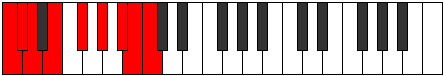 | [midi](https://github.com/edipermadi/music/blob/main/docs/ModeCNaturalIonaptyllic.mid?raw=true) |
| [3417](https://ianring.com/musictheory/scales/3417) | [Golian](ScaleGolian.md) | [Golian](ModeGolian.md) | **C**, D#, E, **F#**, G#, **A#**, B, **C** |  | [midi](https://github.com/edipermadi/music/blob/main/docs/ModeCNaturalGolian.mid?raw=true) |
| [3419](https://ianring.com/musictheory/scales/3419) | [Ionocryllic](ScaleIonocryllic.md) | [Danyllic](ModeDanyllic.md) | **C**, C#, D#, E, F#, G#, **A#**, B, **C** |  | [midi](https://github.com/edipermadi/music/blob/main/docs/ModeCNaturalDanyllic.mid?raw=true) |
| [3421](https://ianring.com/musictheory/scales/3421) | [Racryllic](ScaleRacryllic.md) | [Aerothyllic](ModeAerothyllic.md) | **C**, **D**, D#, E, **F#**, G#, **A#**, B, **C** |  | [midi](https://github.com/edipermadi/music/blob/main/docs/ModeCNaturalAerothyllic.mid?raw=true) |
| [3423](https://ianring.com/musictheory/scales/3423) | [Kyrygic](ScaleKyrygic.md) | [Lothygic](ModeLothygic.md) | **C**, C#, **D**, D#, E, F#, G#, **A#**, B, **C** |  | [midi](https://github.com/edipermadi/music/blob/main/docs/ModeCNaturalLothygic.mid?raw=true) |
| [3427](https://ianring.com/musictheory/scales/3427) | [Ionythian](ScaleIonythian.md) | [Zacrian](ModeZacrian.md) | **C**, Db, E#, F#, **G#**, A#, B, **C** |  | [midi](https://github.com/edipermadi/music/blob/main/docs/ModeCNaturalZacrian.mid?raw=true) |
| [3429](https://ianring.com/musictheory/scales/3429) | [Korian](ScaleKorian.md) | [Marian](ModeMarian.md) | **C**, **D**, E#, **F#**, **G#**, A#, B, **C** |  | [midi](https://github.com/edipermadi/music/blob/main/docs/ModeCNaturalMarian.mid?raw=true) |
| [3431](https://ianring.com/musictheory/scales/3431) | [Aeolothyllic](ScaleAeolothyllic.md) | [Zyptyllic](ModeZyptyllic.md) | **C**, C#, **D**, F, F#, **G#**, A#, B, **C** |  | [midi](https://github.com/edipermadi/music/blob/main/docs/ModeCNaturalZyptyllic.mid?raw=true) |
| [3433](https://ianring.com/musictheory/scales/3433) | [Thonian](ScaleThonian.md) | [Thonian](ModeThonian.md) | **C**, D#, E#, **F#**, G#, A#, B, **C** |  | [midi](https://github.com/edipermadi/music/blob/main/docs/ModeCNaturalThonian.mid?raw=true) |
| [3435](https://ianring.com/musictheory/scales/3435) | [Aerycryllic](ScaleAerycryllic.md) | [Epiphyllic](ModeEpiphyllic.md) | **C**, C#, D#, F, F#, G#, A#, B, **C** |  | [midi](https://github.com/edipermadi/music/blob/main/docs/ModeCNaturalEpiphyllic.mid?raw=true) |
| [3437](https://ianring.com/musictheory/scales/3437) | [Dalyllic](ScaleDalyllic.md) | [Gathyllic](ModeGathyllic.md) | **C**, **D**, D#, F, **F#**, G#, A#, B, **C** |  | [midi](https://github.com/edipermadi/music/blob/main/docs/ModeCNaturalGathyllic.mid?raw=true) |
| [3439](https://ianring.com/musictheory/scales/3439) | [Apinygic](ScaleApinygic.md) | [Lythygic](ModeLythygic.md) | **C**, C#, **D**, D#, F, F#, G#, A#, B, **C** |  | [midi](https://github.com/edipermadi/music/blob/main/docs/ModeCNaturalLythygic.mid?raw=true) |
| [3441](https://ianring.com/musictheory/scales/3441) | [Thacrian](ScaleThacrian.md) | [Thacrian](ModeThacrian.md) | **C**, D##, E#, **F#**, **G#**, A#, B, **C** |  | [midi](https://github.com/edipermadi/music/blob/main/docs/ModeCNaturalThacrian.mid?raw=true) |
| [3443](https://ianring.com/musictheory/scales/3443) | [Aeracryllic](ScaleAeracryllic.md) | [Epathyllic](ModeEpathyllic.md) | **C**, C#, E, F, F#, **G#**, A#, B, **C** |  | [midi](https://github.com/edipermadi/music/blob/main/docs/ModeCNaturalEpathyllic.mid?raw=true) |
| [3445](https://ianring.com/musictheory/scales/3445) | [Epotyllic](ScaleEpotyllic.md) | [Epotyllic](ModeEpotyllic.md) | **C**, **D**, E, F, **F#**, **G#**, A#, B, **C** |  | [midi](https://github.com/edipermadi/music/blob/main/docs/ModeCNaturalEpotyllic.mid?raw=true) |
| [3447](https://ianring.com/musictheory/scales/3447) | [Kaptygic](ScaleKaptygic.md) | [Kynygic](ModeKynygic.md) | **C**, C#, **D**, E, F, F#, **G#**, A#, B, **C** |  | [midi](https://github.com/edipermadi/music/blob/main/docs/ModeCNaturalKynygic.mid?raw=true) |
| [3449](https://ianring.com/musictheory/scales/3449) | [Bacryllic](ScaleBacryllic.md) | [Bacryllic](ModeBacryllic.md) | **C**, D#, E, F, **F#**, G#, A#, B, **C** |  | [midi](https://github.com/edipermadi/music/blob/main/docs/ModeCNaturalBacryllic.mid?raw=true) |
| [3451](https://ianring.com/musictheory/scales/3451) | [Aerycrygic](ScaleAerycrygic.md) | [Garygic](ModeGarygic.md) | **C**, C#, D#, E, F, F#, G#, A#, B, **C** |  | [midi](https://github.com/edipermadi/music/blob/main/docs/ModeCNaturalGarygic.mid?raw=true) |
| [3453](https://ianring.com/musictheory/scales/3453) | [Porygic](ScalePorygic.md) | [Katarygic](ModeKatarygic.md) | **C**, **D**, D#, E, F, **F#**, G#, A#, B, **C** |  | [midi](https://github.com/edipermadi/music/blob/main/docs/ModeCNaturalKatarygic.mid?raw=true) |
| [3455](https://ianring.com/musictheory/scales/3455) | [Sydyllian](ScaleSydyllian.md) | [Ryptyllian](ModeRyptyllian.md) | **C**, C#, **D**, D#, E, F, F#, G#, A#, B, **C** |  | [midi](https://github.com/edipermadi/music/blob/main/docs/ModeCNaturalRyptyllian.mid?raw=true) |
| [3465](https://ianring.com/musictheory/scales/3465) | [Syrimic](ScaleSyrimic.md) | [Katathimic](ModeKatathimic.md) | C, D#, **E###**, F###, **G###**, **A##**, C |  | [midi](https://github.com/edipermadi/music/blob/main/docs/ModeCNaturalKatathimic.mid?raw=true) |
| [3467](https://ianring.com/musictheory/scales/3467) | [Zorian](ScaleZorian.md) | [Katonian](ModeKatonian.md) | C, Db, Eb, **F##**, G#, **A#**, **B**, C |  | [midi](https://github.com/edipermadi/music/blob/main/docs/ModeCNaturalKatonian.mid?raw=true) |
| [3469](https://ianring.com/musictheory/scales/3469) | [Stythian](ScaleStythian.md) | [Monian](ModeMonian.md) | C, **D**, Eb, F##, G#, **A#**, **B**, C |  | [midi](https://github.com/edipermadi/music/blob/main/docs/ModeCNaturalMonian.mid?raw=true) |
| [3471](https://ianring.com/musictheory/scales/3471) | [Dolyllic](ScaleDolyllic.md) | [Gyryllic](ModeGyryllic.md) | C, C#, **D**, D#, G, G#, **A#**, **B**, C |  | [midi](https://github.com/edipermadi/music/blob/main/docs/ModeCNaturalGyryllic.mid?raw=true) |
| [3473](https://ianring.com/musictheory/scales/3473) | [Lathimic](ScaleLathimic.md) | [Lathimic](ModeLathimic.md) | C, D##, **E###**, **F###**, **G###**, **A##**, C |  | [midi](https://github.com/edipermadi/music/blob/main/docs/ModeCNaturalLathimic.mid?raw=true) |
| [3475](https://ianring.com/musictheory/scales/3475) | [Epagian](ScaleEpagian.md) | [Kylian](ModeKylian.md) | C, Db, E, **F##**, **G#**, **A#**, **B**, C |  | [midi](https://github.com/edipermadi/music/blob/main/docs/ModeCNaturalKylian.mid?raw=true) |
| [3477](https://ianring.com/musictheory/scales/3477) | [Ionanian](ScaleIonanian.md) | [Kyptian](ModeKyptian.md) | C, **D**, E, F##, **G#**, **A#**, **B**, C |  | [midi](https://github.com/edipermadi/music/blob/main/docs/ModeCNaturalKyptian.mid?raw=true) |
| [3479](https://ianring.com/musictheory/scales/3479) | [Stacryllic](ScaleStacryllic.md) | [Rothyllic](ModeRothyllic.md) | C, C#, **D**, E, G, **G#**, **A#**, **B**, C |  | [midi](https://github.com/edipermadi/music/blob/main/docs/ModeCNaturalRothyllic.mid?raw=true) |
| [3481](https://ianring.com/musictheory/scales/3481) | [Katathian](ScaleKatathian.md) | [Katathian](ModeKatathian.md) | C, D#, E, **F##**, G#, **A#**, **B**, C |  | [midi](https://github.com/edipermadi/music/blob/main/docs/ModeCNaturalKatathian.mid?raw=true) |
| [3483](https://ianring.com/musictheory/scales/3483) | [Doptyllic](ScaleDoptyllic.md) | [Mixotharyllic](ModeMixotharyllic.md) | C, C#, D#, E, **G**, G#, **A#**, **B**, C |  | [midi](https://github.com/edipermadi/music/blob/main/docs/ModeCNaturalMixotharyllic.mid?raw=true) |
| [3485](https://ianring.com/musictheory/scales/3485) | [Thyptyllic](ScaleThyptyllic.md) | [Kyptyllic](ModeKyptyllic.md) | C, **D**, D#, E, G, G#, **A#**, **B**, C |  | [midi](https://github.com/edipermadi/music/blob/main/docs/ModeCNaturalKyptyllic.mid?raw=true) |
| [3487](https://ianring.com/musictheory/scales/3487) | [Phrygic](ScalePhrygic.md) | [Byptygic](ModeByptygic.md) | C, C#, **D**, D#, E, G, G#, **A#**, **B**, C |  | [midi](https://github.com/edipermadi/music/blob/main/docs/ModeCNaturalByptygic.mid?raw=true) |
| [3491](https://ianring.com/musictheory/scales/3491) | [Aeopian](ScaleAeopian.md) | [Tharian](ModeTharian.md) | C, Db, E#, **F##**, **G#**, A#, **B**, C |  | [midi](https://github.com/edipermadi/music/blob/main/docs/ModeCNaturalTharian.mid?raw=true) |
| [3493](https://ianring.com/musictheory/scales/3493) | [Ionopian](ScaleIonopian.md) | [Rathian](ModeRathian.md) | C, **D**, E#, F##, **G#**, A#, **B**, C |  | [midi](https://github.com/edipermadi/music/blob/main/docs/ModeCNaturalRathian.mid?raw=true) |
| [3495](https://ianring.com/musictheory/scales/3495) | [Lydyllic](ScaleLydyllic.md) | [Banyllic](ModeBanyllic.md) | C, C#, **D**, F, G, **G#**, A#, **B**, C |  | [midi](https://github.com/edipermadi/music/blob/main/docs/ModeCNaturalBanyllic.mid?raw=true) |
| [3497](https://ianring.com/musictheory/scales/3497) | [Phrolian](ScalePhrolian.md) | [Phrolian](ModePhrolian.md) | C, D#, E#, **F##**, G#, A#, **B**, C |  | [midi](https://github.com/edipermadi/music/blob/main/docs/ModeCNaturalPhrolian.mid?raw=true) |
| [3499](https://ianring.com/musictheory/scales/3499) | [Rocryllic](ScaleRocryllic.md) | [Lythyllic](ModeLythyllic.md) | C, C#, D#, F, **G**, G#, A#, **B**, C |  | [midi](https://github.com/edipermadi/music/blob/main/docs/ModeCNaturalLythyllic.mid?raw=true) |
| [3501](https://ianring.com/musictheory/scales/3501) | [Ionoptyllic](ScaleIonoptyllic.md) | [Katodyllic](ModeKatodyllic.md) | C, **D**, D#, F, G, G#, A#, **B**, C |  | [midi](https://github.com/edipermadi/music/blob/main/docs/ModeCNaturalKatodyllic.mid?raw=true) |
| [3503](https://ianring.com/musictheory/scales/3503) | [Bagygic](ScaleBagygic.md) | [Zyphygic](ModeZyphygic.md) | C, C#, **D**, D#, F, G, G#, A#, **B**, C |  | [midi](https://github.com/edipermadi/music/blob/main/docs/ModeCNaturalZyphygic.mid?raw=true) |
| [3505](https://ianring.com/musictheory/scales/3505) | [Stygian](ScaleStygian.md) | [Stygian](ModeStygian.md) | C, D##, E#, **F##**, **G#**, A#, **B**, C |  | [midi](https://github.com/edipermadi/music/blob/main/docs/ModeCNaturalStygian.mid?raw=true) |
| [3507](https://ianring.com/musictheory/scales/3507) | [Maptyllic](ScaleMaptyllic.md) | [Ponyllic](ModePonyllic.md) | C, C#, E, F, **G**, **G#**, A#, **B**, C |  | [midi](https://github.com/edipermadi/music/blob/main/docs/ModeCNaturalPonyllic.mid?raw=true) |
| [3509](https://ianring.com/musictheory/scales/3509) | [Stogyllic](ScaleStogyllic.md) | [Stogyllic](ModeStogyllic.md) | C, **D**, E, F, G, **G#**, A#, **B**, C |  | [midi](https://github.com/edipermadi/music/blob/main/docs/ModeCNaturalStogyllic.mid?raw=true) |
| [3511](https://ianring.com/musictheory/scales/3511) | [Koptygic](ScaleKoptygic.md) | [Epolygic](ModeEpolygic.md) | C, C#, **D**, E, F, G, **G#**, A#, **B**, C |  | [midi](https://github.com/edipermadi/music/blob/main/docs/ModeCNaturalEpolygic.mid?raw=true) |
| [3513](https://ianring.com/musictheory/scales/3513) | [Dydyllic](ScaleDydyllic.md) | [Dydyllic](ModeDydyllic.md) | C, D#, E, F, **G**, G#, A#, **B**, C |  | [midi](https://github.com/edipermadi/music/blob/main/docs/ModeCNaturalDydyllic.mid?raw=true) |
| [3515](https://ianring.com/musictheory/scales/3515) | [Aeolorygic](ScaleAeolorygic.md) | [Katodygic](ModeKatodygic.md) | C, C#, D#, E, F, **G**, G#, A#, **B**, C |  | [midi](https://github.com/edipermadi/music/blob/main/docs/ModeCNaturalKatodygic.mid?raw=true) |
| [3517](https://ianring.com/musictheory/scales/3517) | [Epyrygic](ScaleEpyrygic.md) | [Epocrygic](ModeEpocrygic.md) | C, **D**, D#, E, F, G, G#, A#, **B**, C |  | [midi](https://github.com/edipermadi/music/blob/main/docs/ModeCNaturalEpocrygic.mid?raw=true) |
| [3519](https://ianring.com/musictheory/scales/3519) | [Gothyllian](ScaleGothyllian.md) | [Boptyllian](ModeBoptyllian.md) | C, C#, **D**, D#, E, F, G, G#, A#, **B**, C |  | [midi](https://github.com/edipermadi/music/blob/main/docs/ModeCNaturalBoptyllian.mid?raw=true) |
| [3525](https://ianring.com/musictheory/scales/3525) | [Katacrian](ScaleKatacrian.md) | [Zocrian](ModeZocrian.md) | C, **D**, **E##**, F##, **G#**, **A#**, B, C |  | [midi](https://github.com/edipermadi/music/blob/main/docs/ModeCNaturalZocrian.mid?raw=true) |
| [3527](https://ianring.com/musictheory/scales/3527) | [Thagyllic](ScaleThagyllic.md) | [Ronyllic](ModeRonyllic.md) | C, C#, **D**, F#, G, **G#**, **A#**, B, C |  | [midi](https://github.com/edipermadi/music/blob/main/docs/ModeCNaturalRonyllic.mid?raw=true) |
| [3529](https://ianring.com/musictheory/scales/3529) | [Stalian](ScaleStalian.md) | [Stalian](ModeStalian.md) | C, D#, **E##**, **F##**, G#, **A#**, B, C |  | [midi](https://github.com/edipermadi/music/blob/main/docs/ModeCNaturalStalian.mid?raw=true) |
| [3531](https://ianring.com/musictheory/scales/3531) | [Dagyllic](ScaleDagyllic.md) | [Dycryllic](ModeDycryllic.md) | C, C#, D#, F#, **G**, G#, **A#**, B, C |  | [midi](https://github.com/edipermadi/music/blob/main/docs/ModeCNaturalDycryllic.mid?raw=true) |
| [3533](https://ianring.com/musictheory/scales/3533) | [Lonyllic](ScaleLonyllic.md) | [Thadyllic](ModeThadyllic.md) | C, **D**, D#, **F#**, G, G#, **A#**, B, C |  | [midi](https://github.com/edipermadi/music/blob/main/docs/ModeCNaturalThadyllic.mid?raw=true) |
| [3535](https://ianring.com/musictheory/scales/3535) | [Kalygic](ScaleKalygic.md) | [Aeroptygic](ModeAeroptygic.md) | C, C#, **D**, D#, F#, G, G#, **A#**, B, C |  | [midi](https://github.com/edipermadi/music/blob/main/docs/ModeCNaturalAeroptygic.mid?raw=true) |
| [3537](https://ianring.com/musictheory/scales/3537) | [Katogian](ScaleKatogian.md) | [Katogian](ModeKatogian.md) | C, D##, **E##**, **F##**, **G#**, **A#**, B, C |  | [midi](https://github.com/edipermadi/music/blob/main/docs/ModeCNaturalKatogian.mid?raw=true) |
| [3539](https://ianring.com/musictheory/scales/3539) | [Zoryllic](ScaleZoryllic.md) | [Aeoryllic](ModeAeoryllic.md) | C, C#, E, F#, **G**, **G#**, **A#**, B, C |  | [midi](https://github.com/edipermadi/music/blob/main/docs/ModeCNaturalAeoryllic.mid?raw=true) |
| [3541](https://ianring.com/musictheory/scales/3541) | [Racryllic](ScaleRacryllic.md) | [Racryllic](ModeRacryllic.md) | C, **D**, E, **F#**, G, **G#**, **A#**, B, C |  | [midi](https://github.com/edipermadi/music/blob/main/docs/ModeCNaturalRacryllic.mid?raw=true) |
| [3543](https://ianring.com/musictheory/scales/3543) | [Porygic](ScalePorygic.md) | [Aeolonygic](ModeAeolonygic.md) | C, C#, **D**, E, F#, G, **G#**, **A#**, B, C |  | [midi](https://github.com/edipermadi/music/blob/main/docs/ModeCNaturalAeolonygic.mid?raw=true) |
| [3545](https://ianring.com/musictheory/scales/3545) | [Thyptyllic](ScaleThyptyllic.md) | [Thyptyllic](ModeThyptyllic.md) | C, D#, E, **F#**, **G**, G#, **A#**, B, C |  | [midi](https://github.com/edipermadi/music/blob/main/docs/ModeCNaturalThyptyllic.mid?raw=true) |
| [3547](https://ianring.com/musictheory/scales/3547) | [Epyrygic](ScaleEpyrygic.md) | [Sadygic](ModeSadygic.md) | C, C#, D#, E, F#, **G**, G#, **A#**, B, C |  | [midi](https://github.com/edipermadi/music/blob/main/docs/ModeCNaturalSadygic.mid?raw=true) |
| [3549](https://ianring.com/musictheory/scales/3549) | [Phronygic](ScalePhronygic.md) | [Phronygic](ModePhronygic.md) | C, **D**, D#, E, **F#**, G, G#, **A#**, B, C |  | [midi](https://github.com/edipermadi/music/blob/main/docs/ModeCNaturalPhronygic.mid?raw=true) |
| [3551](https://ianring.com/musictheory/scales/3551) | [Staptyllian](ScaleStaptyllian.md) | [Sagyllian](ModeSagyllian.md) | C, C#, **D**, D#, E, F#, G, G#, **A#**, B, C |  | [midi](https://github.com/edipermadi/music/blob/main/docs/ModeCNaturalSagyllian.mid?raw=true) |
| [3555](https://ianring.com/musictheory/scales/3555) | [Pynyllic](ScalePynyllic.md) | [Pylyllic](ModePylyllic.md) | C, C#, F, F#, **G**, **G#**, A#, B, C |  | [midi](https://github.com/edipermadi/music/blob/main/docs/ModeCNaturalPylyllic.mid?raw=true) |
| [3557](https://ianring.com/musictheory/scales/3557) | [Zagyllic](ScaleZagyllic.md) | [Thycryllic](ModeThycryllic.md) | C, **D**, F, **F#**, G, **G#**, A#, B, C |  | [midi](https://github.com/edipermadi/music/blob/main/docs/ModeCNaturalThycryllic.mid?raw=true) |
| [3559](https://ianring.com/musictheory/scales/3559) | [Mixolydygic](ScaleMixolydygic.md) | [Aerathygic](ModeAerathygic.md) | C, C#, **D**, F, F#, G, **G#**, A#, B, C |  | [midi](https://github.com/edipermadi/music/blob/main/docs/ModeCNaturalAerathygic.mid?raw=true) |
| [3561](https://ianring.com/musictheory/scales/3561) | [Pothyllic](ScalePothyllic.md) | [Pothyllic](ModePothyllic.md) | C, D#, F, **F#**, **G**, G#, A#, B, C |  | [midi](https://github.com/edipermadi/music/blob/main/docs/ModeCNaturalPothyllic.mid?raw=true) |
| [3563](https://ianring.com/musictheory/scales/3563) | [Aerycrygic](ScaleAerycrygic.md) | [Ionoptygic](ModeIonoptygic.md) | C, C#, D#, F, F#, **G**, G#, A#, B, C |  | [midi](https://github.com/edipermadi/music/blob/main/docs/ModeCNaturalIonoptygic.mid?raw=true) |
| [3565](https://ianring.com/musictheory/scales/3565) | [Aeolorygic](ScaleAeolorygic.md) | [Aeolorygic](ModeAeolorygic.md) | C, **D**, D#, F, **F#**, G, G#, A#, B, C |  | [midi](https://github.com/edipermadi/music/blob/main/docs/ModeCNaturalAeolorygic.mid?raw=true) |
| [3567](https://ianring.com/musictheory/scales/3567) | [Aerycryllian](ScaleAerycryllian.md) | [Epityllian](ModeEpityllian.md) | C, C#, **D**, D#, F, F#, G, G#, A#, B, C |  | [midi](https://github.com/edipermadi/music/blob/main/docs/ModeCNaturalEpityllian.mid?raw=true) |
| [3569](https://ianring.com/musictheory/scales/3569) | [Aeoladyllic](ScaleAeoladyllic.md) | [Aeoladyllic](ModeAeoladyllic.md) | C, E, F, **F#**, **G**, **G#**, A#, B, C |  | [midi](https://github.com/edipermadi/music/blob/main/docs/ModeCNaturalAeoladyllic.mid?raw=true) |
| [3571](https://ianring.com/musictheory/scales/3571) | [Dycrygic](ScaleDycrygic.md) | [Dyrygic](ModeDyrygic.md) | C, C#, E, F, F#, **G**, **G#**, A#, B, C |  | [midi](https://github.com/edipermadi/music/blob/main/docs/ModeCNaturalDyrygic.mid?raw=true) |
| [3573](https://ianring.com/musictheory/scales/3573) | [Kaptygic](ScaleKaptygic.md) | [Kaptygic](ModeKaptygic.md) | C, **D**, E, F, **F#**, G, **G#**, A#, B, C |  | [midi](https://github.com/edipermadi/music/blob/main/docs/ModeCNaturalKaptygic.mid?raw=true) |
| [3575](https://ianring.com/musictheory/scales/3575) | [Thydyllian](ScaleThydyllian.md) | [Mogyllian](ModeMogyllian.md) | C, C#, **D**, E, F, F#, G, **G#**, A#, B, C |  | [midi](https://github.com/edipermadi/music/blob/main/docs/ModeCNaturalMogyllian.mid?raw=true) |
| [3577](https://ianring.com/musictheory/scales/3577) | [Loptygic](ScaleLoptygic.md) | [Loptygic](ModeLoptygic.md) | C, D#, E, F, **F#**, **G**, G#, A#, B, C |  | [midi](https://github.com/edipermadi/music/blob/main/docs/ModeCNaturalLoptygic.mid?raw=true) |
| [3579](https://ianring.com/musictheory/scales/3579) | [Aerycryllian](ScaleAerycryllian.md) | [Zyphyllian](ModeZyphyllian.md) | C, C#, D#, E, F, F#, **G**, G#, A#, B, C |  | [midi](https://github.com/edipermadi/music/blob/main/docs/ModeCNaturalZyphyllian.mid?raw=true) |
| [3581](https://ianring.com/musictheory/scales/3581) | [Staptyllian](ScaleStaptyllian.md) | [Epocryllian](ModeEpocryllian.md) | C, **D**, D#, E, F, **F#**, G, G#, A#, B, C |  | [midi](https://github.com/edipermadi/music/blob/main/docs/ModeCNaturalEpocryllian.mid?raw=true) |
| [3583](https://ianring.com/musictheory/scales/3583) | [Aerycratic](ScaleAerycratic.md) | [Zylatic](ModeZylatic.md) | C, C#, **D**, D#, E, F, F#, G, G#, A#, B, C |  | [midi](https://github.com/edipermadi/music/blob/main/docs/ModeCNaturalZylatic.mid?raw=true) |
| [3619](https://ianring.com/musictheory/scales/3619) | [Ponimic](ScalePonimic.md) | [Thanimic](ModeThanimic.md) | **C**, **Db**, E#, **Cbbb**, Cbb, **Dbbb**, **C** |  | [midi](https://github.com/edipermadi/music/blob/main/docs/ModeCNaturalThanimic.mid?raw=true) |
| [3621](https://ianring.com/musictheory/scales/3621) | [Kytrimic](ScaleKytrimic.md) | [Gylimic](ModeGylimic.md) | **C**, D, E#, **Cbbb**, Cbb, **Dbbb**, **C** |  | [midi](https://github.com/edipermadi/music/blob/main/docs/ModeCNaturalGylimic.mid?raw=true) |
| [3623](https://ianring.com/musictheory/scales/3623) | [Katyptian](ScaleKatyptian.md) | [Aerocrian](ModeAerocrian.md) | **C**, **Db**, Ebb, F, **G##**, A#, **B**, **C** |  | [midi](https://github.com/edipermadi/music/blob/main/docs/ModeCNaturalAerocrian.mid?raw=true) |
| [3625](https://ianring.com/musictheory/scales/3625) | [Pynimic](ScalePynimic.md) | [Podimic](ModePodimic.md) | **C**, D#, E#, **Cbbb**, Cbb, **Dbbb**, **C** |  | [midi](https://github.com/edipermadi/music/blob/main/docs/ModeCNaturalPodimic.mid?raw=true) |
| [3627](https://ianring.com/musictheory/scales/3627) | [Stanian](ScaleStanian.md) | [Kalian](ModeKalian.md) | **C**, **Db**, Eb, F, **G##**, A#, **B**, **C** |  | [midi](https://github.com/edipermadi/music/blob/main/docs/ModeCNaturalKalian.mid?raw=true) |
| [3629](https://ianring.com/musictheory/scales/3629) | [Saptian](ScaleSaptian.md) | [Boptian](ModeBoptian.md) | **C**, D, Eb, F, **G##**, A#, **B**, **C** |  | [midi](https://github.com/edipermadi/music/blob/main/docs/ModeCNaturalBoptian.mid?raw=true) |
| [3631](https://ianring.com/musictheory/scales/3631) | [Stolyllic](ScaleStolyllic.md) | [Gydyllic](ModeGydyllic.md) | **C**, **C#**, D, D#, F, **A**, A#, **B**, **C** |  | [midi](https://github.com/edipermadi/music/blob/main/docs/ModeCNaturalGydyllic.mid?raw=true) |
| [3633](https://ianring.com/musictheory/scales/3633) | [Daptimic](ScaleDaptimic.md) | [Daptimic](ModeDaptimic.md) | **C**, D##, E#, Cbbb, Cbb, **Dbbb**, **C** | 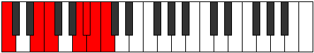 | [midi](https://github.com/edipermadi/music/blob/main/docs/ModeCNaturalDaptimic.mid?raw=true) |
| [3635](https://ianring.com/musictheory/scales/3635) | [Thycrian](ScaleThycrian.md) | [Katygian](ModeKatygian.md) | **C**, **Db**, E, F, G##, A#, **B**, **C** |  | [midi](https://github.com/edipermadi/music/blob/main/docs/ModeCNaturalKatygian.mid?raw=true) |
| [3637](https://ianring.com/musictheory/scales/3637) | [Zogian](ScaleZogian.md) | [Kygian](ModeKygian.md) | **C**, D, E, F, G##, A#, **B**, **C** |  | [midi](https://github.com/edipermadi/music/blob/main/docs/ModeCNaturalKygian.mid?raw=true) |
| [3639](https://ianring.com/musictheory/scales/3639) | [Phroryllic](ScalePhroryllic.md) | [Paptyllic](ModePaptyllic.md) | **C**, **C#**, D, E, F, A, A#, **B**, **C** |  | [midi](https://github.com/edipermadi/music/blob/main/docs/ModeCNaturalPaptyllic.mid?raw=true) |
| [3641](https://ianring.com/musictheory/scales/3641) | [Aeolacrian](ScaleAeolacrian.md) | [Thocrian](ModeThocrian.md) | **C**, D#, E, F, G##, A#, **B**, **C** |  | [midi](https://github.com/edipermadi/music/blob/main/docs/ModeCNaturalThocrian.mid?raw=true) |
| [3643](https://ianring.com/musictheory/scales/3643) | [Aeoladyllic](ScaleAeoladyllic.md) | [Kydyllic](ModeKydyllic.md) | **C**, **C#**, D#, E, F, A, A#, **B**, **C** |  | [midi](https://github.com/edipermadi/music/blob/main/docs/ModeCNaturalKydyllic.mid?raw=true) |
| [3645](https://ianring.com/musictheory/scales/3645) | [Pynyllic](ScalePynyllic.md) | [Zycryllic](ModeZycryllic.md) | **C**, D, D#, E, F, A, A#, **B**, **C** |  | [midi](https://github.com/edipermadi/music/blob/main/docs/ModeCNaturalZycryllic.mid?raw=true) |
| [3647](https://ianring.com/musictheory/scales/3647) | [Manygic](ScaleManygic.md) | [Eporygic](ModeEporygic.md) | **C**, **C#**, D, D#, E, F, A, A#, **B**, **C** |  | [midi](https://github.com/edipermadi/music/blob/main/docs/ModeCNaturalEporygic.mid?raw=true) |
| [3653](https://ianring.com/musictheory/scales/3653) | [Galimic](ScaleGalimic.md) | [Sathimic](ModeSathimic.md) | **C**, D, **E##**, **Cbbb**, **Cbb**, Dbbb, **C** |  | [midi](https://github.com/edipermadi/music/blob/main/docs/ModeCNaturalSathimic.mid?raw=true) |
| [3655](https://ianring.com/musictheory/scales/3655) | [Thadian](ScaleThadian.md) | [Mathian](ModeMathian.md) | **C**, **Db**, Ebb, F#, **G##**, **A#**, B, **C** |  | [midi](https://github.com/edipermadi/music/blob/main/docs/ModeCNaturalMathian.mid?raw=true) |
| [3657](https://ianring.com/musictheory/scales/3657) | [Epynimic](ScaleEpynimic.md) | [Epynimic](ModeEpynimic.md) | **C**, D#, **E##**, **Cbbb**, **Cbb**, Dbbb, **C** |  | [midi](https://github.com/edipermadi/music/blob/main/docs/ModeCNaturalEpynimic.mid?raw=true) |
| [3659](https://ianring.com/musictheory/scales/3659) | [Katoptian](ScaleKatoptian.md) | [Polian](ModePolian.md) | **C**, **Db**, Eb, F#, **G##**, **A#**, B, **C** |  | [midi](https://github.com/edipermadi/music/blob/main/docs/ModeCNaturalPolian.mid?raw=true) |
| [3661](https://ianring.com/musictheory/scales/3661) | [Gacrian](ScaleGacrian.md) | [Mixodorian](ModeMixodorian.md) | **C**, D, Eb, **F#**, **G##**, **A#**, B, **C** |  | [midi](https://github.com/edipermadi/music/blob/main/docs/ModeCNaturalMixodorian.mid?raw=true) |
| [3663](https://ianring.com/musictheory/scales/3663) | [Zaryllic](ScaleZaryllic.md) | [Sonyllic](ModeSonyllic.md) | **C**, **C#**, D, D#, F#, **A**, **A#**, B, **C** |  | [midi](https://github.com/edipermadi/music/blob/main/docs/ModeCNaturalSonyllic.mid?raw=true) |
| [3665](https://ianring.com/musictheory/scales/3665) | [Stalimic](ScaleStalimic.md) | [Stalimic](ModeStalimic.md) | **C**, D##, **E##**, Cbbb, **Cbb**, Dbbb, **C** |  | [midi](https://github.com/edipermadi/music/blob/main/docs/ModeCNaturalStalimic.mid?raw=true) |
| [3667](https://ianring.com/musictheory/scales/3667) | [Morian](ScaleMorian.md) | [Kaptian](ModeKaptian.md) | **C**, **Db**, E, F#, G##, **A#**, B, **C** |  | [midi](https://github.com/edipermadi/music/blob/main/docs/ModeCNaturalKaptian.mid?raw=true) |
| [3669](https://ianring.com/musictheory/scales/3669) | [Pagian](ScalePagian.md) | [Mothian](ModeMothian.md) | **C**, D, E, **F#**, G##, **A#**, B, **C** |  | [midi](https://github.com/edipermadi/music/blob/main/docs/ModeCNaturalMothian.mid?raw=true) |
| [3671](https://ianring.com/musictheory/scales/3671) | [Kataryllic](ScaleKataryllic.md) | [Aeonyllic](ModeAeonyllic.md) | **C**, **C#**, D, E, F#, A, **A#**, B, **C** |  | [midi](https://github.com/edipermadi/music/blob/main/docs/ModeCNaturalAeonyllic.mid?raw=true) |
| [3673](https://ianring.com/musictheory/scales/3673) | [Ranian](ScaleRanian.md) | [Ranian](ModeRanian.md) | **C**, D#, E, **F#**, G##, **A#**, B, **C** |  | [midi](https://github.com/edipermadi/music/blob/main/docs/ModeCNaturalRanian.mid?raw=true) |
| [3675](https://ianring.com/musictheory/scales/3675) | [Tharyllic](ScaleTharyllic.md) | [Monyllic](ModeMonyllic.md) | **C**, **C#**, D#, E, F#, A, **A#**, B, **C** |  | [midi](https://github.com/edipermadi/music/blob/main/docs/ModeCNaturalMonyllic.mid?raw=true) |
| [3677](https://ianring.com/musictheory/scales/3677) | [Zagyllic](ScaleZagyllic.md) | [Katylyllic](ModeKatylyllic.md) | **C**, D, D#, E, **F#**, A, **A#**, B, **C** |  | [midi](https://github.com/edipermadi/music/blob/main/docs/ModeCNaturalKatylyllic.mid?raw=true) |
| [3679](https://ianring.com/musictheory/scales/3679) | [Aeolacrygic](ScaleAeolacrygic.md) | [Rycrygic](ModeRycrygic.md) | **C**, **C#**, D, D#, E, F#, A, **A#**, B, **C** |  | [midi](https://github.com/edipermadi/music/blob/main/docs/ModeCNaturalRycrygic.mid?raw=true) |
| [3683](https://ianring.com/musictheory/scales/3683) | [Parian](ScaleParian.md) | [Dycrian](ModeDycrian.md) | **C**, **Db**, E#, F#, **G##**, A#, B, **C** |  | [midi](https://github.com/edipermadi/music/blob/main/docs/ModeCNaturalDycrian.mid?raw=true) |
| [3685](https://ianring.com/musictheory/scales/3685) | [Zarian](ScaleZarian.md) | [Kodian](ModeKodian.md) | **C**, D, E#, **F#**, **G##**, A#, B, **C** |  | [midi](https://github.com/edipermadi/music/blob/main/docs/ModeCNaturalKodian.mid?raw=true) |
| [3687](https://ianring.com/musictheory/scales/3687) | [Ioniptyllic](ScaleIoniptyllic.md) | [Zonyllic](ModeZonyllic.md) | **C**, **C#**, D, F, F#, **A**, A#, B, **C** |  | [midi](https://github.com/edipermadi/music/blob/main/docs/ModeCNaturalZonyllic.mid?raw=true) |
| [3689](https://ianring.com/musictheory/scales/3689) | [Katocrian](ScaleKatocrian.md) | [Katocrian](ModeKatocrian.md) | **C**, D#, E#, **F#**, **G##**, A#, B, **C** |  | [midi](https://github.com/edipermadi/music/blob/main/docs/ModeCNaturalKatocrian.mid?raw=true) |
| [3691](https://ianring.com/musictheory/scales/3691) | [Gythyllic](ScaleGythyllic.md) | [Badyllic](ModeBadyllic.md) | **C**, **C#**, D#, F, F#, **A**, A#, B, **C** |  | [midi](https://github.com/edipermadi/music/blob/main/docs/ModeCNaturalBadyllic.mid?raw=true) |
| [3693](https://ianring.com/musictheory/scales/3693) | [Aeolathyllic](ScaleAeolathyllic.md) | [Epaptyllic](ModeEpaptyllic.md) | **C**, D, D#, F, **F#**, **A**, A#, B, **C** |  | [midi](https://github.com/edipermadi/music/blob/main/docs/ModeCNaturalEpaptyllic.mid?raw=true) |
| [3695](https://ianring.com/musictheory/scales/3695) | [Zothygic](ScaleZothygic.md) | [Kodygic](ModeKodygic.md) | **C**, **C#**, D, D#, F, F#, **A**, A#, B, **C** |  | [midi](https://github.com/edipermadi/music/blob/main/docs/ModeCNaturalKodygic.mid?raw=true) |
| [3697](https://ianring.com/musictheory/scales/3697) | [Ionarian](ScaleIonarian.md) | [Ionarian](ModeIonarian.md) | **C**, D##, E#, **F#**, G##, A#, B, **C** |  | [midi](https://github.com/edipermadi/music/blob/main/docs/ModeCNaturalIonarian.mid?raw=true) |
| [3699](https://ianring.com/musictheory/scales/3699) | [Locryllic](ScaleLocryllic.md) | [Aeolylyllic](ModeAeolylyllic.md) | **C**, **C#**, E, F, F#, A, A#, B, **C** |  | [midi](https://github.com/edipermadi/music/blob/main/docs/ModeCNaturalAeolylyllic.mid?raw=true) |
| [3701](https://ianring.com/musictheory/scales/3701) | [Bacryllic](ScaleBacryllic.md) | [Bagyllic](ModeBagyllic.md) | **C**, D, E, F, **F#**, A, A#, B, **C** |  | [midi](https://github.com/edipermadi/music/blob/main/docs/ModeCNaturalBagyllic.mid?raw=true) |
| [3703](https://ianring.com/musictheory/scales/3703) | [Loptygic](ScaleLoptygic.md) | [Katalygic](ModeKatalygic.md) | **C**, **C#**, D, E, F, F#, A, A#, B, **C** |  | [midi](https://github.com/edipermadi/music/blob/main/docs/ModeCNaturalKatalygic.mid?raw=true) |
| [3705](https://ianring.com/musictheory/scales/3705) | [Sydyllic](ScaleSydyllic.md) | [Sydyllic](ModeSydyllic.md) | **C**, D#, E, F, **F#**, A, A#, B, **C** |  | [midi](https://github.com/edipermadi/music/blob/main/docs/ModeCNaturalSydyllic.mid?raw=true) |
| [3707](https://ianring.com/musictheory/scales/3707) | [Dycrygic](ScaleDycrygic.md) | [Rynygic](ModeRynygic.md) | **C**, **C#**, D#, E, F, F#, A, A#, B, **C** |  | [midi](https://github.com/edipermadi/music/blob/main/docs/ModeCNaturalRynygic.mid?raw=true) |
| [3709](https://ianring.com/musictheory/scales/3709) | [Mixolydygic](ScaleMixolydygic.md) | [Locrygic](ModeLocrygic.md) | **C**, D, D#, E, F, **F#**, A, A#, B, **C** |  | [midi](https://github.com/edipermadi/music/blob/main/docs/ModeCNaturalLocrygic.mid?raw=true) |
| [3711](https://ianring.com/musictheory/scales/3711) | [Katoryllian](ScaleKatoryllian.md) | [Dycryllian](ModeDycryllian.md) | **C**, **C#**, D, D#, E, F, F#, A, A#, B, **C** |  | [midi](https://github.com/edipermadi/music/blob/main/docs/ModeCNaturalDycryllian.mid?raw=true) |
| [3721](https://ianring.com/musictheory/scales/3721) | [Kocrimic](ScaleKocrimic.md) | [Phragimic](ModePhragimic.md) | C, D#, **E###**, **Cbbb**, **Cbb**, **Dbbb**, C |  | [midi](https://github.com/edipermadi/music/blob/main/docs/ModeCNaturalPhragimic.mid?raw=true) |
| [3723](https://ianring.com/musictheory/scales/3723) | [Gydian](ScaleGydian.md) | [Myptian](ModeMyptian.md) | C, **Db**, Eb, **F##**, **G##**, **A#**, **B**, C |  | [midi](https://github.com/edipermadi/music/blob/main/docs/ModeCNaturalMyptian.mid?raw=true) |
| [3725](https://ianring.com/musictheory/scales/3725) | [Epycrian](ScaleEpycrian.md) | [Kyrian](ModeKyrian.md) | C, D, Eb, F##, **G##**, **A#**, **B**, C |  | [midi](https://github.com/edipermadi/music/blob/main/docs/ModeCNaturalKyrian.mid?raw=true) |
| [3727](https://ianring.com/musictheory/scales/3727) | [Stycryllic](ScaleStycryllic.md) | [Tholyllic](ModeTholyllic.md) | C, **C#**, D, D#, G, **A**, **A#**, **B**, C |  | [midi](https://github.com/edipermadi/music/blob/main/docs/ModeCNaturalTholyllic.mid?raw=true) |
| [3729](https://ianring.com/musictheory/scales/3729) | [Starimic](ScaleStarimic.md) | [Starimic](ModeStarimic.md) | C, D##, **E###**, Cbbb, **Cbb**, **Dbbb**, C |  | [midi](https://github.com/edipermadi/music/blob/main/docs/ModeCNaturalStarimic.mid?raw=true) |
| [3731](https://ianring.com/musictheory/scales/3731) | [Bonian](ScaleBonian.md) | [Aeryrian](ModeAeryrian.md) | C, **Db**, E, **F##**, G##, **A#**, **B**, C |  | [midi](https://github.com/edipermadi/music/blob/main/docs/ModeCNaturalAeryrian.mid?raw=true) |
| [3733](https://ianring.com/musictheory/scales/3733) | [Stathian](ScaleStathian.md) | [Gycrian](ModeGycrian.md) | C, D, E, F##, G##, **A#**, **B**, C |  | [midi](https://github.com/edipermadi/music/blob/main/docs/ModeCNaturalGycrian.mid?raw=true) |
| [3735](https://ianring.com/musictheory/scales/3735) | [Mixolydyllic](ScaleMixolydyllic.md) | [Ionagyllic](ModeIonagyllic.md) | C, **C#**, D, E, G, A, **A#**, **B**, C |  | [midi](https://github.com/edipermadi/music/blob/main/docs/ModeCNaturalIonagyllic.mid?raw=true) |
| [3737](https://ianring.com/musictheory/scales/3737) | [Laptian](ScaleLaptian.md) | [Phrocrian](ModePhrocrian.md) | C, D#, E, **F##**, G##, **A#**, **B**, C |  | [midi](https://github.com/edipermadi/music/blob/main/docs/ModeCNaturalPhrocrian.mid?raw=true) |
| [3739](https://ianring.com/musictheory/scales/3739) | [Aeronyllic](ScaleAeronyllic.md) | [Ioninyllic](ModeIoninyllic.md) | C, **C#**, D#, E, **G**, A, **A#**, **B**, C |  | [midi](https://github.com/edipermadi/music/blob/main/docs/ModeCNaturalIoninyllic.mid?raw=true) |
| [3741](https://ianring.com/musictheory/scales/3741) | [Pothyllic](ScalePothyllic.md) | [Zydyllic](ModeZydyllic.md) | C, D, D#, E, G, A, **A#**, **B**, C |  | [midi](https://github.com/edipermadi/music/blob/main/docs/ModeCNaturalZydyllic.mid?raw=true) |
| [3743](https://ianring.com/musictheory/scales/3743) | [Sathygic](ScaleSathygic.md) | [Thadygic](ModeThadygic.md) | C, **C#**, D, D#, E, G, A, **A#**, **B**, C |  | [midi](https://github.com/edipermadi/music/blob/main/docs/ModeCNaturalThadygic.mid?raw=true) |
| [3747](https://ianring.com/musictheory/scales/3747) | [Pythian](ScalePythian.md) | [Myrian](ModeMyrian.md) | C, **Db**, E#, **F##**, **G##**, A#, **B**, C |  | [midi](https://github.com/edipermadi/music/blob/main/docs/ModeCNaturalMyrian.mid?raw=true) |
| [3749](https://ianring.com/musictheory/scales/3749) | [Soptian](ScaleSoptian.md) | [Zothian](ModeZothian.md) | C, D, E#, F##, **G##**, A#, **B**, C |  | [midi](https://github.com/edipermadi/music/blob/main/docs/ModeCNaturalZothian.mid?raw=true) |
| [3751](https://ianring.com/musictheory/scales/3751) | [Phranyllic](ScalePhranyllic.md) | [Aerathyllic](ModeAerathyllic.md) | C, **C#**, D, F, G, **A**, A#, **B**, C |  | [midi](https://github.com/edipermadi/music/blob/main/docs/ModeCNaturalAerathyllic.mid?raw=true) |
| [3753](https://ianring.com/musictheory/scales/3753) | [Phraptian](ScalePhraptian.md) | [Phraptian](ModePhraptian.md) | C, D#, E#, **F##**, **G##**, A#, **B**, C |  | [midi](https://github.com/edipermadi/music/blob/main/docs/ModeCNaturalPhraptian.mid?raw=true) |
| [3755](https://ianring.com/musictheory/scales/3755) | [Thyryllic](ScaleThyryllic.md) | [Phryryllic](ModePhryryllic.md) | C, **C#**, D#, F, **G**, **A**, A#, **B**, C |  | [midi](https://github.com/edipermadi/music/blob/main/docs/ModeCNaturalPhryryllic.mid?raw=true) |
| [3757](https://ianring.com/musictheory/scales/3757) | [Ionocryllic](ScaleIonocryllic.md) | [Goptyllic](ModeGoptyllic.md) | C, D, D#, F, G, **A**, A#, **B**, C |  | [midi](https://github.com/edipermadi/music/blob/main/docs/ModeCNaturalGoptyllic.mid?raw=true) |
| [3759](https://ianring.com/musictheory/scales/3759) | [Kyrygic](ScaleKyrygic.md) | [Darygic](ModeDarygic.md) | C, **C#**, D, D#, F, G, **A**, A#, **B**, C |  | [midi](https://github.com/edipermadi/music/blob/main/docs/ModeCNaturalDarygic.mid?raw=true) |
| [3761](https://ianring.com/musictheory/scales/3761) | [Ionythian](ScaleIonythian.md) | [Ionythian](ModeIonythian.md) | C, D##, E#, **F##**, G##, A#, **B**, C |  | [midi](https://github.com/edipermadi/music/blob/main/docs/ModeCNaturalIonythian.mid?raw=true) |
| [3763](https://ianring.com/musictheory/scales/3763) | [Aeolothyllic](ScaleAeolothyllic.md) | [Modyllic](ModeModyllic.md) | C, **C#**, E, F, **G**, A, A#, **B**, C |  | [midi](https://github.com/edipermadi/music/blob/main/docs/ModeCNaturalModyllic.mid?raw=true) |
| [3765](https://ianring.com/musictheory/scales/3765) | [Aerycryllic](ScaleAerycryllic.md) | [Aerycryllic](ModeAerycryllic.md) | C, D, E, F, G, A, A#, **B**, C |  | [midi](https://github.com/edipermadi/music/blob/main/docs/ModeCNaturalAerycryllic.mid?raw=true) |
| [3767](https://ianring.com/musictheory/scales/3767) | [Apinygic](ScaleApinygic.md) | [Bacrygic](ModeBacrygic.md) | C, **C#**, D, E, F, G, A, A#, **B**, C |  | [midi](https://github.com/edipermadi/music/blob/main/docs/ModeCNaturalBacrygic.mid?raw=true) |
| [3769](https://ianring.com/musictheory/scales/3769) | [Aeracryllic](ScaleAeracryllic.md) | [Aeracryllic](ModeAeracryllic.md) | C, D#, E, F, **G**, A, A#, **B**, C |  | [midi](https://github.com/edipermadi/music/blob/main/docs/ModeCNaturalAeracryllic.mid?raw=true) |
| [3771](https://ianring.com/musictheory/scales/3771) | [Kaptygic](ScaleKaptygic.md) | [Stophygic](ModeStophygic.md) | C, **C#**, D#, E, F, **G**, A, A#, **B**, C |  | [midi](https://github.com/edipermadi/music/blob/main/docs/ModeCNaturalStophygic.mid?raw=true) |
| [3773](https://ianring.com/musictheory/scales/3773) | [Aerycrygic](ScaleAerycrygic.md) | [Sorygic](ModeSorygic.md) | C, D, D#, E, F, G, A, A#, **B**, C |  | [midi](https://github.com/edipermadi/music/blob/main/docs/ModeCNaturalSorygic.mid?raw=true) |
| [3775](https://ianring.com/musictheory/scales/3775) | [Sydyllian](ScaleSydyllian.md) | [Loptyllian](ModeLoptyllian.md) | C, **C#**, D, D#, E, F, G, A, A#, **B**, C |  | [midi](https://github.com/edipermadi/music/blob/main/docs/ModeCNaturalLoptyllian.mid?raw=true) |
| [3781](https://ianring.com/musictheory/scales/3781) | [Zorian](ScaleZorian.md) | [Gyphian](ModeGyphian.md) | C, D, **E##**, F##, **G##**, **A#**, B, C |  | [midi](https://github.com/edipermadi/music/blob/main/docs/ModeCNaturalGyphian.mid?raw=true) |
| [3783](https://ianring.com/musictheory/scales/3783) | [Dolyllic](ScaleDolyllic.md) | [Phrygyllic](ModePhrygyllic.md) | C, **C#**, D, F#, G, **A**, **A#**, B, C |  | [midi](https://github.com/edipermadi/music/blob/main/docs/ModeCNaturalPhrygyllic.mid?raw=true) |
| [3785](https://ianring.com/musictheory/scales/3785) | [Epagian](ScaleEpagian.md) | [Epagian](ModeEpagian.md) | C, D#, **E##**, **F##**, **G##**, **A#**, B, C |  | [midi](https://github.com/edipermadi/music/blob/main/docs/ModeCNaturalEpagian.mid?raw=true) |
| [3787](https://ianring.com/musictheory/scales/3787) | [Stacryllic](ScaleStacryllic.md) | [Kagyllic](ModeKagyllic.md) | C, **C#**, D#, F#, **G**, **A**, **A#**, B, C |  | [midi](https://github.com/edipermadi/music/blob/main/docs/ModeCNaturalKagyllic.mid?raw=true) |
| [3789](https://ianring.com/musictheory/scales/3789) | [Doptyllic](ScaleDoptyllic.md) | [Eporyllic](ModeEporyllic.md) | C, D, D#, **F#**, G, **A**, **A#**, B, C |  | [midi](https://github.com/edipermadi/music/blob/main/docs/ModeCNaturalEporyllic.mid?raw=true) |
| [3791](https://ianring.com/musictheory/scales/3791) | [Phrygic](ScalePhrygic.md) | [Stodygic](ModeStodygic.md) | C, **C#**, D, D#, F#, G, **A**, **A#**, B, C |  | [midi](https://github.com/edipermadi/music/blob/main/docs/ModeCNaturalStodygic.mid?raw=true) |
| [3793](https://ianring.com/musictheory/scales/3793) | [Aeopian](ScaleAeopian.md) | [Aeopian](ModeAeopian.md) | C, D##, **E##**, **F##**, G##, **A#**, B, C |  | [midi](https://github.com/edipermadi/music/blob/main/docs/ModeCNaturalAeopian.mid?raw=true) |
| [3795](https://ianring.com/musictheory/scales/3795) | [Lydyllic](ScaleLydyllic.md) | [Epothyllic](ModeEpothyllic.md) | C, **C#**, E, F#, **G**, A, **A#**, B, C |  | [midi](https://github.com/edipermadi/music/blob/main/docs/ModeCNaturalEpothyllic.mid?raw=true) |
| [3797](https://ianring.com/musictheory/scales/3797) | [Rocryllic](ScaleRocryllic.md) | [Rocryllic](ModeRocryllic.md) | C, D, E, **F#**, G, A, **A#**, B, C |  | [midi](https://github.com/edipermadi/music/blob/main/docs/ModeCNaturalRocryllic.mid?raw=true) |
| [3799](https://ianring.com/musictheory/scales/3799) | [Bagygic](ScaleBagygic.md) | [Aeralygic](ModeAeralygic.md) | C, **C#**, D, E, F#, G, A, **A#**, B, C |  | [midi](https://github.com/edipermadi/music/blob/main/docs/ModeCNaturalAeralygic.mid?raw=true) |
| [3801](https://ianring.com/musictheory/scales/3801) | [Maptyllic](ScaleMaptyllic.md) | [Maptyllic](ModeMaptyllic.md) | C, D#, E, **F#**, **G**, A, **A#**, B, C |  | [midi](https://github.com/edipermadi/music/blob/main/docs/ModeCNaturalMaptyllic.mid?raw=true) |
| [3803](https://ianring.com/musictheory/scales/3803) | [Koptygic](ScaleKoptygic.md) | [Epidygic](ModeEpidygic.md) | C, **C#**, D#, E, F#, **G**, A, **A#**, B, C |  | [midi](https://github.com/edipermadi/music/blob/main/docs/ModeCNaturalEpidygic.mid?raw=true) |
| [3805](https://ianring.com/musictheory/scales/3805) | [Aeolorygic](ScaleAeolorygic.md) | [Moptygic](ModeMoptygic.md) | C, D, D#, E, **F#**, G, A, **A#**, B, C |  | [midi](https://github.com/edipermadi/music/blob/main/docs/ModeCNaturalMoptygic.mid?raw=true) |
| [3807](https://ianring.com/musictheory/scales/3807) | [Gothyllian](ScaleGothyllian.md) | [Bagyllian](ModeBagyllian.md) | C, **C#**, D, D#, E, F#, G, A, **A#**, B, C |  | [midi](https://github.com/edipermadi/music/blob/main/docs/ModeCNaturalBagyllian.mid?raw=true) |
| [3811](https://ianring.com/musictheory/scales/3811) | [Thagyllic](ScaleThagyllic.md) | [Epogyllic](ModeEpogyllic.md) | C, **C#**, F, F#, **G**, **A**, A#, B, C |  | [midi](https://github.com/edipermadi/music/blob/main/docs/ModeCNaturalEpogyllic.mid?raw=true) |
| [3813](https://ianring.com/musictheory/scales/3813) | [Dagyllic](ScaleDagyllic.md) | [Aeologyllic](ModeAeologyllic.md) | C, D, F, **F#**, G, **A**, A#, B, C |  | [midi](https://github.com/edipermadi/music/blob/main/docs/ModeCNaturalAeologyllic.mid?raw=true) |
| [3815](https://ianring.com/musictheory/scales/3815) | [Kalygic](ScaleKalygic.md) | [Mylygic](ModeMylygic.md) | C, **C#**, D, F, F#, G, **A**, A#, B, C |  | [midi](https://github.com/edipermadi/music/blob/main/docs/ModeCNaturalMylygic.mid?raw=true) |
| [3817](https://ianring.com/musictheory/scales/3817) | [Zoryllic](ScaleZoryllic.md) | [Zoryllic](ModeZoryllic.md) | C, D#, F, **F#**, **G**, **A**, A#, B, C |  | [midi](https://github.com/edipermadi/music/blob/main/docs/ModeCNaturalZoryllic.mid?raw=true) |
| [3819](https://ianring.com/musictheory/scales/3819) | [Porygic](ScalePorygic.md) | [Aeolanygic](ModeAeolanygic.md) | C, **C#**, D#, F, F#, **G**, **A**, A#, B, C |  | [midi](https://github.com/edipermadi/music/blob/main/docs/ModeCNaturalAeolanygic.mid?raw=true) |
| [3821](https://ianring.com/musictheory/scales/3821) | [Epyrygic](ScaleEpyrygic.md) | [Epyrygic](ModeEpyrygic.md) | C, D, D#, F, **F#**, G, **A**, A#, B, C |  | [midi](https://github.com/edipermadi/music/blob/main/docs/ModeCNaturalEpyrygic.mid?raw=true) |
| [3823](https://ianring.com/musictheory/scales/3823) | [Staptyllian](ScaleStaptyllian.md) | [Epinyllian](ModeEpinyllian.md) | C, **C#**, D, D#, F, F#, G, **A**, A#, B, C |  | [midi](https://github.com/edipermadi/music/blob/main/docs/ModeCNaturalEpinyllian.mid?raw=true) |
| [3825](https://ianring.com/musictheory/scales/3825) | [Pynyllic](ScalePynyllic.md) | [Pynyllic](ModePynyllic.md) | C, E, F, **F#**, **G**, A, A#, B, C |  | [midi](https://github.com/edipermadi/music/blob/main/docs/ModeCNaturalPynyllic.mid?raw=true) |
| [3827](https://ianring.com/musictheory/scales/3827) | [Mixolydygic](ScaleMixolydygic.md) | [Dorygic](ModeDorygic.md) | C, **C#**, E, F, F#, **G**, A, A#, B, C |  | [midi](https://github.com/edipermadi/music/blob/main/docs/ModeCNaturalDorygic.mid?raw=true) |
| [3829](https://ianring.com/musictheory/scales/3829) | [Aerycrygic](ScaleAerycrygic.md) | [Aerycrygic](ModeAerycrygic.md) | C, D, E, F, **F#**, G, A, A#, B, C |  | [midi](https://github.com/edipermadi/music/blob/main/docs/ModeCNaturalAerycrygic.mid?raw=true) |
| [3831](https://ianring.com/musictheory/scales/3831) | [Aerycryllian](ScaleAerycryllian.md) | [Ionyllian](ModeIonyllian.md) | C, **C#**, D, E, F, F#, G, A, A#, B, C |  | [midi](https://github.com/edipermadi/music/blob/main/docs/ModeCNaturalIonyllian.mid?raw=true) |
| [3833](https://ianring.com/musictheory/scales/3833) | [Dycrygic](ScaleDycrygic.md) | [Dycrygic](ModeDycrygic.md) | C, D#, E, F, **F#**, **G**, A, A#, B, C |  | [midi](https://github.com/edipermadi/music/blob/main/docs/ModeCNaturalDycrygic.mid?raw=true) |
| [3835](https://ianring.com/musictheory/scales/3835) | [Thydyllian](ScaleThydyllian.md) | [Katodyllian](ModeKatodyllian.md) | C, **C#**, D#, E, F, F#, **G**, A, A#, B, C |  | [midi](https://github.com/edipermadi/music/blob/main/docs/ModeCNaturalKatodyllian.mid?raw=true) |
| [3837](https://ianring.com/musictheory/scales/3837) | [Aerycryllian](ScaleAerycryllian.md) | [Garyllian](ModeGaryllian.md) | C, D, D#, E, F, **F#**, G, A, A#, B, C |  | [midi](https://github.com/edipermadi/music/blob/main/docs/ModeCNaturalGaryllian.mid?raw=true) |
| [3839](https://ianring.com/musictheory/scales/3839) | [Aerycratic](ScaleAerycratic.md) | [Mixolatic](ModeMixolatic.md) | C, **C#**, D, D#, E, F, F#, G, A, A#, B, C |  | [midi](https://github.com/edipermadi/music/blob/main/docs/ModeCNaturalMixolatic.mid?raw=true) |
| [3857](https://ianring.com/musictheory/scales/3857) | [Ponimic](ScalePonimic.md) | [Ponimic](ModePonimic.md) | **C**, D##, **F###**, G##, **A#**, **B**, **C** |  | [midi](https://github.com/edipermadi/music/blob/main/docs/ModeCNaturalPonimic.mid?raw=true) |
| [3859](https://ianring.com/musictheory/scales/3859) | [Katyptian](ScaleKatyptian.md) | [Aeolarian](ModeAeolarian.md) | **C**, Db, E, **F###**, G##, **A#**, **B**, **C** |  | [midi](https://github.com/edipermadi/music/blob/main/docs/ModeCNaturalAeolarian.mid?raw=true) |
| [3861](https://ianring.com/musictheory/scales/3861) | [Stanian](ScaleStanian.md) | [Phroptian](ModePhroptian.md) | **C**, D, E, **F###**, G##, **A#**, **B**, **C** |  | [midi](https://github.com/edipermadi/music/blob/main/docs/ModeCNaturalPhroptian.mid?raw=true) |
| [3863](https://ianring.com/musictheory/scales/3863) | [Stolyllic](ScaleStolyllic.md) | [Eparyllic](ModeEparyllic.md) | **C**, C#, D, E, **G#**, A, **A#**, **B**, **C** |  | [midi](https://github.com/edipermadi/music/blob/main/docs/ModeCNaturalEparyllic.mid?raw=true) |
| [3865](https://ianring.com/musictheory/scales/3865) | [Thycrian](ScaleThycrian.md) | [Starian](ModeStarian.md) | **C**, D#, E, F###, G##, **A#**, **B**, **C** |  | [midi](https://github.com/edipermadi/music/blob/main/docs/ModeCNaturalStarian.mid?raw=true) |
| [3867](https://ianring.com/musictheory/scales/3867) | [Phroryllic](ScalePhroryllic.md) | [Storyllic](ModeStoryllic.md) | **C**, C#, D#, E, G#, A, **A#**, **B**, **C** |  | [midi](https://github.com/edipermadi/music/blob/main/docs/ModeCNaturalStoryllic.mid?raw=true) |
| [3869](https://ianring.com/musictheory/scales/3869) | [Aeoladyllic](ScaleAeoladyllic.md) | [Bygyllic](ModeBygyllic.md) | **C**, D, D#, E, G#, A, **A#**, **B**, **C** |  | [midi](https://github.com/edipermadi/music/blob/main/docs/ModeCNaturalBygyllic.mid?raw=true) |
| [3871](https://ianring.com/musictheory/scales/3871) | [Manygic](ScaleManygic.md) | [Aerynygic](ModeAerynygic.md) | **C**, C#, D, D#, E, G#, A, **A#**, **B**, **C** |  | [midi](https://github.com/edipermadi/music/blob/main/docs/ModeCNaturalAerynygic.mid?raw=true) |
| [3875](https://ianring.com/musictheory/scales/3875) | [Thadian](ScaleThadian.md) | [Aeryptian](ModeAeryptian.md) | **C**, Db, E#, **F###**, **G##**, A#, **B**, **C** |  | [midi](https://github.com/edipermadi/music/blob/main/docs/ModeCNaturalAeryptian.mid?raw=true) |
| [3877](https://ianring.com/musictheory/scales/3877) | [Katoptian](ScaleKatoptian.md) | [Thanian](ModeThanian.md) | **C**, D, E#, **F###**, **G##**, A#, **B**, **C** |  | [midi](https://github.com/edipermadi/music/blob/main/docs/ModeCNaturalThanian.mid?raw=true) |
| [3879](https://ianring.com/musictheory/scales/3879) | [Zaryllic](ScaleZaryllic.md) | [Pathyllic](ModePathyllic.md) | **C**, C#, D, F, **G#**, **A**, A#, **B**, **C** |  | [midi](https://github.com/edipermadi/music/blob/main/docs/ModeCNaturalPathyllic.mid?raw=true) |
| [3881](https://ianring.com/musictheory/scales/3881) | [Morian](ScaleMorian.md) | [Morian](ModeMorian.md) | **C**, D#, E#, F###, **G##**, A#, **B**, **C** |  | [midi](https://github.com/edipermadi/music/blob/main/docs/ModeCNaturalMorian.mid?raw=true) |
| [3883](https://ianring.com/musictheory/scales/3883) | [Kataryllic](ScaleKataryllic.md) | [Kyryllic](ModeKyryllic.md) | **C**, C#, D#, F, G#, **A**, A#, **B**, **C** |  | [midi](https://github.com/edipermadi/music/blob/main/docs/ModeCNaturalKyryllic.mid?raw=true) |
| [3885](https://ianring.com/musictheory/scales/3885) | [Tharyllic](ScaleTharyllic.md) | [Styryllic](ModeStyryllic.md) | **C**, D, D#, F, G#, **A**, A#, **B**, **C** |  | [midi](https://github.com/edipermadi/music/blob/main/docs/ModeCNaturalStyryllic.mid?raw=true) |
| [3887](https://ianring.com/musictheory/scales/3887) | [Aeolacrygic](ScaleAeolacrygic.md) | [Phrathygic](ModePhrathygic.md) | **C**, C#, D, D#, F, G#, **A**, A#, **B**, **C** |  | [midi](https://github.com/edipermadi/music/blob/main/docs/ModeCNaturalPhrathygic.mid?raw=true) |
| [3889](https://ianring.com/musictheory/scales/3889) | [Parian](ScaleParian.md) | [Parian](ModeParian.md) | **C**, D##, E#, **F###**, G##, A#, **B**, **C** |  | [midi](https://github.com/edipermadi/music/blob/main/docs/ModeCNaturalParian.mid?raw=true) |
| [3891](https://ianring.com/musictheory/scales/3891) | [Ioniptyllic](ScaleIoniptyllic.md) | [Ryryllic](ModeRyryllic.md) | **C**, C#, E, F, **G#**, A, A#, **B**, **C** |  | [midi](https://github.com/edipermadi/music/blob/main/docs/ModeCNaturalRyryllic.mid?raw=true) |
| [3893](https://ianring.com/musictheory/scales/3893) | [Gythyllic](ScaleGythyllic.md) | [Phrocryllic](ModePhrocryllic.md) | **C**, D, E, F, **G#**, A, A#, **B**, **C** |  | [midi](https://github.com/edipermadi/music/blob/main/docs/ModeCNaturalPhrocryllic.mid?raw=true) |
| [3895](https://ianring.com/musictheory/scales/3895) | [Zothygic](ScaleZothygic.md) | [Eparygic](ModeEparygic.md) | **C**, C#, D, E, F, **G#**, A, A#, **B**, **C** |  | [midi](https://github.com/edipermadi/music/blob/main/docs/ModeCNaturalEparygic.mid?raw=true) |
| [3897](https://ianring.com/musictheory/scales/3897) | [Locryllic](ScaleLocryllic.md) | [Locryllic](ModeLocryllic.md) | **C**, D#, E, F, G#, A, A#, **B**, **C** |  | [midi](https://github.com/edipermadi/music/blob/main/docs/ModeCNaturalLocryllic.mid?raw=true) |
| [3899](https://ianring.com/musictheory/scales/3899) | [Loptygic](ScaleLoptygic.md) | [Katorygic](ModeKatorygic.md) | **C**, C#, D#, E, F, G#, A, A#, **B**, **C** |  | [midi](https://github.com/edipermadi/music/blob/main/docs/ModeCNaturalKatorygic.mid?raw=true) |
| [3901](https://ianring.com/musictheory/scales/3901) | [Dycrygic](ScaleDycrygic.md) | [Bycrygic](ModeBycrygic.md) | **C**, D, D#, E, F, G#, A, A#, **B**, **C** |  | [midi](https://github.com/edipermadi/music/blob/main/docs/ModeCNaturalBycrygic.mid?raw=true) |
| [3903](https://ianring.com/musictheory/scales/3903) | [Katoryllian](ScaleKatoryllian.md) | [Aeogyllian](ModeAeogyllian.md) | **C**, C#, D, D#, E, F, G#, A, A#, **B**, **C** |  | [midi](https://github.com/edipermadi/music/blob/main/docs/ModeCNaturalAeogyllian.mid?raw=true) |
| [3909](https://ianring.com/musictheory/scales/3909) | [Gydian](ScaleGydian.md) | [Rydian](ModeRydian.md) | **C**, D, **E##**, **F###**, **G##**, **A#**, B, **C** |  | [midi](https://github.com/edipermadi/music/blob/main/docs/ModeCNaturalRydian.mid?raw=true) |
| [3911](https://ianring.com/musictheory/scales/3911) | [Stycryllic](ScaleStycryllic.md) | [Katyryllic](ModeKatyryllic.md) | **C**, C#, D, F#, **G#**, **A**, **A#**, B, **C** |  | [midi](https://github.com/edipermadi/music/blob/main/docs/ModeCNaturalKatyryllic.mid?raw=true) |
| [3913](https://ianring.com/musictheory/scales/3913) | [Bonian](ScaleBonian.md) | [Bonian](ModeBonian.md) | **C**, D#, **E##**, F###, **G##**, **A#**, B, **C** |  | [midi](https://github.com/edipermadi/music/blob/main/docs/ModeCNaturalBonian.mid?raw=true) |
| [3915](https://ianring.com/musictheory/scales/3915) | [Mixolydyllic](ScaleMixolydyllic.md) | [Gogyllic](ModeGogyllic.md) | **C**, C#, D#, F#, G#, **A**, **A#**, B, **C** |  | [midi](https://github.com/edipermadi/music/blob/main/docs/ModeCNaturalGogyllic.mid?raw=true) |
| [3917](https://ianring.com/musictheory/scales/3917) | [Aeronyllic](ScaleAeronyllic.md) | [Epaphyllic](ModeEpaphyllic.md) | **C**, D, D#, **F#**, G#, **A**, **A#**, B, **C** |  | [midi](https://github.com/edipermadi/music/blob/main/docs/ModeCNaturalEpaphyllic.mid?raw=true) |
| [3919](https://ianring.com/musictheory/scales/3919) | [Sathygic](ScaleSathygic.md) | [Lynygic](ModeLynygic.md) | **C**, C#, D, D#, F#, G#, **A**, **A#**, B, **C** |  | [midi](https://github.com/edipermadi/music/blob/main/docs/ModeCNaturalLynygic.mid?raw=true) |
| [3921](https://ianring.com/musictheory/scales/3921) | [Pythian](ScalePythian.md) | [Pythian](ModePythian.md) | **C**, D##, **E##**, **F###**, G##, **A#**, B, **C** |  | [midi](https://github.com/edipermadi/music/blob/main/docs/ModeCNaturalPythian.mid?raw=true) |
| [3923](https://ianring.com/musictheory/scales/3923) | [Phranyllic](ScalePhranyllic.md) | [Stoptyllic](ModeStoptyllic.md) | **C**, C#, E, F#, **G#**, A, **A#**, B, **C** |  | [midi](https://github.com/edipermadi/music/blob/main/docs/ModeCNaturalStoptyllic.mid?raw=true) |
| [3925](https://ianring.com/musictheory/scales/3925) | [Thyryllic](ScaleThyryllic.md) | [Thyryllic](ModeThyryllic.md) | **C**, D, E, **F#**, **G#**, A, **A#**, B, **C** |  | [midi](https://github.com/edipermadi/music/blob/main/docs/ModeCNaturalThyryllic.mid?raw=true) |
| [3927](https://ianring.com/musictheory/scales/3927) | [Kyrygic](ScaleKyrygic.md) | [Monygic](ModeMonygic.md) | **C**, C#, D, E, F#, **G#**, A, **A#**, B, **C** |  | [midi](https://github.com/edipermadi/music/blob/main/docs/ModeCNaturalMonygic.mid?raw=true) |
| [3929](https://ianring.com/musictheory/scales/3929) | [Aeolothyllic](ScaleAeolothyllic.md) | [Aeolothyllic](ModeAeolothyllic.md) | **C**, D#, E, **F#**, G#, A, **A#**, B, **C** |  | [midi](https://github.com/edipermadi/music/blob/main/docs/ModeCNaturalAeolothyllic.mid?raw=true) |
| [3931](https://ianring.com/musictheory/scales/3931) | [Apinygic](ScaleApinygic.md) | [Aerygic](ModeAerygic.md) | **C**, C#, D#, E, F#, G#, A, **A#**, B, **C** |  | [midi](https://github.com/edipermadi/music/blob/main/docs/ModeCNaturalAerygic.mid?raw=true) |
| [3933](https://ianring.com/musictheory/scales/3933) | [Kaptygic](ScaleKaptygic.md) | [Ionidygic](ModeIonidygic.md) | **C**, D, D#, E, **F#**, G#, A, **A#**, B, **C** |  | [midi](https://github.com/edipermadi/music/blob/main/docs/ModeCNaturalIonidygic.mid?raw=true) |
| [3935](https://ianring.com/musictheory/scales/3935) | [Sydyllian](ScaleSydyllian.md) | [Kataphyllian](ModeKataphyllian.md) | **C**, C#, D, D#, E, F#, G#, A, **A#**, B, **C** |  | [midi](https://github.com/edipermadi/music/blob/main/docs/ModeCNaturalKataphyllian.mid?raw=true) |
| [3939](https://ianring.com/musictheory/scales/3939) | [Dolyllic](ScaleDolyllic.md) | [Dogyllic](ModeDogyllic.md) | **C**, C#, F, F#, **G#**, **A**, A#, B, **C** |  | [midi](https://github.com/edipermadi/music/blob/main/docs/ModeCNaturalDogyllic.mid?raw=true) |
| [3941](https://ianring.com/musictheory/scales/3941) | [Stacryllic](ScaleStacryllic.md) | [Stathyllic](ModeStathyllic.md) | **C**, D, F, **F#**, **G#**, **A**, A#, B, **C** |  | [midi](https://github.com/edipermadi/music/blob/main/docs/ModeCNaturalStathyllic.mid?raw=true) |
| [3943](https://ianring.com/musictheory/scales/3943) | [Phrygic](ScalePhrygic.md) | [Zynygic](ModeZynygic.md) | **C**, C#, D, F, F#, **G#**, **A**, A#, B, **C** |  | [midi](https://github.com/edipermadi/music/blob/main/docs/ModeCNaturalZynygic.mid?raw=true) |
| [3945](https://ianring.com/musictheory/scales/3945) | [Lydyllic](ScaleLydyllic.md) | [Lydyllic](ModeLydyllic.md) | **C**, D#, F, **F#**, G#, **A**, A#, B, **C** |  | [midi](https://github.com/edipermadi/music/blob/main/docs/ModeCNaturalLydyllic.mid?raw=true) |
| [3947](https://ianring.com/musictheory/scales/3947) | [Bagygic](ScaleBagygic.md) | [Ryptygic](ModeRyptygic.md) | **C**, C#, D#, F, F#, G#, **A**, A#, B, **C** |  | [midi](https://github.com/edipermadi/music/blob/main/docs/ModeCNaturalRyptygic.mid?raw=true) |
| [3949](https://ianring.com/musictheory/scales/3949) | [Koptygic](ScaleKoptygic.md) | [Koptygic](ModeKoptygic.md) | **C**, D, D#, F, **F#**, G#, **A**, A#, B, **C** |  | [midi](https://github.com/edipermadi/music/blob/main/docs/ModeCNaturalKoptygic.mid?raw=true) |
| [3951](https://ianring.com/musictheory/scales/3951) | [Gothyllian](ScaleGothyllian.md) | [Mathyllian](ModeMathyllian.md) | **C**, C#, D, D#, F, F#, G#, **A**, A#, B, **C** |  | [midi](https://github.com/edipermadi/music/blob/main/docs/ModeCNaturalMathyllian.mid?raw=true) |
| [3953](https://ianring.com/musictheory/scales/3953) | [Thagyllic](ScaleThagyllic.md) | [Thagyllic](ModeThagyllic.md) | **C**, E, F, **F#**, **G#**, A, A#, B, **C** |  | [midi](https://github.com/edipermadi/music/blob/main/docs/ModeCNaturalThagyllic.mid?raw=true) |
| [3955](https://ianring.com/musictheory/scales/3955) | [Kalygic](ScaleKalygic.md) | [Galygic](ModeGalygic.md) | **C**, C#, E, F, F#, **G#**, A, A#, B, **C** |  | [midi](https://github.com/edipermadi/music/blob/main/docs/ModeCNaturalGalygic.mid?raw=true) |
| [3957](https://ianring.com/musictheory/scales/3957) | [Porygic](ScalePorygic.md) | [Porygic](ModePorygic.md) | **C**, D, E, F, **F#**, **G#**, A, A#, B, **C** |  | [midi](https://github.com/edipermadi/music/blob/main/docs/ModeCNaturalPorygic.mid?raw=true) |
| [3959](https://ianring.com/musictheory/scales/3959) | [Staptyllian](ScaleStaptyllian.md) | [Katagyllian](ModeKatagyllian.md) | **C**, C#, D, E, F, F#, **G#**, A, A#, B, **C** |  | [midi](https://github.com/edipermadi/music/blob/main/docs/ModeCNaturalKatagyllian.mid?raw=true) |
| [3961](https://ianring.com/musictheory/scales/3961) | [Mixolydygic](ScaleMixolydygic.md) | [Mixolydygic](ModeMixolydygic.md) | **C**, D#, E, F, **F#**, G#, A, A#, B, **C** |  | [midi](https://github.com/edipermadi/music/blob/main/docs/ModeCNaturalMixolydygic.mid?raw=true) |
| [3963](https://ianring.com/musictheory/scales/3963) | [Aerycryllian](ScaleAerycryllian.md) | [Aeoryllian](ModeAeoryllian.md) | **C**, C#, D#, E, F, F#, G#, A, A#, B, **C** |  | [midi](https://github.com/edipermadi/music/blob/main/docs/ModeCNaturalAeoryllian.mid?raw=true) |
| [3965](https://ianring.com/musictheory/scales/3965) | [Thydyllian](ScaleThydyllian.md) | [Thydyllian](ModeThydyllian.md) | **C**, D, D#, E, F, **F#**, G#, A, A#, B, **C** |  | [midi](https://github.com/edipermadi/music/blob/main/docs/ModeCNaturalThydyllian.mid?raw=true) |
| [3967](https://ianring.com/musictheory/scales/3967) | [Aerycratic](ScaleAerycratic.md) | [Soratic](ModeSoratic.md) | **C**, C#, D, D#, E, F, F#, G#, A, A#, B, **C** |  | [midi](https://github.com/edipermadi/music/blob/main/docs/ModeCNaturalSoratic.mid?raw=true) |
| [3977](https://ianring.com/musictheory/scales/3977) | [Katyptian](ScaleKatyptian.md) | [Kythian](ModeKythian.md) | C, D#, **E###**, F###, **G##**, **A#**, **B**, C |  | [midi](https://github.com/edipermadi/music/blob/main/docs/ModeCNaturalKythian.mid?raw=true) |
| [3979](https://ianring.com/musictheory/scales/3979) | [Stolyllic](ScaleStolyllic.md) | [Dynyllic](ModeDynyllic.md) | C, C#, D#, **G**, G#, **A**, **A#**, **B**, C |  | [midi](https://github.com/edipermadi/music/blob/main/docs/ModeCNaturalDynyllic.mid?raw=true) |
| [3981](https://ianring.com/musictheory/scales/3981) | [Phroryllic](ScalePhroryllic.md) | [Phrycryllic](ModePhrycryllic.md) | C, D, D#, G, G#, **A**, **A#**, **B**, C |  | [midi](https://github.com/edipermadi/music/blob/main/docs/ModeCNaturalPhrycryllic.mid?raw=true) |
| [3983](https://ianring.com/musictheory/scales/3983) | [Manygic](ScaleManygic.md) | [Thyptygic](ModeThyptygic.md) | C, C#, D, D#, G, G#, **A**, **A#**, **B**, C |  | [midi](https://github.com/edipermadi/music/blob/main/docs/ModeCNaturalThyptygic.mid?raw=true) |
| [3985](https://ianring.com/musictheory/scales/3985) | [Thadian](ScaleThadian.md) | [Thadian](ModeThadian.md) | C, D##, **E###**, **F###**, G##, **A#**, **B**, C |  | [midi](https://github.com/edipermadi/music/blob/main/docs/ModeCNaturalThadian.mid?raw=true) |
| [3987](https://ianring.com/musictheory/scales/3987) | [Zaryllic](ScaleZaryllic.md) | [Loryllic](ModeLoryllic.md) | C, C#, E, **G**, **G#**, A, **A#**, **B**, C |  | [midi](https://github.com/edipermadi/music/blob/main/docs/ModeCNaturalLoryllic.mid?raw=true) |
| [3989](https://ianring.com/musictheory/scales/3989) | [Kataryllic](ScaleKataryllic.md) | [Sythyllic](ModeSythyllic.md) | C, D, E, G, **G#**, A, **A#**, **B**, C | 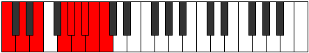 | [midi](https://github.com/edipermadi/music/blob/main/docs/ModeCNaturalSythyllic.mid?raw=true) |
| [3991](https://ianring.com/musictheory/scales/3991) | [Aeolacrygic](ScaleAeolacrygic.md) | [Badygic](ModeBadygic.md) | C, C#, D, E, G, **G#**, A, **A#**, **B**, C |  | [midi](https://github.com/edipermadi/music/blob/main/docs/ModeCNaturalBadygic.mid?raw=true) |
| [3993](https://ianring.com/musictheory/scales/3993) | [Ioniptyllic](ScaleIoniptyllic.md) | [Ioniptyllic](ModeIoniptyllic.md) | C, D#, E, **G**, G#, A, **A#**, **B**, C |  | [midi](https://github.com/edipermadi/music/blob/main/docs/ModeCNaturalIoniptyllic.mid?raw=true) |
| [3995](https://ianring.com/musictheory/scales/3995) | [Zothygic](ScaleZothygic.md) | [Ionygic](ModeIonygic.md) | C, C#, D#, E, **G**, G#, A, **A#**, **B**, C |  | [midi](https://github.com/edipermadi/music/blob/main/docs/ModeCNaturalIonygic.mid?raw=true) |
| [3997](https://ianring.com/musictheory/scales/3997) | [Loptygic](ScaleLoptygic.md) | [Dogygic](ModeDogygic.md) | C, D, D#, E, G, G#, A, **A#**, **B**, C |  | [midi](https://github.com/edipermadi/music/blob/main/docs/ModeCNaturalDogygic.mid?raw=true) |
| [3999](https://ianring.com/musictheory/scales/3999) | [Katoryllian](ScaleKatoryllian.md) | [Dydyllian](ModeDydyllian.md) | C, C#, D, D#, E, G, G#, A, **A#**, **B**, C |  | [midi](https://github.com/edipermadi/music/blob/main/docs/ModeCNaturalDydyllian.mid?raw=true) |
| [4003](https://ianring.com/musictheory/scales/4003) | [Stycryllic](ScaleStycryllic.md) | [Sadyllic](ModeSadyllic.md) | C, C#, F, **G**, **G#**, **A**, A#, **B**, C |  | [midi](https://github.com/edipermadi/music/blob/main/docs/ModeCNaturalSadyllic.mid?raw=true) |
| [4005](https://ianring.com/musictheory/scales/4005) | [Mixolydyllic](ScaleMixolydyllic.md) | [Phradyllic](ModePhradyllic.md) | C, D, F, G, **G#**, **A**, A#, **B**, C |  | [midi](https://github.com/edipermadi/music/blob/main/docs/ModeCNaturalPhradyllic.mid?raw=true) |
| [4007](https://ianring.com/musictheory/scales/4007) | [Sathygic](ScaleSathygic.md) | [Doptygic](ModeDoptygic.md) | C, C#, D, F, G, **G#**, **A**, A#, **B**, C |  | [midi](https://github.com/edipermadi/music/blob/main/docs/ModeCNaturalDoptygic.mid?raw=true) |
| [4009](https://ianring.com/musictheory/scales/4009) | [Phranyllic](ScalePhranyllic.md) | [Phranyllic](ModePhranyllic.md) | C, D#, F, **G**, G#, **A**, A#, **B**, C |  | [midi](https://github.com/edipermadi/music/blob/main/docs/ModeCNaturalPhranyllic.mid?raw=true) |
| [4011](https://ianring.com/musictheory/scales/4011) | [Kyrygic](ScaleKyrygic.md) | [Styrygic](ModeStyrygic.md) | C, C#, D#, F, **G**, G#, **A**, A#, **B**, C |  | [midi](https://github.com/edipermadi/music/blob/main/docs/ModeCNaturalStyrygic.mid?raw=true) |
| [4013](https://ianring.com/musictheory/scales/4013) | [Apinygic](ScaleApinygic.md) | [Dathygic](ModeDathygic.md) | C, D, D#, F, G, G#, **A**, A#, **B**, C |  | [midi](https://github.com/edipermadi/music/blob/main/docs/ModeCNaturalDathygic.mid?raw=true) |
| [4015](https://ianring.com/musictheory/scales/4015) | [Sydyllian](ScaleSydyllian.md) | [Phradyllian](ModePhradyllian.md) | C, C#, D, D#, F, G, G#, **A**, A#, **B**, C |  | [midi](https://github.com/edipermadi/music/blob/main/docs/ModeCNaturalPhradyllian.mid?raw=true) |
| [4017](https://ianring.com/musictheory/scales/4017) | [Dolyllic](ScaleDolyllic.md) | [Dolyllic](ModeDolyllic.md) | C, E, F, **G**, **G#**, A, A#, **B**, C |  | [midi](https://github.com/edipermadi/music/blob/main/docs/ModeCNaturalDolyllic.mid?raw=true) |
| [4019](https://ianring.com/musictheory/scales/4019) | [Phrygic](ScalePhrygic.md) | [Lonygic](ModeLonygic.md) | C, C#, E, F, **G**, **G#**, A, A#, **B**, C |  | [midi](https://github.com/edipermadi/music/blob/main/docs/ModeCNaturalLonygic.mid?raw=true) |
| [4021](https://ianring.com/musictheory/scales/4021) | [Bagygic](ScaleBagygic.md) | [Bagygic](ModeBagygic.md) | C, D, E, F, G, **G#**, A, A#, **B**, C |  | [midi](https://github.com/edipermadi/music/blob/main/docs/ModeCNaturalBagygic.mid?raw=true) |
| [4023](https://ianring.com/musictheory/scales/4023) | [Gothyllian](ScaleGothyllian.md) | [Styptyllian](ModeStyptyllian.md) | C, C#, D, E, F, G, **G#**, A, A#, **B**, C |  | [midi](https://github.com/edipermadi/music/blob/main/docs/ModeCNaturalStyptyllian.mid?raw=true) |
| [4025](https://ianring.com/musictheory/scales/4025) | [Kalygic](ScaleKalygic.md) | [Kalygic](ModeKalygic.md) | C, D#, E, F, **G**, G#, A, A#, **B**, C |  | [midi](https://github.com/edipermadi/music/blob/main/docs/ModeCNaturalKalygic.mid?raw=true) |
| [4027](https://ianring.com/musictheory/scales/4027) | [Staptyllian](ScaleStaptyllian.md) | [Ragyllian](ModeRagyllian.md) | C, C#, D#, E, F, **G**, G#, A, A#, **B**, C |  | [midi](https://github.com/edipermadi/music/blob/main/docs/ModeCNaturalRagyllian.mid?raw=true) |
| [4029](https://ianring.com/musictheory/scales/4029) | [Aerycryllian](ScaleAerycryllian.md) | [Aerycryllian](ModeAerycryllian.md) | C, D, D#, E, F, G, G#, A, A#, **B**, C |  | [midi](https://github.com/edipermadi/music/blob/main/docs/ModeCNaturalAerycryllian.mid?raw=true) |
| [4031](https://ianring.com/musictheory/scales/4031) | [Aerycratic](ScaleAerycratic.md) | [Godatic](ModeGodatic.md) | C, C#, D, D#, E, F, G, G#, A, A#, **B**, C |  | [midi](https://github.com/edipermadi/music/blob/main/docs/ModeCNaturalGodatic.mid?raw=true) |
| [4037](https://ianring.com/musictheory/scales/4037) | [Stolyllic](ScaleStolyllic.md) | [Ionyllic](ModeIonyllic.md) | C, D, **F#**, G, **G#**, **A**, **A#**, B, C |  | [midi](https://github.com/edipermadi/music/blob/main/docs/ModeCNaturalIonyllic.mid?raw=true) |
| [4039](https://ianring.com/musictheory/scales/4039) | [Manygic](ScaleManygic.md) | [Ionogygic](ModeIonogygic.md) | C, C#, D, F#, G, **G#**, **A**, **A#**, B, C |  | [midi](https://github.com/edipermadi/music/blob/main/docs/ModeCNaturalIonogygic.mid?raw=true) |
| [4041](https://ianring.com/musictheory/scales/4041) | [Zaryllic](ScaleZaryllic.md) | [Zaryllic](ModeZaryllic.md) | C, D#, **F#**, **G**, G#, **A**, **A#**, B, C |  | [midi](https://github.com/edipermadi/music/blob/main/docs/ModeCNaturalZaryllic.mid?raw=true) |
| [4043](https://ianring.com/musictheory/scales/4043) | [Aeolacrygic](ScaleAeolacrygic.md) | [Phrocrygic](ModePhrocrygic.md) | C, C#, D#, F#, **G**, G#, **A**, **A#**, B, C |  | [midi](https://github.com/edipermadi/music/blob/main/docs/ModeCNaturalPhrocrygic.mid?raw=true) |
| [4045](https://ianring.com/musictheory/scales/4045) | [Zothygic](ScaleZothygic.md) | [Gyptygic](ModeGyptygic.md) | C, D, D#, **F#**, G, G#, **A**, **A#**, B, C |  | [midi](https://github.com/edipermadi/music/blob/main/docs/ModeCNaturalGyptygic.mid?raw=true) |
| [4047](https://ianring.com/musictheory/scales/4047) | [Katoryllian](ScaleKatoryllian.md) | [Thogyllian](ModeThogyllian.md) | C, C#, D, D#, F#, G, G#, **A**, **A#**, B, C |  | [midi](https://github.com/edipermadi/music/blob/main/docs/ModeCNaturalThogyllian.mid?raw=true) |
| [4049](https://ianring.com/musictheory/scales/4049) | [Stycryllic](ScaleStycryllic.md) | [Stycryllic](ModeStycryllic.md) | C, E, **F#**, **G**, **G#**, A, **A#**, B, C |  | [midi](https://github.com/edipermadi/music/blob/main/docs/ModeCNaturalStycryllic.mid?raw=true) |
| [4051](https://ianring.com/musictheory/scales/4051) | [Sathygic](ScaleSathygic.md) | [Ionilygic](ModeIonilygic.md) | C, C#, E, F#, **G**, **G#**, A, **A#**, B, C |  | [midi](https://github.com/edipermadi/music/blob/main/docs/ModeCNaturalIonilygic.mid?raw=true) |
| [4053](https://ianring.com/musictheory/scales/4053) | [Kyrygic](ScaleKyrygic.md) | [Kyrygic](ModeKyrygic.md) | C, D, E, **F#**, G, **G#**, A, **A#**, B, C |  | [midi](https://github.com/edipermadi/music/blob/main/docs/ModeCNaturalKyrygic.mid?raw=true) |
| [4055](https://ianring.com/musictheory/scales/4055) | [Sydyllian](ScaleSydyllian.md) | [Dagyllian](ModeDagyllian.md) | C, C#, D, E, F#, G, **G#**, A, **A#**, B, C |  | [midi](https://github.com/edipermadi/music/blob/main/docs/ModeCNaturalDagyllian.mid?raw=true) |
| [4057](https://ianring.com/musictheory/scales/4057) | [Phrygic](ScalePhrygic.md) | [Phrygic](ModePhrygic.md) | C, D#, E, **F#**, **G**, G#, A, **A#**, B, C |  | [midi](https://github.com/edipermadi/music/blob/main/docs/ModeCNaturalPhrygic.mid?raw=true) |
| [4059](https://ianring.com/musictheory/scales/4059) | [Gothyllian](ScaleGothyllian.md) | [Zolyllian](ModeZolyllian.md) | C, C#, D#, E, F#, **G**, G#, A, **A#**, B, C |  | [midi](https://github.com/edipermadi/music/blob/main/docs/ModeCNaturalZolyllian.mid?raw=true) |
| [4061](https://ianring.com/musictheory/scales/4061) | [Staptyllian](ScaleStaptyllian.md) | [Staptyllian](ModeStaptyllian.md) | C, D, D#, E, **F#**, G, G#, A, **A#**, B, C |  | [midi](https://github.com/edipermadi/music/blob/main/docs/ModeCNaturalStaptyllian.mid?raw=true) |
| [4063](https://ianring.com/musictheory/scales/4063) | [Aerycratic](ScaleAerycratic.md) | [Eptatic](ModeEptatic.md) | C, C#, D, D#, E, F#, G, G#, A, **A#**, B, C |  | [midi](https://github.com/edipermadi/music/blob/main/docs/ModeCNaturalEptatic.mid?raw=true) |
| [4067](https://ianring.com/musictheory/scales/4067) | [Manygic](ScaleManygic.md) | [Aeolarygic](ModeAeolarygic.md) | C, C#, F, F#, **G**, **G#**, **A**, A#, B, C |  | [midi](https://github.com/edipermadi/music/blob/main/docs/ModeCNaturalAeolarygic.mid?raw=true) |
| [4069](https://ianring.com/musictheory/scales/4069) | [Aeolacrygic](ScaleAeolacrygic.md) | [Starygic](ModeStarygic.md) | C, D, F, **F#**, G, **G#**, **A**, A#, B, C |  | [midi](https://github.com/edipermadi/music/blob/main/docs/ModeCNaturalStarygic.mid?raw=true) |
| [4071](https://ianring.com/musictheory/scales/4071) | [Katoryllian](ScaleKatoryllian.md) | [Rygyllian](ModeRygyllian.md) | C, C#, D, F, F#, G, **G#**, **A**, A#, B, C |  | [midi](https://github.com/edipermadi/music/blob/main/docs/ModeCNaturalRygyllian.mid?raw=true) |
| [4073](https://ianring.com/musictheory/scales/4073) | [Sathygic](ScaleSathygic.md) | [Sathygic](ModeSathygic.md) | C, D#, F, **F#**, **G**, G#, **A**, A#, B, C |  | [midi](https://github.com/edipermadi/music/blob/main/docs/ModeCNaturalSathygic.mid?raw=true) |
| [4075](https://ianring.com/musictheory/scales/4075) | [Sydyllian](ScaleSydyllian.md) | [Katyllian](ModeKatyllian.md) | C, C#, D#, F, F#, **G**, G#, **A**, A#, B, C |  | [midi](https://github.com/edipermadi/music/blob/main/docs/ModeCNaturalKatyllian.mid?raw=true) |
| [4077](https://ianring.com/musictheory/scales/4077) | [Gothyllian](ScaleGothyllian.md) | [Gothyllian](ModeGothyllian.md) | C, D, D#, F, **F#**, G, G#, **A**, A#, B, C |  | [midi](https://github.com/edipermadi/music/blob/main/docs/ModeCNaturalGothyllian.mid?raw=true) |
| [4079](https://ianring.com/musictheory/scales/4079) | [Aerycratic](ScaleAerycratic.md) | [Ionatic](ModeIonatic.md) | C, C#, D, D#, F, F#, G, G#, **A**, A#, B, C |  | [midi](https://github.com/edipermadi/music/blob/main/docs/ModeCNaturalIonatic.mid?raw=true) |
| [4081](https://ianring.com/musictheory/scales/4081) | [Manygic](ScaleManygic.md) | [Manygic](ModeManygic.md) | C, E, F, **F#**, **G**, **G#**, A, A#, B, C |  | [midi](https://github.com/edipermadi/music/blob/main/docs/ModeCNaturalManygic.mid?raw=true) |
| [4083](https://ianring.com/musictheory/scales/4083) | [Katoryllian](ScaleKatoryllian.md) | [Bathyllian](ModeBathyllian.md) | C, C#, E, F, F#, **G**, **G#**, A, A#, B, C |  | [midi](https://github.com/edipermadi/music/blob/main/docs/ModeCNaturalBathyllian.mid?raw=true) |
| [4085](https://ianring.com/musictheory/scales/4085) | [Sydyllian](ScaleSydyllian.md) | [Sydyllian](ModeSydyllian.md) | C, D, E, F, **F#**, G, **G#**, A, A#, B, C |  | [midi](https://github.com/edipermadi/music/blob/main/docs/ModeCNaturalSydyllian.mid?raw=true) |
| [4087](https://ianring.com/musictheory/scales/4087) | [Aerycratic](ScaleAerycratic.md) | [Aeolatic](ModeAeolatic.md) | C, C#, D, E, F, F#, G, **G#**, A, A#, B, C |  | [midi](https://github.com/edipermadi/music/blob/main/docs/ModeCNaturalAeolatic.mid?raw=true) |
| [4089](https://ianring.com/musictheory/scales/4089) | [Katoryllian](ScaleKatoryllian.md) | [Katoryllian](ModeKatoryllian.md) | C, D#, E, F, **F#**, **G**, G#, A, A#, B, C |  | [midi](https://github.com/edipermadi/music/blob/main/docs/ModeCNaturalKatoryllian.mid?raw=true) |
| [4091](https://ianring.com/musictheory/scales/4091) | [Aerycratic](ScaleAerycratic.md) | [Thydatic](ModeThydatic.md) | C, C#, D#, E, F, F#, **G**, G#, A, A#, B, C |  | [midi](https://github.com/edipermadi/music/blob/main/docs/ModeCNaturalThydatic.mid?raw=true) |
| [4093](https://ianring.com/musictheory/scales/4093) | [Aerycratic](ScaleAerycratic.md) | [Aerycratic](ModeAerycratic.md) | C, D, D#, E, F, **F#**, G, G#, A, A#, B, C |  | [midi](https://github.com/edipermadi/music/blob/main/docs/ModeCNaturalAerycratic.mid?raw=true) |
| [4095](https://ianring.com/musictheory/scales/4095) | [Chromatic](ScaleChromatic.md) | [Chromatic](ModeChromatic.md) | C, C#, D, D#, E, F, F#, G, G#, A, A#, B, C |  | [midi](https://github.com/edipermadi/music/blob/main/docs/ModeCNaturalChromatic.mid?raw=true) |
