# Modes

## Links

- [Documentation](index.md)
- [Scales Index](Scales.md)
- [Modes Index](Modes.md)
- [Chords Index](Chords.md)

## Index

| Number | Scale | Mode | Notes | Illustration | Audio |
|--------|-------|------|-------|--------------|-------|
| [273](https://ianring.com/musictheory/scales/273) | [Minoric](ScaleMinoric.md) | [Minoric](ModeMinoric.md) | **C**, **E**, **G#**, **C** |  | [midi](ModeCNaturalMinoric.mid) [ogg](ModeCNaturalMinoric.ogg) |
| [275](https://ianring.com/musictheory/scales/275) | [Aeoloric](ScaleAeoloric.md) | [Dalic](ModeDalic.md) | **C**, C#, **E**, **G#**, **C** |  | [midi](ModeCNaturalDalic.mid) [ogg](ModeCNaturalDalic.ogg) |
| [277](https://ianring.com/musictheory/scales/277) | [Aeolic](ScaleAeolic.md) | [Mixolyric](ModeMixolyric.md) | **C**, **D**, **E**, **G#**, **C** |  | [midi](ModeCNaturalMixolyric.mid) [ogg](ModeCNaturalMixolyric.ogg) |
| [279](https://ianring.com/musictheory/scales/279) | [Ranitonic](ScaleRanitonic.md) | [Poditonic](ModePoditonic.md) | **C**, C#, **D**, **E**, **G#**, **C** |  | [midi](ModeCNaturalPoditonic.mid) [ogg](ModeCNaturalPoditonic.ogg) |
| [281](https://ianring.com/musictheory/scales/281) | [Zyphic](ScaleZyphic.md) | [Lanic](ModeLanic.md) | **C**, **D#**, **E**, G#, **C** | 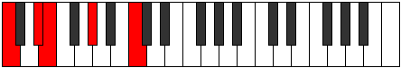 | [midi](ModeCNaturalLanic.mid) [ogg](ModeCNaturalLanic.ogg) |
| [283](https://ianring.com/musictheory/scales/283) | [Dolitonic](ScaleDolitonic.md) | [Aerylitonic](ModeAerylitonic.md) | **C**, C#, **D#**, **E**, G#, **C** |  | [midi](ModeCNaturalAerylitonic.mid) [ogg](ModeCNaturalAerylitonic.ogg) |
| [285](https://ianring.com/musictheory/scales/285) | [Zylitonic](ScaleZylitonic.md) | [Zaritonic](ModeZaritonic.md) | **C**, **D**, **D#**, **E**, G#, **C** |  | [midi](ModeCNaturalZaritonic.mid) [ogg](ModeCNaturalZaritonic.ogg) |
| [287](https://ianring.com/musictheory/scales/287) | [Ponimic](ScalePonimic.md) | [Gynimic](ModeGynimic.md) | **C**, Db, **Ebb**, **Fbb**, **Gbbb**, Ab, **C** |  | [midi](ModeCNaturalGynimic.mid) [ogg](ModeCNaturalGynimic.ogg) |
| [291](https://ianring.com/musictheory/scales/291) | [Thaptic](ScaleThaptic.md) | [Aerathic](ModeAerathic.md) | **C**, C#, F, **G#**, **C** |  | [midi](ModeCNaturalAerathic.mid) [ogg](ModeCNaturalAerathic.ogg) |
| [293](https://ianring.com/musictheory/scales/293) | [Saric](ScaleSaric.md) | [Zoptic](ModeZoptic.md) | **C**, **D**, F, **G#**, **C** |  | [midi](ModeCNaturalZoptic.mid) [ogg](ModeCNaturalZoptic.ogg) |
| [295](https://ianring.com/musictheory/scales/295) | [Ionyptitonic](ScaleIonyptitonic.md) | [Gyritonic](ModeGyritonic.md) | **C**, C#, **D**, F, **G#**, **C** |  | [midi](ModeCNaturalGyritonic.mid) [ogg](ModeCNaturalGyritonic.ogg) |
| [297](https://ianring.com/musictheory/scales/297) | [Epathic](ScaleEpathic.md) | [Mynic](ModeMynic.md) | **C**, **D#**, F, G#, **C** |  | [midi](ModeCNaturalMynic.mid) [ogg](ModeCNaturalMynic.ogg) |
| [299](https://ianring.com/musictheory/scales/299) | [Lothitonic](ScaleLothitonic.md) | [Phratonic](ModePhratonic.md) | **C**, C#, **D#**, F, G#, **C** |  | [midi](ModeCNaturalPhratonic.mid) [ogg](ModeCNaturalPhratonic.ogg) |
| [301](https://ianring.com/musictheory/scales/301) | [Aeolacritonic](ScaleAeolacritonic.md) | [Zythitonic](ModeZythitonic.md) | **C**, **D**, **D#**, F, G#, **C** |  | [midi](ModeCNaturalZythitonic.mid) [ogg](ModeCNaturalZythitonic.ogg) |
| [303](https://ianring.com/musictheory/scales/303) | [Kytrimic](ScaleKytrimic.md) | [Golimic](ModeGolimic.md) | **C**, Db, **Ebb**, **Fbb**, Gbb, Ab, **C** |  | [midi](ModeCNaturalGolimic.mid) [ogg](ModeCNaturalGolimic.ogg) |
| [305](https://ianring.com/musictheory/scales/305) | [Aeoloric](ScaleAeoloric.md) | [Gonic](ModeGonic.md) | **C**, **E**, F, **G#**, **C** |  | [midi](ModeCNaturalGonic.mid) [ogg](ModeCNaturalGonic.ogg) |
| [307](https://ianring.com/musictheory/scales/307) | [Zothitonic](ScaleZothitonic.md) | [Phrolitonic](ModePhrolitonic.md) | **C**, C#, **E**, F, **G#**, **C** |  | [midi](ModeCNaturalPhrolitonic.mid) [ogg](ModeCNaturalPhrolitonic.ogg) |
| [309](https://ianring.com/musictheory/scales/309) | [Aerynitonic](ScaleAerynitonic.md) | [Palitonic](ModePalitonic.md) | **C**, **D**, **E**, F, **G#**, **C** |  | [midi](ModeCNaturalPalitonic.mid) [ogg](ModeCNaturalPalitonic.ogg) |
| [311](https://ianring.com/musictheory/scales/311) | [Aerothimic](ScaleAerothimic.md) | [Stagimic](ModeStagimic.md) | **C**, Db, **Ebb**, **Fb**, Gbb, **Ab**, **C** | 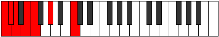 | [midi](ModeCNaturalStagimic.mid) [ogg](ModeCNaturalStagimic.ogg) |
| [313](https://ianring.com/musictheory/scales/313) | [Aeolyritonic](ScaleAeolyritonic.md) | [Goritonic](ModeGoritonic.md) | **C**, **D#**, **E**, F, G#, **C** |  | [midi](ModeCNaturalGoritonic.mid) [ogg](ModeCNaturalGoritonic.ogg) |
| [315](https://ianring.com/musictheory/scales/315) | [Syrimic](ScaleSyrimic.md) | [Stodimic](ModeStodimic.md) | **C**, Db, **Eb**, **Fb**, Gbb, Ab, **C** |  | [midi](ModeCNaturalStodimic.mid) [ogg](ModeCNaturalStodimic.ogg) |
| [317](https://ianring.com/musictheory/scales/317) | [Kocrimic](ScaleKocrimic.md) | [Korimic](ModeKorimic.md) | **C**, **D**, **Eb**, **Fb**, Gbb, Ab, **C** |  | [midi](ModeCNaturalKorimic.mid) [ogg](ModeCNaturalKorimic.ogg) |
| [319](https://ianring.com/musictheory/scales/319) | [Katyptian](ScaleKatyptian.md) | [Epodian](ModeEpodian.md) | **C**, Db, **Ebb**, **Fbb**, **Gbbb**, D###, F###, **C** |  | [midi](ModeCNaturalEpodian.mid) [ogg](ModeCNaturalEpodian.ogg) |
| [325](https://ianring.com/musictheory/scales/325) | [Stathic](ScaleStathic.md) | [Dadic](ModeDadic.md) | **C**, **D**, **F#**, **G#**, **C** |  | [midi](ModeCNaturalDadic.mid) [ogg](ModeCNaturalDadic.ogg) |
| [327](https://ianring.com/musictheory/scales/327) | [Zathitonic](ScaleZathitonic.md) | [Syptitonic](ModeSyptitonic.md) | **C**, C#, **D**, F#, **G#**, **C** |  | [midi](ModeCNaturalSyptitonic.mid) [ogg](ModeCNaturalSyptitonic.ogg) |
| [329](https://ianring.com/musictheory/scales/329) | [Daric](ScaleDaric.md) | [Lonic](ModeLonic.md) | **C**, **D#**, **F#**, G#, **C** |  | [midi](ModeCNaturalLonic.mid) [ogg](ModeCNaturalLonic.ogg) |
| [331](https://ianring.com/musictheory/scales/331) | [Aeracritonic](ScaleAeracritonic.md) | [Byptitonic](ModeByptitonic.md) | **C**, C#, **D#**, F#, G#, **C** |  | [midi](ModeCNaturalByptitonic.mid) [ogg](ModeCNaturalByptitonic.ogg) |
| [333](https://ianring.com/musictheory/scales/333) | [Ionoditonic](ScaleIonoditonic.md) | [Bogitonic](ModeBogitonic.md) | **C**, **D**, **D#**, **F#**, G#, **C** |  | [midi](ModeCNaturalBogitonic.mid) [ogg](ModeCNaturalBogitonic.ogg) |
| [335](https://ianring.com/musictheory/scales/335) | [Pynimic](ScalePynimic.md) | [Zanimic](ModeZanimic.md) | **C**, Db, **Ebb**, **Fbb**, Gb, Ab, **C** |  | [midi](ModeCNaturalZanimic.mid) [ogg](ModeCNaturalZanimic.ogg) |
| [337](https://ianring.com/musictheory/scales/337) | [Aeolic](ScaleAeolic.md) | [Koptic](ModeKoptic.md) | **C**, **E**, **F#**, **G#**, **C** |  | [midi](ModeCNaturalKoptic.mid) [ogg](ModeCNaturalKoptic.ogg) |
| [339](https://ianring.com/musictheory/scales/339) | [Epygitonic](ScaleEpygitonic.md) | [Zaptitonic](ModeZaptitonic.md) | **C**, C#, **E**, F#, **G#**, **C** |  | [midi](ModeCNaturalZaptitonic.mid) [ogg](ModeCNaturalZaptitonic.ogg) |
| [341](https://ianring.com/musictheory/scales/341) | [Bolitonic](ScaleBolitonic.md) | [Bothitonic](ModeBothitonic.md) | **C**, **D**, **E**, **F#**, **G#**, **C** |  | [midi](ModeCNaturalBothitonic.mid) [ogg](ModeCNaturalBothitonic.ogg) |
| [343](https://ianring.com/musictheory/scales/343) | [Mycrimic](ScaleMycrimic.md) | [Ionorimic](ModeIonorimic.md) | **C**, Db, **Ebb**, **Fb**, Gb, **Ab**, **C** |  | [midi](ModeCNaturalIonorimic.mid) [ogg](ModeCNaturalIonorimic.ogg) |
| [345](https://ianring.com/musictheory/scales/345) | [Ryphitonic](ScaleRyphitonic.md) | [Gylitonic](ModeGylitonic.md) | **C**, **D#**, **E**, **F#**, G#, **C** |  | [midi](ModeCNaturalGylitonic.mid) [ogg](ModeCNaturalGylitonic.ogg) |
| [347](https://ianring.com/musictheory/scales/347) | [Modimic](ScaleModimic.md) | [Barimic](ModeBarimic.md) | **C**, Db, **Eb**, **Fb**, Gb, Ab, **C** |  | [midi](ModeCNaturalBarimic.mid) [ogg](ModeCNaturalBarimic.ogg) |
| [349](https://ianring.com/musictheory/scales/349) | [Gacrimic](ScaleGacrimic.md) | [Borimic](ModeBorimic.md) | **C**, **D**, **Eb**, **Fb**, **Gb**, Ab, **C** | 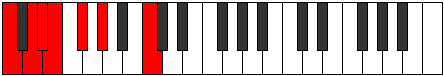 | [midi](ModeCNaturalBorimic.mid) [ogg](ModeCNaturalBorimic.ogg) |
| [351](https://ianring.com/musictheory/scales/351) | [Stanian](ScaleStanian.md) | [Epanian](ModeEpanian.md) | **C**, Db, **Ebb**, **Fbb**, **Gbbb**, Abbb, Bbbb, **C** |  | [midi](ModeCNaturalEpanian.mid) [ogg](ModeCNaturalEpanian.ogg) |
| [355](https://ianring.com/musictheory/scales/355) | [Phraditonic](ScalePhraditonic.md) | [Aeoloritonic](ModeAeoloritonic.md) | **C**, C#, F, F#, **G#**, **C** |  | [midi](ModeCNaturalAeoloritonic.mid) [ogg](ModeCNaturalAeoloritonic.ogg) |
| [357](https://ianring.com/musictheory/scales/357) | [Phronitonic](ScalePhronitonic.md) | [Banitonic](ModeBanitonic.md) | **C**, **D**, F, **F#**, **G#**, **C** |  | [midi](ModeCNaturalBanitonic.mid) [ogg](ModeCNaturalBanitonic.ogg) |
| [359](https://ianring.com/musictheory/scales/359) | [Bolimic](ScaleBolimic.md) | [Bothimic](ModeBothimic.md) | **C**, Db, **Ebb**, F, Gb, **Ab**, **C** |  | [midi](ModeCNaturalBothimic.mid) [ogg](ModeCNaturalBothimic.ogg) |
| [361](https://ianring.com/musictheory/scales/361) | [Ionaditonic](ScaleIonaditonic.md) | [Bocritonic](ModeBocritonic.md) | **C**, **D#**, F, **F#**, G#, **C** |  | [midi](ModeCNaturalBocritonic.mid) [ogg](ModeCNaturalBocritonic.ogg) |
| [363](https://ianring.com/musictheory/scales/363) | [Garimic](ScaleGarimic.md) | [Soptimic](ModeSoptimic.md) | **C**, Db, **Eb**, F, Gb, Ab, **C** |  | [midi](ModeCNaturalSoptimic.mid) [ogg](ModeCNaturalSoptimic.ogg) |
| [365](https://ianring.com/musictheory/scales/365) | [Manimic](ScaleManimic.md) | [Marimic](ModeMarimic.md) | **C**, **D**, **Eb**, F, **Gb**, Ab, **C** |  | [midi](ModeCNaturalMarimic.mid) [ogg](ModeCNaturalMarimic.ogg) |
| [367](https://ianring.com/musictheory/scales/367) | [Saptian](ScaleSaptian.md) | [Aerodian](ModeAerodian.md) | **C**, Db, **Ebb**, **Fbb**, Gbb, Abbb, Bbbb, **C** |  | [midi](ModeCNaturalAerodian.mid) [ogg](ModeCNaturalAerodian.ogg) |
| [369](https://ianring.com/musictheory/scales/369) | [Ranitonic](ScaleRanitonic.md) | [Laditonic](ModeLaditonic.md) | **C**, **E**, F, **F#**, **G#**, **C** |  | [midi](ModeCNaturalLaditonic.mid) [ogg](ModeCNaturalLaditonic.ogg) |
| [371](https://ianring.com/musictheory/scales/371) | [Thogimic](ScaleThogimic.md) | [Rythimic](ModeRythimic.md) | **C**, Db, **E**, F, Gb, **Ab**, **C** |  | [midi](ModeCNaturalRythimic.mid) [ogg](ModeCNaturalRythimic.ogg) |
| [373](https://ianring.com/musictheory/scales/373) | [Dathimic](ScaleDathimic.md) | [Epagimic](ModeEpagimic.md) | **C**, **D**, **E**, F, **Gb**, **Ab**, **C** |  | [midi](ModeCNaturalEpagimic.mid) [ogg](ModeCNaturalEpagimic.ogg) |
| [375](https://ianring.com/musictheory/scales/375) | [Katacrian](ScaleKatacrian.md) | [Sodian](ModeSodian.md) | **C**, Db, **Ebb**, **Fb**, Gbb, Abbb, **Bbbb**, **C** |  | [midi](ModeCNaturalSodian.mid) [ogg](ModeCNaturalSodian.ogg) |
| [377](https://ianring.com/musictheory/scales/377) | [Galimic](ScaleGalimic.md) | [Kathimic](ModeKathimic.md) | **C**, **D#**, **E**, F, **Gb**, Ab, **C** |  | [midi](ModeCNaturalKathimic.mid) [ogg](ModeCNaturalKathimic.ogg) |
| [379](https://ianring.com/musictheory/scales/379) | [Zorian](ScaleZorian.md) | [Aeragian](ModeAeragian.md) | **C**, Db, **Eb**, **Fb**, Gbb, Abbb, Bbbb, **C** |  | [midi](ModeCNaturalAeragian.mid) [ogg](ModeCNaturalAeragian.ogg) |
| [381](https://ianring.com/musictheory/scales/381) | [Gydian](ScaleGydian.md) | [Kogian](ModeKogian.md) | **C**, **D**, **Eb**, **Fb**, Gbb, **Abbb**, Bbbb, **C** |  | [midi](ModeCNaturalKogian.mid) [ogg](ModeCNaturalKogian.ogg) |
| [383](https://ianring.com/musictheory/scales/383) | [Stolyllic](ScaleStolyllic.md) | [Logyllic](ModeLogyllic.md) | **C**, C#, **D**, **D#**, **E**, F, F#, G#, **C** |  | [midi](ModeCNaturalLogyllic.mid) [ogg](ModeCNaturalLogyllic.ogg) |
| [393](https://ianring.com/musictheory/scales/393) | [Thaptic](ScaleThaptic.md) | [Lothic](ModeLothic.md) | C, **D#**, **G**, G#, C |  | [midi](ModeCNaturalLothic.mid) [ogg](ModeCNaturalLothic.ogg) |
| [395](https://ianring.com/musictheory/scales/395) | [Phraditonic](ScalePhraditonic.md) | [Dalitonic](ModeDalitonic.md) | C, C#, **D#**, **G**, G#, C |  | [midi](ModeCNaturalDalitonic.mid) [ogg](ModeCNaturalDalitonic.ogg) |
| [397](https://ianring.com/musictheory/scales/397) | [Zolitonic](ScaleZolitonic.md) | [Epogitonic](ModeEpogitonic.md) | C, **D**, **D#**, G, G#, C |  | [midi](ModeCNaturalEpogitonic.mid) [ogg](ModeCNaturalEpogitonic.ogg) |
| [399](https://ianring.com/musictheory/scales/399) | [Daptimic](ScaleDaptimic.md) | [Zynimic](ModeZynimic.md) | C, Db, **Ebb**, **Fbb**, G, Ab, C |  | [midi](ModeCNaturalZynimic.mid) [ogg](ModeCNaturalZynimic.ogg) |
| [401](https://ianring.com/musictheory/scales/401) | [Zyphic](ScaleZyphic.md) | [Epogic](ModeEpogic.md) | C, **E**, **G**, **G#**, C |  | [midi](ModeCNaturalEpogic.mid) [ogg](ModeCNaturalEpogic.ogg) |
| [403](https://ianring.com/musictheory/scales/403) | [Lycritonic](ScaleLycritonic.md) | [Daptitonic](ModeDaptitonic.md) | C, C#, **E**, **G**, **G#**, C |  | [midi](ModeCNaturalDaptitonic.mid) [ogg](ModeCNaturalDaptitonic.ogg) |
| [405](https://ianring.com/musictheory/scales/405) | [Aeolanitonic](ScaleAeolanitonic.md) | [Danitonic](ModeDanitonic.md) | C, **D**, **E**, G, **G#**, C |  | [midi](ModeCNaturalDanitonic.mid) [ogg](ModeCNaturalDanitonic.ogg) |
| [407](https://ianring.com/musictheory/scales/407) | [Kanimic](ScaleKanimic.md) | [Zylimic](ModeZylimic.md) | C, Db, **Ebb**, **Fb**, G, **Ab**, C |  | [midi](ModeCNaturalZylimic.mid) [ogg](ModeCNaturalZylimic.ogg) |
| [409](https://ianring.com/musictheory/scales/409) | [Zacritonic](ScaleZacritonic.md) | [Laritonic](ModeLaritonic.md) | C, **D#**, **E**, **G**, G#, C |  | [midi](ModeCNaturalLaritonic.mid) [ogg](ModeCNaturalLaritonic.ogg) |
| [411](https://ianring.com/musictheory/scales/411) | [Laptimic](ScaleLaptimic.md) | [Lygimic](ModeLygimic.md) | C, Db, **Eb**, **Fb**, **G**, Ab, C |  | [midi](ModeCNaturalLygimic.mid) [ogg](ModeCNaturalLygimic.ogg) |
| [413](https://ianring.com/musictheory/scales/413) | [Aerycrimic](ScaleAerycrimic.md) | [Ganimic](ModeGanimic.md) | C, **D**, **Eb**, **Fb**, G, Ab, C |  | [midi](ModeCNaturalGanimic.mid) [ogg](ModeCNaturalGanimic.ogg) |
| [415](https://ianring.com/musictheory/scales/415) | [Thycrian](ScaleThycrian.md) | [Aeoladian](ModeAeoladian.md) | C, Db, **Ebb**, **Fbb**, **Gbbb**, Abb, Bbbb, C |  | [midi](ModeCNaturalAeoladian.mid) [ogg](ModeCNaturalAeoladian.ogg) |
| [419](https://ianring.com/musictheory/scales/419) | [Zolitonic](ScaleZolitonic.md) | [Ionacritonic](ModeIonacritonic.md) | C, C#, F, **G**, **G#**, C |  | [midi](ModeCNaturalIonacritonic.mid) [ogg](ModeCNaturalIonacritonic.ogg) |
| [421](https://ianring.com/musictheory/scales/421) | [Gathitonic](ScaleGathitonic.md) | [Ionitonic](ModeIonitonic.md) | C, **D**, F, G, **G#**, C |  | [midi](ModeCNaturalIonitonic.mid) [ogg](ModeCNaturalIonitonic.ogg) |
| [423](https://ianring.com/musictheory/scales/423) | [Mythimic](ScaleMythimic.md) | [Sogimic](ModeSogimic.md) | C, Db, **Ebb**, F, G, **Ab**, C |  | [midi](ModeCNaturalSogimic.mid) [ogg](ModeCNaturalSogimic.ogg) |
| [425](https://ianring.com/musictheory/scales/425) | [Magitonic](ScaleMagitonic.md) | [Daditonic](ModeDaditonic.md) | C, **D#**, F, **G**, G#, C | 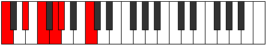 | [midi](ModeCNaturalDaditonic.mid) [ogg](ModeCNaturalDaditonic.ogg) |
| [427](https://ianring.com/musictheory/scales/427) | [Bylimic](ScaleBylimic.md) | [Zothimic](ModeZothimic.md) | C, Db, **Eb**, F, **G**, Ab, C |  | [midi](ModeCNaturalZothimic.mid) [ogg](ModeCNaturalZothimic.ogg) |
| [429](https://ianring.com/musictheory/scales/429) | [Dyrimic](ScaleDyrimic.md) | [Koptimic](ModeKoptimic.md) | C, **D**, **Eb**, F, G, Ab, C |  | [midi](ModeCNaturalKoptimic.mid) [ogg](ModeCNaturalKoptimic.ogg) |
| [431](https://ianring.com/musictheory/scales/431) | [Zogian](ScaleZogian.md) | [Epyrian](ModeEpyrian.md) | C, Db, **Ebb**, **Fbb**, Gbb, Abb, Bbbb, C |  | [midi](ModeCNaturalEpyrian.mid) [ogg](ModeCNaturalEpyrian.ogg) |
| [433](https://ianring.com/musictheory/scales/433) | [Dolitonic](ScaleDolitonic.md) | [Poritonic](ModePoritonic.md) | C, **E**, F, **G**, **G#**, C | 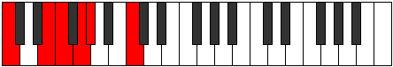 | [midi](ModeCNaturalPoritonic.mid) [ogg](ModeCNaturalPoritonic.ogg) |
| [435](https://ianring.com/musictheory/scales/435) | [Solimic](ScaleSolimic.md) | [Ionolimic](ModeIonolimic.md) | C, Db, **E**, F, **G**, **Ab**, C |  | [midi](ModeCNaturalIonolimic.mid) [ogg](ModeCNaturalIonolimic.ogg) |
| [437](https://ianring.com/musictheory/scales/437) | [Rycrimic](ScaleRycrimic.md) | [Ronimic](ModeRonimic.md) | C, **D**, **E**, F, G, **Ab**, C |  | [midi](ModeCNaturalRonimic.mid) [ogg](ModeCNaturalRonimic.ogg) |
| [439](https://ianring.com/musictheory/scales/439) | [Aeolathian](ScaleAeolathian.md) | [Bythian](ModeBythian.md) | C, Db, **Ebb**, **Fb**, Gbb, Abb, **Bbbb**, C |  | [midi](ModeCNaturalBythian.mid) [ogg](ModeCNaturalBythian.ogg) |
| [441](https://ianring.com/musictheory/scales/441) | [Bygimic](ScaleBygimic.md) | [Thycrimic](ModeThycrimic.md) | C, **D#**, **E**, F, **G**, Ab, C |  | [midi](ModeCNaturalThycrimic.mid) [ogg](ModeCNaturalThycrimic.ogg) |
| [443](https://ianring.com/musictheory/scales/443) | [Stythian](ScaleStythian.md) | [Kothian](ModeKothian.md) | C, Db, **Eb**, **Fb**, Gbb, **Abb**, Bbbb, C |  | [midi](ModeCNaturalKothian.mid) [ogg](ModeCNaturalKothian.ogg) |
| [445](https://ianring.com/musictheory/scales/445) | [Epycrian](ScaleEpycrian.md) | [Gocrian](ModeGocrian.md) | C, **D**, **Eb**, **Fb**, Gbb, Abb, Bbbb, C |  | [midi](ModeCNaturalGocrian.mid) [ogg](ModeCNaturalGocrian.ogg) |
| [447](https://ianring.com/musictheory/scales/447) | [Phroryllic](ScalePhroryllic.md) | [Thyphyllic](ModeThyphyllic.md) | C, C#, **D**, **D#**, **E**, F, G, G#, C |  | [midi](ModeCNaturalThyphyllic.mid) [ogg](ModeCNaturalThyphyllic.ogg) |
| [453](https://ianring.com/musictheory/scales/453) | [Zathitonic](ScaleZathitonic.md) | [Raditonic](ModeRaditonic.md) | C, **D**, **F#**, G, **G#**, C |  | [midi](ModeCNaturalRaditonic.mid) [ogg](ModeCNaturalRaditonic.ogg) |
| [455](https://ianring.com/musictheory/scales/455) | [Thonimic](ScaleThonimic.md) | [Stadimic](ModeStadimic.md) | C, Db, **Ebb**, F#, G, **Ab**, C |  | [midi](ModeCNaturalStadimic.mid) [ogg](ModeCNaturalStadimic.ogg) |
| [457](https://ianring.com/musictheory/scales/457) | [Molitonic](ScaleMolitonic.md) | [Staptitonic](ModeStaptitonic.md) | C, **D#**, **F#**, **G**, G#, C | 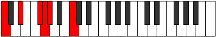 | [midi](ModeCNaturalStaptitonic.mid) [ogg](ModeCNaturalStaptitonic.ogg) |
| [459](https://ianring.com/musictheory/scales/459) | [Epygimic](ScaleEpygimic.md) | [Zaptimic](ModeZaptimic.md) | C, Db, **Eb**, F#, **G**, Ab, C |  | [midi](ModeCNaturalZaptimic.mid) [ogg](ModeCNaturalZaptimic.ogg) |
| [461](https://ianring.com/musictheory/scales/461) | [Katythimic](ScaleKatythimic.md) | [Madimic](ModeMadimic.md) | C, **D**, **Eb**, **F#**, G, Ab, C |  | [midi](ModeCNaturalMadimic.mid) [ogg](ModeCNaturalMadimic.ogg) |
| [463](https://ianring.com/musictheory/scales/463) | [Aeolacrian](ScaleAeolacrian.md) | [Zythian](ModeZythian.md) | C, Db, **Ebb**, **Fbb**, Gb, Abb, Bbbb, C |  | [midi](ModeCNaturalZythian.mid) [ogg](ModeCNaturalZythian.ogg) |
| [465](https://ianring.com/musictheory/scales/465) | [Zylitonic](ScaleZylitonic.md) | [Zoditonic](ModeZoditonic.md) | C, **E**, **F#**, **G**, **G#**, C |  | [midi](ModeCNaturalZoditonic.mid) [ogg](ModeCNaturalZoditonic.ogg) |
| [467](https://ianring.com/musictheory/scales/467) | [Phralimic](ScalePhralimic.md) | [Phrogimic](ModePhrogimic.md) | C, Db, **E**, F#, **G**, **Ab**, C |  | [midi](ModeCNaturalPhrogimic.mid) [ogg](ModeCNaturalPhrogimic.ogg) |
| [469](https://ianring.com/musictheory/scales/469) | [Katanimic](ScaleKatanimic.md) | [Katyrimic](ModeKatyrimic.md) | C, **D**, **E**, **F#**, G, **Ab**, C |  | [midi](ModeCNaturalKatyrimic.mid) [ogg](ModeCNaturalKatyrimic.ogg) |
| [471](https://ianring.com/musictheory/scales/471) | [Thacrian](ScaleThacrian.md) | [Dodian](ModeDodian.md) | C, Db, **Ebb**, **Fb**, Gb, Abb, **Bbbb**, C |  | [midi](ModeCNaturalDodian.mid) [ogg](ModeCNaturalDodian.ogg) |
| [473](https://ianring.com/musictheory/scales/473) | [Lathimic](ScaleLathimic.md) | [Aeralimic](ModeAeralimic.md) | C, **D#**, **E**, **F#**, **G**, Ab, C |  | [midi](ModeCNaturalAeralimic.mid) [ogg](ModeCNaturalAeralimic.ogg) |
| [475](https://ianring.com/musictheory/scales/475) | [Stygian](ScaleStygian.md) | [Aeolygian](ModeAeolygian.md) | C, Db, **Eb**, **Fb**, Gb, **Abb**, Bbbb, C |  | [midi](ModeCNaturalAeolygian.mid) [ogg](ModeCNaturalAeolygian.ogg) |
| [477](https://ianring.com/musictheory/scales/477) | [Katogian](ScaleKatogian.md) | [Stacrian](ModeStacrian.md) | C, **D**, **Eb**, **Fb**, **Gb**, Abb, Bbbb, C |  | [midi](ModeCNaturalStacrian.mid) [ogg](ModeCNaturalStacrian.ogg) |
| [479](https://ianring.com/musictheory/scales/479) | [Aeoladyllic](ScaleAeoladyllic.md) | [Kocryllic](ModeKocryllic.md) | C, C#, **D**, **D#**, **E**, F#, G, G#, C |  | [midi](ModeCNaturalKocryllic.mid) [ogg](ModeCNaturalKocryllic.ogg) |
| [483](https://ianring.com/musictheory/scales/483) | [Daptimic](ScaleDaptimic.md) | [Kygimic](ModeKygimic.md) | C, Db, E#, F#, **G**, **Ab**, C |  | [midi](ModeCNaturalKygimic.mid) [ogg](ModeCNaturalKygimic.ogg) |
| [485](https://ianring.com/musictheory/scales/485) | [Stalimic](ScaleStalimic.md) | [Stoptimic](ModeStoptimic.md) | C, **D**, E#, **F#**, G, **Ab**, C |  | [midi](ModeCNaturalStoptimic.mid) [ogg](ModeCNaturalStoptimic.ogg) |
| [487](https://ianring.com/musictheory/scales/487) | [Ionarian](ScaleIonarian.md) | [Dynian](ModeDynian.md) | C, Db, **Ebb**, F, Gb, Abb, **Bbbb**, C |  | [midi](ModeCNaturalDynian.mid) [ogg](ModeCNaturalDynian.ogg) |
| [489](https://ianring.com/musictheory/scales/489) | [Starimic](ScaleStarimic.md) | [Phrathimic](ModePhrathimic.md) | C, **D#**, E#, **F#**, **G**, Ab, C |  | [midi](ModeCNaturalPhrathimic.mid) [ogg](ModeCNaturalPhrathimic.ogg) |
| [491](https://ianring.com/musictheory/scales/491) | [Ionythian](ScaleIonythian.md) | [Aeolyrian](ModeAeolyrian.md) | C, Db, **Eb**, F, Gb, **Abb**, Bbbb, C |  | [midi](ModeCNaturalAeolyrian.mid) [ogg](ModeCNaturalAeolyrian.ogg) |
| [493](https://ianring.com/musictheory/scales/493) | [Aeopian](ScaleAeopian.md) | [Rygian](ModeRygian.md) | C, **D**, **Eb**, F, **Gb**, Abb, Bbbb, C |  | [midi](ModeCNaturalRygian.mid) [ogg](ModeCNaturalRygian.ogg) |
| [495](https://ianring.com/musictheory/scales/495) | [Pynyllic](ScalePynyllic.md) | [Bocryllic](ModeBocryllic.md) | C, C#, **D**, **D#**, F, F#, G, G#, C |  | [midi](ModeCNaturalBocryllic.mid) [ogg](ModeCNaturalBocryllic.ogg) |
| [497](https://ianring.com/musictheory/scales/497) | [Ponimic](ScalePonimic.md) | [Kadimic](ModeKadimic.md) | C, **D##**, E#, **F#**, **G**, **Ab**, C |  | [midi](ModeCNaturalKadimic.mid) [ogg](ModeCNaturalKadimic.ogg) |
| [499](https://ianring.com/musictheory/scales/499) | [Parian](ScaleParian.md) | [Ionaptian](ModeIonaptian.md) | C, Db, **E**, F, Gb, **Abb**, **Bbbb**, C |  | [midi](ModeCNaturalIonaptian.mid) [ogg](ModeCNaturalIonaptian.ogg) |
| [501](https://ianring.com/musictheory/scales/501) | [Pythian](ScalePythian.md) | [Katylian](ModeKatylian.md) | C, **D**, **E**, F, **Gb**, Abb, **Bbbb**, C |  | [midi](ModeCNaturalKatylian.mid) [ogg](ModeCNaturalKatylian.ogg) |
| [503](https://ianring.com/musictheory/scales/503) | [Thagyllic](ScaleThagyllic.md) | [Thoptyllic](ModeThoptyllic.md) | C, C#, **D**, **E**, F, F#, G, **G#**, C |  | [midi](ModeCNaturalThoptyllic.mid) [ogg](ModeCNaturalThoptyllic.ogg) |
| [505](https://ianring.com/musictheory/scales/505) | [Thadian](ScaleThadian.md) | [Sanian](ModeSanian.md) | C, **D#**, **E**, F, **Gb**, **Abb**, Bbbb, C |  | [midi](ModeCNaturalSanian.mid) [ogg](ModeCNaturalSanian.ogg) |
| [507](https://ianring.com/musictheory/scales/507) | [Dolyllic](ScaleDolyllic.md) | [Moryllic](ModeMoryllic.md) | C, C#, **D#**, **E**, F, F#, **G**, G#, C |  | [midi](ModeCNaturalMoryllic.mid) [ogg](ModeCNaturalMoryllic.ogg) |
| [509](https://ianring.com/musictheory/scales/509) | [Stycryllic](ScaleStycryllic.md) | [Ionothyllic](ModeIonothyllic.md) | C, **D**, **D#**, **E**, F, **F#**, G, G#, C |  | [midi](ModeCNaturalIonothyllic.mid) [ogg](ModeCNaturalIonothyllic.ogg) |
| [511](https://ianring.com/musictheory/scales/511) | [Manygic](ScaleManygic.md) | [Polygic](ModePolygic.md) | C, C#, **D**, **D#**, **E**, F, F#, G, G#, C |  | [midi](ModeCNaturalPolygic.mid) [ogg](ModeCNaturalPolygic.ogg) |
| [547](https://ianring.com/musictheory/scales/547) | [Zyphic](ScaleZyphic.md) | [Pyrric](ModePyrric.md) | **C**, **C#**, F, **A**, **C** |  | [midi](ModeCNaturalPyrric.mid) [ogg](ModeCNaturalPyrric.ogg) |
| [549](https://ianring.com/musictheory/scales/549) | [Epathic](ScaleEpathic.md) | [Rothic](ModeRothic.md) | **C**, D, F, **A**, **C** |  | [midi](ModeCNaturalRothic.mid) [ogg](ModeCNaturalRothic.ogg) |
| [551](https://ianring.com/musictheory/scales/551) | [Aeolyritonic](ScaleAeolyritonic.md) | [Aeoloditonic](ModeAeoloditonic.md) | **C**, **C#**, D, F, **A**, **C** |  | [midi](ModeCNaturalAeoloditonic.mid) [ogg](ModeCNaturalAeoloditonic.ogg) |
| [553](https://ianring.com/musictheory/scales/553) | [Daric](ScaleDaric.md) | [Phradic](ModePhradic.md) | **C**, **D#**, F, **A**, **C** |  | [midi](ModeCNaturalPhradic.mid) [ogg](ModeCNaturalPhradic.ogg) |
| [555](https://ianring.com/musictheory/scales/555) | [Ryphitonic](ScaleRyphitonic.md) | [Aeolycritonic](ModeAeolycritonic.md) | **C**, **C#**, **D#**, F, **A**, **C** |  | [midi](ModeCNaturalAeolycritonic.mid) [ogg](ModeCNaturalAeolycritonic.ogg) |
| [557](https://ianring.com/musictheory/scales/557) | [Ionaditonic](ScaleIonaditonic.md) | [Gythitonic](ModeGythitonic.md) | **C**, D, **D#**, F, **A**, **C** |  | [midi](ModeCNaturalGythitonic.mid) [ogg](ModeCNaturalGythitonic.ogg) |
| [559](https://ianring.com/musictheory/scales/559) | [Galimic](ScaleGalimic.md) | [Lylimic](ModeLylimic.md) | **C**, **Db**, Ebb, **Fbb**, Gbb, **A**, **C** |  | [midi](ModeCNaturalLylimic.mid) [ogg](ModeCNaturalLylimic.ogg) |
| [561](https://ianring.com/musictheory/scales/561) | [Thaptic](ScaleThaptic.md) | [Phratic](ModePhratic.md) | **C**, **E**, F, A, **C** |  | [midi](ModeCNaturalPhratic.mid) [ogg](ModeCNaturalPhratic.ogg) |
| [563](https://ianring.com/musictheory/scales/563) | [Zacritonic](ScaleZacritonic.md) | [Thacritonic](ModeThacritonic.md) | **C**, **C#**, **E**, F, A, **C** |  | [midi](ModeCNaturalThacritonic.mid) [ogg](ModeCNaturalThacritonic.ogg) |
| [565](https://ianring.com/musictheory/scales/565) | [Magitonic](ScaleMagitonic.md) | [Aeolyphritonic](ModeAeolyphritonic.md) | **C**, D, **E**, F, A, **C** |  | [midi](ModeCNaturalAeolyphritonic.mid) [ogg](ModeCNaturalAeolyphritonic.ogg) |
| [567](https://ianring.com/musictheory/scales/567) | [Bygimic](ScaleBygimic.md) | [Aeoladimic](ModeAeoladimic.md) | **C**, **Db**, Ebb, **Fb**, Gbb, A, **C** |  | [midi](ModeCNaturalAeoladimic.mid) [ogg](ModeCNaturalAeoladimic.ogg) |
| [569](https://ianring.com/musictheory/scales/569) | [Molitonic](ScaleMolitonic.md) | [Mothitonic](ModeMothitonic.md) | **C**, **D#**, **E**, F, A, **C** |  | [midi](ModeCNaturalMothitonic.mid) [ogg](ModeCNaturalMothitonic.ogg) |
| [571](https://ianring.com/musictheory/scales/571) | [Lathimic](ScaleLathimic.md) | [Kynimic](ModeKynimic.md) | **C**, **Db**, **Eb**, **Fb**, Gbb, A, **C** |  | [midi](ModeCNaturalKynimic.mid) [ogg](ModeCNaturalKynimic.ogg) |
| [573](https://ianring.com/musictheory/scales/573) | [Starimic](ScaleStarimic.md) | [Saptimic](ModeSaptimic.md) | **C**, D, **Eb**, **Fb**, Gbb, A, **C** |  | [midi](ModeCNaturalSaptimic.mid) [ogg](ModeCNaturalSaptimic.ogg) |
| [575](https://ianring.com/musictheory/scales/575) | [Thadian](ScaleThadian.md) | [Ionydian](ModeIonydian.md) | **C**, **Db**, Ebb, **Fbb**, **Gbbb**, D###, Cbbb, **C** |  | [midi](ModeCNaturalIonydian.mid) [ogg](ModeCNaturalIonydian.ogg) |
| [581](https://ianring.com/musictheory/scales/581) | [Daric](ScaleDaric.md) | [Bolic](ModeBolic.md) | **C**, D, **F#**, **A**, **C** |  | [midi](ModeCNaturalBolic.mid) [ogg](ModeCNaturalBolic.ogg) |
| [583](https://ianring.com/musictheory/scales/583) | [Molitonic](ScaleMolitonic.md) | [Aeritonic](ModeAeritonic.md) | **C**, **C#**, D, F#, **A**, **C** |  | [midi](ModeCNaturalAeritonic.mid) [ogg](ModeCNaturalAeritonic.ogg) |
| [585](https://ianring.com/musictheory/scales/585) | [Phrynic](ScalePhrynic.md) | [Phrynic](ModePhrynic.md) | **C**, **D#**, **F#**, **A**, **C** |  | [midi](ModeCNaturalPhrynic.mid) [ogg](ModeCNaturalPhrynic.ogg) |
| [587](https://ianring.com/musictheory/scales/587) | [Thyritonic](ScaleThyritonic.md) | [Pathitonic](ModePathitonic.md) | **C**, **C#**, **D#**, F#, **A**, **C** |  | [midi](ModeCNaturalPathitonic.mid) [ogg](ModeCNaturalPathitonic.ogg) |
| [589](https://ianring.com/musictheory/scales/589) | [Mixitonic](ScaleMixitonic.md) | [Ionalitonic](ModeIonalitonic.md) | **C**, D, **D#**, **F#**, **A**, **C** |  | [midi](ModeCNaturalIonalitonic.mid) [ogg](ModeCNaturalIonalitonic.ogg) |
| [591](https://ianring.com/musictheory/scales/591) | [Epynimic](ScaleEpynimic.md) | [Gaptimic](ModeGaptimic.md) | **C**, **Db**, Ebb, **Fbb**, Gb, **A**, **C** |  | [midi](ModeCNaturalGaptimic.mid) [ogg](ModeCNaturalGaptimic.ogg) |
| [593](https://ianring.com/musictheory/scales/593) | [Saric](ScaleSaric.md) | [Saric](ModeSaric.md) | **C**, **E**, **F#**, A, **C** |  | [midi](ModeCNaturalSaric.mid) [ogg](ModeCNaturalSaric.ogg) |
| [595](https://ianring.com/musictheory/scales/595) | [Lyditonic](ScaleLyditonic.md) | [Sogitonic](ModeSogitonic.md) | **C**, **C#**, **E**, F#, A, **C** |  | [midi](ModeCNaturalSogitonic.mid) [ogg](ModeCNaturalSogitonic.ogg) |
| [597](https://ianring.com/musictheory/scales/597) | [Kataritonic](ScaleKataritonic.md) | [Thonitonic](ModeThonitonic.md) | **C**, D, **E**, **F#**, A, **C** |  | [midi](ModeCNaturalThonitonic.mid) [ogg](ModeCNaturalThonitonic.ogg) |
| [599](https://ianring.com/musictheory/scales/599) | [Zagimic](ScaleZagimic.md) | [Thyrimic](ModeThyrimic.md) | **C**, **Db**, Ebb, **Fb**, Gb, A, **C** |  | [midi](ModeCNaturalThyrimic.mid) [ogg](ModeCNaturalThyrimic.ogg) |
| [601](https://ianring.com/musictheory/scales/601) | [Thyritonic](ScaleThyritonic.md) | [Bycritonic](ModeBycritonic.md) | **C**, **D#**, **E**, **F#**, A, **C** |  | [midi](ModeCNaturalBycritonic.mid) [ogg](ModeCNaturalBycritonic.ogg) |
| [603](https://ianring.com/musictheory/scales/603) | [Thalimic](ScaleThalimic.md) | [Aeolygimic](ModeAeolygimic.md) | **C**, **Db**, **Eb**, **Fb**, Gb, A, **C** |  | [midi](ModeCNaturalAeolygimic.mid) [ogg](ModeCNaturalAeolygimic.ogg) |
| [605](https://ianring.com/musictheory/scales/605) | [Thagimic](ScaleThagimic.md) | [Dycrimic](ModeDycrimic.md) | **C**, D, **Eb**, **Fb**, **Gb**, A, **C** |  | [midi](ModeCNaturalDycrimic.mid) [ogg](ModeCNaturalDycrimic.ogg) |
| [607](https://ianring.com/musictheory/scales/607) | [Katoptian](ScaleKatoptian.md) | [Kadian](ModeKadian.md) | **C**, **Db**, Ebb, **Fbb**, **Gbbb**, Abbb, Bbb, **C** |  | [midi](ModeCNaturalKadian.mid) [ogg](ModeCNaturalKadian.ogg) |
| [611](https://ianring.com/musictheory/scales/611) | [Lycritonic](ScaleLycritonic.md) | [Zynitonic](ModeZynitonic.md) | **C**, **C#**, F, F#, **A**, **C** |  | [midi](ModeCNaturalZynitonic.mid) [ogg](ModeCNaturalZynitonic.ogg) |
| [613](https://ianring.com/musictheory/scales/613) | [Thoditonic](ScaleThoditonic.md) | [Phralitonic](ModePhralitonic.md) | **C**, D, F, **F#**, **A**, **C** |  | [midi](ModeCNaturalPhralitonic.mid) [ogg](ModeCNaturalPhralitonic.ogg) |
| [615](https://ianring.com/musictheory/scales/615) | [Mydimic](ScaleMydimic.md) | [Phrothimic](ModePhrothimic.md) | **C**, **Db**, Ebb, F, Gb, **A**, **C** |  | [midi](ModeCNaturalPhrothimic.mid) [ogg](ModeCNaturalPhrothimic.ogg) |
| [617](https://ianring.com/musictheory/scales/617) | [Mixitonic](ScaleMixitonic.md) | [Katycritonic](ModeKatycritonic.md) | **C**, **D#**, F, **F#**, **A**, **C** |  | [midi](ModeCNaturalKatycritonic.mid) [ogg](ModeCNaturalKatycritonic.ogg) |
| [619](https://ianring.com/musictheory/scales/619) | [Dagimic](ScaleDagimic.md) | [Parimic](ModeParimic.md) | **C**, **Db**, **Eb**, F, Gb, **A**, **C** |  | [midi](ModeCNaturalParimic.mid) [ogg](ModeCNaturalParimic.ogg) |
| [621](https://ianring.com/musictheory/scales/621) | [Thoptimic](ScaleThoptimic.md) | [Kyrimic](ModeKyrimic.md) | **C**, D, **Eb**, F, **Gb**, **A**, **C** | 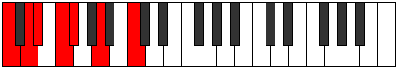 | [midi](ModeCNaturalKyrimic.mid) [ogg](ModeCNaturalKyrimic.ogg) |
| [623](https://ianring.com/musictheory/scales/623) | [Gacrian](ScaleGacrian.md) | [Sycrian](ModeSycrian.md) | **C**, **Db**, Ebb, **Fbb**, Gbb, Abbb, **Bbb**, **C** |  | [midi](ModeCNaturalSycrian.mid) [ogg](ModeCNaturalSycrian.ogg) |
| [625](https://ianring.com/musictheory/scales/625) | [Ionyptitonic](ScaleIonyptitonic.md) | [Ionyptitonic](ModeIonyptitonic.md) | **C**, **E**, F, **F#**, A, **C** |  | [midi](ModeCNaturalIonyptitonic.mid) [ogg](ModeCNaturalIonyptitonic.ogg) |
| [627](https://ianring.com/musictheory/scales/627) | [Ionodimic](ScaleIonodimic.md) | [Mogimic](ModeMogimic.md) | **C**, **Db**, **E**, F, Gb, A, **C** |  | [midi](ModeCNaturalMogimic.mid) [ogg](ModeCNaturalMogimic.ogg) |
| [629](https://ianring.com/musictheory/scales/629) | [Palimic](ScalePalimic.md) | [Aeronimic](ModeAeronimic.md) | **C**, D, **E**, F, **Gb**, A, **C** |  | [midi](ModeCNaturalAeronimic.mid) [ogg](ModeCNaturalAeronimic.ogg) |
| [631](https://ianring.com/musictheory/scales/631) | [Stalian](ScaleStalian.md) | [Zygian](ModeZygian.md) | **C**, **Db**, Ebb, **Fb**, Gbb, Abbb, Bbb, **C** | 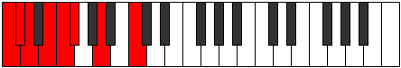 | [midi](ModeCNaturalZygian.mid) [ogg](ModeCNaturalZygian.ogg) |
| [633](https://ianring.com/musictheory/scales/633) | [Epynimic](ScaleEpynimic.md) | [Kydimic](ModeKydimic.md) | **C**, **D#**, **E**, F, **Gb**, A, **C** |  | [midi](ModeCNaturalKydimic.mid) [ogg](ModeCNaturalKydimic.ogg) |
| [635](https://ianring.com/musictheory/scales/635) | [Epagian](ScaleEpagian.md) | [Epolian](ModeEpolian.md) | **C**, **Db**, **Eb**, **Fb**, Gbb, Abbb, Bbb, **C** |  | [midi](ModeCNaturalEpolian.mid) [ogg](ModeCNaturalEpolian.ogg) |
| [637](https://ianring.com/musictheory/scales/637) | [Bonian](ScaleBonian.md) | [Katodian](ModeKatodian.md) | **C**, D, **Eb**, **Fb**, Gbb, **Abbb**, Bbb, **C** |  | [midi](ModeCNaturalKatodian.mid) [ogg](ModeCNaturalKatodian.ogg) |
| [639](https://ianring.com/musictheory/scales/639) | [Zaryllic](ScaleZaryllic.md) | [Ionaryllic](ModeIonaryllic.md) | **C**, **C#**, D, **D#**, **E**, F, F#, A, **C** | 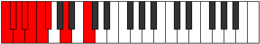 | [midi](ModeCNaturalIonaryllic.mid) [ogg](ModeCNaturalIonaryllic.ogg) |
| [649](https://ianring.com/musictheory/scales/649) | [Saric](ScaleSaric.md) | [Byptic](ModeByptic.md) | C, **D#**, **G**, **A**, C |  | [midi](ModeCNaturalByptic.mid) [ogg](ModeCNaturalByptic.ogg) |
| [651](https://ianring.com/musictheory/scales/651) | [Phronitonic](ScalePhronitonic.md) | [Golitonic](ModeGolitonic.md) | C, **C#**, **D#**, **G**, **A**, C |  | [midi](ModeCNaturalGolitonic.mid) [ogg](ModeCNaturalGolitonic.ogg) |
| [653](https://ianring.com/musictheory/scales/653) | [Gathitonic](ScaleGathitonic.md) | [Stathitonic](ModeStathitonic.md) | C, D, **D#**, G, **A**, C |  | [midi](ModeCNaturalStathitonic.mid) [ogg](ModeCNaturalStathitonic.ogg) |
| [655](https://ianring.com/musictheory/scales/655) | [Stalimic](ScaleStalimic.md) | [Kataptimic](ModeKataptimic.md) | C, **Db**, Ebb, **Fbb**, G, **A**, C |  | [midi](ModeCNaturalKataptimic.mid) [ogg](ModeCNaturalKataptimic.ogg) |
| [657](https://ianring.com/musictheory/scales/657) | [Epathic](ScaleEpathic.md) | [Epathic](ModeEpathic.md) | C, **E**, **G**, A, C |  | [midi](ModeCNaturalEpathic.mid) [ogg](ModeCNaturalEpathic.ogg) |
| [659](https://ianring.com/musictheory/scales/659) | [Thoditonic](ScaleThoditonic.md) | [Soptitonic](ModeSoptitonic.md) | C, **C#**, **E**, **G**, A, C |  | [midi](ModeCNaturalSoptitonic.mid) [ogg](ModeCNaturalSoptitonic.ogg) |
| [661](https://ianring.com/musictheory/scales/661) | [Epathitonic](ScaleEpathitonic.md) | [Pentatonic](ModePentatonic.md) | C, D, **E**, G, A, C |  | [midi](ModeCNaturalPentatonic.mid) [ogg](ModeCNaturalPentatonic.ogg) |
| [663](https://ianring.com/musictheory/scales/663) | [Ionacrimic](ScaleIonacrimic.md) | [Phrynimic](ModePhrynimic.md) | C, **Db**, Ebb, **Fb**, G, A, C |  | [midi](ModeCNaturalPhrynimic.mid) [ogg](ModeCNaturalPhrynimic.ogg) |
| [665](https://ianring.com/musictheory/scales/665) | [Lyditonic](ScaleLyditonic.md) | [Mythitonic](ModeMythitonic.md) | C, **D#**, **E**, **G**, A, C |  | [midi](ModeCNaturalMythitonic.mid) [ogg](ModeCNaturalMythitonic.ogg) |
| [667](https://ianring.com/musictheory/scales/667) | [Stythimic](ScaleStythimic.md) | [Rodimic](ModeRodimic.md) | C, **Db**, **Eb**, **Fb**, **G**, A, C |  | [midi](ModeCNaturalRodimic.mid) [ogg](ModeCNaturalRodimic.ogg) |
| [669](https://ianring.com/musictheory/scales/669) | [Mixolimic](ScaleMixolimic.md) | [Gycrimic](ModeGycrimic.md) | C, D, **Eb**, **Fb**, G, A, C |  | [midi](ModeCNaturalGycrimic.mid) [ogg](ModeCNaturalGycrimic.ogg) |
| [671](https://ianring.com/musictheory/scales/671) | [Morian](ScaleMorian.md) | [Stycrian](ModeStycrian.md) | C, **Db**, Ebb, **Fbb**, **Gbbb**, Abb, Bbb, C |  | [midi](ModeCNaturalStycrian.mid) [ogg](ModeCNaturalStycrian.ogg) |
| [675](https://ianring.com/musictheory/scales/675) | [Aeolanitonic](ScaleAeolanitonic.md) | [Zyditonic](ModeZyditonic.md) | C, **C#**, F, **G**, **A**, C |  | [midi](ModeCNaturalZyditonic.mid) [ogg](ModeCNaturalZyditonic.ogg) |
| [677](https://ianring.com/musictheory/scales/677) | [Epathitonic](ScaleEpathitonic.md) | [Mynitonic](ModeMynitonic.md) | C, D, F, G, **A**, C |  | [midi](ModeCNaturalMynitonic.mid) [ogg](ModeCNaturalMynitonic.ogg) |
| [679](https://ianring.com/musictheory/scales/679) | [Dalimic](ScaleDalimic.md) | [Lanimic](ModeLanimic.md) | C, **Db**, Ebb, F, G, **A**, C |  | [midi](ModeCNaturalLanimic.mid) [ogg](ModeCNaturalLanimic.ogg) |
| [681](https://ianring.com/musictheory/scales/681) | [Kataritonic](ScaleKataritonic.md) | [Sylitonic](ModeSylitonic.md) | C, **D#**, F, **G**, **A**, C | 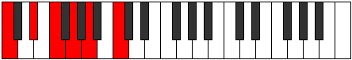 | [midi](ModeCNaturalSylitonic.mid) [ogg](ModeCNaturalSylitonic.ogg) |
| [683](https://ianring.com/musictheory/scales/683) | [Boptimic](ScaleBoptimic.md) | [Stogimic](ModeStogimic.md) | C, **Db**, **Eb**, F, **G**, **A**, C |  | [midi](ModeCNaturalStogimic.mid) [ogg](ModeCNaturalStogimic.ogg) |
| [685](https://ianring.com/musictheory/scales/685) | [Phracrimic](ScalePhracrimic.md) | [Aerathimic](ModeAerathimic.md) | C, D, **Eb**, F, G, **A**, C |  | [midi](ModeCNaturalAerathimic.mid) [ogg](ModeCNaturalAerathimic.ogg) |
| [687](https://ianring.com/musictheory/scales/687) | [Pagian](ScalePagian.md) | [Aeolythian](ModeAeolythian.md) | C, **Db**, Ebb, **Fbb**, Gbb, Abb, **Bbb**, C |  | [midi](ModeCNaturalAeolythian.mid) [ogg](ModeCNaturalAeolythian.ogg) |
| [689](https://ianring.com/musictheory/scales/689) | [Lothitonic](ScaleLothitonic.md) | [Lothitonic](ModeLothitonic.md) | C, **E**, F, **G**, A, C |  | [midi](ModeCNaturalLothitonic.mid) [ogg](ModeCNaturalLothitonic.ogg) |
| [691](https://ianring.com/musictheory/scales/691) | [Dynimic](ScaleDynimic.md) | [Zydimic](ModeZydimic.md) | C, **Db**, **E**, F, **G**, A, C |  | [midi](ModeCNaturalZydimic.mid) [ogg](ModeCNaturalZydimic.ogg) |
| [693](https://ianring.com/musictheory/scales/693) | [Epathimic](ScaleEpathimic.md) | [Mynimic](ModeMynimic.md) | C, D, **E**, F, G, A, C |  | [midi](ModeCNaturalMynimic.mid) [ogg](ModeCNaturalMynimic.ogg) |
| [695](https://ianring.com/musictheory/scales/695) | [Aerathian](ScaleAerathian.md) | [Sarian](ModeSarian.md) | C, **Db**, Ebb, **Fb**, Gbb, Abb, Bbb, C |  | [midi](ModeCNaturalSarian.mid) [ogg](ModeCNaturalSarian.ogg) |
| [697](https://ianring.com/musictheory/scales/697) | [Zagimic](ScaleZagimic.md) | [Lagimic](ModeLagimic.md) | C, **D#**, **E**, F, **G**, A, C |  | [midi](ModeCNaturalLagimic.mid) [ogg](ModeCNaturalLagimic.ogg) |
| [699](https://ianring.com/musictheory/scales/699) | [Ionanian](ScaleIonanian.md) | [Aerothian](ModeAerothian.md) | C, **Db**, **Eb**, **Fb**, Gbb, **Abb**, Bbb, C |  | [midi](ModeCNaturalAerothian.mid) [ogg](ModeCNaturalAerothian.ogg) |
| [701](https://ianring.com/musictheory/scales/701) | [Stathian](ScaleStathian.md) | [Mixonyphian](ModeMixonyphian.md) | C, D, **Eb**, **Fb**, Gbb, Abb, Bbb, C |  | [midi](ModeCNaturalMixonyphian.mid) [ogg](ModeCNaturalMixonyphian.ogg) |
| [703](https://ianring.com/musictheory/scales/703) | [Kataryllic](ScaleKataryllic.md) | [Aerocryllic](ModeAerocryllic.md) | C, **C#**, D, **D#**, **E**, F, G, A, C |  | [midi](ModeCNaturalAerocryllic.mid) [ogg](ModeCNaturalAerocryllic.ogg) |
| [709](https://ianring.com/musictheory/scales/709) | [Aeracritonic](ScaleAeracritonic.md) | [Ionycritonic](ModeIonycritonic.md) | C, D, **F#**, G, **A**, C |  | [midi](ModeCNaturalIonycritonic.mid) [ogg](ModeCNaturalIonycritonic.ogg) |
| [711](https://ianring.com/musictheory/scales/711) | [Epygimic](ScaleEpygimic.md) | [Epyrimic](ModeEpyrimic.md) | C, **Db**, Ebb, F#, G, **A**, C |  | [midi](ModeCNaturalEpyrimic.mid) [ogg](ModeCNaturalEpyrimic.ogg) |
| [713](https://ianring.com/musictheory/scales/713) | [Thyritonic](ScaleThyritonic.md) | [Thoptitonic](ModeThoptitonic.md) | C, **D#**, **F#**, **G**, **A**, C |  | [midi](ModeCNaturalThoptitonic.mid) [ogg](ModeCNaturalThoptitonic.ogg) |
| [715](https://ianring.com/musictheory/scales/715) | [Lythimic](ScaleLythimic.md) | [Dodimic](ModeDodimic.md) | C, **Db**, **Eb**, F#, **G**, **A**, C |  | [midi](ModeCNaturalDodimic.mid) [ogg](ModeCNaturalDodimic.ogg) |
| [717](https://ianring.com/musictheory/scales/717) | [Bocrimic](ScaleBocrimic.md) | [Gythimic](ModeGythimic.md) | C, D, **Eb**, **F#**, G, **A**, C |  | [midi](ModeCNaturalGythimic.mid) [ogg](ModeCNaturalGythimic.ogg) |
| [719](https://ianring.com/musictheory/scales/719) | [Ranian](ScaleRanian.md) | [Kanian](ModeKanian.md) | C, **Db**, Ebb, **Fbb**, Gb, Abb, **Bbb**, C |  | [midi](ModeCNaturalKanian.mid) [ogg](ModeCNaturalKanian.ogg) |
| [721](https://ianring.com/musictheory/scales/721) | [Aeolacritonic](ScaleAeolacritonic.md) | [Aeolacritonic](ModeAeolacritonic.md) | C, **E**, **F#**, **G**, A, C |  | [midi](ModeCNaturalAeolacritonic.mid) [ogg](ModeCNaturalAeolacritonic.ogg) |
| [723](https://ianring.com/musictheory/scales/723) | [Zacrimic](ScaleZacrimic.md) | [Ionadimic](ModeIonadimic.md) | C, **Db**, **E**, F#, **G**, A, C |  | [midi](ModeCNaturalIonadimic.mid) [ogg](ModeCNaturalIonadimic.ogg) |
| [725](https://ianring.com/musictheory/scales/725) | [Darmic](ScaleDarmic.md) | [Lonimic](ModeLonimic.md) | C, D, **E**, **F#**, G, A, C |  | [midi](ModeCNaturalLonimic.mid) [ogg](ModeCNaturalLonimic.ogg) |
| [727](https://ianring.com/musictheory/scales/727) | [Ionycrian](ScaleIonycrian.md) | [Phradian](ModePhradian.md) | C, **Db**, Ebb, **Fb**, Gb, Abb, Bbb, C |  | [midi](ModeCNaturalPhradian.mid) [ogg](ModeCNaturalPhradian.ogg) |
| [729](https://ianring.com/musictheory/scales/729) | [Thalimic](ScaleThalimic.md) | [Stygimic](ModeStygimic.md) | C, **D#**, **E**, **F#**, **G**, A, C |  | [midi](ModeCNaturalStygimic.mid) [ogg](ModeCNaturalStygimic.ogg) |
| [731](https://ianring.com/musictheory/scales/731) | [Mycrian](ScaleMycrian.md) | [Ionorian](ModeIonorian.md) | C, **Db**, **Eb**, **Fb**, Gb, **Abb**, Bbb, C |  | [midi](ModeCNaturalIonorian.mid) [ogg](ModeCNaturalIonorian.ogg) |
| [733](https://ianring.com/musictheory/scales/733) | [Rythian](ScaleRythian.md) | [Donian](ModeDonian.md) | C, D, **Eb**, **Fb**, **Gb**, Abb, Bbb, C |  | [midi](ModeCNaturalDonian.mid) [ogg](ModeCNaturalDonian.ogg) |
| [735](https://ianring.com/musictheory/scales/735) | [Tharyllic](ScaleTharyllic.md) | [Sylyllic](ModeSylyllic.md) | C, **C#**, D, **D#**, **E**, F#, G, A, C |  | [midi](ModeCNaturalSylyllic.mid) [ogg](ModeCNaturalSylyllic.ogg) |
| [739](https://ianring.com/musictheory/scales/739) | [Kanimic](ScaleKanimic.md) | [Rorimic](ModeRorimic.md) | C, **Db**, E#, F#, **G**, **A**, C |  | [midi](ModeCNaturalRorimic.mid) [ogg](ModeCNaturalRorimic.ogg) |
| [741](https://ianring.com/musictheory/scales/741) | [Ionacrimic](ScaleIonacrimic.md) | [Gathimic](ModeGathimic.md) | C, D, E#, **F#**, G, **A**, C |  | [midi](ModeCNaturalGathimic.mid) [ogg](ModeCNaturalGathimic.ogg) |
| [743](https://ianring.com/musictheory/scales/743) | [Epogian](ScaleEpogian.md) | [Lanian](ModeLanian.md) | C, **Db**, Ebb, F, Gb, Abb, **Bbb**, C |  | [midi](ModeCNaturalLanian.mid) [ogg](ModeCNaturalLanian.ogg) |
| [745](https://ianring.com/musictheory/scales/745) | [Thagimic](ScaleThagimic.md) | [Kolimic](ModeKolimic.md) | C, **D#**, E#, **F#**, **G**, **A**, C | 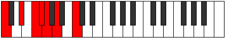 | [midi](ModeCNaturalKolimic.mid) [ogg](ModeCNaturalKolimic.ogg) |
| [747](https://ianring.com/musictheory/scales/747) | [Korian](ScaleKorian.md) | [Lynian](ModeLynian.md) | C, **Db**, **Eb**, F, Gb, **Abb**, **Bbb**, C |  | [midi](ModeCNaturalLynian.mid) [ogg](ModeCNaturalLynian.ogg) |
| [749](https://ianring.com/musictheory/scales/749) | [Ionopian](ScaleIonopian.md) | [Aeologian](ModeAeologian.md) | C, D, **Eb**, F, **Gb**, Abb, **Bbb**, C |  | [midi](ModeCNaturalAeologian.mid) [ogg](ModeCNaturalAeologian.ogg) |
| [751](https://ianring.com/musictheory/scales/751) | [Zagyllic](ScaleZagyllic.md) | [Epacryllic](ModeEpacryllic.md) | C, **C#**, D, **D#**, F, F#, G, **A**, C |  | [midi](ModeCNaturalEpacryllic.mid) [ogg](ModeCNaturalEpacryllic.ogg) |
| [753](https://ianring.com/musictheory/scales/753) | [Kytrimic](ScaleKytrimic.md) | [Kytrimic](ModeKytrimic.md) | C, **D##**, E#, **F#**, **G**, A, C |  | [midi](ModeCNaturalKytrimic.mid) [ogg](ModeCNaturalKytrimic.ogg) |
| [755](https://ianring.com/musictheory/scales/755) | [Zarian](ScaleZarian.md) | [Phrythian](ModePhrythian.md) | C, **Db**, **E**, F, Gb, **Abb**, Bbb, C |  | [midi](ModeCNaturalPhrythian.mid) [ogg](ModeCNaturalPhrythian.ogg) |
| [757](https://ianring.com/musictheory/scales/757) | [Soptian](ScaleSoptian.md) | [Ionyptian](ModeIonyptian.md) | C, D, **E**, F, **Gb**, Abb, Bbb, C |  | [midi](ModeCNaturalIonyptian.mid) [ogg](ModeCNaturalIonyptian.ogg) |
| [759](https://ianring.com/musictheory/scales/759) | [Dagyllic](ScaleDagyllic.md) | [Katalyllic](ModeKatalyllic.md) | C, **C#**, D, **E**, F, F#, G, A, C |  | [midi](ModeCNaturalKatalyllic.mid) [ogg](ModeCNaturalKatalyllic.ogg) |
| [761](https://ianring.com/musictheory/scales/761) | [Katoptian](ScaleKatoptian.md) | [Ponian](ModePonian.md) | C, **D#**, **E**, F, **Gb**, **Abb**, Bbb, C |  | [midi](ModeCNaturalPonian.mid) [ogg](ModeCNaturalPonian.ogg) |
| [763](https://ianring.com/musictheory/scales/763) | [Stacryllic](ScaleStacryllic.md) | [Doryllic](ModeDoryllic.md) | C, **C#**, **D#**, **E**, F, F#, **G**, A, C |  | [midi](ModeCNaturalDoryllic.mid) [ogg](ModeCNaturalDoryllic.ogg) |
| [765](https://ianring.com/musictheory/scales/765) | [Mixolydyllic](ScaleMixolydyllic.md) | [Mixonyphyllic](ModeMixonyphyllic.md) | C, D, **D#**, **E**, F, **F#**, G, A, C |  | [midi](ModeCNaturalMixonyphyllic.mid) [ogg](ModeCNaturalMixonyphyllic.ogg) |
| [767](https://ianring.com/musictheory/scales/767) | [Aeolacrygic](ScaleAeolacrygic.md) | [Raptygic](ModeRaptygic.md) | C, **C#**, D, **D#**, **E**, F, F#, G, A, C |  | [midi](ModeCNaturalRaptygic.mid) [ogg](ModeCNaturalRaptygic.ogg) |
| [785](https://ianring.com/musictheory/scales/785) | [Aeoloric](ScaleAeoloric.md) | [Aeoloric](ModeAeoloric.md) | **C**, **E**, **G#**, A, **C** |  | [midi](ModeCNaturalAeoloric.mid) [ogg](ModeCNaturalAeoloric.ogg) |
| [787](https://ianring.com/musictheory/scales/787) | [Zothitonic](ScaleZothitonic.md) | [Aeolapritonic](ModeAeolapritonic.md) | **C**, C#, **E**, **G#**, A, **C** |  | [midi](ModeCNaturalAeolapritonic.mid) [ogg](ModeCNaturalAeolapritonic.ogg) |
| [789](https://ianring.com/musictheory/scales/789) | [Epygitonic](ScaleEpygitonic.md) | [Zogitonic](ModeZogitonic.md) | **C**, D, **E**, **G#**, A, **C** |  | [midi](ModeCNaturalZogitonic.mid) [ogg](ModeCNaturalZogitonic.ogg) |
| [791](https://ianring.com/musictheory/scales/791) | [Thogimic](ScaleThogimic.md) | [Aeoloptimic](ModeAeoloptimic.md) | **C**, Db, Ebb, **Fb**, **G#**, A, **C** |  | [midi](ModeCNaturalAeoloptimic.mid) [ogg](ModeCNaturalAeoloptimic.ogg) |
| [793](https://ianring.com/musictheory/scales/793) | [Lycritonic](ScaleLycritonic.md) | [Mocritonic](ModeMocritonic.md) | **C**, **D#**, **E**, G#, A, **C** |  | [midi](ModeCNaturalMocritonic.mid) [ogg](ModeCNaturalMocritonic.ogg) |
| [795](https://ianring.com/musictheory/scales/795) | [Solimic](ScaleSolimic.md) | [Aeologimic](ModeAeologimic.md) | **C**, Db, **Eb**, **Fb**, G#, A, **C** |  | [midi](ModeCNaturalAeologimic.mid) [ogg](ModeCNaturalAeologimic.ogg) |
| [797](https://ianring.com/musictheory/scales/797) | [Phralimic](ScalePhralimic.md) | [Katocrimic](ModeKatocrimic.md) | **C**, D, **Eb**, **Fb**, G#, A, **C** |  | [midi](ModeCNaturalKatocrimic.mid) [ogg](ModeCNaturalKatocrimic.ogg) |
| [799](https://ianring.com/musictheory/scales/799) | [Parian](ScaleParian.md) | [Lolian](ModeLolian.md) | **C**, Db, Ebb, **Fbb**, **Gbbb**, Ab, Bbb, **C** |  | [midi](ModeCNaturalLolian.mid) [ogg](ModeCNaturalLolian.ogg) |
| [803](https://ianring.com/musictheory/scales/803) | [Zacritonic](ScaleZacritonic.md) | [Loritonic](ModeLoritonic.md) | **C**, C#, F, **G#**, **A**, **C** |  | [midi](ModeCNaturalLoritonic.mid) [ogg](ModeCNaturalLoritonic.ogg) |
| [805](https://ianring.com/musictheory/scales/805) | [Lyditonic](ScaleLyditonic.md) | [Rothitonic](ModeRothitonic.md) | **C**, D, F, **G#**, **A**, **C** |  | [midi](ModeCNaturalRothitonic.mid) [ogg](ModeCNaturalRothitonic.ogg) |
| [807](https://ianring.com/musictheory/scales/807) | [Ionodimic](ScaleIonodimic.md) | [Epadimic](ModeEpadimic.md) | **C**, Db, Ebb, F, **G#**, **A**, **C** |  | [midi](ModeCNaturalEpadimic.mid) [ogg](ModeCNaturalEpadimic.ogg) |
| [809](https://ianring.com/musictheory/scales/809) | [Thoditonic](ScaleThoditonic.md) | [Dogitonic](ModeDogitonic.md) | **C**, **D#**, F, G#, **A**, **C** |  | [midi](ModeCNaturalDogitonic.mid) [ogg](ModeCNaturalDogitonic.ogg) |
| [811](https://ianring.com/musictheory/scales/811) | [Dynimic](ScaleDynimic.md) | [Radimic](ModeRadimic.md) | **C**, Db, **Eb**, F, G#, **A**, **C** |  | [midi](ModeCNaturalRadimic.mid) [ogg](ModeCNaturalRadimic.ogg) |
| [813](https://ianring.com/musictheory/scales/813) | [Zacrimic](ScaleZacrimic.md) | [Larimic](ModeLarimic.md) | **C**, D, **Eb**, F, G#, **A**, **C** |  | [midi](ModeCNaturalLarimic.mid) [ogg](ModeCNaturalLarimic.ogg) |
| [815](https://ianring.com/musictheory/scales/815) | [Zarian](ScaleZarian.md) | [Bolian](ModeBolian.md) | **C**, Db, Ebb, **Fbb**, Gbb, Ab, **Bbb**, **C** |  | [midi](ModeCNaturalBolian.mid) [ogg](ModeCNaturalBolian.ogg) |
| [817](https://ianring.com/musictheory/scales/817) | [Zothitonic](ScaleZothitonic.md) | [Zothitonic](ModeZothitonic.md) | **C**, **E**, F, **G#**, A, **C** | 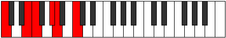 | [midi](ModeCNaturalZothitonic.mid) [ogg](ModeCNaturalZothitonic.ogg) |
| [819](https://ianring.com/musictheory/scales/819) | [Ionythimic](ScaleIonythimic.md) | [Aerythimic](ModeAerythimic.md) | **C**, Db, **E**, F, **G#**, A, **C** |  | [midi](ModeCNaturalAerythimic.mid) [ogg](ModeCNaturalAerythimic.ogg) |
| [821](https://ianring.com/musictheory/scales/821) | [Mothimic](ScaleMothimic.md) | [Aeranimic](ModeAeranimic.md) | **C**, D, **E**, F, **G#**, A, **C** |  | [midi](ModeCNaturalAeranimic.mid) [ogg](ModeCNaturalAeranimic.ogg) |
| [823](https://ianring.com/musictheory/scales/823) | [Tholian](ScaleTholian.md) | [Stodian](ModeStodian.md) | **C**, Db, Ebb, **Fb**, Gbb, **Ab**, Bbb, **C** |  | [midi](ModeCNaturalStodian.mid) [ogg](ModeCNaturalStodian.ogg) |
| [825](https://ianring.com/musictheory/scales/825) | [Mydimic](ScaleMydimic.md) | [Thyptimic](ModeThyptimic.md) | **C**, **D#**, **E**, F, G#, A, **C** |  | [midi](ModeCNaturalThyptimic.mid) [ogg](ModeCNaturalThyptimic.ogg) |
| [827](https://ianring.com/musictheory/scales/827) | [Katathian](ScaleKatathian.md) | [Mixolocrian](ModeMixolocrian.md) | **C**, Db, **Eb**, **Fb**, Gbb, Ab, Bbb, **C** |  | [midi](ModeCNaturalMixolocrian.mid) [ogg](ModeCNaturalMixolocrian.ogg) |
| [829](https://ianring.com/musictheory/scales/829) | [Laptian](ScaleLaptian.md) | [Lygian](ModeLygian.md) | **C**, D, **Eb**, **Fb**, Gbb, Ab, Bbb, **C** |  | [midi](ModeCNaturalLygian.mid) [ogg](ModeCNaturalLygian.ogg) |
| [831](https://ianring.com/musictheory/scales/831) | [Ioniptyllic](ScaleIoniptyllic.md) | [Rodyllic](ModeRodyllic.md) | **C**, C#, D, **D#**, **E**, F, G#, A, **C** |  | [midi](ModeCNaturalRodyllic.mid) [ogg](ModeCNaturalRodyllic.ogg) |
| [837](https://ianring.com/musictheory/scales/837) | [Ionoditonic](ScaleIonoditonic.md) | [Epaditonic](ModeEpaditonic.md) | **C**, D, **F#**, **G#**, **A**, **C** |  | [midi](ModeCNaturalEpaditonic.mid) [ogg](ModeCNaturalEpaditonic.ogg) |
| [839](https://ianring.com/musictheory/scales/839) | [Katythimic](ScaleKatythimic.md) | [Ionathimic](ModeIonathimic.md) | **C**, Db, Ebb, F#, **G#**, **A**, **C** |  | [midi](ModeCNaturalIonathimic.mid) [ogg](ModeCNaturalIonathimic.ogg) |
| [841](https://ianring.com/musictheory/scales/841) | [Mixitonic](ScaleMixitonic.md) | [Phrothitonic](ModePhrothitonic.md) | **C**, **D#**, **F#**, G#, **A**, **C** |  | [midi](ModeCNaturalPhrothitonic.mid) [ogg](ModeCNaturalPhrothitonic.ogg) |
| [843](https://ianring.com/musictheory/scales/843) | [Bocrimic](ScaleBocrimic.md) | [Molimic](ModeMolimic.md) | **C**, Db, **Eb**, F#, G#, **A**, **C** |  | [midi](ModeCNaturalMolimic.mid) [ogg](ModeCNaturalMolimic.ogg) |
| [845](https://ianring.com/musictheory/scales/845) | [Aeradimic](ScaleAeradimic.md) | [Zyrimic](ModeZyrimic.md) | **C**, D, **Eb**, **F#**, G#, **A**, **C** |  | [midi](ModeCNaturalZyrimic.mid) [ogg](ModeCNaturalZyrimic.ogg) |
| [847](https://ianring.com/musictheory/scales/847) | [Katocrian](ScaleKatocrian.md) | [Ganian](ModeGanian.md) | **C**, Db, Ebb, **Fbb**, Gb, Ab, **Bbb**, **C** |  | [midi](ModeCNaturalGanian.mid) [ogg](ModeCNaturalGanian.ogg) |
| [849](https://ianring.com/musictheory/scales/849) | [Aerynitonic](ScaleAerynitonic.md) | [Aerynitonic](ModeAerynitonic.md) | **C**, **E**, **F#**, **G#**, A, **C** |  | [midi](ModeCNaturalAerynitonic.mid) [ogg](ModeCNaturalAerynitonic.ogg) |
| [851](https://ianring.com/musictheory/scales/851) | [Mothimic](ScaleMothimic.md) | [Aerylimic](ModeAerylimic.md) | **C**, Db, **E**, F#, **G#**, A, **C** |  | [midi](ModeCNaturalAerylimic.mid) [ogg](ModeCNaturalAerylimic.ogg) |
| [853](https://ianring.com/musictheory/scales/853) | [Aeragimic](ScaleAeragimic.md) | [Epothimic](ModeEpothimic.md) | **C**, D, **E**, **F#**, **G#**, A, **C** |  | [midi](ModeCNaturalEpothimic.mid) [ogg](ModeCNaturalEpothimic.ogg) |
| [855](https://ianring.com/musictheory/scales/855) | [Dolian](ScaleDolian.md) | [Porian](ModePorian.md) | **C**, Db, Ebb, **Fb**, Gb, **Ab**, Bbb, **C** |  | [midi](ModeCNaturalPorian.mid) [ogg](ModeCNaturalPorian.ogg) |
| [857](https://ianring.com/musictheory/scales/857) | [Dagimic](ScaleDagimic.md) | [Aeolydimic](ModeAeolydimic.md) | **C**, **D#**, **E**, **F#**, G#, A, **C** |  | [midi](ModeCNaturalAeolydimic.mid) [ogg](ModeCNaturalAeolydimic.ogg) |
| [859](https://ianring.com/musictheory/scales/859) | [Bycrian](ScaleBycrian.md) | [Pathian](ModePathian.md) | **C**, Db, **Eb**, **Fb**, Gb, Ab, Bbb, **C** |  | [midi](ModeCNaturalPathian.mid) [ogg](ModeCNaturalPathian.ogg) |
| [861](https://ianring.com/musictheory/scales/861) | [Eporian](ScaleEporian.md) | [Rylian](ModeRylian.md) | **C**, D, **Eb**, **Fb**, **Gb**, Ab, Bbb, **C** |  | [midi](ModeCNaturalRylian.mid) [ogg](ModeCNaturalRylian.ogg) |
| [863](https://ianring.com/musictheory/scales/863) | [Gythyllic](ScaleGythyllic.md) | [Pyryllic](ModePyryllic.md) | **C**, C#, D, **D#**, **E**, F#, G#, A, **C** |  | [midi](ModeCNaturalPyryllic.mid) [ogg](ModeCNaturalPyryllic.ogg) |
| [867](https://ianring.com/musictheory/scales/867) | [Laptimic](ScaleLaptimic.md) | [Phrocrimic](ModePhrocrimic.md) | **C**, Db, E#, F#, **G#**, **A**, **C** |  | [midi](ModeCNaturalPhrocrimic.mid) [ogg](ModeCNaturalPhrocrimic.ogg) |
| [869](https://ianring.com/musictheory/scales/869) | [Stythimic](ScaleStythimic.md) | [Kothimic](ModeKothimic.md) | **C**, D, E#, **F#**, **G#**, **A**, **C** | 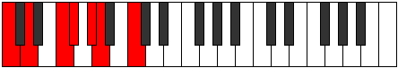 | [midi](ModeCNaturalKothimic.mid) [ogg](ModeCNaturalKothimic.ogg) |
| [871](https://ianring.com/musictheory/scales/871) | [Loptian](ScaleLoptian.md) | [Epadian](ModeEpadian.md) | **C**, Db, Ebb, F, Gb, **Ab**, **Bbb**, **C** |  | [midi](ModeCNaturalEpadian.mid) [ogg](ModeCNaturalEpadian.ogg) |
| [873](https://ianring.com/musictheory/scales/873) | [Thoptimic](ScaleThoptimic.md) | [Bagimic](ModeBagimic.md) | **C**, **D#**, E#, **F#**, G#, **A**, **C** |  | [midi](ModeCNaturalBagimic.mid) [ogg](ModeCNaturalBagimic.ogg) |
| [875](https://ianring.com/musictheory/scales/875) | [Palian](ScalePalian.md) | [Stothian](ModeStothian.md) | **C**, Db, **Eb**, F, Gb, Ab, **Bbb**, **C** |  | [midi](ModeCNaturalStothian.mid) [ogg](ModeCNaturalStothian.ogg) |
| [877](https://ianring.com/musictheory/scales/877) | [Pogian](ScalePogian.md) | [Aeraptian](ModeAeraptian.md) | **C**, D, **Eb**, F, **Gb**, Ab, **Bbb**, **C** |  | [midi](ModeCNaturalAeraptian.mid) [ogg](ModeCNaturalAeraptian.ogg) |
| [879](https://ianring.com/musictheory/scales/879) | [Aeolathyllic](ScaleAeolathyllic.md) | [Aeolocryllic](ModeAeolocryllic.md) | **C**, C#, D, **D#**, F, F#, G#, **A**, **C** |  | [midi](ModeCNaturalAeolocryllic.mid) [ogg](ModeCNaturalAeolocryllic.ogg) |
| [881](https://ianring.com/musictheory/scales/881) | [Aerothimic](ScaleAerothimic.md) | [Aerothimic](ModeAerothimic.md) | **C**, **D##**, E#, **F#**, **G#**, A, **C** |  | [midi](ModeCNaturalAerothimic.mid) [ogg](ModeCNaturalAerothimic.ogg) |
| [883](https://ianring.com/musictheory/scales/883) | [Tholian](ScaleTholian.md) | [Ralian](ModeRalian.md) | **C**, Db, **E**, F, Gb, **Ab**, Bbb, **C** |  | [midi](ModeCNaturalRalian.mid) [ogg](ModeCNaturalRalian.ogg) |
| [885](https://ianring.com/musictheory/scales/885) | [Epacrian](ScaleEpacrian.md) | [Sathian](ModeSathian.md) | **C**, D, **E**, F, **Gb**, **Ab**, Bbb, **C** |  | [midi](ModeCNaturalSathian.mid) [ogg](ModeCNaturalSathian.ogg) |
| [887](https://ianring.com/musictheory/scales/887) | [Lonyllic](ScaleLonyllic.md) | [Sathyllic](ModeSathyllic.md) | **C**, C#, D, **E**, F, F#, **G#**, A, **C** |  | [midi](ModeCNaturalSathyllic.mid) [ogg](ModeCNaturalSathyllic.ogg) |
| [889](https://ianring.com/musictheory/scales/889) | [Gacrian](ScaleGacrian.md) | [Borian](ModeBorian.md) | **C**, **D#**, **E**, F, **Gb**, Ab, Bbb, **C** |  | [midi](ModeCNaturalBorian.mid) [ogg](ModeCNaturalBorian.ogg) |
| [891](https://ianring.com/musictheory/scales/891) | [Doptyllic](ScaleDoptyllic.md) | [Ionilyllic](ModeIonilyllic.md) | **C**, C#, **D#**, **E**, F, F#, G#, A, **C** |  | [midi](ModeCNaturalIonilyllic.mid) [ogg](ModeCNaturalIonilyllic.ogg) |
| [893](https://ianring.com/musictheory/scales/893) | [Aeronyllic](ScaleAeronyllic.md) | [Pycryllic](ModePycryllic.md) | **C**, D, **D#**, **E**, F, **F#**, G#, A, **C** |  | [midi](ModeCNaturalPycryllic.mid) [ogg](ModeCNaturalPycryllic.ogg) |
| [895](https://ianring.com/musictheory/scales/895) | [Zothygic](ScaleZothygic.md) | [Aeolathygic](ModeAeolathygic.md) | **C**, C#, D, **D#**, **E**, F, F#, G#, A, **C** |  | [midi](ModeCNaturalAeolathygic.mid) [ogg](ModeCNaturalAeolathygic.ogg) |
| [905](https://ianring.com/musictheory/scales/905) | [Ionyptitonic](ScaleIonyptitonic.md) | [Bylitonic](ModeBylitonic.md) | C, **D#**, **G**, G#, **A**, C |  | [midi](ModeCNaturalBylitonic.mid) [ogg](ModeCNaturalBylitonic.ogg) |
| [907](https://ianring.com/musictheory/scales/907) | [Bolimic](ScaleBolimic.md) | [Tholimic](ModeTholimic.md) | C, Db, **Eb**, **F##**, G#, **A**, C |  | [midi](ModeCNaturalTholimic.mid) [ogg](ModeCNaturalTholimic.ogg) |
| [909](https://ianring.com/musictheory/scales/909) | [Mythimic](ScaleMythimic.md) | [Katarimic](ModeKatarimic.md) | C, D, **Eb**, F##, G#, **A**, C |  | [midi](ModeCNaturalKatarimic.mid) [ogg](ModeCNaturalKatarimic.ogg) |
| [911](https://ianring.com/musictheory/scales/911) | [Ionarian](ScaleIonarian.md) | [Radian](ModeRadian.md) | C, Db, Ebb, **Fbb**, G, Ab, **Bbb**, C |  | [midi](ModeCNaturalRadian.mid) [ogg](ModeCNaturalRadian.ogg) |
| [913](https://ianring.com/musictheory/scales/913) | [Aeolyritonic](ScaleAeolyritonic.md) | [Aeolyritonic](ModeAeolyritonic.md) | C, **E**, **G**, **G#**, A, C |  | [midi](ModeCNaturalAeolyritonic.mid) [ogg](ModeCNaturalAeolyritonic.ogg) |
| [915](https://ianring.com/musictheory/scales/915) | [Mydimic](ScaleMydimic.md) | [Loptimic](ModeLoptimic.md) | C, Db, **E**, **F##**, **G#**, A, C |  | [midi](ModeCNaturalLoptimic.mid) [ogg](ModeCNaturalLoptimic.ogg) |
| [917](https://ianring.com/musictheory/scales/917) | [Dalimic](ScaleDalimic.md) | [Dygimic](ModeDygimic.md) | C, D, **E**, F##, **G#**, A, C |  | [midi](ModeCNaturalDygimic.mid) [ogg](ModeCNaturalDygimic.ogg) |
| [919](https://ianring.com/musictheory/scales/919) | [Epogian](ScaleEpogian.md) | [Gathian](ModeGathian.md) | C, Db, Ebb, **Fb**, G, **Ab**, Bbb, C |  | [midi](ModeCNaturalGathian.mid) [ogg](ModeCNaturalGathian.ogg) |
| [921](https://ianring.com/musictheory/scales/921) | [Ionodimic](ScaleIonodimic.md) | [Bogimic](ModeBogimic.md) | C, **D#**, **E**, **F##**, G#, A, C |  | [midi](ModeCNaturalBogimic.mid) [ogg](ModeCNaturalBogimic.ogg) |
| [923](https://ianring.com/musictheory/scales/923) | [Loptian](ScaleLoptian.md) | [Ionodian](ModeIonodian.md) | C, Db, **Eb**, **Fb**, **G**, Ab, Bbb, C |  | [midi](ModeCNaturalIonodian.mid) [ogg](ModeCNaturalIonodian.ogg) |
| [925](https://ianring.com/musictheory/scales/925) | [Epathian](ScaleEpathian.md) | [Mythian](ModeMythian.md) | C, D, **Eb**, **Fb**, G, Ab, Bbb, C |  | [midi](ModeCNaturalMythian.mid) [ogg](ModeCNaturalMythian.ogg) |
| [927](https://ianring.com/musictheory/scales/927) | [Locryllic](ScaleLocryllic.md) | [Koptyllic](ModeKoptyllic.md) | C, C#, D, **D#**, **E**, G, G#, A, C |  | [midi](ModeCNaturalKoptyllic.mid) [ogg](ModeCNaturalKoptyllic.ogg) |
| [931](https://ianring.com/musictheory/scales/931) | [Aerycrimic](ScaleAerycrimic.md) | [Bacrimic](ModeBacrimic.md) | C, Db, E#, **F##**, **G#**, **A**, C |  | [midi](ModeCNaturalBacrimic.mid) [ogg](ModeCNaturalBacrimic.ogg) |
| [933](https://ianring.com/musictheory/scales/933) | [Mixolimic](ScaleMixolimic.md) | [Dadimic](ModeDadimic.md) | C, D, E#, F##, **G#**, **A**, C |  | [midi](ModeCNaturalDadimic.mid) [ogg](ModeCNaturalDadimic.ogg) |
| [935](https://ianring.com/musictheory/scales/935) | [Epathian](ScaleEpathian.md) | [Katarian](ModeKatarian.md) | C, Db, Ebb, F, G, **Ab**, **Bbb**, C |  | [midi](ModeCNaturalKatarian.mid) [ogg](ModeCNaturalKatarian.ogg) |
| [937](https://ianring.com/musictheory/scales/937) | [Palimic](ScalePalimic.md) | [Stothimic](ModeStothimic.md) | C, **D#**, E#, **F##**, G#, **A**, C |  | [midi](ModeCNaturalStothimic.mid) [ogg](ModeCNaturalStothimic.ogg) |
| [939](https://ianring.com/musictheory/scales/939) | [Golian](ScaleGolian.md) | [Dyptian](ModeDyptian.md) | C, Db, **Eb**, F, **G**, Ab, **Bbb**, C |  | [midi](ModeCNaturalDyptian.mid) [ogg](ModeCNaturalDyptian.ogg) |
| [941](https://ianring.com/musictheory/scales/941) | [Thonian](ScaleThonian.md) | [Phrorian](ModePhrorian.md) | C, D, **Eb**, F, G, Ab, **Bbb**, C | 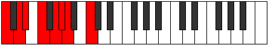 | [midi](ModeCNaturalPhrorian.mid) [ogg](ModeCNaturalPhrorian.ogg) |
| [943](https://ianring.com/musictheory/scales/943) | [Bacryllic](ScaleBacryllic.md) | [Aerygyllic](ModeAerygyllic.md) | C, C#, D, **D#**, F, G, G#, **A**, C |  | [midi](ModeCNaturalAerygyllic.mid) [ogg](ModeCNaturalAerygyllic.ogg) |
| [945](https://ianring.com/musictheory/scales/945) | [Syrimic](ScaleSyrimic.md) | [Syrimic](ModeSyrimic.md) | C, **D##**, E#, **F##**, **G#**, A, C |  | [midi](ModeCNaturalSyrimic.mid) [ogg](ModeCNaturalSyrimic.ogg) |
| [947](https://ianring.com/musictheory/scales/947) | [Katathian](ScaleKatathian.md) | [Modian](ModeModian.md) | C, Db, **E**, F, **G**, **Ab**, Bbb, C |  | [midi](ModeCNaturalModian.mid) [ogg](ModeCNaturalModian.ogg) |
| [949](https://ianring.com/musictheory/scales/949) | [Phrolian](ScalePhrolian.md) | [Ionagian](ModeIonagian.md) | C, D, **E**, F, G, **Ab**, Bbb, C |  | [midi](ModeCNaturalIonagian.mid) [ogg](ModeCNaturalIonagian.ogg) |
| [951](https://ianring.com/musictheory/scales/951) | [Dydyllic](ScaleDydyllic.md) | [Thogyllic](ModeThogyllic.md) | C, C#, D, **E**, F, G, **G#**, A, C |  | [midi](ModeCNaturalThogyllic.mid) [ogg](ModeCNaturalThogyllic.ogg) |
| [953](https://ianring.com/musictheory/scales/953) | [Stalian](ScaleStalian.md) | [Stoptian](ModeStoptian.md) | C, **D#**, **E**, F, **G**, Ab, Bbb, C |  | [midi](ModeCNaturalStoptian.mid) [ogg](ModeCNaturalStoptian.ogg) |
| [955](https://ianring.com/musictheory/scales/955) | [Thyptyllic](ScaleThyptyllic.md) | [Ionogyllic](ModeIonogyllic.md) | C, C#, **D#**, **E**, F, **G**, G#, A, C |  | [midi](ModeCNaturalIonogyllic.mid) [ogg](ModeCNaturalIonogyllic.ogg) |
| [957](https://ianring.com/musictheory/scales/957) | [Pothyllic](ScalePothyllic.md) | [Phronyllic](ModePhronyllic.md) | C, D, **D#**, **E**, F, G, G#, A, C |  | [midi](ModeCNaturalPhronyllic.mid) [ogg](ModeCNaturalPhronyllic.ogg) |
| [959](https://ianring.com/musictheory/scales/959) | [Loptygic](ScaleLoptygic.md) | [Katylygic](ModeKatylygic.md) | C, C#, D, **D#**, **E**, F, G, G#, A, C |  | [midi](ModeCNaturalKatylygic.mid) [ogg](ModeCNaturalKatylygic.ogg) |
| [965](https://ianring.com/musictheory/scales/965) | [Pynimic](ScalePynimic.md) | [Ionothimic](ModeIonothimic.md) | C, D, **E##**, F##, **G#**, **A**, C | 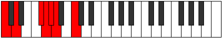 | [midi](ModeCNaturalIonothimic.mid) [ogg](ModeCNaturalIonothimic.ogg) |
| [967](https://ianring.com/musictheory/scales/967) | [Aeolacrian](ScaleAeolacrian.md) | [Aeolanian](ModeAeolanian.md) | C, Db, Ebb, F#, G, **Ab**, **Bbb**, C |  | [midi](ModeCNaturalAeolanian.mid) [ogg](ModeCNaturalAeolanian.ogg) |
| [969](https://ianring.com/musictheory/scales/969) | [Epynimic](ScaleEpynimic.md) | [Ionogimic](ModeIonogimic.md) | C, **D#**, **E##**, **F##**, G#, **A**, C |  | [midi](ModeCNaturalIonogimic.mid) [ogg](ModeCNaturalIonogimic.ogg) |
| [971](https://ianring.com/musictheory/scales/971) | [Ranian](ScaleRanian.md) | [Ladian](ModeLadian.md) | C, Db, **Eb**, F#, **G**, Ab, **Bbb**, C |  | [midi](ModeCNaturalLadian.mid) [ogg](ModeCNaturalLadian.ogg) |
| [973](https://ianring.com/musictheory/scales/973) | [Katocrian](ScaleKatocrian.md) | [Phryptian](ModePhryptian.md) | C, D, **Eb**, **F#**, G, Ab, **Bbb**, C |  | [midi](ModeCNaturalPhryptian.mid) [ogg](ModeCNaturalPhryptian.ogg) |
| [975](https://ianring.com/musictheory/scales/975) | [Sydyllic](ScaleSydyllic.md) | [Katogyllic](ModeKatogyllic.md) | C, C#, D, **D#**, F#, G, G#, **A**, C |  | [midi](ModeCNaturalKatogyllic.mid) [ogg](ModeCNaturalKatogyllic.ogg) |
| [977](https://ianring.com/musictheory/scales/977) | [Kocrimic](ScaleKocrimic.md) | [Kocrimic](ModeKocrimic.md) | C, **D##**, **E##**, **F##**, **G#**, A, C |  | [midi](ModeCNaturalKocrimic.mid) [ogg](ModeCNaturalKocrimic.ogg) |
| [979](https://ianring.com/musictheory/scales/979) | [Laptian](ScaleLaptian.md) | [Thogian](ModeThogian.md) | C, Db, **E**, F#, **G**, **Ab**, Bbb, C |  | [midi](ModeCNaturalThogian.mid) [ogg](ModeCNaturalThogian.ogg) |
| [981](https://ianring.com/musictheory/scales/981) | [Phraptian](ScalePhraptian.md) | [Bacrian](ModeBacrian.md) | C, D, **E**, **F#**, G, **Ab**, Bbb, C |  | [midi](ModeCNaturalBacrian.mid) [ogg](ModeCNaturalBacrian.ogg) |
| [983](https://ianring.com/musictheory/scales/983) | [Aeracryllic](ScaleAeracryllic.md) | [Epygyllic](ModeEpygyllic.md) | C, C#, D, **E**, F#, G, **G#**, A, C |  | [midi](ModeCNaturalEpygyllic.mid) [ogg](ModeCNaturalEpygyllic.ogg) |
| [985](https://ianring.com/musictheory/scales/985) | [Epagian](ScaleEpagian.md) | [Raptian](ModeRaptian.md) | C, **D#**, **E**, **F#**, **G**, Ab, Bbb, C |  | [midi](ModeCNaturalRaptian.mid) [ogg](ModeCNaturalRaptian.ogg) |
| [987](https://ianring.com/musictheory/scales/987) | [Maptyllic](ScaleMaptyllic.md) | [Aeraptyllic](ModeAeraptyllic.md) | C, C#, **D#**, **E**, F#, **G**, G#, A, C |  | [midi](ModeCNaturalAeraptyllic.mid) [ogg](ModeCNaturalAeraptyllic.ogg) |
| [989](https://ianring.com/musictheory/scales/989) | [Zoryllic](ScaleZoryllic.md) | [Phrolyllic](ModePhrolyllic.md) | C, D, **D#**, **E**, **F#**, G, G#, A, C |  | [midi](ModeCNaturalPhrolyllic.mid) [ogg](ModeCNaturalPhrolyllic.ogg) |
| [991](https://ianring.com/musictheory/scales/991) | [Dycrygic](ScaleDycrygic.md) | [Aeolygic](ModeAeolygic.md) | C, C#, D, **D#**, **E**, F#, G, G#, A, C |  | [midi](ModeCNaturalAeolygic.mid) [ogg](ModeCNaturalAeolygic.ogg) |
| [995](https://ianring.com/musictheory/scales/995) | [Thycrian](ScaleThycrian.md) | [Phrathian](ModePhrathian.md) | C, Db, E#, F#, **G**, **Ab**, **Bbb**, C |  | [midi](ModeCNaturalPhrathian.mid) [ogg](ModeCNaturalPhrathian.ogg) |
| [997](https://ianring.com/musictheory/scales/997) | [Morian](ScaleMorian.md) | [Rycrian](ModeRycrian.md) | C, D, E#, **F#**, G, **Ab**, **Bbb**, C |  | [midi](ModeCNaturalRycrian.mid) [ogg](ModeCNaturalRycrian.ogg) |
| [999](https://ianring.com/musictheory/scales/999) | [Locryllic](ScaleLocryllic.md) | [Bylyllic](ModeBylyllic.md) | C, C#, D, F, F#, G, **G#**, **A**, C |  | [midi](ModeCNaturalBylyllic.mid) [ogg](ModeCNaturalBylyllic.ogg) |
| [1001](https://ianring.com/musictheory/scales/1001) | [Bonian](ScaleBonian.md) | [Badian](ModeBadian.md) | C, **D#**, E#, **F#**, **G**, Ab, **Bbb**, C |  | [midi](ModeCNaturalBadian.mid) [ogg](ModeCNaturalBadian.ogg) |
| [1003](https://ianring.com/musictheory/scales/1003) | [Aeolothyllic](ScaleAeolothyllic.md) | [Ionyryllic](ModeIonyryllic.md) | C, C#, **D#**, F, F#, **G**, G#, **A**, C |  | [midi](ModeCNaturalIonyryllic.mid) [ogg](ModeCNaturalIonyryllic.ogg) |
| [1005](https://ianring.com/musictheory/scales/1005) | [Lydyllic](ScaleLydyllic.md) | [Radyllic](ModeRadyllic.md) | C, D, **D#**, F, **F#**, G, G#, **A**, C |  | [midi](ModeCNaturalRadyllic.mid) [ogg](ModeCNaturalRadyllic.ogg) |
| [1007](https://ianring.com/musictheory/scales/1007) | [Mixolydygic](ScaleMixolydygic.md) | [Ionycrygic](ModeIonycrygic.md) | C, C#, D, **D#**, F, F#, G, G#, **A**, C |  | [midi](ModeCNaturalIonycrygic.mid) [ogg](ModeCNaturalIonycrygic.ogg) |
| [1009](https://ianring.com/musictheory/scales/1009) | [Katyptian](ScaleKatyptian.md) | [Katyptian](ModeKatyptian.md) | C, **D##**, E#, **F#**, **G**, **Ab**, Bbb, C |  | [midi](ModeCNaturalKatyptian.mid) [ogg](ModeCNaturalKatyptian.ogg) |
| [1011](https://ianring.com/musictheory/scales/1011) | [Ioniptyllic](ScaleIoniptyllic.md) | [Kycryllic](ModeKycryllic.md) | C, C#, **E**, F, F#, **G**, **G#**, A, C |  | [midi](ModeCNaturalKycryllic.mid) [ogg](ModeCNaturalKycryllic.ogg) |
| [1013](https://ianring.com/musictheory/scales/1013) | [Phranyllic](ScalePhranyllic.md) | [Stydyllic](ModeStydyllic.md) | C, D, **E**, F, **F#**, G, **G#**, A, C |  | [midi](ModeCNaturalStydyllic.mid) [ogg](ModeCNaturalStydyllic.ogg) |
| [1015](https://ianring.com/musictheory/scales/1015) | [Kalygic](ScaleKalygic.md) | [Ionodygic](ModeIonodygic.md) | C, C#, D, **E**, F, F#, G, **G#**, A, C |  | [midi](ModeCNaturalIonodygic.mid) [ogg](ModeCNaturalIonodygic.ogg) |
| [1017](https://ianring.com/musictheory/scales/1017) | [Zaryllic](ScaleZaryllic.md) | [Dythyllic](ModeDythyllic.md) | C, **D#**, **E**, F, **F#**, **G**, G#, A, C | 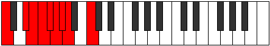 | [midi](ModeCNaturalDythyllic.mid) [ogg](ModeCNaturalDythyllic.ogg) |
| [1019](https://ianring.com/musictheory/scales/1019) | [Phrygic](ScalePhrygic.md) | [Aeranygic](ModeAeranygic.md) | C, C#, **D#**, **E**, F, F#, **G**, G#, A, C |  | [midi](ModeCNaturalAeranygic.mid) [ogg](ModeCNaturalAeranygic.ogg) |
| [1021](https://ianring.com/musictheory/scales/1021) | [Sathygic](ScaleSathygic.md) | [Ladygic](ModeLadygic.md) | C, D, **D#**, **E**, F, **F#**, G, G#, A, C |  | [midi](ModeCNaturalLadygic.mid) [ogg](ModeCNaturalLadygic.ogg) |
| [1023](https://ianring.com/musictheory/scales/1023) | [Katoryllian](ScaleKatoryllian.md) | [Dodyllian](ModeDodyllian.md) | C, C#, D, **D#**, **E**, F, F#, G, G#, A, C |  | [midi](ModeCNaturalDodyllian.mid) [ogg](ModeCNaturalDodyllian.ogg) |
| [1093](https://ianring.com/musictheory/scales/1093) | [Aeolic](ScaleAeolic.md) | [Lydic](ModeLydic.md) | **C**, **D**, **F#**, **A#**, **C** | 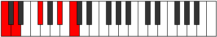 | [midi](ModeCNaturalLydic.mid) [ogg](ModeCNaturalLydic.ogg) |
| [1095](https://ianring.com/musictheory/scales/1095) | [Zylitonic](ScaleZylitonic.md) | [Phrythitonic](ModePhrythitonic.md) | **C**, **C#**, **D**, F#, **A#**, **C** |  | [midi](ModeCNaturalPhrythitonic.mid) [ogg](ModeCNaturalPhrythitonic.ogg) |
| [1097](https://ianring.com/musictheory/scales/1097) | [Saric](ScaleSaric.md) | [Aeraphic](ModeAeraphic.md) | **C**, D#, **F#**, **A#**, **C** |  | [midi](ModeCNaturalAeraphic.mid) [ogg](ModeCNaturalAeraphic.ogg) |
| [1099](https://ianring.com/musictheory/scales/1099) | [Aeolacritonic](ScaleAeolacritonic.md) | [Dyritonic](ModeDyritonic.md) | **C**, **C#**, D#, F#, **A#**, **C** |  | [midi](ModeCNaturalDyritonic.mid) [ogg](ModeCNaturalDyritonic.ogg) |
| [1101](https://ianring.com/musictheory/scales/1101) | [Aerynitonic](ScaleAerynitonic.md) | [Stothitonic](ModeStothitonic.md) | **C**, **D**, D#, **F#**, **A#**, **C** |  | [midi](ModeCNaturalStothitonic.mid) [ogg](ModeCNaturalStothitonic.ogg) |
| [1103](https://ianring.com/musictheory/scales/1103) | [Kocrimic](ScaleKocrimic.md) | [Lynimic](ModeLynimic.md) | **C**, **Db**, **Ebb**, Fbb, Gb, **A#**, **C** |  | [midi](ModeCNaturalLynimic.mid) [ogg](ModeCNaturalLynimic.ogg) |
| [1105](https://ianring.com/musictheory/scales/1105) | [Stathic](ScaleStathic.md) | [Stathic](ModeStathic.md) | **C**, **E**, **F#**, **A#**, **C** |  | [midi](ModeCNaturalStathic.mid) [ogg](ModeCNaturalStathic.ogg) |
| [1107](https://ianring.com/musictheory/scales/1107) | [Ionoditonic](ScaleIonoditonic.md) | [Mogitonic](ModeMogitonic.md) | **C**, **C#**, **E**, F#, **A#**, **C** |  | [midi](ModeCNaturalMogitonic.mid) [ogg](ModeCNaturalMogitonic.ogg) |
| [1109](https://ianring.com/musictheory/scales/1109) | [Bolitonic](ScaleBolitonic.md) | [Kataditonic](ModeKataditonic.md) | **C**, **D**, **E**, **F#**, **A#**, **C** |  | [midi](ModeCNaturalKataditonic.mid) [ogg](ModeCNaturalKataditonic.ogg) |
| [1111](https://ianring.com/musictheory/scales/1111) | [Gacrimic](ScaleGacrimic.md) | [Sycrimic](ModeSycrimic.md) | **C**, **Db**, **Ebb**, **Fb**, Gb, **A#**, **C** |  | [midi](ModeCNaturalSycrimic.mid) [ogg](ModeCNaturalSycrimic.ogg) |
| [1113](https://ianring.com/musictheory/scales/1113) | [Phronitonic](ScalePhronitonic.md) | [Aeronitonic](ModeAeronitonic.md) | **C**, D#, **E**, **F#**, **A#**, **C** |  | [midi](ModeCNaturalAeronitonic.mid) [ogg](ModeCNaturalAeronitonic.ogg) |
| [1115](https://ianring.com/musictheory/scales/1115) | [Manimic](ScaleManimic.md) | [Locrimic](ModeLocrimic.md) | **C**, **Db**, Eb, **Fb**, Gb, **A#**, **C** |  | [midi](ModeCNaturalLocrimic.mid) [ogg](ModeCNaturalLocrimic.ogg) |
| [1117](https://ianring.com/musictheory/scales/1117) | [Dathimic](ScaleDathimic.md) | [Raptimic](ModeRaptimic.md) | **C**, **D**, Eb, **Fb**, **Gb**, **A#**, **C** |  | [midi](ModeCNaturalRaptimic.mid) [ogg](ModeCNaturalRaptimic.ogg) |
| [1119](https://ianring.com/musictheory/scales/1119) | [Gydian](ScaleGydian.md) | [Rarian](ModeRarian.md) | **C**, **Db**, **Ebb**, Fbb, **Gbbb**, Abbb, **Bb**, **C** |  | [midi](ModeCNaturalRarian.mid) [ogg](ModeCNaturalRarian.ogg) |
| [1123](https://ianring.com/musictheory/scales/1123) | [Zolitonic](ScaleZolitonic.md) | [Lanitonic](ModeLanitonic.md) | **C**, **C#**, F, F#, A#, **C** |  | [midi](ModeCNaturalLanitonic.mid) [ogg](ModeCNaturalLanitonic.ogg) |
| [1125](https://ianring.com/musictheory/scales/1125) | [Aeolanitonic](ScaleAeolanitonic.md) | [Ionaritonic](ModeIonaritonic.md) | **C**, **D**, F, **F#**, A#, **C** |  | [midi](ModeCNaturalIonaritonic.mid) [ogg](ModeCNaturalIonaritonic.ogg) |
| [1127](https://ianring.com/musictheory/scales/1127) | [Aerycrimic](ScaleAerycrimic.md) | [Eparimic](ModeEparimic.md) | **C**, **Db**, **Ebb**, F, Gb, A#, **C** |  | [midi](ModeCNaturalEparimic.mid) [ogg](ModeCNaturalEparimic.ogg) |
| [1129](https://ianring.com/musictheory/scales/1129) | [Gathitonic](ScaleGathitonic.md) | [Phrynitonic](ModePhrynitonic.md) | **C**, D#, F, **F#**, A#, **C** |  | [midi](ModeCNaturalPhrynitonic.mid) [ogg](ModeCNaturalPhrynitonic.ogg) |
| [1131](https://ianring.com/musictheory/scales/1131) | [Dyrimic](ScaleDyrimic.md) | [Thocrimic](ModeThocrimic.md) | **C**, **Db**, Eb, F, Gb, A#, **C** |  | [midi](ModeCNaturalThocrimic.mid) [ogg](ModeCNaturalThocrimic.ogg) |
| [1133](https://ianring.com/musictheory/scales/1133) | [Rycrimic](ScaleRycrimic.md) | [Stycrimic](ModeStycrimic.md) | **C**, **D**, Eb, F, **Gb**, A#, **C** |  | [midi](ModeCNaturalStycrimic.mid) [ogg](ModeCNaturalStycrimic.ogg) |
| [1135](https://ianring.com/musictheory/scales/1135) | [Epycrian](ScaleEpycrian.md) | [Katolian](ModeKatolian.md) | **C**, **Db**, **Ebb**, Fbb, Gbb, Abbb, Bb, **C** |  | [midi](ModeCNaturalKatolian.mid) [ogg](ModeCNaturalKatolian.ogg) |
| [1137](https://ianring.com/musictheory/scales/1137) | [Zathitonic](ScaleZathitonic.md) | [Stonitonic](ModeStonitonic.md) | **C**, **E**, F, **F#**, A#, **C** |  | [midi](ModeCNaturalStonitonic.mid) [ogg](ModeCNaturalStonitonic.ogg) |
| [1139](https://ianring.com/musictheory/scales/1139) | [Katythimic](ScaleKatythimic.md) | [Aerygimic](ModeAerygimic.md) | **C**, **Db**, **E**, F, Gb, A#, **C** |  | [midi](ModeCNaturalAerygimic.mid) [ogg](ModeCNaturalAerygimic.ogg) |
| [1141](https://ianring.com/musictheory/scales/1141) | [Katanimic](ScaleKatanimic.md) | [Rynimic](ModeRynimic.md) | **C**, **D**, **E**, F, **Gb**, A#, **C** |  | [midi](ModeCNaturalRynimic.mid) [ogg](ModeCNaturalRynimic.ogg) |
| [1143](https://ianring.com/musictheory/scales/1143) | [Katogian](ScaleKatogian.md) | [Styrian](ModeStyrian.md) | **C**, **Db**, **Ebb**, **Fb**, Gbb, Abbb, Bb, **C** |  | [midi](ModeCNaturalStyrian.mid) [ogg](ModeCNaturalStyrian.ogg) |
| [1145](https://ianring.com/musictheory/scales/1145) | [Stalimic](ScaleStalimic.md) | [Zygimic](ModeZygimic.md) | **C**, D#, **E**, F, **Gb**, A#, **C** |  | [midi](ModeCNaturalZygimic.mid) [ogg](ModeCNaturalZygimic.ogg) |
| [1147](https://ianring.com/musictheory/scales/1147) | [Aeopian](ScaleAeopian.md) | [Epynian](ModeEpynian.md) | **C**, **Db**, Eb, **Fb**, Gbb, Abbb, Bb, **C** |  | [midi](ModeCNaturalEpynian.mid) [ogg](ModeCNaturalEpynian.ogg) |
| [1149](https://ianring.com/musictheory/scales/1149) | [Pythian](ScalePythian.md) | [Bydian](ModeBydian.md) | **C**, **D**, Eb, **Fb**, Gbb, **Abbb**, Bb, **C** |  | [midi](ModeCNaturalBydian.mid) [ogg](ModeCNaturalBydian.ogg) |
| [1151](https://ianring.com/musictheory/scales/1151) | [Stycryllic](ScaleStycryllic.md) | [Mythyllic](ModeMythyllic.md) | **C**, **C#**, **D**, D#, **E**, F, F#, A#, **C** |  | [midi](ModeCNaturalMythyllic.mid) [ogg](ModeCNaturalMythyllic.ogg) |
| [1161](https://ianring.com/musictheory/scales/1161) | [Epathic](ScaleEpathic.md) | [Eporic](ModeEporic.md) | C, D#, **G**, **A#**, C |  | [midi](ModeCNaturalEporic.mid) [ogg](ModeCNaturalEporic.ogg) |
| [1163](https://ianring.com/musictheory/scales/1163) | [Ionaditonic](ScaleIonaditonic.md) | [Pagitonic](ModePagitonic.md) | C, **C#**, D#, **G**, **A#**, C |  | [midi](ModeCNaturalPagitonic.mid) [ogg](ModeCNaturalPagitonic.ogg) |
| [1165](https://ianring.com/musictheory/scales/1165) | [Magitonic](ScaleMagitonic.md) | [Gycritonic](ModeGycritonic.md) | C, **D**, D#, G, **A#**, C |  | [midi](ModeCNaturalGycritonic.mid) [ogg](ModeCNaturalGycritonic.ogg) |
| [1167](https://ianring.com/musictheory/scales/1167) | [Starimic](ScaleStarimic.md) | [Aerodimic](ModeAerodimic.md) | C, **Db**, **Ebb**, Fbb, G, **A#**, C |  | [midi](ModeCNaturalAerodimic.mid) [ogg](ModeCNaturalAerodimic.ogg) |
| [1169](https://ianring.com/musictheory/scales/1169) | [Daric](ScaleDaric.md) | [Daric](ModeDaric.md) | C, **E**, **G**, **A#**, C |  | [midi](ModeCNaturalDaric.mid) [ogg](ModeCNaturalDaric.ogg) |
| [1171](https://ianring.com/musictheory/scales/1171) | [Mixitonic](ScaleMixitonic.md) | [Loptitonic](ModeLoptitonic.md) | C, **C#**, **E**, **G**, **A#**, C |  | [midi](ModeCNaturalLoptitonic.mid) [ogg](ModeCNaturalLoptitonic.ogg) |
| [1173](https://ianring.com/musictheory/scales/1173) | [Kataritonic](ScaleKataritonic.md) | [Phropitonic](ModePhropitonic.md) | C, **D**, **E**, G, **A#**, C |  | [midi](ModeCNaturalPhropitonic.mid) [ogg](ModeCNaturalPhropitonic.ogg) |
| [1175](https://ianring.com/musictheory/scales/1175) | [Thagimic](ScaleThagimic.md) | [Epycrimic](ModeEpycrimic.md) | C, **Db**, **Ebb**, **Fb**, G, **A#**, C |  | [midi](ModeCNaturalEpycrimic.mid) [ogg](ModeCNaturalEpycrimic.ogg) |
| [1177](https://ianring.com/musictheory/scales/1177) | [Thoditonic](ScaleThoditonic.md) | [Garitonic](ModeGaritonic.md) | C, D#, **E**, **G**, **A#**, C |  | [midi](ModeCNaturalGaritonic.mid) [ogg](ModeCNaturalGaritonic.ogg) |
| [1179](https://ianring.com/musictheory/scales/1179) | [Thoptimic](ScaleThoptimic.md) | [Sonimic](ModeSonimic.md) | C, **Db**, Eb, **Fb**, **G**, **A#**, C |  | [midi](ModeCNaturalSonimic.mid) [ogg](ModeCNaturalSonimic.ogg) |
| [1181](https://ianring.com/musictheory/scales/1181) | [Palimic](ScalePalimic.md) | [Katagimic](ModeKatagimic.md) | C, **D**, Eb, **Fb**, G, **A#**, C |  | [midi](ModeCNaturalKatagimic.mid) [ogg](ModeCNaturalKatagimic.ogg) |
| [1183](https://ianring.com/musictheory/scales/1183) | [Bonian](ScaleBonian.md) | [Sadian](ModeSadian.md) | C, **Db**, **Ebb**, Fbb, **Gbbb**, Abb, **Bb**, C |  | [midi](ModeCNaturalSadian.mid) [ogg](ModeCNaturalSadian.ogg) |
| [1187](https://ianring.com/musictheory/scales/1187) | [Gathitonic](ScaleGathitonic.md) | [Thalitonic](ModeThalitonic.md) | C, **C#**, F, **G**, A#, C | 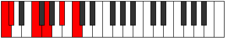 | [midi](ModeCNaturalThalitonic.mid) [ogg](ModeCNaturalThalitonic.ogg) |
| [1189](https://ianring.com/musictheory/scales/1189) | [Epathitonic](ScaleEpathitonic.md) | [Thaptitonic](ModeThaptitonic.md) | C, **D**, F, G, A#, C |  | [midi](ModeCNaturalThaptitonic.mid) [ogg](ModeCNaturalThaptitonic.ogg) |
| [1191](https://ianring.com/musictheory/scales/1191) | [Mixolimic](ScaleMixolimic.md) | [Pyrimic](ModePyrimic.md) | C, **Db**, **Ebb**, F, G, A#, C |  | [midi](ModeCNaturalPyrimic.mid) [ogg](ModeCNaturalPyrimic.ogg) |
| [1193](https://ianring.com/musictheory/scales/1193) | [Epathitonic](ScaleEpathitonic.md) | [Rocritonic](ModeRocritonic.md) | C, D#, F, **G**, A#, C |  | [midi](ModeCNaturalRocritonic.mid) [ogg](ModeCNaturalRocritonic.ogg) |
| [1195](https://ianring.com/musictheory/scales/1195) | [Phracrimic](ScalePhracrimic.md) | [Sarimic](ModeSarimic.md) | C, **Db**, Eb, F, **G**, A#, C |  | [midi](ModeCNaturalSarimic.mid) [ogg](ModeCNaturalSarimic.ogg) |
| [1197](https://ianring.com/musictheory/scales/1197) | [Epathimic](ScaleEpathimic.md) | [Rocrimic](ModeRocrimic.md) | C, **D**, Eb, F, G, A#, C |  | [midi](ModeCNaturalRocrimic.mid) [ogg](ModeCNaturalRocrimic.ogg) |
| [1199](https://ianring.com/musictheory/scales/1199) | [Stathian](ScaleStathian.md) | [Magian](ModeMagian.md) | C, **Db**, **Ebb**, Fbb, Gbb, Abb, Bb, C |  | [midi](ModeCNaturalMagian.mid) [ogg](ModeCNaturalMagian.ogg) |
| [1201](https://ianring.com/musictheory/scales/1201) | [Aeracritonic](ScaleAeracritonic.md) | [Aeracritonic](ModeAeracritonic.md) | C, **E**, F, **G**, A#, C |  | [midi](ModeCNaturalAeracritonic.mid) [ogg](ModeCNaturalAeracritonic.ogg) |
| [1203](https://ianring.com/musictheory/scales/1203) | [Bocrimic](ScaleBocrimic.md) | [Pagimic](ModePagimic.md) | C, **Db**, **E**, F, **G**, A#, C |  | [midi](ModeCNaturalPagimic.mid) [ogg](ModeCNaturalPagimic.ogg) |
| [1205](https://ianring.com/musictheory/scales/1205) | [Darmic](ScaleDarmic.md) | [Ionycrimic](ModeIonycrimic.md) | C, **D**, **E**, F, G, A#, C |  | [midi](ModeCNaturalIonycrimic.mid) [ogg](ModeCNaturalIonycrimic.ogg) |
| [1207](https://ianring.com/musictheory/scales/1207) | [Rythian](ScaleRythian.md) | [Aeoloptian](ModeAeoloptian.md) | C, **Db**, **Ebb**, **Fb**, Gbb, Abb, Bb, C |  | [midi](ModeCNaturalAeoloptian.mid) [ogg](ModeCNaturalAeoloptian.ogg) |
| [1209](https://ianring.com/musictheory/scales/1209) | [Ionacrimic](ScaleIonacrimic.md) | [Ionynimic](ModeIonynimic.md) | C, D#, **E**, F, **G**, A#, C |  | [midi](ModeCNaturalIonynimic.mid) [ogg](ModeCNaturalIonynimic.ogg) |
| [1211](https://ianring.com/musictheory/scales/1211) | [Ionopian](ScaleIonopian.md) | [Zadian](ModeZadian.md) | C, **Db**, Eb, **Fb**, Gbb, **Abb**, Bb, C |  | [midi](ModeCNaturalZadian.mid) [ogg](ModeCNaturalZadian.ogg) |
| [1213](https://ianring.com/musictheory/scales/1213) | [Soptian](ScaleSoptian.md) | [Gyrian](ModeGyrian.md) | C, **D**, Eb, **Fb**, Gbb, Abb, Bb, C |  | [midi](ModeCNaturalGyrian.mid) [ogg](ModeCNaturalGyrian.ogg) |
| [1215](https://ianring.com/musictheory/scales/1215) | [Mixolydyllic](ScaleMixolydyllic.md) | [Aeolanyllic](ModeAeolanyllic.md) | C, **C#**, **D**, D#, **E**, F, G, A#, C |  | [midi](ModeCNaturalAeolanyllic.mid) [ogg](ModeCNaturalAeolanyllic.ogg) |
| [1221](https://ianring.com/musictheory/scales/1221) | [Epygitonic](ScaleEpygitonic.md) | [Epyritonic](ModeEpyritonic.md) | C, **D**, **F#**, G, **A#**, C |  | [midi](ModeCNaturalEpyritonic.mid) [ogg](ModeCNaturalEpyritonic.ogg) |
| [1223](https://ianring.com/musictheory/scales/1223) | [Phralimic](ScalePhralimic.md) | [Phryptimic](ModePhryptimic.md) | C, **Db**, **Ebb**, F#, G, **A#**, C |  | [midi](ModeCNaturalPhryptimic.mid) [ogg](ModeCNaturalPhryptimic.ogg) |
| [1225](https://ianring.com/musictheory/scales/1225) | [Lyditonic](ScaleLyditonic.md) | [Lyditonic](ModeLyditonic.md) | C, D#, **F#**, **G**, **A#**, C |  | [midi](ModeCNaturalLyditonic.mid) [ogg](ModeCNaturalLyditonic.ogg) |
| [1227](https://ianring.com/musictheory/scales/1227) | [Zacrimic](ScaleZacrimic.md) | [Thacrimic](ModeThacrimic.md) | C, **Db**, Eb, F#, **G**, **A#**, C |  | [midi](ModeCNaturalThacrimic.mid) [ogg](ModeCNaturalThacrimic.ogg) |
| [1229](https://ianring.com/musictheory/scales/1229) | [Mothimic](ScaleMothimic.md) | [Ragimic](ModeRagimic.md) | C, **D**, Eb, **F#**, G, **A#**, C | 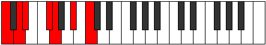 | [midi](ModeCNaturalRagimic.mid) [ogg](ModeCNaturalRagimic.ogg) |
| [1231](https://ianring.com/musictheory/scales/1231) | [Laptian](ScaleLaptian.md) | [Logian](ModeLogian.md) | C, **Db**, **Ebb**, Fbb, Gb, Abb, **Bb**, C |  | [midi](ModeCNaturalLogian.mid) [ogg](ModeCNaturalLogian.ogg) |
| [1233](https://ianring.com/musictheory/scales/1233) | [Ionoditonic](ScaleIonoditonic.md) | [Ionoditonic](ModeIonoditonic.md) | C, **E**, **F#**, **G**, **A#**, C |  | [midi](ModeCNaturalIonoditonic.mid) [ogg](ModeCNaturalIonoditonic.ogg) |
| [1235](https://ianring.com/musictheory/scales/1235) | [Aeradimic](ScaleAeradimic.md) | [Stylimic](ModeStylimic.md) | C, **Db**, **E**, F#, **G**, **A#**, C |  | [midi](ModeCNaturalStylimic.mid) [ogg](ModeCNaturalStylimic.ogg) |
| [1237](https://ianring.com/musictheory/scales/1237) | [Aeragimic](ScaleAeragimic.md) | [Salimic](ModeSalimic.md) | C, **D**, **E**, **F#**, G, **A#**, C |  | [midi](ModeCNaturalSalimic.mid) [ogg](ModeCNaturalSalimic.ogg) |
| [1239](https://ianring.com/musictheory/scales/1239) | [Eporian](ScaleEporian.md) | [Epaptian](ModeEpaptian.md) | C, **Db**, **Ebb**, **Fb**, Gb, Abb, **Bb**, C |  | [midi](ModeCNaturalEpaptian.mid) [ogg](ModeCNaturalEpaptian.ogg) |
| [1241](https://ianring.com/musictheory/scales/1241) | [Stythimic](ScaleStythimic.md) | [Pygimic](ModePygimic.md) | C, D#, **E**, **F#**, **G**, **A#**, C |  | [midi](ModeCNaturalPygimic.mid) [ogg](ModeCNaturalPygimic.ogg) |
| [1243](https://ianring.com/musictheory/scales/1243) | [Pogian](ScalePogian.md) | [Epylian](ModeEpylian.md) | C, **Db**, Eb, **Fb**, Gb, **Abb**, **Bb**, C |  | [midi](ModeCNaturalEpylian.mid) [ogg](ModeCNaturalEpylian.ogg) |
| [1245](https://ianring.com/musictheory/scales/1245) | [Epacrian](ScaleEpacrian.md) | [Lathian](ModeLathian.md) | C, **D**, Eb, **Fb**, **Gb**, Abb, **Bb**, C |  | [midi](ModeCNaturalLathian.mid) [ogg](ModeCNaturalLathian.ogg) |
| [1247](https://ianring.com/musictheory/scales/1247) | [Aeronyllic](ScaleAeronyllic.md) | [Mygyllic](ModeMygyllic.md) | C, **C#**, **D**, D#, **E**, F#, G, **A#**, C |  | [midi](ModeCNaturalMygyllic.mid) [ogg](ModeCNaturalMygyllic.ogg) |
| [1251](https://ianring.com/musictheory/scales/1251) | [Mythimic](ScaleMythimic.md) | [Sylimic](ModeSylimic.md) | C, **Db**, E#, F#, **G**, A#, C |  | [midi](ModeCNaturalSylimic.mid) [ogg](ModeCNaturalSylimic.ogg) |
| [1253](https://ianring.com/musictheory/scales/1253) | [Dalimic](ScaleDalimic.md) | [Zolimic](ModeZolimic.md) | C, **D**, E#, **F#**, G, A#, C |  | [midi](ModeCNaturalZolimic.mid) [ogg](ModeCNaturalZolimic.ogg) |
| [1255](https://ianring.com/musictheory/scales/1255) | [Epathian](ScaleEpathian.md) | [Sogian](ModeSogian.md) | C, **Db**, **Ebb**, F, Gb, Abb, Bb, C |  | [midi](ModeCNaturalSogian.mid) [ogg](ModeCNaturalSogian.ogg) |
| [1257](https://ianring.com/musictheory/scales/1257) | [Mixolimic](ScaleMixolimic.md) | [Aeolyphimic](ModeAeolyphimic.md) | C, D#, E#, **F#**, **G**, A#, C |  | [midi](ModeCNaturalAeolyphimic.mid) [ogg](ModeCNaturalAeolyphimic.ogg) |
| [1259](https://ianring.com/musictheory/scales/1259) | [Thonian](ScaleThonian.md) | [Stadian](ModeStadian.md) | C, **Db**, Eb, F, Gb, **Abb**, Bb, C |  | [midi](ModeCNaturalStadian.mid) [ogg](ModeCNaturalStadian.ogg) |
| [1261](https://ianring.com/musictheory/scales/1261) | [Phrolian](ScalePhrolian.md) | [Aeodian](ModeAeodian.md) | C, **D**, Eb, F, **Gb**, Abb, Bb, C | 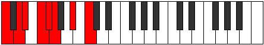 | [midi](ModeCNaturalAeodian.mid) [ogg](ModeCNaturalAeodian.ogg) |
| [1263](https://ianring.com/musictheory/scales/1263) | [Pothyllic](ScalePothyllic.md) | [Stynyllic](ModeStynyllic.md) | C, **C#**, **D**, D#, F, F#, G, A#, C |  | [midi](ModeCNaturalStynyllic.mid) [ogg](ModeCNaturalStynyllic.ogg) |
| [1265](https://ianring.com/musictheory/scales/1265) | [Pynimic](ScalePynimic.md) | [Pynimic](ModePynimic.md) | C, **D##**, E#, **F#**, **G**, A#, C |  | [midi](ModeCNaturalPynimic.mid) [ogg](ModeCNaturalPynimic.ogg) |
| [1267](https://ianring.com/musictheory/scales/1267) | [Katocrian](ScaleKatocrian.md) | [Katynian](ModeKatynian.md) | C, **Db**, **E**, F, Gb, **Abb**, Bb, C |  | [midi](ModeCNaturalKatynian.mid) [ogg](ModeCNaturalKatynian.ogg) |
| [1269](https://ianring.com/musictheory/scales/1269) | [Phraptian](ScalePhraptian.md) | [Katythian](ModeKatythian.md) | C, **D**, **E**, F, **Gb**, Abb, Bb, C |  | [midi](ModeCNaturalKatythian.mid) [ogg](ModeCNaturalKatythian.ogg) |
| [1271](https://ianring.com/musictheory/scales/1271) | [Zoryllic](ScaleZoryllic.md) | [Kolyllic](ModeKolyllic.md) | C, **C#**, **D**, **E**, F, F#, G, A#, C |  | [midi](ModeCNaturalKolyllic.mid) [ogg](ModeCNaturalKolyllic.ogg) |
| [1273](https://ianring.com/musictheory/scales/1273) | [Morian](ScaleMorian.md) | [Ronian](ModeRonian.md) | C, D#, **E**, F, **Gb**, **Abb**, Bb, C |  | [midi](ModeCNaturalRonian.mid) [ogg](ModeCNaturalRonian.ogg) |
| [1275](https://ianring.com/musictheory/scales/1275) | [Lydyllic](ScaleLydyllic.md) | [Stagyllic](ModeStagyllic.md) | C, **C#**, D#, **E**, F, F#, **G**, A#, C |  | [midi](ModeCNaturalStagyllic.mid) [ogg](ModeCNaturalStagyllic.ogg) |
| [1277](https://ianring.com/musictheory/scales/1277) | [Phranyllic](ScalePhranyllic.md) | [Zadyllic](ModeZadyllic.md) | C, **D**, D#, **E**, F, **F#**, G, A#, C |  | [midi](ModeCNaturalZadyllic.mid) [ogg](ModeCNaturalZadyllic.ogg) |
| [1279](https://ianring.com/musictheory/scales/1279) | [Sathygic](ScaleSathygic.md) | [Sarygic](ModeSarygic.md) | C, **C#**, **D**, D#, **E**, F, F#, G, A#, C |  | [midi](ModeCNaturalSarygic.mid) [ogg](ModeCNaturalSarygic.ogg) |
| [1297](https://ianring.com/musictheory/scales/1297) | [Aeolic](ScaleAeolic.md) | [Aeolic](ModeAeolic.md) | **C**, **E**, **G#**, **A#**, **C** | 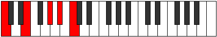 | [midi](ModeCNaturalAeolic.mid) [ogg](ModeCNaturalAeolic.ogg) |
| [1299](https://ianring.com/musictheory/scales/1299) | [Aerynitonic](ScaleAerynitonic.md) | [Aerophitonic](ModeAerophitonic.md) | **C**, C#, **E**, **G#**, **A#**, **C** |  | [midi](ModeCNaturalAerophitonic.mid) [ogg](ModeCNaturalAerophitonic.ogg) |
| [1301](https://ianring.com/musictheory/scales/1301) | [Bolitonic](ScaleBolitonic.md) | [Koditonic](ModeKoditonic.md) | **C**, **D**, **E**, **G#**, **A#**, **C** |  | [midi](ModeCNaturalKoditonic.mid) [ogg](ModeCNaturalKoditonic.ogg) |
| [1303](https://ianring.com/musictheory/scales/1303) | [Dathimic](ScaleDathimic.md) | [Epolimic](ModeEpolimic.md) | **C**, Db, **Ebb**, **Fb**, **G#**, **A#**, **C** |  | [midi](ModeCNaturalEpolimic.mid) [ogg](ModeCNaturalEpolimic.ogg) |
| [1305](https://ianring.com/musictheory/scales/1305) | [Aeolanitonic](ScaleAeolanitonic.md) | [Dynitonic](ModeDynitonic.md) | **C**, D#, **E**, G#, **A#**, **C** |  | [midi](ModeCNaturalDynitonic.mid) [ogg](ModeCNaturalDynitonic.ogg) |
| [1307](https://ianring.com/musictheory/scales/1307) | [Rycrimic](ScaleRycrimic.md) | [Katorimic](ModeKatorimic.md) | **C**, Db, Eb, **Fb**, G#, **A#**, **C** |  | [midi](ModeCNaturalKatorimic.mid) [ogg](ModeCNaturalKatorimic.ogg) |
| [1309](https://ianring.com/musictheory/scales/1309) | [Katanimic](ScaleKatanimic.md) | [Pogimic](ModePogimic.md) | **C**, **D**, Eb, **Fb**, G#, **A#**, **C** |  | [midi](ModeCNaturalPogimic.mid) [ogg](ModeCNaturalPogimic.ogg) |
| [1311](https://ianring.com/musictheory/scales/1311) | [Pythian](ScalePythian.md) | [Bynian](ModeBynian.md) | **C**, Db, **Ebb**, Fbb, **Gbbb**, Ab, **Bb**, **C** |  | [midi](ModeCNaturalBynian.mid) [ogg](ModeCNaturalBynian.ogg) |
| [1315](https://ianring.com/musictheory/scales/1315) | [Magitonic](ScaleMagitonic.md) | [Pyritonic](ModePyritonic.md) | **C**, C#, F, **G#**, A#, **C** | 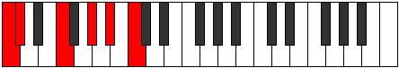 | [midi](ModeCNaturalPyritonic.mid) [ogg](ModeCNaturalPyritonic.ogg) |
| [1317](https://ianring.com/musictheory/scales/1317) | [Kataritonic](ScaleKataritonic.md) | [Staditonic](ModeStaditonic.md) | **C**, **D**, F, **G#**, A#, **C** |  | [midi](ModeCNaturalStaditonic.mid) [ogg](ModeCNaturalStaditonic.ogg) |
| [1319](https://ianring.com/musictheory/scales/1319) | [Palimic](ScalePalimic.md) | [Phronimic](ModePhronimic.md) | **C**, Db, **Ebb**, F, **G#**, A#, **C** |  | [midi](ModeCNaturalPhronimic.mid) [ogg](ModeCNaturalPhronimic.ogg) |
| [1321](https://ianring.com/musictheory/scales/1321) | [Epathitonic](ScaleEpathitonic.md) | [Epathitonic](ModeEpathitonic.md) | **C**, D#, F, G#, A#, **C** |  | [midi](ModeCNaturalEpathitonic.mid) [ogg](ModeCNaturalEpathitonic.ogg) |
| [1323](https://ianring.com/musictheory/scales/1323) | [Epathimic](ScaleEpathimic.md) | [Eporimic](ModeEporimic.md) | **C**, Db, Eb, F, G#, A#, **C** |  | [midi](ModeCNaturalEporimic.mid) [ogg](ModeCNaturalEporimic.ogg) |
| [1325](https://ianring.com/musictheory/scales/1325) | [Darmic](ScaleDarmic.md) | [Phradimic](ModePhradimic.md) | **C**, **D**, Eb, F, G#, A#, **C** |  | [midi](ModeCNaturalPhradimic.mid) [ogg](ModeCNaturalPhradimic.ogg) |
| [1327](https://ianring.com/musictheory/scales/1327) | [Soptian](ScaleSoptian.md) | [Zalian](ModeZalian.md) | **C**, Db, **Ebb**, Fbb, Gbb, Ab, Bb, **C** |  | [midi](ModeCNaturalZalian.mid) [ogg](ModeCNaturalZalian.ogg) |
| [1329](https://ianring.com/musictheory/scales/1329) | [Epygitonic](ScaleEpygitonic.md) | [Epygitonic](ModeEpygitonic.md) | **C**, **E**, F, **G#**, A#, **C** |  | [midi](ModeCNaturalEpygitonic.mid) [ogg](ModeCNaturalEpygitonic.ogg) |
| [1331](https://ianring.com/musictheory/scales/1331) | [Mothimic](ScaleMothimic.md) | [Dolimic](ModeDolimic.md) | **C**, Db, **E**, F, **G#**, A#, **C** |  | [midi](ModeCNaturalDolimic.mid) [ogg](ModeCNaturalDolimic.ogg) |
| [1333](https://ianring.com/musictheory/scales/1333) | [Aeragimic](ScaleAeragimic.md) | [Lyptimic](ModeLyptimic.md) | **C**, **D**, **E**, F, **G#**, A#, **C** |  | [midi](ModeCNaturalLyptimic.mid) [ogg](ModeCNaturalLyptimic.ogg) |
| [1335](https://ianring.com/musictheory/scales/1335) | [Epacrian](ScaleEpacrian.md) | [Aeralian](ModeAeralian.md) | **C**, Db, **Ebb**, **Fb**, Gbb, **Ab**, Bb, **C** |  | [midi](ModeCNaturalAeralian.mid) [ogg](ModeCNaturalAeralian.ogg) |
| [1337](https://ianring.com/musictheory/scales/1337) | [Dalimic](ScaleDalimic.md) | [Epogimic](ModeEpogimic.md) | **C**, D#, **E**, F, G#, A#, **C** |  | [midi](ModeCNaturalEpogimic.mid) [ogg](ModeCNaturalEpogimic.ogg) |
| [1339](https://ianring.com/musictheory/scales/1339) | [Phrolian](ScalePhrolian.md) | [Kycrian](ModeKycrian.md) | **C**, Db, Eb, **Fb**, Gbb, Ab, Bb, **C** |  | [midi](ModeCNaturalKycrian.mid) [ogg](ModeCNaturalKycrian.ogg) |
| [1341](https://ianring.com/musictheory/scales/1341) | [Phraptian](ScalePhraptian.md) | [Madian](ModeMadian.md) | **C**, **D**, Eb, **Fb**, Gbb, Ab, Bb, **C** |  | [midi](ModeCNaturalMadian.mid) [ogg](ModeCNaturalMadian.ogg) |
| [1343](https://ianring.com/musictheory/scales/1343) | [Phranyllic](ScalePhranyllic.md) | [Zalyllic](ModeZalyllic.md) | **C**, C#, **D**, D#, **E**, F, G#, A#, **C** |  | [midi](ModeCNaturalZalyllic.mid) [ogg](ModeCNaturalZalyllic.ogg) |
| [1349](https://ianring.com/musictheory/scales/1349) | [Bolitonic](ScaleBolitonic.md) | [Tholitonic](ModeTholitonic.md) | **C**, **D**, **F#**, **G#**, **A#**, **C** |  | [midi](ModeCNaturalTholitonic.mid) [ogg](ModeCNaturalTholitonic.ogg) |
| [1351](https://ianring.com/musictheory/scales/1351) | [Katanimic](ScaleKatanimic.md) | [Aeraptimic](ModeAeraptimic.md) | **C**, Db, **Ebb**, F#, **G#**, **A#**, **C** |  | [midi](ModeCNaturalAeraptimic.mid) [ogg](ModeCNaturalAeraptimic.ogg) |
| [1353](https://ianring.com/musictheory/scales/1353) | [Kataritonic](ScaleKataritonic.md) | [Kataritonic](ModeKataritonic.md) | **C**, D#, **F#**, G#, **A#**, **C** |  | [midi](ModeCNaturalKataritonic.mid) [ogg](ModeCNaturalKataritonic.ogg) |
| [1355](https://ianring.com/musictheory/scales/1355) | [Darmic](ScaleDarmic.md) | [Aeolorimic](ModeAeolorimic.md) | **C**, Db, Eb, F#, G#, **A#**, **C** |  | [midi](ModeCNaturalAeolorimic.mid) [ogg](ModeCNaturalAeolorimic.ogg) |
| [1357](https://ianring.com/musictheory/scales/1357) | [Aeragimic](ScaleAeragimic.md) | [Katonimic](ModeKatonimic.md) | **C**, **D**, Eb, **F#**, G#, **A#**, **C** |  | [midi](ModeCNaturalKatonimic.mid) [ogg](ModeCNaturalKatonimic.ogg) |
| [1359](https://ianring.com/musictheory/scales/1359) | [Phraptian](ScalePhraptian.md) | [Aerygian](ModeAerygian.md) | **C**, Db, **Ebb**, Fbb, Gb, Ab, **Bb**, **C** |  | [midi](ModeCNaturalAerygian.mid) [ogg](ModeCNaturalAerygian.ogg) |
| [1361](https://ianring.com/musictheory/scales/1361) | [Bolitonic](ScaleBolitonic.md) | [Bolitonic](ModeBolitonic.md) | **C**, **E**, **F#**, **G#**, **A#**, **C** |  | [midi](ModeCNaturalBolitonic.mid) [ogg](ModeCNaturalBolitonic.ogg) |
| [1363](https://ianring.com/musictheory/scales/1363) | [Aeragimic](ScaleAeragimic.md) | [Gygimic](ModeGygimic.md) | **C**, Db, **E**, F#, **G#**, **A#**, **C** |  | [midi](ModeCNaturalGygimic.mid) [ogg](ModeCNaturalGygimic.ogg) |
| [1365](https://ianring.com/musictheory/scales/1365) | [WholeTone](ScaleWholeTone.md) | [WholeTone](ModeWholeTone.md) | **C**, **D**, **E**, **F#**, **G#**, **A#**, **C** |  | [midi](ModeCNaturalWholeTone.mid) [ogg](ModeCNaturalWholeTone.ogg) |
| [1367](https://ianring.com/musictheory/scales/1367) | [Aeolynian](ScaleAeolynian.md) | [Pyptian](ModePyptian.md) | **C**, Db, **Ebb**, **Fb**, Gb, **Ab**, **Bb**, **C** |  | [midi](ModeCNaturalPyptian.mid) [ogg](ModeCNaturalPyptian.ogg) |
| [1369](https://ianring.com/musictheory/scales/1369) | [Boptimic](ScaleBoptimic.md) | [Boptimic](ModeBoptimic.md) | **C**, D#, **E**, **F#**, G#, **A#**, **C** |  | [midi](ModeCNaturalBoptimic.mid) [ogg](ModeCNaturalBoptimic.ogg) |
| [1371](https://ianring.com/musictheory/scales/1371) | [Larian](ScaleLarian.md) | [Ionadian](ModeIonadian.md) | **C**, Db, Eb, **Fb**, Gb, Ab, **Bb**, **C** |  | [midi](ModeCNaturalIonadian.mid) [ogg](ModeCNaturalIonadian.ogg) |
| [1373](https://ianring.com/musictheory/scales/1373) | [Aeolynian](ScaleAeolynian.md) | [Storian](ModeStorian.md) | **C**, **D**, Eb, **Fb**, **Gb**, Ab, **Bb**, **C** |  | [midi](ModeCNaturalStorian.mid) [ogg](ModeCNaturalStorian.ogg) |
| [1375](https://ianring.com/musictheory/scales/1375) | [Thyryllic](ScaleThyryllic.md) | [Bothyllic](ModeBothyllic.md) | **C**, C#, **D**, D#, **E**, F#, G#, **A#**, **C** |  | [midi](ModeCNaturalBothyllic.mid) [ogg](ModeCNaturalBothyllic.ogg) |
| [1379](https://ianring.com/musictheory/scales/1379) | [Bylimic](ScaleBylimic.md) | [Kycrimic](ModeKycrimic.md) | **C**, Db, E#, F#, **G#**, A#, **C** |  | [midi](ModeCNaturalKycrimic.mid) [ogg](ModeCNaturalKycrimic.ogg) |
| [1381](https://ianring.com/musictheory/scales/1381) | [Boptimic](ScaleBoptimic.md) | [Padimic](ModePadimic.md) | **C**, **D**, E#, **F#**, **G#**, A#, **C** |  | [midi](ModeCNaturalPadimic.mid) [ogg](ModeCNaturalPadimic.ogg) |
| [1383](https://ianring.com/musictheory/scales/1383) | [Golian](ScaleGolian.md) | [Pynian](ModePynian.md) | **C**, Db, **Ebb**, F, Gb, **Ab**, Bb, **C** |  | [midi](ModeCNaturalPynian.mid) [ogg](ModeCNaturalPynian.ogg) |
| [1385](https://ianring.com/musictheory/scales/1385) | [Phracrimic](ScalePhracrimic.md) | [Phracrimic](ModePhracrimic.md) | **C**, D#, E#, **F#**, G#, A#, **C** |  | [midi](ModeCNaturalPhracrimic.mid) [ogg](ModeCNaturalPhracrimic.ogg) |
| [1387](https://ianring.com/musictheory/scales/1387) | [Lydian](ScaleLydian.md) | [Locrian](ModeLocrian.md) | **C**, Db, Eb, F, Gb, Ab, Bb, **C** |  | [midi](ModeCNaturalLocrian.mid) [ogg](ModeCNaturalLocrian.ogg) |
| [1389](https://ianring.com/musictheory/scales/1389) | [Larian](ScaleLarian.md) | [Lorian](ModeLorian.md) | **C**, **D**, Eb, F, **Gb**, Ab, Bb, **C** |  | [midi](ModeCNaturalLorian.mid) [ogg](ModeCNaturalLorian.ogg) |
| [1391](https://ianring.com/musictheory/scales/1391) | [Ionocryllic](ScaleIonocryllic.md) | [Aeradyllic](ModeAeradyllic.md) | **C**, C#, **D**, D#, F, F#, G#, A#, **C** |  | [midi](ModeCNaturalAeradyllic.mid) [ogg](ModeCNaturalAeradyllic.ogg) |
| [1393](https://ianring.com/musictheory/scales/1393) | [Mycrimic](ScaleMycrimic.md) | [Mycrimic](ModeMycrimic.md) | **C**, **D##**, E#, **F#**, **G#**, A#, **C** |  | [midi](ModeCNaturalMycrimic.mid) [ogg](ModeCNaturalMycrimic.ogg) |
| [1395](https://ianring.com/musictheory/scales/1395) | [Dolian](ScaleDolian.md) | [Mixonorian](ModeMixonorian.md) | **C**, Db, **E**, F, Gb, **Ab**, Bb, **C** |  | [midi](ModeCNaturalMixonorian.mid) [ogg](ModeCNaturalMixonorian.ogg) |
| [1397](https://ianring.com/musictheory/scales/1397) | [Aeolynian](ScaleAeolynian.md) | [Gothian](ModeGothian.md) | **C**, **D**, **E**, F, **Gb**, **Ab**, Bb, **C** |  | [midi](ModeCNaturalGothian.mid) [ogg](ModeCNaturalGothian.ogg) |
| [1399](https://ianring.com/musictheory/scales/1399) | [Racryllic](ScaleRacryllic.md) | [Syryllic](ModeSyryllic.md) | **C**, C#, **D**, **E**, F, F#, **G#**, A#, **C** |  | [midi](ModeCNaturalSyryllic.mid) [ogg](ModeCNaturalSyryllic.ogg) |
| [1401](https://ianring.com/musictheory/scales/1401) | [Pagian](ScalePagian.md) | [Pagian](ModePagian.md) | **C**, D#, **E**, F, **Gb**, Ab, Bb, **C** |  | [midi](ModeCNaturalPagian.mid) [ogg](ModeCNaturalPagian.ogg) |
| [1403](https://ianring.com/musictheory/scales/1403) | [Rocryllic](ScaleRocryllic.md) | [Epinyllic](ModeEpinyllic.md) | **C**, C#, D#, **E**, F, F#, G#, A#, **C** |  | [midi](ModeCNaturalEpinyllic.mid) [ogg](ModeCNaturalEpinyllic.ogg) |
| [1405](https://ianring.com/musictheory/scales/1405) | [Thyryllic](ScaleThyryllic.md) | [Goryllic](ModeGoryllic.md) | **C**, **D**, D#, **E**, F, **F#**, G#, A#, **C** |  | [midi](ModeCNaturalGoryllic.mid) [ogg](ModeCNaturalGoryllic.ogg) |
| [1407](https://ianring.com/musictheory/scales/1407) | [Kyrygic](ScaleKyrygic.md) | [Tharygic](ModeTharygic.md) | **C**, C#, **D**, D#, **E**, F, F#, G#, A#, **C** |  | [midi](ModeCNaturalTharygic.mid) [ogg](ModeCNaturalTharygic.ogg) |
| [1417](https://ianring.com/musictheory/scales/1417) | [Lothitonic](ScaleLothitonic.md) | [Zoptitonic](ModeZoptitonic.md) | C, D#, **G**, G#, **A#**, C |  | [midi](ModeCNaturalZoptitonic.mid) [ogg](ModeCNaturalZoptitonic.ogg) |
| [1419](https://ianring.com/musictheory/scales/1419) | [Garimic](ScaleGarimic.md) | [Zalimic](ModeZalimic.md) | C, Db, Eb, **F##**, G#, **A#**, C |  | [midi](ModeCNaturalZalimic.mid) [ogg](ModeCNaturalZalimic.ogg) |
| [1421](https://ianring.com/musictheory/scales/1421) | [Bylimic](ScaleBylimic.md) | [Aeolaphimic](ModeAeolaphimic.md) | C, **D**, Eb, F##, G#, **A#**, C |  | [midi](ModeCNaturalAeolaphimic.mid) [ogg](ModeCNaturalAeolaphimic.ogg) |
| [1423](https://ianring.com/musictheory/scales/1423) | [Ionythian](ScaleIonythian.md) | [Doptian](ModeDoptian.md) | C, Db, **Ebb**, Fbb, G, Ab, **Bb**, C |  | [midi](ModeCNaturalDoptian.mid) [ogg](ModeCNaturalDoptian.ogg) |
| [1425](https://ianring.com/musictheory/scales/1425) | [Ryphitonic](ScaleRyphitonic.md) | [Ryphitonic](ModeRyphitonic.md) | C, **E**, **G**, **G#**, **A#**, C |  | [midi](ModeCNaturalRyphitonic.mid) [ogg](ModeCNaturalRyphitonic.ogg) |
| [1427](https://ianring.com/musictheory/scales/1427) | [Dagimic](ScaleDagimic.md) | [Lolimic](ModeLolimic.md) | C, Db, **E**, **F##**, **G#**, **A#**, C |  | [midi](ModeCNaturalLolimic.mid) [ogg](ModeCNaturalLolimic.ogg) |
| [1429](https://ianring.com/musictheory/scales/1429) | [Boptimic](ScaleBoptimic.md) | [Bythimic](ModeBythimic.md) | C, **D**, **E**, F##, **G#**, **A#**, C |  | [midi](ModeCNaturalBythimic.mid) [ogg](ModeCNaturalBythimic.ogg) |
| [1431](https://ianring.com/musictheory/scales/1431) | [Korian](ScaleKorian.md) | [Phragian](ModePhragian.md) | C, Db, **Ebb**, **Fb**, G, **Ab**, **Bb**, C |  | [midi](ModeCNaturalPhragian.mid) [ogg](ModeCNaturalPhragian.ogg) |
| [1433](https://ianring.com/musictheory/scales/1433) | [Dynimic](ScaleDynimic.md) | [Dynimic](ModeDynimic.md) | C, D#, **E**, **F##**, G#, **A#**, C |  | [midi](ModeCNaturalDynimic.mid) [ogg](ModeCNaturalDynimic.ogg) |
| [1435](https://ianring.com/musictheory/scales/1435) | [Palian](ScalePalian.md) | [Phronian](ModePhronian.md) | C, Db, Eb, **Fb**, **G**, Ab, **Bb**, C |  | [midi](ModeCNaturalPhronian.mid) [ogg](ModeCNaturalPhronian.ogg) |
| [1437](https://ianring.com/musictheory/scales/1437) | [Golian](ScaleGolian.md) | [Aeolycrian](ModeAeolycrian.md) | C, **D**, Eb, **Fb**, G, Ab, **Bb**, C |  | [midi](ModeCNaturalAeolycrian.mid) [ogg](ModeCNaturalAeolycrian.ogg) |
| [1439](https://ianring.com/musictheory/scales/1439) | [Aeolothyllic](ScaleAeolothyllic.md) | [Rolyllic](ModeRolyllic.md) | C, C#, **D**, D#, **E**, G, G#, **A#**, C |  | [midi](ModeCNaturalRolyllic.mid) [ogg](ModeCNaturalRolyllic.ogg) |
| [1443](https://ianring.com/musictheory/scales/1443) | [Dyrimic](ScaleDyrimic.md) | [Ionarimic](ModeIonarimic.md) | C, Db, E#, **F##**, **G#**, A#, C |  | [midi](ModeCNaturalIonarimic.mid) [ogg](ModeCNaturalIonarimic.ogg) |
| [1445](https://ianring.com/musictheory/scales/1445) | [Phracrimic](ScalePhracrimic.md) | [Byptimic](ModeByptimic.md) | C, **D**, E#, F##, **G#**, A#, C |  | [midi](ModeCNaturalByptimic.mid) [ogg](ModeCNaturalByptimic.ogg) |
| [1447](https://ianring.com/musictheory/scales/1447) | [Thonian](ScaleThonian.md) | [Mixopyrian](ModeMixopyrian.md) | C, Db, **Ebb**, F, G, **Ab**, Bb, C |  | [midi](ModeCNaturalMixopyrian.mid) [ogg](ModeCNaturalMixopyrian.ogg) |
| [1449](https://ianring.com/musictheory/scales/1449) | [Epathimic](ScaleEpathimic.md) | [Epathimic](ModeEpathimic.md) | C, D#, E#, **F##**, G#, A#, C |  | [midi](ModeCNaturalEpathimic.mid) [ogg](ModeCNaturalEpathimic.ogg) |
| [1451](https://ianring.com/musictheory/scales/1451) | [Lydian](ScaleLydian.md) | [Phrygian](ModePhrygian.md) | C, Db, Eb, F, **G**, Ab, Bb, C | 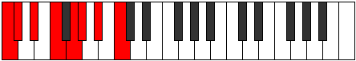 | [midi](ModeCNaturalPhrygian.mid) [ogg](ModeCNaturalPhrygian.ogg) |
| [1453](https://ianring.com/musictheory/scales/1453) | [Lydian](ScaleLydian.md) | [Aeolian](ModeAeolian.md) | C, **D**, Eb, F, G, Ab, Bb, C |  | [midi](ModeCNaturalAeolian.mid) [ogg](ModeCNaturalAeolian.ogg) |
| [1455](https://ianring.com/musictheory/scales/1455) | [Aerycryllic](ScaleAerycryllic.md) | [Soryllic](ModeSoryllic.md) | C, C#, **D**, D#, F, G, G#, A#, C |  | [midi](ModeCNaturalSoryllic.mid) [ogg](ModeCNaturalSoryllic.ogg) |
| [1457](https://ianring.com/musictheory/scales/1457) | [Modimic](ScaleModimic.md) | [Modimic](ModeModimic.md) | C, **D##**, E#, **F##**, **G#**, A#, C |  | [midi](ModeCNaturalModimic.mid) [ogg](ModeCNaturalModimic.ogg) |
| [1459](https://ianring.com/musictheory/scales/1459) | [Bycrian](ScaleBycrian.md) | [Ionalian](ModeIonalian.md) | C, Db, **E**, F, **G**, **Ab**, Bb, C |  | [midi](ModeCNaturalIonalian.mid) [ogg](ModeCNaturalIonalian.ogg) |
| [1461](https://ianring.com/musictheory/scales/1461) | [Larian](ScaleLarian.md) | [Stydian](ModeStydian.md) | C, **D**, **E**, F, G, **Ab**, Bb, C |  | [midi](ModeCNaturalStydian.mid) [ogg](ModeCNaturalStydian.ogg) |
| [1463](https://ianring.com/musictheory/scales/1463) | [Dalyllic](ScaleDalyllic.md) | [Zaptyllic](ModeZaptyllic.md) | C, C#, **D**, **E**, F, G, **G#**, A#, C |  | [midi](ModeCNaturalZaptyllic.mid) [ogg](ModeCNaturalZaptyllic.ogg) |
| [1465](https://ianring.com/musictheory/scales/1465) | [Aerathian](ScaleAerathian.md) | [Aerathian](ModeAerathian.md) | C, D#, **E**, F, **G**, Ab, Bb, C |  | [midi](ModeCNaturalAerathian.mid) [ogg](ModeCNaturalAerathian.ogg) |
| [1467](https://ianring.com/musictheory/scales/1467) | [Ionoptyllic](ScaleIonoptyllic.md) | [Thydyllic](ModeThydyllic.md) | C, C#, D#, **E**, F, **G**, G#, A#, C |  | [midi](ModeCNaturalThydyllic.mid) [ogg](ModeCNaturalThydyllic.ogg) |
| [1469](https://ianring.com/musictheory/scales/1469) | [Ionocryllic](ScaleIonocryllic.md) | [Epiryllic](ModeEpiryllic.md) | C, **D**, D#, **E**, F, G, G#, A#, C |  | [midi](ModeCNaturalEpiryllic.mid) [ogg](ModeCNaturalEpiryllic.ogg) |
| [1471](https://ianring.com/musictheory/scales/1471) | [Apinygic](ScaleApinygic.md) | [Radygic](ModeRadygic.md) | C, C#, **D**, D#, **E**, F, G, G#, A#, C |  | [midi](ModeCNaturalRadygic.mid) [ogg](ModeCNaturalRadygic.ogg) |
| [1477](https://ianring.com/musictheory/scales/1477) | [Mycrimic](ScaleMycrimic.md) | [Phrylimic](ModePhrylimic.md) | C, **D**, **E##**, F##, **G#**, **A#**, C |  | [midi](ModeCNaturalPhrylimic.mid) [ogg](ModeCNaturalPhrylimic.ogg) |
| [1479](https://ianring.com/musictheory/scales/1479) | [Thacrian](ScaleThacrian.md) | [Aeolagian](ModeAeolagian.md) | C, Db, **Ebb**, F#, G, **Ab**, **Bb**, C |  | [midi](ModeCNaturalAeolagian.mid) [ogg](ModeCNaturalAeolagian.ogg) |
| [1481](https://ianring.com/musictheory/scales/1481) | [Zagimic](ScaleZagimic.md) | [Zagimic](ModeZagimic.md) | C, D#, **E##**, **F##**, G#, **A#**, C |  | [midi](ModeCNaturalZagimic.mid) [ogg](ModeCNaturalZagimic.ogg) |
| [1483](https://ianring.com/musictheory/scales/1483) | [Ionycrian](ScaleIonycrian.md) | [Dygian](ModeDygian.md) | C, Db, Eb, F#, **G**, Ab, **Bb**, C |  | [midi](ModeCNaturalDygian.mid) [ogg](ModeCNaturalDygian.ogg) |
| [1485](https://ianring.com/musictheory/scales/1485) | [Dolian](ScaleDolian.md) | [Tyrian](ModeTyrian.md) | C, **D**, Eb, **F#**, G, Ab, **Bb**, C |  | [midi](ModeCNaturalTyrian.mid) [ogg](ModeCNaturalTyrian.ogg) |
| [1487](https://ianring.com/musictheory/scales/1487) | [Aeracryllic](ScaleAeracryllic.md) | [Lycryllic](ModeLycryllic.md) | C, C#, **D**, D#, F#, G, G#, **A#**, C |  | [midi](ModeCNaturalLycryllic.mid) [ogg](ModeCNaturalLycryllic.ogg) |
| [1489](https://ianring.com/musictheory/scales/1489) | [Gacrimic](ScaleGacrimic.md) | [Gacrimic](ModeGacrimic.md) | C, **D##**, **E##**, **F##**, **G#**, **A#**, C |  | [midi](ModeCNaturalGacrimic.mid) [ogg](ModeCNaturalGacrimic.ogg) |
| [1491](https://ianring.com/musictheory/scales/1491) | [Eporian](ScaleEporian.md) | [Rynian](ModeRynian.md) | C, Db, **E**, F#, **G**, **Ab**, **Bb**, C |  | [midi](ModeCNaturalRynian.mid) [ogg](ModeCNaturalRynian.ogg) |
| [1493](https://ianring.com/musictheory/scales/1493) | [Aeolynian](ScaleAeolynian.md) | [Phryrian](ModePhryrian.md) | C, **D**, **E**, **F#**, G, **Ab**, **Bb**, C |  | [midi](ModeCNaturalPhryrian.mid) [ogg](ModeCNaturalPhryrian.ogg) |
| [1495](https://ianring.com/musictheory/scales/1495) | [Epotyllic](ScaleEpotyllic.md) | [Kaptyllic](ModeKaptyllic.md) | C, C#, **D**, **E**, F#, G, **G#**, **A#**, C |  | [midi](ModeCNaturalKaptyllic.mid) [ogg](ModeCNaturalKaptyllic.ogg) |
| [1497](https://ianring.com/musictheory/scales/1497) | [Ionanian](ScaleIonanian.md) | [Ionanian](ModeIonanian.md) | C, D#, **E**, **F#**, **G**, Ab, **Bb**, C |  | [midi](ModeCNaturalIonanian.mid) [ogg](ModeCNaturalIonanian.ogg) |
| [1499](https://ianring.com/musictheory/scales/1499) | [Stogyllic](ScaleStogyllic.md) | [Stonyllic](ModeStonyllic.md) | C, C#, D#, **E**, F#, **G**, G#, **A#**, C |  | [midi](ModeCNaturalStonyllic.mid) [ogg](ModeCNaturalStonyllic.ogg) |
| [1501](https://ianring.com/musictheory/scales/1501) | [Racryllic](ScaleRacryllic.md) | [Stygyllic](ModeStygyllic.md) | C, **D**, D#, **E**, **F#**, G, G#, **A#**, C |  | [midi](ModeCNaturalStygyllic.mid) [ogg](ModeCNaturalStygyllic.ogg) |
| [1503](https://ianring.com/musictheory/scales/1503) | [Kaptygic](ScaleKaptygic.md) | [Padygic](ModePadygic.md) | C, C#, **D**, D#, **E**, F#, G, G#, **A#**, C |  | [midi](ModeCNaturalPadygic.mid) [ogg](ModeCNaturalPadygic.ogg) |
| [1507](https://ianring.com/musictheory/scales/1507) | [Zogian](ScaleZogian.md) | [Zynian](ModeZynian.md) | C, Db, E#, F#, **G**, **Ab**, Bb, C |  | [midi](ModeCNaturalZynian.mid) [ogg](ModeCNaturalZynian.ogg) |
| [1509](https://ianring.com/musictheory/scales/1509) | [Pagian](ScalePagian.md) | [Ragian](ModeRagian.md) | C, **D**, E#, **F#**, G, **Ab**, Bb, C |  | [midi](ModeCNaturalRagian.mid) [ogg](ModeCNaturalRagian.ogg) |
| [1511](https://ianring.com/musictheory/scales/1511) | [Bacryllic](ScaleBacryllic.md) | [Styptyllic](ModeStyptyllic.md) | C, C#, **D**, F, F#, G, **G#**, A#, C |  | [midi](ModeCNaturalStyptyllic.mid) [ogg](ModeCNaturalStyptyllic.ogg) |
| [1513](https://ianring.com/musictheory/scales/1513) | [Stathian](ScaleStathian.md) | [Stathian](ModeStathian.md) | C, D#, E#, **F#**, **G**, Ab, Bb, C |  | [midi](ModeCNaturalStathian.mid) [ogg](ModeCNaturalStathian.ogg) |
| [1515](https://ianring.com/musictheory/scales/1515) | [Aerycryllic](ScaleAerycryllic.md) | [Solyllic](ModeSolyllic.md) | C, C#, D#, F, F#, **G**, G#, A#, C | 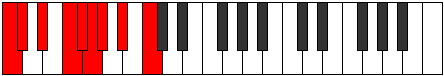 | [midi](ModeCNaturalSolyllic.mid) [ogg](ModeCNaturalSolyllic.ogg) |
| [1517](https://ianring.com/musictheory/scales/1517) | [Rocryllic](ScaleRocryllic.md) | [Sagyllic](ModeSagyllic.md) | C, **D**, D#, F, **F#**, G, G#, A#, C |  | [midi](ModeCNaturalSagyllic.mid) [ogg](ModeCNaturalSagyllic.ogg) |
| [1519](https://ianring.com/musictheory/scales/1519) | [Aerycrygic](ScaleAerycrygic.md) | [Solygic](ModeSolygic.md) | C, C#, **D**, D#, F, F#, G, G#, A#, C |  | [midi](ModeCNaturalSolygic.mid) [ogg](ModeCNaturalSolygic.ogg) |
| [1521](https://ianring.com/musictheory/scales/1521) | [Stanian](ScaleStanian.md) | [Stanian](ModeStanian.md) | C, **D##**, E#, **F#**, **G**, **Ab**, Bb, C |  | [midi](ModeCNaturalStanian.mid) [ogg](ModeCNaturalStanian.ogg) |
| [1523](https://ianring.com/musictheory/scales/1523) | [Gythyllic](ScaleGythyllic.md) | [Zothyllic](ModeZothyllic.md) | C, C#, **E**, F, F#, **G**, **G#**, A#, C |  | [midi](ModeCNaturalZothyllic.mid) [ogg](ModeCNaturalZothyllic.ogg) |
| [1525](https://ianring.com/musictheory/scales/1525) | [Thyryllic](ScaleThyryllic.md) | [Sodyllic](ModeSodyllic.md) | C, **D**, **E**, F, **F#**, G, **G#**, A#, C |  | [midi](ModeCNaturalSodyllic.mid) [ogg](ModeCNaturalSodyllic.ogg) |
| [1527](https://ianring.com/musictheory/scales/1527) | [Porygic](ScalePorygic.md) | [Aeolyrygic](ModeAeolyrygic.md) | C, C#, **D**, **E**, F, F#, G, **G#**, A#, C |  | [midi](ModeCNaturalAeolyrygic.mid) [ogg](ModeCNaturalAeolyrygic.ogg) |
| [1529](https://ianring.com/musictheory/scales/1529) | [Kataryllic](ScaleKataryllic.md) | [Kataryllic](ModeKataryllic.md) | C, D#, **E**, F, **F#**, **G**, G#, A#, C |  | [midi](ModeCNaturalKataryllic.mid) [ogg](ModeCNaturalKataryllic.ogg) |
| [1531](https://ianring.com/musictheory/scales/1531) | [Bagygic](ScaleBagygic.md) | [Styptygic](ModeStyptygic.md) | C, C#, D#, **E**, F, F#, **G**, G#, A#, C |  | [midi](ModeCNaturalStyptygic.mid) [ogg](ModeCNaturalStyptygic.ogg) |
| [1533](https://ianring.com/musictheory/scales/1533) | [Kyrygic](ScaleKyrygic.md) | [Katycrygic](ModeKatycrygic.md) | C, **D**, D#, **E**, F, **F#**, G, G#, A#, C |  | [midi](ModeCNaturalKatycrygic.mid) [ogg](ModeCNaturalKatycrygic.ogg) |
| [1535](https://ianring.com/musictheory/scales/1535) | [Sydyllian](ScaleSydyllian.md) | [Mixodyllian](ModeMixodyllian.md) | C, C#, **D**, D#, **E**, F, F#, G, G#, A#, C |  | [midi](ModeCNaturalMixodyllian.mid) [ogg](ModeCNaturalMixodyllian.ogg) |
| [1571](https://ianring.com/musictheory/scales/1571) | [Dolitonic](ScaleDolitonic.md) | [Lagitonic](ModeLagitonic.md) | **C**, **C#**, F, **A**, A#, **C** | 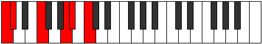 | [midi](ModeCNaturalLagitonic.mid) [ogg](ModeCNaturalLagitonic.ogg) |
| [1573](https://ianring.com/musictheory/scales/1573) | [Lothitonic](ScaleLothitonic.md) | [Saritonic](ModeSaritonic.md) | **C**, D, F, **A**, A#, **C** | 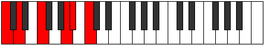 | [midi](ModeCNaturalSaritonic.mid) [ogg](ModeCNaturalSaritonic.ogg) |
| [1575](https://ianring.com/musictheory/scales/1575) | [Syrimic](ScaleSyrimic.md) | [Zycrimic](ModeZycrimic.md) | **C**, **Db**, Ebb, F, **G##**, A#, **C** |  | [midi](ModeCNaturalZycrimic.mid) [ogg](ModeCNaturalZycrimic.ogg) |
| [1577](https://ianring.com/musictheory/scales/1577) | [Aeracritonic](ScaleAeracritonic.md) | [Lonitonic](ModeLonitonic.md) | **C**, D#, F, **A**, A#, **C** |  | [midi](ModeCNaturalLonitonic.mid) [ogg](ModeCNaturalLonitonic.ogg) |
| [1579](https://ianring.com/musictheory/scales/1579) | [Modimic](ScaleModimic.md) | [Sagimic](ModeSagimic.md) | **C**, **Db**, Eb, F, **G##**, A#, **C** |  | [midi](ModeCNaturalSagimic.mid) [ogg](ModeCNaturalSagimic.ogg) |
| [1581](https://ianring.com/musictheory/scales/1581) | [Garimic](ScaleGarimic.md) | [Gyrimic](ModeGyrimic.md) | **C**, D, Eb, F, **G##**, A#, **C** |  | [midi](ModeCNaturalGyrimic.mid) [ogg](ModeCNaturalGyrimic.ogg) |
| [1583](https://ianring.com/musictheory/scales/1583) | [Zorian](ScaleZorian.md) | [Salian](ModeSalian.md) | **C**, **Db**, Ebb, Fbb, Gbb, **A**, Bb, **C** |  | [midi](ModeCNaturalSalian.mid) [ogg](ModeCNaturalSalian.ogg) |
| [1585](https://ianring.com/musictheory/scales/1585) | [Phraditonic](ScalePhraditonic.md) | [Phraditonic](ModePhraditonic.md) | **C**, **E**, F, A, A#, **C** |  | [midi](ModeCNaturalPhraditonic.mid) [ogg](ModeCNaturalPhraditonic.ogg) |
| [1587](https://ianring.com/musictheory/scales/1587) | [Laptimic](ScaleLaptimic.md) | [Lalimic](ModeLalimic.md) | **C**, **Db**, **E**, F, G##, A#, **C** |  | [midi](ModeCNaturalLalimic.mid) [ogg](ModeCNaturalLalimic.ogg) |
| [1589](https://ianring.com/musictheory/scales/1589) | [Bylimic](ScaleBylimic.md) | [Ionagimic](ModeIonagimic.md) | **C**, D, **E**, F, G##, A#, **C** |  | [midi](ModeCNaturalIonagimic.mid) [ogg](ModeCNaturalIonagimic.ogg) |
| [1591](https://ianring.com/musictheory/scales/1591) | [Stythian](ScaleStythian.md) | [Rodian](ModeRodian.md) | **C**, **Db**, Ebb, **Fb**, Gbb, A, Bb, **C** |  | [midi](ModeCNaturalRodian.mid) [ogg](ModeCNaturalRodian.ogg) |
| [1593](https://ianring.com/musictheory/scales/1593) | [Epygimic](ScaleEpygimic.md) | [Zogimic](ModeZogimic.md) | **C**, D#, **E**, F, G##, A#, **C** |  | [midi](ModeCNaturalZogimic.mid) [ogg](ModeCNaturalZogimic.ogg) |
| [1595](https://ianring.com/musictheory/scales/1595) | [Stygian](ScaleStygian.md) | [Dacrian](ModeDacrian.md) | **C**, **Db**, Eb, **Fb**, Gbb, A, Bb, **C** |  | [midi](ModeCNaturalDacrian.mid) [ogg](ModeCNaturalDacrian.ogg) |
| [1597](https://ianring.com/musictheory/scales/1597) | [Ionythian](ScaleIonythian.md) | [Aeolodian](ModeAeolodian.md) | **C**, D, Eb, **Fb**, Gbb, A, Bb, **C** |  | [midi](ModeCNaturalAeolodian.mid) [ogg](ModeCNaturalAeolodian.ogg) |
| [1599](https://ianring.com/musictheory/scales/1599) | [Dolyllic](ScaleDolyllic.md) | [Pocryllic](ModePocryllic.md) | **C**, **C#**, D, D#, **E**, F, A, A#, **C** |  | [midi](ModeCNaturalPocryllic.mid) [ogg](ModeCNaturalPocryllic.ogg) |
| [1605](https://ianring.com/musictheory/scales/1605) | [Ryphitonic](ScaleRyphitonic.md) | [Zanitonic](ModeZanitonic.md) | **C**, D, **F#**, **A**, **A#**, **C** |  | [midi](ModeCNaturalZanitonic.mid) [ogg](ModeCNaturalZanitonic.ogg) |
| [1607](https://ianring.com/musictheory/scales/1607) | [Lathimic](ScaleLathimic.md) | [Epytimic](ModeEpytimic.md) | **C**, **Db**, Ebb, F#, **G##**, **A#**, **C** |  | [midi](ModeCNaturalEpytimic.mid) [ogg](ModeCNaturalEpytimic.ogg) |
| [1609](https://ianring.com/musictheory/scales/1609) | [Thyritonic](ScaleThyritonic.md) | [Thyritonic](ModeThyritonic.md) | **C**, D#, **F#**, **A**, **A#**, **C** |  | [midi](ModeCNaturalThyritonic.mid) [ogg](ModeCNaturalThyritonic.ogg) |
| [1611](https://ianring.com/musictheory/scales/1611) | [Thalimic](ScaleThalimic.md) | [Dacrimic](ModeDacrimic.md) | **C**, **Db**, Eb, F#, **G##**, **A#**, **C** |  | [midi](ModeCNaturalDacrimic.mid) [ogg](ModeCNaturalDacrimic.ogg) |
| [1613](https://ianring.com/musictheory/scales/1613) | [Dagimic](ScaleDagimic.md) | [Thylimic](ModeThylimic.md) | **C**, D, Eb, **F#**, **G##**, **A#**, **C** |  | [midi](ModeCNaturalThylimic.mid) [ogg](ModeCNaturalThylimic.ogg) |
| [1615](https://ianring.com/musictheory/scales/1615) | [Epagian](ScaleEpagian.md) | [Sydian](ModeSydian.md) | **C**, **Db**, Ebb, Fbb, Gb, **A**, **Bb**, **C** |  | [midi](ModeCNaturalSydian.mid) [ogg](ModeCNaturalSydian.ogg) |
| [1617](https://ianring.com/musictheory/scales/1617) | [Phronitonic](ScalePhronitonic.md) | [Phronitonic](ModePhronitonic.md) | **C**, **E**, **F#**, A, **A#**, **C** |  | [midi](ModeCNaturalPhronitonic.mid) [ogg](ModeCNaturalPhronitonic.ogg) |
| [1619](https://ianring.com/musictheory/scales/1619) | [Stythimic](ScaleStythimic.md) | [Monimic](ModeMonimic.md) | **C**, **Db**, **E**, F#, G##, **A#**, **C** |  | [midi](ModeCNaturalMonimic.mid) [ogg](ModeCNaturalMonimic.ogg) |
| [1621](https://ianring.com/musictheory/scales/1621) | [Boptimic](ScaleBoptimic.md) | [Aeolathimic](ModeAeolathimic.md) | **C**, D, **E**, **F#**, G##, **A#**, **C** |  | [midi](ModeCNaturalAeolathimic.mid) [ogg](ModeCNaturalAeolathimic.ogg) |
| [1623](https://ianring.com/musictheory/scales/1623) | [Ionanian](ScaleIonanian.md) | [Lothian](ModeLothian.md) | **C**, **Db**, Ebb, **Fb**, Gb, A, **Bb**, **C** |  | [midi](ModeCNaturalLothian.mid) [ogg](ModeCNaturalLothian.ogg) |
| [1625](https://ianring.com/musictheory/scales/1625) | [Lythimic](ScaleLythimic.md) | [Lythimic](ModeLythimic.md) | **C**, D#, **E**, **F#**, G##, **A#**, **C** |  | [midi](ModeCNaturalLythimic.mid) [ogg](ModeCNaturalLythimic.ogg) |
| [1627](https://ianring.com/musictheory/scales/1627) | [Mycrian](ScaleMycrian.md) | [Zyptian](ModeZyptian.md) | **C**, **Db**, Eb, **Fb**, Gb, A, **Bb**, **C** |  | [midi](ModeCNaturalZyptian.mid) [ogg](ModeCNaturalZyptian.ogg) |
| [1629](https://ianring.com/musictheory/scales/1629) | [Korian](ScaleKorian.md) | [Synian](ModeSynian.md) | **C**, D, Eb, **Fb**, **Gb**, A, **Bb**, **C** |  | [midi](ModeCNaturalSynian.mid) [ogg](ModeCNaturalSynian.ogg) |
| [1631](https://ianring.com/musictheory/scales/1631) | [Stacryllic](ScaleStacryllic.md) | [Rynyllic](ModeRynyllic.md) | **C**, **C#**, D, D#, **E**, F#, A, **A#**, **C** |  | [midi](ModeCNaturalRynyllic.mid) [ogg](ModeCNaturalRynyllic.ogg) |
| [1635](https://ianring.com/musictheory/scales/1635) | [Solimic](ScaleSolimic.md) | [Sygimic](ModeSygimic.md) | **C**, **Db**, E#, F#, **G##**, A#, **C** |  | [midi](ModeCNaturalSygimic.mid) [ogg](ModeCNaturalSygimic.ogg) |
| [1637](https://ianring.com/musictheory/scales/1637) | [Dynimic](ScaleDynimic.md) | [Syptimic](ModeSyptimic.md) | **C**, D, E#, **F#**, **G##**, A#, **C** |  | [midi](ModeCNaturalSyptimic.mid) [ogg](ModeCNaturalSyptimic.ogg) |
| [1639](https://ianring.com/musictheory/scales/1639) | [Katathian](ScaleKatathian.md) | [Aeolothian](ModeAeolothian.md) | **C**, **Db**, Ebb, F, Gb, **A**, Bb, **C** |  | [midi](ModeCNaturalAeolothian.mid) [ogg](ModeCNaturalAeolothian.ogg) |
| [1641](https://ianring.com/musictheory/scales/1641) | [Bocrimic](ScaleBocrimic.md) | [Bocrimic](ModeBocrimic.md) | **C**, D#, E#, **F#**, **G##**, A#, **C** |  | [midi](ModeCNaturalBocrimic.mid) [ogg](ModeCNaturalBocrimic.ogg) |
| [1643](https://ianring.com/musictheory/scales/1643) | [Bycrian](ScaleBycrian.md) | [Thyptian](ModeThyptian.md) | **C**, **Db**, Eb, F, Gb, **A**, Bb, **C** |  | [midi](ModeCNaturalThyptian.mid) [ogg](ModeCNaturalThyptian.ogg) |
| [1645](https://ianring.com/musictheory/scales/1645) | [Palian](ScalePalian.md) | [Katagian](ModeKatagian.md) | **C**, D, Eb, F, **Gb**, **A**, Bb, **C** |  | [midi](ModeCNaturalKatagian.mid) [ogg](ModeCNaturalKatagian.ogg) |
| [1647](https://ianring.com/musictheory/scales/1647) | [Doptyllic](ScaleDoptyllic.md) | [Polyllic](ModePolyllic.md) | **C**, **C#**, D, D#, F, F#, **A**, A#, **C** |  | [midi](ModeCNaturalPolyllic.mid) [ogg](ModeCNaturalPolyllic.ogg) |
| [1649](https://ianring.com/musictheory/scales/1649) | [Bolimic](ScaleBolimic.md) | [Bolimic](ModeBolimic.md) | **C**, **D##**, E#, **F#**, G##, A#, **C** |  | [midi](ModeCNaturalBolimic.mid) [ogg](ModeCNaturalBolimic.ogg) |
| [1651](https://ianring.com/musictheory/scales/1651) | [Loptian](ScaleLoptian.md) | [Mogian](ModeMogian.md) | **C**, **Db**, **E**, F, Gb, A, Bb, **C** |  | [midi](ModeCNaturalMogian.mid) [ogg](ModeCNaturalMogian.ogg) |
| [1653](https://ianring.com/musictheory/scales/1653) | [Golian](ScaleGolian.md) | [Gylian](ModeGylian.md) | **C**, D, **E**, F, **Gb**, A, Bb, **C** |  | [midi](ModeCNaturalGylian.mid) [ogg](ModeCNaturalGylian.ogg) |
| [1655](https://ianring.com/musictheory/scales/1655) | [Thyptyllic](ScaleThyptyllic.md) | [Katygyllic](ModeKatygyllic.md) | **C**, **C#**, D, **E**, F, F#, A, A#, **C** |  | [midi](ModeCNaturalKatygyllic.mid) [ogg](ModeCNaturalKatygyllic.ogg) |
| [1657](https://ianring.com/musictheory/scales/1657) | [Ranian](ScaleRanian.md) | [Ionothian](ModeIonothian.md) | **C**, D#, **E**, F, **Gb**, A, Bb, **C** |  | [midi](ModeCNaturalIonothian.mid) [ogg](ModeCNaturalIonothian.ogg) |
| [1659](https://ianring.com/musictheory/scales/1659) | [Maptyllic](ScaleMaptyllic.md) | [Magyllic](ModeMagyllic.md) | **C**, **C#**, D#, **E**, F, F#, A, A#, **C** |  | [midi](ModeCNaturalMagyllic.mid) [ogg](ModeCNaturalMagyllic.ogg) |
| [1661](https://ianring.com/musictheory/scales/1661) | [Aeolothyllic](ScaleAeolothyllic.md) | [Gonyllic](ModeGonyllic.md) | **C**, D, D#, **E**, F, **F#**, A, A#, **C** |  | [midi](ModeCNaturalGonyllic.mid) [ogg](ModeCNaturalGonyllic.ogg) |
| [1663](https://ianring.com/musictheory/scales/1663) | [Phrygic](ScalePhrygic.md) | [Lydygic](ModeLydygic.md) | **C**, **C#**, D, D#, **E**, F, F#, A, A#, **C** |  | [midi](ModeCNaturalLydygic.mid) [ogg](ModeCNaturalLydygic.ogg) |
| [1673](https://ianring.com/musictheory/scales/1673) | [Aeolacritonic](ScaleAeolacritonic.md) | [Thocritonic](ModeThocritonic.md) | C, D#, **G**, **A**, **A#**, C |  | [midi](ModeCNaturalThocritonic.mid) [ogg](ModeCNaturalThocritonic.ogg) |
| [1675](https://ianring.com/musictheory/scales/1675) | [Manimic](ScaleManimic.md) | [Epatimic](ModeEpatimic.md) | C, **Db**, Eb, **F##**, **G##**, **A#**, C |  | [midi](ModeCNaturalEpatimic.mid) [ogg](ModeCNaturalEpatimic.ogg) |
| [1677](https://ianring.com/musictheory/scales/1677) | [Dyrimic](ScaleDyrimic.md) | [Danimic](ModeDanimic.md) | C, D, Eb, F##, **G##**, **A#**, C |  | [midi](ModeCNaturalDanimic.mid) [ogg](ModeCNaturalDanimic.ogg) |
| [1679](https://ianring.com/musictheory/scales/1679) | [Aeopian](ScaleAeopian.md) | [Kydian](ModeKydian.md) | C, **Db**, Ebb, Fbb, G, **A**, **Bb**, C |  | [midi](ModeCNaturalKydian.mid) [ogg](ModeCNaturalKydian.ogg) |
| [1681](https://ianring.com/musictheory/scales/1681) | [Ionaditonic](ScaleIonaditonic.md) | [Ionaditonic](ModeIonaditonic.md) | C, **E**, **G**, A, **A#**, C |  | [midi](ModeCNaturalIonaditonic.mid) [ogg](ModeCNaturalIonaditonic.ogg) |
| [1683](https://ianring.com/musictheory/scales/1683) | [Thoptimic](ScaleThoptimic.md) | [Rygimic](ModeRygimic.md) | C, **Db**, **E**, **F##**, G##, **A#**, C |  | [midi](ModeCNaturalRygimic.mid) [ogg](ModeCNaturalRygimic.ogg) |
| [1685](https://ianring.com/musictheory/scales/1685) | [Phracrimic](ScalePhracrimic.md) | [Zeracrimic](ModeZeracrimic.md) | C, D, **E**, F##, G##, **A#**, C |  | [midi](ModeCNaturalZeracrimic.mid) [ogg](ModeCNaturalZeracrimic.ogg) |
| [1687](https://ianring.com/musictheory/scales/1687) | [Ionopian](ScaleIonopian.md) | [Phralian](ModePhralian.md) | C, **Db**, Ebb, **Fb**, G, A, **Bb**, C |  | [midi](ModeCNaturalPhralian.mid) [ogg](ModeCNaturalPhralian.ogg) |
| [1689](https://ianring.com/musictheory/scales/1689) | [Zacrimic](ScaleZacrimic.md) | [Lorimic](ModeLorimic.md) | C, D#, **E**, **F##**, G##, **A#**, C |  | [midi](ModeCNaturalLorimic.mid) [ogg](ModeCNaturalLorimic.ogg) |
| [1691](https://ianring.com/musictheory/scales/1691) | [Pogian](ScalePogian.md) | [Kathian](ModeKathian.md) | C, **Db**, Eb, **Fb**, **G**, A, **Bb**, C |  | [midi](ModeCNaturalKathian.mid) [ogg](ModeCNaturalKathian.ogg) |
| [1693](https://ianring.com/musictheory/scales/1693) | [Thonian](ScaleThonian.md) | [Dogian](ModeDogian.md) | C, D, Eb, **Fb**, G, A, **Bb**, C |  | [midi](ModeCNaturalDogian.mid) [ogg](ModeCNaturalDogian.ogg) |
| [1695](https://ianring.com/musictheory/scales/1695) | [Lydyllic](ScaleLydyllic.md) | [Phrodyllic](ModePhrodyllic.md) | C, **C#**, D, D#, **E**, G, A, **A#**, C | 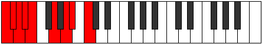 | [midi](ModeCNaturalPhrodyllic.mid) [ogg](ModeCNaturalPhrodyllic.ogg) |
| [1699](https://ianring.com/musictheory/scales/1699) | [Rycrimic](ScaleRycrimic.md) | [Kaptimic](ModeKaptimic.md) | C, **Db**, E#, **F##**, **G##**, A#, C |  | [midi](ModeCNaturalKaptimic.mid) [ogg](ModeCNaturalKaptimic.ogg) |
| [1701](https://ianring.com/musictheory/scales/1701) | [Epathimic](ScaleEpathimic.md) | [Lothimic](ModeLothimic.md) | C, D, E#, F##, **G##**, A#, C | 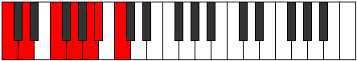 | [midi](ModeCNaturalLothimic.mid) [ogg](ModeCNaturalLothimic.ogg) |
| [1703](https://ianring.com/musictheory/scales/1703) | [Phrolian](ScalePhrolian.md) | [Zaptian](ModeZaptian.md) | C, **Db**, Ebb, F, G, **A**, Bb, C |  | [midi](ModeCNaturalZaptian.mid) [ogg](ModeCNaturalZaptian.ogg) |
| [1705](https://ianring.com/musictheory/scales/1705) | [Darmic](ScaleDarmic.md) | [Darmic](ModeDarmic.md) | C, D#, E#, **F##**, **G##**, A#, C |  | [midi](ModeCNaturalDarmic.mid) [ogg](ModeCNaturalDarmic.ogg) |
| [1707](https://ianring.com/musictheory/scales/1707) | [Larian](ScaleLarian.md) | [Mixolythian](ModeMixolythian.md) | C, **Db**, Eb, F, **G**, **A**, Bb, C |  | [midi](ModeCNaturalMixolythian.mid) [ogg](ModeCNaturalMixolythian.ogg) |
| [1709](https://ianring.com/musictheory/scales/1709) | [Lydian](ScaleLydian.md) | [Dorian](ModeDorian.md) | C, D, Eb, F, G, **A**, Bb, C |  | [midi](ModeCNaturalDorian.mid) [ogg](ModeCNaturalDorian.ogg) |
| [1711](https://ianring.com/musictheory/scales/1711) | [Rocryllic](ScaleRocryllic.md) | [Ragyllic](ModeRagyllic.md) | C, **C#**, D, D#, F, G, **A**, A#, C |  | [midi](ModeCNaturalRagyllic.mid) [ogg](ModeCNaturalRagyllic.ogg) |
| [1713](https://ianring.com/musictheory/scales/1713) | [Garimic](ScaleGarimic.md) | [Garimic](ModeGarimic.md) | C, **D##**, E#, **F##**, G##, A#, C |  | [midi](ModeCNaturalGarimic.mid) [ogg](ModeCNaturalGarimic.ogg) |
| [1715](https://ianring.com/musictheory/scales/1715) | [Palian](ScalePalian.md) | [Aeronian](ModeAeronian.md) | C, **Db**, **E**, F, **G**, A, Bb, C |  | [midi](ModeCNaturalAeronian.mid) [ogg](ModeCNaturalAeronian.ogg) |
| [1717](https://ianring.com/musictheory/scales/1717) | [Lydian](ScaleLydian.md) | [Mixolydian](ModeMixolydian.md) | C, D, **E**, F, G, A, Bb, C |  | [midi](ModeCNaturalMixolydian.mid) [ogg](ModeCNaturalMixolydian.ogg) |
| [1719](https://ianring.com/musictheory/scales/1719) | [Ionoptyllic](ScaleIonoptyllic.md) | [Lyryllic](ModeLyryllic.md) | C, **C#**, D, **E**, F, G, A, A#, C |  | [midi](ModeCNaturalLyryllic.mid) [ogg](ModeCNaturalLyryllic.ogg) |
| [1721](https://ianring.com/musictheory/scales/1721) | [Ionycrian](ScaleIonycrian.md) | [Ionycrian](ModeIonycrian.md) | C, D#, **E**, F, **G**, A, Bb, C | 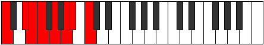 | [midi](ModeCNaturalIonycrian.mid) [ogg](ModeCNaturalIonycrian.ogg) |
| [1723](https://ianring.com/musictheory/scales/1723) | [Stogyllic](ScaleStogyllic.md) | [Poryllic](ModePoryllic.md) | C, **C#**, D#, **E**, F, **G**, A, A#, C |  | [midi](ModeCNaturalPoryllic.mid) [ogg](ModeCNaturalPoryllic.ogg) |
| [1725](https://ianring.com/musictheory/scales/1725) | [Aerycryllic](ScaleAerycryllic.md) | [Mixodyllic](ModeMixodyllic.md) | C, D, D#, **E**, F, G, A, A#, C |  | [midi](ModeCNaturalMixodyllic.mid) [ogg](ModeCNaturalMixodyllic.ogg) |
| [1727](https://ianring.com/musictheory/scales/1727) | [Bagygic](ScaleBagygic.md) | [Sydygic](ModeSydygic.md) | C, **C#**, D, D#, **E**, F, G, A, A#, C |  | [midi](ModeCNaturalSydygic.mid) [ogg](ModeCNaturalSydygic.ogg) |
| [1733](https://ianring.com/musictheory/scales/1733) | [Modimic](ScaleModimic.md) | [Socrimic](ModeSocrimic.md) | C, D, **E##**, F##, **G##**, **A#**, C |  | [midi](ModeCNaturalSocrimic.mid) [ogg](ModeCNaturalSocrimic.ogg) |
| [1735](https://ianring.com/musictheory/scales/1735) | [Stygian](ScaleStygian.md) | [Dagian](ModeDagian.md) | C, **Db**, Ebb, F#, G, **A**, **Bb**, C |  | [midi](ModeCNaturalDagian.mid) [ogg](ModeCNaturalDagian.ogg) |
| [1737](https://ianring.com/musictheory/scales/1737) | [Thalimic](ScaleThalimic.md) | [Thalimic](ModeThalimic.md) | C, D#, **E##**, **F##**, **G##**, **A#**, C |  | [midi](ModeCNaturalThalimic.mid) [ogg](ModeCNaturalThalimic.ogg) |
| [1739](https://ianring.com/musictheory/scales/1739) | [Mycrian](ScaleMycrian.md) | [Phrylian](ModePhrylian.md) | C, **Db**, Eb, F#, **G**, **A**, **Bb**, C |  | [midi](ModeCNaturalPhrylian.mid) [ogg](ModeCNaturalPhrylian.ogg) |
| [1741](https://ianring.com/musictheory/scales/1741) | [Bycrian](ScaleBycrian.md) | [Katycrian](ModeKatycrian.md) | C, D, Eb, **F#**, G, **A**, **Bb**, C |  | [midi](ModeCNaturalKatycrian.mid) [ogg](ModeCNaturalKatycrian.ogg) |
| [1743](https://ianring.com/musictheory/scales/1743) | [Maptyllic](ScaleMaptyllic.md) | [Epigyllic](ModeEpigyllic.md) | C, **C#**, D, D#, F#, G, **A**, **A#**, C |  | [midi](ModeCNaturalEpigyllic.mid) [ogg](ModeCNaturalEpigyllic.ogg) |
| [1745](https://ianring.com/musictheory/scales/1745) | [Manimic](ScaleManimic.md) | [Manimic](ModeManimic.md) | C, **D##**, **E##**, **F##**, G##, **A#**, C |  | [midi](ModeCNaturalManimic.mid) [ogg](ModeCNaturalManimic.ogg) |
| [1747](https://ianring.com/musictheory/scales/1747) | [Pogian](ScalePogian.md) | [Epalian](ModeEpalian.md) | C, **Db**, **E**, F#, **G**, A, **Bb**, C |  | [midi](ModeCNaturalEpalian.mid) [ogg](ModeCNaturalEpalian.ogg) |
| [1749](https://ianring.com/musictheory/scales/1749) | [Larian](ScaleLarian.md) | [Lythian](ModeLythian.md) | C, D, **E**, **F#**, G, A, **Bb**, C |  | [midi](ModeCNaturalLythian.mid) [ogg](ModeCNaturalLythian.ogg) |
| [1751](https://ianring.com/musictheory/scales/1751) | [Stogyllic](ScaleStogyllic.md) | [Aeolyryllic](ModeAeolyryllic.md) | C, **C#**, D, **E**, F#, G, A, **A#**, C |  | [midi](ModeCNaturalAeolyryllic.mid) [ogg](ModeCNaturalAeolyryllic.ogg) |
| [1753](https://ianring.com/musictheory/scales/1753) | [Mycrian](ScaleMycrian.md) | [Mycrian](ModeMycrian.md) | C, D#, **E**, **F#**, **G**, A, **Bb**, C |  | [midi](ModeCNaturalMycrian.mid) [ogg](ModeCNaturalMycrian.ogg) |
| [1755](https://ianring.com/musictheory/scales/1755) | [MajorDiminished](ScaleMajorDiminished.md) | [MinorDiminished](ModeMinorDiminished.md) | C, **C#**, D#, **E**, F#, **G**, A, **A#**, C |  | [midi](ModeCNaturalMinorDiminished.mid) [ogg](ModeCNaturalMinorDiminished.ogg) |
| [1757](https://ianring.com/musictheory/scales/1757) | [Dalyllic](ScaleDalyllic.md) | [Ionyphyllic](ModeIonyphyllic.md) | C, D, D#, **E**, **F#**, G, A, **A#**, C |  | [midi](ModeCNaturalIonyphyllic.mid) [ogg](ModeCNaturalIonyphyllic.ogg) |
| [1759](https://ianring.com/musictheory/scales/1759) | [Koptygic](ScaleKoptygic.md) | [Pylygic](ModePylygic.md) | C, **C#**, D, D#, **E**, F#, G, A, **A#**, C |  | [midi](ModeCNaturalPylygic.mid) [ogg](ModeCNaturalPylygic.ogg) |
| [1763](https://ianring.com/musictheory/scales/1763) | [Aeolathian](ScaleAeolathian.md) | [Katalian](ModeKatalian.md) | C, **Db**, E#, F#, **G**, **A**, Bb, C |  | [midi](ModeCNaturalKatalian.mid) [ogg](ModeCNaturalKatalian.ogg) |
| [1765](https://ianring.com/musictheory/scales/1765) | [Aerathian](ScaleAerathian.md) | [Lonian](ModeLonian.md) | C, D, E#, **F#**, G, **A**, Bb, C | 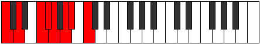 | [midi](ModeCNaturalLonian.mid) [ogg](ModeCNaturalLonian.ogg) |
| [1767](https://ianring.com/musictheory/scales/1767) | [Dydyllic](ScaleDydyllic.md) | [Dyryllic](ModeDyryllic.md) | C, **C#**, D, F, F#, G, **A**, A#, C |  | [midi](ModeCNaturalDyryllic.mid) [ogg](ModeCNaturalDyryllic.ogg) |
| [1769](https://ianring.com/musictheory/scales/1769) | [Rythian](ScaleRythian.md) | [Rythian](ModeRythian.md) | C, D#, E#, **F#**, **G**, **A**, Bb, C | 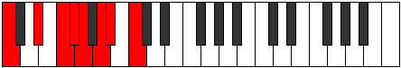 | [midi](ModeCNaturalRythian.mid) [ogg](ModeCNaturalRythian.ogg) |
| [1771](https://ianring.com/musictheory/scales/1771) | [Dalyllic](ScaleDalyllic.md) | [Stylyllic](ModeStylyllic.md) | C, **C#**, D#, F, F#, **G**, **A**, A#, C |  | [midi](ModeCNaturalStylyllic.mid) [ogg](ModeCNaturalStylyllic.ogg) |
| [1773](https://ianring.com/musictheory/scales/1773) | [Ionoptyllic](ScaleIonoptyllic.md) | [Aeoloryllic](ModeAeoloryllic.md) | C, D, D#, F, **F#**, G, **A**, A#, C |  | [midi](ModeCNaturalAeoloryllic.mid) [ogg](ModeCNaturalAeoloryllic.ogg) |
| [1775](https://ianring.com/musictheory/scales/1775) | [Aeolorygic](ScaleAeolorygic.md) | [Lyrygic](ModeLyrygic.md) | C, **C#**, D, D#, F, F#, G, **A**, A#, C |  | [midi](ModeCNaturalLyrygic.mid) [ogg](ModeCNaturalLyrygic.ogg) |
| [1777](https://ianring.com/musictheory/scales/1777) | [Saptian](ScaleSaptian.md) | [Saptian](ModeSaptian.md) | C, **D##**, E#, **F#**, **G**, A, Bb, C |  | [midi](ModeCNaturalSaptian.mid) [ogg](ModeCNaturalSaptian.ogg) |
| [1779](https://ianring.com/musictheory/scales/1779) | [Aeolathyllic](ScaleAeolathyllic.md) | [Aerythyllic](ModeAerythyllic.md) | C, **C#**, **E**, F, F#, **G**, A, A#, C |  | [midi](ModeCNaturalAerythyllic.mid) [ogg](ModeCNaturalAerythyllic.ogg) |
| [1781](https://ianring.com/musictheory/scales/1781) | [Ionocryllic](ScaleIonocryllic.md) | [Gocryllic](ModeGocryllic.md) | C, D, **E**, F, **F#**, G, A, A#, C |  | [midi](ModeCNaturalGocryllic.mid) [ogg](ModeCNaturalGocryllic.ogg) |
| [1783](https://ianring.com/musictheory/scales/1783) | [Epyrygic](ScaleEpyrygic.md) | [Danygic](ModeDanygic.md) | C, **C#**, D, **E**, F, F#, G, A, A#, C |  | [midi](ModeCNaturalDanygic.mid) [ogg](ModeCNaturalDanygic.ogg) |
| [1785](https://ianring.com/musictheory/scales/1785) | [Tharyllic](ScaleTharyllic.md) | [Tharyllic](ModeTharyllic.md) | C, D#, **E**, F, **F#**, **G**, A, A#, C |  | [midi](ModeCNaturalTharyllic.mid) [ogg](ModeCNaturalTharyllic.ogg) |
| [1787](https://ianring.com/musictheory/scales/1787) | [Koptygic](ScaleKoptygic.md) | [Mycrygic](ModeMycrygic.md) | C, **C#**, D#, **E**, F, F#, **G**, A, A#, C |  | [midi](ModeCNaturalMycrygic.mid) [ogg](ModeCNaturalMycrygic.ogg) |
| [1789](https://ianring.com/musictheory/scales/1789) | [Apinygic](ScaleApinygic.md) | [Katagygic](ModeKatagygic.md) | C, D, D#, **E**, F, **F#**, G, A, A#, C |  | [midi](ModeCNaturalKatagygic.mid) [ogg](ModeCNaturalKatagygic.ogg) |
| [1791](https://ianring.com/musictheory/scales/1791) | [Gothyllian](ScaleGothyllian.md) | [Aerygyllian](ModeAerygyllian.md) | C, **C#**, D, D#, **E**, F, F#, G, A, A#, C |  | [midi](ModeCNaturalAerygyllian.mid) [ogg](ModeCNaturalAerygyllian.ogg) |
| [1809](https://ianring.com/musictheory/scales/1809) | [Ranitonic](ScaleRanitonic.md) | [Ranitonic](ModeRanitonic.md) | **C**, **E**, **G#**, A, **A#**, **C** |  | [midi](ModeCNaturalRanitonic.mid) [ogg](ModeCNaturalRanitonic.ogg) |
| [1811](https://ianring.com/musictheory/scales/1811) | [Aerothimic](ScaleAerothimic.md) | [Kyptimic](ModeKyptimic.md) | **C**, Db, **E**, **F###**, G##, **A#**, **C** |  | [midi](ModeCNaturalKyptimic.mid) [ogg](ModeCNaturalKyptimic.ogg) |
| [1813](https://ianring.com/musictheory/scales/1813) | [Mycrimic](ScaleMycrimic.md) | [Katothimic](ModeKatothimic.md) | **C**, D, **E**, **F###**, G##, **A#**, **C** |  | [midi](ModeCNaturalKatothimic.mid) [ogg](ModeCNaturalKatothimic.ogg) |
| [1815](https://ianring.com/musictheory/scales/1815) | [Katacrian](ScaleKatacrian.md) | [Godian](ModeGodian.md) | **C**, Db, Ebb, **Fb**, **G#**, A, **Bb**, **C** |  | [midi](ModeCNaturalGodian.mid) [ogg](ModeCNaturalGodian.ogg) |
| [1817](https://ianring.com/musictheory/scales/1817) | [Kanimic](ScaleKanimic.md) | [Phrythimic](ModePhrythimic.md) | **C**, D#, **E**, F###, G##, **A#**, **C** |  | [midi](ModeCNaturalPhrythimic.mid) [ogg](ModeCNaturalPhrythimic.ogg) |
| [1819](https://ianring.com/musictheory/scales/1819) | [Aeolathian](ScaleAeolathian.md) | [Pydian](ModePydian.md) | **C**, Db, Eb, **Fb**, G#, A, **Bb**, **C** |  | [midi](ModeCNaturalPydian.mid) [ogg](ModeCNaturalPydian.ogg) |
| [1821](https://ianring.com/musictheory/scales/1821) | [Thacrian](ScaleThacrian.md) | [Aeradian](ModeAeradian.md) | **C**, D, Eb, **Fb**, G#, A, **Bb**, **C** |  | [midi](ModeCNaturalAeradian.mid) [ogg](ModeCNaturalAeradian.ogg) |
| [1823](https://ianring.com/musictheory/scales/1823) | [Thagyllic](ScaleThagyllic.md) | [Phralyllic](ModePhralyllic.md) | **C**, C#, D, D#, **E**, G#, A, **A#**, **C** |  | [midi](ModeCNaturalPhralyllic.mid) [ogg](ModeCNaturalPhralyllic.ogg) |
| [1827](https://ianring.com/musictheory/scales/1827) | [Bygimic](ScaleBygimic.md) | [Katygimic](ModeKatygimic.md) | **C**, Db, E#, **F###**, **G##**, A#, **C** | 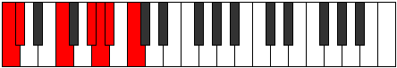 | [midi](ModeCNaturalKatygimic.mid) [ogg](ModeCNaturalKatygimic.ogg) |
| [1829](https://ianring.com/musictheory/scales/1829) | [Zagimic](ScaleZagimic.md) | [Pathimic](ModePathimic.md) | **C**, D, E#, **F###**, **G##**, A#, **C** |  | [midi](ModeCNaturalPathimic.mid) [ogg](ModeCNaturalPathimic.ogg) |
| [1831](https://ianring.com/musictheory/scales/1831) | [Stalian](ScaleStalian.md) | [Pothian](ModePothian.md) | **C**, Db, Ebb, F, **G#**, **A**, Bb, **C** |  | [midi](ModeCNaturalPothian.mid) [ogg](ModeCNaturalPothian.ogg) |
| [1833](https://ianring.com/musictheory/scales/1833) | [Ionacrimic](ScaleIonacrimic.md) | [Ionacrimic](ModeIonacrimic.md) | **C**, D#, E#, F###, **G##**, A#, **C** |  | [midi](ModeCNaturalIonacrimic.mid) [ogg](ModeCNaturalIonacrimic.ogg) |
| [1835](https://ianring.com/musictheory/scales/1835) | [Aerathian](ScaleAerathian.md) | [Byptian](ModeByptian.md) | **C**, Db, Eb, F, G#, **A**, Bb, **C** |  | [midi](ModeCNaturalByptian.mid) [ogg](ModeCNaturalByptian.ogg) |
| [1837](https://ianring.com/musictheory/scales/1837) | [Ionycrian](ScaleIonycrian.md) | [Dalian](ModeDalian.md) | **C**, D, Eb, F, G#, **A**, Bb, **C** |  | [midi](ModeCNaturalDalian.mid) [ogg](ModeCNaturalDalian.ogg) |
| [1839](https://ianring.com/musictheory/scales/1839) | [Dagyllic](ScaleDagyllic.md) | [Zogyllic](ModeZogyllic.md) | **C**, C#, D, D#, F, G#, **A**, A#, **C** |  | [midi](ModeCNaturalZogyllic.mid) [ogg](ModeCNaturalZogyllic.ogg) |
| [1841](https://ianring.com/musictheory/scales/1841) | [Thogimic](ScaleThogimic.md) | [Thogimic](ModeThogimic.md) | **C**, **D##**, E#, **F###**, G##, A#, **C** |  | [midi](ModeCNaturalThogimic.mid) [ogg](ModeCNaturalThogimic.ogg) |
| [1843](https://ianring.com/musictheory/scales/1843) | [Tholian](ScaleTholian.md) | [Ionygian](ModeIonygian.md) | **C**, Db, **E**, F, **G#**, A, Bb, **C** |  | [midi](ModeCNaturalIonygian.mid) [ogg](ModeCNaturalIonygian.ogg) |
| [1845](https://ianring.com/musictheory/scales/1845) | [Dolian](ScaleDolian.md) | [Lagian](ModeLagian.md) | **C**, D, **E**, F, **G#**, A, Bb, **C** |  | [midi](ModeCNaturalLagian.mid) [ogg](ModeCNaturalLagian.ogg) |
| [1847](https://ianring.com/musictheory/scales/1847) | [Lonyllic](ScaleLonyllic.md) | [Thacryllic](ModeThacryllic.md) | **C**, C#, D, **E**, F, **G#**, A, A#, **C** |  | [midi](ModeCNaturalThacryllic.mid) [ogg](ModeCNaturalThacryllic.ogg) |
| [1849](https://ianring.com/musictheory/scales/1849) | [Epogian](ScaleEpogian.md) | [Epogian](ModeEpogian.md) | **C**, D#, **E**, F, G#, A, Bb, **C** |  | [midi](ModeCNaturalEpogian.mid) [ogg](ModeCNaturalEpogian.ogg) |
| [1851](https://ianring.com/musictheory/scales/1851) | [Dydyllic](ScaleDydyllic.md) | [Zacryllic](ModeZacryllic.md) | **C**, C#, D#, **E**, F, G#, A, A#, **C** |  | [midi](ModeCNaturalZacryllic.mid) [ogg](ModeCNaturalZacryllic.ogg) |
| [1853](https://ianring.com/musictheory/scales/1853) | [Aeracryllic](ScaleAeracryllic.md) | [Phrynyllic](ModePhrynyllic.md) | **C**, D, D#, **E**, F, G#, A, A#, **C** |  | [midi](ModeCNaturalPhrynyllic.mid) [ogg](ModeCNaturalPhrynyllic.ogg) |
| [1855](https://ianring.com/musictheory/scales/1855) | [Kalygic](ScaleKalygic.md) | [Marygic](ModeMarygic.md) | **C**, C#, D, D#, **E**, F, G#, A, A#, **C** |  | [midi](ModeCNaturalMarygic.mid) [ogg](ModeCNaturalMarygic.ogg) |
| [1861](https://ianring.com/musictheory/scales/1861) | [Gacrimic](ScaleGacrimic.md) | [Phrygimic](ModePhrygimic.md) | **C**, D, **E##**, **F###**, **G##**, **A#**, **C** |  | [midi](ModeCNaturalPhrygimic.mid) [ogg](ModeCNaturalPhrygimic.ogg) |
| [1863](https://ianring.com/musictheory/scales/1863) | [Katogian](ScaleKatogian.md) | [Pycrian](ModePycrian.md) | **C**, Db, Ebb, F#, **G#**, **A**, **Bb**, **C** |  | [midi](ModeCNaturalPycrian.mid) [ogg](ModeCNaturalPycrian.ogg) |
| [1865](https://ianring.com/musictheory/scales/1865) | [Thagimic](ScaleThagimic.md) | [Thagimic](ModeThagimic.md) | **C**, D#, **E##**, F###, **G##**, **A#**, **C** |  | [midi](ModeCNaturalThagimic.mid) [ogg](ModeCNaturalThagimic.ogg) |
| [1867](https://ianring.com/musictheory/scales/1867) | [Rythian](ScaleRythian.md) | [Solian](ModeSolian.md) | **C**, Db, Eb, F#, G#, **A**, **Bb**, **C** |  | [midi](ModeCNaturalSolian.mid) [ogg](ModeCNaturalSolian.ogg) |
| [1869](https://ianring.com/musictheory/scales/1869) | [Eporian](ScaleEporian.md) | [Katyrian](ModeKatyrian.md) | **C**, D, Eb, **F#**, G#, **A**, **Bb**, **C** |  | [midi](ModeCNaturalKatyrian.mid) [ogg](ModeCNaturalKatyrian.ogg) |
| [1871](https://ianring.com/musictheory/scales/1871) | [Zoryllic](ScaleZoryllic.md) | [Aeolyllic](ModeAeolyllic.md) | **C**, C#, D, D#, F#, G#, **A**, **A#**, **C** |  | [midi](ModeCNaturalAeolyllic.mid) [ogg](ModeCNaturalAeolyllic.ogg) |
| [1873](https://ianring.com/musictheory/scales/1873) | [Dathimic](ScaleDathimic.md) | [Dathimic](ModeDathimic.md) | **C**, **D##**, **E##**, **F###**, G##, **A#**, **C** |  | [midi](ModeCNaturalDathimic.mid) [ogg](ModeCNaturalDathimic.ogg) |
| [1875](https://ianring.com/musictheory/scales/1875) | [Epacrian](ScaleEpacrian.md) | [Epyphian](ModeEpyphian.md) | **C**, Db, **E**, F#, **G#**, A, **Bb**, **C** |  | [midi](ModeCNaturalEpyphian.mid) [ogg](ModeCNaturalEpyphian.ogg) |
| [1877](https://ianring.com/musictheory/scales/1877) | [Aeolynian](ScaleAeolynian.md) | [Aeroptian](ModeAeroptian.md) | **C**, D, **E**, **F#**, **G#**, A, **Bb**, **C** |  | [midi](ModeCNaturalAeroptian.mid) [ogg](ModeCNaturalAeroptian.ogg) |
| [1879](https://ianring.com/musictheory/scales/1879) | [Racryllic](ScaleRacryllic.md) | [Mixoryllic](ModeMixoryllic.md) | **C**, C#, D, **E**, F#, **G#**, A, **A#**, **C** |  | [midi](ModeCNaturalMixoryllic.mid) [ogg](ModeCNaturalMixoryllic.ogg) |
| [1881](https://ianring.com/musictheory/scales/1881) | [Korian](ScaleKorian.md) | [Korian](ModeKorian.md) | **C**, D#, **E**, **F#**, G#, A, **Bb**, **C** |  | [midi](ModeCNaturalKorian.mid) [ogg](ModeCNaturalKorian.ogg) |
| [1883](https://ianring.com/musictheory/scales/1883) | [Dalyllic](ScaleDalyllic.md) | [Mixopyryllic](ModeMixopyryllic.md) | **C**, C#, D#, **E**, F#, G#, A, **A#**, **C** |  | [midi](ModeCNaturalMixopyryllic.mid) [ogg](ModeCNaturalMixopyryllic.ogg) |
| [1885](https://ianring.com/musictheory/scales/1885) | [Epotyllic](ScaleEpotyllic.md) | [Epidyllic](ModeEpidyllic.md) | **C**, D, D#, **E**, **F#**, G#, A, **A#**, **C** |  | [midi](ModeCNaturalEpidyllic.mid) [ogg](ModeCNaturalEpidyllic.ogg) |
| [1887](https://ianring.com/musictheory/scales/1887) | [Porygic](ScalePorygic.md) | [Aerocrygic](ModeAerocrygic.md) | **C**, C#, D, D#, **E**, F#, G#, A, **A#**, **C** |  | [midi](ModeCNaturalAerocrygic.mid) [ogg](ModeCNaturalAerocrygic.ogg) |
| [1891](https://ianring.com/musictheory/scales/1891) | [Stythian](ScaleStythian.md) | [Thalian](ModeThalian.md) | **C**, Db, E#, F#, **G#**, **A**, Bb, **C** |  | [midi](ModeCNaturalThalian.mid) [ogg](ModeCNaturalThalian.ogg) |
| [1893](https://ianring.com/musictheory/scales/1893) | [Ionanian](ScaleIonanian.md) | [Ionylian](ModeIonylian.md) | **C**, D, E#, **F#**, **G#**, **A**, Bb, **C** |  | [midi](ModeCNaturalIonylian.mid) [ogg](ModeCNaturalIonylian.ogg) |
| [1895](https://ianring.com/musictheory/scales/1895) | [Thyptyllic](ScaleThyptyllic.md) | [Salyllic](ModeSalyllic.md) | **C**, C#, D, F, F#, **G#**, **A**, A#, **C** |  | [midi](ModeCNaturalSalyllic.mid) [ogg](ModeCNaturalSalyllic.ogg) |
| [1897](https://ianring.com/musictheory/scales/1897) | [Ionopian](ScaleIonopian.md) | [Ionopian](ModeIonopian.md) | **C**, D#, E#, **F#**, G#, **A**, Bb, **C** |  | [midi](ModeCNaturalIonopian.mid) [ogg](ModeCNaturalIonopian.ogg) |
| [1899](https://ianring.com/musictheory/scales/1899) | [Ionoptyllic](ScaleIonoptyllic.md) | [Moptyllic](ModeMoptyllic.md) | **C**, C#, D#, F, F#, G#, **A**, A#, **C** |  | [midi](ModeCNaturalMoptyllic.mid) [ogg](ModeCNaturalMoptyllic.ogg) |
| [1901](https://ianring.com/musictheory/scales/1901) | [Stogyllic](ScaleStogyllic.md) | [Ionidyllic](ModeIonidyllic.md) | **C**, D, D#, F, **F#**, G#, **A**, A#, **C** |  | [midi](ModeCNaturalIonidyllic.mid) [ogg](ModeCNaturalIonidyllic.ogg) |
| [1903](https://ianring.com/musictheory/scales/1903) | [Epyrygic](ScaleEpyrygic.md) | [Rocrygic](ModeRocrygic.md) | **C**, C#, D, D#, F, F#, G#, **A**, A#, **C** |  | [midi](ModeCNaturalRocrygic.mid) [ogg](ModeCNaturalRocrygic.ogg) |
| [1905](https://ianring.com/musictheory/scales/1905) | [Katacrian](ScaleKatacrian.md) | [Katacrian](ModeKatacrian.md) | **C**, **D##**, E#, **F#**, **G#**, A, Bb, **C** |  | [midi](ModeCNaturalKatacrian.mid) [ogg](ModeCNaturalKatacrian.ogg) |
| [1907](https://ianring.com/musictheory/scales/1907) | [Lonyllic](ScaleLonyllic.md) | [Lynyllic](ModeLynyllic.md) | **C**, C#, **E**, F, F#, **G#**, A, A#, **C** |  | [midi](ModeCNaturalLynyllic.mid) [ogg](ModeCNaturalLynyllic.ogg) |
| [1909](https://ianring.com/musictheory/scales/1909) | [Racryllic](ScaleRacryllic.md) | [Epicryllic](ModeEpicryllic.md) | **C**, D, **E**, F, **F#**, **G#**, A, A#, **C** |  | [midi](ModeCNaturalEpicryllic.mid) [ogg](ModeCNaturalEpicryllic.ogg) |
| [1911](https://ianring.com/musictheory/scales/1911) | [Phronygic](ScalePhronygic.md) | [Stynygic](ModeStynygic.md) | **C**, C#, D, **E**, F, F#, **G#**, A, A#, **C** |  | [midi](ModeCNaturalStynygic.mid) [ogg](ModeCNaturalStynygic.ogg) |
| [1913](https://ianring.com/musictheory/scales/1913) | [Zagyllic](ScaleZagyllic.md) | [Zagyllic](ModeZagyllic.md) | **C**, D#, **E**, F, **F#**, G#, A, A#, **C** |  | [midi](ModeCNaturalZagyllic.mid) [ogg](ModeCNaturalZagyllic.ogg) |
| [1915](https://ianring.com/musictheory/scales/1915) | [Aeolorygic](ScaleAeolorygic.md) | [Thydygic](ModeThydygic.md) | **C**, C#, D#, **E**, F, F#, G#, A, A#, **C** |  | [midi](ModeCNaturalThydygic.mid) [ogg](ModeCNaturalThydygic.ogg) |
| [1917](https://ianring.com/musictheory/scales/1917) | [Kaptygic](ScaleKaptygic.md) | [Sacrygic](ModeSacrygic.md) | **C**, D, D#, **E**, F, **F#**, G#, A, A#, **C** |  | [midi](ModeCNaturalSacrygic.mid) [ogg](ModeCNaturalSacrygic.ogg) |
| [1919](https://ianring.com/musictheory/scales/1919) | [Staptyllian](ScaleStaptyllian.md) | [Rocryllian](ModeRocryllian.md) | **C**, C#, D, D#, **E**, F, F#, G#, A, A#, **C** |  | [midi](ModeCNaturalRocryllian.mid) [ogg](ModeCNaturalRocryllian.ogg) |
| [1929](https://ianring.com/musictheory/scales/1929) | [Kytrimic](ScaleKytrimic.md) | [Aeolycrimic](ModeAeolycrimic.md) | C, D#, **E###**, F###, **G##**, **A#**, C |  | [midi](ModeCNaturalAeolycrimic.mid) [ogg](ModeCNaturalAeolycrimic.ogg) |
| [1931](https://ianring.com/musictheory/scales/1931) | [Saptian](ScaleSaptian.md) | [Stogian](ModeStogian.md) | C, Db, Eb, **F##**, G#, **A**, **Bb**, C |  | [midi](ModeCNaturalStogian.mid) [ogg](ModeCNaturalStogian.ogg) |
| [1933](https://ianring.com/musictheory/scales/1933) | [Zogian](ScaleZogian.md) | [Mocrian](ModeMocrian.md) | C, D, Eb, F##, G#, **A**, **Bb**, C |  | [midi](ModeCNaturalMocrian.mid) [ogg](ModeCNaturalMocrian.ogg) |
| [1935](https://ianring.com/musictheory/scales/1935) | [Pynyllic](ScalePynyllic.md) | [Mycryllic](ModeMycryllic.md) | C, C#, D, D#, G, G#, **A**, **A#**, C |  | [midi](ModeCNaturalMycryllic.mid) [ogg](ModeCNaturalMycryllic.ogg) |
| [1937](https://ianring.com/musictheory/scales/1937) | [Galimic](ScaleGalimic.md) | [Galimic](ModeGalimic.md) | C, **D##**, **E###**, **F###**, G##, **A#**, C |  | [midi](ModeCNaturalGalimic.mid) [ogg](ModeCNaturalGalimic.ogg) |
| [1939](https://ianring.com/musictheory/scales/1939) | [Gacrian](ScaleGacrian.md) | [Dathian](ModeDathian.md) | C, Db, **E**, **F##**, **G#**, A, **Bb**, C |  | [midi](ModeCNaturalDathian.mid) [ogg](ModeCNaturalDathian.ogg) |
| [1941](https://ianring.com/musictheory/scales/1941) | [Pagian](ScalePagian.md) | [Aeranian](ModeAeranian.md) | C, D, **E**, F##, **G#**, A, **Bb**, C |  | [midi](ModeCNaturalAeranian.mid) [ogg](ModeCNaturalAeranian.ogg) |
| [1943](https://ianring.com/musictheory/scales/1943) | [Zagyllic](ScaleZagyllic.md) | [Malyllic](ModeMalyllic.md) | C, C#, D, **E**, G, **G#**, A, **A#**, C |  | [midi](ModeCNaturalMalyllic.mid) [ogg](ModeCNaturalMalyllic.ogg) |
| [1945](https://ianring.com/musictheory/scales/1945) | [Zarian](ScaleZarian.md) | [Zarian](ModeZarian.md) | C, D#, **E**, **F##**, G#, A, **Bb**, C |  | [midi](ModeCNaturalZarian.mid) [ogg](ModeCNaturalZarian.ogg) |
| [1947](https://ianring.com/musictheory/scales/1947) | [Aeolathyllic](ScaleAeolathyllic.md) | [Ionoyllic](ModeIonoyllic.md) | C, C#, D#, **E**, **G**, G#, A, **A#**, C |  | [midi](ModeCNaturalIonoyllic.mid) [ogg](ModeCNaturalIonoyllic.ogg) |
| [1949](https://ianring.com/musictheory/scales/1949) | [Bacryllic](ScaleBacryllic.md) | [Mathyllic](ModeMathyllic.md) | C, D, D#, **E**, G, G#, A, **A#**, C |  | [midi](ModeCNaturalMathyllic.mid) [ogg](ModeCNaturalMathyllic.ogg) |
| [1951](https://ianring.com/musictheory/scales/1951) | [Mixolydygic](ScaleMixolydygic.md) | [Gonygic](ModeGonygic.md) | C, C#, D, D#, **E**, G, G#, A, **A#**, C |  | [midi](ModeCNaturalGonygic.mid) [ogg](ModeCNaturalGonygic.ogg) |
| [1955](https://ianring.com/musictheory/scales/1955) | [Epycrian](ScaleEpycrian.md) | [Sonian](ModeSonian.md) | C, Db, E#, **F##**, **G#**, **A**, Bb, C |  | [midi](ModeCNaturalSonian.mid) [ogg](ModeCNaturalSonian.ogg) |
| [1957](https://ianring.com/musictheory/scales/1957) | [Stathian](ScaleStathian.md) | [Pyrian](ModePyrian.md) | C, D, E#, F##, **G#**, **A**, Bb, C |  | [midi](ModeCNaturalPyrian.mid) [ogg](ModeCNaturalPyrian.ogg) |
| [1959](https://ianring.com/musictheory/scales/1959) | [Pothyllic](ScalePothyllic.md) | [Katolyllic](ModeKatolyllic.md) | C, C#, D, F, G, **G#**, **A**, A#, C |  | [midi](ModeCNaturalKatolyllic.mid) [ogg](ModeCNaturalKatolyllic.ogg) |
| [1961](https://ianring.com/musictheory/scales/1961) | [Soptian](ScaleSoptian.md) | [Soptian](ModeSoptian.md) | C, D#, E#, **F##**, G#, **A**, Bb, C |  | [midi](ModeCNaturalSoptian.mid) [ogg](ModeCNaturalSoptian.ogg) |
| [1963](https://ianring.com/musictheory/scales/1963) | [Ionocryllic](ScaleIonocryllic.md) | [Epocryllic](ModeEpocryllic.md) | C, C#, D#, F, **G**, G#, **A**, A#, C |  | [midi](ModeCNaturalEpocryllic.mid) [ogg](ModeCNaturalEpocryllic.ogg) |
| [1965](https://ianring.com/musictheory/scales/1965) | [Aerycryllic](ScaleAerycryllic.md) | [Gadyllic](ModeGadyllic.md) | C, D, D#, F, G, G#, **A**, A#, C |  | [midi](ModeCNaturalGadyllic.mid) [ogg](ModeCNaturalGadyllic.ogg) |
| [1967](https://ianring.com/musictheory/scales/1967) | [Aerycrygic](ScaleAerycrygic.md) | [Godygic](ModeGodygic.md) | C, C#, D, D#, F, G, G#, **A**, A#, C |  | [midi](ModeCNaturalGodygic.mid) [ogg](ModeCNaturalGodygic.ogg) |
| [1969](https://ianring.com/musictheory/scales/1969) | [Zorian](ScaleZorian.md) | [Zorian](ModeZorian.md) | C, **D##**, E#, **F##**, **G#**, A, Bb, C |  | [midi](ModeCNaturalZorian.mid) [ogg](ModeCNaturalZorian.ogg) |
| [1971](https://ianring.com/musictheory/scales/1971) | [Doptyllic](ScaleDoptyllic.md) | [Aerynyllic](ModeAerynyllic.md) | C, C#, **E**, F, **G**, **G#**, A, A#, C |  | [midi](ModeCNaturalAerynyllic.mid) [ogg](ModeCNaturalAerynyllic.ogg) |
| [1973](https://ianring.com/musictheory/scales/1973) | [Rocryllic](ScaleRocryllic.md) | [Zyryllic](ModeZyryllic.md) | C, D, **E**, F, G, **G#**, A, A#, C |  | [midi](ModeCNaturalZyryllic.mid) [ogg](ModeCNaturalZyryllic.ogg) |
| [1975](https://ianring.com/musictheory/scales/1975) | [Aeolorygic](ScaleAeolorygic.md) | [Ionocrygic](ModeIonocrygic.md) | C, C#, D, **E**, F, G, **G#**, A, A#, C |  | [midi](ModeCNaturalIonocrygic.mid) [ogg](ModeCNaturalIonocrygic.ogg) |
| [1977](https://ianring.com/musictheory/scales/1977) | [Dagyllic](ScaleDagyllic.md) | [Dagyllic](ModeDagyllic.md) | C, D#, **E**, F, **G**, G#, A, A#, C |  | [midi](ModeCNaturalDagyllic.mid) [ogg](ModeCNaturalDagyllic.ogg) |
| [1979](https://ianring.com/musictheory/scales/1979) | [Epyrygic](ScaleEpyrygic.md) | [Aeradygic](ModeAeradygic.md) | C, C#, D#, **E**, F, **G**, G#, A, A#, C |  | [midi](ModeCNaturalAeradygic.mid) [ogg](ModeCNaturalAeradygic.ogg) |
| [1981](https://ianring.com/musictheory/scales/1981) | [Aerycrygic](ScaleAerycrygic.md) | [Gadygic](ModeGadygic.md) | C, D, D#, **E**, F, G, G#, A, A#, C |  | [midi](ModeCNaturalGadygic.mid) [ogg](ModeCNaturalGadygic.ogg) |
| [1983](https://ianring.com/musictheory/scales/1983) | [Aerycryllian](ScaleAerycryllian.md) | [Soryllian](ModeSoryllian.md) | C, C#, D, D#, **E**, F, G, G#, A, A#, C |  | [midi](ModeCNaturalSoryllian.mid) [ogg](ModeCNaturalSoryllian.ogg) |
| [1989](https://ianring.com/musictheory/scales/1989) | [Stanian](ScaleStanian.md) | [Dydian](ModeDydian.md) | C, D, **E##**, F##, **G#**, **A**, **Bb**, C |  | [midi](ModeCNaturalDydian.mid) [ogg](ModeCNaturalDydian.ogg) |
| [1991](https://ianring.com/musictheory/scales/1991) | [Aeoladyllic](ScaleAeoladyllic.md) | [Phryptyllic](ModePhryptyllic.md) | C, C#, D, F#, G, **G#**, **A**, **A#**, C |  | [midi](ModeCNaturalPhryptyllic.mid) [ogg](ModeCNaturalPhryptyllic.ogg) |
| [1993](https://ianring.com/musictheory/scales/1993) | [Katoptian](ScaleKatoptian.md) | [Katoptian](ModeKatoptian.md) | C, D#, **E##**, **F##**, G#, **A**, **Bb**, C |  | [midi](ModeCNaturalKatoptian.mid) [ogg](ModeCNaturalKatoptian.ogg) |
| [1995](https://ianring.com/musictheory/scales/1995) | [Tharyllic](ScaleTharyllic.md) | [Aeolacryllic](ModeAeolacryllic.md) | C, C#, D#, F#, **G**, G#, **A**, **A#**, C |  | [midi](ModeCNaturalAeolacryllic.mid) [ogg](ModeCNaturalAeolacryllic.ogg) |
| [1997](https://ianring.com/musictheory/scales/1997) | [Gythyllic](ScaleGythyllic.md) | [Staryllic](ModeStaryllic.md) | C, D, D#, **F#**, G, G#, **A**, **A#**, C |  | [midi](ModeCNaturalStaryllic.mid) [ogg](ModeCNaturalStaryllic.ogg) |
| [1999](https://ianring.com/musictheory/scales/1999) | [Dycrygic](ScaleDycrygic.md) | [Zacrygic](ModeZacrygic.md) | C, C#, D, D#, F#, G, G#, **A**, **A#**, C |  | [midi](ModeCNaturalZacrygic.mid) [ogg](ModeCNaturalZacrygic.ogg) |
| [2001](https://ianring.com/musictheory/scales/2001) | [Gydian](ScaleGydian.md) | [Gydian](ModeGydian.md) | C, **D##**, **E##**, **F##**, **G#**, A, **Bb**, C | 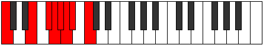 | [midi](ModeCNaturalGydian.mid) [ogg](ModeCNaturalGydian.ogg) |
| [2003](https://ianring.com/musictheory/scales/2003) | [Aeronyllic](ScaleAeronyllic.md) | [Lolyllic](ModeLolyllic.md) | C, C#, **E**, F#, **G**, **G#**, A, **A#**, C |  | [midi](ModeCNaturalLolyllic.mid) [ogg](ModeCNaturalLolyllic.ogg) |
| [2005](https://ianring.com/musictheory/scales/2005) | [Thyryllic](ScaleThyryllic.md) | [Gygyllic](ModeGygyllic.md) | C, D, **E**, **F#**, G, **G#**, A, **A#**, C |  | [midi](ModeCNaturalGygyllic.mid) [ogg](ModeCNaturalGygyllic.ogg) |
| [2007](https://ianring.com/musictheory/scales/2007) | [Kaptygic](ScaleKaptygic.md) | [Stonygic](ModeStonygic.md) | C, C#, D, **E**, F#, G, **G#**, A, **A#**, C |  | [midi](ModeCNaturalStonygic.mid) [ogg](ModeCNaturalStonygic.ogg) |
| [2009](https://ianring.com/musictheory/scales/2009) | [Stacryllic](ScaleStacryllic.md) | [Stacryllic](ModeStacryllic.md) | C, D#, **E**, **F#**, **G**, G#, A, **A#**, C |  | [midi](ModeCNaturalStacryllic.mid) [ogg](ModeCNaturalStacryllic.ogg) |
| [2011](https://ianring.com/musictheory/scales/2011) | [Koptygic](ScaleKoptygic.md) | [Raphygic](ModeRaphygic.md) | C, C#, D#, **E**, F#, **G**, G#, A, **A#**, C |  | [midi](ModeCNaturalRaphygic.mid) [ogg](ModeCNaturalRaphygic.ogg) |
| [2013](https://ianring.com/musictheory/scales/2013) | [Porygic](ScalePorygic.md) | [Mocrygic](ModeMocrygic.md) | C, D, D#, **E**, **F#**, G, G#, A, **A#**, C |  | [midi](ModeCNaturalMocrygic.mid) [ogg](ModeCNaturalMocrygic.ogg) |
| [2015](https://ianring.com/musictheory/scales/2015) | [Thydyllian](ScaleThydyllian.md) | [Epiryllian](ModeEpiryllian.md) | C, C#, D, D#, **E**, F#, G, G#, A, **A#**, C | 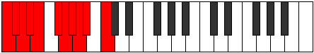 | [midi](ModeCNaturalEpiryllian.mid) [ogg](ModeCNaturalEpiryllian.ogg) |
| [2019](https://ianring.com/musictheory/scales/2019) | [Phroryllic](ScalePhroryllic.md) | [Palyllic](ModePalyllic.md) | C, C#, F, F#, **G**, **G#**, **A**, A#, C |  | [midi](ModeCNaturalPalyllic.mid) [ogg](ModeCNaturalPalyllic.ogg) |
| [2021](https://ianring.com/musictheory/scales/2021) | [Kataryllic](ScaleKataryllic.md) | [Katycryllic](ModeKatycryllic.md) | C, D, F, **F#**, G, **G#**, **A**, A#, C |  | [midi](ModeCNaturalKatycryllic.mid) [ogg](ModeCNaturalKatycryllic.ogg) |
| [2023](https://ianring.com/musictheory/scales/2023) | [Loptygic](ScaleLoptygic.md) | [Zodygic](ModeZodygic.md) | C, C#, D, F, F#, G, **G#**, **A**, A#, C |  | [midi](ModeCNaturalZodygic.mid) [ogg](ModeCNaturalZodygic.ogg) |
| [2025](https://ianring.com/musictheory/scales/2025) | [Mixolydyllic](ScaleMixolydyllic.md) | [Mixolydyllic](ModeMixolydyllic.md) | C, D#, F, **F#**, **G**, G#, **A**, A#, C | 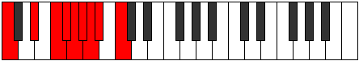 | [midi](ModeCNaturalMixolydyllic.mid) [ogg](ModeCNaturalMixolydyllic.ogg) |
| [2027](https://ianring.com/musictheory/scales/2027) | [Apinygic](ScaleApinygic.md) | [Boptygic](ModeBoptygic.md) | C, C#, D#, F, F#, **G**, G#, **A**, A#, C |  | [midi](ModeCNaturalBoptygic.mid) [ogg](ModeCNaturalBoptygic.ogg) |
| [2029](https://ianring.com/musictheory/scales/2029) | [Bagygic](ScaleBagygic.md) | [Mathygic](ModeMathygic.md) | C, D, D#, F, **F#**, G, G#, **A**, A#, C |  | [midi](ModeCNaturalMathygic.mid) [ogg](ModeCNaturalMathygic.ogg) |
| [2031](https://ianring.com/musictheory/scales/2031) | [Aerycryllian](ScaleAerycryllian.md) | [Gadyllian](ModeGadyllian.md) | C, C#, D, D#, F, F#, G, G#, **A**, A#, C |  | [midi](ModeCNaturalGadyllian.mid) [ogg](ModeCNaturalGadyllian.ogg) |
| [2033](https://ianring.com/musictheory/scales/2033) | [Stolyllic](ScaleStolyllic.md) | [Stolyllic](ModeStolyllic.md) | C, **E**, F, **F#**, **G**, **G#**, A, A#, C |  | [midi](ModeCNaturalStolyllic.mid) [ogg](ModeCNaturalStolyllic.ogg) |
| [2035](https://ianring.com/musictheory/scales/2035) | [Zothygic](ScaleZothygic.md) | [Aerythygic](ModeAerythygic.md) | C, C#, **E**, F, F#, **G**, **G#**, A, A#, C |  | [midi](ModeCNaturalAerythygic.mid) [ogg](ModeCNaturalAerythygic.ogg) |
| [2037](https://ianring.com/musictheory/scales/2037) | [Kyrygic](ScaleKyrygic.md) | [Sythygic](ModeSythygic.md) | C, D, **E**, F, **F#**, G, **G#**, A, A#, C |  | [midi](ModeCNaturalSythygic.mid) [ogg](ModeCNaturalSythygic.ogg) |
| [2039](https://ianring.com/musictheory/scales/2039) | [Staptyllian](ScaleStaptyllian.md) | [Danyllian](ModeDanyllian.md) | C, C#, D, **E**, F, F#, G, **G#**, A, A#, C |  | [midi](ModeCNaturalDanyllian.mid) [ogg](ModeCNaturalDanyllian.ogg) |
| [2041](https://ianring.com/musictheory/scales/2041) | [Aeolacrygic](ScaleAeolacrygic.md) | [Aeolacrygic](ModeAeolacrygic.md) | C, D#, **E**, F, **F#**, **G**, G#, A, A#, C |  | [midi](ModeCNaturalAeolacrygic.mid) [ogg](ModeCNaturalAeolacrygic.ogg) |
| [2043](https://ianring.com/musictheory/scales/2043) | [Gothyllian](ScaleGothyllian.md) | [Lythyllian](ModeLythyllian.md) | C, C#, D#, **E**, F, F#, **G**, G#, A, A#, C |  | [midi](ModeCNaturalLythyllian.mid) [ogg](ModeCNaturalLythyllian.ogg) |
| [2045](https://ianring.com/musictheory/scales/2045) | [Sydyllian](ScaleSydyllian.md) | [Katogyllian](ModeKatogyllian.md) | C, D, D#, **E**, F, **F#**, G, G#, A, A#, C |  | [midi](ModeCNaturalKatogyllian.mid) [ogg](ModeCNaturalKatogyllian.ogg) |
| [2047](https://ianring.com/musictheory/scales/2047) | [Aerycratic](ScaleAerycratic.md) | [Monatic](ModeMonatic.md) | C, C#, D, D#, **E**, F, F#, G, G#, A, A#, C |  | [midi](ModeCNaturalMonatic.mid) [ogg](ModeCNaturalMonatic.ogg) |
| [2185](https://ianring.com/musictheory/scales/2185) | [Aeoloric](ScaleAeoloric.md) | [Dygic](ModeDygic.md) | C, **D#**, **G**, **B**, C |  | [midi](ModeCNaturalDygic.mid) [ogg](ModeCNaturalDygic.ogg) |
| [2187](https://ianring.com/musictheory/scales/2187) | [Ranitonic](ScaleRanitonic.md) | [Ionothitonic](ModeIonothitonic.md) | C, **C#**, **D#**, **G**, **B**, C |  | [midi](ModeCNaturalIonothitonic.mid) [ogg](ModeCNaturalIonothitonic.ogg) |
| [2189](https://ianring.com/musictheory/scales/2189) | [Dolitonic](ScaleDolitonic.md) | [Zagitonic](ModeZagitonic.md) | C, **D**, **D#**, G, **B**, C |  | [midi](ModeCNaturalZagitonic.mid) [ogg](ModeCNaturalZagitonic.ogg) |
| [2191](https://ianring.com/musictheory/scales/2191) | [Ponimic](ScalePonimic.md) | [Thydimic](ModeThydimic.md) | C, **Db**, **Ebb**, **Fbb**, G, **A##**, C |  | [midi](ModeCNaturalThydimic.mid) [ogg](ModeCNaturalThydimic.ogg) |
| [2193](https://ianring.com/musictheory/scales/2193) | [Thaptic](ScaleThaptic.md) | [Thaptic](ModeThaptic.md) | C, E, **G**, **B**, C |  | [midi](ModeCNaturalThaptic.mid) [ogg](ModeCNaturalThaptic.ogg) |
| [2195](https://ianring.com/musictheory/scales/2195) | [Ionyptitonic](ScaleIonyptitonic.md) | [Zalitonic](ModeZalitonic.md) | C, **C#**, E, **G**, **B**, C |  | [midi](ModeCNaturalZalitonic.mid) [ogg](ModeCNaturalZalitonic.ogg) |
| [2197](https://ianring.com/musictheory/scales/2197) | [Lothitonic](ScaleLothitonic.md) | [Aerathitonic](ModeAerathitonic.md) | C, **D**, E, G, **B**, C |  | [midi](ModeCNaturalAerathitonic.mid) [ogg](ModeCNaturalAerathitonic.ogg) |
| [2199](https://ianring.com/musictheory/scales/2199) | [Kytrimic](ScaleKytrimic.md) | [Dyptimic](ModeDyptimic.md) | C, **Db**, **Ebb**, Fb, G, **A##**, C |  | [midi](ModeCNaturalDyptimic.mid) [ogg](ModeCNaturalDyptimic.ogg) |
| [2201](https://ianring.com/musictheory/scales/2201) | [Zothitonic](ScaleZothitonic.md) | [Ionagitonic](ModeIonagitonic.md) | C, **D#**, E, **G**, **B**, C |  | [midi](ModeCNaturalIonagitonic.mid) [ogg](ModeCNaturalIonagitonic.ogg) |
| [2203](https://ianring.com/musictheory/scales/2203) | [Aerothimic](ScaleAerothimic.md) | [Dorimic](ModeDorimic.md) | C, **Db**, **Eb**, Fb, **G**, **A##**, C |  | [midi](ModeCNaturalDorimic.mid) [ogg](ModeCNaturalDorimic.ogg) |
| [2205](https://ianring.com/musictheory/scales/2205) | [Syrimic](ScaleSyrimic.md) | [Ionocrimic](ModeIonocrimic.md) | C, **D**, **Eb**, Fb, G, **A##**, C |  | [midi](ModeCNaturalIonocrimic.mid) [ogg](ModeCNaturalIonocrimic.ogg) |
| [2207](https://ianring.com/musictheory/scales/2207) | [Katyptian](ScaleKatyptian.md) | [Mygian](ModeMygian.md) | C, **Db**, **Ebb**, **Fbb**, Gbbb, Abb, **B**, C |  | [midi](ModeCNaturalMygian.mid) [ogg](ModeCNaturalMygian.ogg) |
| [2211](https://ianring.com/musictheory/scales/2211) | [Zathitonic](ScaleZathitonic.md) | [Ionythitonic](ModeIonythitonic.md) | C, **C#**, F, **G**, **B**, C |  | [midi](ModeCNaturalIonythitonic.mid) [ogg](ModeCNaturalIonythitonic.ogg) |
| [2213](https://ianring.com/musictheory/scales/2213) | [Aeracritonic](ScaleAeracritonic.md) | [Daritonic](ModeDaritonic.md) | C, **D**, F, G, **B**, C |  | [midi](ModeCNaturalDaritonic.mid) [ogg](ModeCNaturalDaritonic.ogg) |
| [2215](https://ianring.com/musictheory/scales/2215) | [Pynimic](ScalePynimic.md) | [Ranimic](ModeRanimic.md) | C, **Db**, **Ebb**, F, G, **A##**, C |  | [midi](ModeCNaturalRanimic.mid) [ogg](ModeCNaturalRanimic.ogg) |
| [2217](https://ianring.com/musictheory/scales/2217) | [Epygitonic](ScaleEpygitonic.md) | [Kagitonic](ModeKagitonic.md) | C, **D#**, F, **G**, **B**, C |  | [midi](ModeCNaturalKagitonic.mid) [ogg](ModeCNaturalKagitonic.ogg) |
| [2219](https://ianring.com/musictheory/scales/2219) | [Mycrimic](ScaleMycrimic.md) | [Phrydimic](ModePhrydimic.md) | C, **Db**, **Eb**, F, **G**, **A##**, C |  | [midi](ModeCNaturalPhrydimic.mid) [ogg](ModeCNaturalPhrydimic.ogg) |
| [2221](https://ianring.com/musictheory/scales/2221) | [Modimic](ScaleModimic.md) | [Poptimic](ModePoptimic.md) | C, **D**, **Eb**, F, G, **A##**, C |  | [midi](ModeCNaturalPoptimic.mid) [ogg](ModeCNaturalPoptimic.ogg) |
| [2223](https://ianring.com/musictheory/scales/2223) | [Stanian](ScaleStanian.md) | [Konian](ModeKonian.md) | C, **Db**, **Ebb**, **Fbb**, Gbb, Abb, **B**, C |  | [midi](ModeCNaturalKonian.mid) [ogg](ModeCNaturalKonian.ogg) |
| [2225](https://ianring.com/musictheory/scales/2225) | [Phraditonic](ScalePhraditonic.md) | [Gonitonic](ModeGonitonic.md) | C, E, F, **G**, **B**, C |  | [midi](ModeCNaturalGonitonic.mid) [ogg](ModeCNaturalGonitonic.ogg) |
| [2227](https://ianring.com/musictheory/scales/2227) | [Bolimic](ScaleBolimic.md) | [Katadimic](ModeKatadimic.md) | C, **Db**, E, F, **G**, **A##**, C |  | [midi](ModeCNaturalKatadimic.mid) [ogg](ModeCNaturalKatadimic.ogg) |
| [2229](https://ianring.com/musictheory/scales/2229) | [Garimic](ScaleGarimic.md) | [Ionyptimic](ModeIonyptimic.md) | C, **D**, E, F, G, **A##**, C |  | [midi](ModeCNaturalIonyptimic.mid) [ogg](ModeCNaturalIonyptimic.ogg) |
| [2231](https://ianring.com/musictheory/scales/2231) | [Saptian](ScaleSaptian.md) | [Macrian](ModeMacrian.md) | C, **Db**, **Ebb**, Fb, Gbb, Abb, **B**, C |  | [midi](ModeCNaturalMacrian.mid) [ogg](ModeCNaturalMacrian.ogg) |
| [2233](https://ianring.com/musictheory/scales/2233) | [Thogimic](ScaleThogimic.md) | [Donimic](ModeDonimic.md) | C, **D#**, E, F, **G**, **A##**, C |  | [midi](ModeCNaturalDonimic.mid) [ogg](ModeCNaturalDonimic.ogg) |
| [2235](https://ianring.com/musictheory/scales/2235) | [Katacrian](ScaleKatacrian.md) | [Bathian](ModeBathian.md) | C, **Db**, **Eb**, Fb, Gbb, **Abb**, **B**, C |  | [midi](ModeCNaturalBathian.mid) [ogg](ModeCNaturalBathian.ogg) |
| [2237](https://ianring.com/musictheory/scales/2237) | [Zorian](ScaleZorian.md) | [Epothian](ModeEpothian.md) | C, **D**, **Eb**, Fb, Gbb, Abb, **B**, C |  | [midi](ModeCNaturalEpothian.mid) [ogg](ModeCNaturalEpothian.ogg) |
| [2239](https://ianring.com/musictheory/scales/2239) | [Stolyllic](ScaleStolyllic.md) | [Dacryllic](ModeDacryllic.md) | C, **C#**, **D**, **D#**, E, F, G, **B**, C |  | [midi](ModeCNaturalDacryllic.mid) [ogg](ModeCNaturalDacryllic.ogg) |
| [2245](https://ianring.com/musictheory/scales/2245) | [Phraditonic](ScalePhraditonic.md) | [Dygitonic](ModeDygitonic.md) | C, **D**, **F#**, G, B, C |  | [midi](ModeCNaturalDygitonic.mid) [ogg](ModeCNaturalDygitonic.ogg) |
| [2247](https://ianring.com/musictheory/scales/2247) | [Daptimic](ScaleDaptimic.md) | [Aeolimic](ModeAeolimic.md) | C, **Db**, **Ebb**, F#, G, A##, C |  | [midi](ModeCNaturalAeolimic.mid) [ogg](ModeCNaturalAeolimic.ogg) |
| [2249](https://ianring.com/musictheory/scales/2249) | [Lycritonic](ScaleLycritonic.md) | [Kygitonic](ModeKygitonic.md) | C, **D#**, **F#**, **G**, B, C |  | [midi](ModeCNaturalKygitonic.mid) [ogg](ModeCNaturalKygitonic.ogg) |
| [2251](https://ianring.com/musictheory/scales/2251) | [Kanimic](ScaleKanimic.md) | [Zodimic](ModeZodimic.md) | C, **Db**, **Eb**, F#, **G**, A##, C |  | [midi](ModeCNaturalZodimic.mid) [ogg](ModeCNaturalZodimic.ogg) |
| [2253](https://ianring.com/musictheory/scales/2253) | [Laptimic](ScaleLaptimic.md) | [Logimic](ModeLogimic.md) | C, **D**, **Eb**, **F#**, G, A##, C |  | [midi](ModeCNaturalLogimic.mid) [ogg](ModeCNaturalLogimic.ogg) |
| [2255](https://ianring.com/musictheory/scales/2255) | [Thycrian](ScaleThycrian.md) | [Dylian](ModeDylian.md) | C, **Db**, **Ebb**, **Fbb**, Gb, Abb, B, C |  | [midi](ModeCNaturalDylian.mid) [ogg](ModeCNaturalDylian.ogg) |
| [2257](https://ianring.com/musictheory/scales/2257) | [Zolitonic](ScaleZolitonic.md) | [Zolitonic](ModeZolitonic.md) | C, E, **F#**, **G**, B, C |  | [midi](ModeCNaturalZolitonic.mid) [ogg](ModeCNaturalZolitonic.ogg) |
| [2259](https://ianring.com/musictheory/scales/2259) | [Mythimic](ScaleMythimic.md) | [Gogimic](ModeGogimic.md) | C, **Db**, E, F#, **G**, A##, C |  | [midi](ModeCNaturalGogimic.mid) [ogg](ModeCNaturalGogimic.ogg) |
| [2261](https://ianring.com/musictheory/scales/2261) | [Bylimic](ScaleBylimic.md) | [Phrolimic](ModePhrolimic.md) | C, **D**, E, **F#**, G, A##, C |  | [midi](ModeCNaturalPhrolimic.mid) [ogg](ModeCNaturalPhrolimic.ogg) |
| [2263](https://ianring.com/musictheory/scales/2263) | [Zogian](ScaleZogian.md) | [Lycrian](ModeLycrian.md) | C, **Db**, **Ebb**, Fb, Gb, Abb, B, C |  | [midi](ModeCNaturalLycrian.mid) [ogg](ModeCNaturalLycrian.ogg) |
| [2265](https://ianring.com/musictheory/scales/2265) | [Solimic](ScaleSolimic.md) | [Ionophimic](ModeIonophimic.md) | C, **D#**, E, **F#**, **G**, A##, C |  | [midi](ModeCNaturalIonophimic.mid) [ogg](ModeCNaturalIonophimic.ogg) |
| [2267](https://ianring.com/musictheory/scales/2267) | [Aeolathian](ScaleAeolathian.md) | [Padian](ModePadian.md) | C, **Db**, **Eb**, Fb, Gb, **Abb**, B, C |  | [midi](ModeCNaturalPadian.mid) [ogg](ModeCNaturalPadian.ogg) |
| [2269](https://ianring.com/musictheory/scales/2269) | [Stythian](ScaleStythian.md) | [Pygian](ModePygian.md) | C, **D**, **Eb**, Fb, **Gb**, Abb, B, C |  | [midi](ModeCNaturalPygian.mid) [ogg](ModeCNaturalPygian.ogg) |
| [2271](https://ianring.com/musictheory/scales/2271) | [Phroryllic](ScalePhroryllic.md) | [Poptyllic](ModePoptyllic.md) | C, **C#**, **D**, **D#**, E, F#, G, B, C |  | [midi](ModeCNaturalPoptyllic.mid) [ogg](ModeCNaturalPoptyllic.ogg) |
| [2275](https://ianring.com/musictheory/scales/2275) | [Thonimic](ScaleThonimic.md) | [Thodimic](ModeThodimic.md) | C, **Db**, E#, F#, **G**, A##, C |  | [midi](ModeCNaturalThodimic.mid) [ogg](ModeCNaturalThodimic.ogg) |
| [2277](https://ianring.com/musictheory/scales/2277) | [Epygimic](ScaleEpygimic.md) | [Kagimic](ModeKagimic.md) | C, **D**, E#, **F#**, G, A##, C |  | [midi](ModeCNaturalKagimic.mid) [ogg](ModeCNaturalKagimic.ogg) |
| [2279](https://ianring.com/musictheory/scales/2279) | [Aeolacrian](ScaleAeolacrian.md) | [Dyrian](ModeDyrian.md) | C, **Db**, **Ebb**, F, Gb, Abb, B, C |  | [midi](ModeCNaturalDyrian.mid) [ogg](ModeCNaturalDyrian.ogg) |
| [2281](https://ianring.com/musictheory/scales/2281) | [Phralimic](ScalePhralimic.md) | [Rathimic](ModeRathimic.md) | C, **D#**, E#, **F#**, **G**, A##, C |  | [midi](ModeCNaturalRathimic.mid) [ogg](ModeCNaturalRathimic.ogg) |
| [2283](https://ianring.com/musictheory/scales/2283) | [Thacrian](ScaleThacrian.md) | [Aeolyptian](ModeAeolyptian.md) | C, **Db**, **Eb**, F, Gb, **Abb**, B, C |  | [midi](ModeCNaturalAeolyptian.mid) [ogg](ModeCNaturalAeolyptian.ogg) |
| [2285](https://ianring.com/musictheory/scales/2285) | [Stygian](ScaleStygian.md) | [Aerogian](ModeAerogian.md) | C, **D**, **Eb**, F, **Gb**, Abb, B, C |  | [midi](ModeCNaturalAerogian.mid) [ogg](ModeCNaturalAerogian.ogg) |
| [2287](https://ianring.com/musictheory/scales/2287) | [Aeoladyllic](ScaleAeoladyllic.md) | [Lodyllic](ModeLodyllic.md) | C, **C#**, **D**, **D#**, F, F#, G, B, C |  | [midi](ModeCNaturalLodyllic.mid) [ogg](ModeCNaturalLodyllic.ogg) |
| [2289](https://ianring.com/musictheory/scales/2289) | [Daptimic](ScaleDaptimic.md) | [Mocrimic](ModeMocrimic.md) | C, D##, E#, **F#**, **G**, A##, C |  | [midi](ModeCNaturalMocrimic.mid) [ogg](ModeCNaturalMocrimic.ogg) |
| [2291](https://ianring.com/musictheory/scales/2291) | [Ionarian](ScaleIonarian.md) | [Zydian](ModeZydian.md) | C, **Db**, E, F, Gb, **Abb**, B, C |  | [midi](ModeCNaturalZydian.mid) [ogg](ModeCNaturalZydian.ogg) |
| [2293](https://ianring.com/musictheory/scales/2293) | [Ionythian](ScaleIonythian.md) | [Gorian](ModeGorian.md) | C, **D**, E, F, **Gb**, Abb, B, C |  | [midi](ModeCNaturalGorian.mid) [ogg](ModeCNaturalGorian.ogg) |
| [2295](https://ianring.com/musictheory/scales/2295) | [Pynyllic](ScalePynyllic.md) | [Kogyllic](ModeKogyllic.md) | C, **C#**, **D**, E, F, F#, G, B, C |  | [midi](ModeCNaturalKogyllic.mid) [ogg](ModeCNaturalKogyllic.ogg) |
| [2297](https://ianring.com/musictheory/scales/2297) | [Parian](ScaleParian.md) | [Thylian](ModeThylian.md) | C, **D#**, E, F, **Gb**, **Abb**, B, C |  | [midi](ModeCNaturalThylian.mid) [ogg](ModeCNaturalThylian.ogg) |
| [2299](https://ianring.com/musictheory/scales/2299) | [Thagyllic](ScaleThagyllic.md) | [Phraptyllic](ModePhraptyllic.md) | C, **C#**, **D#**, E, F, F#, **G**, B, C |  | [midi](ModeCNaturalPhraptyllic.mid) [ogg](ModeCNaturalPhraptyllic.ogg) |
| [2301](https://ianring.com/musictheory/scales/2301) | [Dolyllic](ScaleDolyllic.md) | [Bydyllic](ModeBydyllic.md) | C, **D**, **D#**, E, F, **F#**, G, B, C |  | [midi](ModeCNaturalBydyllic.mid) [ogg](ModeCNaturalBydyllic.ogg) |
| [2303](https://ianring.com/musictheory/scales/2303) | [Manygic](ScaleManygic.md) | [Stanygic](ModeStanygic.md) | C, **C#**, **D**, **D#**, E, F, F#, G, B, C |  | [midi](ModeCNaturalStanygic.mid) [ogg](ModeCNaturalStanygic.ogg) |
| [2321](https://ianring.com/musictheory/scales/2321) | [Zyphic](ScaleZyphic.md) | [Zyphic](ModeZyphic.md) | **C**, E, **G#**, **B**, **C** |  | [midi](ModeCNaturalZyphic.mid) [ogg](ModeCNaturalZyphic.ogg) |
| [2323](https://ianring.com/musictheory/scales/2323) | [Aeolyritonic](ScaleAeolyritonic.md) | [Doptitonic](ModeDoptitonic.md) | **C**, C#, E, **G#**, **B**, **C** |  | [midi](ModeCNaturalDoptitonic.mid) [ogg](ModeCNaturalDoptitonic.ogg) |
| [2325](https://ianring.com/musictheory/scales/2325) | [Ryphitonic](ScaleRyphitonic.md) | [Pynitonic](ModePynitonic.md) | **C**, **D**, E, **G#**, **B**, **C** |  | [midi](ModeCNaturalPynitonic.mid) [ogg](ModeCNaturalPynitonic.ogg) |
| [2327](https://ianring.com/musictheory/scales/2327) | [Galimic](ScaleGalimic.md) | [Epalimic](ModeEpalimic.md) | **C**, Db, **Ebb**, Fb, **G#**, **A##**, **C** | 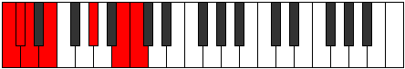 | [midi](ModeCNaturalEpalimic.mid) [ogg](ModeCNaturalEpalimic.ogg) |
| [2329](https://ianring.com/musictheory/scales/2329) | [Zacritonic](ScaleZacritonic.md) | [Styditonic](ModeStyditonic.md) | **C**, **D#**, E, G#, **B**, **C** | 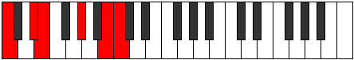 | [midi](ModeCNaturalStyditonic.mid) [ogg](ModeCNaturalStyditonic.ogg) |
| [2331](https://ianring.com/musictheory/scales/2331) | [Bygimic](ScaleBygimic.md) | [Dylimic](ModeDylimic.md) | **C**, Db, **Eb**, Fb, G#, **A##**, **C** |  | [midi](ModeCNaturalDylimic.mid) [ogg](ModeCNaturalDylimic.ogg) |
| [2333](https://ianring.com/musictheory/scales/2333) | [Lathimic](ScaleLathimic.md) | [Stynimic](ModeStynimic.md) | **C**, **D**, **Eb**, Fb, G#, **A##**, **C** |  | [midi](ModeCNaturalStynimic.mid) [ogg](ModeCNaturalStynimic.ogg) |
| [2335](https://ianring.com/musictheory/scales/2335) | [Thadian](ScaleThadian.md) | [Epydian](ModeEpydian.md) | **C**, Db, **Ebb**, **Fbb**, Gbbb, Ab, **B**, **C** | 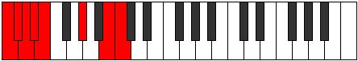 | [midi](ModeCNaturalEpydian.mid) [ogg](ModeCNaturalEpydian.ogg) |
| [2339](https://ianring.com/musictheory/scales/2339) | [Molitonic](ScaleMolitonic.md) | [Ragitonic](ModeRagitonic.md) | **C**, C#, F, **G#**, **B**, **C** |  | [midi](ModeCNaturalRagitonic.mid) [ogg](ModeCNaturalRagitonic.ogg) |
| [2341](https://ianring.com/musictheory/scales/2341) | [Thyritonic](ScaleThyritonic.md) | [Myditonic](ModeMyditonic.md) | **C**, **D**, F, **G#**, **B**, **C** |  | [midi](ModeCNaturalMyditonic.mid) [ogg](ModeCNaturalMyditonic.ogg) |
| [2343](https://ianring.com/musictheory/scales/2343) | [Epynimic](ScaleEpynimic.md) | [Tharimic](ModeTharimic.md) | **C**, Db, **Ebb**, F, **G#**, **A##**, **C** |  | [midi](ModeCNaturalTharimic.mid) [ogg](ModeCNaturalTharimic.ogg) |
| [2345](https://ianring.com/musictheory/scales/2345) | [Lyditonic](ScaleLyditonic.md) | [Gothitonic](ModeGothitonic.md) | **C**, **D#**, F, G#, **B**, **C** |  | [midi](ModeCNaturalGothitonic.mid) [ogg](ModeCNaturalGothitonic.ogg) |
| [2347](https://ianring.com/musictheory/scales/2347) | [Zagimic](ScaleZagimic.md) | [Thothimic](ModeThothimic.md) | **C**, Db, **Eb**, F, G#, **A##**, **C** |  | [midi](ModeCNaturalThothimic.mid) [ogg](ModeCNaturalThothimic.ogg) |
| [2349](https://ianring.com/musictheory/scales/2349) | [Thalimic](ScaleThalimic.md) | [Aerogimic](ModeAerogimic.md) | **C**, **D**, **Eb**, F, G#, **A##**, **C** |  | [midi](ModeCNaturalAerogimic.mid) [ogg](ModeCNaturalAerogimic.ogg) |
| [2351](https://ianring.com/musictheory/scales/2351) | [Katoptian](ScaleKatoptian.md) | [Gynian](ModeGynian.md) | **C**, Db, **Ebb**, **Fbb**, Gbb, Ab, **B**, **C** |  | [midi](ModeCNaturalGynian.mid) [ogg](ModeCNaturalGynian.ogg) |
| [2353](https://ianring.com/musictheory/scales/2353) | [Lycritonic](ScaleLycritonic.md) | [Lycritonic](ModeLycritonic.md) | **C**, E, F, **G#**, **B**, **C** |  | [midi](ModeCNaturalLycritonic.mid) [ogg](ModeCNaturalLycritonic.ogg) |
| [2355](https://ianring.com/musictheory/scales/2355) | [Mydimic](ScaleMydimic.md) | [Katycrimic](ModeKatycrimic.md) | **C**, Db, E, F, **G#**, **A##**, **C** |  | [midi](ModeCNaturalKatycrimic.mid) [ogg](ModeCNaturalKatycrimic.ogg) |
| [2357](https://ianring.com/musictheory/scales/2357) | [Dagimic](ScaleDagimic.md) | [Ionaptimic](ModeIonaptimic.md) | **C**, **D**, E, F, **G#**, **A##**, **C** |  | [midi](ModeCNaturalIonaptimic.mid) [ogg](ModeCNaturalIonaptimic.ogg) |
| [2359](https://ianring.com/musictheory/scales/2359) | [Gacrian](ScaleGacrian.md) | [Gadian](ModeGadian.md) | **C**, Db, **Ebb**, Fb, Gbb, **Ab**, **B**, **C** |  | [midi](ModeCNaturalGadian.mid) [ogg](ModeCNaturalGadian.ogg) |
| [2361](https://ianring.com/musictheory/scales/2361) | [Ionodimic](ScaleIonodimic.md) | [Docrimic](ModeDocrimic.md) | **C**, **D#**, E, F, G#, **A##**, **C** |  | [midi](ModeCNaturalDocrimic.mid) [ogg](ModeCNaturalDocrimic.ogg) |
| [2363](https://ianring.com/musictheory/scales/2363) | [Stalian](ScaleStalian.md) | [Kataptian](ModeKataptian.md) | **C**, Db, **Eb**, Fb, Gbb, Ab, **B**, **C** |  | [midi](ModeCNaturalKataptian.mid) [ogg](ModeCNaturalKataptian.ogg) |
| [2365](https://ianring.com/musictheory/scales/2365) | [Epagian](ScaleEpagian.md) | [Sythian](ModeSythian.md) | **C**, **D**, **Eb**, Fb, Gbb, Ab, **B**, **C** |  | [midi](ModeCNaturalSythian.mid) [ogg](ModeCNaturalSythian.ogg) |
| [2367](https://ianring.com/musictheory/scales/2367) | [Zaryllic](ScaleZaryllic.md) | [Laryllic](ModeLaryllic.md) | **C**, C#, **D**, **D#**, E, F, G#, **B**, **C** |  | [midi](ModeCNaturalLaryllic.mid) [ogg](ModeCNaturalLaryllic.ogg) |
| [2373](https://ianring.com/musictheory/scales/2373) | [Phronitonic](ScalePhronitonic.md) | [Dyptitonic](ModeDyptitonic.md) | **C**, **D**, **F#**, **G#**, B, **C** | 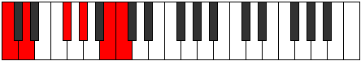 | [midi](ModeCNaturalDyptitonic.mid) [ogg](ModeCNaturalDyptitonic.ogg) |
| [2375](https://ianring.com/musictheory/scales/2375) | [Stalimic](ScaleStalimic.md) | [Aeolaptimic](ModeAeolaptimic.md) | **C**, Db, **Ebb**, F#, **G#**, A##, **C** |  | [midi](ModeCNaturalAeolaptimic.mid) [ogg](ModeCNaturalAeolaptimic.ogg) |
| [2377](https://ianring.com/musictheory/scales/2377) | [Thoditonic](ScaleThoditonic.md) | [Thoditonic](ModeThoditonic.md) | **C**, **D#**, **F#**, G#, B, **C** |  | [midi](ModeCNaturalThoditonic.mid) [ogg](ModeCNaturalThoditonic.ogg) |
| [2379](https://ianring.com/musictheory/scales/2379) | [Ionacrimic](ScaleIonacrimic.md) | [Stathimic](ModeStathimic.md) | **C**, Db, **Eb**, F#, G#, A##, **C** |  | [midi](ModeCNaturalStathimic.mid) [ogg](ModeCNaturalStathimic.ogg) |
| [2381](https://ianring.com/musictheory/scales/2381) | [Stythimic](ScaleStythimic.md) | [Sorimic](ModeSorimic.md) | **C**, **D**, **Eb**, **F#**, G#, A##, **C** |  | [midi](ModeCNaturalSorimic.mid) [ogg](ModeCNaturalSorimic.ogg) |
| [2383](https://ianring.com/musictheory/scales/2383) | [Morian](ScaleMorian.md) | [Katorian](ModeKatorian.md) | **C**, Db, **Ebb**, **Fbb**, Gb, Ab, B, **C** |  | [midi](ModeCNaturalKatorian.mid) [ogg](ModeCNaturalKatorian.ogg) |
| [2385](https://ianring.com/musictheory/scales/2385) | [Aeolanitonic](ScaleAeolanitonic.md) | [Aeolanitonic](ModeAeolanitonic.md) | **C**, E, **F#**, **G#**, B, **C** |  | [midi](ModeCNaturalAeolanitonic.mid) [ogg](ModeCNaturalAeolanitonic.ogg) |
| [2387](https://ianring.com/musictheory/scales/2387) | [Dalimic](ScaleDalimic.md) | [Paptimic](ModePaptimic.md) | **C**, Db, E, F#, **G#**, A##, **C** |  | [midi](ModeCNaturalPaptimic.mid) [ogg](ModeCNaturalPaptimic.ogg) |
| [2389](https://ianring.com/musictheory/scales/2389) | [Boptimic](ScaleBoptimic.md) | [Thynimic](ModeThynimic.md) | **C**, **D**, E, **F#**, **G#**, A##, **C** |  | [midi](ModeCNaturalThynimic.mid) [ogg](ModeCNaturalThynimic.ogg) |
| [2391](https://ianring.com/musictheory/scales/2391) | [Pagian](ScalePagian.md) | [Molian](ModeMolian.md) | **C**, Db, **Ebb**, Fb, Gb, **Ab**, B, **C** |  | [midi](ModeCNaturalMolian.mid) [ogg](ModeCNaturalMolian.ogg) |
| [2393](https://ianring.com/musictheory/scales/2393) | [Dynimic](ScaleDynimic.md) | [Zathimic](ModeZathimic.md) | **C**, **D#**, E, **F#**, G#, A##, **C** |  | [midi](ModeCNaturalZathimic.mid) [ogg](ModeCNaturalZathimic.ogg) |
| [2395](https://ianring.com/musictheory/scales/2395) | [Aerathian](ScaleAerathian.md) | [Zoptian](ModeZoptian.md) | **C**, Db, **Eb**, Fb, Gb, Ab, B, **C** |  | [midi](ModeCNaturalZoptian.mid) [ogg](ModeCNaturalZoptian.ogg) |
| [2397](https://ianring.com/musictheory/scales/2397) | [Ionanian](ScaleIonanian.md) | [Stagian](ModeStagian.md) | **C**, **D**, **Eb**, Fb, **Gb**, Ab, B, **C** |  | [midi](ModeCNaturalStagian.mid) [ogg](ModeCNaturalStagian.ogg) |
| [2399](https://ianring.com/musictheory/scales/2399) | [Kataryllic](ScaleKataryllic.md) | [Zanyllic](ModeZanyllic.md) | **C**, C#, **D**, **D#**, E, F#, G#, B, **C** |  | [midi](ModeCNaturalZanyllic.mid) [ogg](ModeCNaturalZanyllic.ogg) |
| [2403](https://ianring.com/musictheory/scales/2403) | [Epygimic](ScaleEpygimic.md) | [Lycrimic](ModeLycrimic.md) | **C**, Db, E#, F#, **G#**, A##, **C** | 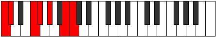 | [midi](ModeCNaturalLycrimic.mid) [ogg](ModeCNaturalLycrimic.ogg) |
| [2405](https://ianring.com/musictheory/scales/2405) | [Lythimic](ScaleLythimic.md) | [Katalimic](ModeKatalimic.md) | **C**, **D**, E#, **F#**, **G#**, A##, **C** |  | [midi](ModeCNaturalKatalimic.mid) [ogg](ModeCNaturalKatalimic.ogg) |
| [2407](https://ianring.com/musictheory/scales/2407) | [Ranian](ScaleRanian.md) | [Zylian](ModeZylian.md) | **C**, Db, **Ebb**, F, Gb, **Ab**, B, **C** |  | [midi](ModeCNaturalZylian.mid) [ogg](ModeCNaturalZylian.ogg) |
| [2409](https://ianring.com/musictheory/scales/2409) | [Zacrimic](ScaleZacrimic.md) | [Zacrimic](ModeZacrimic.md) | **C**, **D#**, E#, **F#**, G#, A##, **C** |  | [midi](ModeCNaturalZacrimic.mid) [ogg](ModeCNaturalZacrimic.ogg) |
| [2411](https://ianring.com/musictheory/scales/2411) | [Ionycrian](ScaleIonycrian.md) | [Aeolorian](ModeAeolorian.md) | **C**, Db, **Eb**, F, Gb, Ab, B, **C** |  | [midi](ModeCNaturalAeolorian.mid) [ogg](ModeCNaturalAeolorian.ogg) |
| [2413](https://ianring.com/musictheory/scales/2413) | [Mycrian](ScaleMycrian.md) | [Phrydian](ModePhrydian.md) | **C**, **D**, **Eb**, F, **Gb**, Ab, B, **C** |  | [midi](ModeCNaturalPhrydian.mid) [ogg](ModeCNaturalPhrydian.ogg) |
| [2415](https://ianring.com/musictheory/scales/2415) | [Tharyllic](ScaleTharyllic.md) | [Lothyllic](ModeLothyllic.md) | **C**, C#, **D**, **D#**, F, F#, G#, B, **C** |  | [midi](ModeCNaturalLothyllic.mid) [ogg](ModeCNaturalLothyllic.ogg) |
| [2417](https://ianring.com/musictheory/scales/2417) | [Kanimic](ScaleKanimic.md) | [Kanimic](ModeKanimic.md) | **C**, D##, E#, **F#**, **G#**, A##, **C** |  | [midi](ModeCNaturalKanimic.mid) [ogg](ModeCNaturalKanimic.ogg) |
| [2419](https://ianring.com/musictheory/scales/2419) | [Epogian](ScaleEpogian.md) | [Paptian](ModePaptian.md) | **C**, Db, E, F, Gb, **Ab**, B, **C** |  | [midi](ModeCNaturalPaptian.mid) [ogg](ModeCNaturalPaptian.ogg) |
| [2421](https://ianring.com/musictheory/scales/2421) | [Korian](ScaleKorian.md) | [Malian](ModeMalian.md) | **C**, **D**, E, F, **Gb**, **Ab**, B, **C** |  | [midi](ModeCNaturalMalian.mid) [ogg](ModeCNaturalMalian.ogg) |
| [2423](https://ianring.com/musictheory/scales/2423) | [Zagyllic](ScaleZagyllic.md) | [Thorcryllic](ModeThorcryllic.md) | **C**, C#, **D**, E, F, F#, **G#**, B, **C** |  | [midi](ModeCNaturalThorcryllic.mid) [ogg](ModeCNaturalThorcryllic.ogg) |
| [2425](https://ianring.com/musictheory/scales/2425) | [Zarian](ScaleZarian.md) | [Rorian](ModeRorian.md) | **C**, **D#**, E, F, **Gb**, Ab, B, **C** |  | [midi](ModeCNaturalRorian.mid) [ogg](ModeCNaturalRorian.ogg) |
| [2427](https://ianring.com/musictheory/scales/2427) | [Dagyllic](ScaleDagyllic.md) | [Katoryllic](ModeKatoryllic.md) | **C**, C#, **D#**, E, F, F#, G#, B, **C** |  | [midi](ModeCNaturalKatoryllic.mid) [ogg](ModeCNaturalKatoryllic.ogg) |
| [2429](https://ianring.com/musictheory/scales/2429) | [Stacryllic](ScaleStacryllic.md) | [Kadyllic](ModeKadyllic.md) | **C**, **D**, **D#**, E, F, **F#**, G#, B, **C** |  | [midi](ModeCNaturalKadyllic.mid) [ogg](ModeCNaturalKadyllic.ogg) |
| [2431](https://ianring.com/musictheory/scales/2431) | [Aeolacrygic](ScaleAeolacrygic.md) | [Gythygic](ModeGythygic.md) | **C**, C#, **D**, **D#**, E, F, F#, G#, B, **C** |  | [midi](ModeCNaturalGythygic.mid) [ogg](ModeCNaturalGythygic.ogg) |
| [2441](https://ianring.com/musictheory/scales/2441) | [Zothitonic](ScaleZothitonic.md) | [Kyritonic](ModeKyritonic.md) | C, **D#**, **G**, G#, **B**, C |  | [midi](ModeCNaturalKyritonic.mid) [ogg](ModeCNaturalKyritonic.ogg) |
| [2443](https://ianring.com/musictheory/scales/2443) | [Thogimic](ScaleThogimic.md) | [Panimic](ModePanimic.md) | C, Db, **Eb**, **F##**, G#, **A##**, C |  | [midi](ModeCNaturalPanimic.mid) [ogg](ModeCNaturalPanimic.ogg) |
| [2445](https://ianring.com/musictheory/scales/2445) | [Solimic](ScaleSolimic.md) | [Zadimic](ModeZadimic.md) | C, **D**, **Eb**, F##, G#, **A##**, C | 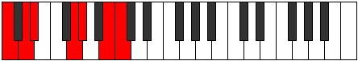 | [midi](ModeCNaturalZadimic.mid) [ogg](ModeCNaturalZadimic.ogg) |
| [2447](https://ianring.com/musictheory/scales/2447) | [Parian](ScaleParian.md) | [Thagian](ModeThagian.md) | C, Db, **Ebb**, **Fbb**, G, Ab, **B**, C |  | [midi](ModeCNaturalThagian.mid) [ogg](ModeCNaturalThagian.ogg) |
| [2449](https://ianring.com/musictheory/scales/2449) | [Zacritonic](ScaleZacritonic.md) | [Zacritonic](ModeZacritonic.md) | C, E, **G**, **G#**, **B**, C |  | [midi](ModeCNaturalZacritonic.mid) [ogg](ModeCNaturalZacritonic.ogg) |
| [2451](https://ianring.com/musictheory/scales/2451) | [Ionodimic](ScaleIonodimic.md) | [Aerynimic](ModeAerynimic.md) | C, Db, E, **F##**, **G#**, **A##**, C |  | [midi](ModeCNaturalAerynimic.mid) [ogg](ModeCNaturalAerynimic.ogg) |
| [2453](https://ianring.com/musictheory/scales/2453) | [Dynimic](ScaleDynimic.md) | [Stonimic](ModeStonimic.md) | C, **D**, E, F##, **G#**, **A##**, C |  | [midi](ModeCNaturalStonimic.mid) [ogg](ModeCNaturalStonimic.ogg) |
| [2455](https://ianring.com/musictheory/scales/2455) | [Zarian](ScaleZarian.md) | [Bothian](ModeBothian.md) | C, Db, **Ebb**, Fb, G, **Ab**, **B**, C |  | [midi](ModeCNaturalBothian.mid) [ogg](ModeCNaturalBothian.ogg) |
| [2457](https://ianring.com/musictheory/scales/2457) | [Ionythimic](ScaleIonythimic.md) | [Ionythimic](ModeIonythimic.md) | C, **D#**, E, **F##**, G#, **A##**, C |  | [midi](ModeCNaturalIonythimic.mid) [ogg](ModeCNaturalIonythimic.ogg) |
| [2459](https://ianring.com/musictheory/scales/2459) | [Tholian](ScaleTholian.md) | [Ionocrian](ModeIonocrian.md) | C, Db, **Eb**, Fb, **G**, Ab, **B**, C |  | [midi](ModeCNaturalIonocrian.mid) [ogg](ModeCNaturalIonocrian.ogg) |
| [2461](https://ianring.com/musictheory/scales/2461) | [Katathian](ScaleKatathian.md) | [Sagian](ModeSagian.md) | C, **D**, **Eb**, Fb, G, Ab, **B**, C |  | [midi](ModeCNaturalSagian.mid) [ogg](ModeCNaturalSagian.ogg) |
| [2463](https://ianring.com/musictheory/scales/2463) | [Ioniptyllic](ScaleIoniptyllic.md) | [Ionathyllic](ModeIonathyllic.md) | C, C#, **D**, **D#**, E, G, G#, **B**, C |  | [midi](ModeCNaturalIonathyllic.mid) [ogg](ModeCNaturalIonathyllic.ogg) |
| [2467](https://ianring.com/musictheory/scales/2467) | [Katythimic](ScaleKatythimic.md) | [Morimic](ModeMorimic.md) | C, Db, E#, **F##**, **G#**, **A##**, C |  | [midi](ModeCNaturalMorimic.mid) [ogg](ModeCNaturalMorimic.ogg) |
| [2469](https://ianring.com/musictheory/scales/2469) | [Bocrimic](ScaleBocrimic.md) | [Staptimic](ModeStaptimic.md) | C, **D**, E#, F##, **G#**, **A##**, C |  | [midi](ModeCNaturalStaptimic.mid) [ogg](ModeCNaturalStaptimic.ogg) |
| [2471](https://ianring.com/musictheory/scales/2471) | [Katocrian](ScaleKatocrian.md) | [Eparian](ModeEparian.md) | C, Db, **Ebb**, F, G, **Ab**, **B**, C |  | [midi](ModeCNaturalEparian.mid) [ogg](ModeCNaturalEparian.ogg) |
| [2473](https://ianring.com/musictheory/scales/2473) | [Mothimic](ScaleMothimic.md) | [Mothimic](ModeMothimic.md) | C, **D#**, E#, **F##**, G#, **A##**, C |  | [midi](ModeCNaturalMothimic.mid) [ogg](ModeCNaturalMothimic.ogg) |
| [2475](https://ianring.com/musictheory/scales/2475) | [Dolian](ScaleDolian.md) | [Aerylian](ModeAerylian.md) | C, Db, **Eb**, F, **G**, Ab, **B**, C |  | [midi](ModeCNaturalAerylian.mid) [ogg](ModeCNaturalAerylian.ogg) |
| [2477](https://ianring.com/musictheory/scales/2477) | [Bycrian](ScaleBycrian.md) | [Mydian](ModeMydian.md) | C, **D**, **Eb**, F, G, Ab, **B**, C |  | [midi](ModeCNaturalMydian.mid) [ogg](ModeCNaturalMydian.ogg) |
| [2479](https://ianring.com/musictheory/scales/2479) | [Gythyllic](ScaleGythyllic.md) | [Rycryllic](ModeRycryllic.md) | C, C#, **D**, **D#**, F, G, G#, **B**, C |  | [midi](ModeCNaturalRycryllic.mid) [ogg](ModeCNaturalRycryllic.ogg) |
| [2481](https://ianring.com/musictheory/scales/2481) | [Laptimic](ScaleLaptimic.md) | [Laptimic](ModeLaptimic.md) | C, D##, E#, **F##**, **G#**, **A##**, C |  | [midi](ModeCNaturalLaptimic.mid) [ogg](ModeCNaturalLaptimic.ogg) |
| [2483](https://ianring.com/musictheory/scales/2483) | [Loptian](ScaleLoptian.md) | [Aerynian](ModeAerynian.md) | C, Db, E, F, **G**, **Ab**, **B**, C |  | [midi](ModeCNaturalAerynian.mid) [ogg](ModeCNaturalAerynian.ogg) |
| [2485](https://ianring.com/musictheory/scales/2485) | [Palian](ScalePalian.md) | [Aerorian](ModeAerorian.md) | C, **D**, E, F, G, **Ab**, **B**, C |  | [midi](ModeCNaturalAerorian.mid) [ogg](ModeCNaturalAerorian.ogg) |
| [2487](https://ianring.com/musictheory/scales/2487) | [Aeolathyllic](ScaleAeolathyllic.md) | [Phroptyllic](ModePhroptyllic.md) | C, C#, **D**, E, F, G, **G#**, **B**, C |  | [midi](ModeCNaturalPhroptyllic.mid) [ogg](ModeCNaturalPhroptyllic.ogg) |
| [2489](https://ianring.com/musictheory/scales/2489) | [Tholian](ScaleTholian.md) | [Syrian](ModeSyrian.md) | C, **D#**, E, F, **G**, Ab, **B**, C |  | [midi](ModeCNaturalSyrian.mid) [ogg](ModeCNaturalSyrian.ogg) |
| [2491](https://ianring.com/musictheory/scales/2491) | [Lonyllic](ScaleLonyllic.md) | [Layllic](ModeLayllic.md) | C, C#, **D#**, E, F, **G**, G#, **B**, C |  | [midi](ModeCNaturalLayllic.mid) [ogg](ModeCNaturalLayllic.ogg) |
| [2493](https://ianring.com/musictheory/scales/2493) | [Doptyllic](ScaleDoptyllic.md) | [Manyllic](ModeManyllic.md) | C, **D**, **D#**, E, F, G, G#, **B**, C |  | [midi](ModeCNaturalManyllic.mid) [ogg](ModeCNaturalManyllic.ogg) |
| [2495](https://ianring.com/musictheory/scales/2495) | [Zothygic](ScaleZothygic.md) | [Aeolocrygic](ModeAeolocrygic.md) | C, C#, **D**, **D#**, E, F, G, G#, **B**, C |  | [midi](ModeCNaturalAeolocrygic.mid) [ogg](ModeCNaturalAeolocrygic.ogg) |
| [2501](https://ianring.com/musictheory/scales/2501) | [Bolimic](ScaleBolimic.md) | [Ralimic](ModeRalimic.md) | C, **D**, **E##**, F##, **G#**, A##, C |  | [midi](ModeCNaturalRalimic.mid) [ogg](ModeCNaturalRalimic.ogg) |
| [2503](https://ianring.com/musictheory/scales/2503) | [Ionarian](ScaleIonarian.md) | [Stonian](ModeStonian.md) | C, Db, **Ebb**, F#, G, **Ab**, B, C |  | [midi](ModeCNaturalStonian.mid) [ogg](ModeCNaturalStonian.ogg) |
| [2505](https://ianring.com/musictheory/scales/2505) | [Mydimic](ScaleMydimic.md) | [Mydimic](ModeMydimic.md) | C, **D#**, **E##**, **F##**, G#, A##, C |  | [midi](ModeCNaturalMydimic.mid) [ogg](ModeCNaturalMydimic.ogg) |
| [2507](https://ianring.com/musictheory/scales/2507) | [Epogian](ScaleEpogian.md) | [Ionyphian](ModeIonyphian.md) | C, Db, **Eb**, F#, **G**, Ab, B, C |  | [midi](ModeCNaturalIonyphian.mid) [ogg](ModeCNaturalIonyphian.ogg) |
| [2509](https://ianring.com/musictheory/scales/2509) | [Loptian](ScaleLoptian.md) | [Bogian](ModeBogian.md) | C, **D**, **Eb**, **F#**, G, Ab, B, C |  | [midi](ModeCNaturalBogian.mid) [ogg](ModeCNaturalBogian.ogg) |
| [2511](https://ianring.com/musictheory/scales/2511) | [Locryllic](ScaleLocryllic.md) | [Epyryllic](ModeEpyryllic.md) | C, C#, **D**, **D#**, F#, G, G#, B, C |  | [midi](ModeCNaturalEpyryllic.mid) [ogg](ModeCNaturalEpyryllic.ogg) |
| [2513](https://ianring.com/musictheory/scales/2513) | [Aerycrimic](ScaleAerycrimic.md) | [Aerycrimic](ModeAerycrimic.md) | C, D##, **E##**, **F##**, **G#**, A##, C |  | [midi](ModeCNaturalAerycrimic.mid) [ogg](ModeCNaturalAerycrimic.ogg) |
| [2515](https://ianring.com/musictheory/scales/2515) | [Epathian](ScaleEpathian.md) | [Stylian](ModeStylian.md) | C, Db, E, F#, **G**, **Ab**, B, C |  | [midi](ModeCNaturalStylian.mid) [ogg](ModeCNaturalStylian.ogg) |
| [2517](https://ianring.com/musictheory/scales/2517) | [Golian](ScaleGolian.md) | [Ryphian](ModeRyphian.md) | C, **D**, E, **F#**, G, **Ab**, B, C |  | [midi](ModeCNaturalRyphian.mid) [ogg](ModeCNaturalRyphian.ogg) |
| [2519](https://ianring.com/musictheory/scales/2519) | [Bacryllic](ScaleBacryllic.md) | [Dathyllic](ModeDathyllic.md) | C, C#, **D**, E, F#, G, **G#**, B, C |  | [midi](ModeCNaturalDathyllic.mid) [ogg](ModeCNaturalDathyllic.ogg) |
| [2521](https://ianring.com/musictheory/scales/2521) | [Katathian](ScaleKatathian.md) | [Barian](ModeBarian.md) | C, **D#**, E, **F#**, **G**, Ab, B, C |  | [midi](ModeCNaturalBarian.mid) [ogg](ModeCNaturalBarian.ogg) |
| [2523](https://ianring.com/musictheory/scales/2523) | [Dydyllic](ScaleDydyllic.md) | [Rygyllic](ModeRygyllic.md) | C, C#, **D#**, E, F#, **G**, G#, B, C |  | [midi](ModeCNaturalRygyllic.mid) [ogg](ModeCNaturalRygyllic.ogg) |
| [2525](https://ianring.com/musictheory/scales/2525) | [Thyptyllic](ScaleThyptyllic.md) | [Aeolaryllic](ModeAeolaryllic.md) | C, **D**, **D#**, E, **F#**, G, G#, B, C |  | [midi](ModeCNaturalAeolaryllic.mid) [ogg](ModeCNaturalAeolaryllic.ogg) |
| [2527](https://ianring.com/musictheory/scales/2527) | [Loptygic](ScaleLoptygic.md) | [Phradygic](ModePhradygic.md) | C, C#, **D**, **D#**, E, F#, G, G#, B, C |  | [midi](ModeCNaturalPhradygic.mid) [ogg](ModeCNaturalPhradygic.ogg) |
| [2531](https://ianring.com/musictheory/scales/2531) | [Aeolacrian](ScaleAeolacrian.md) | [Danian](ModeDanian.md) | C, Db, E#, F#, **G**, **Ab**, B, C |  | [midi](ModeCNaturalDanian.mid) [ogg](ModeCNaturalDanian.ogg) |
| [2533](https://ianring.com/musictheory/scales/2533) | [Ranian](ScaleRanian.md) | [Podian](ModePodian.md) | C, **D**, E#, **F#**, G, **Ab**, B, C | 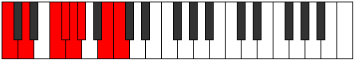 | [midi](ModeCNaturalPodian.mid) [ogg](ModeCNaturalPodian.ogg) |
| [2535](https://ianring.com/musictheory/scales/2535) | [Sydyllic](ScaleSydyllic.md) | [Zygyllic](ModeZygyllic.md) | C, C#, **D**, F, F#, G, **G#**, B, C |  | [midi](ModeCNaturalZygyllic.mid) [ogg](ModeCNaturalZygyllic.ogg) |
| [2537](https://ianring.com/musictheory/scales/2537) | [Laptian](ScaleLaptian.md) | [Laptian](ModeLaptian.md) | C, **D#**, E#, **F#**, **G**, Ab, B, C |  | [midi](ModeCNaturalLaptian.mid) [ogg](ModeCNaturalLaptian.ogg) |
| [2539](https://ianring.com/musictheory/scales/2539) | [Aeracryllic](ScaleAeracryllic.md) | [Thonyllic](ModeThonyllic.md) | C, C#, **D#**, F, F#, **G**, G#, B, C |  | [midi](ModeCNaturalThonyllic.mid) [ogg](ModeCNaturalThonyllic.ogg) |
| [2541](https://ianring.com/musictheory/scales/2541) | [Maptyllic](ScaleMaptyllic.md) | [Katadyllic](ModeKatadyllic.md) | C, **D**, **D#**, F, **F#**, G, G#, B, C |  | [midi](ModeCNaturalKatadyllic.mid) [ogg](ModeCNaturalKatadyllic.ogg) |
| [2543](https://ianring.com/musictheory/scales/2543) | [Dycrygic](ScaleDycrygic.md) | [Dydygic](ModeDydygic.md) | C, C#, **D**, **D#**, F, F#, G, G#, B, C |  | [midi](ModeCNaturalDydygic.mid) [ogg](ModeCNaturalDydygic.ogg) |
| [2545](https://ianring.com/musictheory/scales/2545) | [Thycrian](ScaleThycrian.md) | [Thycrian](ModeThycrian.md) | C, D##, E#, **F#**, **G**, **Ab**, B, C |  | [midi](ModeCNaturalThycrian.mid) [ogg](ModeCNaturalThycrian.ogg) |
| [2547](https://ianring.com/musictheory/scales/2547) | [Locryllic](ScaleLocryllic.md) | [Sogyllic](ModeSogyllic.md) | C, C#, E, F, F#, **G**, **G#**, B, C |  | [midi](ModeCNaturalSogyllic.mid) [ogg](ModeCNaturalSogyllic.ogg) |
| [2549](https://ianring.com/musictheory/scales/2549) | [Aeolothyllic](ScaleAeolothyllic.md) | [Rydyllic](ModeRydyllic.md) | C, **D**, E, F, **F#**, G, **G#**, B, C |  | [midi](ModeCNaturalRydyllic.mid) [ogg](ModeCNaturalRydyllic.ogg) |
| [2551](https://ianring.com/musictheory/scales/2551) | [Mixolydygic](ScaleMixolydygic.md) | [Zoptygic](ModeZoptygic.md) | C, C#, **D**, E, F, F#, G, **G#**, B, C |  | [midi](ModeCNaturalZoptygic.mid) [ogg](ModeCNaturalZoptygic.ogg) |
| [2553](https://ianring.com/musictheory/scales/2553) | [Ioniptyllic](ScaleIoniptyllic.md) | [Aeolaptyllic](ModeAeolaptyllic.md) | C, **D#**, E, F, **F#**, **G**, G#, B, C |  | [midi](ModeCNaturalAeolaptyllic.mid) [ogg](ModeCNaturalAeolaptyllic.ogg) |
| [2555](https://ianring.com/musictheory/scales/2555) | [Kalygic](ScaleKalygic.md) | [Bythygic](ModeBythygic.md) | C, C#, **D#**, E, F, F#, **G**, G#, B, C |  | [midi](ModeCNaturalBythygic.mid) [ogg](ModeCNaturalBythygic.ogg) |
| [2557](https://ianring.com/musictheory/scales/2557) | [Phrygic](ScalePhrygic.md) | [Dothygic](ModeDothygic.md) | C, **D**, **D#**, E, F, **F#**, G, G#, B, C |  | [midi](ModeCNaturalDothygic.mid) [ogg](ModeCNaturalDothygic.ogg) |
| [2559](https://ianring.com/musictheory/scales/2559) | [Katoryllian](ScaleKatoryllian.md) | [Zogyllian](ModeZogyllian.md) | C, C#, **D**, **D#**, E, F, F#, G, G#, B, C |  | [midi](ModeCNaturalZogyllian.mid) [ogg](ModeCNaturalZogyllian.ogg) |
| [2595](https://ianring.com/musictheory/scales/2595) | [Zylitonic](ScaleZylitonic.md) | [Rolitonic](ModeRolitonic.md) | **C**, **C#**, F, **A**, **B**, **C** |  | [midi](ModeCNaturalRolitonic.mid) [ogg](ModeCNaturalRolitonic.ogg) |
| [2597](https://ianring.com/musictheory/scales/2597) | [Aeolacritonic](ScaleAeolacritonic.md) | [Koptitonic](ModeKoptitonic.md) | **C**, D, F, **A**, **B**, **C** |  | [midi](ModeCNaturalKoptitonic.mid) [ogg](ModeCNaturalKoptitonic.ogg) |
| [2599](https://ianring.com/musictheory/scales/2599) | [Kocrimic](ScaleKocrimic.md) | [Malimic](ModeMalimic.md) | **C**, **Db**, Ebb, F, **G##**, **A##**, **C** |  | [midi](ModeCNaturalMalimic.mid) [ogg](ModeCNaturalMalimic.ogg) |
| [2601](https://ianring.com/musictheory/scales/2601) | [Ionoditonic](ScaleIonoditonic.md) | [Docritonic](ModeDocritonic.md) | **C**, **D#**, F, **A**, **B**, **C** |  | [midi](ModeCNaturalDocritonic.mid) [ogg](ModeCNaturalDocritonic.ogg) |
| [2603](https://ianring.com/musictheory/scales/2603) | [Gacrimic](ScaleGacrimic.md) | [Gadimic](ModeGadimic.md) | **C**, **Db**, **Eb**, F, **G##**, **A##**, **C** |  | [midi](ModeCNaturalGadimic.mid) [ogg](ModeCNaturalGadimic.ogg) |
| [2605](https://ianring.com/musictheory/scales/2605) | [Manimic](ScaleManimic.md) | [Rylimic](ModeRylimic.md) | **C**, D, **Eb**, F, **G##**, **A##**, **C** |  | [midi](ModeCNaturalRylimic.mid) [ogg](ModeCNaturalRylimic.ogg) |
| [2607](https://ianring.com/musictheory/scales/2607) | [Gydian](ScaleGydian.md) | [Aerolian](ModeAerolian.md) | **C**, **Db**, Ebb, **Fbb**, Gbb, **A**, **B**, **C** |  | [midi](ModeCNaturalAerolian.mid) [ogg](ModeCNaturalAerolian.ogg) |
| [2609](https://ianring.com/musictheory/scales/2609) | [Zolitonic](ScaleZolitonic.md) | [Paptitonic](ModePaptitonic.md) | **C**, E, F, A, **B**, **C** |  | [midi](ModeCNaturalPaptitonic.mid) [ogg](ModeCNaturalPaptitonic.ogg) |
| [2611](https://ianring.com/musictheory/scales/2611) | [Aerycrimic](ScaleAerycrimic.md) | [Lyrimic](ModeLyrimic.md) | **C**, **Db**, E, F, G##, **A##**, **C** |  | [midi](ModeCNaturalLyrimic.mid) [ogg](ModeCNaturalLyrimic.ogg) |
| [2613](https://ianring.com/musictheory/scales/2613) | [Dyrimic](ScaleDyrimic.md) | [Aeolanimic](ModeAeolanimic.md) | **C**, D, E, F, G##, **A##**, **C** |  | [midi](ModeCNaturalAeolanimic.mid) [ogg](ModeCNaturalAeolanimic.ogg) |
| [2615](https://ianring.com/musictheory/scales/2615) | [Epycrian](ScaleEpycrian.md) | [Thoptian](ModeThoptian.md) | **C**, **Db**, Ebb, Fb, Gbb, A, **B**, **C** |  | [midi](ModeCNaturalThoptian.mid) [ogg](ModeCNaturalThoptian.ogg) |
| [2617](https://ianring.com/musictheory/scales/2617) | [Katythimic](ScaleKatythimic.md) | [Pylimic](ModePylimic.md) | **C**, **D#**, E, F, G##, **A##**, **C** |  | [midi](ModeCNaturalPylimic.mid) [ogg](ModeCNaturalPylimic.ogg) |
| [2619](https://ianring.com/musictheory/scales/2619) | [Katogian](ScaleKatogian.md) | [Ionyrian](ModeIonyrian.md) | **C**, **Db**, **Eb**, Fb, Gbb, A, **B**, **C** |  | [midi](ModeCNaturalIonyrian.mid) [ogg](ModeCNaturalIonyrian.ogg) |
| [2621](https://ianring.com/musictheory/scales/2621) | [Aeopian](ScaleAeopian.md) | [Ionogian](ModeIonogian.md) | **C**, D, **Eb**, Fb, Gbb, A, **B**, **C** |  | [midi](ModeCNaturalIonogian.mid) [ogg](ModeCNaturalIonogian.ogg) |
| [2623](https://ianring.com/musictheory/scales/2623) | [Stycryllic](ScaleStycryllic.md) | [Aerylyllic](ModeAerylyllic.md) | **C**, **C#**, D, **D#**, E, F, A, **B**, **C** |  | [midi](ModeCNaturalAerylyllic.mid) [ogg](ModeCNaturalAerylyllic.ogg) |
| [2629](https://ianring.com/musictheory/scales/2629) | [Ionaditonic](ScaleIonaditonic.md) | [Aeolythitonic](ModeAeolythitonic.md) | **C**, D, **F#**, **A**, B, **C** |  | [midi](ModeCNaturalAeolythitonic.mid) [ogg](ModeCNaturalAeolythitonic.ogg) |
| [2631](https://ianring.com/musictheory/scales/2631) | [Starimic](ScaleStarimic.md) | [Macrimic](ModeMacrimic.md) | **C**, **Db**, Ebb, F#, **G##**, A##, **C** |  | [midi](ModeCNaturalMacrimic.mid) [ogg](ModeCNaturalMacrimic.ogg) |
| [2633](https://ianring.com/musictheory/scales/2633) | [Mixitonic](ScaleMixitonic.md) | [Mixitonic](ModeMixitonic.md) | **C**, **D#**, **F#**, **A**, B, **C** |  | [midi](ModeCNaturalMixitonic.mid) [ogg](ModeCNaturalMixitonic.ogg) |
| [2635](https://ianring.com/musictheory/scales/2635) | [Thagimic](ScaleThagimic.md) | [Gocrimic](ModeGocrimic.md) | **C**, **Db**, **Eb**, F#, **G##**, A##, **C** |  | [midi](ModeCNaturalGocrimic.mid) [ogg](ModeCNaturalGocrimic.ogg) |
| [2637](https://ianring.com/musictheory/scales/2637) | [Thoptimic](ScaleThoptimic.md) | [Aeolonimic](ModeAeolonimic.md) | **C**, D, **Eb**, **F#**, **G##**, A##, **C** |  | [midi](ModeCNaturalAeolonimic.mid) [ogg](ModeCNaturalAeolonimic.ogg) |
| [2639](https://ianring.com/musictheory/scales/2639) | [Bonian](ScaleBonian.md) | [Dothian](ModeDothian.md) | **C**, **Db**, Ebb, **Fbb**, Gb, **A**, B, **C** |  | [midi](ModeCNaturalDothian.mid) [ogg](ModeCNaturalDothian.ogg) |
| [2641](https://ianring.com/musictheory/scales/2641) | [Gathitonic](ScaleGathitonic.md) | [Gathitonic](ModeGathitonic.md) | **C**, E, **F#**, A, B, **C** |  | [midi](ModeCNaturalGathitonic.mid) [ogg](ModeCNaturalGathitonic.ogg) |
| [2643](https://ianring.com/musictheory/scales/2643) | [Mixolimic](ScaleMixolimic.md) | [Lydimic](ModeLydimic.md) | **C**, **Db**, E, F#, G##, A##, **C** |  | [midi](ModeCNaturalLydimic.mid) [ogg](ModeCNaturalLydimic.ogg) |
| [2645](https://ianring.com/musictheory/scales/2645) | [Phracrimic](ScalePhracrimic.md) | [Zoptimic](ModeZoptimic.md) | **C**, D, E, **F#**, G##, A##, **C** |  | [midi](ModeCNaturalZoptimic.mid) [ogg](ModeCNaturalZoptimic.ogg) |
| [2647](https://ianring.com/musictheory/scales/2647) | [Stathian](ScaleStathian.md) | [Dadian](ModeDadian.md) | **C**, **Db**, Ebb, Fb, Gb, A, B, **C** |  | [midi](ModeCNaturalDadian.mid) [ogg](ModeCNaturalDadian.ogg) |
| [2649](https://ianring.com/musictheory/scales/2649) | [Bocrimic](ScaleBocrimic.md) | [Aeolythimic](ModeAeolythimic.md) | **C**, **D#**, E, **F#**, G##, A##, **C** |  | [midi](ModeCNaturalAeolythimic.mid) [ogg](ModeCNaturalAeolythimic.ogg) |
| [2651](https://ianring.com/musictheory/scales/2651) | [Rythian](ScaleRythian.md) | [Panian](ModePanian.md) | **C**, **Db**, **Eb**, Fb, Gb, A, B, **C** |  | [midi](ModeCNaturalPanian.mid) [ogg](ModeCNaturalPanian.ogg) |
| [2653](https://ianring.com/musictheory/scales/2653) | [Ionopian](ScaleIonopian.md) | [Sygian](ModeSygian.md) | **C**, D, **Eb**, Fb, **Gb**, A, B, **C** |  | [midi](ModeCNaturalSygian.mid) [ogg](ModeCNaturalSygian.ogg) |
| [2655](https://ianring.com/musictheory/scales/2655) | [Mixolydyllic](ScaleMixolydyllic.md) | [Thocryllic](ModeThocryllic.md) | **C**, **C#**, D, **D#**, E, F#, A, B, **C** |  | [midi](ModeCNaturalThocryllic.mid) [ogg](ModeCNaturalThocryllic.ogg) |
| [2659](https://ianring.com/musictheory/scales/2659) | [Phralimic](ScalePhralimic.md) | [Katynimic](ModeKatynimic.md) | **C**, **Db**, E#, F#, **G##**, A##, **C** |  | [midi](ModeCNaturalKatynimic.mid) [ogg](ModeCNaturalKatynimic.ogg) |
| [2661](https://ianring.com/musictheory/scales/2661) | [Zacrimic](ScaleZacrimic.md) | [Stydimic](ModeStydimic.md) | **C**, D, E#, **F#**, **G##**, A##, **C** |  | [midi](ModeCNaturalStydimic.mid) [ogg](ModeCNaturalStydimic.ogg) |
| [2663](https://ianring.com/musictheory/scales/2663) | [Laptian](ScaleLaptian.md) | [Lalian](ModeLalian.md) | **C**, **Db**, Ebb, F, Gb, **A**, B, **C** |  | [midi](ModeCNaturalLalian.mid) [ogg](ModeCNaturalLalian.ogg) |
| [2665](https://ianring.com/musictheory/scales/2665) | [Aeradimic](ScaleAeradimic.md) | [Aeradimic](ModeAeradimic.md) | **C**, **D#**, E#, **F#**, **G##**, A##, **C** |  | [midi](ModeCNaturalAeradimic.mid) [ogg](ModeCNaturalAeradimic.ogg) |
| [2667](https://ianring.com/musictheory/scales/2667) | [Eporian](ScaleEporian.md) | [Byrian](ModeByrian.md) | **C**, **Db**, **Eb**, F, Gb, **A**, B, **C** |  | [midi](ModeCNaturalByrian.mid) [ogg](ModeCNaturalByrian.ogg) |
| [2669](https://ianring.com/musictheory/scales/2669) | [Pogian](ScalePogian.md) | [Gamian](ModeGamian.md) | **C**, D, **Eb**, F, **Gb**, **A**, B, **C** |  | [midi](ModeCNaturalGamian.mid) [ogg](ModeCNaturalGamian.ogg) |
| [2671](https://ianring.com/musictheory/scales/2671) | [Aeronyllic](ScaleAeronyllic.md) | [Lylyllic](ModeLylyllic.md) | **C**, **C#**, D, **D#**, F, F#, **A**, B, **C** |  | [midi](ModeCNaturalLylyllic.mid) [ogg](ModeCNaturalLylyllic.ogg) |
| [2673](https://ianring.com/musictheory/scales/2673) | [Mythimic](ScaleMythimic.md) | [Mythimic](ModeMythimic.md) | **C**, D##, E#, **F#**, G##, A##, **C** |  | [midi](ModeCNaturalMythimic.mid) [ogg](ModeCNaturalMythimic.ogg) |
| [2675](https://ianring.com/musictheory/scales/2675) | [Epathian](ScaleEpathian.md) | [Gogian](ModeGogian.md) | **C**, **Db**, E, F, Gb, A, B, **C** |  | [midi](ModeCNaturalGogian.mid) [ogg](ModeCNaturalGogian.ogg) |
| [2677](https://ianring.com/musictheory/scales/2677) | [Thonian](ScaleThonian.md) | [Thodian](ModeThodian.md) | **C**, D, E, F, **Gb**, A, B, **C** |  | [midi](ModeCNaturalThodian.mid) [ogg](ModeCNaturalThodian.ogg) |
| [2679](https://ianring.com/musictheory/scales/2679) | [Pothyllic](ScalePothyllic.md) | [Rathyllic](ModeRathyllic.md) | **C**, **C#**, D, E, F, F#, A, B, **C** |  | [midi](ModeCNaturalRathyllic.mid) [ogg](ModeCNaturalRathyllic.ogg) |
| [2681](https://ianring.com/musictheory/scales/2681) | [Katocrian](ScaleKatocrian.md) | [Aerycrian](ModeAerycrian.md) | **C**, **D#**, E, F, **Gb**, A, B, **C** |  | [midi](ModeCNaturalAerycrian.mid) [ogg](ModeCNaturalAerycrian.ogg) |
| [2683](https://ianring.com/musictheory/scales/2683) | [Zoryllic](ScaleZoryllic.md) | [Thodyllic](ModeThodyllic.md) | **C**, **C#**, **D#**, E, F, F#, A, B, **C** |  | [midi](ModeCNaturalThodyllic.mid) [ogg](ModeCNaturalThodyllic.ogg) |
| [2685](https://ianring.com/musictheory/scales/2685) | [Lydyllic](ScaleLydyllic.md) | [Ionoryllic](ModeIonoryllic.md) | **C**, D, **D#**, E, F, **F#**, A, B, **C** |  | [midi](ModeCNaturalIonoryllic.mid) [ogg](ModeCNaturalIonoryllic.ogg) |
| [2687](https://ianring.com/musictheory/scales/2687) | [Sathygic](ScaleSathygic.md) | [Thacrygic](ModeThacrygic.md) | **C**, **C#**, D, **D#**, E, F, F#, A, B, **C** |  | [midi](ModeCNaturalThacrygic.mid) [ogg](ModeCNaturalThacrygic.ogg) |
| [2697](https://ianring.com/musictheory/scales/2697) | [Aerynitonic](ScaleAerynitonic.md) | [Katagitonic](ModeKatagitonic.md) | C, **D#**, **G**, **A**, **B**, C |  | [midi](ModeCNaturalKatagitonic.mid) [ogg](ModeCNaturalKatagitonic.ogg) |
| [2699](https://ianring.com/musictheory/scales/2699) | [Dathimic](ScaleDathimic.md) | [Sythimic](ModeSythimic.md) | C, **Db**, **Eb**, **F##**, **G##**, **A##**, C |  | [midi](ModeCNaturalSythimic.mid) [ogg](ModeCNaturalSythimic.ogg) |
| [2701](https://ianring.com/musictheory/scales/2701) | [Rycrimic](ScaleRycrimic.md) | [Epythimic](ModeEpythimic.md) | C, D, **Eb**, F##, **G##**, **A##**, C |  | [midi](ModeCNaturalEpythimic.mid) [ogg](ModeCNaturalEpythimic.ogg) |
| [2703](https://ianring.com/musictheory/scales/2703) | [Pythian](ScalePythian.md) | [Galian](ModeGalian.md) | C, **Db**, Ebb, **Fbb**, G, **A**, **B**, C |  | [midi](ModeCNaturalGalian.mid) [ogg](ModeCNaturalGalian.ogg) |
| [2705](https://ianring.com/musictheory/scales/2705) | [Magitonic](ScaleMagitonic.md) | [Magitonic](ModeMagitonic.md) | C, E, **G**, A, **B**, C | 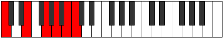 | [midi](ModeCNaturalMagitonic.mid) [ogg](ModeCNaturalMagitonic.ogg) |
| [2707](https://ianring.com/musictheory/scales/2707) | [Palimic](ScalePalimic.md) | [Banimic](ModeBanimic.md) | C, **Db**, E, **F##**, G##, **A##**, C |  | [midi](ModeCNaturalBanimic.mid) [ogg](ModeCNaturalBanimic.ogg) |
| [2709](https://ianring.com/musictheory/scales/2709) | [Epathimic](ScaleEpathimic.md) | [Thaptimic](ModeThaptimic.md) | C, D, E, F##, G##, **A##**, C |  | [midi](ModeCNaturalThaptimic.mid) [ogg](ModeCNaturalThaptimic.ogg) |
| [2711](https://ianring.com/musictheory/scales/2711) | [Soptian](ScaleSoptian.md) | [Stolian](ModeStolian.md) | C, **Db**, Ebb, Fb, G, A, **B**, C |  | [midi](ModeCNaturalStolian.mid) [ogg](ModeCNaturalStolian.ogg) |
| [2713](https://ianring.com/musictheory/scales/2713) | [Mothimic](ScaleMothimic.md) | [Porimic](ModePorimic.md) | C, **D#**, E, **F##**, G##, **A##**, C |  | [midi](ModeCNaturalPorimic.mid) [ogg](ModeCNaturalPorimic.ogg) |
| [2715](https://ianring.com/musictheory/scales/2715) | [Epacrian](ScaleEpacrian.md) | [Kynian](ModeKynian.md) | C, **Db**, **Eb**, Fb, **G**, A, **B**, C |  | [midi](ModeCNaturalKynian.mid) [ogg](ModeCNaturalKynian.ogg) |
| [2717](https://ianring.com/musictheory/scales/2717) | [Phrolian](ScalePhrolian.md) | [Epygian](ModeEpygian.md) | C, D, **Eb**, Fb, G, A, **B**, C |  | [midi](ModeCNaturalEpygian.mid) [ogg](ModeCNaturalEpygian.ogg) |
| [2719](https://ianring.com/musictheory/scales/2719) | [Phranyllic](ScalePhranyllic.md) | [Zocryllic](ModeZocryllic.md) | C, **C#**, D, **D#**, E, G, A, **B**, C |  | [midi](ModeCNaturalZocryllic.mid) [ogg](ModeCNaturalZocryllic.ogg) |
| [2723](https://ianring.com/musictheory/scales/2723) | [Katanimic](ScaleKatanimic.md) | [Epylimic](ModeEpylimic.md) | C, **Db**, E#, **F##**, **G##**, **A##**, C |  | [midi](ModeCNaturalEpylimic.mid) [ogg](ModeCNaturalEpylimic.ogg) |
| [2725](https://ianring.com/musictheory/scales/2725) | [Darmic](ScaleDarmic.md) | [Gonimic](ModeGonimic.md) | C, D, E#, F##, **G##**, **A##**, C |  | [midi](ModeCNaturalGonimic.mid) [ogg](ModeCNaturalGonimic.ogg) |
| [2727](https://ianring.com/musictheory/scales/2727) | [Phraptian](ScalePhraptian.md) | [Pylian](ModePylian.md) | C, **Db**, Ebb, F, G, **A**, **B**, C |  | [midi](ModeCNaturalPylian.mid) [ogg](ModeCNaturalPylian.ogg) |
| [2729](https://ianring.com/musictheory/scales/2729) | [Aeragimic](ScaleAeragimic.md) | [Aeragimic](ModeAeragimic.md) | C, **D#**, E#, **F##**, **G##**, **A##**, C |  | [midi](ModeCNaturalAeragimic.mid) [ogg](ModeCNaturalAeragimic.ogg) |
| [2731](https://ianring.com/musictheory/scales/2731) | [Aeolynian](ScaleAeolynian.md) | [Thydian](ModeThydian.md) | C, **Db**, **Eb**, F, **G**, **A**, **B**, C |  | [midi](ModeCNaturalThydian.mid) [ogg](ModeCNaturalThydian.ogg) |
| [2733](https://ianring.com/musictheory/scales/2733) | [Larian](ScaleLarian.md) | [Bocrian](ModeBocrian.md) | C, D, **Eb**, F, G, **A**, **B**, C |  | [midi](ModeCNaturalBocrian.mid) [ogg](ModeCNaturalBocrian.ogg) |
| [2735](https://ianring.com/musictheory/scales/2735) | [Thyryllic](ScaleThyryllic.md) | [Gynyllic](ModeGynyllic.md) | C, **C#**, D, **D#**, F, G, **A**, **B**, C |  | [midi](ModeCNaturalGynyllic.mid) [ogg](ModeCNaturalGynyllic.ogg) |
| [2737](https://ianring.com/musictheory/scales/2737) | [Bylimic](ScaleBylimic.md) | [Bylimic](ModeBylimic.md) | C, D##, E#, **F##**, G##, **A##**, C |  | [midi](ModeCNaturalBylimic.mid) [ogg](ModeCNaturalBylimic.ogg) |
| [2739](https://ianring.com/musictheory/scales/2739) | [Golian](ScaleGolian.md) | [Zanian](ModeZanian.md) | C, **Db**, E, F, **G**, A, **B**, C |  | [midi](ModeCNaturalZanian.mid) [ogg](ModeCNaturalZanian.ogg) |
| [2741](https://ianring.com/musictheory/scales/2741) | [Lydian](ScaleLydian.md) | [Ionian](ModeIonian.md) | C, D, E, F, G, A, **B**, C |  | [midi](ModeCNaturalIonian.mid) [ogg](ModeCNaturalIonian.ogg) |
| [2743](https://ianring.com/musictheory/scales/2743) | [Ionocryllic](ScaleIonocryllic.md) | [Staptyllic](ModeStaptyllic.md) | C, **C#**, D, E, F, G, A, **B**, C |  | [midi](ModeCNaturalStaptyllic.mid) [ogg](ModeCNaturalStaptyllic.ogg) |
| [2745](https://ianring.com/musictheory/scales/2745) | [Dolian](ScaleDolian.md) | [Dolian](ModeDolian.md) | C, **D#**, E, F, **G**, A, **B**, C |  | [midi](ModeCNaturalDolian.mid) [ogg](ModeCNaturalDolian.ogg) |
| [2747](https://ianring.com/musictheory/scales/2747) | [Racryllic](ScaleRacryllic.md) | [Stythyllic](ModeStythyllic.md) | C, **C#**, **D#**, E, F, **G**, A, **B**, C |  | [midi](ModeCNaturalStythyllic.mid) [ogg](ModeCNaturalStythyllic.ogg) |
| [2749](https://ianring.com/musictheory/scales/2749) | [Rocryllic](ScaleRocryllic.md) | [Katagyllic](ModeKatagyllic.md) | C, D, **D#**, E, F, G, A, **B**, C |  | [midi](ModeCNaturalKatagyllic.mid) [ogg](ModeCNaturalKatagyllic.ogg) |
| [2751](https://ianring.com/musictheory/scales/2751) | [Kyrygic](ScaleKyrygic.md) | [Sylygic](ModeSylygic.md) | C, **C#**, D, **D#**, E, F, G, A, **B**, C |  | [midi](ModeCNaturalSylygic.mid) [ogg](ModeCNaturalSylygic.ogg) |
| [2757](https://ianring.com/musictheory/scales/2757) | [Garimic](ScaleGarimic.md) | [Stolimic](ModeStolimic.md) | C, D, **E##**, F##, **G##**, A##, C |  | [midi](ModeCNaturalStolimic.mid) [ogg](ModeCNaturalStolimic.ogg) |
| [2759](https://ianring.com/musictheory/scales/2759) | [Ionythian](ScaleIonythian.md) | [Aeraphian](ModeAeraphian.md) | C, **Db**, Ebb, F#, G, **A**, B, C |  | [midi](ModeCNaturalAeraphian.mid) [ogg](ModeCNaturalAeraphian.ogg) |
| [2761](https://ianring.com/musictheory/scales/2761) | [Dagimic](ScaleDagimic.md) | [Dagimic](ModeDagimic.md) | C, **D#**, **E##**, **F##**, **G##**, A##, C |  | [midi](ModeCNaturalDagimic.mid) [ogg](ModeCNaturalDagimic.ogg) |
| [2763](https://ianring.com/musictheory/scales/2763) | [Korian](ScaleKorian.md) | [Manian](ModeManian.md) | C, **Db**, **Eb**, F#, **G**, **A**, B, C |  | [midi](ModeCNaturalManian.mid) [ogg](ModeCNaturalManian.ogg) |
| [2765](https://ianring.com/musictheory/scales/2765) | [Palian](ScalePalian.md) | [Banian](ModeBanian.md) | C, D, **Eb**, **F#**, G, **A**, B, C |  | [midi](ModeCNaturalBanian.mid) [ogg](ModeCNaturalBanian.ogg) |
| [2767](https://ianring.com/musictheory/scales/2767) | [Aeolothyllic](ScaleAeolothyllic.md) | [Katydyllic](ModeKatydyllic.md) | C, **C#**, D, **D#**, F#, G, **A**, B, C |  | [midi](ModeCNaturalKatydyllic.mid) [ogg](ModeCNaturalKatydyllic.ogg) |
| [2769](https://ianring.com/musictheory/scales/2769) | [Dyrimic](ScaleDyrimic.md) | [Dyrimic](ModeDyrimic.md) | C, D##, **E##**, **F##**, G##, A##, C |  | [midi](ModeCNaturalDyrimic.mid) [ogg](ModeCNaturalDyrimic.ogg) |
| [2771](https://ianring.com/musictheory/scales/2771) | [Thonian](ScaleThonian.md) | [Garian](ModeGarian.md) | C, **Db**, E, F#, **G**, A, B, C |  | [midi](ModeCNaturalGarian.mid) [ogg](ModeCNaturalGarian.ogg) |
| [2773](https://ianring.com/musictheory/scales/2773) | [Lydian](ScaleLydian.md) | [Lydian](ModeLydian.md) | C, D, E, **F#**, G, A, B, C |  | [midi](ModeCNaturalLydian.mid) [ogg](ModeCNaturalLydian.ogg) |
| [2775](https://ianring.com/musictheory/scales/2775) | [Aerycryllic](ScaleAerycryllic.md) | [Godyllic](ModeGodyllic.md) | C, **C#**, D, E, F#, G, A, B, C |  | [midi](ModeCNaturalGodyllic.mid) [ogg](ModeCNaturalGodyllic.ogg) |
| [2777](https://ianring.com/musictheory/scales/2777) | [Bycrian](ScaleBycrian.md) | [Bycrian](ModeBycrian.md) | C, **D#**, E, **F#**, **G**, A, B, C |  | [midi](ModeCNaturalBycrian.mid) [ogg](ModeCNaturalBycrian.ogg) |
| [2779](https://ianring.com/musictheory/scales/2779) | [Dalyllic](ScaleDalyllic.md) | [Garyllic](ModeGaryllic.md) | C, **C#**, **D#**, E, F#, **G**, A, B, C |  | [midi](ModeCNaturalGaryllic.mid) [ogg](ModeCNaturalGaryllic.ogg) |
| [2781](https://ianring.com/musictheory/scales/2781) | [Ionoptyllic](ScaleIonoptyllic.md) | [Gycryllic](ModeGycryllic.md) | C, D, **D#**, E, **F#**, G, A, B, C |  | [midi](ModeCNaturalGycryllic.mid) [ogg](ModeCNaturalGycryllic.ogg) |
| [2783](https://ianring.com/musictheory/scales/2783) | [Apinygic](ScaleApinygic.md) | [Gothygic](ModeGothygic.md) | C, **C#**, D, **D#**, E, F#, G, A, B, C |  | [midi](ModeCNaturalGothygic.mid) [ogg](ModeCNaturalGothygic.ogg) |
| [2787](https://ianring.com/musictheory/scales/2787) | [Thacrian](ScaleThacrian.md) | [Zyrian](ModeZyrian.md) | C, **Db**, E#, F#, **G**, **A**, B, C |  | [midi](ModeCNaturalZyrian.mid) [ogg](ModeCNaturalZyrian.ogg) |
| [2789](https://ianring.com/musictheory/scales/2789) | [Ionycrian](ScaleIonycrian.md) | [Zolian](ModeZolian.md) | C, D, E#, **F#**, G, **A**, B, C |  | [midi](ModeCNaturalZolian.mid) [ogg](ModeCNaturalZolian.ogg) |
| [2791](https://ianring.com/musictheory/scales/2791) | [Aeracryllic](ScaleAeracryllic.md) | [Ionyptyllic](ModeIonyptyllic.md) | C, **C#**, D, F, F#, G, **A**, B, C |  | [midi](ModeCNaturalIonyptyllic.mid) [ogg](ModeCNaturalIonyptyllic.ogg) |
| [2793](https://ianring.com/musictheory/scales/2793) | [Eporian](ScaleEporian.md) | [Eporian](ModeEporian.md) | C, **D#**, E#, **F#**, **G**, **A**, B, C |  | [midi](ModeCNaturalEporian.mid) [ogg](ModeCNaturalEporian.ogg) |
| [2797](https://ianring.com/musictheory/scales/2797) | [Stogyllic](ScaleStogyllic.md) | [Stalyllic](ModeStalyllic.md) | C, D, **D#**, F, **F#**, G, **A**, B, C |  | [midi](ModeCNaturalStalyllic.mid) [ogg](ModeCNaturalStalyllic.ogg) |
| [2799](https://ianring.com/musictheory/scales/2799) | [Kaptygic](ScaleKaptygic.md) | [Epilygic](ModeEpilygic.md) | C, **C#**, D, **D#**, F, F#, G, **A**, B, C |  | [midi](ModeCNaturalEpilygic.mid) [ogg](ModeCNaturalEpilygic.ogg) |
| [2801](https://ianring.com/musictheory/scales/2801) | [Zogian](ScaleZogian.md) | [Zogian](ModeZogian.md) | C, D##, E#, **F#**, **G**, A, B, C |  | [midi](ModeCNaturalZogian.mid) [ogg](ModeCNaturalZogian.ogg) |
| [2803](https://ianring.com/musictheory/scales/2803) | [Bacryllic](ScaleBacryllic.md) | [Zolyllic](ModeZolyllic.md) | C, **C#**, E, F, F#, **G**, A, B, C |  | [midi](ModeCNaturalZolyllic.mid) [ogg](ModeCNaturalZolyllic.ogg) |
| [2805](https://ianring.com/musictheory/scales/2805) | [Aerycryllic](ScaleAerycryllic.md) | [Zylyllic](ModeZylyllic.md) | C, D, E, F, **F#**, G, A, B, C |  | [midi](ModeCNaturalZylyllic.mid) [ogg](ModeCNaturalZylyllic.ogg) |
| [2807](https://ianring.com/musictheory/scales/2807) | [Aerycrygic](ScaleAerycrygic.md) | [Zylygic](ModeZylygic.md) | C, **C#**, D, E, F, F#, G, A, B, C |  | [midi](ModeCNaturalZylygic.mid) [ogg](ModeCNaturalZylygic.ogg) |
| [2809](https://ianring.com/musictheory/scales/2809) | [Gythyllic](ScaleGythyllic.md) | [Gythyllic](ModeGythyllic.md) | C, **D#**, E, F, **F#**, **G**, A, B, C |  | [midi](ModeCNaturalGythyllic.mid) [ogg](ModeCNaturalGythyllic.ogg) |
| [2811](https://ianring.com/musictheory/scales/2811) | [Porygic](ScalePorygic.md) | [Barygic](ModeBarygic.md) | C, **C#**, **D#**, E, F, F#, **G**, A, B, C | 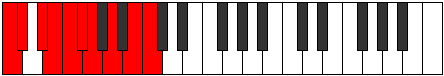 | [midi](ModeCNaturalBarygic.mid) [ogg](ModeCNaturalBarygic.ogg) |
| [2813](https://ianring.com/musictheory/scales/2813) | [Bagygic](ScaleBagygic.md) | [Zolygic](ModeZolygic.md) | C, D, **D#**, E, F, **F#**, G, A, B, C |  | [midi](ModeCNaturalZolygic.mid) [ogg](ModeCNaturalZolygic.ogg) |
| [2815](https://ianring.com/musictheory/scales/2815) | [Sydyllian](ScaleSydyllian.md) | [Aeradyllian](ModeAeradyllian.md) | C, **C#**, D, **D#**, E, F, F#, G, A, B, C |  | [midi](ModeCNaturalAeradyllian.mid) [ogg](ModeCNaturalAeradyllian.ogg) |
| [2833](https://ianring.com/musictheory/scales/2833) | [Dolitonic](ScaleDolitonic.md) | [Dolitonic](ModeDolitonic.md) | **C**, E, **G#**, A, **B**, **C** |  | [midi](ModeCNaturalDolitonic.mid) [ogg](ModeCNaturalDolitonic.ogg) |
| [2835](https://ianring.com/musictheory/scales/2835) | [Syrimic](ScaleSyrimic.md) | [Ionygimic](ModeIonygimic.md) | **C**, Db, E, **F###**, G##, **A##**, **C** |  | [midi](ModeCNaturalIonygimic.mid) [ogg](ModeCNaturalIonygimic.ogg) |
| [2837](https://ianring.com/musictheory/scales/2837) | [Modimic](ScaleModimic.md) | [Aelothimic](ModeAelothimic.md) | **C**, D, E, **F###**, G##, **A##**, **C** |  | [midi](ModeCNaturalAelothimic.mid) [ogg](ModeCNaturalAelothimic.ogg) |
| [2839](https://ianring.com/musictheory/scales/2839) | [Zorian](ScaleZorian.md) | [Lyptian](ModeLyptian.md) | **C**, Db, Ebb, Fb, **G#**, A, **B**, **C** |  | [midi](ModeCNaturalLyptian.mid) [ogg](ModeCNaturalLyptian.ogg) |
| [2841](https://ianring.com/musictheory/scales/2841) | [Laptimic](ScaleLaptimic.md) | [Sothimic](ModeSothimic.md) | **C**, **D#**, E, F###, G##, **A##**, **C** |  | [midi](ModeCNaturalSothimic.mid) [ogg](ModeCNaturalSothimic.ogg) |
| [2843](https://ianring.com/musictheory/scales/2843) | [Stythian](ScaleStythian.md) | [Sorian](ModeSorian.md) | **C**, Db, **Eb**, Fb, G#, A, **B**, **C** |  | [midi](ModeCNaturalSorian.mid) [ogg](ModeCNaturalSorian.ogg) |
| [2845](https://ianring.com/musictheory/scales/2845) | [Stygian](ScaleStygian.md) | [Baptian](ModeBaptian.md) | **C**, D, **Eb**, Fb, G#, A, **B**, **C** |  | [midi](ModeCNaturalBaptian.mid) [ogg](ModeCNaturalBaptian.ogg) |
| [2847](https://ianring.com/musictheory/scales/2847) | [Dolyllic](ScaleDolyllic.md) | [Phracryllic](ModePhracryllic.md) | **C**, C#, D, **D#**, E, G#, A, **B**, **C** |  | [midi](ModeCNaturalPhracryllic.mid) [ogg](ModeCNaturalPhracryllic.ogg) |
| [2851](https://ianring.com/musictheory/scales/2851) | [Lathimic](ScaleLathimic.md) | [Katoptimic](ModeKatoptimic.md) | **C**, Db, E#, **F###**, **G##**, **A##**, **C** |  | [midi](ModeCNaturalKatoptimic.mid) [ogg](ModeCNaturalKatoptimic.ogg) |
| [2853](https://ianring.com/musictheory/scales/2853) | [Thalimic](ScaleThalimic.md) | [Baptimic](ModeBaptimic.md) | **C**, D, E#, **F###**, **G##**, **A##**, **C** |  | [midi](ModeCNaturalBaptimic.mid) [ogg](ModeCNaturalBaptimic.ogg) |
| [2855](https://ianring.com/musictheory/scales/2855) | [Epagian](ScaleEpagian.md) | [Epocrian](ModeEpocrian.md) | **C**, Db, Ebb, F, **G#**, **A**, **B**, **C** |  | [midi](ModeCNaturalEpocrian.mid) [ogg](ModeCNaturalEpocrian.ogg) |
| [2857](https://ianring.com/musictheory/scales/2857) | [Stythimic](ScaleStythimic.md) | [Stythimic](ModeStythimic.md) | **C**, **D#**, E#, F###, **G##**, **A##**, **C** |  | [midi](ModeCNaturalStythimic.mid) [ogg](ModeCNaturalStythimic.ogg) |
| [2859](https://ianring.com/musictheory/scales/2859) | [Ionanian](ScaleIonanian.md) | [Phrycrian](ModePhrycrian.md) | **C**, Db, **Eb**, F, G#, **A**, **B**, **C** |  | [midi](ModeCNaturalPhrycrian.mid) [ogg](ModeCNaturalPhrycrian.ogg) |
| [2861](https://ianring.com/musictheory/scales/2861) | [Mycrian](ScaleMycrian.md) | [Katothian](ModeKatothian.md) | **C**, D, **Eb**, F, G#, **A**, **B**, **C** |  | [midi](ModeCNaturalKatothian.mid) [ogg](ModeCNaturalKatothian.ogg) |
| [2863](https://ianring.com/musictheory/scales/2863) | [Stacryllic](ScaleStacryllic.md) | [Aerogyllic](ModeAerogyllic.md) | **C**, C#, D, **D#**, F, G#, **A**, **B**, **C** |  | [midi](ModeCNaturalAerogyllic.mid) [ogg](ModeCNaturalAerogyllic.ogg) |
| [2865](https://ianring.com/musictheory/scales/2865) | [Solimic](ScaleSolimic.md) | [Solimic](ModeSolimic.md) | **C**, D##, E#, **F###**, G##, **A##**, **C** |  | [midi](ModeCNaturalSolimic.mid) [ogg](ModeCNaturalSolimic.ogg) |
| [2867](https://ianring.com/musictheory/scales/2867) | [Katathian](ScaleKatathian.md) | [Socrian](ModeSocrian.md) | **C**, Db, E, F, **G#**, A, **B**, **C** |  | [midi](ModeCNaturalSocrian.mid) [ogg](ModeCNaturalSocrian.ogg) |
| [2869](https://ianring.com/musictheory/scales/2869) | [Bycrian](ScaleBycrian.md) | [Phrothian](ModePhrothian.md) | **C**, D, E, F, **G#**, A, **B**, **C** |  | [midi](ModeCNaturalPhrothian.mid) [ogg](ModeCNaturalPhrothian.ogg) |
| [2871](https://ianring.com/musictheory/scales/2871) | [Doptyllic](ScaleDoptyllic.md) | [Stanyllic](ModeStanyllic.md) | **C**, C#, D, E, F, **G#**, A, **B**, **C** |  | [midi](ModeCNaturalStanyllic.mid) [ogg](ModeCNaturalStanyllic.ogg) |
| [2873](https://ianring.com/musictheory/scales/2873) | [Loptian](ScaleLoptian.md) | [Docrian](ModeDocrian.md) | **C**, **D#**, E, F, G#, A, **B**, **C** |  | [midi](ModeCNaturalDocrian.mid) [ogg](ModeCNaturalDocrian.ogg) |
| [2875](https://ianring.com/musictheory/scales/2875) | [Thyptyllic](ScaleThyptyllic.md) | [Ganyllic](ModeGanyllic.md) | **C**, C#, **D#**, E, F, G#, A, **B**, **C** |  | [midi](ModeCNaturalGanyllic.mid) [ogg](ModeCNaturalGanyllic.ogg) |
| [2877](https://ianring.com/musictheory/scales/2877) | [Maptyllic](ScaleMaptyllic.md) | [Phrylyllic](ModePhrylyllic.md) | **C**, D, **D#**, E, F, G#, A, **B**, **C** |  | [midi](ModeCNaturalPhrylyllic.mid) [ogg](ModeCNaturalPhrylyllic.ogg) |
| [2879](https://ianring.com/musictheory/scales/2879) | [Phrygic](ScalePhrygic.md) | [Stadygic](ModeStadygic.md) | **C**, C#, D, **D#**, E, F, G#, A, **B**, **C** |  | [midi](ModeCNaturalStadygic.mid) [ogg](ModeCNaturalStadygic.ogg) |
| [2885](https://ianring.com/musictheory/scales/2885) | [Manimic](ScaleManimic.md) | [Byrimic](ModeByrimic.md) | **C**, D, **E##**, **F###**, **G##**, A##, **C** |  | [midi](ModeCNaturalByrimic.mid) [ogg](ModeCNaturalByrimic.ogg) |
| [2887](https://ianring.com/musictheory/scales/2887) | [Aeopian](ScaleAeopian.md) | [Gaptian](ModeGaptian.md) | **C**, Db, Ebb, F#, **G#**, **A**, B, **C** |  | [midi](ModeCNaturalGaptian.mid) [ogg](ModeCNaturalGaptian.ogg) |
| [2889](https://ianring.com/musictheory/scales/2889) | [Thoptimic](ScaleThoptimic.md) | [Thoptimic](ModeThoptimic.md) | **C**, **D#**, **E##**, F###, **G##**, A##, **C** |  | [midi](ModeCNaturalThoptimic.mid) [ogg](ModeCNaturalThoptimic.ogg) |
| [2891](https://ianring.com/musictheory/scales/2891) | [Ionopian](ScaleIonopian.md) | [Phrogian](ModePhrogian.md) | **C**, Db, **Eb**, F#, G#, **A**, B, **C** |  | [midi](ModeCNaturalPhrogian.mid) [ogg](ModeCNaturalPhrogian.ogg) |
| [2893](https://ianring.com/musictheory/scales/2893) | [Pogian](ScalePogian.md) | [Lylian](ModeLylian.md) | **C**, D, **Eb**, **F#**, G#, **A**, B, **C** |  | [midi](ModeCNaturalLylian.mid) [ogg](ModeCNaturalLylian.ogg) |
| [2895](https://ianring.com/musictheory/scales/2895) | [Lydyllic](ScaleLydyllic.md) | [Aeragyllic](ModeAeragyllic.md) | **C**, C#, D, **D#**, F#, G#, **A**, B, **C** |  | [midi](ModeCNaturalAeragyllic.mid) [ogg](ModeCNaturalAeragyllic.ogg) |
| [2897](https://ianring.com/musictheory/scales/2897) | [Rycrimic](ScaleRycrimic.md) | [Rycrimic](ModeRycrimic.md) | **C**, D##, **E##**, **F###**, G##, A##, **C** |  | [midi](ModeCNaturalRycrimic.mid) [ogg](ModeCNaturalRycrimic.ogg) |
| [2899](https://ianring.com/musictheory/scales/2899) | [Phrolian](ScalePhrolian.md) | [Kagian](ModeKagian.md) | **C**, Db, E, F#, **G#**, A, B, **C** |  | [midi](ModeCNaturalKagian.mid) [ogg](ModeCNaturalKagian.ogg) |
| [2901](https://ianring.com/musictheory/scales/2901) | [Larian](ScaleLarian.md) | [Larian](ModeLarian.md) | **C**, D, E, **F#**, **G#**, A, B, **C** |  | [midi](ModeCNaturalLarian.mid) [ogg](ModeCNaturalLarian.ogg) |
| [2903](https://ianring.com/musictheory/scales/2903) | [Rocryllic](ScaleRocryllic.md) | [Gothyllic](ModeGothyllic.md) | **C**, C#, D, E, F#, **G#**, A, B, **C** |  | [midi](ModeCNaturalGothyllic.mid) [ogg](ModeCNaturalGothyllic.ogg) |
| [2905](https://ianring.com/musictheory/scales/2905) | [Palian](ScalePalian.md) | [Palian](ModePalian.md) | **C**, **D#**, E, **F#**, G#, A, B, **C** |  | [midi](ModeCNaturalPalian.mid) [ogg](ModeCNaturalPalian.ogg) |
| [2907](https://ianring.com/musictheory/scales/2907) | [Ionoptyllic](ScaleIonoptyllic.md) | [Mogyllic](ModeMogyllic.md) | **C**, C#, **D#**, E, F#, G#, A, B, **C** |  | [midi](ModeCNaturalMogyllic.mid) [ogg](ModeCNaturalMogyllic.ogg) |
| [2909](https://ianring.com/musictheory/scales/2909) | [Stogyllic](ScaleStogyllic.md) | [Mocryllic](ModeMocryllic.md) | **C**, D, **D#**, E, **F#**, G#, A, B, **C** |  | [midi](ModeCNaturalMocryllic.mid) [ogg](ModeCNaturalMocryllic.ogg) |
| [2911](https://ianring.com/musictheory/scales/2911) | [Bagygic](ScaleBagygic.md) | [Katygic](ModeKatygic.md) | **C**, C#, D, **D#**, E, F#, G#, A, B, **C** |  | [midi](ModeCNaturalKatygic.mid) [ogg](ModeCNaturalKatygic.ogg) |
| [2915](https://ianring.com/musictheory/scales/2915) | [Stygian](ScaleStygian.md) | [Aeolydian](ModeAeolydian.md) | **C**, Db, E#, F#, **G#**, **A**, B, **C** |  | [midi](ModeCNaturalAeolydian.mid) [ogg](ModeCNaturalAeolydian.ogg) |
| [2917](https://ianring.com/musictheory/scales/2917) | [Mycrian](ScaleMycrian.md) | [Kocrian](ModeKocrian.md) | **C**, D, E#, **F#**, **G#**, **A**, B, **C** |  | [midi](ModeCNaturalKocrian.mid) [ogg](ModeCNaturalKocrian.ogg) |
| [2919](https://ianring.com/musictheory/scales/2919) | [Maptyllic](ScaleMaptyllic.md) | [Molyllic](ModeMolyllic.md) | **C**, C#, D, F, F#, **G#**, **A**, B, **C** |  | [midi](ModeCNaturalMolyllic.mid) [ogg](ModeCNaturalMolyllic.ogg) |
| [2921](https://ianring.com/musictheory/scales/2921) | [Pogian](ScalePogian.md) | [Pogian](ModePogian.md) | **C**, **D#**, E#, **F#**, G#, **A**, B, **C** |  | [midi](ModeCNaturalPogian.mid) [ogg](ModeCNaturalPogian.ogg) |
| [2923](https://ianring.com/musictheory/scales/2923) | [Stogyllic](ScaleStogyllic.md) | [Baryllic](ModeBaryllic.md) | **C**, C#, **D#**, F, F#, G#, **A**, B, **C** |  | [midi](ModeCNaturalBaryllic.mid) [ogg](ModeCNaturalBaryllic.ogg) |
| [2925](https://ianring.com/musictheory/scales/2925) | [MajorDiminished](ScaleMajorDiminished.md) | [MajorDiminished](ModeMajorDiminished.md) | **C**, D, **D#**, F, **F#**, G#, **A**, B, **C** |  | [midi](ModeCNaturalMajorDiminished.mid) [ogg](ModeCNaturalMajorDiminished.ogg) |
| [2927](https://ianring.com/musictheory/scales/2927) | [Koptygic](ScaleKoptygic.md) | [Rodygic](ModeRodygic.md) | **C**, C#, D, **D#**, F, F#, G#, **A**, B, **C** |  | [midi](ModeCNaturalRodygic.mid) [ogg](ModeCNaturalRodygic.ogg) |
| [2929](https://ianring.com/musictheory/scales/2929) | [Aeolathian](ScaleAeolathian.md) | [Aeolathian](ModeAeolathian.md) | **C**, D##, E#, **F#**, **G#**, A, B, **C** |  | [midi](ModeCNaturalAeolathian.mid) [ogg](ModeCNaturalAeolathian.ogg) |
| [2931](https://ianring.com/musictheory/scales/2931) | [Dydyllic](ScaleDydyllic.md) | [Zathyllic](ModeZathyllic.md) | **C**, C#, E, F, F#, **G#**, A, B, **C** |  | [midi](ModeCNaturalZathyllic.mid) [ogg](ModeCNaturalZathyllic.ogg) |
| [2933](https://ianring.com/musictheory/scales/2933) | [Dalyllic](ScaleDalyllic.md) | [Dalyllic](ModeDalyllic.md) | **C**, D, E, F, **F#**, **G#**, A, B, **C** |  | [midi](ModeCNaturalDalyllic.mid) [ogg](ModeCNaturalDalyllic.ogg) |
| [2935](https://ianring.com/musictheory/scales/2935) | [Aeolorygic](ScaleAeolorygic.md) | [Modygic](ModeModygic.md) | **C**, C#, D, E, F, F#, **G#**, A, B, **C** |  | [midi](ModeCNaturalModygic.mid) [ogg](ModeCNaturalModygic.ogg) |
| [2937](https://ianring.com/musictheory/scales/2937) | [Aeolathyllic](ScaleAeolathyllic.md) | [Aeolathyllic](ModeAeolathyllic.md) | **C**, **D#**, E, F, **F#**, G#, A, B, **C** |  | [midi](ModeCNaturalAeolathyllic.mid) [ogg](ModeCNaturalAeolathyllic.ogg) |
| [2939](https://ianring.com/musictheory/scales/2939) | [Epyrygic](ScaleEpyrygic.md) | [Goptygic](ModeGoptygic.md) | **C**, C#, **D#**, E, F, F#, G#, A, B, **C** |  | [midi](ModeCNaturalGoptygic.mid) [ogg](ModeCNaturalGoptygic.ogg) |
| [2941](https://ianring.com/musictheory/scales/2941) | [Koptygic](ScaleKoptygic.md) | [Laptygic](ModeLaptygic.md) | **C**, D, **D#**, E, F, **F#**, G#, A, B, **C** |  | [midi](ModeCNaturalLaptygic.mid) [ogg](ModeCNaturalLaptygic.ogg) |
| [2943](https://ianring.com/musictheory/scales/2943) | [Gothyllian](ScaleGothyllian.md) | [Dathyllian](ModeDathyllian.md) | **C**, C#, D, **D#**, E, F, F#, G#, A, B, **C** |  | [midi](ModeCNaturalDathyllian.mid) [ogg](ModeCNaturalDathyllian.ogg) |
| [2953](https://ianring.com/musictheory/scales/2953) | [Aerothimic](ScaleAerothimic.md) | [Ionylimic](ModeIonylimic.md) | C, **D#**, **E###**, F###, **G##**, **A##**, C | 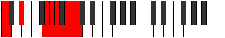 | [midi](ModeCNaturalIonylimic.mid) [ogg](ModeCNaturalIonylimic.ogg) |
| [2955](https://ianring.com/musictheory/scales/2955) | [Katacrian](ScaleKatacrian.md) | [Thorian](ModeThorian.md) | C, Db, **Eb**, **F##**, G#, **A**, **B**, C |  | [midi](ModeCNaturalThorian.mid) [ogg](ModeCNaturalThorian.ogg) |
| [2957](https://ianring.com/musictheory/scales/2957) | [Aeolathian](ScaleAeolathian.md) | [Thygian](ModeThygian.md) | C, D, **Eb**, F##, G#, **A**, **B**, C |  | [midi](ModeCNaturalThygian.mid) [ogg](ModeCNaturalThygian.ogg) |
| [2959](https://ianring.com/musictheory/scales/2959) | [Thagyllic](ScaleThagyllic.md) | [Dygyllic](ModeDygyllic.md) | C, C#, D, **D#**, G, G#, **A**, **B**, C |  | [midi](ModeCNaturalDygyllic.mid) [ogg](ModeCNaturalDygyllic.ogg) |
| [2961](https://ianring.com/musictheory/scales/2961) | [Bygimic](ScaleBygimic.md) | [Bygimic](ModeBygimic.md) | C, D##, **E###**, **F###**, G##, **A##**, C |  | [midi](ModeCNaturalBygimic.mid) [ogg](ModeCNaturalBygimic.ogg) |
| [2963](https://ianring.com/musictheory/scales/2963) | [Stalian](ScaleStalian.md) | [Bygian](ModeBygian.md) | C, Db, E, **F##**, **G#**, A, **B**, C |  | [midi](ModeCNaturalBygian.mid) [ogg](ModeCNaturalBygian.ogg) |
| [2965](https://ianring.com/musictheory/scales/2965) | [Aerathian](ScaleAerathian.md) | [Darian](ModeDarian.md) | C, D, E, F##, **G#**, A, **B**, C |  | [midi](ModeCNaturalDarian.mid) [ogg](ModeCNaturalDarian.ogg) |
| [2967](https://ianring.com/musictheory/scales/2967) | [Dagyllic](ScaleDagyllic.md) | [Madyllic](ModeMadyllic.md) | C, C#, D, E, G, **G#**, A, **B**, C |  | [midi](ModeCNaturalMadyllic.mid) [ogg](ModeCNaturalMadyllic.ogg) |
| [2969](https://ianring.com/musictheory/scales/2969) | [Tholian](ScaleTholian.md) | [Tholian](ModeTholian.md) | C, **D#**, E, **F##**, G#, A, **B**, C |  | [midi](ModeCNaturalTholian.mid) [ogg](ModeCNaturalTholian.ogg) |
| [2971](https://ianring.com/musictheory/scales/2971) | [Lonyllic](ScaleLonyllic.md) | [Aeolynyllic](ModeAeolynyllic.md) | C, C#, **D#**, E, **G**, G#, A, **B**, C |  | [midi](ModeCNaturalAeolynyllic.mid) [ogg](ModeCNaturalAeolynyllic.ogg) |
| [2973](https://ianring.com/musictheory/scales/2973) | [Dydyllic](ScaleDydyllic.md) | [Panyllic](ModePanyllic.md) | C, D, **D#**, E, G, G#, A, **B**, C |  | [midi](ModeCNaturalPanyllic.mid) [ogg](ModeCNaturalPanyllic.ogg) |
| [2975](https://ianring.com/musictheory/scales/2975) | [Kalygic](ScaleKalygic.md) | [Gaptygic](ModeGaptygic.md) | C, C#, D, **D#**, E, G, G#, A, **B**, C | 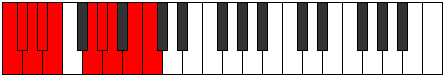 | [midi](ModeCNaturalGaptygic.mid) [ogg](ModeCNaturalGaptygic.ogg) |
| [2979](https://ianring.com/musictheory/scales/2979) | [Katogian](ScaleKatogian.md) | [Gyptian](ModeGyptian.md) | C, Db, E#, **F##**, **G#**, **A**, **B**, C |  | [midi](ModeCNaturalGyptian.mid) [ogg](ModeCNaturalGyptian.ogg) |
| [2981](https://ianring.com/musictheory/scales/2981) | [Rythian](ScaleRythian.md) | [Ionolian](ModeIonolian.md) | C, D, E#, F##, **G#**, **A**, **B**, C |  | [midi](ModeCNaturalIonolian.mid) [ogg](ModeCNaturalIonolian.ogg) |
| [2983](https://ianring.com/musictheory/scales/2983) | [Zoryllic](ScaleZoryllic.md) | [Zythyllic](ModeZythyllic.md) | C, C#, D, F, G, **G#**, **A**, **B**, C |  | [midi](ModeCNaturalZythyllic.mid) [ogg](ModeCNaturalZythyllic.ogg) |
| [2985](https://ianring.com/musictheory/scales/2985) | [Epacrian](ScaleEpacrian.md) | [Epacrian](ModeEpacrian.md) | C, **D#**, E#, **F##**, G#, **A**, **B**, C |  | [midi](ModeCNaturalEpacrian.mid) [ogg](ModeCNaturalEpacrian.ogg) |
| [2987](https://ianring.com/musictheory/scales/2987) | [Racryllic](ScaleRacryllic.md) | [Thanyllic](ModeThanyllic.md) | C, C#, **D#**, F, **G**, G#, **A**, **B**, C |  | [midi](ModeCNaturalThanyllic.mid) [ogg](ModeCNaturalThanyllic.ogg) |
| [2989](https://ianring.com/musictheory/scales/2989) | [Dalyllic](ScaleDalyllic.md) | [Ionacryllic](ModeIonacryllic.md) | C, D, **D#**, F, G, G#, **A**, **B**, C |  | [midi](ModeCNaturalIonacryllic.mid) [ogg](ModeCNaturalIonacryllic.ogg) |
| [2991](https://ianring.com/musictheory/scales/2991) | [Porygic](ScalePorygic.md) | [Zanygic](ModeZanygic.md) | C, C#, D, **D#**, F, G, G#, **A**, **B**, C |  | [midi](ModeCNaturalZanygic.mid) [ogg](ModeCNaturalZanygic.ogg) |
| [2993](https://ianring.com/musictheory/scales/2993) | [Stythian](ScaleStythian.md) | [Stythian](ModeStythian.md) | C, D##, E#, **F##**, **G#**, A, **B**, C |  | [midi](ModeCNaturalStythian.mid) [ogg](ModeCNaturalStythian.ogg) |
| [2995](https://ianring.com/musictheory/scales/2995) | [Thyptyllic](ScaleThyptyllic.md) | [Sanyllic](ModeSanyllic.md) | C, C#, E, F, **G**, **G#**, A, **B**, C |  | [midi](ModeCNaturalSanyllic.mid) [ogg](ModeCNaturalSanyllic.ogg) |
| [2997](https://ianring.com/musictheory/scales/2997) | [Ionoptyllic](ScaleIonoptyllic.md) | [Ionoptyllic](ModeIonoptyllic.md) | C, D, E, F, G, **G#**, A, **B**, C |  | [midi](ModeCNaturalIonoptyllic.mid) [ogg](ModeCNaturalIonoptyllic.ogg) |
| [2999](https://ianring.com/musictheory/scales/2999) | [Epyrygic](ScaleEpyrygic.md) | [Zyrygic](ModeZyrygic.md) | C, C#, D, E, F, G, **G#**, A, **B**, C |  | [midi](ModeCNaturalZyrygic.mid) [ogg](ModeCNaturalZyrygic.ogg) |
| [3001](https://ianring.com/musictheory/scales/3001) | [Lonyllic](ScaleLonyllic.md) | [Lonyllic](ModeLonyllic.md) | C, **D#**, E, F, **G**, G#, A, **B**, C |  | [midi](ModeCNaturalLonyllic.mid) [ogg](ModeCNaturalLonyllic.ogg) |
| [3003](https://ianring.com/musictheory/scales/3003) | [Phronygic](ScalePhronygic.md) | [Zydygic](ModeZydygic.md) | C, C#, **D#**, E, F, **G**, G#, A, **B**, C | 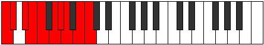 | [midi](ModeCNaturalZydygic.mid) [ogg](ModeCNaturalZydygic.ogg) |
| [3005](https://ianring.com/musictheory/scales/3005) | [Aeolorygic](ScaleAeolorygic.md) | [Gycrygic](ModeGycrygic.md) | C, D, **D#**, E, F, G, G#, A, **B**, C |  | [midi](ModeCNaturalGycrygic.mid) [ogg](ModeCNaturalGycrygic.ogg) |
| [3007](https://ianring.com/musictheory/scales/3007) | [Staptyllian](ScaleStaptyllian.md) | [Zyryllian](ModeZyryllian.md) | C, C#, D, **D#**, E, F, G, G#, A, **B**, C |  | [midi](ModeCNaturalZyryllian.mid) [ogg](ModeCNaturalZyryllian.ogg) |
| [3013](https://ianring.com/musictheory/scales/3013) | [Saptian](ScaleSaptian.md) | [Thynian](ModeThynian.md) | C, D, **E##**, F##, **G#**, **A**, B, C |  | [midi](ModeCNaturalThynian.mid) [ogg](ModeCNaturalThynian.ogg) |
| [3015](https://ianring.com/musictheory/scales/3015) | [Pynyllic](ScalePynyllic.md) | [Laptyllic](ModeLaptyllic.md) | C, C#, D, F#, G, **G#**, **A**, B, C |  | [midi](ModeCNaturalLaptyllic.mid) [ogg](ModeCNaturalLaptyllic.ogg) |
| [3017](https://ianring.com/musictheory/scales/3017) | [Gacrian](ScaleGacrian.md) | [Gacrian](ModeGacrian.md) | C, **D#**, **E##**, **F##**, G#, **A**, B, C |  | [midi](ModeCNaturalGacrian.mid) [ogg](ModeCNaturalGacrian.ogg) |
| [3019](https://ianring.com/musictheory/scales/3019) | [Zagyllic](ScaleZagyllic.md) | [Mydyllic](ModeMydyllic.md) | C, C#, **D#**, F#, **G**, G#, **A**, B, C |  | [midi](ModeCNaturalMydyllic.mid) [ogg](ModeCNaturalMydyllic.ogg) |
| [3021](https://ianring.com/musictheory/scales/3021) | [Aeolathyllic](ScaleAeolathyllic.md) | [Gyptyllic](ModeGyptyllic.md) | C, D, **D#**, **F#**, G, G#, **A**, B, C |  | [midi](ModeCNaturalGyptyllic.mid) [ogg](ModeCNaturalGyptyllic.ogg) |
| [3023](https://ianring.com/musictheory/scales/3023) | [Mixolydygic](ScaleMixolydygic.md) | [Aeracrygic](ModeAeracrygic.md) | C, C#, D, **D#**, F#, G, G#, **A**, B, C |  | [midi](ModeCNaturalAeracrygic.mid) [ogg](ModeCNaturalAeracrygic.ogg) |
| [3025](https://ianring.com/musictheory/scales/3025) | [Epycrian](ScaleEpycrian.md) | [Epycrian](ModeEpycrian.md) | C, D##, **E##**, **F##**, **G#**, A, B, C |  | [midi](ModeCNaturalEpycrian.mid) [ogg](ModeCNaturalEpycrian.ogg) |
| [3027](https://ianring.com/musictheory/scales/3027) | [Pothyllic](ScalePothyllic.md) | [Rythyllic](ModeRythyllic.md) | C, C#, E, F#, **G**, **G#**, A, B, C |  | [midi](ModeCNaturalRythyllic.mid) [ogg](ModeCNaturalRythyllic.ogg) |
| [3029](https://ianring.com/musictheory/scales/3029) | [Ionocryllic](ScaleIonocryllic.md) | [Ionocryllic](ModeIonocryllic.md) | C, D, E, **F#**, G, **G#**, A, B, C |  | [midi](ModeCNaturalIonocryllic.mid) [ogg](ModeCNaturalIonocryllic.ogg) |
| [3031](https://ianring.com/musictheory/scales/3031) | [Aerycrygic](ScaleAerycrygic.md) | [Epithygic](ModeEpithygic.md) | C, C#, D, E, F#, G, **G#**, A, B, C |  | [midi](ModeCNaturalEpithygic.mid) [ogg](ModeCNaturalEpithygic.ogg) |
| [3033](https://ianring.com/musictheory/scales/3033) | [Doptyllic](ScaleDoptyllic.md) | [Doptyllic](ModeDoptyllic.md) | C, **D#**, E, **F#**, **G**, G#, A, B, C |  | [midi](ModeCNaturalDoptyllic.mid) [ogg](ModeCNaturalDoptyllic.ogg) |
| [3035](https://ianring.com/musictheory/scales/3035) | [Aeolorygic](ScaleAeolorygic.md) | [Gocrygic](ModeGocrygic.md) | C, C#, **D#**, E, F#, **G**, G#, A, B, C |  | [midi](ModeCNaturalGocrygic.mid) [ogg](ModeCNaturalGocrygic.ogg) |
| [3037](https://ianring.com/musictheory/scales/3037) | [Epyrygic](ScaleEpyrygic.md) | [Staptygic](ModeStaptygic.md) | C, D, **D#**, E, **F#**, G, G#, A, B, C |  | [midi](ModeCNaturalStaptygic.mid) [ogg](ModeCNaturalStaptygic.ogg) |
| [3039](https://ianring.com/musictheory/scales/3039) | [Aerycryllian](ScaleAerycryllian.md) | [Godyllian](ModeGodyllian.md) | C, C#, D, **D#**, E, F#, G, G#, A, B, C |  | [midi](ModeCNaturalGodyllian.mid) [ogg](ModeCNaturalGodyllian.ogg) |
| [3043](https://ianring.com/musictheory/scales/3043) | [Aeoladyllic](ScaleAeoladyllic.md) | [Ionayllic](ModeIonayllic.md) | C, C#, F, F#, **G**, **G#**, **A**, B, C |  | [midi](ModeCNaturalIonayllic.mid) [ogg](ModeCNaturalIonayllic.ogg) |
| [3045](https://ianring.com/musictheory/scales/3045) | [Tharyllic](ScaleTharyllic.md) | [Raptyllic](ModeRaptyllic.md) | C, D, F, **F#**, G, **G#**, **A**, B, C |  | [midi](ModeCNaturalRaptyllic.mid) [ogg](ModeCNaturalRaptyllic.ogg) |
| [3047](https://ianring.com/musictheory/scales/3047) | [Dycrygic](ScaleDycrygic.md) | [Panygic](ModePanygic.md) | C, C#, D, F, F#, G, **G#**, **A**, B, C |  | [midi](ModeCNaturalPanygic.mid) [ogg](ModeCNaturalPanygic.ogg) |
| [3049](https://ianring.com/musictheory/scales/3049) | [Aeronyllic](ScaleAeronyllic.md) | [Aeronyllic](ModeAeronyllic.md) | C, **D#**, F, **F#**, **G**, G#, **A**, B, C |  | [midi](ModeCNaturalAeronyllic.mid) [ogg](ModeCNaturalAeronyllic.ogg) |
| [3051](https://ianring.com/musictheory/scales/3051) | [Kaptygic](ScaleKaptygic.md) | [Stalygic](ModeStalygic.md) | C, C#, **D#**, F, F#, **G**, G#, **A**, B, C |  | [midi](ModeCNaturalStalygic.mid) [ogg](ModeCNaturalStalygic.ogg) |
| [3053](https://ianring.com/musictheory/scales/3053) | [Koptygic](ScaleKoptygic.md) | [Zycrygic](ModeZycrygic.md) | C, D, **D#**, F, **F#**, G, G#, **A**, B, C |  | [midi](ModeCNaturalZycrygic.mid) [ogg](ModeCNaturalZycrygic.ogg) |
| [3055](https://ianring.com/musictheory/scales/3055) | [Thydyllian](ScaleThydyllian.md) | [Lyryllian](ModeLyryllian.md) | C, C#, D, **D#**, F, F#, G, G#, **A**, B, C |  | [midi](ModeCNaturalLyryllian.mid) [ogg](ModeCNaturalLyryllian.ogg) |
| [3057](https://ianring.com/musictheory/scales/3057) | [Phroryllic](ScalePhroryllic.md) | [Phroryllic](ModePhroryllic.md) | C, E, F, **F#**, **G**, **G#**, A, B, C |  | [midi](ModeCNaturalPhroryllic.mid) [ogg](ModeCNaturalPhroryllic.ogg) |
| [3059](https://ianring.com/musictheory/scales/3059) | [Loptygic](ScaleLoptygic.md) | [Madygic](ModeMadygic.md) | C, C#, E, F, F#, **G**, **G#**, A, B, C |  | [midi](ModeCNaturalMadygic.mid) [ogg](ModeCNaturalMadygic.ogg) |
| [3061](https://ianring.com/musictheory/scales/3061) | [Apinygic](ScaleApinygic.md) | [Apinygic](ModeApinygic.md) | C, D, E, F, **F#**, G, **G#**, A, B, C |  | [midi](ModeCNaturalApinygic.mid) [ogg](ModeCNaturalApinygic.ogg) |
| [3063](https://ianring.com/musictheory/scales/3063) | [Aerycryllian](ScaleAerycryllian.md) | [Solyllian](ModeSolyllian.md) | C, C#, D, E, F, F#, G, **G#**, A, B, C |  | [midi](ModeCNaturalSolyllian.mid) [ogg](ModeCNaturalSolyllian.ogg) |
| [3065](https://ianring.com/musictheory/scales/3065) | [Zothygic](ScaleZothygic.md) | [Zothygic](ModeZothygic.md) | C, **D#**, E, F, **F#**, **G**, G#, A, B, C |  | [midi](ModeCNaturalZothygic.mid) [ogg](ModeCNaturalZothygic.ogg) |
| [3067](https://ianring.com/musictheory/scales/3067) | [Staptyllian](ScaleStaptyllian.md) | [Goptyllian](ModeGoptyllian.md) | C, C#, **D#**, E, F, F#, **G**, G#, A, B, C |  | [midi](ModeCNaturalGoptyllian.mid) [ogg](ModeCNaturalGoptyllian.ogg) |
| [3069](https://ianring.com/musictheory/scales/3069) | [Gothyllian](ScaleGothyllian.md) | [Bacryllian](ModeBacryllian.md) | C, D, **D#**, E, F, **F#**, G, G#, A, B, C |  | [midi](ModeCNaturalBacryllian.mid) [ogg](ModeCNaturalBacryllian.ogg) |
| [3071](https://ianring.com/musictheory/scales/3071) | [Aerycratic](ScaleAerycratic.md) | [Solatic](ModeSolatic.md) | C, C#, D, **D#**, E, F, F#, G, G#, A, B, C |  | [midi](ModeCNaturalSolatic.mid) [ogg](ModeCNaturalSolatic.ogg) |
| [3141](https://ianring.com/musictheory/scales/3141) | [Ranitonic](ScaleRanitonic.md) | [Kanitonic](ModeKanitonic.md) | **C**, **D**, **F#**, **A#**, B, **C** |  | [midi](ModeCNaturalKanitonic.mid) [ogg](ModeCNaturalKanitonic.ogg) |
| [3143](https://ianring.com/musictheory/scales/3143) | [Ponimic](ScalePonimic.md) | [Polimic](ModePolimic.md) | **C**, **Db**, **Ebb**, F#, **G###**, A##, **C** |  | [midi](ModeCNaturalPolimic.mid) [ogg](ModeCNaturalPolimic.ogg) |
| [3145](https://ianring.com/musictheory/scales/3145) | [Ionyptitonic](ScaleIonyptitonic.md) | [Stolitonic](ModeStolitonic.md) | **C**, D#, **F#**, **A#**, B, **C** |  | [midi](ModeCNaturalStolitonic.mid) [ogg](ModeCNaturalStolitonic.ogg) |
| [3147](https://ianring.com/musictheory/scales/3147) | [Kytrimic](ScaleKytrimic.md) | [Ryrimic](ModeRyrimic.md) | **C**, **Db**, Eb, F#, **G###**, A##, **C** |  | [midi](ModeCNaturalRyrimic.mid) [ogg](ModeCNaturalRyrimic.ogg) |
| [3149](https://ianring.com/musictheory/scales/3149) | [Aerothimic](ScaleAerothimic.md) | [Phrycrimic](ModePhrycrimic.md) | **C**, **D**, Eb, **F#**, **G###**, A##, **C** |  | [midi](ModeCNaturalPhrycrimic.mid) [ogg](ModeCNaturalPhrycrimic.ogg) |
| [3151](https://ianring.com/musictheory/scales/3151) | [Katyptian](ScaleKatyptian.md) | [Pacrian](ModePacrian.md) | **C**, **Db**, **Ebb**, Fbb, Gb, **A#**, B, **C** |  | [midi](ModeCNaturalPacrian.mid) [ogg](ModeCNaturalPacrian.ogg) |
| [3153](https://ianring.com/musictheory/scales/3153) | [Zathitonic](ScaleZathitonic.md) | [Zathitonic](ModeZathitonic.md) | **C**, E, **F#**, **A#**, B, **C** |  | [midi](ModeCNaturalZathitonic.mid) [ogg](ModeCNaturalZathitonic.ogg) |
| [3155](https://ianring.com/musictheory/scales/3155) | [Pynimic](ScalePynimic.md) | [Ladimic](ModeLadimic.md) | **C**, **Db**, E, F#, **G###**, A##, **C** |  | [midi](ModeCNaturalLadimic.mid) [ogg](ModeCNaturalLadimic.ogg) |
| [3157](https://ianring.com/musictheory/scales/3157) | [Mycrimic](ScaleMycrimic.md) | [Zyptimic](ModeZyptimic.md) | **C**, **D**, E, **F#**, **G###**, A##, **C** |  | [midi](ModeCNaturalZyptimic.mid) [ogg](ModeCNaturalZyptimic.ogg) |
| [3159](https://ianring.com/musictheory/scales/3159) | [Stanian](ScaleStanian.md) | [Stocrian](ModeStocrian.md) | **C**, **Db**, **Ebb**, Fb, Gb, **A#**, B, **C** |  | [midi](ModeCNaturalStocrian.mid) [ogg](ModeCNaturalStocrian.ogg) |
| [3161](https://ianring.com/musictheory/scales/3161) | [Bolimic](ScaleBolimic.md) | [Kodimic](ModeKodimic.md) | **C**, D#, E, **F#**, **G###**, A##, **C** |  | [midi](ModeCNaturalKodimic.mid) [ogg](ModeCNaturalKodimic.ogg) |
| [3163](https://ianring.com/musictheory/scales/3163) | [Saptian](ScaleSaptian.md) | [Rogian](ModeRogian.md) | **C**, **Db**, Eb, Fb, Gb, **A#**, B, **C** |  | [midi](ModeCNaturalRogian.mid) [ogg](ModeCNaturalRogian.ogg) |
| [3165](https://ianring.com/musictheory/scales/3165) | [Katacrian](ScaleKatacrian.md) | [Mylian](ModeMylian.md) | **C**, **D**, Eb, Fb, **Gb**, **A#**, B, **C** |  | [midi](ModeCNaturalMylian.mid) [ogg](ModeCNaturalMylian.ogg) |
| [3167](https://ianring.com/musictheory/scales/3167) | [Stolyllic](ScaleStolyllic.md) | [Thynyllic](ModeThynyllic.md) | **C**, **C#**, **D**, D#, E, F#, **A#**, B, **C** |  | [midi](ModeCNaturalThynyllic.mid) [ogg](ModeCNaturalThynyllic.ogg) |
| [3171](https://ianring.com/musictheory/scales/3171) | [Daptimic](ScaleDaptimic.md) | [Zythimic](ModeZythimic.md) | **C**, **Db**, E#, F#, G###, A##, **C** | 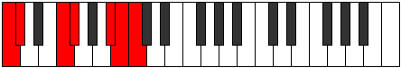 | [midi](ModeCNaturalZythimic.mid) [ogg](ModeCNaturalZythimic.ogg) |
| [3173](https://ianring.com/musictheory/scales/3173) | [Kanimic](ScaleKanimic.md) | [Zarimic](ModeZarimic.md) | **C**, **D**, E#, **F#**, G###, A##, **C** |  | [midi](ModeCNaturalZarimic.mid) [ogg](ModeCNaturalZarimic.ogg) |
| [3175](https://ianring.com/musictheory/scales/3175) | [Thycrian](ScaleThycrian.md) | [Eponian](ModeEponian.md) | **C**, **Db**, **Ebb**, F, Gb, A#, B, **C** |  | [midi](ModeCNaturalEponian.mid) [ogg](ModeCNaturalEponian.ogg) |
| [3177](https://ianring.com/musictheory/scales/3177) | [Mythimic](ScaleMythimic.md) | [Rothimic](ModeRothimic.md) | **C**, D#, E#, **F#**, G###, A##, **C** |  | [midi](ModeCNaturalRothimic.mid) [ogg](ModeCNaturalRothimic.ogg) |
| [3179](https://ianring.com/musictheory/scales/3179) | [Zogian](ScaleZogian.md) | [Daptian](ModeDaptian.md) | **C**, **Db**, Eb, F, Gb, A#, B, **C** |  | [midi](ModeCNaturalDaptian.mid) [ogg](ModeCNaturalDaptian.ogg) |
| [3181](https://ianring.com/musictheory/scales/3181) | [Aeolathian](ScaleAeolathian.md) | [Rolian](ModeRolian.md) | **C**, **D**, Eb, F, **Gb**, A#, B, **C** |  | [midi](ModeCNaturalRolian.mid) [ogg](ModeCNaturalRolian.ogg) |
| [3183](https://ianring.com/musictheory/scales/3183) | [Phroryllic](ScalePhroryllic.md) | [Mixonyllic](ModeMixonyllic.md) | **C**, **C#**, **D**, D#, F, F#, A#, B, **C** |  | [midi](ModeCNaturalMixonyllic.mid) [ogg](ModeCNaturalMixonyllic.ogg) |
| [3185](https://ianring.com/musictheory/scales/3185) | [Thonimic](ScaleThonimic.md) | [Thonimic](ModeThonimic.md) | **C**, D##, E#, **F#**, G###, A##, **C** |  | [midi](ModeCNaturalThonimic.mid) [ogg](ModeCNaturalThonimic.ogg) |
| [3187](https://ianring.com/musictheory/scales/3187) | [Aeolacrian](ScaleAeolacrian.md) | [Koptian](ModeKoptian.md) | **C**, **Db**, E, F, Gb, A#, B, **C** |  | [midi](ModeCNaturalKoptian.mid) [ogg](ModeCNaturalKoptian.ogg) |
| [3189](https://ianring.com/musictheory/scales/3189) | [Thacrian](ScaleThacrian.md) | [Aeolonian](ModeAeolonian.md) | **C**, **D**, E, F, **Gb**, A#, B, **C** |  | [midi](ModeCNaturalAeolonian.mid) [ogg](ModeCNaturalAeolonian.ogg) |
| [3191](https://ianring.com/musictheory/scales/3191) | [Aeoladyllic](ScaleAeoladyllic.md) | [Bynyllic](ModeBynyllic.md) | **C**, **C#**, **D**, E, F, F#, A#, B, **C** |  | [midi](ModeCNaturalBynyllic.mid) [ogg](ModeCNaturalBynyllic.ogg) |
| [3193](https://ianring.com/musictheory/scales/3193) | [Ionarian](ScaleIonarian.md) | [Zathian](ModeZathian.md) | **C**, D#, E, F, **Gb**, A#, B, **C** |  | [midi](ModeCNaturalZathian.mid) [ogg](ModeCNaturalZathian.ogg) |
| [3195](https://ianring.com/musictheory/scales/3195) | [Pynyllic](ScalePynyllic.md) | [Raryllic](ModeRaryllic.md) | **C**, **C#**, D#, E, F, F#, A#, B, **C** |  | [midi](ModeCNaturalRaryllic.mid) [ogg](ModeCNaturalRaryllic.ogg) |
| [3197](https://ianring.com/musictheory/scales/3197) | [Thagyllic](ScaleThagyllic.md) | [Gylyllic](ModeGylyllic.md) | **C**, **D**, D#, E, F, **F#**, A#, B, **C** |  | [midi](ModeCNaturalGylyllic.mid) [ogg](ModeCNaturalGylyllic.ogg) |
| [3199](https://ianring.com/musictheory/scales/3199) | [Manygic](ScaleManygic.md) | [Thaptygic](ModeThaptygic.md) | **C**, **C#**, **D**, D#, E, F, F#, A#, B, **C** |  | [midi](ModeCNaturalThaptygic.mid) [ogg](ModeCNaturalThaptygic.ogg) |
| [3209](https://ianring.com/musictheory/scales/3209) | [Aeolyritonic](ScaleAeolyritonic.md) | [Aeraphitonic](ModeAeraphitonic.md) | C, D#, **G**, **A#**, **B**, C | 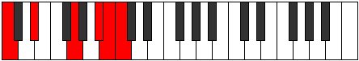 | [midi](ModeCNaturalAeraphitonic.mid) [ogg](ModeCNaturalAeraphitonic.ogg) |
| [3211](https://ianring.com/musictheory/scales/3211) | [Galimic](ScaleGalimic.md) | [Epacrimic](ModeEpacrimic.md) | C, **Db**, Eb, **F##**, **G###**, **A##**, C |  | [midi](ModeCNaturalEpacrimic.mid) [ogg](ModeCNaturalEpacrimic.ogg) |
| [3213](https://ianring.com/musictheory/scales/3213) | [Bygimic](ScaleBygimic.md) | [Eponimic](ModeEponimic.md) | C, **D**, Eb, F##, **G###**, **A##**, C |  | [midi](ModeCNaturalEponimic.mid) [ogg](ModeCNaturalEponimic.ogg) |
| [3215](https://ianring.com/musictheory/scales/3215) | [Thadian](ScaleThadian.md) | [Katydian](ModeKatydian.md) | C, **Db**, **Ebb**, Fbb, G, **A#**, **B**, C |  | [midi](ModeCNaturalKatydian.mid) [ogg](ModeCNaturalKatydian.ogg) |
| [3217](https://ianring.com/musictheory/scales/3217) | [Molitonic](ScaleMolitonic.md) | [Molitonic](ModeMolitonic.md) | C, E, **G**, **A#**, **B**, C |  | [midi](ModeCNaturalMolitonic.mid) [ogg](ModeCNaturalMolitonic.ogg) |
| [3219](https://ianring.com/musictheory/scales/3219) | [Epynimic](ScaleEpynimic.md) | [Ionaphimic](ModeIonaphimic.md) | C, **Db**, E, **F##**, **G###**, **A##**, C |  | [midi](ModeCNaturalIonaphimic.mid) [ogg](ModeCNaturalIonaphimic.ogg) |
| [3221](https://ianring.com/musictheory/scales/3221) | [Zagimic](ScaleZagimic.md) | [Bycrimic](ModeBycrimic.md) | C, **D**, E, F##, **G###**, **A##**, C |  | [midi](ModeCNaturalBycrimic.mid) [ogg](ModeCNaturalBycrimic.ogg) |
| [3223](https://ianring.com/musictheory/scales/3223) | [Katoptian](ScaleKatoptian.md) | [Thyphian](ModeThyphian.md) | C, **Db**, **Ebb**, Fb, G, **A#**, **B**, C |  | [midi](ModeCNaturalThyphian.mid) [ogg](ModeCNaturalThyphian.ogg) |
| [3225](https://ianring.com/musictheory/scales/3225) | [Mydimic](ScaleMydimic.md) | [Ionalimic](ModeIonalimic.md) | C, D#, E, **F##**, **G###**, **A##**, C |  | [midi](ModeCNaturalIonalimic.mid) [ogg](ModeCNaturalIonalimic.ogg) |
| [3227](https://ianring.com/musictheory/scales/3227) | [Gacrian](ScaleGacrian.md) | [Aeolocrian](ModeAeolocrian.md) | C, **Db**, Eb, Fb, **G**, **A#**, **B**, C |  | [midi](ModeCNaturalAeolocrian.mid) [ogg](ModeCNaturalAeolocrian.ogg) |
| [3229](https://ianring.com/musictheory/scales/3229) | [Stalian](ScaleStalian.md) | [Aeolaptian](ModeAeolaptian.md) | C, **D**, Eb, Fb, G, **A#**, **B**, C |  | [midi](ModeCNaturalAeolaptian.mid) [ogg](ModeCNaturalAeolaptian.ogg) |
| [3231](https://ianring.com/musictheory/scales/3231) | [Zaryllic](ScaleZaryllic.md) | [Kataptyllic](ModeKataptyllic.md) | C, **C#**, **D**, D#, E, G, **A#**, **B**, C |  | [midi](ModeCNaturalKataptyllic.mid) [ogg](ModeCNaturalKataptyllic.ogg) |
| [3235](https://ianring.com/musictheory/scales/3235) | [Stalimic](ScaleStalimic.md) | [Pothimic](ModePothimic.md) | C, **Db**, E#, **F##**, G###, **A##**, C |  | [midi](ModeCNaturalPothimic.mid) [ogg](ModeCNaturalPothimic.ogg) |
| [3237](https://ianring.com/musictheory/scales/3237) | [Ionacrimic](ScaleIonacrimic.md) | [Thatimic](ModeThatimic.md) | C, **D**, E#, F##, G###, **A##**, C |  | [midi](ModeCNaturalThatimic.mid) [ogg](ModeCNaturalThatimic.ogg) |
| [3239](https://ianring.com/musictheory/scales/3239) | [Morian](ScaleMorian.md) | [Epythian](ModeEpythian.md) | C, **Db**, **Ebb**, F, G, A#, **B**, C |  | [midi](ModeCNaturalEpythian.mid) [ogg](ModeCNaturalEpythian.ogg) |
| [3241](https://ianring.com/musictheory/scales/3241) | [Dalimic](ScaleDalimic.md) | [Dalimic](ModeDalimic.md) | C, D#, E#, **F##**, G###, **A##**, C |  | [midi](ModeCNaturalDalimic.mid) [ogg](ModeCNaturalDalimic.ogg) |
| [3243](https://ianring.com/musictheory/scales/3243) | [Pagian](ScalePagian.md) | [Staptian](ModeStaptian.md) | C, **Db**, Eb, F, **G**, A#, **B**, C |  | [midi](ModeCNaturalStaptian.mid) [ogg](ModeCNaturalStaptian.ogg) |
| [3245](https://ianring.com/musictheory/scales/3245) | [Aerathian](ScaleAerathian.md) | [Aeracrian](ModeAeracrian.md) | C, **D**, Eb, F, G, A#, **B**, C |  | [midi](ModeCNaturalAeracrian.mid) [ogg](ModeCNaturalAeracrian.ogg) |
| [3247](https://ianring.com/musictheory/scales/3247) | [Kataryllic](ScaleKataryllic.md) | [Aeolonyllic](ModeAeolonyllic.md) | C, **C#**, **D**, D#, F, G, A#, **B**, C |  | [midi](ModeCNaturalAeolonyllic.mid) [ogg](ModeCNaturalAeolonyllic.ogg) |
| [3249](https://ianring.com/musictheory/scales/3249) | [Epygimic](ScaleEpygimic.md) | [Epygimic](ModeEpygimic.md) | C, D##, E#, **F##**, G###, **A##**, C |  | [midi](ModeCNaturalEpygimic.mid) [ogg](ModeCNaturalEpygimic.ogg) |
| [3251](https://ianring.com/musictheory/scales/3251) | [Ranian](ScaleRanian.md) | [Zodian](ModeZodian.md) | C, **Db**, E, F, **G**, A#, **B**, C |  | [midi](ModeCNaturalZodian.mid) [ogg](ModeCNaturalZodian.ogg) |
| [3253](https://ianring.com/musictheory/scales/3253) | [Ionycrian](ScaleIonycrian.md) | [Gonian](ModeGonian.md) | C, **D**, E, F, G, A#, **B**, C |  | [midi](ModeCNaturalGonian.mid) [ogg](ModeCNaturalGonian.ogg) |
| [3255](https://ianring.com/musictheory/scales/3255) | [Tharyllic](ScaleTharyllic.md) | [Daryllic](ModeDaryllic.md) | C, **C#**, **D**, E, F, G, A#, **B**, C |  | [midi](ModeCNaturalDaryllic.mid) [ogg](ModeCNaturalDaryllic.ogg) |
| [3257](https://ianring.com/musictheory/scales/3257) | [Epogian](ScaleEpogian.md) | [Ionacrian](ModeIonacrian.md) | C, D#, E, F, **G**, A#, **B**, C |  | [midi](ModeCNaturalIonacrian.mid) [ogg](ModeCNaturalIonacrian.ogg) |
| [3259](https://ianring.com/musictheory/scales/3259) | [Zagyllic](ScaleZagyllic.md) | [Loptyllic](ModeLoptyllic.md) | C, **C#**, D#, E, F, **G**, A#, **B**, C |  | [midi](ModeCNaturalLoptyllic.mid) [ogg](ModeCNaturalLoptyllic.ogg) |
| [3261](https://ianring.com/musictheory/scales/3261) | [Dagyllic](ScaleDagyllic.md) | [Dodyllic](ModeDodyllic.md) | C, **D**, D#, E, F, G, A#, **B**, C |  | [midi](ModeCNaturalDodyllic.mid) [ogg](ModeCNaturalDodyllic.ogg) |
| [3263](https://ianring.com/musictheory/scales/3263) | [Aeolacrygic](ScaleAeolacrygic.md) | [Pyrygic](ModePyrygic.md) | C, **C#**, **D**, D#, E, F, G, A#, **B**, C | 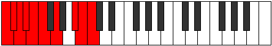 | [midi](ModeCNaturalPyrygic.mid) [ogg](ModeCNaturalPyrygic.ogg) |
| [3269](https://ianring.com/musictheory/scales/3269) | [Thogimic](ScaleThogimic.md) | [Lodimic](ModeLodimic.md) | C, **D**, **E##**, F##, **G###**, A##, C |  | [midi](ModeCNaturalLodimic.mid) [ogg](ModeCNaturalLodimic.ogg) |
| [3271](https://ianring.com/musictheory/scales/3271) | [Parian](ScaleParian.md) | [Kolian](ModeKolian.md) | C, **Db**, **Ebb**, F#, G, **A#**, B, C |  | [midi](ModeCNaturalKolian.mid) [ogg](ModeCNaturalKolian.ogg) |
| [3273](https://ianring.com/musictheory/scales/3273) | [Ionodimic](ScaleIonodimic.md) | [Ionodimic](ModeIonodimic.md) | C, D#, **E##**, **F##**, **G###**, A##, C |  | [midi](ModeCNaturalIonodimic.mid) [ogg](ModeCNaturalIonodimic.ogg) |
| [3275](https://ianring.com/musictheory/scales/3275) | [Zarian](ScaleZarian.md) | [Katadian](ModeKatadian.md) | C, **Db**, Eb, F#, **G**, **A#**, B, C |  | [midi](ModeCNaturalKatadian.mid) [ogg](ModeCNaturalKatadian.ogg) |
| [3277](https://ianring.com/musictheory/scales/3277) | [Tholian](ScaleTholian.md) | [Zycrian](ModeZycrian.md) | C, **D**, Eb, **F#**, G, **A#**, B, C |  | [midi](ModeCNaturalZycrian.mid) [ogg](ModeCNaturalZycrian.ogg) |
| [3279](https://ianring.com/musictheory/scales/3279) | [Ioniptyllic](ScaleIoniptyllic.md) | [Pythyllic](ModePythyllic.md) | C, **C#**, **D**, D#, F#, G, **A#**, B, C |  | [midi](ModeCNaturalPythyllic.mid) [ogg](ModeCNaturalPythyllic.ogg) |
| [3281](https://ianring.com/musictheory/scales/3281) | [Katythimic](ScaleKatythimic.md) | [Katythimic](ModeKatythimic.md) | C, D##, **E##**, **F##**, **G###**, A##, C |  | [midi](ModeCNaturalKatythimic.mid) [ogg](ModeCNaturalKatythimic.ogg) |
| [3283](https://ianring.com/musictheory/scales/3283) | [Katocrian](ScaleKatocrian.md) | [Lyrian](ModeLyrian.md) | C, **Db**, E, F#, **G**, **A#**, B, C |  | [midi](ModeCNaturalLyrian.mid) [ogg](ModeCNaturalLyrian.ogg) |
| [3285](https://ianring.com/musictheory/scales/3285) | [Dolian](ScaleDolian.md) | [Zagian](ModeZagian.md) | C, **D**, E, **F#**, G, **A#**, B, C |  | [midi](ModeCNaturalZagian.mid) [ogg](ModeCNaturalZagian.ogg) |
| [3287](https://ianring.com/musictheory/scales/3287) | [Gythyllic](ScaleGythyllic.md) | [Phrathyllic](ModePhrathyllic.md) | C, **C#**, **D**, E, F#, G, **A#**, B, C |  | [midi](ModeCNaturalPhrathyllic.mid) [ogg](ModeCNaturalPhrathyllic.ogg) |
| [3289](https://ianring.com/musictheory/scales/3289) | [Loptian](ScaleLoptian.md) | [Loptian](ModeLoptian.md) | C, D#, E, **F#**, **G**, **A#**, B, C |  | [midi](ModeCNaturalLoptian.mid) [ogg](ModeCNaturalLoptian.ogg) |
| [3291](https://ianring.com/musictheory/scales/3291) | [Aeolathyllic](ScaleAeolathyllic.md) | [Kodyllic](ModeKodyllic.md) | C, **C#**, D#, E, F#, **G**, **A#**, B, C |  | [midi](ModeCNaturalKodyllic.mid) [ogg](ModeCNaturalKodyllic.ogg) |
| [3293](https://ianring.com/musictheory/scales/3293) | [Lonyllic](ScaleLonyllic.md) | [Saryllic](ModeSaryllic.md) | C, **D**, D#, E, **F#**, G, **A#**, B, C |  | [midi](ModeCNaturalSaryllic.mid) [ogg](ModeCNaturalSaryllic.ogg) |
| [3295](https://ianring.com/musictheory/scales/3295) | [Zothygic](ScaleZothygic.md) | [Phroptygic](ModePhroptygic.md) | C, **C#**, **D**, D#, E, F#, G, **A#**, B, C |  | [midi](ModeCNaturalPhroptygic.mid) [ogg](ModeCNaturalPhroptygic.ogg) |
| [3299](https://ianring.com/musictheory/scales/3299) | [Ionarian](ScaleIonarian.md) | [Syptian](ModeSyptian.md) | C, **Db**, E#, F#, **G**, A#, B, C |  | [midi](ModeCNaturalSyptian.mid) [ogg](ModeCNaturalSyptian.ogg) |
| [3301](https://ianring.com/musictheory/scales/3301) | [Epogian](ScaleEpogian.md) | [Phrynian](ModePhrynian.md) | C, **D**, E#, **F#**, G, A#, B, C |  | [midi](ModeCNaturalPhrynian.mid) [ogg](ModeCNaturalPhrynian.ogg) |
| [3303](https://ianring.com/musictheory/scales/3303) | [Locryllic](ScaleLocryllic.md) | [Soptyllic](ModeSoptyllic.md) | C, **C#**, **D**, F, F#, G, A#, B, C |  | [midi](ModeCNaturalSoptyllic.mid) [ogg](ModeCNaturalSoptyllic.ogg) |
| [3305](https://ianring.com/musictheory/scales/3305) | [Epathian](ScaleEpathian.md) | [Epathian](ModeEpathian.md) | C, D#, E#, **F#**, **G**, A#, B, C |  | [midi](ModeCNaturalEpathian.mid) [ogg](ModeCNaturalEpathian.ogg) |
| [3307](https://ianring.com/musictheory/scales/3307) | [Bacryllic](ScaleBacryllic.md) | [Boptyllic](ModeBoptyllic.md) | C, **C#**, D#, F, F#, **G**, A#, B, C |  | [midi](ModeCNaturalBoptyllic.mid) [ogg](ModeCNaturalBoptyllic.ogg) |
| [3309](https://ianring.com/musictheory/scales/3309) | [Dydyllic](ScaleDydyllic.md) | [Bycryllic](ModeBycryllic.md) | C, **D**, D#, F, **F#**, G, A#, B, C |  | [midi](ModeCNaturalBycryllic.mid) [ogg](ModeCNaturalBycryllic.ogg) |
| [3311](https://ianring.com/musictheory/scales/3311) | [Loptygic](ScaleLoptygic.md) | [Mixodygic](ModeMixodygic.md) | C, **C#**, **D**, D#, F, F#, G, A#, B, C |  | [midi](ModeCNaturalMixodygic.mid) [ogg](ModeCNaturalMixodygic.ogg) |
| [3313](https://ianring.com/musictheory/scales/3313) | [Aeolacrian](ScaleAeolacrian.md) | [Aeolacrian](ModeAeolacrian.md) | C, D##, E#, **F#**, **G**, A#, B, C |  | [midi](ModeCNaturalAeolacrian.mid) [ogg](ModeCNaturalAeolacrian.ogg) |
| [3315](https://ianring.com/musictheory/scales/3315) | [Sydyllic](ScaleSydyllic.md) | [Aeralyllic](ModeAeralyllic.md) | C, **C#**, E, F, F#, **G**, A#, B, C |  | [midi](ModeCNaturalAeralyllic.mid) [ogg](ModeCNaturalAeralyllic.ogg) |
| [3317](https://ianring.com/musictheory/scales/3317) | [Aeracryllic](ScaleAeracryllic.md) | [Lanyllic](ModeLanyllic.md) | C, **D**, E, F, **F#**, G, A#, B, C |  | [midi](ModeCNaturalLanyllic.mid) [ogg](ModeCNaturalLanyllic.ogg) |
| [3319](https://ianring.com/musictheory/scales/3319) | [Dycrygic](ScaleDycrygic.md) | [Tholygic](ModeTholygic.md) | C, **C#**, **D**, E, F, F#, G, A#, B, C |  | [midi](ModeCNaturalTholygic.mid) [ogg](ModeCNaturalTholygic.ogg) |
| [3321](https://ianring.com/musictheory/scales/3321) | [Locryllic](ScaleLocryllic.md) | [Ionycryllic](ModeIonycryllic.md) | C, D#, E, F, **F#**, **G**, A#, B, C |  | [midi](ModeCNaturalIonycryllic.mid) [ogg](ModeCNaturalIonycryllic.ogg) |
| [3323](https://ianring.com/musictheory/scales/3323) | [Mixolydygic](ScaleMixolydygic.md) | [Phrygygic](ModePhrygygic.md) | C, **C#**, D#, E, F, F#, **G**, A#, B, C |  | [midi](ModeCNaturalPhrygygic.mid) [ogg](ModeCNaturalPhrygygic.ogg) |
| [3325](https://ianring.com/musictheory/scales/3325) | [Kalygic](ScaleKalygic.md) | [Epygic](ModeEpygic.md) | C, **D**, D#, E, F, **F#**, G, A#, B, C |  | [midi](ModeCNaturalEpygic.mid) [ogg](ModeCNaturalEpygic.ogg) |
| [3327](https://ianring.com/musictheory/scales/3327) | [Katoryllian](ScaleKatoryllian.md) | [Madyllian](ModeMadyllian.md) | C, **C#**, **D**, D#, E, F, F#, G, A#, B, C |  | [midi](ModeCNaturalMadyllian.mid) [ogg](ModeCNaturalMadyllian.ogg) |
| [3345](https://ianring.com/musictheory/scales/3345) | [Zylitonic](ScaleZylitonic.md) | [Zylitonic](ModeZylitonic.md) | **C**, E, **G#**, **A#**, **B**, **C** |  | [midi](ModeCNaturalZylitonic.mid) [ogg](ModeCNaturalZylitonic.ogg) |
| [3347](https://ianring.com/musictheory/scales/3347) | [Kocrimic](ScaleKocrimic.md) | [Synimic](ModeSynimic.md) | **C**, Db, E, **F###**, **G###**, **A##**, **C** |  | [midi](ModeCNaturalSynimic.mid) [ogg](ModeCNaturalSynimic.ogg) |
| [3349](https://ianring.com/musictheory/scales/3349) | [Gacrimic](ScaleGacrimic.md) | [Aeolocrimic](ModeAeolocrimic.md) | **C**, **D**, E, **F###**, **G###**, **A##**, **C** |  | [midi](ModeCNaturalAeolocrimic.mid) [ogg](ModeCNaturalAeolocrimic.ogg) |
| [3351](https://ianring.com/musictheory/scales/3351) | [Gydian](ScaleGydian.md) | [Karian](ModeKarian.md) | **C**, Db, **Ebb**, Fb, **G#**, **A#**, **B**, **C** |  | [midi](ModeCNaturalKarian.mid) [ogg](ModeCNaturalKarian.ogg) |
| [3353](https://ianring.com/musictheory/scales/3353) | [Aerycrimic](ScaleAerycrimic.md) | [Phraptimic](ModePhraptimic.md) | **C**, D#, E, F###, **G###**, **A##**, **C** |  | [midi](ModeCNaturalPhraptimic.mid) [ogg](ModeCNaturalPhraptimic.ogg) |
| [3355](https://ianring.com/musictheory/scales/3355) | [Epycrian](ScaleEpycrian.md) | [Bagian](ModeBagian.md) | **C**, Db, Eb, Fb, G#, **A#**, **B**, **C** |  | [midi](ModeCNaturalBagian.mid) [ogg](ModeCNaturalBagian.ogg) |
| [3357](https://ianring.com/musictheory/scales/3357) | [Katogian](ScaleKatogian.md) | [Phrodian](ModePhrodian.md) | **C**, **D**, Eb, Fb, G#, **A#**, **B**, **C** |  | [midi](ModeCNaturalPhrodian.mid) [ogg](ModeCNaturalPhrodian.ogg) |
| [3359](https://ianring.com/musictheory/scales/3359) | [Stycryllic](ScaleStycryllic.md) | [Bonyllic](ModeBonyllic.md) | **C**, C#, **D**, D#, E, G#, **A#**, **B**, **C** |  | [midi](ModeCNaturalBonyllic.mid) [ogg](ModeCNaturalBonyllic.ogg) |
| [3363](https://ianring.com/musictheory/scales/3363) | [Starimic](ScaleStarimic.md) | [Rogimic](ModeRogimic.md) | **C**, Db, E#, **F###**, G###, **A##**, **C** |  | [midi](ModeCNaturalRogimic.mid) [ogg](ModeCNaturalRogimic.ogg) |
| [3365](https://ianring.com/musictheory/scales/3365) | [Thagimic](ScaleThagimic.md) | [Katolimic](ModeKatolimic.md) | **C**, **D**, E#, **F###**, G###, **A##**, **C** |  | [midi](ModeCNaturalKatolimic.mid) [ogg](ModeCNaturalKatolimic.ogg) |
| [3367](https://ianring.com/musictheory/scales/3367) | [Bonian](ScaleBonian.md) | [Moptian](ModeMoptian.md) | **C**, Db, **Ebb**, F, **G#**, A#, **B**, **C** |  | [midi](ModeCNaturalMoptian.mid) [ogg](ModeCNaturalMoptian.ogg) |
| [3369](https://ianring.com/musictheory/scales/3369) | [Mixolimic](ScaleMixolimic.md) | [Mixolimic](ModeMixolimic.md) | **C**, D#, E#, F###, G###, **A##**, **C** |  | [midi](ModeCNaturalMixolimic.mid) [ogg](ModeCNaturalMixolimic.ogg) |
| [3371](https://ianring.com/musictheory/scales/3371) | [Stathian](ScaleStathian.md) | [Aeolylian](ModeAeolylian.md) | **C**, Db, Eb, F, G#, A#, **B**, **C** |  | [midi](ModeCNaturalAeolylian.mid) [ogg](ModeCNaturalAeolylian.ogg) |
| [3373](https://ianring.com/musictheory/scales/3373) | [Rythian](ScaleRythian.md) | [Lodian](ModeLodian.md) | **C**, **D**, Eb, F, G#, A#, **B**, **C** |  | [midi](ModeCNaturalLodian.mid) [ogg](ModeCNaturalLodian.ogg) |
| [3375](https://ianring.com/musictheory/scales/3375) | [Mixolydyllic](ScaleMixolydyllic.md) | [Kygyllic](ModeKygyllic.md) | **C**, C#, **D**, D#, F, G#, A#, **B**, **C** |  | [midi](ModeCNaturalKygyllic.mid) [ogg](ModeCNaturalKygyllic.ogg) |
| [3377](https://ianring.com/musictheory/scales/3377) | [Phralimic](ScalePhralimic.md) | [Phralimic](ModePhralimic.md) | **C**, D##, E#, **F###**, G###, **A##**, **C** |  | [midi](ModeCNaturalPhralimic.mid) [ogg](ModeCNaturalPhralimic.ogg) |
| [3379](https://ianring.com/musictheory/scales/3379) | [Laptian](ScaleLaptian.md) | [Sothian](ModeSothian.md) | **C**, Db, E, F, **G#**, A#, **B**, **C** |  | [midi](ModeCNaturalSothian.mid) [ogg](ModeCNaturalSothian.ogg) |
| [3381](https://ianring.com/musictheory/scales/3381) | [Eporian](ScaleEporian.md) | [Katanian](ModeKatanian.md) | **C**, **D**, E, F, **G#**, A#, **B**, **C** |  | [midi](ModeCNaturalKatanian.mid) [ogg](ModeCNaturalKatanian.ogg) |
| [3383](https://ianring.com/musictheory/scales/3383) | [Aeronyllic](ScaleAeronyllic.md) | [Daptyllic](ModeDaptyllic.md) | **C**, C#, **D**, E, F, **G#**, A#, **B**, **C** |  | [midi](ModeCNaturalDaptyllic.mid) [ogg](ModeCNaturalDaptyllic.ogg) |
| [3385](https://ianring.com/musictheory/scales/3385) | [Epathian](ScaleEpathian.md) | [Rothian](ModeRothian.md) | **C**, D#, E, F, G#, A#, **B**, **C** |  | [midi](ModeCNaturalRothian.mid) [ogg](ModeCNaturalRothian.ogg) |
| [3387](https://ianring.com/musictheory/scales/3387) | [Pothyllic](ScalePothyllic.md) | [Aeryptyllic](ModeAeryptyllic.md) | **C**, C#, D#, E, F, G#, A#, **B**, **C** |  | [midi](ModeCNaturalAeryptyllic.mid) [ogg](ModeCNaturalAeryptyllic.ogg) |
| [3389](https://ianring.com/musictheory/scales/3389) | [Zoryllic](ScaleZoryllic.md) | [Socryllic](ModeSocryllic.md) | **C**, **D**, D#, E, F, G#, A#, **B**, **C** |  | [midi](ModeCNaturalSocryllic.mid) [ogg](ModeCNaturalSocryllic.ogg) |
| [3391](https://ianring.com/musictheory/scales/3391) | [Sathygic](ScaleSathygic.md) | [Aeolynygic](ModeAeolynygic.md) | **C**, C#, **D**, D#, E, F, G#, A#, **B**, **C** |  | [midi](ModeCNaturalAeolynygic.mid) [ogg](ModeCNaturalAeolynygic.ogg) |
| [3397](https://ianring.com/musictheory/scales/3397) | [Dathimic](ScaleDathimic.md) | [Sydimic](ModeSydimic.md) | **C**, **D**, **E##**, **F###**, **G###**, A##, **C** |  | [midi](ModeCNaturalSydimic.mid) [ogg](ModeCNaturalSydimic.ogg) |
| [3399](https://ianring.com/musictheory/scales/3399) | [Pythian](ScalePythian.md) | [Zonian](ModeZonian.md) | **C**, Db, **Ebb**, F#, **G#**, **A#**, B, **C** |  | [midi](ModeCNaturalZonian.mid) [ogg](ModeCNaturalZonian.ogg) |
| [3401](https://ianring.com/musictheory/scales/3401) | [Palimic](ScalePalimic.md) | [Palimic](ModePalimic.md) | **C**, D#, **E##**, F###, **G###**, A##, **C** |  | [midi](ModeCNaturalPalimic.mid) [ogg](ModeCNaturalPalimic.ogg) |
| [3403](https://ianring.com/musictheory/scales/3403) | [Soptian](ScaleSoptian.md) | [Bylian](ModeBylian.md) | **C**, Db, Eb, F#, G#, **A#**, B, **C** |  | [midi](ModeCNaturalBylian.mid) [ogg](ModeCNaturalBylian.ogg) |
| [3405](https://ianring.com/musictheory/scales/3405) | [Epacrian](ScaleEpacrian.md) | [Stynian](ModeStynian.md) | **C**, **D**, Eb, **F#**, G#, **A#**, B, **C** |  | [midi](ModeCNaturalStynian.mid) [ogg](ModeCNaturalStynian.ogg) |
| [3407](https://ianring.com/musictheory/scales/3407) | [Phranyllic](ScalePhranyllic.md) | [Katocryllic](ModeKatocryllic.md) | **C**, C#, **D**, D#, F#, G#, **A#**, B, **C** |  | [midi](ModeCNaturalKatocryllic.mid) [ogg](ModeCNaturalKatocryllic.ogg) |
| [3409](https://ianring.com/musictheory/scales/3409) | [Katanimic](ScaleKatanimic.md) | [Katanimic](ModeKatanimic.md) | **C**, D##, **E##**, **F###**, **G###**, A##, **C** |  | [midi](ModeCNaturalKatanimic.mid) [ogg](ModeCNaturalKatanimic.ogg) |
| [3411](https://ianring.com/musictheory/scales/3411) | [Phraptian](ScalePhraptian.md) | [Ionathian](ModeIonathian.md) | **C**, Db, E, F#, **G#**, **A#**, B, **C** |  | [midi](ModeCNaturalIonathian.mid) [ogg](ModeCNaturalIonathian.ogg) |
| [3413](https://ianring.com/musictheory/scales/3413) | [Aeolynian](ScaleAeolynian.md) | [Aeolynian](ModeAeolynian.md) | **C**, **D**, E, **F#**, **G#**, **A#**, B, **C** |  | [midi](ModeCNaturalAeolynian.mid) [ogg](ModeCNaturalAeolynian.ogg) |
| [3415](https://ianring.com/musictheory/scales/3415) | [Thyryllic](ScaleThyryllic.md) | [Ionaptyllic](ModeIonaptyllic.md) | **C**, C#, **D**, E, F#, **G#**, **A#**, B, **C** |  | [midi](ModeCNaturalIonaptyllic.mid) [ogg](ModeCNaturalIonaptyllic.ogg) |
| [3417](https://ianring.com/musictheory/scales/3417) | [Golian](ScaleGolian.md) | [Golian](ModeGolian.md) | **C**, D#, E, **F#**, G#, **A#**, B, **C** |  | [midi](ModeCNaturalGolian.mid) [ogg](ModeCNaturalGolian.ogg) |
| [3419](https://ianring.com/musictheory/scales/3419) | [Ionocryllic](ScaleIonocryllic.md) | [Danyllic](ModeDanyllic.md) | **C**, C#, D#, E, F#, G#, **A#**, B, **C** |  | [midi](ModeCNaturalDanyllic.mid) [ogg](ModeCNaturalDanyllic.ogg) |
| [3421](https://ianring.com/musictheory/scales/3421) | [Racryllic](ScaleRacryllic.md) | [Aerothyllic](ModeAerothyllic.md) | **C**, **D**, D#, E, **F#**, G#, **A#**, B, **C** |  | [midi](ModeCNaturalAerothyllic.mid) [ogg](ModeCNaturalAerothyllic.ogg) |
| [3423](https://ianring.com/musictheory/scales/3423) | [Kyrygic](ScaleKyrygic.md) | [Lothygic](ModeLothygic.md) | **C**, C#, **D**, D#, E, F#, G#, **A#**, B, **C** |  | [midi](ModeCNaturalLothygic.mid) [ogg](ModeCNaturalLothygic.ogg) |
| [3427](https://ianring.com/musictheory/scales/3427) | [Ionythian](ScaleIonythian.md) | [Zacrian](ModeZacrian.md) | **C**, Db, E#, F#, **G#**, A#, B, **C** |  | [midi](ModeCNaturalZacrian.mid) [ogg](ModeCNaturalZacrian.ogg) |
| [3429](https://ianring.com/musictheory/scales/3429) | [Korian](ScaleKorian.md) | [Marian](ModeMarian.md) | **C**, **D**, E#, **F#**, **G#**, A#, B, **C** |  | [midi](ModeCNaturalMarian.mid) [ogg](ModeCNaturalMarian.ogg) |
| [3431](https://ianring.com/musictheory/scales/3431) | [Aeolothyllic](ScaleAeolothyllic.md) | [Zyptyllic](ModeZyptyllic.md) | **C**, C#, **D**, F, F#, **G#**, A#, B, **C** |  | [midi](ModeCNaturalZyptyllic.mid) [ogg](ModeCNaturalZyptyllic.ogg) |
| [3433](https://ianring.com/musictheory/scales/3433) | [Thonian](ScaleThonian.md) | [Thonian](ModeThonian.md) | **C**, D#, E#, **F#**, G#, A#, B, **C** |  | [midi](ModeCNaturalThonian.mid) [ogg](ModeCNaturalThonian.ogg) |
| [3435](https://ianring.com/musictheory/scales/3435) | [Aerycryllic](ScaleAerycryllic.md) | [Epiphyllic](ModeEpiphyllic.md) | **C**, C#, D#, F, F#, G#, A#, B, **C** |  | [midi](ModeCNaturalEpiphyllic.mid) [ogg](ModeCNaturalEpiphyllic.ogg) |
| [3437](https://ianring.com/musictheory/scales/3437) | [Dalyllic](ScaleDalyllic.md) | [Gathyllic](ModeGathyllic.md) | **C**, **D**, D#, F, **F#**, G#, A#, B, **C** |  | [midi](ModeCNaturalGathyllic.mid) [ogg](ModeCNaturalGathyllic.ogg) |
| [3439](https://ianring.com/musictheory/scales/3439) | [Apinygic](ScaleApinygic.md) | [Lythygic](ModeLythygic.md) | **C**, C#, **D**, D#, F, F#, G#, A#, B, **C** |  | [midi](ModeCNaturalLythygic.mid) [ogg](ModeCNaturalLythygic.ogg) |
| [3441](https://ianring.com/musictheory/scales/3441) | [Thacrian](ScaleThacrian.md) | [Thacrian](ModeThacrian.md) | **C**, D##, E#, **F#**, **G#**, A#, B, **C** |  | [midi](ModeCNaturalThacrian.mid) [ogg](ModeCNaturalThacrian.ogg) |
| [3443](https://ianring.com/musictheory/scales/3443) | [Aeracryllic](ScaleAeracryllic.md) | [Epathyllic](ModeEpathyllic.md) | **C**, C#, E, F, F#, **G#**, A#, B, **C** |  | [midi](ModeCNaturalEpathyllic.mid) [ogg](ModeCNaturalEpathyllic.ogg) |
| [3445](https://ianring.com/musictheory/scales/3445) | [Epotyllic](ScaleEpotyllic.md) | [Epotyllic](ModeEpotyllic.md) | **C**, **D**, E, F, **F#**, **G#**, A#, B, **C** |  | [midi](ModeCNaturalEpotyllic.mid) [ogg](ModeCNaturalEpotyllic.ogg) |
| [3447](https://ianring.com/musictheory/scales/3447) | [Kaptygic](ScaleKaptygic.md) | [Kynygic](ModeKynygic.md) | **C**, C#, **D**, E, F, F#, **G#**, A#, B, **C** |  | [midi](ModeCNaturalKynygic.mid) [ogg](ModeCNaturalKynygic.ogg) |
| [3449](https://ianring.com/musictheory/scales/3449) | [Bacryllic](ScaleBacryllic.md) | [Bacryllic](ModeBacryllic.md) | **C**, D#, E, F, **F#**, G#, A#, B, **C** |  | [midi](ModeCNaturalBacryllic.mid) [ogg](ModeCNaturalBacryllic.ogg) |
| [3451](https://ianring.com/musictheory/scales/3451) | [Aerycrygic](ScaleAerycrygic.md) | [Garygic](ModeGarygic.md) | **C**, C#, D#, E, F, F#, G#, A#, B, **C** |  | [midi](ModeCNaturalGarygic.mid) [ogg](ModeCNaturalGarygic.ogg) |
| [3453](https://ianring.com/musictheory/scales/3453) | [Porygic](ScalePorygic.md) | [Katarygic](ModeKatarygic.md) | **C**, **D**, D#, E, F, **F#**, G#, A#, B, **C** |  | [midi](ModeCNaturalKatarygic.mid) [ogg](ModeCNaturalKatarygic.ogg) |
| [3455](https://ianring.com/musictheory/scales/3455) | [Sydyllian](ScaleSydyllian.md) | [Ryptyllian](ModeRyptyllian.md) | **C**, C#, **D**, D#, E, F, F#, G#, A#, B, **C** |  | [midi](ModeCNaturalRyptyllian.mid) [ogg](ModeCNaturalRyptyllian.ogg) |
| [3465](https://ianring.com/musictheory/scales/3465) | [Syrimic](ScaleSyrimic.md) | [Katathimic](ModeKatathimic.md) | C, D#, **E###**, F###, **G###**, **A##**, C |  | [midi](ModeCNaturalKatathimic.mid) [ogg](ModeCNaturalKatathimic.ogg) |
| [3467](https://ianring.com/musictheory/scales/3467) | [Zorian](ScaleZorian.md) | [Katonian](ModeKatonian.md) | C, Db, Eb, **F##**, G#, **A#**, **B**, C |  | [midi](ModeCNaturalKatonian.mid) [ogg](ModeCNaturalKatonian.ogg) |
| [3469](https://ianring.com/musictheory/scales/3469) | [Stythian](ScaleStythian.md) | [Monian](ModeMonian.md) | C, **D**, Eb, F##, G#, **A#**, **B**, C |  | [midi](ModeCNaturalMonian.mid) [ogg](ModeCNaturalMonian.ogg) |
| [3471](https://ianring.com/musictheory/scales/3471) | [Dolyllic](ScaleDolyllic.md) | [Gyryllic](ModeGyryllic.md) | C, C#, **D**, D#, G, G#, **A#**, **B**, C |  | [midi](ModeCNaturalGyryllic.mid) [ogg](ModeCNaturalGyryllic.ogg) |
| [3473](https://ianring.com/musictheory/scales/3473) | [Lathimic](ScaleLathimic.md) | [Lathimic](ModeLathimic.md) | C, D##, **E###**, **F###**, **G###**, **A##**, C |  | [midi](ModeCNaturalLathimic.mid) [ogg](ModeCNaturalLathimic.ogg) |
| [3475](https://ianring.com/musictheory/scales/3475) | [Epagian](ScaleEpagian.md) | [Kylian](ModeKylian.md) | C, Db, E, **F##**, **G#**, **A#**, **B**, C |  | [midi](ModeCNaturalKylian.mid) [ogg](ModeCNaturalKylian.ogg) |
| [3477](https://ianring.com/musictheory/scales/3477) | [Ionanian](ScaleIonanian.md) | [Kyptian](ModeKyptian.md) | C, **D**, E, F##, **G#**, **A#**, **B**, C |  | [midi](ModeCNaturalKyptian.mid) [ogg](ModeCNaturalKyptian.ogg) |
| [3479](https://ianring.com/musictheory/scales/3479) | [Stacryllic](ScaleStacryllic.md) | [Rothyllic](ModeRothyllic.md) | C, C#, **D**, E, G, **G#**, **A#**, **B**, C |  | [midi](ModeCNaturalRothyllic.mid) [ogg](ModeCNaturalRothyllic.ogg) |
| [3481](https://ianring.com/musictheory/scales/3481) | [Katathian](ScaleKatathian.md) | [Katathian](ModeKatathian.md) | C, D#, E, **F##**, G#, **A#**, **B**, C |  | [midi](ModeCNaturalKatathian.mid) [ogg](ModeCNaturalKatathian.ogg) |
| [3483](https://ianring.com/musictheory/scales/3483) | [Doptyllic](ScaleDoptyllic.md) | [Mixotharyllic](ModeMixotharyllic.md) | C, C#, D#, E, **G**, G#, **A#**, **B**, C |  | [midi](ModeCNaturalMixotharyllic.mid) [ogg](ModeCNaturalMixotharyllic.ogg) |
| [3485](https://ianring.com/musictheory/scales/3485) | [Thyptyllic](ScaleThyptyllic.md) | [Kyptyllic](ModeKyptyllic.md) | C, **D**, D#, E, G, G#, **A#**, **B**, C |  | [midi](ModeCNaturalKyptyllic.mid) [ogg](ModeCNaturalKyptyllic.ogg) |
| [3487](https://ianring.com/musictheory/scales/3487) | [Phrygic](ScalePhrygic.md) | [Byptygic](ModeByptygic.md) | C, C#, **D**, D#, E, G, G#, **A#**, **B**, C |  | [midi](ModeCNaturalByptygic.mid) [ogg](ModeCNaturalByptygic.ogg) |
| [3491](https://ianring.com/musictheory/scales/3491) | [Aeopian](ScaleAeopian.md) | [Tharian](ModeTharian.md) | C, Db, E#, **F##**, **G#**, A#, **B**, C |  | [midi](ModeCNaturalTharian.mid) [ogg](ModeCNaturalTharian.ogg) |
| [3493](https://ianring.com/musictheory/scales/3493) | [Ionopian](ScaleIonopian.md) | [Rathian](ModeRathian.md) | C, **D**, E#, F##, **G#**, A#, **B**, C |  | [midi](ModeCNaturalRathian.mid) [ogg](ModeCNaturalRathian.ogg) |
| [3495](https://ianring.com/musictheory/scales/3495) | [Lydyllic](ScaleLydyllic.md) | [Banyllic](ModeBanyllic.md) | C, C#, **D**, F, G, **G#**, A#, **B**, C |  | [midi](ModeCNaturalBanyllic.mid) [ogg](ModeCNaturalBanyllic.ogg) |
| [3497](https://ianring.com/musictheory/scales/3497) | [Phrolian](ScalePhrolian.md) | [Phrolian](ModePhrolian.md) | C, D#, E#, **F##**, G#, A#, **B**, C |  | [midi](ModeCNaturalPhrolian.mid) [ogg](ModeCNaturalPhrolian.ogg) |
| [3499](https://ianring.com/musictheory/scales/3499) | [Rocryllic](ScaleRocryllic.md) | [Lythyllic](ModeLythyllic.md) | C, C#, D#, F, **G**, G#, A#, **B**, C |  | [midi](ModeCNaturalLythyllic.mid) [ogg](ModeCNaturalLythyllic.ogg) |
| [3501](https://ianring.com/musictheory/scales/3501) | [Ionoptyllic](ScaleIonoptyllic.md) | [Katodyllic](ModeKatodyllic.md) | C, **D**, D#, F, G, G#, A#, **B**, C |  | [midi](ModeCNaturalKatodyllic.mid) [ogg](ModeCNaturalKatodyllic.ogg) |
| [3503](https://ianring.com/musictheory/scales/3503) | [Bagygic](ScaleBagygic.md) | [Zyphygic](ModeZyphygic.md) | C, C#, **D**, D#, F, G, G#, A#, **B**, C |  | [midi](ModeCNaturalZyphygic.mid) [ogg](ModeCNaturalZyphygic.ogg) |
| [3505](https://ianring.com/musictheory/scales/3505) | [Stygian](ScaleStygian.md) | [Stygian](ModeStygian.md) | C, D##, E#, **F##**, **G#**, A#, **B**, C |  | [midi](ModeCNaturalStygian.mid) [ogg](ModeCNaturalStygian.ogg) |
| [3507](https://ianring.com/musictheory/scales/3507) | [Maptyllic](ScaleMaptyllic.md) | [Ponyllic](ModePonyllic.md) | C, C#, E, F, **G**, **G#**, A#, **B**, C |  | [midi](ModeCNaturalPonyllic.mid) [ogg](ModeCNaturalPonyllic.ogg) |
| [3509](https://ianring.com/musictheory/scales/3509) | [Stogyllic](ScaleStogyllic.md) | [Stogyllic](ModeStogyllic.md) | C, **D**, E, F, G, **G#**, A#, **B**, C |  | [midi](ModeCNaturalStogyllic.mid) [ogg](ModeCNaturalStogyllic.ogg) |
| [3511](https://ianring.com/musictheory/scales/3511) | [Koptygic](ScaleKoptygic.md) | [Epolygic](ModeEpolygic.md) | C, C#, **D**, E, F, G, **G#**, A#, **B**, C |  | [midi](ModeCNaturalEpolygic.mid) [ogg](ModeCNaturalEpolygic.ogg) |
| [3513](https://ianring.com/musictheory/scales/3513) | [Dydyllic](ScaleDydyllic.md) | [Dydyllic](ModeDydyllic.md) | C, D#, E, F, **G**, G#, A#, **B**, C |  | [midi](ModeCNaturalDydyllic.mid) [ogg](ModeCNaturalDydyllic.ogg) |
| [3515](https://ianring.com/musictheory/scales/3515) | [Aeolorygic](ScaleAeolorygic.md) | [Katodygic](ModeKatodygic.md) | C, C#, D#, E, F, **G**, G#, A#, **B**, C |  | [midi](ModeCNaturalKatodygic.mid) [ogg](ModeCNaturalKatodygic.ogg) |
| [3517](https://ianring.com/musictheory/scales/3517) | [Epyrygic](ScaleEpyrygic.md) | [Epocrygic](ModeEpocrygic.md) | C, **D**, D#, E, F, G, G#, A#, **B**, C |  | [midi](ModeCNaturalEpocrygic.mid) [ogg](ModeCNaturalEpocrygic.ogg) |
| [3519](https://ianring.com/musictheory/scales/3519) | [Gothyllian](ScaleGothyllian.md) | [Boptyllian](ModeBoptyllian.md) | C, C#, **D**, D#, E, F, G, G#, A#, **B**, C |  | [midi](ModeCNaturalBoptyllian.mid) [ogg](ModeCNaturalBoptyllian.ogg) |
| [3525](https://ianring.com/musictheory/scales/3525) | [Katacrian](ScaleKatacrian.md) | [Zocrian](ModeZocrian.md) | C, **D**, **E##**, F##, **G#**, **A#**, B, C |  | [midi](ModeCNaturalZocrian.mid) [ogg](ModeCNaturalZocrian.ogg) |
| [3527](https://ianring.com/musictheory/scales/3527) | [Thagyllic](ScaleThagyllic.md) | [Ronyllic](ModeRonyllic.md) | C, C#, **D**, F#, G, **G#**, **A#**, B, C |  | [midi](ModeCNaturalRonyllic.mid) [ogg](ModeCNaturalRonyllic.ogg) |
| [3529](https://ianring.com/musictheory/scales/3529) | [Stalian](ScaleStalian.md) | [Stalian](ModeStalian.md) | C, D#, **E##**, **F##**, G#, **A#**, B, C |  | [midi](ModeCNaturalStalian.mid) [ogg](ModeCNaturalStalian.ogg) |
| [3531](https://ianring.com/musictheory/scales/3531) | [Dagyllic](ScaleDagyllic.md) | [Dycryllic](ModeDycryllic.md) | C, C#, D#, F#, **G**, G#, **A#**, B, C |  | [midi](ModeCNaturalDycryllic.mid) [ogg](ModeCNaturalDycryllic.ogg) |
| [3533](https://ianring.com/musictheory/scales/3533) | [Lonyllic](ScaleLonyllic.md) | [Thadyllic](ModeThadyllic.md) | C, **D**, D#, **F#**, G, G#, **A#**, B, C |  | [midi](ModeCNaturalThadyllic.mid) [ogg](ModeCNaturalThadyllic.ogg) |
| [3535](https://ianring.com/musictheory/scales/3535) | [Kalygic](ScaleKalygic.md) | [Aeroptygic](ModeAeroptygic.md) | C, C#, **D**, D#, F#, G, G#, **A#**, B, C |  | [midi](ModeCNaturalAeroptygic.mid) [ogg](ModeCNaturalAeroptygic.ogg) |
| [3537](https://ianring.com/musictheory/scales/3537) | [Katogian](ScaleKatogian.md) | [Katogian](ModeKatogian.md) | C, D##, **E##**, **F##**, **G#**, **A#**, B, C |  | [midi](ModeCNaturalKatogian.mid) [ogg](ModeCNaturalKatogian.ogg) |
| [3539](https://ianring.com/musictheory/scales/3539) | [Zoryllic](ScaleZoryllic.md) | [Aeoryllic](ModeAeoryllic.md) | C, C#, E, F#, **G**, **G#**, **A#**, B, C |  | [midi](ModeCNaturalAeoryllic.mid) [ogg](ModeCNaturalAeoryllic.ogg) |
| [3541](https://ianring.com/musictheory/scales/3541) | [Racryllic](ScaleRacryllic.md) | [Racryllic](ModeRacryllic.md) | C, **D**, E, **F#**, G, **G#**, **A#**, B, C |  | [midi](ModeCNaturalRacryllic.mid) [ogg](ModeCNaturalRacryllic.ogg) |
| [3543](https://ianring.com/musictheory/scales/3543) | [Porygic](ScalePorygic.md) | [Aeolonygic](ModeAeolonygic.md) | C, C#, **D**, E, F#, G, **G#**, **A#**, B, C |  | [midi](ModeCNaturalAeolonygic.mid) [ogg](ModeCNaturalAeolonygic.ogg) |
| [3545](https://ianring.com/musictheory/scales/3545) | [Thyptyllic](ScaleThyptyllic.md) | [Thyptyllic](ModeThyptyllic.md) | C, D#, E, **F#**, **G**, G#, **A#**, B, C |  | [midi](ModeCNaturalThyptyllic.mid) [ogg](ModeCNaturalThyptyllic.ogg) |
| [3547](https://ianring.com/musictheory/scales/3547) | [Epyrygic](ScaleEpyrygic.md) | [Sadygic](ModeSadygic.md) | C, C#, D#, E, F#, **G**, G#, **A#**, B, C |  | [midi](ModeCNaturalSadygic.mid) [ogg](ModeCNaturalSadygic.ogg) |
| [3549](https://ianring.com/musictheory/scales/3549) | [Phronygic](ScalePhronygic.md) | [Phronygic](ModePhronygic.md) | C, **D**, D#, E, **F#**, G, G#, **A#**, B, C |  | [midi](ModeCNaturalPhronygic.mid) [ogg](ModeCNaturalPhronygic.ogg) |
| [3551](https://ianring.com/musictheory/scales/3551) | [Staptyllian](ScaleStaptyllian.md) | [Sagyllian](ModeSagyllian.md) | C, C#, **D**, D#, E, F#, G, G#, **A#**, B, C |  | [midi](ModeCNaturalSagyllian.mid) [ogg](ModeCNaturalSagyllian.ogg) |
| [3555](https://ianring.com/musictheory/scales/3555) | [Pynyllic](ScalePynyllic.md) | [Pylyllic](ModePylyllic.md) | C, C#, F, F#, **G**, **G#**, A#, B, C |  | [midi](ModeCNaturalPylyllic.mid) [ogg](ModeCNaturalPylyllic.ogg) |
| [3557](https://ianring.com/musictheory/scales/3557) | [Zagyllic](ScaleZagyllic.md) | [Thycryllic](ModeThycryllic.md) | C, **D**, F, **F#**, G, **G#**, A#, B, C |  | [midi](ModeCNaturalThycryllic.mid) [ogg](ModeCNaturalThycryllic.ogg) |
| [3559](https://ianring.com/musictheory/scales/3559) | [Mixolydygic](ScaleMixolydygic.md) | [Aerathygic](ModeAerathygic.md) | C, C#, **D**, F, F#, G, **G#**, A#, B, C |  | [midi](ModeCNaturalAerathygic.mid) [ogg](ModeCNaturalAerathygic.ogg) |
| [3561](https://ianring.com/musictheory/scales/3561) | [Pothyllic](ScalePothyllic.md) | [Pothyllic](ModePothyllic.md) | C, D#, F, **F#**, **G**, G#, A#, B, C |  | [midi](ModeCNaturalPothyllic.mid) [ogg](ModeCNaturalPothyllic.ogg) |
| [3563](https://ianring.com/musictheory/scales/3563) | [Aerycrygic](ScaleAerycrygic.md) | [Ionoptygic](ModeIonoptygic.md) | C, C#, D#, F, F#, **G**, G#, A#, B, C |  | [midi](ModeCNaturalIonoptygic.mid) [ogg](ModeCNaturalIonoptygic.ogg) |
| [3565](https://ianring.com/musictheory/scales/3565) | [Aeolorygic](ScaleAeolorygic.md) | [Aeolorygic](ModeAeolorygic.md) | C, **D**, D#, F, **F#**, G, G#, A#, B, C |  | [midi](ModeCNaturalAeolorygic.mid) [ogg](ModeCNaturalAeolorygic.ogg) |
| [3567](https://ianring.com/musictheory/scales/3567) | [Aerycryllian](ScaleAerycryllian.md) | [Epityllian](ModeEpityllian.md) | C, C#, **D**, D#, F, F#, G, G#, A#, B, C |  | [midi](ModeCNaturalEpityllian.mid) [ogg](ModeCNaturalEpityllian.ogg) |
| [3569](https://ianring.com/musictheory/scales/3569) | [Aeoladyllic](ScaleAeoladyllic.md) | [Aeoladyllic](ModeAeoladyllic.md) | C, E, F, **F#**, **G**, **G#**, A#, B, C |  | [midi](ModeCNaturalAeoladyllic.mid) [ogg](ModeCNaturalAeoladyllic.ogg) |
| [3571](https://ianring.com/musictheory/scales/3571) | [Dycrygic](ScaleDycrygic.md) | [Dyrygic](ModeDyrygic.md) | C, C#, E, F, F#, **G**, **G#**, A#, B, C |  | [midi](ModeCNaturalDyrygic.mid) [ogg](ModeCNaturalDyrygic.ogg) |
| [3573](https://ianring.com/musictheory/scales/3573) | [Kaptygic](ScaleKaptygic.md) | [Kaptygic](ModeKaptygic.md) | C, **D**, E, F, **F#**, G, **G#**, A#, B, C |  | [midi](ModeCNaturalKaptygic.mid) [ogg](ModeCNaturalKaptygic.ogg) |
| [3575](https://ianring.com/musictheory/scales/3575) | [Thydyllian](ScaleThydyllian.md) | [Mogyllian](ModeMogyllian.md) | C, C#, **D**, E, F, F#, G, **G#**, A#, B, C |  | [midi](ModeCNaturalMogyllian.mid) [ogg](ModeCNaturalMogyllian.ogg) |
| [3577](https://ianring.com/musictheory/scales/3577) | [Loptygic](ScaleLoptygic.md) | [Loptygic](ModeLoptygic.md) | C, D#, E, F, **F#**, **G**, G#, A#, B, C |  | [midi](ModeCNaturalLoptygic.mid) [ogg](ModeCNaturalLoptygic.ogg) |
| [3579](https://ianring.com/musictheory/scales/3579) | [Aerycryllian](ScaleAerycryllian.md) | [Zyphyllian](ModeZyphyllian.md) | C, C#, D#, E, F, F#, **G**, G#, A#, B, C |  | [midi](ModeCNaturalZyphyllian.mid) [ogg](ModeCNaturalZyphyllian.ogg) |
| [3581](https://ianring.com/musictheory/scales/3581) | [Staptyllian](ScaleStaptyllian.md) | [Epocryllian](ModeEpocryllian.md) | C, **D**, D#, E, F, **F#**, G, G#, A#, B, C |  | [midi](ModeCNaturalEpocryllian.mid) [ogg](ModeCNaturalEpocryllian.ogg) |
| [3583](https://ianring.com/musictheory/scales/3583) | [Aerycratic](ScaleAerycratic.md) | [Zylatic](ModeZylatic.md) | C, C#, **D**, D#, E, F, F#, G, G#, A#, B, C |  | [midi](ModeCNaturalZylatic.mid) [ogg](ModeCNaturalZylatic.ogg) |
| [3619](https://ianring.com/musictheory/scales/3619) | [Ponimic](ScalePonimic.md) | [Thanimic](ModeThanimic.md) | **C**, **Db**, E#, **Cbbb**, Cbb, **Dbbb**, **C** |  | [midi](ModeCNaturalThanimic.mid) [ogg](ModeCNaturalThanimic.ogg) |
| [3621](https://ianring.com/musictheory/scales/3621) | [Kytrimic](ScaleKytrimic.md) | [Gylimic](ModeGylimic.md) | **C**, D, E#, **Cbbb**, Cbb, **Dbbb**, **C** |  | [midi](ModeCNaturalGylimic.mid) [ogg](ModeCNaturalGylimic.ogg) |
| [3623](https://ianring.com/musictheory/scales/3623) | [Katyptian](ScaleKatyptian.md) | [Aerocrian](ModeAerocrian.md) | **C**, **Db**, Ebb, F, **G##**, A#, **B**, **C** |  | [midi](ModeCNaturalAerocrian.mid) [ogg](ModeCNaturalAerocrian.ogg) |
| [3625](https://ianring.com/musictheory/scales/3625) | [Pynimic](ScalePynimic.md) | [Podimic](ModePodimic.md) | **C**, D#, E#, **Cbbb**, Cbb, **Dbbb**, **C** |  | [midi](ModeCNaturalPodimic.mid) [ogg](ModeCNaturalPodimic.ogg) |
| [3627](https://ianring.com/musictheory/scales/3627) | [Stanian](ScaleStanian.md) | [Kalian](ModeKalian.md) | **C**, **Db**, Eb, F, **G##**, A#, **B**, **C** |  | [midi](ModeCNaturalKalian.mid) [ogg](ModeCNaturalKalian.ogg) |
| [3629](https://ianring.com/musictheory/scales/3629) | [Saptian](ScaleSaptian.md) | [Boptian](ModeBoptian.md) | **C**, D, Eb, F, **G##**, A#, **B**, **C** |  | [midi](ModeCNaturalBoptian.mid) [ogg](ModeCNaturalBoptian.ogg) |
| [3631](https://ianring.com/musictheory/scales/3631) | [Stolyllic](ScaleStolyllic.md) | [Gydyllic](ModeGydyllic.md) | **C**, **C#**, D, D#, F, **A**, A#, **B**, **C** |  | [midi](ModeCNaturalGydyllic.mid) [ogg](ModeCNaturalGydyllic.ogg) |
| [3633](https://ianring.com/musictheory/scales/3633) | [Daptimic](ScaleDaptimic.md) | [Daptimic](ModeDaptimic.md) | **C**, D##, E#, Cbbb, Cbb, **Dbbb**, **C** |  | [midi](ModeCNaturalDaptimic.mid) [ogg](ModeCNaturalDaptimic.ogg) |
| [3635](https://ianring.com/musictheory/scales/3635) | [Thycrian](ScaleThycrian.md) | [Katygian](ModeKatygian.md) | **C**, **Db**, E, F, G##, A#, **B**, **C** |  | [midi](ModeCNaturalKatygian.mid) [ogg](ModeCNaturalKatygian.ogg) |
| [3637](https://ianring.com/musictheory/scales/3637) | [Zogian](ScaleZogian.md) | [Kygian](ModeKygian.md) | **C**, D, E, F, G##, A#, **B**, **C** |  | [midi](ModeCNaturalKygian.mid) [ogg](ModeCNaturalKygian.ogg) |
| [3639](https://ianring.com/musictheory/scales/3639) | [Phroryllic](ScalePhroryllic.md) | [Paptyllic](ModePaptyllic.md) | **C**, **C#**, D, E, F, A, A#, **B**, **C** |  | [midi](ModeCNaturalPaptyllic.mid) [ogg](ModeCNaturalPaptyllic.ogg) |
| [3641](https://ianring.com/musictheory/scales/3641) | [Aeolacrian](ScaleAeolacrian.md) | [Thocrian](ModeThocrian.md) | **C**, D#, E, F, G##, A#, **B**, **C** |  | [midi](ModeCNaturalThocrian.mid) [ogg](ModeCNaturalThocrian.ogg) |
| [3643](https://ianring.com/musictheory/scales/3643) | [Aeoladyllic](ScaleAeoladyllic.md) | [Kydyllic](ModeKydyllic.md) | **C**, **C#**, D#, E, F, A, A#, **B**, **C** |  | [midi](ModeCNaturalKydyllic.mid) [ogg](ModeCNaturalKydyllic.ogg) |
| [3645](https://ianring.com/musictheory/scales/3645) | [Pynyllic](ScalePynyllic.md) | [Zycryllic](ModeZycryllic.md) | **C**, D, D#, E, F, A, A#, **B**, **C** |  | [midi](ModeCNaturalZycryllic.mid) [ogg](ModeCNaturalZycryllic.ogg) |
| [3647](https://ianring.com/musictheory/scales/3647) | [Manygic](ScaleManygic.md) | [Eporygic](ModeEporygic.md) | **C**, **C#**, D, D#, E, F, A, A#, **B**, **C** |  | [midi](ModeCNaturalEporygic.mid) [ogg](ModeCNaturalEporygic.ogg) |
| [3653](https://ianring.com/musictheory/scales/3653) | [Galimic](ScaleGalimic.md) | [Sathimic](ModeSathimic.md) | **C**, D, **E##**, **Cbbb**, **Cbb**, Dbbb, **C** |  | [midi](ModeCNaturalSathimic.mid) [ogg](ModeCNaturalSathimic.ogg) |
| [3655](https://ianring.com/musictheory/scales/3655) | [Thadian](ScaleThadian.md) | [Mathian](ModeMathian.md) | **C**, **Db**, Ebb, F#, **G##**, **A#**, B, **C** |  | [midi](ModeCNaturalMathian.mid) [ogg](ModeCNaturalMathian.ogg) |
| [3657](https://ianring.com/musictheory/scales/3657) | [Epynimic](ScaleEpynimic.md) | [Epynimic](ModeEpynimic.md) | **C**, D#, **E##**, **Cbbb**, **Cbb**, Dbbb, **C** |  | [midi](ModeCNaturalEpynimic.mid) [ogg](ModeCNaturalEpynimic.ogg) |
| [3659](https://ianring.com/musictheory/scales/3659) | [Katoptian](ScaleKatoptian.md) | [Polian](ModePolian.md) | **C**, **Db**, Eb, F#, **G##**, **A#**, B, **C** |  | [midi](ModeCNaturalPolian.mid) [ogg](ModeCNaturalPolian.ogg) |
| [3661](https://ianring.com/musictheory/scales/3661) | [Gacrian](ScaleGacrian.md) | [Mixodorian](ModeMixodorian.md) | **C**, D, Eb, **F#**, **G##**, **A#**, B, **C** |  | [midi](ModeCNaturalMixodorian.mid) [ogg](ModeCNaturalMixodorian.ogg) |
| [3663](https://ianring.com/musictheory/scales/3663) | [Zaryllic](ScaleZaryllic.md) | [Sonyllic](ModeSonyllic.md) | **C**, **C#**, D, D#, F#, **A**, **A#**, B, **C** |  | [midi](ModeCNaturalSonyllic.mid) [ogg](ModeCNaturalSonyllic.ogg) |
| [3665](https://ianring.com/musictheory/scales/3665) | [Stalimic](ScaleStalimic.md) | [Stalimic](ModeStalimic.md) | **C**, D##, **E##**, Cbbb, **Cbb**, Dbbb, **C** |  | [midi](ModeCNaturalStalimic.mid) [ogg](ModeCNaturalStalimic.ogg) |
| [3667](https://ianring.com/musictheory/scales/3667) | [Morian](ScaleMorian.md) | [Kaptian](ModeKaptian.md) | **C**, **Db**, E, F#, G##, **A#**, B, **C** |  | [midi](ModeCNaturalKaptian.mid) [ogg](ModeCNaturalKaptian.ogg) |
| [3669](https://ianring.com/musictheory/scales/3669) | [Pagian](ScalePagian.md) | [Mothian](ModeMothian.md) | **C**, D, E, **F#**, G##, **A#**, B, **C** |  | [midi](ModeCNaturalMothian.mid) [ogg](ModeCNaturalMothian.ogg) |
| [3671](https://ianring.com/musictheory/scales/3671) | [Kataryllic](ScaleKataryllic.md) | [Aeonyllic](ModeAeonyllic.md) | **C**, **C#**, D, E, F#, A, **A#**, B, **C** |  | [midi](ModeCNaturalAeonyllic.mid) [ogg](ModeCNaturalAeonyllic.ogg) |
| [3673](https://ianring.com/musictheory/scales/3673) | [Ranian](ScaleRanian.md) | [Ranian](ModeRanian.md) | **C**, D#, E, **F#**, G##, **A#**, B, **C** |  | [midi](ModeCNaturalRanian.mid) [ogg](ModeCNaturalRanian.ogg) |
| [3675](https://ianring.com/musictheory/scales/3675) | [Tharyllic](ScaleTharyllic.md) | [Monyllic](ModeMonyllic.md) | **C**, **C#**, D#, E, F#, A, **A#**, B, **C** |  | [midi](ModeCNaturalMonyllic.mid) [ogg](ModeCNaturalMonyllic.ogg) |
| [3677](https://ianring.com/musictheory/scales/3677) | [Zagyllic](ScaleZagyllic.md) | [Katylyllic](ModeKatylyllic.md) | **C**, D, D#, E, **F#**, A, **A#**, B, **C** |  | [midi](ModeCNaturalKatylyllic.mid) [ogg](ModeCNaturalKatylyllic.ogg) |
| [3679](https://ianring.com/musictheory/scales/3679) | [Aeolacrygic](ScaleAeolacrygic.md) | [Rycrygic](ModeRycrygic.md) | **C**, **C#**, D, D#, E, F#, A, **A#**, B, **C** |  | [midi](ModeCNaturalRycrygic.mid) [ogg](ModeCNaturalRycrygic.ogg) |
| [3683](https://ianring.com/musictheory/scales/3683) | [Parian](ScaleParian.md) | [Dycrian](ModeDycrian.md) | **C**, **Db**, E#, F#, **G##**, A#, B, **C** |  | [midi](ModeCNaturalDycrian.mid) [ogg](ModeCNaturalDycrian.ogg) |
| [3685](https://ianring.com/musictheory/scales/3685) | [Zarian](ScaleZarian.md) | [Kodian](ModeKodian.md) | **C**, D, E#, **F#**, **G##**, A#, B, **C** |  | [midi](ModeCNaturalKodian.mid) [ogg](ModeCNaturalKodian.ogg) |
| [3687](https://ianring.com/musictheory/scales/3687) | [Ioniptyllic](ScaleIoniptyllic.md) | [Zonyllic](ModeZonyllic.md) | **C**, **C#**, D, F, F#, **A**, A#, B, **C** |  | [midi](ModeCNaturalZonyllic.mid) [ogg](ModeCNaturalZonyllic.ogg) |
| [3689](https://ianring.com/musictheory/scales/3689) | [Katocrian](ScaleKatocrian.md) | [Katocrian](ModeKatocrian.md) | **C**, D#, E#, **F#**, **G##**, A#, B, **C** |  | [midi](ModeCNaturalKatocrian.mid) [ogg](ModeCNaturalKatocrian.ogg) |
| [3691](https://ianring.com/musictheory/scales/3691) | [Gythyllic](ScaleGythyllic.md) | [Badyllic](ModeBadyllic.md) | **C**, **C#**, D#, F, F#, **A**, A#, B, **C** |  | [midi](ModeCNaturalBadyllic.mid) [ogg](ModeCNaturalBadyllic.ogg) |
| [3693](https://ianring.com/musictheory/scales/3693) | [Aeolathyllic](ScaleAeolathyllic.md) | [Epaptyllic](ModeEpaptyllic.md) | **C**, D, D#, F, **F#**, **A**, A#, B, **C** |  | [midi](ModeCNaturalEpaptyllic.mid) [ogg](ModeCNaturalEpaptyllic.ogg) |
| [3695](https://ianring.com/musictheory/scales/3695) | [Zothygic](ScaleZothygic.md) | [Kodygic](ModeKodygic.md) | **C**, **C#**, D, D#, F, F#, **A**, A#, B, **C** |  | [midi](ModeCNaturalKodygic.mid) [ogg](ModeCNaturalKodygic.ogg) |
| [3697](https://ianring.com/musictheory/scales/3697) | [Ionarian](ScaleIonarian.md) | [Ionarian](ModeIonarian.md) | **C**, D##, E#, **F#**, G##, A#, B, **C** |  | [midi](ModeCNaturalIonarian.mid) [ogg](ModeCNaturalIonarian.ogg) |
| [3699](https://ianring.com/musictheory/scales/3699) | [Locryllic](ScaleLocryllic.md) | [Aeolylyllic](ModeAeolylyllic.md) | **C**, **C#**, E, F, F#, A, A#, B, **C** |  | [midi](ModeCNaturalAeolylyllic.mid) [ogg](ModeCNaturalAeolylyllic.ogg) |
| [3701](https://ianring.com/musictheory/scales/3701) | [Bacryllic](ScaleBacryllic.md) | [Bagyllic](ModeBagyllic.md) | **C**, D, E, F, **F#**, A, A#, B, **C** |  | [midi](ModeCNaturalBagyllic.mid) [ogg](ModeCNaturalBagyllic.ogg) |
| [3703](https://ianring.com/musictheory/scales/3703) | [Loptygic](ScaleLoptygic.md) | [Katalygic](ModeKatalygic.md) | **C**, **C#**, D, E, F, F#, A, A#, B, **C** |  | [midi](ModeCNaturalKatalygic.mid) [ogg](ModeCNaturalKatalygic.ogg) |
| [3705](https://ianring.com/musictheory/scales/3705) | [Sydyllic](ScaleSydyllic.md) | [Sydyllic](ModeSydyllic.md) | **C**, D#, E, F, **F#**, A, A#, B, **C** |  | [midi](ModeCNaturalSydyllic.mid) [ogg](ModeCNaturalSydyllic.ogg) |
| [3707](https://ianring.com/musictheory/scales/3707) | [Dycrygic](ScaleDycrygic.md) | [Rynygic](ModeRynygic.md) | **C**, **C#**, D#, E, F, F#, A, A#, B, **C** |  | [midi](ModeCNaturalRynygic.mid) [ogg](ModeCNaturalRynygic.ogg) |
| [3709](https://ianring.com/musictheory/scales/3709) | [Mixolydygic](ScaleMixolydygic.md) | [Locrygic](ModeLocrygic.md) | **C**, D, D#, E, F, **F#**, A, A#, B, **C** |  | [midi](ModeCNaturalLocrygic.mid) [ogg](ModeCNaturalLocrygic.ogg) |
| [3711](https://ianring.com/musictheory/scales/3711) | [Katoryllian](ScaleKatoryllian.md) | [Dycryllian](ModeDycryllian.md) | **C**, **C#**, D, D#, E, F, F#, A, A#, B, **C** |  | [midi](ModeCNaturalDycryllian.mid) [ogg](ModeCNaturalDycryllian.ogg) |
| [3721](https://ianring.com/musictheory/scales/3721) | [Kocrimic](ScaleKocrimic.md) | [Phragimic](ModePhragimic.md) | C, D#, **E###**, **Cbbb**, **Cbb**, **Dbbb**, C |  | [midi](ModeCNaturalPhragimic.mid) [ogg](ModeCNaturalPhragimic.ogg) |
| [3723](https://ianring.com/musictheory/scales/3723) | [Gydian](ScaleGydian.md) | [Myptian](ModeMyptian.md) | C, **Db**, Eb, **F##**, **G##**, **A#**, **B**, C |  | [midi](ModeCNaturalMyptian.mid) [ogg](ModeCNaturalMyptian.ogg) |
| [3725](https://ianring.com/musictheory/scales/3725) | [Epycrian](ScaleEpycrian.md) | [Kyrian](ModeKyrian.md) | C, D, Eb, F##, **G##**, **A#**, **B**, C |  | [midi](ModeCNaturalKyrian.mid) [ogg](ModeCNaturalKyrian.ogg) |
| [3727](https://ianring.com/musictheory/scales/3727) | [Stycryllic](ScaleStycryllic.md) | [Tholyllic](ModeTholyllic.md) | C, **C#**, D, D#, G, **A**, **A#**, **B**, C |  | [midi](ModeCNaturalTholyllic.mid) [ogg](ModeCNaturalTholyllic.ogg) |
| [3729](https://ianring.com/musictheory/scales/3729) | [Starimic](ScaleStarimic.md) | [Starimic](ModeStarimic.md) | C, D##, **E###**, Cbbb, **Cbb**, **Dbbb**, C |  | [midi](ModeCNaturalStarimic.mid) [ogg](ModeCNaturalStarimic.ogg) |
| [3731](https://ianring.com/musictheory/scales/3731) | [Bonian](ScaleBonian.md) | [Aeryrian](ModeAeryrian.md) | C, **Db**, E, **F##**, G##, **A#**, **B**, C |  | [midi](ModeCNaturalAeryrian.mid) [ogg](ModeCNaturalAeryrian.ogg) |
| [3733](https://ianring.com/musictheory/scales/3733) | [Stathian](ScaleStathian.md) | [Gycrian](ModeGycrian.md) | C, D, E, F##, G##, **A#**, **B**, C |  | [midi](ModeCNaturalGycrian.mid) [ogg](ModeCNaturalGycrian.ogg) |
| [3735](https://ianring.com/musictheory/scales/3735) | [Mixolydyllic](ScaleMixolydyllic.md) | [Ionagyllic](ModeIonagyllic.md) | C, **C#**, D, E, G, A, **A#**, **B**, C |  | [midi](ModeCNaturalIonagyllic.mid) [ogg](ModeCNaturalIonagyllic.ogg) |
| [3737](https://ianring.com/musictheory/scales/3737) | [Laptian](ScaleLaptian.md) | [Phrocrian](ModePhrocrian.md) | C, D#, E, **F##**, G##, **A#**, **B**, C |  | [midi](ModeCNaturalPhrocrian.mid) [ogg](ModeCNaturalPhrocrian.ogg) |
| [3739](https://ianring.com/musictheory/scales/3739) | [Aeronyllic](ScaleAeronyllic.md) | [Ioninyllic](ModeIoninyllic.md) | C, **C#**, D#, E, **G**, A, **A#**, **B**, C |  | [midi](ModeCNaturalIoninyllic.mid) [ogg](ModeCNaturalIoninyllic.ogg) |
| [3741](https://ianring.com/musictheory/scales/3741) | [Pothyllic](ScalePothyllic.md) | [Zydyllic](ModeZydyllic.md) | C, D, D#, E, G, A, **A#**, **B**, C |  | [midi](ModeCNaturalZydyllic.mid) [ogg](ModeCNaturalZydyllic.ogg) |
| [3743](https://ianring.com/musictheory/scales/3743) | [Sathygic](ScaleSathygic.md) | [Thadygic](ModeThadygic.md) | C, **C#**, D, D#, E, G, A, **A#**, **B**, C |  | [midi](ModeCNaturalThadygic.mid) [ogg](ModeCNaturalThadygic.ogg) |
| [3747](https://ianring.com/musictheory/scales/3747) | [Pythian](ScalePythian.md) | [Myrian](ModeMyrian.md) | C, **Db**, E#, **F##**, **G##**, A#, **B**, C |  | [midi](ModeCNaturalMyrian.mid) [ogg](ModeCNaturalMyrian.ogg) |
| [3749](https://ianring.com/musictheory/scales/3749) | [Soptian](ScaleSoptian.md) | [Zothian](ModeZothian.md) | C, D, E#, F##, **G##**, A#, **B**, C |  | [midi](ModeCNaturalZothian.mid) [ogg](ModeCNaturalZothian.ogg) |
| [3751](https://ianring.com/musictheory/scales/3751) | [Phranyllic](ScalePhranyllic.md) | [Aerathyllic](ModeAerathyllic.md) | C, **C#**, D, F, G, **A**, A#, **B**, C |  | [midi](ModeCNaturalAerathyllic.mid) [ogg](ModeCNaturalAerathyllic.ogg) |
| [3753](https://ianring.com/musictheory/scales/3753) | [Phraptian](ScalePhraptian.md) | [Phraptian](ModePhraptian.md) | C, D#, E#, **F##**, **G##**, A#, **B**, C |  | [midi](ModeCNaturalPhraptian.mid) [ogg](ModeCNaturalPhraptian.ogg) |
| [3755](https://ianring.com/musictheory/scales/3755) | [Thyryllic](ScaleThyryllic.md) | [Phryryllic](ModePhryryllic.md) | C, **C#**, D#, F, **G**, **A**, A#, **B**, C |  | [midi](ModeCNaturalPhryryllic.mid) [ogg](ModeCNaturalPhryryllic.ogg) |
| [3757](https://ianring.com/musictheory/scales/3757) | [Ionocryllic](ScaleIonocryllic.md) | [Goptyllic](ModeGoptyllic.md) | C, D, D#, F, G, **A**, A#, **B**, C |  | [midi](ModeCNaturalGoptyllic.mid) [ogg](ModeCNaturalGoptyllic.ogg) |
| [3759](https://ianring.com/musictheory/scales/3759) | [Kyrygic](ScaleKyrygic.md) | [Darygic](ModeDarygic.md) | C, **C#**, D, D#, F, G, **A**, A#, **B**, C |  | [midi](ModeCNaturalDarygic.mid) [ogg](ModeCNaturalDarygic.ogg) |
| [3761](https://ianring.com/musictheory/scales/3761) | [Ionythian](ScaleIonythian.md) | [Ionythian](ModeIonythian.md) | C, D##, E#, **F##**, G##, A#, **B**, C |  | [midi](ModeCNaturalIonythian.mid) [ogg](ModeCNaturalIonythian.ogg) |
| [3763](https://ianring.com/musictheory/scales/3763) | [Aeolothyllic](ScaleAeolothyllic.md) | [Modyllic](ModeModyllic.md) | C, **C#**, E, F, **G**, A, A#, **B**, C |  | [midi](ModeCNaturalModyllic.mid) [ogg](ModeCNaturalModyllic.ogg) |
| [3765](https://ianring.com/musictheory/scales/3765) | [Aerycryllic](ScaleAerycryllic.md) | [Aerycryllic](ModeAerycryllic.md) | C, D, E, F, G, A, A#, **B**, C |  | [midi](ModeCNaturalAerycryllic.mid) [ogg](ModeCNaturalAerycryllic.ogg) |
| [3767](https://ianring.com/musictheory/scales/3767) | [Apinygic](ScaleApinygic.md) | [Bacrygic](ModeBacrygic.md) | C, **C#**, D, E, F, G, A, A#, **B**, C |  | [midi](ModeCNaturalBacrygic.mid) [ogg](ModeCNaturalBacrygic.ogg) |
| [3769](https://ianring.com/musictheory/scales/3769) | [Aeracryllic](ScaleAeracryllic.md) | [Aeracryllic](ModeAeracryllic.md) | C, D#, E, F, **G**, A, A#, **B**, C |  | [midi](ModeCNaturalAeracryllic.mid) [ogg](ModeCNaturalAeracryllic.ogg) |
| [3771](https://ianring.com/musictheory/scales/3771) | [Kaptygic](ScaleKaptygic.md) | [Stophygic](ModeStophygic.md) | C, **C#**, D#, E, F, **G**, A, A#, **B**, C |  | [midi](ModeCNaturalStophygic.mid) [ogg](ModeCNaturalStophygic.ogg) |
| [3773](https://ianring.com/musictheory/scales/3773) | [Aerycrygic](ScaleAerycrygic.md) | [Sorygic](ModeSorygic.md) | C, D, D#, E, F, G, A, A#, **B**, C |  | [midi](ModeCNaturalSorygic.mid) [ogg](ModeCNaturalSorygic.ogg) |
| [3775](https://ianring.com/musictheory/scales/3775) | [Sydyllian](ScaleSydyllian.md) | [Loptyllian](ModeLoptyllian.md) | C, **C#**, D, D#, E, F, G, A, A#, **B**, C |  | [midi](ModeCNaturalLoptyllian.mid) [ogg](ModeCNaturalLoptyllian.ogg) |
| [3781](https://ianring.com/musictheory/scales/3781) | [Zorian](ScaleZorian.md) | [Gyphian](ModeGyphian.md) | C, D, **E##**, F##, **G##**, **A#**, B, C |  | [midi](ModeCNaturalGyphian.mid) [ogg](ModeCNaturalGyphian.ogg) |
| [3783](https://ianring.com/musictheory/scales/3783) | [Dolyllic](ScaleDolyllic.md) | [Phrygyllic](ModePhrygyllic.md) | C, **C#**, D, F#, G, **A**, **A#**, B, C |  | [midi](ModeCNaturalPhrygyllic.mid) [ogg](ModeCNaturalPhrygyllic.ogg) |
| [3785](https://ianring.com/musictheory/scales/3785) | [Epagian](ScaleEpagian.md) | [Epagian](ModeEpagian.md) | C, D#, **E##**, **F##**, **G##**, **A#**, B, C |  | [midi](ModeCNaturalEpagian.mid) [ogg](ModeCNaturalEpagian.ogg) |
| [3787](https://ianring.com/musictheory/scales/3787) | [Stacryllic](ScaleStacryllic.md) | [Kagyllic](ModeKagyllic.md) | C, **C#**, D#, F#, **G**, **A**, **A#**, B, C |  | [midi](ModeCNaturalKagyllic.mid) [ogg](ModeCNaturalKagyllic.ogg) |
| [3789](https://ianring.com/musictheory/scales/3789) | [Doptyllic](ScaleDoptyllic.md) | [Eporyllic](ModeEporyllic.md) | C, D, D#, **F#**, G, **A**, **A#**, B, C |  | [midi](ModeCNaturalEporyllic.mid) [ogg](ModeCNaturalEporyllic.ogg) |
| [3791](https://ianring.com/musictheory/scales/3791) | [Phrygic](ScalePhrygic.md) | [Stodygic](ModeStodygic.md) | C, **C#**, D, D#, F#, G, **A**, **A#**, B, C |  | [midi](ModeCNaturalStodygic.mid) [ogg](ModeCNaturalStodygic.ogg) |
| [3793](https://ianring.com/musictheory/scales/3793) | [Aeopian](ScaleAeopian.md) | [Aeopian](ModeAeopian.md) | C, D##, **E##**, **F##**, G##, **A#**, B, C |  | [midi](ModeCNaturalAeopian.mid) [ogg](ModeCNaturalAeopian.ogg) |
| [3795](https://ianring.com/musictheory/scales/3795) | [Lydyllic](ScaleLydyllic.md) | [Epothyllic](ModeEpothyllic.md) | C, **C#**, E, F#, **G**, A, **A#**, B, C |  | [midi](ModeCNaturalEpothyllic.mid) [ogg](ModeCNaturalEpothyllic.ogg) |
| [3797](https://ianring.com/musictheory/scales/3797) | [Rocryllic](ScaleRocryllic.md) | [Rocryllic](ModeRocryllic.md) | C, D, E, **F#**, G, A, **A#**, B, C |  | [midi](ModeCNaturalRocryllic.mid) [ogg](ModeCNaturalRocryllic.ogg) |
| [3799](https://ianring.com/musictheory/scales/3799) | [Bagygic](ScaleBagygic.md) | [Aeralygic](ModeAeralygic.md) | C, **C#**, D, E, F#, G, A, **A#**, B, C |  | [midi](ModeCNaturalAeralygic.mid) [ogg](ModeCNaturalAeralygic.ogg) |
| [3801](https://ianring.com/musictheory/scales/3801) | [Maptyllic](ScaleMaptyllic.md) | [Maptyllic](ModeMaptyllic.md) | C, D#, E, **F#**, **G**, A, **A#**, B, C |  | [midi](ModeCNaturalMaptyllic.mid) [ogg](ModeCNaturalMaptyllic.ogg) |
| [3803](https://ianring.com/musictheory/scales/3803) | [Koptygic](ScaleKoptygic.md) | [Epidygic](ModeEpidygic.md) | C, **C#**, D#, E, F#, **G**, A, **A#**, B, C |  | [midi](ModeCNaturalEpidygic.mid) [ogg](ModeCNaturalEpidygic.ogg) |
| [3805](https://ianring.com/musictheory/scales/3805) | [Aeolorygic](ScaleAeolorygic.md) | [Moptygic](ModeMoptygic.md) | C, D, D#, E, **F#**, G, A, **A#**, B, C |  | [midi](ModeCNaturalMoptygic.mid) [ogg](ModeCNaturalMoptygic.ogg) |
| [3807](https://ianring.com/musictheory/scales/3807) | [Gothyllian](ScaleGothyllian.md) | [Bagyllian](ModeBagyllian.md) | C, **C#**, D, D#, E, F#, G, A, **A#**, B, C |  | [midi](ModeCNaturalBagyllian.mid) [ogg](ModeCNaturalBagyllian.ogg) |
| [3811](https://ianring.com/musictheory/scales/3811) | [Thagyllic](ScaleThagyllic.md) | [Epogyllic](ModeEpogyllic.md) | C, **C#**, F, F#, **G**, **A**, A#, B, C |  | [midi](ModeCNaturalEpogyllic.mid) [ogg](ModeCNaturalEpogyllic.ogg) |
| [3813](https://ianring.com/musictheory/scales/3813) | [Dagyllic](ScaleDagyllic.md) | [Aeologyllic](ModeAeologyllic.md) | C, D, F, **F#**, G, **A**, A#, B, C |  | [midi](ModeCNaturalAeologyllic.mid) [ogg](ModeCNaturalAeologyllic.ogg) |
| [3815](https://ianring.com/musictheory/scales/3815) | [Kalygic](ScaleKalygic.md) | [Mylygic](ModeMylygic.md) | C, **C#**, D, F, F#, G, **A**, A#, B, C |  | [midi](ModeCNaturalMylygic.mid) [ogg](ModeCNaturalMylygic.ogg) |
| [3817](https://ianring.com/musictheory/scales/3817) | [Zoryllic](ScaleZoryllic.md) | [Zoryllic](ModeZoryllic.md) | C, D#, F, **F#**, **G**, **A**, A#, B, C |  | [midi](ModeCNaturalZoryllic.mid) [ogg](ModeCNaturalZoryllic.ogg) |
| [3819](https://ianring.com/musictheory/scales/3819) | [Porygic](ScalePorygic.md) | [Aeolanygic](ModeAeolanygic.md) | C, **C#**, D#, F, F#, **G**, **A**, A#, B, C |  | [midi](ModeCNaturalAeolanygic.mid) [ogg](ModeCNaturalAeolanygic.ogg) |
| [3821](https://ianring.com/musictheory/scales/3821) | [Epyrygic](ScaleEpyrygic.md) | [Epyrygic](ModeEpyrygic.md) | C, D, D#, F, **F#**, G, **A**, A#, B, C |  | [midi](ModeCNaturalEpyrygic.mid) [ogg](ModeCNaturalEpyrygic.ogg) |
| [3823](https://ianring.com/musictheory/scales/3823) | [Staptyllian](ScaleStaptyllian.md) | [Epinyllian](ModeEpinyllian.md) | C, **C#**, D, D#, F, F#, G, **A**, A#, B, C |  | [midi](ModeCNaturalEpinyllian.mid) [ogg](ModeCNaturalEpinyllian.ogg) |
| [3825](https://ianring.com/musictheory/scales/3825) | [Pynyllic](ScalePynyllic.md) | [Pynyllic](ModePynyllic.md) | C, E, F, **F#**, **G**, A, A#, B, C |  | [midi](ModeCNaturalPynyllic.mid) [ogg](ModeCNaturalPynyllic.ogg) |
| [3827](https://ianring.com/musictheory/scales/3827) | [Mixolydygic](ScaleMixolydygic.md) | [Dorygic](ModeDorygic.md) | C, **C#**, E, F, F#, **G**, A, A#, B, C |  | [midi](ModeCNaturalDorygic.mid) [ogg](ModeCNaturalDorygic.ogg) |
| [3829](https://ianring.com/musictheory/scales/3829) | [Aerycrygic](ScaleAerycrygic.md) | [Aerycrygic](ModeAerycrygic.md) | C, D, E, F, **F#**, G, A, A#, B, C |  | [midi](ModeCNaturalAerycrygic.mid) [ogg](ModeCNaturalAerycrygic.ogg) |
| [3831](https://ianring.com/musictheory/scales/3831) | [Aerycryllian](ScaleAerycryllian.md) | [Ionyllian](ModeIonyllian.md) | C, **C#**, D, E, F, F#, G, A, A#, B, C |  | [midi](ModeCNaturalIonyllian.mid) [ogg](ModeCNaturalIonyllian.ogg) |
| [3833](https://ianring.com/musictheory/scales/3833) | [Dycrygic](ScaleDycrygic.md) | [Dycrygic](ModeDycrygic.md) | C, D#, E, F, **F#**, **G**, A, A#, B, C |  | [midi](ModeCNaturalDycrygic.mid) [ogg](ModeCNaturalDycrygic.ogg) |
| [3835](https://ianring.com/musictheory/scales/3835) | [Thydyllian](ScaleThydyllian.md) | [Katodyllian](ModeKatodyllian.md) | C, **C#**, D#, E, F, F#, **G**, A, A#, B, C |  | [midi](ModeCNaturalKatodyllian.mid) [ogg](ModeCNaturalKatodyllian.ogg) |
| [3837](https://ianring.com/musictheory/scales/3837) | [Aerycryllian](ScaleAerycryllian.md) | [Garyllian](ModeGaryllian.md) | C, D, D#, E, F, **F#**, G, A, A#, B, C |  | [midi](ModeCNaturalGaryllian.mid) [ogg](ModeCNaturalGaryllian.ogg) |
| [3839](https://ianring.com/musictheory/scales/3839) | [Aerycratic](ScaleAerycratic.md) | [Mixolatic](ModeMixolatic.md) | C, **C#**, D, D#, E, F, F#, G, A, A#, B, C |  | [midi](ModeCNaturalMixolatic.mid) [ogg](ModeCNaturalMixolatic.ogg) |
| [3857](https://ianring.com/musictheory/scales/3857) | [Ponimic](ScalePonimic.md) | [Ponimic](ModePonimic.md) | **C**, D##, **F###**, G##, **A#**, **B**, **C** |  | [midi](ModeCNaturalPonimic.mid) [ogg](ModeCNaturalPonimic.ogg) |
| [3859](https://ianring.com/musictheory/scales/3859) | [Katyptian](ScaleKatyptian.md) | [Aeolarian](ModeAeolarian.md) | **C**, Db, E, **F###**, G##, **A#**, **B**, **C** |  | [midi](ModeCNaturalAeolarian.mid) [ogg](ModeCNaturalAeolarian.ogg) |
| [3861](https://ianring.com/musictheory/scales/3861) | [Stanian](ScaleStanian.md) | [Phroptian](ModePhroptian.md) | **C**, D, E, **F###**, G##, **A#**, **B**, **C** |  | [midi](ModeCNaturalPhroptian.mid) [ogg](ModeCNaturalPhroptian.ogg) |
| [3863](https://ianring.com/musictheory/scales/3863) | [Stolyllic](ScaleStolyllic.md) | [Eparyllic](ModeEparyllic.md) | **C**, C#, D, E, **G#**, A, **A#**, **B**, **C** |  | [midi](ModeCNaturalEparyllic.mid) [ogg](ModeCNaturalEparyllic.ogg) |
| [3865](https://ianring.com/musictheory/scales/3865) | [Thycrian](ScaleThycrian.md) | [Starian](ModeStarian.md) | **C**, D#, E, F###, G##, **A#**, **B**, **C** |  | [midi](ModeCNaturalStarian.mid) [ogg](ModeCNaturalStarian.ogg) |
| [3867](https://ianring.com/musictheory/scales/3867) | [Phroryllic](ScalePhroryllic.md) | [Storyllic](ModeStoryllic.md) | **C**, C#, D#, E, G#, A, **A#**, **B**, **C** |  | [midi](ModeCNaturalStoryllic.mid) [ogg](ModeCNaturalStoryllic.ogg) |
| [3869](https://ianring.com/musictheory/scales/3869) | [Aeoladyllic](ScaleAeoladyllic.md) | [Bygyllic](ModeBygyllic.md) | **C**, D, D#, E, G#, A, **A#**, **B**, **C** |  | [midi](ModeCNaturalBygyllic.mid) [ogg](ModeCNaturalBygyllic.ogg) |
| [3871](https://ianring.com/musictheory/scales/3871) | [Manygic](ScaleManygic.md) | [Aerynygic](ModeAerynygic.md) | **C**, C#, D, D#, E, G#, A, **A#**, **B**, **C** |  | [midi](ModeCNaturalAerynygic.mid) [ogg](ModeCNaturalAerynygic.ogg) |
| [3875](https://ianring.com/musictheory/scales/3875) | [Thadian](ScaleThadian.md) | [Aeryptian](ModeAeryptian.md) | **C**, Db, E#, **F###**, **G##**, A#, **B**, **C** |  | [midi](ModeCNaturalAeryptian.mid) [ogg](ModeCNaturalAeryptian.ogg) |
| [3877](https://ianring.com/musictheory/scales/3877) | [Katoptian](ScaleKatoptian.md) | [Thanian](ModeThanian.md) | **C**, D, E#, **F###**, **G##**, A#, **B**, **C** |  | [midi](ModeCNaturalThanian.mid) [ogg](ModeCNaturalThanian.ogg) |
| [3879](https://ianring.com/musictheory/scales/3879) | [Zaryllic](ScaleZaryllic.md) | [Pathyllic](ModePathyllic.md) | **C**, C#, D, F, **G#**, **A**, A#, **B**, **C** |  | [midi](ModeCNaturalPathyllic.mid) [ogg](ModeCNaturalPathyllic.ogg) |
| [3881](https://ianring.com/musictheory/scales/3881) | [Morian](ScaleMorian.md) | [Morian](ModeMorian.md) | **C**, D#, E#, F###, **G##**, A#, **B**, **C** |  | [midi](ModeCNaturalMorian.mid) [ogg](ModeCNaturalMorian.ogg) |
| [3883](https://ianring.com/musictheory/scales/3883) | [Kataryllic](ScaleKataryllic.md) | [Kyryllic](ModeKyryllic.md) | **C**, C#, D#, F, G#, **A**, A#, **B**, **C** |  | [midi](ModeCNaturalKyryllic.mid) [ogg](ModeCNaturalKyryllic.ogg) |
| [3885](https://ianring.com/musictheory/scales/3885) | [Tharyllic](ScaleTharyllic.md) | [Styryllic](ModeStyryllic.md) | **C**, D, D#, F, G#, **A**, A#, **B**, **C** |  | [midi](ModeCNaturalStyryllic.mid) [ogg](ModeCNaturalStyryllic.ogg) |
| [3887](https://ianring.com/musictheory/scales/3887) | [Aeolacrygic](ScaleAeolacrygic.md) | [Phrathygic](ModePhrathygic.md) | **C**, C#, D, D#, F, G#, **A**, A#, **B**, **C** |  | [midi](ModeCNaturalPhrathygic.mid) [ogg](ModeCNaturalPhrathygic.ogg) |
| [3889](https://ianring.com/musictheory/scales/3889) | [Parian](ScaleParian.md) | [Parian](ModeParian.md) | **C**, D##, E#, **F###**, G##, A#, **B**, **C** |  | [midi](ModeCNaturalParian.mid) [ogg](ModeCNaturalParian.ogg) |
| [3891](https://ianring.com/musictheory/scales/3891) | [Ioniptyllic](ScaleIoniptyllic.md) | [Ryryllic](ModeRyryllic.md) | **C**, C#, E, F, **G#**, A, A#, **B**, **C** |  | [midi](ModeCNaturalRyryllic.mid) [ogg](ModeCNaturalRyryllic.ogg) |
| [3893](https://ianring.com/musictheory/scales/3893) | [Gythyllic](ScaleGythyllic.md) | [Phrocryllic](ModePhrocryllic.md) | **C**, D, E, F, **G#**, A, A#, **B**, **C** |  | [midi](ModeCNaturalPhrocryllic.mid) [ogg](ModeCNaturalPhrocryllic.ogg) |
| [3895](https://ianring.com/musictheory/scales/3895) | [Zothygic](ScaleZothygic.md) | [Eparygic](ModeEparygic.md) | **C**, C#, D, E, F, **G#**, A, A#, **B**, **C** |  | [midi](ModeCNaturalEparygic.mid) [ogg](ModeCNaturalEparygic.ogg) |
| [3897](https://ianring.com/musictheory/scales/3897) | [Locryllic](ScaleLocryllic.md) | [Locryllic](ModeLocryllic.md) | **C**, D#, E, F, G#, A, A#, **B**, **C** |  | [midi](ModeCNaturalLocryllic.mid) [ogg](ModeCNaturalLocryllic.ogg) |
| [3899](https://ianring.com/musictheory/scales/3899) | [Loptygic](ScaleLoptygic.md) | [Katorygic](ModeKatorygic.md) | **C**, C#, D#, E, F, G#, A, A#, **B**, **C** |  | [midi](ModeCNaturalKatorygic.mid) [ogg](ModeCNaturalKatorygic.ogg) |
| [3901](https://ianring.com/musictheory/scales/3901) | [Dycrygic](ScaleDycrygic.md) | [Bycrygic](ModeBycrygic.md) | **C**, D, D#, E, F, G#, A, A#, **B**, **C** |  | [midi](ModeCNaturalBycrygic.mid) [ogg](ModeCNaturalBycrygic.ogg) |
| [3903](https://ianring.com/musictheory/scales/3903) | [Katoryllian](ScaleKatoryllian.md) | [Aeogyllian](ModeAeogyllian.md) | **C**, C#, D, D#, E, F, G#, A, A#, **B**, **C** |  | [midi](ModeCNaturalAeogyllian.mid) [ogg](ModeCNaturalAeogyllian.ogg) |
| [3909](https://ianring.com/musictheory/scales/3909) | [Gydian](ScaleGydian.md) | [Rydian](ModeRydian.md) | **C**, D, **E##**, **F###**, **G##**, **A#**, B, **C** |  | [midi](ModeCNaturalRydian.mid) [ogg](ModeCNaturalRydian.ogg) |
| [3911](https://ianring.com/musictheory/scales/3911) | [Stycryllic](ScaleStycryllic.md) | [Katyryllic](ModeKatyryllic.md) | **C**, C#, D, F#, **G#**, **A**, **A#**, B, **C** |  | [midi](ModeCNaturalKatyryllic.mid) [ogg](ModeCNaturalKatyryllic.ogg) |
| [3913](https://ianring.com/musictheory/scales/3913) | [Bonian](ScaleBonian.md) | [Bonian](ModeBonian.md) | **C**, D#, **E##**, F###, **G##**, **A#**, B, **C** |  | [midi](ModeCNaturalBonian.mid) [ogg](ModeCNaturalBonian.ogg) |
| [3915](https://ianring.com/musictheory/scales/3915) | [Mixolydyllic](ScaleMixolydyllic.md) | [Gogyllic](ModeGogyllic.md) | **C**, C#, D#, F#, G#, **A**, **A#**, B, **C** |  | [midi](ModeCNaturalGogyllic.mid) [ogg](ModeCNaturalGogyllic.ogg) |
| [3917](https://ianring.com/musictheory/scales/3917) | [Aeronyllic](ScaleAeronyllic.md) | [Epaphyllic](ModeEpaphyllic.md) | **C**, D, D#, **F#**, G#, **A**, **A#**, B, **C** |  | [midi](ModeCNaturalEpaphyllic.mid) [ogg](ModeCNaturalEpaphyllic.ogg) |
| [3919](https://ianring.com/musictheory/scales/3919) | [Sathygic](ScaleSathygic.md) | [Lynygic](ModeLynygic.md) | **C**, C#, D, D#, F#, G#, **A**, **A#**, B, **C** |  | [midi](ModeCNaturalLynygic.mid) [ogg](ModeCNaturalLynygic.ogg) |
| [3921](https://ianring.com/musictheory/scales/3921) | [Pythian](ScalePythian.md) | [Pythian](ModePythian.md) | **C**, D##, **E##**, **F###**, G##, **A#**, B, **C** |  | [midi](ModeCNaturalPythian.mid) [ogg](ModeCNaturalPythian.ogg) |
| [3923](https://ianring.com/musictheory/scales/3923) | [Phranyllic](ScalePhranyllic.md) | [Stoptyllic](ModeStoptyllic.md) | **C**, C#, E, F#, **G#**, A, **A#**, B, **C** |  | [midi](ModeCNaturalStoptyllic.mid) [ogg](ModeCNaturalStoptyllic.ogg) |
| [3925](https://ianring.com/musictheory/scales/3925) | [Thyryllic](ScaleThyryllic.md) | [Thyryllic](ModeThyryllic.md) | **C**, D, E, **F#**, **G#**, A, **A#**, B, **C** |  | [midi](ModeCNaturalThyryllic.mid) [ogg](ModeCNaturalThyryllic.ogg) |
| [3927](https://ianring.com/musictheory/scales/3927) | [Kyrygic](ScaleKyrygic.md) | [Monygic](ModeMonygic.md) | **C**, C#, D, E, F#, **G#**, A, **A#**, B, **C** |  | [midi](ModeCNaturalMonygic.mid) [ogg](ModeCNaturalMonygic.ogg) |
| [3929](https://ianring.com/musictheory/scales/3929) | [Aeolothyllic](ScaleAeolothyllic.md) | [Aeolothyllic](ModeAeolothyllic.md) | **C**, D#, E, **F#**, G#, A, **A#**, B, **C** |  | [midi](ModeCNaturalAeolothyllic.mid) [ogg](ModeCNaturalAeolothyllic.ogg) |
| [3931](https://ianring.com/musictheory/scales/3931) | [Apinygic](ScaleApinygic.md) | [Aerygic](ModeAerygic.md) | **C**, C#, D#, E, F#, G#, A, **A#**, B, **C** |  | [midi](ModeCNaturalAerygic.mid) [ogg](ModeCNaturalAerygic.ogg) |
| [3933](https://ianring.com/musictheory/scales/3933) | [Kaptygic](ScaleKaptygic.md) | [Ionidygic](ModeIonidygic.md) | **C**, D, D#, E, **F#**, G#, A, **A#**, B, **C** |  | [midi](ModeCNaturalIonidygic.mid) [ogg](ModeCNaturalIonidygic.ogg) |
| [3935](https://ianring.com/musictheory/scales/3935) | [Sydyllian](ScaleSydyllian.md) | [Kataphyllian](ModeKataphyllian.md) | **C**, C#, D, D#, E, F#, G#, A, **A#**, B, **C** |  | [midi](ModeCNaturalKataphyllian.mid) [ogg](ModeCNaturalKataphyllian.ogg) |
| [3939](https://ianring.com/musictheory/scales/3939) | [Dolyllic](ScaleDolyllic.md) | [Dogyllic](ModeDogyllic.md) | **C**, C#, F, F#, **G#**, **A**, A#, B, **C** |  | [midi](ModeCNaturalDogyllic.mid) [ogg](ModeCNaturalDogyllic.ogg) |
| [3941](https://ianring.com/musictheory/scales/3941) | [Stacryllic](ScaleStacryllic.md) | [Stathyllic](ModeStathyllic.md) | **C**, D, F, **F#**, **G#**, **A**, A#, B, **C** |  | [midi](ModeCNaturalStathyllic.mid) [ogg](ModeCNaturalStathyllic.ogg) |
| [3943](https://ianring.com/musictheory/scales/3943) | [Phrygic](ScalePhrygic.md) | [Zynygic](ModeZynygic.md) | **C**, C#, D, F, F#, **G#**, **A**, A#, B, **C** |  | [midi](ModeCNaturalZynygic.mid) [ogg](ModeCNaturalZynygic.ogg) |
| [3945](https://ianring.com/musictheory/scales/3945) | [Lydyllic](ScaleLydyllic.md) | [Lydyllic](ModeLydyllic.md) | **C**, D#, F, **F#**, G#, **A**, A#, B, **C** |  | [midi](ModeCNaturalLydyllic.mid) [ogg](ModeCNaturalLydyllic.ogg) |
| [3947](https://ianring.com/musictheory/scales/3947) | [Bagygic](ScaleBagygic.md) | [Ryptygic](ModeRyptygic.md) | **C**, C#, D#, F, F#, G#, **A**, A#, B, **C** |  | [midi](ModeCNaturalRyptygic.mid) [ogg](ModeCNaturalRyptygic.ogg) |
| [3949](https://ianring.com/musictheory/scales/3949) | [Koptygic](ScaleKoptygic.md) | [Koptygic](ModeKoptygic.md) | **C**, D, D#, F, **F#**, G#, **A**, A#, B, **C** |  | [midi](ModeCNaturalKoptygic.mid) [ogg](ModeCNaturalKoptygic.ogg) |
| [3951](https://ianring.com/musictheory/scales/3951) | [Gothyllian](ScaleGothyllian.md) | [Mathyllian](ModeMathyllian.md) | **C**, C#, D, D#, F, F#, G#, **A**, A#, B, **C** |  | [midi](ModeCNaturalMathyllian.mid) [ogg](ModeCNaturalMathyllian.ogg) |
| [3953](https://ianring.com/musictheory/scales/3953) | [Thagyllic](ScaleThagyllic.md) | [Thagyllic](ModeThagyllic.md) | **C**, E, F, **F#**, **G#**, A, A#, B, **C** |  | [midi](ModeCNaturalThagyllic.mid) [ogg](ModeCNaturalThagyllic.ogg) |
| [3955](https://ianring.com/musictheory/scales/3955) | [Kalygic](ScaleKalygic.md) | [Galygic](ModeGalygic.md) | **C**, C#, E, F, F#, **G#**, A, A#, B, **C** |  | [midi](ModeCNaturalGalygic.mid) [ogg](ModeCNaturalGalygic.ogg) |
| [3957](https://ianring.com/musictheory/scales/3957) | [Porygic](ScalePorygic.md) | [Porygic](ModePorygic.md) | **C**, D, E, F, **F#**, **G#**, A, A#, B, **C** |  | [midi](ModeCNaturalPorygic.mid) [ogg](ModeCNaturalPorygic.ogg) |
| [3959](https://ianring.com/musictheory/scales/3959) | [Staptyllian](ScaleStaptyllian.md) | [Katagyllian](ModeKatagyllian.md) | **C**, C#, D, E, F, F#, **G#**, A, A#, B, **C** |  | [midi](ModeCNaturalKatagyllian.mid) [ogg](ModeCNaturalKatagyllian.ogg) |
| [3961](https://ianring.com/musictheory/scales/3961) | [Mixolydygic](ScaleMixolydygic.md) | [Mixolydygic](ModeMixolydygic.md) | **C**, D#, E, F, **F#**, G#, A, A#, B, **C** |  | [midi](ModeCNaturalMixolydygic.mid) [ogg](ModeCNaturalMixolydygic.ogg) |
| [3963](https://ianring.com/musictheory/scales/3963) | [Aerycryllian](ScaleAerycryllian.md) | [Aeoryllian](ModeAeoryllian.md) | **C**, C#, D#, E, F, F#, G#, A, A#, B, **C** |  | [midi](ModeCNaturalAeoryllian.mid) [ogg](ModeCNaturalAeoryllian.ogg) |
| [3965](https://ianring.com/musictheory/scales/3965) | [Thydyllian](ScaleThydyllian.md) | [Thydyllian](ModeThydyllian.md) | **C**, D, D#, E, F, **F#**, G#, A, A#, B, **C** |  | [midi](ModeCNaturalThydyllian.mid) [ogg](ModeCNaturalThydyllian.ogg) |
| [3967](https://ianring.com/musictheory/scales/3967) | [Aerycratic](ScaleAerycratic.md) | [Soratic](ModeSoratic.md) | **C**, C#, D, D#, E, F, F#, G#, A, A#, B, **C** |  | [midi](ModeCNaturalSoratic.mid) [ogg](ModeCNaturalSoratic.ogg) |
| [3977](https://ianring.com/musictheory/scales/3977) | [Katyptian](ScaleKatyptian.md) | [Kythian](ModeKythian.md) | C, D#, **E###**, F###, **G##**, **A#**, **B**, C |  | [midi](ModeCNaturalKythian.mid) [ogg](ModeCNaturalKythian.ogg) |
| [3979](https://ianring.com/musictheory/scales/3979) | [Stolyllic](ScaleStolyllic.md) | [Dynyllic](ModeDynyllic.md) | C, C#, D#, **G**, G#, **A**, **A#**, **B**, C |  | [midi](ModeCNaturalDynyllic.mid) [ogg](ModeCNaturalDynyllic.ogg) |
| [3981](https://ianring.com/musictheory/scales/3981) | [Phroryllic](ScalePhroryllic.md) | [Phrycryllic](ModePhrycryllic.md) | C, D, D#, G, G#, **A**, **A#**, **B**, C |  | [midi](ModeCNaturalPhrycryllic.mid) [ogg](ModeCNaturalPhrycryllic.ogg) |
| [3983](https://ianring.com/musictheory/scales/3983) | [Manygic](ScaleManygic.md) | [Thyptygic](ModeThyptygic.md) | C, C#, D, D#, G, G#, **A**, **A#**, **B**, C |  | [midi](ModeCNaturalThyptygic.mid) [ogg](ModeCNaturalThyptygic.ogg) |
| [3985](https://ianring.com/musictheory/scales/3985) | [Thadian](ScaleThadian.md) | [Thadian](ModeThadian.md) | C, D##, **E###**, **F###**, G##, **A#**, **B**, C |  | [midi](ModeCNaturalThadian.mid) [ogg](ModeCNaturalThadian.ogg) |
| [3987](https://ianring.com/musictheory/scales/3987) | [Zaryllic](ScaleZaryllic.md) | [Loryllic](ModeLoryllic.md) | C, C#, E, **G**, **G#**, A, **A#**, **B**, C |  | [midi](ModeCNaturalLoryllic.mid) [ogg](ModeCNaturalLoryllic.ogg) |
| [3989](https://ianring.com/musictheory/scales/3989) | [Kataryllic](ScaleKataryllic.md) | [Sythyllic](ModeSythyllic.md) | C, D, E, G, **G#**, A, **A#**, **B**, C |  | [midi](ModeCNaturalSythyllic.mid) [ogg](ModeCNaturalSythyllic.ogg) |
| [3991](https://ianring.com/musictheory/scales/3991) | [Aeolacrygic](ScaleAeolacrygic.md) | [Badygic](ModeBadygic.md) | C, C#, D, E, G, **G#**, A, **A#**, **B**, C |  | [midi](ModeCNaturalBadygic.mid) [ogg](ModeCNaturalBadygic.ogg) |
| [3993](https://ianring.com/musictheory/scales/3993) | [Ioniptyllic](ScaleIoniptyllic.md) | [Ioniptyllic](ModeIoniptyllic.md) | C, D#, E, **G**, G#, A, **A#**, **B**, C |  | [midi](ModeCNaturalIoniptyllic.mid) [ogg](ModeCNaturalIoniptyllic.ogg) |
| [3995](https://ianring.com/musictheory/scales/3995) | [Zothygic](ScaleZothygic.md) | [Ionygic](ModeIonygic.md) | C, C#, D#, E, **G**, G#, A, **A#**, **B**, C |  | [midi](ModeCNaturalIonygic.mid) [ogg](ModeCNaturalIonygic.ogg) |
| [3997](https://ianring.com/musictheory/scales/3997) | [Loptygic](ScaleLoptygic.md) | [Dogygic](ModeDogygic.md) | C, D, D#, E, G, G#, A, **A#**, **B**, C |  | [midi](ModeCNaturalDogygic.mid) [ogg](ModeCNaturalDogygic.ogg) |
| [3999](https://ianring.com/musictheory/scales/3999) | [Katoryllian](ScaleKatoryllian.md) | [Dydyllian](ModeDydyllian.md) | C, C#, D, D#, E, G, G#, A, **A#**, **B**, C |  | [midi](ModeCNaturalDydyllian.mid) [ogg](ModeCNaturalDydyllian.ogg) |
| [4003](https://ianring.com/musictheory/scales/4003) | [Stycryllic](ScaleStycryllic.md) | [Sadyllic](ModeSadyllic.md) | C, C#, F, **G**, **G#**, **A**, A#, **B**, C |  | [midi](ModeCNaturalSadyllic.mid) [ogg](ModeCNaturalSadyllic.ogg) |
| [4005](https://ianring.com/musictheory/scales/4005) | [Mixolydyllic](ScaleMixolydyllic.md) | [Phradyllic](ModePhradyllic.md) | C, D, F, G, **G#**, **A**, A#, **B**, C |  | [midi](ModeCNaturalPhradyllic.mid) [ogg](ModeCNaturalPhradyllic.ogg) |
| [4007](https://ianring.com/musictheory/scales/4007) | [Sathygic](ScaleSathygic.md) | [Doptygic](ModeDoptygic.md) | C, C#, D, F, G, **G#**, **A**, A#, **B**, C |  | [midi](ModeCNaturalDoptygic.mid) [ogg](ModeCNaturalDoptygic.ogg) |
| [4009](https://ianring.com/musictheory/scales/4009) | [Phranyllic](ScalePhranyllic.md) | [Phranyllic](ModePhranyllic.md) | C, D#, F, **G**, G#, **A**, A#, **B**, C |  | [midi](ModeCNaturalPhranyllic.mid) [ogg](ModeCNaturalPhranyllic.ogg) |
| [4011](https://ianring.com/musictheory/scales/4011) | [Kyrygic](ScaleKyrygic.md) | [Styrygic](ModeStyrygic.md) | C, C#, D#, F, **G**, G#, **A**, A#, **B**, C |  | [midi](ModeCNaturalStyrygic.mid) [ogg](ModeCNaturalStyrygic.ogg) |
| [4013](https://ianring.com/musictheory/scales/4013) | [Apinygic](ScaleApinygic.md) | [Dathygic](ModeDathygic.md) | C, D, D#, F, G, G#, **A**, A#, **B**, C |  | [midi](ModeCNaturalDathygic.mid) [ogg](ModeCNaturalDathygic.ogg) |
| [4015](https://ianring.com/musictheory/scales/4015) | [Sydyllian](ScaleSydyllian.md) | [Phradyllian](ModePhradyllian.md) | C, C#, D, D#, F, G, G#, **A**, A#, **B**, C |  | [midi](ModeCNaturalPhradyllian.mid) [ogg](ModeCNaturalPhradyllian.ogg) |
| [4017](https://ianring.com/musictheory/scales/4017) | [Dolyllic](ScaleDolyllic.md) | [Dolyllic](ModeDolyllic.md) | C, E, F, **G**, **G#**, A, A#, **B**, C |  | [midi](ModeCNaturalDolyllic.mid) [ogg](ModeCNaturalDolyllic.ogg) |
| [4019](https://ianring.com/musictheory/scales/4019) | [Phrygic](ScalePhrygic.md) | [Lonygic](ModeLonygic.md) | C, C#, E, F, **G**, **G#**, A, A#, **B**, C |  | [midi](ModeCNaturalLonygic.mid) [ogg](ModeCNaturalLonygic.ogg) |
| [4021](https://ianring.com/musictheory/scales/4021) | [Bagygic](ScaleBagygic.md) | [Bagygic](ModeBagygic.md) | C, D, E, F, G, **G#**, A, A#, **B**, C |  | [midi](ModeCNaturalBagygic.mid) [ogg](ModeCNaturalBagygic.ogg) |
| [4023](https://ianring.com/musictheory/scales/4023) | [Gothyllian](ScaleGothyllian.md) | [Styptyllian](ModeStyptyllian.md) | C, C#, D, E, F, G, **G#**, A, A#, **B**, C |  | [midi](ModeCNaturalStyptyllian.mid) [ogg](ModeCNaturalStyptyllian.ogg) |
| [4025](https://ianring.com/musictheory/scales/4025) | [Kalygic](ScaleKalygic.md) | [Kalygic](ModeKalygic.md) | C, D#, E, F, **G**, G#, A, A#, **B**, C |  | [midi](ModeCNaturalKalygic.mid) [ogg](ModeCNaturalKalygic.ogg) |
| [4027](https://ianring.com/musictheory/scales/4027) | [Staptyllian](ScaleStaptyllian.md) | [Ragyllian](ModeRagyllian.md) | C, C#, D#, E, F, **G**, G#, A, A#, **B**, C |  | [midi](ModeCNaturalRagyllian.mid) [ogg](ModeCNaturalRagyllian.ogg) |
| [4029](https://ianring.com/musictheory/scales/4029) | [Aerycryllian](ScaleAerycryllian.md) | [Aerycryllian](ModeAerycryllian.md) | C, D, D#, E, F, G, G#, A, A#, **B**, C |  | [midi](ModeCNaturalAerycryllian.mid) [ogg](ModeCNaturalAerycryllian.ogg) |
| [4031](https://ianring.com/musictheory/scales/4031) | [Aerycratic](ScaleAerycratic.md) | [Godatic](ModeGodatic.md) | C, C#, D, D#, E, F, G, G#, A, A#, **B**, C |  | [midi](ModeCNaturalGodatic.mid) [ogg](ModeCNaturalGodatic.ogg) |
| [4037](https://ianring.com/musictheory/scales/4037) | [Stolyllic](ScaleStolyllic.md) | [Ionyllic](ModeIonyllic.md) | C, D, **F#**, G, **G#**, **A**, **A#**, B, C |  | [midi](ModeCNaturalIonyllic.mid) [ogg](ModeCNaturalIonyllic.ogg) |
| [4039](https://ianring.com/musictheory/scales/4039) | [Manygic](ScaleManygic.md) | [Ionogygic](ModeIonogygic.md) | C, C#, D, F#, G, **G#**, **A**, **A#**, B, C |  | [midi](ModeCNaturalIonogygic.mid) [ogg](ModeCNaturalIonogygic.ogg) |
| [4041](https://ianring.com/musictheory/scales/4041) | [Zaryllic](ScaleZaryllic.md) | [Zaryllic](ModeZaryllic.md) | C, D#, **F#**, **G**, G#, **A**, **A#**, B, C |  | [midi](ModeCNaturalZaryllic.mid) [ogg](ModeCNaturalZaryllic.ogg) |
| [4043](https://ianring.com/musictheory/scales/4043) | [Aeolacrygic](ScaleAeolacrygic.md) | [Phrocrygic](ModePhrocrygic.md) | C, C#, D#, F#, **G**, G#, **A**, **A#**, B, C |  | [midi](ModeCNaturalPhrocrygic.mid) [ogg](ModeCNaturalPhrocrygic.ogg) |
| [4045](https://ianring.com/musictheory/scales/4045) | [Zothygic](ScaleZothygic.md) | [Gyptygic](ModeGyptygic.md) | C, D, D#, **F#**, G, G#, **A**, **A#**, B, C |  | [midi](ModeCNaturalGyptygic.mid) [ogg](ModeCNaturalGyptygic.ogg) |
| [4047](https://ianring.com/musictheory/scales/4047) | [Katoryllian](ScaleKatoryllian.md) | [Thogyllian](ModeThogyllian.md) | C, C#, D, D#, F#, G, G#, **A**, **A#**, B, C |  | [midi](ModeCNaturalThogyllian.mid) [ogg](ModeCNaturalThogyllian.ogg) |
| [4049](https://ianring.com/musictheory/scales/4049) | [Stycryllic](ScaleStycryllic.md) | [Stycryllic](ModeStycryllic.md) | C, E, **F#**, **G**, **G#**, A, **A#**, B, C |  | [midi](ModeCNaturalStycryllic.mid) [ogg](ModeCNaturalStycryllic.ogg) |
| [4051](https://ianring.com/musictheory/scales/4051) | [Sathygic](ScaleSathygic.md) | [Ionilygic](ModeIonilygic.md) | C, C#, E, F#, **G**, **G#**, A, **A#**, B, C |  | [midi](ModeCNaturalIonilygic.mid) [ogg](ModeCNaturalIonilygic.ogg) |
| [4053](https://ianring.com/musictheory/scales/4053) | [Kyrygic](ScaleKyrygic.md) | [Kyrygic](ModeKyrygic.md) | C, D, E, **F#**, G, **G#**, A, **A#**, B, C |  | [midi](ModeCNaturalKyrygic.mid) [ogg](ModeCNaturalKyrygic.ogg) |
| [4055](https://ianring.com/musictheory/scales/4055) | [Sydyllian](ScaleSydyllian.md) | [Dagyllian](ModeDagyllian.md) | C, C#, D, E, F#, G, **G#**, A, **A#**, B, C |  | [midi](ModeCNaturalDagyllian.mid) [ogg](ModeCNaturalDagyllian.ogg) |
| [4057](https://ianring.com/musictheory/scales/4057) | [Phrygic](ScalePhrygic.md) | [Phrygic](ModePhrygic.md) | C, D#, E, **F#**, **G**, G#, A, **A#**, B, C |  | [midi](ModeCNaturalPhrygic.mid) [ogg](ModeCNaturalPhrygic.ogg) |
| [4059](https://ianring.com/musictheory/scales/4059) | [Gothyllian](ScaleGothyllian.md) | [Zolyllian](ModeZolyllian.md) | C, C#, D#, E, F#, **G**, G#, A, **A#**, B, C |  | [midi](ModeCNaturalZolyllian.mid) [ogg](ModeCNaturalZolyllian.ogg) |
| [4061](https://ianring.com/musictheory/scales/4061) | [Staptyllian](ScaleStaptyllian.md) | [Staptyllian](ModeStaptyllian.md) | C, D, D#, E, **F#**, G, G#, A, **A#**, B, C |  | [midi](ModeCNaturalStaptyllian.mid) [ogg](ModeCNaturalStaptyllian.ogg) |
| [4063](https://ianring.com/musictheory/scales/4063) | [Aerycratic](ScaleAerycratic.md) | [Eptatic](ModeEptatic.md) | C, C#, D, D#, E, F#, G, G#, A, **A#**, B, C |  | [midi](ModeCNaturalEptatic.mid) [ogg](ModeCNaturalEptatic.ogg) |
| [4067](https://ianring.com/musictheory/scales/4067) | [Manygic](ScaleManygic.md) | [Aeolarygic](ModeAeolarygic.md) | C, C#, F, F#, **G**, **G#**, **A**, A#, B, C |  | [midi](ModeCNaturalAeolarygic.mid) [ogg](ModeCNaturalAeolarygic.ogg) |
| [4069](https://ianring.com/musictheory/scales/4069) | [Aeolacrygic](ScaleAeolacrygic.md) | [Starygic](ModeStarygic.md) | C, D, F, **F#**, G, **G#**, **A**, A#, B, C |  | [midi](ModeCNaturalStarygic.mid) [ogg](ModeCNaturalStarygic.ogg) |
| [4071](https://ianring.com/musictheory/scales/4071) | [Katoryllian](ScaleKatoryllian.md) | [Rygyllian](ModeRygyllian.md) | C, C#, D, F, F#, G, **G#**, **A**, A#, B, C |  | [midi](ModeCNaturalRygyllian.mid) [ogg](ModeCNaturalRygyllian.ogg) |
| [4073](https://ianring.com/musictheory/scales/4073) | [Sathygic](ScaleSathygic.md) | [Sathygic](ModeSathygic.md) | C, D#, F, **F#**, **G**, G#, **A**, A#, B, C |  | [midi](ModeCNaturalSathygic.mid) [ogg](ModeCNaturalSathygic.ogg) |
| [4075](https://ianring.com/musictheory/scales/4075) | [Sydyllian](ScaleSydyllian.md) | [Katyllian](ModeKatyllian.md) | C, C#, D#, F, F#, **G**, G#, **A**, A#, B, C |  | [midi](ModeCNaturalKatyllian.mid) [ogg](ModeCNaturalKatyllian.ogg) |
| [4077](https://ianring.com/musictheory/scales/4077) | [Gothyllian](ScaleGothyllian.md) | [Gothyllian](ModeGothyllian.md) | C, D, D#, F, **F#**, G, G#, **A**, A#, B, C |  | [midi](ModeCNaturalGothyllian.mid) [ogg](ModeCNaturalGothyllian.ogg) |
| [4079](https://ianring.com/musictheory/scales/4079) | [Aerycratic](ScaleAerycratic.md) | [Ionatic](ModeIonatic.md) | C, C#, D, D#, F, F#, G, G#, **A**, A#, B, C |  | [midi](ModeCNaturalIonatic.mid) [ogg](ModeCNaturalIonatic.ogg) |
| [4081](https://ianring.com/musictheory/scales/4081) | [Manygic](ScaleManygic.md) | [Manygic](ModeManygic.md) | C, E, F, **F#**, **G**, **G#**, A, A#, B, C |  | [midi](ModeCNaturalManygic.mid) [ogg](ModeCNaturalManygic.ogg) |
| [4083](https://ianring.com/musictheory/scales/4083) | [Katoryllian](ScaleKatoryllian.md) | [Bathyllian](ModeBathyllian.md) | C, C#, E, F, F#, **G**, **G#**, A, A#, B, C |  | [midi](ModeCNaturalBathyllian.mid) [ogg](ModeCNaturalBathyllian.ogg) |
| [4085](https://ianring.com/musictheory/scales/4085) | [Sydyllian](ScaleSydyllian.md) | [Sydyllian](ModeSydyllian.md) | C, D, E, F, **F#**, G, **G#**, A, A#, B, C |  | [midi](ModeCNaturalSydyllian.mid) [ogg](ModeCNaturalSydyllian.ogg) |
| [4087](https://ianring.com/musictheory/scales/4087) | [Aerycratic](ScaleAerycratic.md) | [Aeolatic](ModeAeolatic.md) | C, C#, D, E, F, F#, G, **G#**, A, A#, B, C |  | [midi](ModeCNaturalAeolatic.mid) [ogg](ModeCNaturalAeolatic.ogg) |
| [4089](https://ianring.com/musictheory/scales/4089) | [Katoryllian](ScaleKatoryllian.md) | [Katoryllian](ModeKatoryllian.md) | C, D#, E, F, **F#**, **G**, G#, A, A#, B, C |  | [midi](ModeCNaturalKatoryllian.mid) [ogg](ModeCNaturalKatoryllian.ogg) |
| [4091](https://ianring.com/musictheory/scales/4091) | [Aerycratic](ScaleAerycratic.md) | [Thydatic](ModeThydatic.md) | C, C#, D#, E, F, F#, **G**, G#, A, A#, B, C |  | [midi](ModeCNaturalThydatic.mid) [ogg](ModeCNaturalThydatic.ogg) |
| [4093](https://ianring.com/musictheory/scales/4093) | [Aerycratic](ScaleAerycratic.md) | [Aerycratic](ModeAerycratic.md) | C, D, D#, E, F, **F#**, G, G#, A, A#, B, C |  | [midi](ModeCNaturalAerycratic.mid) [ogg](ModeCNaturalAerycratic.ogg) |
| [4095](https://ianring.com/musictheory/scales/4095) | [Chromatic](ScaleChromatic.md) | [Chromatic](ModeChromatic.md) | C, C#, D, D#, E, F, F#, G, G#, A, A#, B, C |  | [midi](ModeCNaturalChromatic.mid) [ogg](ModeCNaturalChromatic.ogg) |
