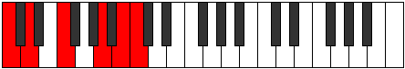

# Scale Aeolacritonic

## Links

- [Documentation](README.md)
- [Scales Index](Scales.md)
- [Modes Index](Modes.md)
- [Chords Index](Chords.md)

## Cardinality

5 Notes

## Perfection

- 2 Perfect Pitch
- 3 Imperfect Pitch
Perfection Profile - true, false, false, false, true

## Modes

| Number | Mode | Luminosity | Notes | Illustration | Audio |
|--------|------|------------|-------|--------------|-------|
| [301](https://ianring.com/musictheory/scales/301) | [Zythitonic](ModeZythitonic.md) | 4 | **C**, **D**, **D#**, F, G#, **C** |  | [midi](https://github.com/edipermadi/music/blob/main/docs/ModeCNaturalZythitonic.mid?raw=true) | 
| [721](https://ianring.com/musictheory/scales/721) | [Aeolacritonic](ModeAeolacritonic.md) | 5 | C, **E**, **F#**, **G**, A, C |  | [midi](https://github.com/edipermadi/music/blob/main/docs/ModeCNaturalAeolacritonic.mid?raw=true) | 
| [1099](https://ianring.com/musictheory/scales/1099) | [Dyritonic](ModeDyritonic.md) | -1 | **C**, **C#**, D#, F#, **A#**, **C** |  | [midi](https://github.com/edipermadi/music/blob/main/docs/ModeCNaturalDyritonic.mid?raw=true) | 
| [1673](https://ianring.com/musictheory/scales/1673) | [Thocritonic](ModeThocritonic.md) | -1 | C, D#, **G**, **A**, **A#**, C |  | [midi](https://github.com/edipermadi/music/blob/main/docs/ModeCNaturalThocritonic.mid?raw=true) | 
| [2597](https://ianring.com/musictheory/scales/2597) | [Koptitonic](ModeKoptitonic.md) | -1 | **C**, D, F, **A**, **B**, **C** |  | [midi](https://github.com/edipermadi/music/blob/main/docs/ModeCNaturalKoptitonic.mid?raw=true) | 
