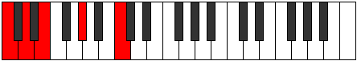
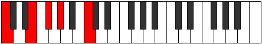

# Scale Aeolic

## Links

- [Documentation](README.md)
- [Scales Index](Scales.md)
- [Modes Index](Modes.md)
- [Chords Index](Chords.md)

## Cardinality

4 Notes

## Perfection

- 0 Perfect Pitch
- 4 Imperfect Pitch
- [false false false false] Perfection Profile

## Modes

| Number | Mode | Notes | Illustration | Audio |
|--------|------|-------|--------------|-------|
| [277](https://ianring.com/musictheory/scales/277) | [Mixolyric](ModeMixolyric.md) | **C**, **D**, **E**, **G#**, **C** |  | [midi](https://github.com/edipermadi/music/blob/main/docs/ModeCNaturalMixolyric.mid?raw=true) | 
| [337](https://ianring.com/musictheory/scales/337) | [Koptic](ModeKoptic.md) | **C**, **E**, **F#**, **G#**, **C** |  | [midi](https://github.com/edipermadi/music/blob/main/docs/ModeCNaturalKoptic.mid?raw=true) | 
| [1093](https://ianring.com/musictheory/scales/1093) | [Lydic](ModeLydic.md) | **C**, **D**, **F#**, **A#**, **C** |  | [midi](https://github.com/edipermadi/music/blob/main/docs/ModeCNaturalLydic.mid?raw=true) | 
| [1297](https://ianring.com/musictheory/scales/1297) | [Aeolic](ModeAeolic.md) | **C**, **E**, **G#**, **A#**, **C** |  | [midi](https://github.com/edipermadi/music/blob/main/docs/ModeCNaturalAeolic.mid?raw=true) | 
